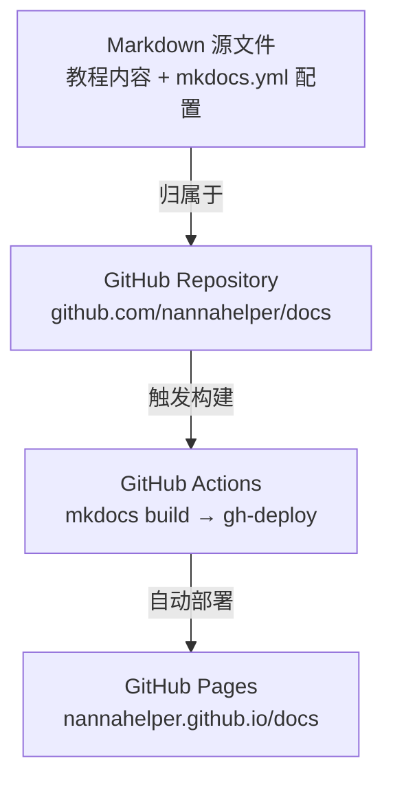

# 南哪助手应用教程汇总

> **南哪今天搓代码了吗？** —— 从零开始，用生活化比喻轻松掌握编程技能。

[](https://squidfunk.github.io/mkdocs-material/)
[](LICENSE)
[](https://nannahelper.github.io/docs/)

---

## 项目概述

**南哪助手应用教程汇总** 是一个面向零基础学习者的开源教程集合，旨在通过通俗易懂的生活化比喻、手把手的实操步骤和丰富的代码示例，帮助编程新手从零开始掌握现代软件开发的核心技能。

### 项目背景

在南哪学生社区中，我们发现大量同学对编程充满兴趣却苦于入门门槛过高——传统教程充斥着晦涩的专业术语、跳跃的知识结构，让初学者望而却步。本项目由此诞生，致力于打造一套 **"像朋友聊天一样学编程"** 的教程体系。

### 价值主张

- **零基础友好**：每个概念都配有生活化比喻，消除术语恐惧
- **手把手教学**：每一步都有验证方法，确保学习者能跟上节奏
- **实战导向**：每章配备实践任务，学完就能做出东西
- **持续更新**：基于学习者反馈不断迭代优化

---

## 教程内容

### 基础技能

> **工欲善其事，必先利其器** —— 软件开发的基础工具和文档写作方法。

#### Git 与 GitHub 团队协作指南

掌握版本控制和团队协作的核心技能，从单机操作到团队项目管理全覆盖。

| 章节 | 内容 |
|:---|:---|
| 认识版本控制 | Git 是什么、为什么需要版本控制 |
| 本地操作 | init、add、commit、log、.gitignore |
| 分支管理 | branch、checkout、merge、rebase |
| 远程操作 | clone、push、pull、fetch、remote |
| 团队协作 | Pull Request、Code Review、Fork 工作流 |
| 冲突解决 | merge conflict 的产生与解决 |
| 进阶自救 | reset、revert、stash、cherry-pick |
| 项目管理 | Projects、Discussions、敏捷开发实践 |

#### Markdown 新手指南

让文档写作像聊天一样简单。从零开始掌握 Markdown 标记语言，轻松写出结构清晰、排版美观的文档。

| 章节 | 内容 |
|:---|:---|
| 基础概念 | Markdown 的起源、设计哲学与工具链 |
| 核心语法 | 标题、段落、列表、链接、图片、代码 |
| 常用技巧 | 表格、任务列表、脚注、HTML 混用 |
| 实战案例 | 撰写项目 README、技术博客、会议纪要 |

#### LaTeX 新手指南

让学术写作变得优雅。从零开始掌握 LaTeX 排版系统，写出专业美观的论文、报告和简历。

| 章节 | 内容 |
|:---|:---|
| 基础概念 | LaTeX 的编译原理、文档结构与常用工具 |
| 核心语法 | 章节、文字格式、列表、表格、图片插入 |
| 常用技巧 | 数学公式、交叉引用、参考文献、宏定义 |
| 实战案例 | 撰写学术论文、制作简历、幻灯片 |

#### MkDocs 与 GitHub Pages 部署指南

从零搭建专业文档网站。使用 MkDocs Material 主题 + GitHub Pages + GitHub Actions，完成从环境搭建到线上自动部署的完整流程。

| 章节 | 内容 |
|:---|:---|
| 环境准备 | Python、pip、Git、VS Code 安装与验证 |
| MkDocs 入门 | 安装 MkDocs、创建项目、本地预览与热重载 |
| 配置详解 | mkdocs.yml 深度配置：导航、主题、功能开关、Markdown 扩展 |
| 内容创作 | 弹窗组件、代码块、标签页、表格、Mermaid 流程图 |
| 主题定制 | Material 主题配色、字体、Logo、自定义 CSS、插件 |
| 部署上线 | GitHub 仓库创建、GitHub Actions CI/CD、GitHub Pages 发布 |

#### Microsoft Word 高效使用指南

从文档排版到自动化，系统掌握 Word 的专业文档制作能力。适合已有基本操作经验的用户进阶提升。

| 章节 | 内容 |
|:---|:---|
| 文档结构与样式 | 样式系统、多级列表、导航窗格 |
| 排版与页面设置 | 分节符、页眉页脚、页面布局 |
| 表格与图表 | 表格设计、图表插入、题注管理 |
| 引用与目录 | 自动目录、脚注尾注、交叉引用 |
| 审阅与协作 | 修订模式、批注、比较文档 |
| 邮件合并 | 批量生成信函、标签、信封 |
| 模板与自动化 | 模板创建、域代码、宏录制 |
| 综合实战 | 完整商业报告从零到交付 |

#### Microsoft Excel 高效使用指南

从数据处理到交互式仪表盘，系统掌握 Excel 的数据分析核心技能。适合已有基本操作经验的用户进阶提升。

| 章节 | 内容 |
|:---|:---|
| 数据输入与格式化 | 数据验证、条件格式、自定义格式 |
| 公式与函数基础 | 单元格引用、逻辑函数、文本函数 |
| 数据分析工具 | 排序筛选、分类汇总、模拟分析 |
| 图表与可视化 | 图表类型选择、组合图、迷你图 |
| 数据透视表 | 透视表创建、切片器、计算字段 |
| 高级函数与数组公式 | XLOOKUP、INDEX-MATCH、动态数组 |
| 宏与 VBA 入门 | 录制宏、VBA 基础、自定义函数 |
| 综合实战 | 销售数据分析仪表盘从零搭建 |

#### Microsoft PowerPoint 高效使用指南

从幻灯片设计到演讲呈现，系统掌握专业演示文稿的制作与演讲技巧。适合已有基本操作经验的用户进阶提升。

| 章节 | 内容 |
|:---|:---|
| 幻灯片基础与设计原则 | CRAP 原则、版式系统、配色与字体 |
| 母版与模板 | 母版设计、自定义版式、模板创建 |
| 图形与多媒体 | SmartArt、图标、图片编辑、视频嵌入 |
| 动画与过渡 | 动画类型、时间线控制、Morph 过渡 |
| 数据图表展示 | 图表动画、表格美化、信息图设计 |
| 演讲者工具与演示技巧 | 演讲者视图、排练计时、快捷键 |
| 协作与共享 | 共同创作、导出选项、打包演示 |
| 综合实战 | 完整商业演示文稿从零到交付 |

---

### 编程语言

> **用代码表达思想** —— 系统学习编程语言的语法、核心概念和应用场景。

#### R 语言新手指南

让数据说话。从零开始掌握 R 语言，开启数据分析和统计建模之旅。

| 章节 | 内容 |
|:---|:---|
| 基础概念 | R 语言的特点、安装配置与 RStudio 使用 |
| 核心语法 | 向量、矩阵、列表、数据框、函数定义 |
| 常用技巧 | 数据清洗、ggplot2 绘图、统计分析 |
| 实战案例 | 完整数据分析项目：从导入到报告 |

#### MATLAB 新手指南

让数值计算触手可及。从零开始掌握 MATLAB，高效完成科学计算与工程仿真。

| 章节 | 内容 |
|:---|:---|
| 基础概念 | MATLAB 的定位、工作界面与基本操作 |
| 核心语法 | 矩阵运算、脚本、函数、流程控制 |
| 常用技巧 | 数据可视化、文件 I/O、数据分析 |
| 实战案例 | 信号处理、图像处理、数值分析综合案例 |

#### Java 新手指南

从"你好，世界"到企业级应用。掌握 Java 编程语言的核心语法与面向对象思想，开启软件开发之旅。

| 章节 | 内容 |
|:---|:---|
| 认识 Java | JDK 安装、Hello World、编译与运行 |
| 变量与数据类型 | 基本数据类型、变量声明、类型转换 |
| 运算符与表达式 | 算术、关系、逻辑运算符、表达式求值 |
| 控制流程 | if-else、switch、for、while 循环 |
| 方法与函数 | 方法定义、参数传递、返回值、重载 |
| 数组与字符串 | 数组操作、String 类、遍历与排序 |
| 面向对象（上） | 类与对象、构造方法、封装、this 关键字 |
| 面向对象（下） | 继承、多态、抽象类、接口 |
| 异常处理 | try-catch、throws、自定义异常 |
| 集合框架 | ArrayList、HashMap、泛型、遍历 |
| 文件 I/O | FileReader、BufferedReader、文件写入 |
| 综合项目 | 学生管理系统——从数据建模到增删改查全流程 |

#### Rust 新手指南

从"安全第一"到系统编程。掌握 Rust 的所有权模型与零成本抽象，开启高性能安全编程之旅。

| 章节 | 内容 |
|:---|:---|
| 认识 Rust | Rustup、Cargo、Hello World |
| 变量与数据类型 | 不可变性、基本类型、复合类型 |
| 所有权与借用 | 所有权转移、引用、借用规则——Rust 的灵魂 |
| 结构体与枚举 | struct、enum、方法定义、Option |
| 模式匹配 | match、if let、解构——Rust 的瑞士军刀 |
| 函数与错误处理 | 函数、闭包、Result、? 运算符 |
| 集合类型 | Vec、HashMap、String、迭代器 |
| 泛型与 Trait | 泛型函数、Trait 定义与实现 |
| 生命周期 | 生命周期标注、悬垂引用 |
| 模块与包管理 | mod、use、Cargo.toml、外部 crate |
| 测试与文档 | 单元测试、集成测试、文档测试 |
| 综合项目 | 命令行待办事项工具——从数据结构到文件持久化 |

---

### 技术领域

> **深入技术核心** —— 聚焦特定技术方向，掌握解决实际问题的技术栈。

#### 零基础入门 LLM API 开发与应用

从零开始学习大语言模型（LLM）API 的开发与应用，使用 Python 语言，适合完全没有编程基础的新手。

| 章节 | 内容 |
|:---|:---|
| 环境准备 | Python 安装、虚拟环境配置、API 密钥获取 |
| API 集成入门 | 第一个 API 调用程序、理解请求与响应 |
| 核心概念 | Token、Temperature、System Prompt 等关键概念 |
| Chatbot 实战 | 构建一个完整的命令行聊天机器人 |
| 批量处理 | 批量调用 API、处理大规模数据 |
| 安全与展望 | API Key 安全、成本控制、进阶方向 |

#### Linux 新手入门指南

用生活比喻轻松掌握命令行，消除对"黑窗口"的恐惧感。

| 章节 | 内容 |
|:---|:---|
| 认识 Linux | 遥控器 vs 语音控制——理解 Linux 哲学 |
| 搭建环境 | 虚拟机/WSL 安装，安全又简单 |
| 命令行初体验 | ls、cd、pwd 等基本命令 |
| 文件操作 | cp、mv、rm、find——整理数字抽屉 |
| 用户与权限 | chmod、chown——房间的钥匙和锁 |
| 实用技巧 | 管道、重定向、脚本自动化 |

#### 网络爬虫新手指南

从 HTTP 协议基础到工程化实战，掌握豆瓣电影 Top 250 全榜单数据抓取。

| 章节 | 内容 |
|:---|:---|
| 揭秘爬虫 | 浏览器背后的秘密——HTTP 协议入门 |
| 环境搭建 | requests、BeautifulSoup 库安装 |
| 精准解析 | CSS 选择器、XPath——像外科医生一样提取数据 |
| 数据持久化 | CSV、JSON、SQLite——将战利品存入仓库 |
| 应对反爬 | User-Agent、延时策略、代理 IP |
| 完整实战 | 抓取豆瓣 Top 250 全榜单 |

#### 前端入门指南

在 AI 工具日益普及的今天，虽然从零手写每一行代码的场景正在减少，但**阅读、理解和修改前端代码**的能力比以往任何时候都更加重要。本教程以"看懂代码"为核心目标，带你系统掌握 HTML5、CSS3 和 JavaScript 三大前端基石技术。

| 章节 | 内容 |
|:---|:---|
| HTML5 语义化 | 理解网页的骨架结构，能读懂任何网页的 HTML 源码 |
| CSS3 样式 | 掌握选择器、盒模型、颜色字体系统，理解页面美化原理 |
| CSS3 布局 | Flexbox、Grid 现代布局技术，响应式设计适配手机与电脑 |
| JavaScript 基础 | 变量、函数、数组、对象——建立编程思维 |
| DOM 与事件 | 用代码操控网页元素，响应用户的每一次交互 |
| 综合实战 | 从零构建一个完整的响应式个人主页 |

#### 神经网络与深度学习新手指南

从感知机到 Transformer，用直觉理解 AI 的核心引擎。专为零基础学习者设计，用生活化比喻和严谨逻辑带你从神经元走到大语言模型。

| 章节 | 内容 |
|:---|:---|
| 什么是神经网络 | 神经元 = 投票器，从生物神经元到人工神经元的数学抽象 |
| 梯度下降算法 | 盲人下山找最低点，网络如何从错误中学习 |
| 反向传播直觉理解 | 接力传话 + 责任追溯，误差如何传递回每一层 |
| 反向传播数学原理 | 链式法则如何驱动学习，多米诺骨牌连锁反应 |
| 大语言模型介绍 | LLM = 超级预测机，从预测下一个词到理解世界 |
| Transformer 架构 | LLM 的引擎如何运转，流水线工厂的每个组件 |
| 注意力机制 | 聚光灯如何聚焦关键信息，Q·K·V 的完整拆解 |
| LLM 如何记忆 | 图书馆索引，参数中的知识存储与检索 |

#### PyTorch 入门指南

基于 PyTorch 中文文档，在 15 小时教学框架内系统学习深度学习框架。从张量操作到完整项目实战，每个知识点配备详细示例代码。

| 章节 | 内容 |
|:---|:---|
| 张量基础操作 | 创建、索引、运算、形状变换——PyTorch 的核心数据结构 |
| 自动求导机制 | 计算图、梯度追踪、自动微分——训练神经网络的基础 |
| 构建神经网络 | nn.Module、网络层、激活函数、模型定义与参数管理 |
| 完整训练流程 | 前向传播、损失计算、反向传播、参数优化——五步训练法 |
| 数据加载与预处理 | Dataset、DataLoader、数据增强、批处理与多进程加载 |
| 优化器与损失函数 | SGD、Adam、交叉熵、MSE——选择合适的优化策略 |
| GPU 训练与性能优化 | CUDA 加速、混合精度训练、性能分析与调优 |
| 完整项目实战 | CIFAR-10 图像分类——从数据准备到模型部署的全流程 |

#### 线性规划与优化方法新手指南

从资源分配到单纯形法，用数学思维找到最优解。专为零基础学习者设计，系统讲解运筹学起源、线性规划建模、图解法、标准形式、单纯形法原理与实现。

| 章节 | 内容 |
|:---|:---|
| 运筹学与线性规划概述 | Operations Research 的起源，优化问题的分类 |
| 数学基础回顾 | 向量范数、矩阵秩、梯度、海森矩阵、凸集 |
| 线性规划数学模型 | 决策变量、目标函数、约束条件的构建方法 |
| 图解法 | 可行域、等值线、四种解的分类 |
| 标准形式与灵敏度分析 | 松弛变量、影子价格、参数敏感度 |
| 单纯形法原理 | 检验数、换入换出、旋转运算的直觉理解 |
| 表格单纯形法与进阶 | 表格迭代、人工变量法、两阶段法 |

#### Docker 新手指南

从"在我机器上能跑"到"到处都能跑"。掌握 Docker 容器技术，用集装箱思维解决环境一致性难题，开启现代化部署之旅。

| 章节 | 内容 |
|:---|:---|
| 认识 Docker | 容器 vs 虚拟机、镜像/容器/仓库三大核心概念 |
| 环境搭建 | Docker Desktop 安装、Hello World 验证、Nginx 初体验 |
| 镜像与容器 | pull、run、ps、logs、exec、cp——日常操作全掌握 |
| Dockerfile | FROM、RUN、COPY、CMD——编写镜像的"配方说明书" |
| 数据管理 | Volume、Bind Mount——让数据"活"在容器之外 |
| 网络管理 | Bridge 网络、自定义网络、容器间 DNS 解析 |
| Docker Compose | 一键编排多容器应用，告别手动逐个启动 |
| 综合实战 | Nginx + Flask + MySQL 全栈应用容器化部署 |

---

### 计算机等级考试

> **系统备考，从容应试** —— 以 NCRE 三级考试大纲为依据，用生活化比喻拆解抽象概念。

#### 三级网络技术

从"两台电脑怎么通信"到"全球互联网如何运转"，系统掌握计算机网络体系结构、协议原理和实用技术。

| 章节 | 内容 |
|:---|:---|
| 网络体系结构 | OSI 七层模型、TCP/IP 四层模型、分层思想 |
| 物理层与数据链路层 | 传输介质、帧结构、差错控制、CSMA/CD |
| 网络层——IP 地址 | IP 地址分类、子网划分、CIDR、NAT |
| 网络层——路由协议 | RIP、OSPF、BGP、路由表与最长前缀匹配 |
| 传输层 | TCP 三次握手、流量控制、UDP |
| 应用层 | DNS、HTTP/HTTPS、FTP、Email |
| 局域网与无线网络 | 以太网、VLAN、Wi-Fi 标准 |
| 网络安全与模拟测试 | 防火墙、加密技术、综合模拟题 |

#### 三级信息安全

从"我的密码安全吗"到"如何构建纵深防御体系"，覆盖信息安全全链条核心知识。

| 章节 | 内容 |
|:---|:---|
| 信息安全概述 | CIA 三要素、威胁与脆弱性、纵深防御 |
| 密码学基础 | 对称/非对称加密、哈希函数、数字签名 |
| 身份认证与访问控制 | 认证方式、RBAC、Kerberos |
| 网络安全 | 防火墙、IDS/IPS、VPN、DDoS 防御 |
| 系统安全 | 操作系统安全、恶意代码、漏洞管理 |
| 应用安全 | SQL 注入、XSS、CSRF、文件上传漏洞 |
| 安全管理 | 风险评估、安全策略、应急响应 |
| 综合实战与模拟测试 | 综合案例、模拟试题、考前冲刺 |

#### 三级嵌入式系统

从"单片机是什么"到"设计一个完整的嵌入式系统"，软硬结合掌握嵌入式核心技术。

| 章节 | 内容 |
|:---|:---|
| 嵌入式系统概述 | 定义、特点、应用领域、发展趋势 |
| 嵌入式处理器 | ARM 架构、Cortex-M/A/R 系列、哈佛结构 |
| 嵌入式操作系统 | RTOS、任务调度、FreeRTOS、μC/OS |
| 嵌入式软件开发 | 交叉编译、启动代码、Bootloader |
| 接口与通信技术 | GPIO、UART、SPI、I2C、中断 |
| 嵌入式网络与物联网 | Wi-Fi、BLE、Zigbee、MQTT |
| 低功耗与可靠性设计 | 电源管理、看门狗、EMC |
| 综合实战与模拟测试 | 综合案例、模拟试题、考前冲刺 |

---

### 工程实践

> **从写代码到做工程** —— 掌握软件工程方法论，提升项目管理和团队协作能力。

#### 《人月神话》软件工程入门

以 Fred Brooks 的经典著作《人月神话》为蓝本，系统讲解软件工程的核心思想与实践。

| 章节 | 内容 |
|:---|:---|
| 焦油坑 | 编程的乐趣与苦恼 |
| 人月神话 | 为什么加人不能加速项目 |
| 外科手术队伍 | 高效团队的组织方式 |
| 没有银弹 | 软件工程的本质困难 |
| ... | 共 19 章完整解读 |

---

## 技术架构

### 技术栈

| 层级 | 技术选型 | 说明 |
|:---|:---|:---|
| 静态站点生成 | [MkDocs](https://www.mkdocs.org/) | Python 生态最流行的文档生成器 |
| 主题 | [Material for MkDocs](https://squidfunk.github.io/mkdocs-material/) | 功能丰富的 Material Design 主题 |
| 托管部署 | [GitHub Pages](https://pages.github.com/) | 免费、稳定的静态站点托管 |
| 内容格式 | Markdown | 简洁、易读、版本控制友好 |
| CI/CD | GitHub Actions | 自动构建与部署 |

### 项目结构

```
docs/
├── mkdocs.yml                  # MkDocs 配置文件（站点导航、主题、插件）
├── requirements.txt            # Python 依赖清单
├── README.md                   # 项目说明文档
├── .gitignore                  # Git 忽略规则
├── prompt.md                   # AI 辅助写作的 Prompt 模板
└── docs/                       # 文档内容目录
    ├── index.md                # 站点首页
    ├── categories/             # 分类索引页面
    │   ├── basic-skills.md
    │   ├── programming-languages.md
    │   ├── technical-domains.md
    │   └── engineering-practice.md
    ├── assets/                 # 静态资源（截图、图片等）
    ├── llm_from_zero_with_python/   # LLM API 开发教程
    ├── git_github_from_zero/        # Git 与 GitHub 教程
    ├── linux_from_zero/             # Linux 入门教程
    ├── web-crawler-from-zero/       # 网络爬虫教程
    ├── frontend-from-zero/          # 前端入门指南
    ├── mythical_man_month/          # 《人月神话》解读
    ├── markdown-from-zero/          # Markdown 新手指南
    ├── latex-from-zero/             # LaTeX 新手指南
    ├── r-from-zero/                 # R 语言新手指南
    ├── matlab-from-zero/            # MATLAB 新手指南
    └── mkdocs-from-zero/            # MkDocs 与 GitHub Pages 部署指南
```

### 架构设计



---

## 环境配置与安装

### 前置要求

- Python 3.9 或更高版本
- Git（用于版本控制和协作）
- pip（Python 包管理器，通常随 Python 一起安装）

### 本地运行

```bash
# 1. 克隆仓库
git clone https://github.com/nannahelper/docs.git
cd docs

# 2. 创建虚拟环境（推荐）
python -m venv .venv

# 3. 激活虚拟环境
# Windows:
.venv\Scripts\activate
# macOS / Linux:
source .venv/bin/activate

# 4. 安装依赖
pip install -r requirements.txt

# 5. 启动本地预览服务器
mkdocs serve
```

启动后，在浏览器中访问 `http://127.0.0.1:8000` 即可预览站点。修改文档内容后，浏览器会自动刷新。

### 构建静态站点

```bash
mkdocs build
```

构建产物将输出到 `site/` 目录，可直接部署到任意静态文件服务器。

---

## 使用指南

### 在线阅读

直接访问在线站点：**[https://nannahelper.github.io/docs/](https://nannahelper.github.io/docs/)**

### 本地阅读

按照上述"环境配置与安装"步骤启动本地服务器后，在浏览器中阅读。

### 贡献教程内容

如果你想为项目贡献新的教程或改进现有内容：

```bash
# 1. Fork 本仓库

# 2. 克隆你的 Fork
git clone https://github.com/YOUR_USERNAME/docs.git
cd docs

# 3. 创建功能分支
git checkout -b feature/my-tutorial

# 4. 编写内容
# 在 docs/ 目录下创建新的教程文件夹
# 在 mkdocs.yml 的 nav 部分添加导航配置

# 5. 本地预览
mkdocs serve

# 6. 提交更改
git add .
git commit -m "docs: add my-tutorial"

# 7. 推送分支
git push origin feature/my-tutorial

# 8. 在 GitHub 上创建 Pull Request
```

### 写作规范

本项目遵循严格的排版规范，确保所有教程风格统一：

- **标题层级**：一级标题带趣味副标题，二级标题带数字标号
- **术语解释**：使用 `!!! info` 弹窗解释专业术语
- **生活化比喻**：使用 `!!! example` 弹窗提供类比理解
- **避坑指南**：使用 `!!! tip` / `!!! warning` 弹窗标注注意事项
- **多系统适配**：使用 Tabbed Content 语法区分 Windows/macOS 操作
- **代码注释**：所有代码块必须包含详细的中文注释

详细的写作规范请参考 [prompt.md](prompt.md)。

---

## 常见问题

### Q: 我完全没有编程基础，能学会吗？

A: 完全可以！本项目的核心理念就是"零基础友好"。每个概念都配有生活化比喻，每一步都有验证方法。建议从 LLM API 开发或 Linux 入门开始。

### Q: 教程内容会定期更新吗？

A: 会的。我们根据技术发展和学习者反馈持续更新教程内容。欢迎通过 Issue 或 PR 提出改进建议。

### Q: 如何报告教程中的错误？

A: 请在 [GitHub Issues](https://github.com/nannahelper/docs/issues) 中提交问题，描述错误位置和具体内容，我们会尽快修复。

### Q: 可以离线阅读吗？

A: 可以。克隆仓库后使用 `mkdocs serve` 启动本地服务器即可离线阅读。也可以使用 `mkdocs build` 生成静态文件。

### Q: 教程中的代码示例可以直接使用吗？

A: 可以。所有代码示例均经过验证，可直接复制运行。但请注意 API 调用可能产生费用，建议先了解相关平台的定价策略。

---

## 贡献指南

我们欢迎所有形式的贡献！无论是修正错别字、改进比喻、添加新章节，还是创建全新的教程。

### 贡献方式

1. **报告问题**：在 [Issues](https://github.com/nannahelper/docs/issues) 中提交 Bug 报告或功能建议
2. **改进内容**：Fork 仓库 → 修改 → 提交 Pull Request
3. **新增教程**：按照现有教程的结构创建新内容，确保遵循写作规范
4. **补充截图**：为教程添加操作截图，存放于 `docs/assets/` 目录

### 提交规范

- 提交信息格式：`docs: 简短描述` 或 `fix: 简短描述`
- 一个 PR 只做一件事，保持变更聚焦
- 新增教程需同步更新 `mkdocs.yml` 中的导航配置
- 确保本地 `mkdocs serve` 预览无报错

### 代码审查

所有 Pull Request 需要经过至少一位维护者审查后才能合并。审查重点包括：

- 内容准确性和教学逻辑
- 排版格式是否符合规范
- 代码示例是否可运行
- 比喻是否恰当易懂

---

## 开源许可

本项目采用 [MIT License](LICENSE) 开源协议。你可以自由地使用、修改和分发本项目的内容，但需保留原始版权声明。

---

## 致谢

- [MkDocs](https://www.mkdocs.org/) 和 [Material for MkDocs](https://squidfunk.github.io/mkdocs-material/) 提供了优秀的文档框架
- [GitHub Pages](https://pages.github.com/) 提供了免费的站点托管
- 所有为本项目贡献内容的开发者们

---

**准备好开始你的学习之旅了吗？** [进入教程首页 →](https://nannahelper.github.io/docs/)
