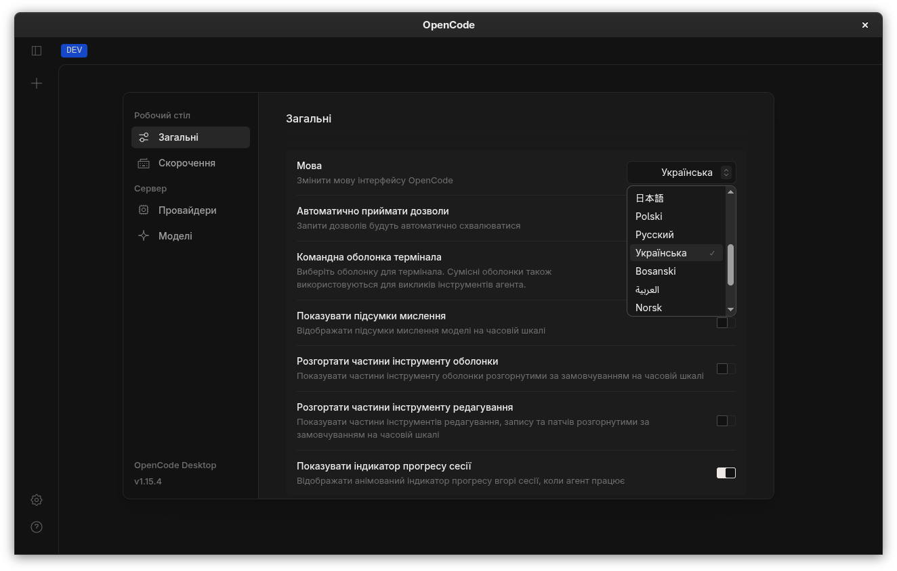

# 第 2 章：OpenCode Desktop 接入 DeepSeek — 给协作者发工作证

## 📋 本章概览

| 项目 | 内容 |
|:---|:---|
| 学习时长 | 45 分钟 |
| 核心概念 | Desktop、Provider、API Key、模型、项目目录 |
| 核心比喻 | API Key 是工作证，Provider 是对接窗口，模型是具体协作者 |
| 实践任务 | 用 OpenCode Desktop 完成一次只读项目分析 |
| 难度等级 | ★★☆☆☆ |

## 2.1 安装 OpenCode Desktop

从 [OpenCode 官方下载页](https://dev.opencode.ai/download) 选择对应系统版本。Windows 用户下载 Windows x64，macOS 用户按 Apple Silicon 或 Intel 选择。

安装完成后打开 OpenCode Desktop，并选择一个不包含密钥的测试项目目录。

## 2.2 创建并保护 DeepSeek API Key

在 [DeepSeek 开放平台](https://platform.deepseek.com/) 创建 API Key。复制后只放入 OpenCode 的凭据输入框或本地安全存储中。

!!! danger "密钥规则"
    不要把真实 API Key 写进 Markdown、`opencode.json`、`.env.example`、截图、终端录屏或 Git 提交。示例只使用 `sk-your-key` 这样的占位符。

## 2.3 在 GUI 中连接 Provider

OpenCode 的官方流程是：

1. 在应用中打开项目目录。
2. 使用连接 Provider 的入口，选择 DeepSeek。
3. 粘贴 API Key，并确认保存位置是应用的凭据存储，而不是项目文件。
4. 打开模型选择器，选择当前账号可用的 DeepSeek 模型。
5. 先发送只读任务，例如“列出这个项目的目录结构，不要修改文件”。

DeepSeek 的 OpenAI 兼容 Base URL 是 `https://api.deepseek.com`；具体模型名称和可用性以官方控制台为准。



> 上图来自 [OpenCode 官方仓库](https://github.com/anomalyco/opencode) 的公开截图，用于帮助定位设置、Provider 和模型入口；当前版本的界面布局和语言可能不同，请以你安装的版本为准。

## 2.4 第一次安全验证

```text
请只读取当前项目的 README.md，概括项目用途和运行命令。
不要修改任何文件，不要执行安装、删除、提交或联网操作。
完成后列出你读取过的文件，并等待我确认下一步。
```

## ✅ 验证步骤

确认 Agent 能回答项目问题；检查 Git 工作区没有变化；在 OpenCode 的凭据或设置界面确认密钥没有显示在项目文件中。若出现 401，先检查 Key 和 Provider；若出现 402，检查余额和计费状态；不要反复盲目重试。

## 📝 本章总结

- Desktop 适合可视化管理项目、模型和权限。
- API Key 应存放在凭据管理位置，不能进入代码库。
- 第一次调用应从只读任务开始，再逐步开放能力。

## ✏️ 课后练习

1. 用只读任务让 Agent 解释一个小项目的入口文件。
2. 关闭应用后重新打开，确认凭据仍可用且没有出现在项目目录。

## 🔮 下一章预告

下一章会用 OpenCode CLI 在终端中执行同一个任务，并比较 GUI 与 CLI 的差异。
