# 第 1 章：计算机网络与因特网 —— 从端系统到协议栈的万里长征

> 因特网是人类迄今建造的最大规模的工程系统：数百亿台设备、数不清的通信链路与交换机、数十亿用户。面对如此庞大而复杂的系统，有没有一条理解它的主线？有——**先看整体（网络边缘 → 网络核心），再看度量（时延、丢失、吞吐量），最后看法则（分层协议栈）**。本章就是这条主线的全景图，也是全书的地基。

---

## 📋 本章导览

| 项目 | 内容 |
|:---|:---|
| **课时建议** | 8-10 课时（408 一轮复习建议 2-3 天） |
| **教学目标** | ① 掌握因特网的部件视角与服务视角；② 理解分组交换与电路交换的原理及性能对比；③ 掌握四种时延、流量强度与吞吐量的定量计算；④ 理解五层协议栈、OSI 七层与封装过程；⑤ 了解常见网络攻击与因特网发展简史 |
| **教学重点** | 分组交换（存储转发）、四种时延公式、协议分层与封装、网络之网（ISP 层级） |
| **教学难点** | 排队时延与流量强度、分组 vs 电路交换的拥塞概率分析、端到端吞吐量的瓶颈链路判定 |
| **考点映射** | 408 考点：分组交换/报文交换性能分析（4 次：2023#33、2013#35、2010#34、2024#33）；OSI 参考模型各层功能（8 次：2022#33、2019#33、2016#33 等）；TCP/IP 模型层次与协议关系（5 次：2021#33、2018#33 等）；物理层补充（奈氏准则 2009/2022/2023、香农定理 2016、奈氏香农对比 2017、波特率与比特率转化 2011、物理层设备冲突域/广播域 2010/2020，见 1.9 节） |
| **习题配置** | 例题 6 道（含 1.9 节补充 2 道）+ A 基础 5 题 + B 提高 3 题 + C 拓展 2 题 + 原书习题讲解 4 道 |

<a class="route-step" href="#11">01<strong>什么是因特网</strong><small>部件、服务与协议三种视角</small></a>
<a class="route-step" href="#12">02<strong>网络边缘</strong><small>端系统、接入网与物理介质</small></a>
<a class="route-step" href="#13">03<strong>网络核心</strong><small>分组交换、电路交换与 ISP</small></a>
<a class="route-step" href="#14">04<strong>性能指标</strong><small>时延、丢失、吞吐量与排队</small></a>
<a class="route-step" href="#15">05<strong>协议分层</strong><small>协议栈、服务模型与封装</small></a>
<a class="route-step" href="#16">06<strong>网络攻击</strong><small>恶意软件、DDoS 与嗅探</small></a>
<a class="route-step" href="#17">07<strong>发展历史</strong><small>从早期网络到今天的因特网</small></a>
<a class="route-step" href="#19-408">09<strong>物理层补充</strong><small>408 考纲中的编码与信道</small></a>

点击卡片跳转到对应小节。本路线图只负责定位，公式、例题和考点在正文中展开。

---

## 1.1 什么是因特网

什么是因特网？本书给出两个视角：**部件视角（nuts-and-bolts）** 回答「因特网由什么构成」，**服务视角（services）** 回答「因特网为应用提供什么」。前者看硬件与软件零件，后者看基础设施与应用程序的关系。两条线索贯穿全书。

### 部件视角：硬件与软件组件

因特网是一个互联了 **数十亿** 台计算设备的计算机网络。这些设备早已不限于桌面电脑：智能手机、平板、电视、游戏机、恒温器、家庭安防系统、手表、眼镜、汽车，甚至尿布，都在接入网络。在网络术语中，所有这些设备统称为 **主机（host）** 或 **端系统（end system）**。二者是同义词，全书中互换使用。

端系统之间通过 **通信链路（communication link）** 与 **分组交换机（packet switch）** 相互连接。通信链路种类繁多（同轴电缆、铜线、光纤、无线频谱），不同链路以不同的 **传输速率（transmission rate）** 传输数据，单位是 bit/s（比特/秒）。当一端系统要向另一端系统发送数据时，发送方将数据切分成小块，并为每块附加首部字节，这些打包后的信息块称为 **分组（packet）**；分组在网中逐跳转发，到达目的地后重组为原始数据。

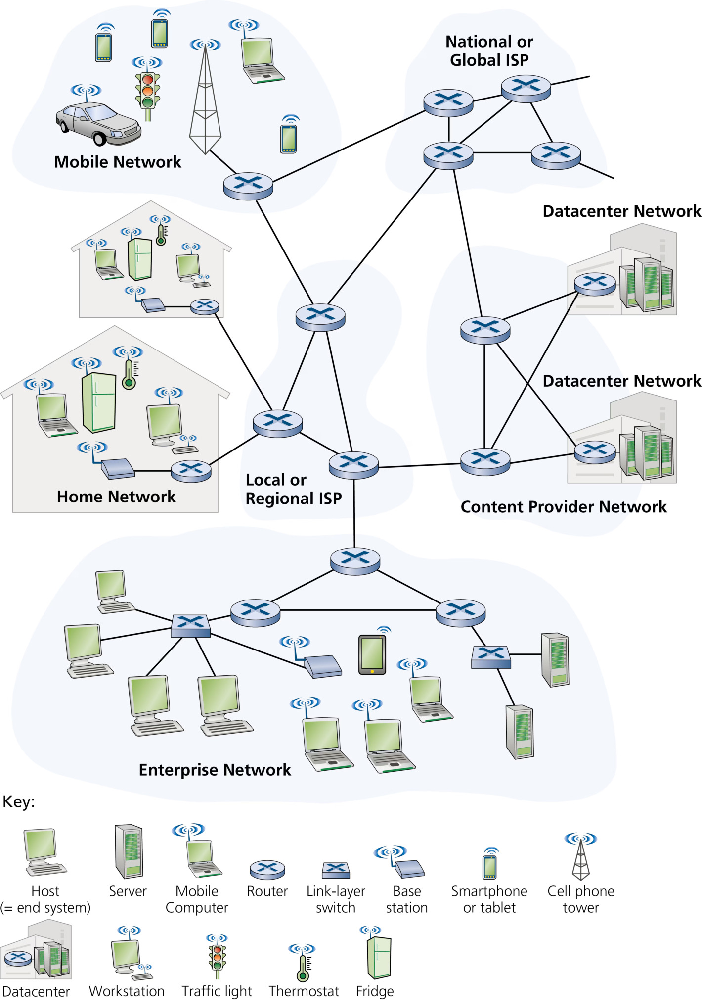

分组交换机负责把到达某条入链路上的分组，转发到某条出链路上。最常见的两类分组交换机是 **路由器（router）** 与 **链路层交换机（link-layer switch）**：链路层交换机多用于接入网，路由器多用于网络核心。分组从源端系统到目的端系统所经过的链路与交换机序列称为 **路由（route）** 或 **路径（path）**。

分组交换网络与公路运输网络惊人地相似：分组好比卡车，通信链路好比公路，分组交换机好比交叉路口，端系统好比建筑。工厂把大宗货物（数据）分段装进车队（分组），每辆卡车独立行驶（转发），在目的地仓库重新组货（重组）。这个类比贯穿全书，请务必建立直觉。

端系统通过 **因特网服务提供商（ISP，Internet Service Provider）** 接入因特网：住宅 ISP（本地有线电视或电话公司）、公司 ISP、大学 ISP、机场酒店咖啡馆的公共 WiFi ISP、为手机提供移动接入的蜂窝数据 ISP，种类繁多。每个 ISP 本身就是一个由分组交换机与通信链路组成的网络，并遵循统一的命名与地址约定。低层 ISP 通过国家/国际高层 ISP 互联，高层 ISP 之间再直接互联——**「网络的网络」** 是理解因特网结构的关键（详见 1.3.3）。

端系统、分组交换机等所有部件都运行着控制信息收发行为的 **协议（protocol）**。因特网最重要的两个协议是 **传输控制协议（TCP）** 与 **网际协议（IP）**：IP 规定分组（在网际层称为数据报）在路由器与端系统之间收发的格式；因特网的主要协议统称 **TCP/IP**。协议要互通，标准就必不可少。因特网标准由 **因特网工程任务组（IETF，Internet Engineering Task Force）** 制定，其标准文档称为 **RFC（Request for Comments，请求评论）**，至今已发布近一万份，定义了 TCP、IP、HTTP（Web）、SMTP（电子邮件）等协议。链路相关的标准则由 IEEE 802 局域网标准委员会等机构制定。

### 服务视角：为分布式应用提供基础设施

换个角度：因特网是 **为应用程序提供服务的通信基础设施**。电子邮件、Web 浏览、手机即时消息、实时路况地图、音乐与影视流媒体、在线社交、视频会议、多人在线游戏、基于位置的服务……这些应用之所以称为 **分布式应用（distributed application）**，是因为它们涉及多个相互交换数据的端系统。

**关键洞察：应用程序运行在端系统上，绝不在网络核心的分组交换机上运行。** 分组交换机只负责在端系统之间搬运数据，不关心数据承载的是哪个应用。

那么，一个端系统上的程序如何让因特网把数据送给另一个端系统上的程序？答案是通过 **套接字接口（socket interface）**。端系统向应用程序提供套接字接口，规定发送程序必须遵循的一组规则，因特网据此把数据送达目的程序。这与邮政服务完全类比：Alice 给 Bob 寄信，不能把信扔出窗外，而必须装入信封、写全收件人姓名地址邮编、封口、贴邮票、投进邮筒——邮政服务有自己的一套「接口规则」。因特网同样提供多种服务（如可靠交付、尽力而为），应用开发者必须为自己的应用选择合适的服务。套接字接口在第二章详述。

### 什么是协议（Protocol）

协议是计算机网络领域最核心的术语。理解协议的最好方式，先看人类协议。

考虑问时间的场景：你向陌生人说「Hi」（发起通信的消息），对方回「Hi」（表明可以继续交流），你再问时间，对方回答。如果对方回应「别烦我！」，你就不会问时间。注意：这里存在 **具体发送的消息、收到回复后采取的具体动作**——这正是协议的本质。再如课堂提问：老师问「有没有问题？」，你举手（隐式消息），老师微笑示意（鼓励消息），你提问（发送消息），老师回答（回复消息）。两个例子都说明：**消息的发送与接收，以及伴随消息收发所采取的动作，是协议的核心要素。**

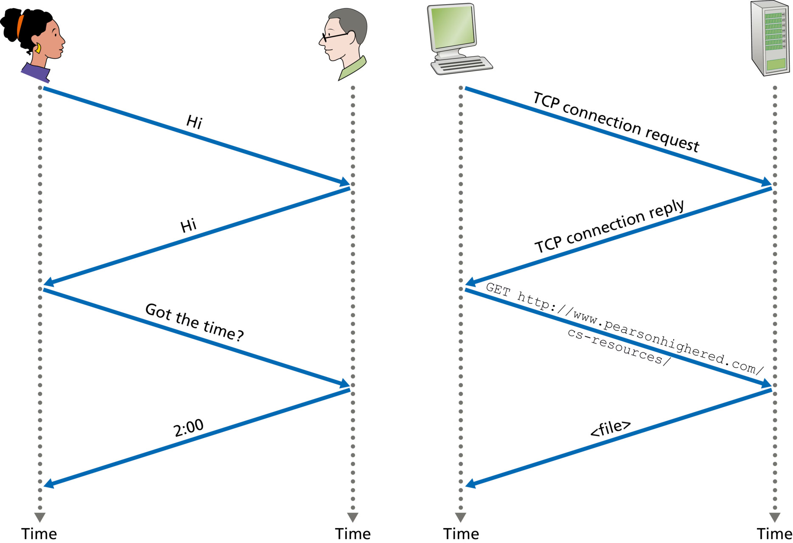

右半部分展示了一个你熟悉的网络协议场景：计算机向 Web 服务器发送连接请求消息并等待回复；服务器收到后返回连接应答；随后计算机发送 GET 消息索取网页；最后服务器返回网页文件。可见，网络协议与人际协议遵循同样的「消息 + 动作」模式。

网络协议与人际协议的唯一区别是：交换消息并采取动作的实体是硬件或软件组件。因特网中所有涉及两个及以上远程实体的活动都由协议支配：硬件协议控制网卡之间比特流的传输，拥塞控制协议控制发送速率，路由器中的协议决定分组路径。

!!! info "定义：协议（Protocol）"

    **英文原文（权威定义）：**

    > A protocol defines the **format** and the **order** of messages exchanged between two or more communicating entities, as well as the **actions taken** on the transmission and/or receipt of a message or other event.

    **中文解释：** 协议定义了 **两个或多个通信实体之间交换消息的格式与次序**，以及 **消息发送/接收或其他事件发生时采取的动作**。三个要素缺一不可：格式（消息长什么样）、次序（谁先谁后）、动作（收到后做什么）。只有通信双方运行 **同一协议** 才能完成任务——就像两个语言不通的人无法交流一样。

以 Web 请求为例：你的计算机先向 Web 服务器发送连接请求消息并等待回复；服务器收到后返回连接应答；你的计算机随后发送 GET 消息索取页面；最后服务器返回网页文件。整个过程由 HTTP 协议支配。可以说，**掌握计算机网络 = 理解各种网络协议的 what、why 与 how**。

---

## 1.2 网络边缘

端系统位于因特网的边缘。除传统桌面机、服务器（Web 服务器、邮件服务器）与移动设备外，越来越多的非传统「物」也在接入（见 Case History）。**主机** 还可分为两类：**客户端（client）** 与 **服务器（server）**。客户端通常是桌面机、笔记本、智能手机等，服务器则是存储并分发网页、流媒体视频、转发电子邮件等功能更强大的机器。今天绝大多数服务器都栖身于大型 **数据中心（data center）**——例如 2024 年底谷歌在全球四大洲拥有数据中心，共容纳数百万台服务器。

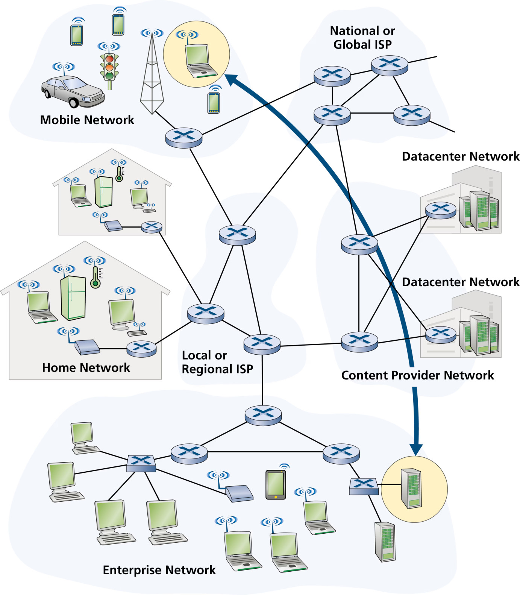

### Case History：数据中心与云计算

谷歌、微软、亚马逊、阿里等互联网公司建起了容纳数万至数十万台主机的巨型数据中心。数据中心不仅是接入因特网的节点，其内部本身就有复杂的计算机网络互连各主机，它们是日常互联网应用的「发动机」。数据中心大致承担三类职责（以亚马逊为例）：① 向用户提供电商页面；② 作为大规模并行计算基础设施处理内部数据；③ **向其他公司提供云计算**——如 Airbnb 等公司不拥有自建数据中心，整个 Web 服务直接跑在亚马逊的 AWS 云上。数据中心内的「工蜂」是主机（称为刀片服务器 blade，形似披萨盒），堆叠在机架中，由不断演进的数据中心网络互连（详见第六章）。

### 接入网：Access Networks

**接入网（access network）** 是把端系统物理连接到第一台路由器（又称 **边缘路由器 edge router**）的网络，是从端系统通往任何远端端系统路径上的第一段。

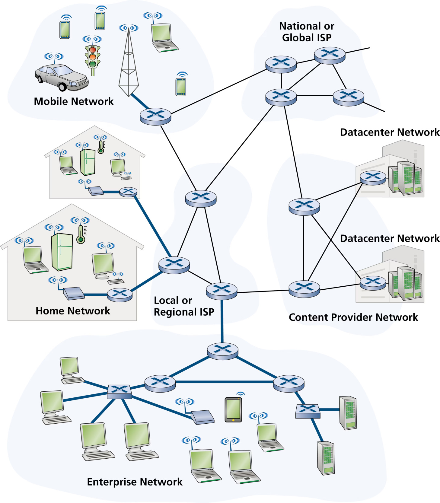

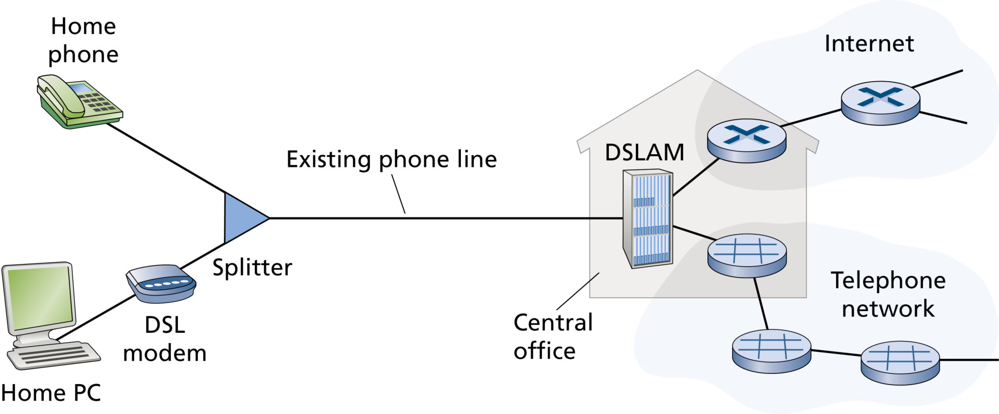

**① 数字用户线（DSL）。** 住宅 DSL 由本地电话公司提供，客户电话公司即其 ISP。住户的 **DSL 调制解调器** 利用现有电话线，与电话公司中心局（CO，central office）内的 **DSL 接入复用器（DSLAM，DSL Access Multiplexer）** 交换数据：家用调制解调器把数字数据调制成高频音调经电话线送到中心局，DSLAM 再把众多家庭传来的模拟信号还原为数字格式。电话线同时承载数据与传统电话信号，按频率划分：高速下行信道、中速上行信道、普通双向电话信道——单条 DSL 链路被分成三条独立信道，电话与上网可同时进行，这就是 **频分复用（FDM）** 的雏形（1.3.2 详述）。DSL 是非对称的（下行速率高于上行），最新标准在短距离内下行可达数百 Mbps；实际速率受限于住宅与中心局的距离（一般需在 5-10 公里内）、双绞线线径与电磁干扰程度。

**② 电缆因特网接入（HFC）。** 电缆接入利用有线电视公司的现有电视基础设施：光纤把电缆头端（head end）连接到街区级结点，再由传统同轴电缆到达各家各户，因此称 **混合光纤同轴（HFC，Hybrid Fiber Coax）**。每家需要 **电缆调制解调器（cable modem）**；头端的 **电缆调制解调器端接系统（CMTS）** 起类似 DSLAM 的作用。HFC 也划分下行与上行信道、通常非对称，DOCSIS 标准定义了数十 Mbps 至 Gbps 级速率。

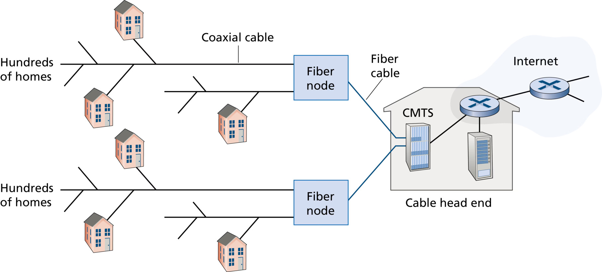

**HFC 的关键特性：共享广播介质。** 头端发送的每个分组沿每条链路下行到达每个家庭；每个家庭发送的分组沿上行信道到达头端。因此若多个用户同时下行下载视频，各用户实际速率会显著低于聚合速率；若只有少数用户且都在浏览网页，每个用户几乎总能以全速获取页面（因为同时请求页面的概率很低）。上行信道同样共享，需要分布式多路访问协议协调传输、避免碰撞（第六章详述）。

**③ 光纤到户（FTTH）。** DSL 与电缆仍是主流，但 FTTH 提供更高速度：从中心局直接铺设光缆到家庭，理论上可达 Gbps 级。光分配网络有三种架构：**直接光纤**（每户一根光纤）、**有源光网络（AON）**（本质是交换式以太网）、**无源光网络（PON）**。PON 结构（如 Verizon 的 FiOS）：每户一个 **光网络端接器（ONT）**，经专用光纤连到街区 **分路器（splitter）**，分路器把最多数十户合并到一根共享光纤，再连到中心局的 **光线路端接器（OLT）**；OLT 完成光电转换并接电信路由器。PON 中 OLT 发往分路器的所有分组会在分路器被复制（与电缆头端相似）。

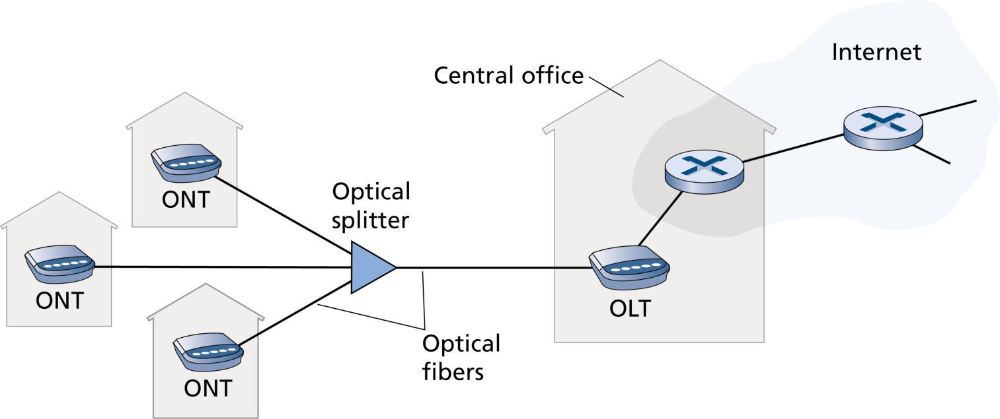

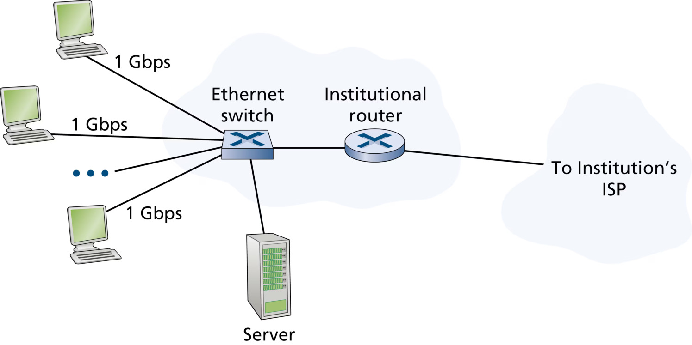

**④ 固定无线（FWI）与 LEO 卫星。** 固定无线利用波束成形技术，从提供商基站无线发送数据到家中调制解调器，无需铺设昂贵易损的电缆。此外，**低地球轨道（LEO）卫星**（如 SpaceX 的 Starlink）正越来越多地用于农村与偏远地区宽带接入，其信号传播时延远低于地球静止轨道卫星。

**⑤ 以太网与 WiFi。** 在校园与公司，**局域网（LAN）** 把端系统连到边缘路由器，以太网是主流接入技术：用户用双绞铜线连接 **以太网交换机**，通常拥有 10 Mbps 至数十 Gbps 的接入速率。

无线场景中，用户通过 **接入点（access point）** 收发分组，接入点以有线以太网接入企业网络；无线用户须在接入点数米至数十米范围内。基于 IEEE 802.11 标准的 **WiFi** 已无处不在：校园、办公楼、咖啡馆、机场、家庭乃至飞机上，新一代标准提供超过 1 Gbps 的共享传输速率。家庭网络常把电缆/DSL 宽带与 WiFi 组合：一台无线接入点 + 一台家用路由器，让全家共享宽带、随时漫游。

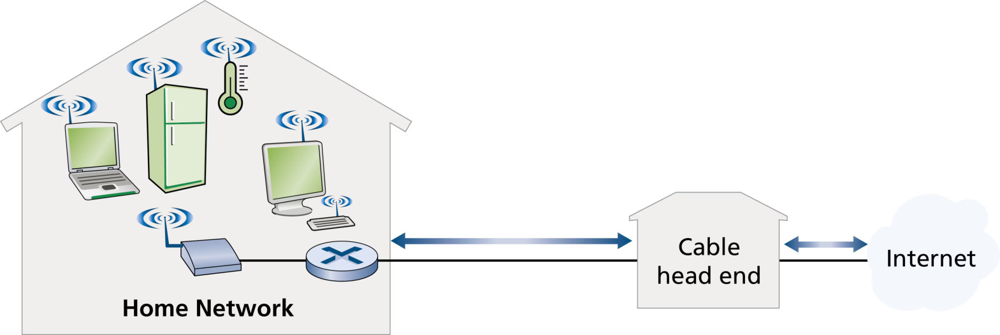

**⑥ 广域无线：4G 与 5G。** 手机等移动设备复用蜂窝电话的无线基础设施，通过蜂窝网络运营商运营的 **基站（base station）** 收发分组。与 WiFi 不同，用户只需在基站数十公里范围内（而非数十米）。电信公司已大规模部署 **第四代（4G）** 无线，实际下载速率可达数十 Mbps；**第五代（5G）** 正快速部署，速率更高。无线网络与移动性的基本原理将在第七章详述。

### 物理介质：Physical Media

一个比特从源端系统出发，途经一系列链路与路由器到达目的端系统，其间无数次被「踢来踢去」：源端系统发送比特 → 第一台路由器接收后转发 → 第二台路由器接收……每对收发器之间，比特以电磁波或光脉冲形式穿越 **物理介质（physical medium）**。物理介质分两类：

- **导引型介质（guided media）**：波沿固体介质传播，如光纤、双绞铜线、同轴电缆。
- **非导引型介质（unguided media）**：波在大气与太空中传播，如无线局域网、卫星信道。

**双绞铜线（twisted-pair copper wire）** 是最廉价、最常用的导引型介质，一百多年来用于电话网。两根约 1 mm 粗的绝缘铜线螺旋绞合，以降低邻近线对的电磁干扰；若干线对包在保护层中形成电缆。**非屏蔽双绞线（UTP）** 常用于楼内局域网，速率可达 10 Mbps 至 10 Gbps。现代双绞线技术（如 5e/6 类线）在百米内可达 Gbps 级，是高速 LAN 的主导方案；拨号调制解调器（数十 kbps）与 DSL（数十 Mbps）也在双绞线上运行。

**同轴电缆（coaxial cable）** 同样由两根铜导体组成，但同心而非平行，配合特殊绝缘与屏蔽可获得高传输速率，广泛用于有线电视系统；结合电缆调制解调器可为住宅提供数百 Mbps 接入。同轴电缆可作为 **共享介质**：多个端系统直接连到电缆上，每个端系统都能收到其他端系统发送的内容。

**光纤（optical fiber）** 是传导光脉冲的细柔介质，每个脉冲代表一个比特。单根光纤支持高达数十甚至数百 Gbps 的速率，抗电磁干扰、信号衰减极低（可传输数十公里）、极难被窃听，是长途与越洋链路的首选介质。**光载波（OC，Optical Carrier）** 标准定义了链路速率：OC-n 的链路速率 = n × 51.84 Mbps（如 OC-48 ≈ 2.5 Gbps、OC-192 ≈ 10 Gbps）。但光器件（发射器、接收器、交换机）成本高，限制了其在短距场景（LAN 或入户）的部署。

**地面无线信道（terrestrial radio channel）** 在电磁频谱中承载信号：无需布线、能穿透墙壁、支持移动用户、可长距离传播。其特性严重依赖传播环境：**路径损耗与阴影衰落**（信号随距离与障碍物衰减）、**多径衰落**（信号经障碍物反射）、**干扰**（其他传输与电磁信号）。地面无线信道分三类：极短距离（1-2 米，无线耳机、键盘、医疗设备）、局域（十米至数百米，WiFi）、广域（数十公里，蜂窝接入）。

**卫星无线信道（satellite radio channel）**：通信卫星连接两个或多个地面微波收发器（**地面站**）。卫星在某一频带接收、用转发器再生信号、在另一频带发射。两类卫星：**地球静止轨道（geostationary）卫星** 位于赤道上空约 36000 公里，永久悬停于地球上空的同一位置，但地面站-卫星-地面站的路程带来约数百毫秒量级的显著传播时延；**低地球轨道（LEO）卫星** 距地更近，绕地旋转、相互之间及与地面站通信，往返传播时延低得多（约数十毫秒），需多颗卫星组网才能持续覆盖某区域，正越来越多地用于偏远地区接入。

物理介质只是物理层的「载体」：物理层还负责确定与介质接口的 **机械 / 电气 / 功能 / 规程** 四特性、信道的极限容量（**奈氏准则** 与 **香农定理**）、**编码与调制**，以及 **中继器 / 集线器** 等物理层设备——这些是 408 考纲的独立考点，本节正文不展开，统一收在本章末的 **1.9 补充：物理层（408 考纲）** 中。

---

## 1.3 网络核心

**网络核心（network core）** 是互连端系统的分组交换机与链路的网状网。

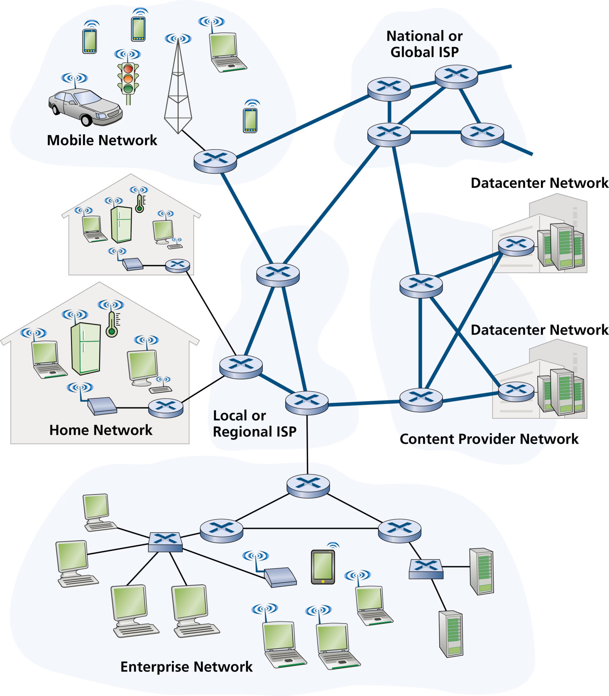

**核心概念①：分组交换与电路交换** —— 数据在网络中移动的两种基本方式：**分组交换（packet switching）** 按需使用链路资源、允许排队等待；**电路交换（circuit switching）** 在会话期间预留端到端资源、保证恒定速率。二者是本章最重要的概念对比，也是 408 高频计算题的载体（**高频考点**，考频 4 次：2023#33、2013#35、2010#34、2024#33）。

### 分组交换（Packet Switching）

应用层消息可以是控制消息（如握手时的「Hi」）或数据（邮件、JPEG、音频文件）。源端系统把长消息切分成小块——**分组（packet）**。分组沿通信链路与分组交换机（路由器与链路层交换机）逐跳传输，且 **在每个链路上以该链路的全速率传输**：若分组长 L bit、链路速率为 R bit/s，则传输该分组需 **L/R 秒**。

#### 存储转发（Store-and-Forward）

绝大多数分组交换机采用 **存储转发**：交换机必须 **收到整个分组** 后才能开始向出链路转发第一个比特。考虑两台端系统经一台路由器相连的简单网络（忽略传播时延）：源在 t=0 开始发送，t=L/R 时源已发完整个分组且路由器已完整收到（存储）；此时路由器才开始转发，t=2L/R 时目的端收到整个分组。**一跳总时延为 2L/R**；若交换机边收边转（无存储），则只需 L/R——但路由器必须收完整、处理完分组才能转发，所以存储转发是必然。

推广到一般情形：源到目的共经过 **N 条速率均为 R 的链路**（即 N-1 台路由器），发送单个分组的端到端时延为：

$$ d_{end-to-end} = N \cdot \frac{L}{R} $$

!!! example "例题 1：存储转发的端到端时延（真题 2010#34 改编）"

    某分组交换网络采用存储转发方式。源主机向目的主机发送一个长度为 1.5 Mb（=1.5×10⁶ bit）的分组，中间经过 1 台路由器（即源到目的共 2 条链路），每条链路速率均为 2 Mbps，忽略传播、处理与排队时延。

    （1）从源主机开始发送该分组，到目的主机收到整个分组，需要多长时间？

    （2）若链路由 1 条变为 3 条（经过 2 台路由器，速率不变），总时延又是多少？

    ??? answer "查看答案"
        **（1）** 存储转发下，每条链路需 L/R 秒传完分组，N=2 条链路：

        $$ d = N \cdot \frac{L}{R} = 2 \times \frac{1.5 \times 10^6}{2 \times 10^6} = 1.5 \text{ s} $$

        **（2）** N=3 条链路：

        $$ d = 3 \times \frac{1.5 \times 10^6}{2 \times 10^6} = 2.25 \text{ s} $$

        注意：分组经多跳存储转发，总时延近似为各链路传输时延之和（不计传播/排队/处理时延）。

    ??? success "评分标准"

        - 列出存储转发公式 d=N·L/R（3 分）
        - 正确代入并计算（1）（2 分）
        - 正确代入并计算（2）（3 分）
        - 结论表述清晰（2 分）

#### 排队时延与丢包

每台分组交换机为每条出链路配备 **输出缓存（output buffer，输出队列）**：若到达的分组需要发送到某条链路，而该链路正忙，分组就必须在输出缓存中排队等待——产生 **排队时延（queuing delay）**。排队时延是 **可变的**，取决于网络拥塞程度。缓存容量有限，若分组到达时缓存已满，就会发生 **丢包（packet loss）**——到达的分组或已排队的分组被丢弃。

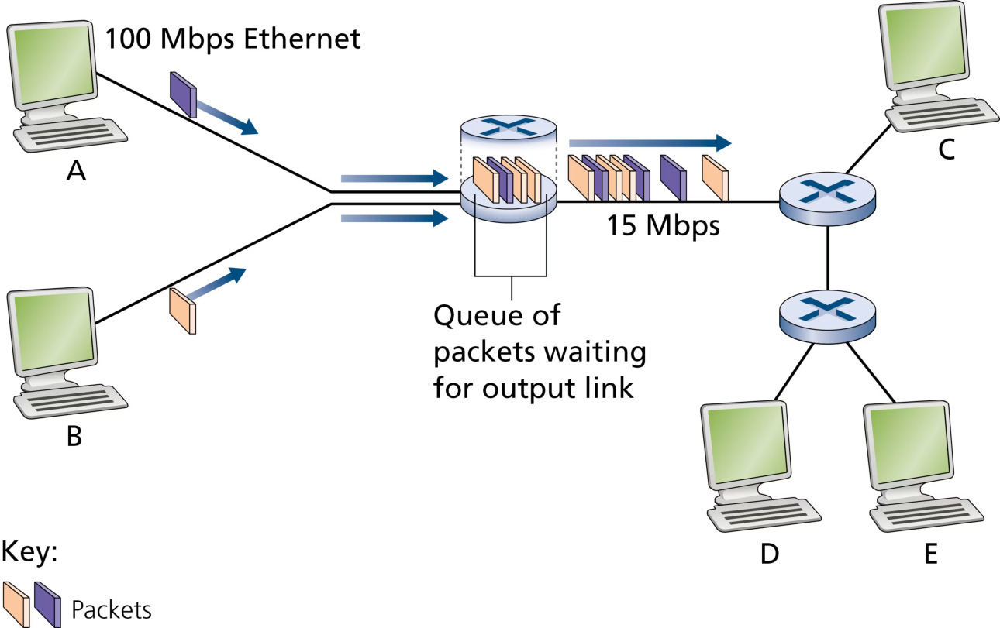

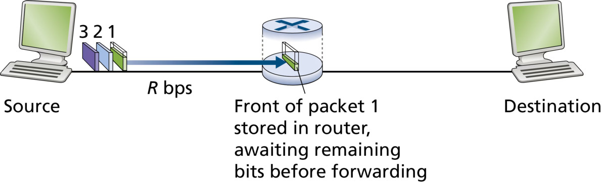

这与银行排队、收费站排队完全同构：短时间内的分组到达速率（折算为 bit/s）超过链路发送速率时，拥塞出现，分组在输出缓存中积压。

#### 转发表与路由协议

路由器如何决定把分组转发到哪条出链路？因特网中，每个端系统有一个 **IP 地址**，源端系统把目的 IP 地址写入分组首部；IP 地址具有 **层次结构**（如同邮政地址）。每台路由器维护一张 **转发表（forwarding table）**，把目的地址（或其一部分）映射到本路由器的出链路；分组到达时，路由器检查目的地址、检索转发表、确定出链路并转发。这就像开车问路：乔从费城开车去奥兰多，每到一个加油站问「去佛罗里达州怎么走」「去奥兰多怎么走」「去 Lakeside Drive 怎么走」——每个加油站服务员（路由器）只负责提取地址的一部分、指出下一段路。转发表并非手工配置，而是由 **路由协议（routing protocol）** 自动生成：例如路由协议计算从每台路由器到每个目的的最短路径，用最短路径结果配置转发表（第五章详述）。

### 电路交换（Circuit Switching）

**电路交换网络** 在端系统通信会话期间，**预留** 路径上所需的资源（缓存、链路传输速率）。传统电话网是电路交换的典型：发送数据前，网络必须在发送方与接收方之间 **建立连接**，路径上的交换机为连接维护连接状态，这条真实连接称为 **电路（circuit）**；网络同时为连接 **预留恒定传输速率**（每条链路容量的一部分），会话期间发送方可以保证速率地传输数据。类比：需要预约的餐厅——虽然要提前打电话（建立连接的麻烦），但到达后原则上立即入座（有保证的服务）；不预约的餐厅（分组交换）免去预约，但可能要等位（排队）。

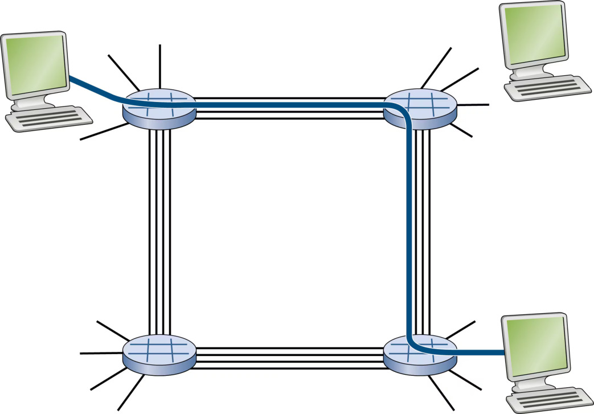

上图中四台电路交换机由四条链路互连，每条链路支持 4 条电路，即每条链路可同时支持 4 个连接。若每条链路速率为 1 Mbps，则每条端到端电路获得 1/4 × 1 Mbps = 250 kbps 的专用速率。注意：**传输时间与链路数无关**——电路建立后，数据以固定速率流经整条端到端路径。

#### 电路复用：FDM 与 TDM

链路中的电路通过两种方式实现：

- **频分复用（FDM，Frequency-Division Multiplexing）**：把链路频谱划分给各连接，每条连接在整个会话期间占用一个 **频带**。电话网中典型频带宽度为 4 kHz；FM 广播电台也以 FDM 共享 88-108 MHz 频谱。
- **时分复用（TDM，Time-Division Multiplexing）**：把时间划分为固定时长的 **帧（frame）**，每帧再划分为固定数量的 **时隙（time slot）**；网络为连接在每帧中专用一个时隙。电路的传输速率 = 帧速率 × 每时隙比特数。例如链路每秒传输 8000 帧、每时隙 8 bit，则每条电路速率为 64 kbps。

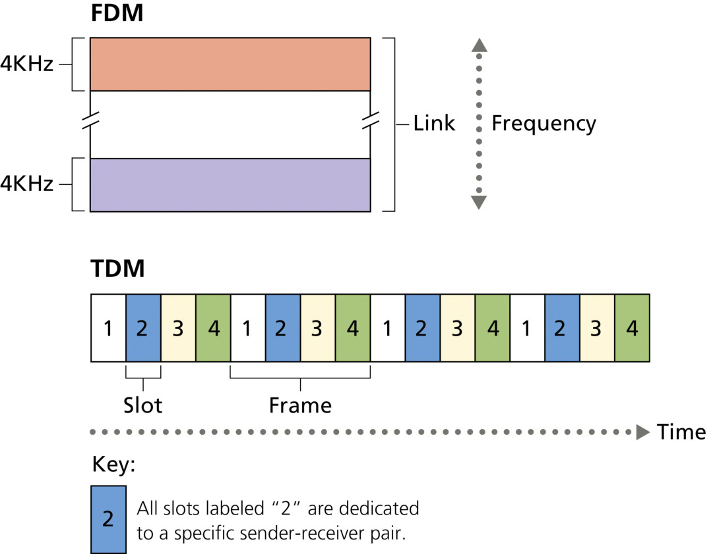

FDM 下每条电路 **持续** 获得带宽的一部分；TDM 下每条电路 **周期性地** 在短暂时间间隔内获得全部带宽。

**电路交换的浪费**：专用电路在静默期（silent periods）闲置——通话一方不讲话时，预留的频带或时隙无法被其他连接使用。例如放射科医生通过电路交换网络远程浏览 X 光片：连接建立、请求图像、沉思、再请求新图像，沉思期间网络资源被分配却未使用。此外，建立端到端电路并预留容量需要复杂的信令软件协调路径上的各交换机。

**电路交换数值例**：从主机 A 发送 640,000 bit 的文件到主机 B。网络链路采用 TDM，每帧 24 个时隙，链路速率 1.536 Mbps，建立端到端电路需 500 ms。每电路速率 = 1.536 Mbps / 24 = 64 kbps，传完文件需 640,000 / 64,000 = 10 s，加上建链时间共 **10.5 s**。注意传输时间与链路条数无关（经 1 条或 100 条链路都是 10 s）。

!!! example "例题 2：分组交换 vs 电路交换的对比计算（原书例改编）"

    从主机 A 向主机 B 发送一个 640,000 bit 的文件。

    （1）若使用电路交换：TDM 每帧 24 个时隙、链路速率 1.536 Mbps、建链需 500 ms，求总时间。

    （2）若使用分组交换：链路速率 1.536 Mbps、忽略存储转发以外的时延，求总时间，并对比两者差异。

    ??? answer "查看答案"
        **（1）电路交换：**
        每条电路速率 = 1.536 Mbps ÷ 24 = 64 kbps；

        $$ t_{trans} = \frac{640{,}000}{64{,}000} = 10 \text{ s} $$

        总时间 = 传输时间 + 建链时间 = 10 + 0.5 = **10.5 s**。

        **（2）分组交换：**
        分组以链路全速率传输：

        $$ t = \frac{640{,}000}{1.536 \times 10^6} \approx 0.417 \text{ s} $$

        **对比：** 本例中分组交换（约 0.42 s）远快于电路交换（10.5 s），因为电路交换为电路预留给定的 64 kbps，且还要支付 500 ms 的建链开销；分组交换按需以全链路速率传输。但分组交换的代价是时延可变、无服务质量保证。

    ??? success "评分标准"

        - 电路速率计算 64 kbps（2 分）
        - 电路交换传输时间 + 建链时间（4 分）
        - 分组交换传输时间（2 分）
        - 二者差异对比论述（2 分）

#### 分组交换 vs 电路交换：谁更高效？

批评者认为分组交换的端到端时延可变、不可预测（主要因排队时延），不适合实时服务（电话、视频会议）；支持者认为分组交换 **① 更好地共享传输容量，② 更简单、更高效、成本更低**。

**效率对比经典分析（原书 P8 的思想源头）：** 设 1 Mbps 链路由 N 个用户共享，每用户只在活动期以 100 kbps 产生数据，用户 **活跃概率 p = 0.1**（其余 90% 时间空闲）。

- **电路交换（TDM）**：必须为每个用户始终预留 100 kbps，1 Mbps ÷ 100 kbps = **最多支持 10 个用户**。
- **分组交换**：用户数可增至 35。当同时活跃用户数 ≤ 10 时，聚合到达速率 ≤ 链路输出速率 1 Mbps，分组几乎无时延地通过（与电路交换性能相同）；仅当 **超过 10 个用户同时活跃**（概率约为 0.0004，即 0.04%）时，队列才开始增长。由二项分布：

$$ P(\text{超过 10 个用户同时活跃}) = \sum_{k=11}^{35} \binom{35}{k} (0.1)^k (0.9)^{35-k} \approx 0.0004 $$

**结论：** 分组交换以几乎等同电路交换的性能，支持 **超过 3 倍** 的用户数。

**再一个例子：** 10 个用户共享链路，其中 1 个用户突发产生 1000 个分组（每个 1000 bit，共 10⁶ bit），其余 9 个静默。TDM 电路交换（10 时隙/帧）下，活跃用户每帧只能用 1 个时隙，速率被限制为链路速率的 1/10，传完 10⁶ bit 需 **10 s**；分组交换下，活跃用户独占链路全速率，只需 **1 s**。

以上两例说明：**电路交换按需前预分配链路速率，分配了却用不上的资源被浪费；分组交换按需分配链路，仅在真正有分组要发时共享链路。** 今天虽然两种交换都存在，但趋势明显偏向分组交换——连电路交换的电话网也在向分组交换迁移（如昂贵的长途越洋段）。

### 网络之网（A Network of Networks）

接入 ISP 把端用户与内容提供商接入因特网，但这只是「连接数十亿端系统」拼图的一小片。**接入 ISP 之间必须互连**——通过构造一个「网络的网络」。这句话是理解因特网的关键。因特网网络之网的演化主要由 **经济学与国家政策** 驱动。让我们逐级搭建五种网络结构（Network Structure 1-5），每级都比上一级更接近今天的因特网。

**核心概念④：网络之网** —— 因特网不是一张单一的网络，而是由大量 ISP 网络按客户-提供商（customer-provider）关系层层互连、辅以对等与 IXP 互联的复杂生态。

- **结构 1**：所有接入 ISP 与 **一个全球转接 ISP（global transit ISP）** 相连。接入 ISP 付钱给全球转接 ISP，故接入 ISP 是 **客户（customer）**，转接 ISP 是 **提供商（provider）**。
- **结构 2**：多个相互竞争的全球转接 ISP。接入 ISP 可货比三家；但全球转接 ISP 之间必须互连，否则接入不同转接 ISP 的接入 ISP 无法通信。
- **结构 3**：多级层次——区域 ISP（regional ISP）＋一级 ISP（tier-1 ISP）。没有 ISP 能覆盖全世界每个城市，区域内由区域 ISP 汇聚接入 ISP，区域 ISP 再连一级 ISP。层级中每级都存在客户-提供商关系，一级 ISP 位于顶层、不向任何人付费。例如中国：城市接入 ISP → 省级 ISP → 国家级 ISP → 一级 ISP。所谓 tier-1 没有官方认证——「如果你要问自己是不是 tier-1，那你多半不是」。
- **结构 4**：加入 **存在点（PoP，Point of Presence）**、**多宿（multi-homing）**、**对等（peering）** 与 **因特网交换点（IXP，Internet Exchange Point）**。PoP 是提供商网络中一组（同一地点的）路由器，客户 ISP 在此接入提供商；任何 ISP（除一级外）可多宿——同时连接两个或多个提供商，这样即使一个提供商故障仍能继续收发分组；同层级的邻近 ISP 可 **对等互联**（通常 **免结算 settlement-free**，互不付费）以降低转接费用；第三方公司可建立 **IXP**——一个让多家 ISP 汇聚对等的会合点（通常是一栋独立建筑 + 自己的交换机）。
- **结构 5（今天的因特网）**：叠加 **内容提供商网络（content-provider network）**。谷歌是典型代表：在全球四大洲有数十个大型数据中心，还常有数百台服务器的小型数据中心驻扎在 IXP 内；各数据中心由谷歌私有的 TCP/IP 网络（全球范围、独立于公共因特网）互连。谷歌私有网络通过 **与低层 ISP 对等**（直接连接或经 IXP）绕过因特网上层，但仍有大量接入 ISP 必须经一级 ISP 转接可达，因此谷歌网络也连一级 ISP 并付费。自建网络让内容提供商减少对上层 ISP 的付费，并更好地控制服务交付。

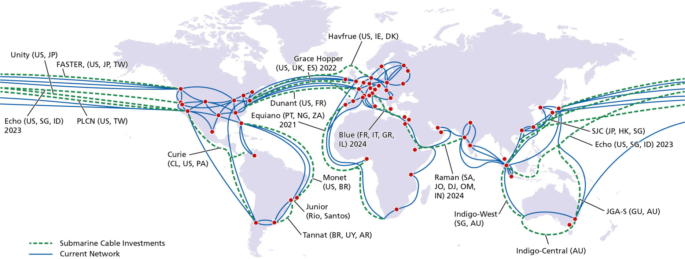

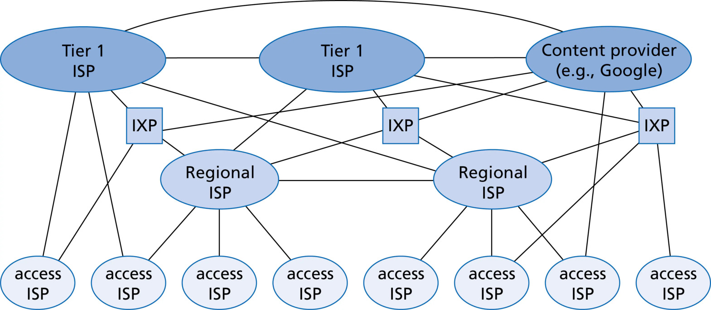

**总结今天的因特网**：十几个一级 ISP + 数十万低层 ISP，覆盖范围多样（跨国跨洋 vs 狭小区域）；低层 ISP 是高层 ISP 的客户，用户与内容提供商是低层 ISP 的客户；内容提供商自建网络并尽可能直连低层 ISP。

---

## 1.4 时延、丢失与吞吐量

理想中我们希望任意两端系统之间瞬时、无损、无限制地传送数据——现实中不可能。计算机网络必然引入 **时延**、造成 **丢包**、限制 **吞吐量**。本节为三者建立定量模型，这是全书的计算基石。

**核心概念②：四种时延** —— 分组在每个节点（主机或路由器）都会经历处理、排队、传输、传播四种时延，它们之和构成节点时延；端到端时延是路径上所有节点时延的累积。**高频考点**（考频 4 次：2023#33、2013#35、2010#34、2024#33）——408 必考计算，请把四个公式与单位刻进脑海。

### 节点时延的四种类型

以分组从路由器 A 转发到路由器 B 为例（见下图）：分组到达 A 后，A 检查分组首部确定出链路，把分组导向通向 B 的链路前的队列；分组在队列中等待，直到轮到它被送上链路；比特推入链路后，还要沿链路传播到 B。

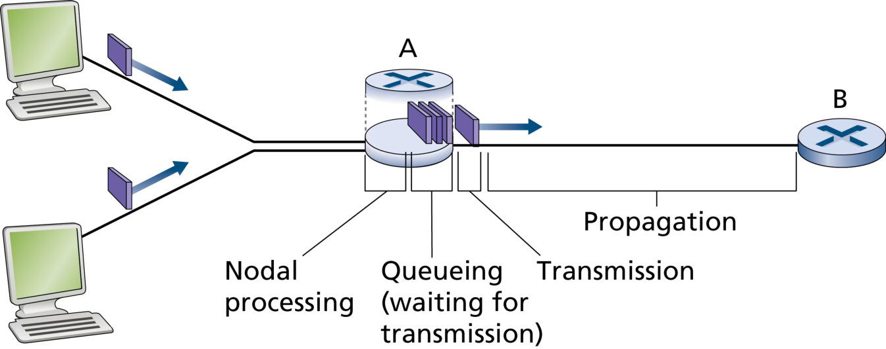

**① 处理时延（processing delay, d_proc）**：检查分组首部并确定转发方向所需的时间，还包括检查比特级差错的时间。高速路由器中通常为微秒级或更小。

**② 排队时延（queuing delay, d_queue）**：分组在队列中等待发送到链路上的时间。取决于此前已排队等待传输的分组数：队列空则排队时延为零，流量重则排队时延很长。实践中为微秒至毫秒级，**是四种时延中唯一逐分组变化、也是最难分析的一种**（后文详述）。

**③ 传输时延（transmission delay, d_trans）**：把分组所有比特 **推入（push）** 链路所需的时间。设分组长 L bit、链路速率 R bit/s：

$$ d_{trans} = \frac{L}{R} $$

它是分组长度与链路速率的函数，**与两路由器间的距离毫无关系**。

**④ 传播时延（propagation delay, d_prop）**：比特从链路起点传播到下一路由器所需的时间。比特以链路的传播速度（取决于物理介质，光纤、双绞线等，量级为 2×10⁸ m/s，等于或略小于光速）传播：

$$ d_{prop} = \frac{d}{s} $$

其中 d 是两路由器间的距离，s 是链路传播速度。它是 **距离的函数，与分组长度和链路速率毫无关系**。

!!! warning "常见错误：传输时延 ≠ 传播时延"

    初学者最易混淆这两个概念。**传输时延** 是「把分组从路由器吐出来的时间」，取决于分组长度 L 与链路速率 R；**传播时延** 是「比特在链路上跑一段距离的时间」，取决于链路长度 d 与传播速度 s。传输时延与距离无关，传播时延与分组大小无关。

    类比收费站：收费站每 12 秒放行一辆车（服务时间 = 传输时延），车以 100 km/h 在高速公路上行驶（行驶时间 = 传播时延）。车队全部驶出收费站要 120 秒，而一辆车从上一个收费站开到下一个收费站只需 1 小时/若干公里。两者相加才是「从上一个收费站前停好到下一个收费站前停好」的总时间。

    还要注意：如果服务（传输）时间大于行驶（传播）时间，前几辆车会先到达下一个收费站——网络中同样如此：一个分组的前几个比特可能已经到达下一台路由器，而该分组的其余比特还在上一台路由器排队发送。

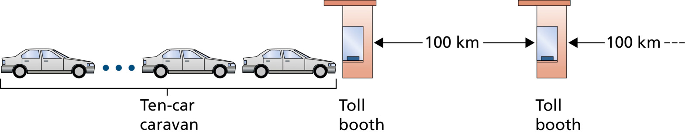

设 d_proc、d_queue、d_trans、d_prop 分别为处理、排队、传输、传播时延，则 **节点时延（nodal delay）** 为：

$$ d_{nodal} = d_{proc} + d_{queue} + d_{trans} + d_{prop} $$

各分量占比差异悬殊：校园内两台路由器间的 d_prop 可忽略（微秒级），而经地球静止卫星互联的两台路由器间 d_prop 达数百毫秒、常占主导；低速率拨号链路上大分组的 d_trans 可达数百毫秒；d_proc 通常可忽略，但它强烈影响路由器最大吞吐量。

### 排队时延与流量强度

排队时延是最复杂、最有趣的分量。与另三种时延不同，排队时延 **逐分组变化**：10 个分组同时到达空队列时，第一个分组的排队时延为零，最后一个却要等前 9 个传输完毕。因此描述排队时延须用统计量：平均排队时延、方差、超过某值的概率。

排队时延取决于：到达队列的流量速率、链路传输速率、到达流量是周期性的还是突发的。设 a 为分组平均到达速率（分组/秒），R 为传输速率（bit/s），所有分组长 L bit，则比特平均到达速率为 **La bit/s**。定义 **流量强度（traffic intensity）**：

$$ \frac{La}{R} $$

- 若 **La/R > 1**：比特平均到达速率超过链路发送速率，队列无限增长、排队时延趋于无穷——流量工程的金科玉律：**把流量强度设计为 ≤ 1**。
- 若 **La/R ≤ 1**：到达流量的性质决定排队时延。分组周期性地每 1/a 秒到达一个（L/R = 1/a 时），每个分组到达时队列都为空，排队时延为零；分组成批同时到达时，排队时延可观（第 k 个分组的排队时延为 (k-1)L/R）。现实中到达过程通常是随机的，La/R 不足以完整刻画排队时延统计量，但足够给出直观：La/R 接近 0 时排队时延接近零；La/R 接近 1 时，到达速率会间歇性超过传输容量，队列周期性增长，平均排队时延随流量强度 **急剧上升**——高速公路上「本来就堵的路」就是这样：流量强度接近 1 时，稍微多一点的流量就会带来巨大的延迟增加。

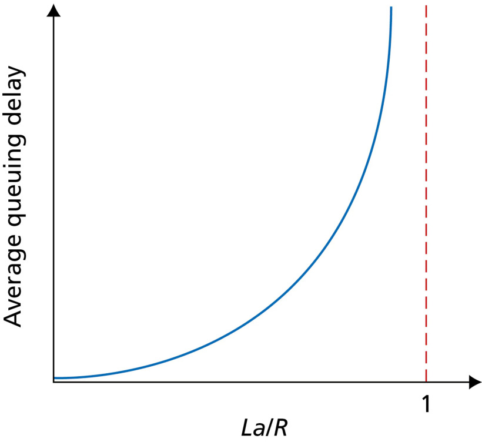

#### 丢包（Packet Loss）

现实中队列容量有限。当流量强度大于 1 时，时延并非真的趋于无穷——分组到达时若发现缓存已满，路由器就会 **丢弃（drop）该分组**，即 **丢包**。从端系统视角，丢包表现为「分组进入了网络核心却从未在目的地出现」。丢失分组比例随流量强度增大而增大，因此节点性能不仅以时延衡量，也以 **丢包概率** 衡量。被丢弃的分组可由端到端机制重传（后续章节详述），以保证数据最终全部到达。

### 端到端时延

设源与目的之间共有 N-1 台路由器（N 条链路），假设网络不拥塞（排队时延可忽略）、每台路由器与源主机的处理时延为 d_proc、每段链路传输速率为 R、每条链路传播时延为 d_prop，则端到端时延为各节点时延的累加：

$$ d_{end-to-end} = N (d_{proc} + d_{trans} + d_{prop}) $$

其中 d_trans = L/R。这是式（1.1）d = N·L/R 的一般化（补充了处理与传播时延）。注意若考虑每节点平均排队时延或各节点时延异质，只需把求和改为逐节点累加。

**Traceroute 工具**：实测端到端时延的经典工具。源主机向目的主机发送多组特殊分组，第一组标记为 1、第二组标记为 2……每台路由器收到特殊分组时把标记减 1 再转发；若减到 0，路由器不回转发而向源回送一条含自身名字与地址的消息；目的主机收到标记为 1 的分组也回送消息。源记录「发送到收到回送」的往返时延与回送路由器名字地址，从而重构源到目的的路由及各跳往返时延。Traceroute 对每个跳重复 3 次实验；某跳 3 次结果差异说明排队时延随时间变化；大跳变（如跨大西洋光纤链路）说明传播时延大。

### 吞吐量（Throughput）

除时延与丢包外，端到端 **吞吐量** 是另一关键性能指标。考虑从主机 A 向主机 B 传输一个大文件：**瞬时吞吐量** 是 B 接收文件的瞬时速率（bit/s）；若文件共 F bit、用 T 秒传完，则 **平均吞吐量** 为 F/T。对文件传输类应用，时延不关键、吞吐量越高越好；对因特网电话等实时应用，则要求低时延且瞬时吞吐量持续高于某阈值。

**两链路模型（瓶颈链路）：** 服务器经速率 R_s 的链路连路由器，再经速率 R_c 的链路连客户端。把比特想成流体、链路想成管道：服务器泵出速率不可能超过 R_s，路由器转发速率不可能超过 R_c。若 R_s < R_c，吞吐量为 R_s；若 R_s > R_c，路由器跟不上接收速度，比特以 R_c 流出，吞吐量为 R_c（且路由器处积压不断增长）。因此吞吐量 = **min(R_s, R_c)**，即 **瓶颈链路（bottleneck link）** 的传输速率。传输大文件 F bit 的时间近似为 F / min(R_s, R_c)。

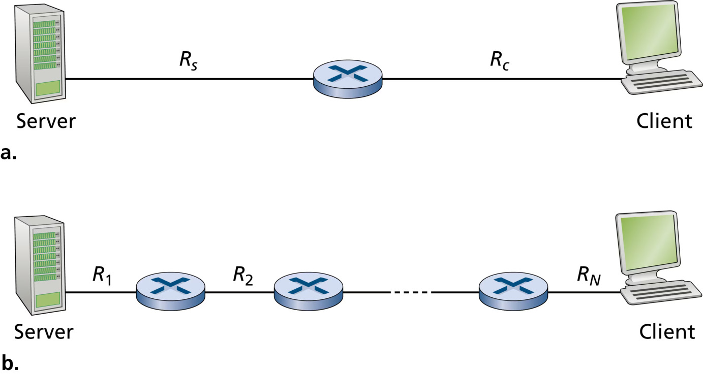

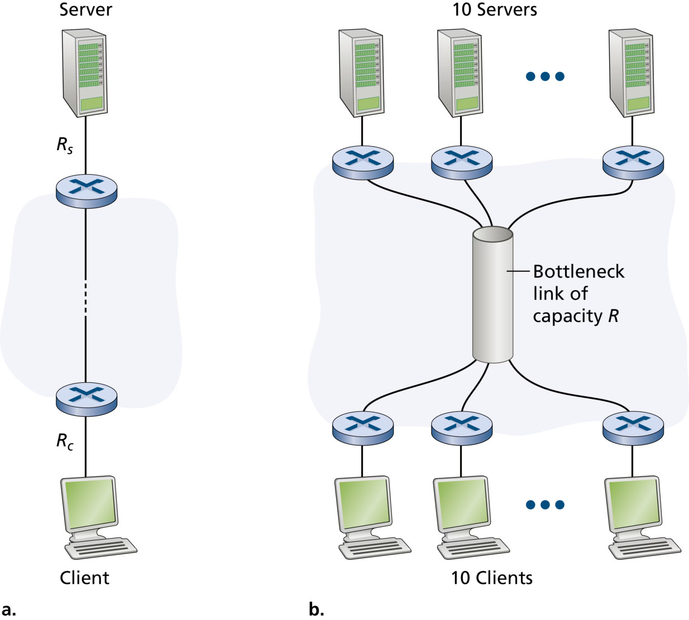

**N 链路模型：** 服务器与客户端之间 N 条链路速率分别为 R_1, R_2, …, R_N，吞吐量 = **min(R_1, …, R_N)**，仍是路径上的瓶颈链路。

**今天因特网的现实：** 核心网链路通常速率远高于接入链路且过配置（over-provisioned，拥塞少），因此 **制约吞吐量的通常是接入网**。服务器接入速率 R_s 与客户端接入速率 R_c 中较小者即为吞吐量。

**共享链路模型：** 10 个服务器-客户端对同时下载，全部流量经过核心中一条共享链路（速率 R）。若 R 远大于 R_s 与 R_c，各下载吞吐量仍为 min(R_s, R_c)；若 R 与二者同数量级，共享链路把速率平均分给 10 个下载——例如 R_s = 2 Mbps、R_c = 1 Mbps、R = 5 Mbps，则每个下载只能分得 0.5 Mbps，瓶颈从接入网转移到核心共享链路。**结论：吞吐量不仅取决于路径上链路的传输速率，还取决于途经的其他流量。**

!!! example "例题 3：吞吐量与瓶颈链路（真题 2010#34 改编）"

    某客户端通过因特网从服务器下载一个 10 Mb 的文件。服务器接入链路速率 R_s = 2 Mbps，客户端接入链路速率 R_c = 1 Mbps，核心网络链路速率均远高于二者且无其他流量。

    （1）求端到端吞吐量及下载所需时间。

    （2）若改为 10 个客户端同时各自下载（10 个服务器，核心共享链路速率 R = 5 Mbps，其余核心链路速率远高），求每个下载的吞吐量，并指出瓶颈在哪里。

    ??? answer "查看答案"
        **（1）** 核心不构成瓶颈，吞吐量 = min(R_s, R_c) = min(2, 1) = **1 Mbps**。

        下载时间 = F / 吞吐量 = 10 Mb / 1 Mbps = **10 s**。

        **（2）** 共享链路把 5 Mbps 平均分给 10 个下载，每个仅得 5/10 = **0.5 Mbps**。

        该值小于 min(R_s, R_c) = 1 Mbps，故瓶颈不再是接入网，而是 **核心中的共享链路**。

    ??? success "评分标准"

        - 正确识别瓶颈为客户端接入链路并给出 min 公式（3 分）
        - 计算吞吐量 1 Mbps 与时间 10 s（2 分）
        - 共享链路场景下每个下载分得 0.5 Mbps（3 分）
        - 正确指出瓶颈位置转移（2 分）

---

## 1.5 协议层次与服务模型

因特网极其复杂：无数应用与协议、各类端系统、分组交换机、各种链路介质。能否为如此复杂的系统建立结构？答案是分层。

### 分层体系结构（Layered Architecture）

先看人类社会的分层类比——乘飞机旅行：你买票、托运行李、过闸口登机、起飞降落、下机取行李、向票务员投诉。横向看，航空功能可划分为层次：**订票层**（售票柜台到售票柜台）、**行李层**（托运处到行李提取处，只服务于已订票者）、**闸口层**（登机口到到达口）、**起飞/降落层**（跑道到跑道）。每层通过「本层执行特定动作 + 使用紧邻下层的服务」来实现自身服务。分层带来 **模块化**：只要一层对外提供的服务不变、对下使用的服务不变，就可以自由更换该层的实现而不影响系统其余部分——例如把登机方式改为按身高排队，航空公司其余部分照常运转。

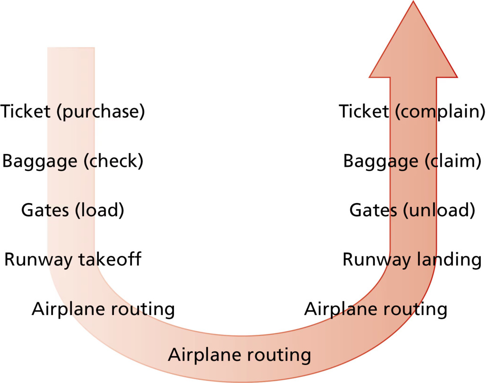

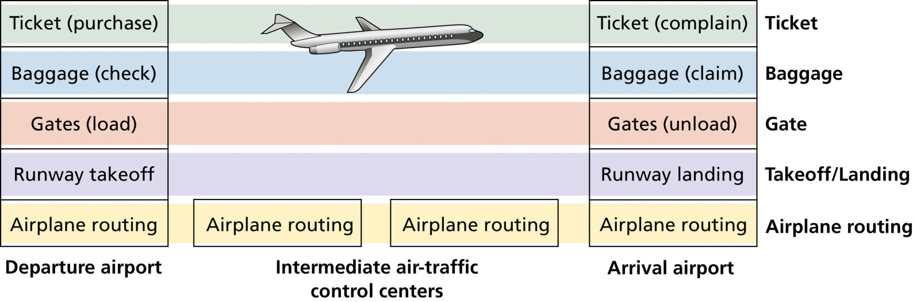

网络设计者同样把协议组织进 **层（layer）**，每层协议属于一层。每一层通过「本层执行动作 + 使用下层服务」向上层提供服务——某层向上层提供的服务称为该层的 **服务模型（service model）**。协议层可纯软件实现（应用层与传输层协议几乎都在端系统的软件中）、纯硬件或软硬结合（物理层与链路层通常在网卡中实现；网络层多为软硬混合）。分层有两大优点：**结构化地讨论系统组件**、**模块化便于更新组件**；也有两个缺点：一层可能重复下层的功能（如逐链路与端到端都做差错恢复）、某层可能需要另一层的信息（破坏层间隔离）。

**核心概念③：协议分层与封装** —— 把网络协议按层次组织，每层依赖下层服务、向上层提供服务；发送时逐层添加首部（封装），接收时逐层剥除（解封装）。这是理解网络体系结构的万能钥匙。

**核心概念⑤：TCP/IP 体系结构** —— 因特网协议栈的五个层次：物理层、链路层、网络层、传输层、应用层。本书采用 **自顶向下（top-down）** 的方式讲授：先应用层，再逐层向下。

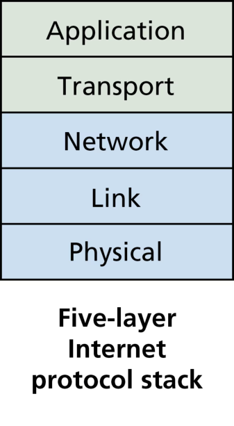

**五层协议栈各层职责（408 必考）：**

| 层 | 职责 | 数据单元 | 代表性协议/实体 |
|:---|:---|:---|:---|
| **应用层** | 网络应用与应用层协议所在层；支持 Web 文档请求传输（HTTP）、邮件传输（SMTP）、域名到地址的翻译（DNS） | 报文（message） | HTTP、SMTP、DNS |
| **传输层** | 在应用端点之间传输应用层报文。TCP 提供面向连接服务：可靠交付、流量控制、把长报文拆成短报文段、拥塞控制；UDP 提供无连接服务：无可靠、无流控、无拥塞控制 | 报文段（segment） | TCP、UDP |
| **网络层** | 把数据报从一台主机移动到另一台主机。核心是 IP 协议（定义数据报字段及端系统/路由器对这些字段的动作），所有具网络层的组件必须运行 IP；另含众多路由协议（确定数据报的路径） | 数据报（datagram） | IP、路由协议 |
| **链路层** | 把数据报沿路由从一节点（主机或路由器）移动到下一节点；服务取决于具体链路层协议（有的提供单链路可靠交付，区别于 TCP 的端到端可靠交付） | 帧（frame） | 以太网、WiFi、DOCSIS |
| **物理层** | 把帧内的单个比特从一节点移到下一节点；协议与链路传输介质相关（双绞线、同轴、光纤各有物理层协议） | 比特（bit） | 各类物理层规范 |

!!! info "OSI 七层：会话层与表示层（**高频考点**，考频 8 次）"

    **ISO/OSI 参考模型（开放系统互连）** 把网络体系结构划分为七层，比 TCP/IP 五层多了两层：

    - **表示层（Presentation）**：负责 **数据格式转换**（语法与语义的表示）、**加密/解密**、**压缩/解压**，让异构系统间能理解对方的数据格式。408 常见考法：指出「格式转换/加密压缩」属于表示层。
    - **会话层（Session）**：负责 **建立、管理与终止会话**（对话连接），提供 **断点续传**、会话同步等服务。408 经典考点：**「断点续传」「会话同步」属于会话层**（2022#33、2019#33 等多次考查）。

    **对应关系：** OSI 应用层+表示层+会话层 ≈ TCP/IP 应用层；OSI 传输层 = TCP/IP 传输层；OSI 网络层 = TCP/IP 网络层；OSI 数据链路层+物理层 ≈ TCP/IP 链路层（+物理层）。注意 TCP/IP 把表示与会话功能合并进应用层，且实际因特网并未采用 OSI 七层作为事实标准。

!!! example "例题 4：OSI 与 TCP/IP 层次辨析（真题 2022#33 改编）"

    在 OSI 参考模型中，下列功能分别属于哪一层？

    （1）数据压缩与加密；（2）会话断点续传；（3）端到端的可靠传输；（4）路由选择；（5）比特流的物理传输。

    ??? answer "查看答案"
        （1）数据压缩与加密 → **表示层**（Presentation）。

        （2）会话断点续传 → **会话层**（Session）。

        （3）端到端的可靠传输 → **传输层**（Transport，对应 TCP 的可靠交付）。

        （4）路由选择 → **网络层**（Network）。

        （5）比特流的物理传输 → **物理层**（Physical）。

        **记忆口诀：** OSI 七层自顶向下「应表会传网数物」（All People Seem To Need Data Processing）。

    ??? success "评分标准"

        - 每答对 1 项得 2 分，共 10 分
        - 易错点：加密/压缩误判为应用层（应为表示层）；断点续传误判为传输层（应为会话层）

### 封装（Encapsulation）

!!! tip "动手试试：交互式演示"

    配套交互 HTML：[交互式协议栈数据封装演示](demos/交互式协议栈数据封装演示.html)（浏览器打开，逐层观察报文 → 报文段 → 数据报 → 帧的封装过程）。

**主机、路由器与链路层交换机实现不同的层：** 主机实现全部五层（因特网把复杂性放在网络边缘）；路由器实现第 1-3 层（可运行 IP，但不识别链路层地址）；链路层交换机实现第 1-2 层（识别以太网地址等链路层地址，但不识别 IP 地址）。

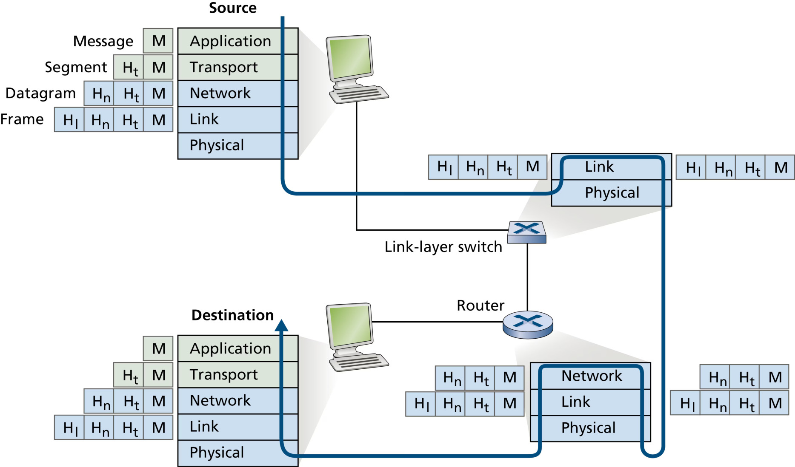

**封装（encapsulation）** 是发送路径上的核心过程（图 1.25 与 MIME 图）：

1. 发送主机上，**应用层报文（message）** 交给传输层；
2. 传输层附加传输层首部（如目的端口、差错检测位），形成 **报文段（segment）**——报文段封装了报文；
3. 网络层附加网络层首部（源/目的端系统地址），形成 **数据报（datagram）**；
4. 链路层附加链路层首部，形成 **帧（frame）**；物理层把帧的比特送上链路。

**数据单元命名链：报文（message）→ 报文段（segment）→ 数据报（datagram）→ 帧（frame）**——408 高频填空。每个分组都由 **首部字段 + 载荷字段（payload）** 构成，载荷通常是来自上一层的分组。

类比公司间邮递：Alice 把备忘录（应用层报文）装入公司内信封、写上 Bob 姓名与部门（传输层首部，形成报文段）；收发室把内信封再装入邮局信封、写上两公司地址（网络层首部，形成数据报）；邮局投递后，接收方收发室取出内信封交给 Bob（解封装开始），Bob 拆开信封取出备忘录。大消息还可能被分成多个报文段、每个再分成多个数据报，接收端再重组。

---

## 1.6 网络攻击

因特网已成为众多机构的关键基础设施，但「坏蛋（bad guys）」总在设法破坏联网计算机、侵犯隐私、瘫痪我们依赖的服务。**网络安全** 研究坏蛋如何攻击网络，以及我们如何防御、甚至设计出对攻击免疫的新架构。本节先做威胁全景survey，具体防御机制（密码学等）在第八章详述。

**坏蛋的分类（按攻击手段）：**

- **恶意软件（malware）**：随正常数据一起进入设备的恶意代码。感染后可删除文件、安装 **间谍软件（spyware）** 收集密码与击键等隐私并回传。被攻陷的主机可能被编入由坏蛋控制的 **僵尸网络（botnet）**，用于垃圾邮件分发或分布式拒绝服务攻击。大量恶意软件 **自我复制（self-replicating）**：感染一台主机后继续寻找其他主机，可指数级传播（如蠕虫）。
- **拒绝服务攻击（DoS，Denial-of-Service）**：使网络、主机或基础设施对合法用户不可用。三类：① **漏洞攻击（vulnerability attack）**——向易受攻击的应用/操作系统发送精心构造的消息序列，使服务停止甚至主机崩溃；② **带宽洪泛（bandwidth flooding）**——向目标发送海量分组，堵塞其接入链路；③ **连接洪泛（connection flooding）**——在目标主机建立大量半开/全开 TCP 连接，使其无法接受合法连接。若服务器接入速率为 R，攻击者需以约 R 的速率发送流量才能造成伤害；单源攻击易被上游路由器检测并阻断，于是出现 **分布式 DoS（DDoS）**：攻击者控制多台源（常为僵尸网络）同时向目标开火，聚合流量达到约 R 即可瘫痪服务，更难检测与防御。

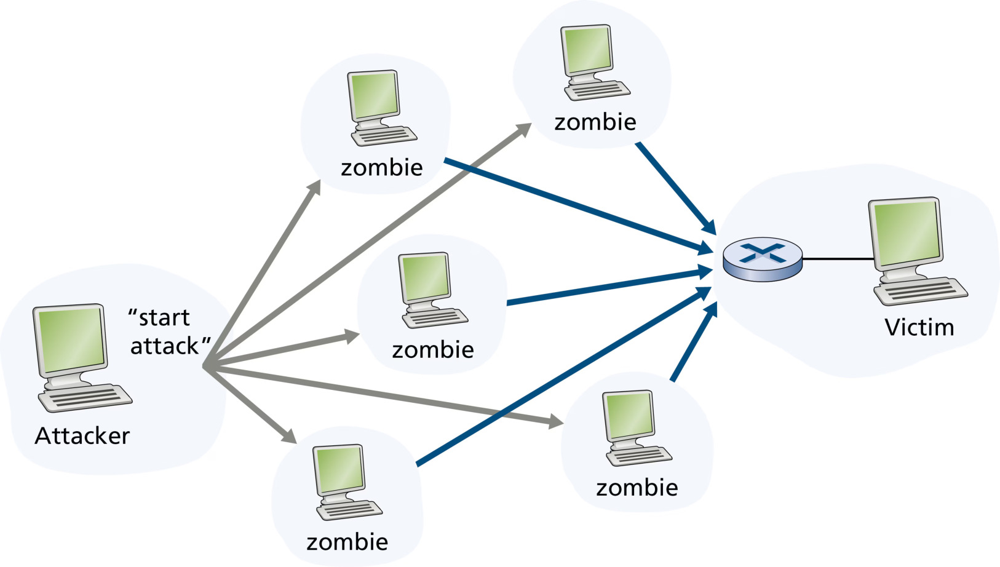

- **分组嗅探（packet sniffing）**：在无线发射器附近放置被动接收器，可复制每个经过的分组——可能含密码、身份证号、商业机密。被动嗅探不注入分组、难以检测。有线广播环境（以太网 LAN、电缆接入）同样易被嗅探。最佳防御是密码学（第八章）。Wireshark 就是教材配套的嗅探工具。
- **IP 伪装（IP spoofing）**：构造源地址虚假的分组注入因特网，伪装成他人。防御需要 **端点认证（end-point authentication）**——确认消息确实来自我们认为的来源（第八章）。
- **中间人攻击（man-in-the-middle）**：攻击者位于通信双方之间，拦截、篡改甚至转发双方的消息，双方却以为在直接通信。本章 1.6 提及，具体机制在第八章深入。

**为什么因特网如此不安全？** 本质原因是因特网最初的设计基于「一组互相信任的用户连接到一个透明网络」的模型：默认允许任何用户向任何其他用户发送分组、用户身份按声明信以为真。今天的因特网早已不是「互相信任的用户」，但通信仍需在互不信任、可能匿名、可能经第三方（Web 缓存、移动性代理）的环境中进行。**互相信任是例外而非常态**——这是现代网络安全的出发点。

---

## 1.7 计算机网络历史

因特网的历史充满值得玩味的细节（408 不考，简述五个阶段）：

1. **1961-1972：分组交换的诞生。** 电话网（电路交换）统治的时代，Kleinrock（MIT，排队论证明分组交换对突发流量的有效性）、Baran（Rand，军用抗毁网络）、Davies（NPL）几乎同时独立发明分组交换。1969 年劳动节，第一台分组交换机（IMP）在 UCLA 安装，年底 ARPAnet 共 4 个节点（UCLA、SRI、UCSB、Utah）。1972 年 ARPAnet 约 15 个节点并首次公开展示，NCP 协议完成，Tomlinson 写了第一个电子邮件程序。
2. **1972-1980：专有网络与网络互联。** ALOHAnet（夏威夷微波网，首个多路访问协议）、Telenet、Cyclades 等网络涌现。Cerf 与 Kahn 提出网络互联架构，**「internetting」一词诞生**；早期 TCP 曾把可靠按序交付与转发功能合一，后拆分出 IP 与 UDP。Metcalfe 与 Boggs 开发了以太网。
3. **1980-1990：网络激增。** 主机数从约 200 增至十万。BITNET、CSNET、NSFNET 相继建立；**1983 年 1 月 1 日 ARPAnet 正式从 NCP 切换到 TCP/IP（flag day）**；DNS 于 80 年代末开发；法国推出 Minitel 家庭数据网络。
4. **1990 年代：因特网爆炸。** ARPAnet 退役，NSFNET 解除商用限制、1995 年退役，骨干流量由商业 ISP 承载。**Berners-Lee 于 1989-1991 年在 CERN 发明万维网（WWW）**（HTML、HTTP、Web 服务器与浏览器四大组件）；1995 年学生用 Netscape 浏览器上网冲浪，浏览器大战开始。四大杀手级应用：电子邮件、Web、即时消息、P2P 文件共享（Napster）。
5. **新千年：** 家庭宽带（电缆/DSL/FTTH/固定无线/LEO 卫星）大规模部署；2011 年无线设备数超过有线；社交网络（Facebook、微信等）崛起；云服务商（谷歌、微软）部署私有网络并绕过因特网上层；众多公司把应用迁移到云（AWS、Azure、阿里云）。

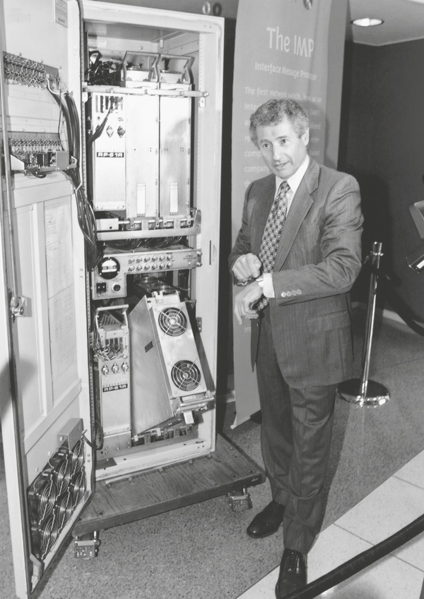

## 1.9 补充：物理层（408 考纲）

> 原书自顶向下没有独立的物理层章，物理介质仅在 1.2 节一带而过。但物理层是 **408 考纲六章之一**（考纲：通信基础、传输介质、物理层设备），且是计算题密集区——奈氏准则与香农定理几乎每年必考。本节按王道 2026 复习指导补齐考点，供 408 考生冲刺使用。

### 通信基础：数据、信号与码元

**数据（data）** 是传送信息的实体；**信号（signal）** 是数据的电气或电磁表现，是数据在传输过程中的存在形式。数据与信号都有模拟、数字之分：**模拟（analog）** 取值连续，**数字（digital）** 取值离散。

通信中常用一个固定时长的信号波形表示一个 k 进制数，这个时长内的信号称为 **码元（symbol）**（又称 k 进制码元），该时长称 **码元宽度**。**1 个码元可携带若干比特**：若一个信号周期内出现 2 种信号（二进制码元），每码元携带 1 bit；出现 4 种信号（四进制码元），每码元携带 2 bit。一般地，**码元携带 log₂N 比特**（N 为码元离散电平数量）。

按传输方式与方向，通信分为：

- **串行传输 vs 并行传输**：串行逐比特按序传输，适用于 **长距离**（如计算机网络）；并行多比特经多个信道同时传输，适用于 **近距离**（如 CPU 与主存之间）。
- **单工 / 半双工 / 全双工**：单工只有一个方向的通信而没有反方向交互（如无线电广播），只需 **1 个信道**；半双工双方都可收发但不能同时（如对讲机）；全双工双方可同时收发。**半双工与全双工都需要 2 个信道**（每个方向 1 个）。

**波特率与比特率（高频考点，命题追踪 2011 波特率-比特率转化、2014 调制速率的概念）**：**码元传输速率（波特率 baud rate）** 是每秒传输的码元数，单位 **波特（Baud）**，与码元进制无关；**信息传输速率（比特率）** 是每秒传输的比特数，单位 bit/s。若每码元携带 log₂N 比特，则波特率 B 对应的比特率为：

$$ R = B \cdot \log_2 N \quad \text{（bit/s）} $$

例如波特率 1000 Baud、每码元 4 比特（16 种离散电平），则 R = 4000 bit/s。反过来，**波特率 = 比特率 ÷ 每码元所含比特数**（如比特率 2400 bit/s、4 相位调制、每码元 2 比特，则波特率 = 1200 Baud，2011 真题）。

### 奈氏准则：理想低通信道的极限速率

实际信道的频率范围总是有限的，信号中的高频分量衰减，导致接收端波形失去码元之间的清晰界限，这种现象称 **码间串扰（inter-symbol interference, ISI）**。**奈氏准则（Nyquist criterion）** 规定：在理想低通（无噪声、带宽有限）信道中，为避免码间串扰，**极限码元传输速率为 2W 波特**（W 为信道带宽，单位 Hz）；若每码元取 N 种离散电平（码元可携带 log₂N 比特），则极限数据传输速率为：

$$ C_{\text{Nyquist}} = 2W \cdot \log_2 N \quad \text{（bit/s）} $$

奈氏准则的结论：① 任何信道中 **码元传输速率有上限**，超过则出现严重码间串扰，接收端无法正确识别码元；② 带宽越大，传输码元的能力越强；③ **奈氏准则只限制码元速率，不限制每码元携带的比特数**——这正是提高数据率要靠多进制调制（QAM）的原因。**高频考点**（命题追踪 2009、2022、2023：无噪声信道的最大数据传输速率）。

### 香农定理：有噪声信道的极限速率

实际信道总有噪声。**香农定理（Shannon's theorem）** 给出带宽受限且有噪声的信道的极限数据传输速率：

$$ C_{\text{Shannon}} = W \cdot \log_2 (1 + S/N) \quad \text{（bit/s）} $$

式中 W 为信道带宽（Hz），S 为信道内信号的平均功率，N 为信道内高斯噪声功率，**S/N 为信噪比（SNR）**。信噪比有无单位与分贝（dB）两种记法，换算关系为：

$$ \text{SNR(dB)} = 10 \cdot \log_{10}(S/N) $$

例如 S/N = 1000 时，信噪比为 30 dB；**用香农定理计算时，信噪比必须取无单位记法**。香农定理的结论：① 带宽或信噪比越大，信息极限传输速率越高；② 对一定的带宽与信噪比，信息传输速率的上限是确定的；③ 只要信息传输速率低于极限速率，就存在某种方法实现无差错传输；④ 极限速率是理论上限，实际信道能达到的速率比它低不少。**高频考点**（命题追踪 2016：有噪声信道极限速率计算）。

**奈氏准则 vs 香农定理（高频考点，命题追踪 2017 对比分析）**：奈氏准则 **只考虑带宽**（理想无噪声），给出码元速率上限；香农定理 **同时考虑带宽与信噪比**（有噪声），给出信息速率上限。二者共同限制实际速率——**实际速率取两者计算结果中的较小者**（若给出码元与比特数的关系，须受两个公式共同限制）。

### 编码与调制

将数据转换为数字信号的过程称 **编码（encoding）**，将数据转换为模拟信号的过程称 **调制（modulation）**。按数据与信号的形式，共有四种组合。

**① 数字数据 → 数字信号（编码，用于基带传输）：**

| 编码 | 规则 | 特点 |
|:---|:---|:---|
| 非归零 NRZ | 高电平 1、低电平 0（或相反），不归零 | 编码效率最高，但 **无自同步能力**，需额外时钟线 |
| 归零 RZ | 每码元中间跳变到零电平（归零） | 提供自同步机制，但占用带宽、传输效率受影响 |
| 反向非归零 NRZI | 电平 **跳变表示 0**、保持不变表示 1 | 兼有同步与带宽优势，USB 2.0 采用 |
| 曼彻斯特（Manchester） | 每码元 **中间必跳变**，跳变既作时钟又作数据（如向下跳变表示 1） | 自同步，**标准以太网 10BaseT 采用**，带宽为原始基带的 2 倍 |
| 差分曼彻斯特（Differential Manchester） | 中间跳变仅表示时钟；**码元开始处有跳变表示 0、无跳变表示 1** | 抗干扰更强，用于宽带高速网 |

**高频考点**（波形记忆：NRZ/NRZI 2015、曼彻斯特 2013/2015、差分曼彻斯特 2021）。曼彻斯特类编码每码元中间必跳变，因此接收方可据此提取位同步信号，无需额外时钟。

**② 数字数据 → 模拟信号（调制，用于频带传输）：**

- **调幅 ASK（幅移键控）**：改变载波幅度表示 1/0（有载波/无载波），易实现但抗干扰差。
- **调频 FSK（频移键控）**：用两个不同频率表示 1/0，易实现、抗干扰强，应用广泛。**高频考点**（2024：需要 2 个不同频率载波的是 FSK）。
- **调相 PSK（相移键控）**：用相位 0/π 表示 1/0；**DPSK（差分相移键控）** 是相对调相，通过检测当前码元与前一个码元的相位差传输信息（相位有无变化分别表示 1 和 0）。
- **正交幅度调制 QAM**：频率相同的前提下将 AM 与 PM 结合。设波特率为 B，采用 m₁ 个相位、每个相位 m₂ 种振幅，则数据率 R = B·log₂(m₁·m₂)。**高频考点**（2009、2023：QAM 每码元比特位数）。

**波特率与比特率转化（高频考点，命题追踪 2011）**：调相（或任意 m 进制调制）下，每码元携带 log₂N 比特（N 为载波可表示的状态数），数据率 = 波特率 × log₂N。

**③ 模拟数据 → 数字信号（PCM 脉冲编码调制）**：三步——**采样**（把时间上连续的模拟信号变成时间上离散的信号，采样频率须 ≥ 2 倍信号最高频率，即奈奎斯特采样定理）→ **量化**（把采样得到的电平按分级标度转换为对应的数值并取整）→ **编码**（把量化得到的离散整数转换为二进制编码）。电话语音即用 PCM 数字化。

**④ 模拟数据 → 模拟信号（调制）**：为传输有效性把低频信号搬移到较高频率，还可配合频分复用（FDM）充分利用带宽；电话机与本地局交换机之间采用模拟信号传输模拟数据。

### 传输介质与物理层接口特性

注意一个易错点：**传输介质不是物理层**——传输介质在物理层之下（有时称第 0 层），它传送信号但不知晓信号代表 1 还是 0；物理层规定了电气特性，才能识别所传的比特流。传输介质分两类：**导引型介质**（电磁波沿固体介质传播：双绞线、同轴电缆、光纤）与 **非导引型介质**（电磁波在自由空间传播：无线）。要点：

- **双绞线**：两根绝缘铜线按规则绞合以 **减少电磁干扰**；加金属编织屏蔽层即成屏蔽双绞线（STP），无屏蔽层为非屏蔽双绞线（UTP）。价格便宜，模拟与数字传输均可用，局域网与电话网普遍使用。
- **同轴电缆**：内导体 + 绝缘层 + 外导体屏蔽层 + 保护套，屏蔽性好、抗干扰强；50Ω 同轴电缆传基带数字信号（早期局域网），75Ω 同轴电缆传宽带信号（有线电视）。
- **光纤**：利用 **光的全反射** 传导光脉冲（有光脉冲表示 1、无表示 0）；**单模光纤**（纤芯细至一个光波长，光沿直线传播，衰减小、适合远距离）vs **多模光纤**（多条光线全反射传输，损耗高、适合近距离）。优点：容量大、损耗小、抗电磁干扰、无串音、保密性好。
- **无线介质**：无线电波向所有方向散播、可穿透墙体，简化连接；微波/红外/激光需 **视线通路** 且有强指向性（微波沿直线传播，地面传播距离有限、需中继站接力，卫星通信用同步卫星作中继站覆盖全球）。

**物理层接口的四特性（高频考点，命题追踪 2012 过程特性、2018 接口规范内容）**：① **机械特性**——接线器的形状尺寸、引脚数量与排列、固定锁定装置；② **电气特性**——接口电缆各条线上的电压范围、速率与距离限制；③ **功能特性**——某条线上某一电平的电压表示何种意义，以及每条线的功能（数据线/控制线/时钟线）；④ **过程（规程）特性**——不同功能的各种可能事件的出现顺序。注意：**物理地址（MAC 地址）不属于物理层接口规范的范畴**，它属于数据链路层（2018 真题）。

### 物理层设备：中继器与集线器

**中继器（repeater）**：主要功能是 **信号再生（再生 = 放大 + 整形）** 而非简单放大，以消除信号经长距离传输后的失真与衰减、扩大传输距离。中继器只有 2 个端口，仅作用于信号的电气部分，**没有存储转发功能**——因此 **不能连接速率不同或协议不同的网段**（如 10 Mb/s 网段与 10/100 Mb/s 网段用中继器相连后，都只能工作在 10 Mb/s）；可以连接不同介质的网段（如光纤与双绞线）。受信号延迟范围限制，中继器串联个数有限：**5-4-3 规则**（10BASE5 以太网最多 4 个中继器串联 5 段介质，其中只能 3 段挂接计算机）。注意区分：**放大器放大模拟信号（连同噪声一起放大），中继器整形再生数字信号（不放大噪声）**。

**集线器（hub）**：本质是 **多端口的中继器**。一个端口收到数据后，整形放大并转发到 **除输入端口外的所有端口**（无寻址能力、广播式转发），因此是 **共享式设备**，只能 **半双工** 工作；带宽被所有端口共享（如 10 Mb/s 集线器接 8 台计算机，每台平均带宽至多 10/8 = 1.25 Mb/s）。物理拓扑为星形，逻辑上仍是总线网。

**冲突域与广播域（高频考点，命题追踪 2010、2020：中继器与集线器对冲突域/广播域的划分）**：中继器与集线器都是 **物理层设备**，**既不分割冲突域也不分割广播域**——集线器的所有端口属于 **同一个冲突域、同一个广播域**。对比（详见第 3、4 章）：链路层交换机（网桥）分割冲突域、不分割广播域；路由器既分割冲突域也分割广播域。

!!! tip "动手试试：交互式演示"

    配套交互 HTML：[数字编码方式交互演示](demos/数字编码方式交互演示.html)、[集线器带宽共享演示](demos/集线器带宽共享演示.html)（浏览器打开，观察 NRZ/曼彻斯特等编码波形与集线器带宽共享）。

!!! example "例题 5：奈氏准则与 QAM 调制的联合计算（真题 2009#34 改编）"

    无噪声情况下，某通信链路带宽为 3 kHz，采用 4 个相位、每个相位具有 4 种幅度的 QAM 调制技术。求该链路的极限码元传输速率与最大数据传输速率。

    ??? answer "查看答案"

        每个信号共有 4 × 4 = 16 种变化，每码元携带 log₂16 = 4 比特。由奈氏准则，极限码元传输速率 = 2W = 2 × 3000 = 6000 Baud；最大数据传输速率：

        $$ C = 2W \cdot \log_2 N = 2 \times 3000 \times \log_2 16 = 6000 \times 4 = 24 \text{ kb/s} $$

        答案：极限码元速率 6000 Baud，最大数据传输速率 24 kb/s。

    ??? success "评分标准"

        - 求出每码元比特数 log₂16 = 4（3 分）
        - 写出奈氏准则公式并正确代入（4 分）
        - 计算结果正确（3 分）

!!! example "例题 6：奈氏准则与香农定理的对比分析（真题 2017#35 改编）"

    若信道在无噪声情况下的极限数据传输速率不小于信噪比为 30 dB 条件下的极限数据传输速率，则信号状态数至少为多少？（已知信噪比的分贝表示 = 10·log₁₀(S/N)）

    ??? answer "查看答案"

        先完成 dB 换算：30 = 10·log₁₀(S/N)，得 S/N = 10³ = 1000。无噪声极限速率（奈氏）= 2W·log₂N；有噪声极限速率（香农）= W·log₂(1 + 1000)。依题意：

        $$ 2W \cdot \log_2 N \geq W \cdot \log_2 (1 + 1000) $$

        两边同除以 W，得 2·log₂N ≥ log₂1001 ≈ 9.97，即 log₂N ≥ 4.985，N ≥ 2^4.985 ≈ 31.7。信号状态数 N 应为 2 的幂，因此 **N ≥ 32**。答案：信号状态数至少为 32（选 D）。

    ??? success "评分标准"

        - 完成 dB 与 S/N 的换算（30 dB → S/N = 1000）（2 分）
        - 分别写出奈氏与香农公式（4 分）
        - 正确列不等式并求解 N ≥ 32（4 分）

---

## 🧪 本章习题

> 每道题均可回溯至本章正文（考点映射见章首导览）。A 组为基础题，B 组为提高题，C 组为拓展综合题，最后为原书习题讲解。

### A 基础题（单选/填空/判断，每题 1-2 分）

**A1.**（单选）在 OSI 参考模型中，负责路由选择的层是（ ）。

- A. 物理层
- B. 数据链路层
- C. 网络层
- D. 传输层

??? answer "查看答案"
    **答案：C**

    网络层负责逻辑寻址与路由选择（IP 协议与路由协议所在层）。物理层传输比特，数据链路层负责相邻节点间帧的传输，传输层负责端到端通信。

**A2.**（单选）TCP/IP 五层协议栈中，TCP 协议所在层及其数据单元名称是（ ）。

- A. 应用层，报文（message）
- B. 传输层，报文段（segment）
- C. 网络层，数据报（datagram）
- D. 链路层，帧（frame）

??? answer "查看答案"
    **答案：B**

    TCP 与 UDP 位于传输层，传输层的数据单元称为报文段（segment）；应用层为报文，网络层为数据报，链路层为帧。

**A3.**（填空）四种节点时延中，与链路长度和传播速度有关的是 **____**；与分组长度和链路传输速率有关的是 **____**。

??? answer "查看答案"
    **传播时延（propagation delay）**；**传输时延（transmission delay）**。

    公式分别为 d_prop = d/s、d_trans = L/R。注意区分：传输时延是「把分组推入链路的时间」（与距离无关），传播时延是「比特在链路上跑的时间」（与分组大小无关）。

**A4.**（判断）因特网采用电路交换方式传输数据，因此能提供有保证的端到端速率。（ ）

??? answer "查看答案"
    **错误（×）**

    因特网采用 **分组交换**：按需使用链路资源、允许排队等待，提供的是 **尽力而为（best-effort）** 交付，不提供任何速率与时延保证。电路交换（如传统电话网）才预留资源并提供保证速率。

**A5.**（单选）下列有关「网络之网」的说法，错误的是（ ）。

- A. 低层 ISP 是高层 ISP 的客户
- B. 对等互联（peering）通常免结算，双方互不付费
- C. IXP 是多家 ISP 汇聚对等的会合点
- D. 一级 ISP（tier-1 ISP）需要向其他 ISP 付费以获得转接

??? answer "查看答案"
    **答案：D**

    一级 ISP 位于层级顶端，**不向任何人付费**；它们彼此对等互联。A、B、C 均正确（内容提供商网络如谷歌，虽实力强大，仍要为无法经对等到达的流量向一级 ISP 付费）。

### B 提高题（简答/计算，每题 5-10 分）

**B1.**（简答，8 分）一个分组从源主机经多台路由器到达目的主机，沿途会经历哪四种时延？分别写出各自的含义与计算公式，并说明其中哪一种时延是逐分组变化的、最难以精确刻画。

??? answer "查看答案"
    四种时延（节点时延的四分量）：

    1. **处理时延 d_proc**：检查分组首部、确定转发方向、检错的时间；高速路由器中为微秒级或更小。
    2. **排队时延 d_queue**：分组在输出队列中等待发送到链路的时间；取决于此前排队的分组数与拥塞程度，为微秒至毫秒级。
    3. **传输时延 d_trans = L/R**：把 L bit 的分组以链路速率 R 全部推入链路所需时间；与距离无关。
    4. **传播时延 d_prop = d/s**：比特以传播速度 s 跑完链路长度 d 所需时间；与分组大小无关。

    节点时延 d_nodal = d_proc + d_queue + d_trans + d_prop。**排队时延** 逐分组变化，取决于随机到达流量，通常用统计量（平均排队时延、方差、超阈值概率）刻画，最难精确建模（与流量强度 La/R 密切相关）。

??? success "评分标准"

    - 四种时延名称各 1 分（4 分）
    - 每个公式与含义 1 分（4 分）
    - 指出排队时延逐分组变化、最难以刻画（2 分）

**B2.**（计算，10 分，真题 2023#33 改编）某分组交换网络中，源主机向目的主机发送一个长度为 4000 bit 的分组，中间经过 2 台路由器（共 3 条链路）。每条链路速率 R = 2 Mbps，每条链路的传播时延 d_prop = 10 ms，各节点处理时延忽略不计。

（1）求该分组的端到端时延（假设无排队时延）。

（2）若在发送该分组的同时，还有大量其他流量使每台路由器的平均排队时延为 4 ms，求新的端到端时延。

??? answer "查看答案"
    （1）每条链路的传输时延：

    $$ d_{trans} = \frac{L}{R} = \frac{4000}{2 \times 10^6} = 2 \text{ ms} $$

    端到端时延（N=3 条链路）：

    $$ d = N(d_{trans} + d_{prop}) = 3 \times (2 + 10) = 36 \text{ ms} $$

    （2）每节点增加排队时延 4 ms，共 2 台路由器、2 个排队点（源主机不发排队）：

    $$ d = 3 \times 2 + 3 \times 10 + 2 \times 4 = 6 + 30 + 8 = 44 \text{ ms} $$

    即每条链路传输 2 ms（共 6 ms）+ 每链路传播 10 ms（共 30 ms）+ 每路由器排队 4 ms（共 8 ms）。

??? success "评分标准"

    - 传输时延计算 d_trans = L/R = 2 ms（3 分）
    - 端到端时延公式与计算（4 分）
    - 排队时延累加（3 分）

**B3.**（简答，8 分）描述发送主机把应用层数据发送到链路上的完整封装过程，说明各层数据单元的名称及每层添加的首部内容。

??? answer "查看答案"
    封装过程（自顶向下）：

    1. **应用层** 产生应用层 **报文（message）**（如 HTTP 请求）。
    2. **传输层**（TCP/UDP）为报文添加传输层首部（源/目的端口号、序号、校验和等），形成 **报文段（segment）**。
    3. **网络层** 为报文段添加网络层首部（源/目的 IP 地址、协议号等），形成 **数据报（datagram）**。
    4. **链路层** 为数据报添加链路层首部（目的/源 MAC 地址等）与可能的尾部，形成 **帧（frame）**。
    5. **物理层** 把帧的比特流发送到物理介质上。

    数据单元命名链：**报文 → 报文段 → 数据报 → 帧**。每个分组由首部 + 载荷组成，载荷即上一层的完整数据单元。接收端按相反顺序逐层剥除首部（解封装）。

??? success "评分标准"

    - 四层封装步骤与数据单元名称正确（每层 1.5 分，共 6 分）
    - 各层首部内容正确（2 分）
    - 指出解封装为逆过程（1 分，计入第 1 项）

### C 拓展题（计算/综合，每题 10-15 分）

**C1.**（计算，15 分，真题 2023#33 改编）一条 1 Mbps 的链路被 N 个用户共享。每个用户仅在活跃期以 100 kbps 的速率产生数据，用户活跃概率 p = 0.1，各用户活跃与否相互独立。

（1）若采用电路交换（TDM），最多能支持多少个用户？

（2）若采用分组交换且用户数为 35，求「同时活跃用户数超过 10」的概率（即聚合到达速率超过链路容量的概率）。

（3）基于以上结果，说明分组交换相比电路交换在链路利用率上的优势与代价。

??? answer "查看答案"
    （1）电路交换必须为每用户预留 100 kbps：

    $$ N = \frac{1 \text{ Mbps}}{100 \text{ kbps}} = 10 $$

    （2）同时活跃用户数 X ~ B(35, 0.1)，链路容量可承受最多 10 个活跃用户，故：

    $$ P(X > 10) = \sum_{k=11}^{35} \binom{35}{k} (0.1)^k (0.9)^{35-k} \approx 0.0004 = 0.04\% $$

    （3）**优势：** 分组交换只在用户真正有数据时占用链路（按需共享），35 个用户时拥塞概率仅约 0.04%，性能几乎等同电路交换，却支持 3.5 倍的用户数，链路利用率大幅提高。**代价：** 没有资源预留与服务质量保证，时延可变、不可预测，极端突发下可能排队甚至丢包，不适合对时延敏感且要求保证的实时业务（除非叠加 QoS 机制）。

??? success "评分标准"

    - 电路交换最大用户数 = 10（3 分）
    - 二项分布公式正确（4 分）
    - 概率近似值 0.0004 正确（3 分）
    - 优势论述（按需共享、利用率高）（3 分）
    - 代价论述（无保证、时延可变、可丢包）（2 分）

**C2.**（综合，15 分，真题 2010#34 改编）源主机 S 通过 2 台路由器 R1、R2 向目的主机 D 发送一个长 6000 bit 的分组，三段链路速率均为 3 Mbps，链路长度均为 1500 km，传播速度 s = 3×10⁸ m/s。R1、R2 的排队时延分别为 1 ms、2 ms，各节点处理时延可忽略。

（1）求传输时延 d_trans 与传播时延 d_prop（每段链路）。

（2）求分组从 S 到 D 的端到端时延（含排队时延，存储转发）。

（3）若改为电路交换（TDM，3 个时隙/帧），建链时间 50 ms，求 D 收到整个文件（6000 bit）的总时间，并与（2）比较。

??? answer "查看答案"
    （1）每段链路：

    $$ d_{trans} = \frac{L}{R} = \frac{6000}{3 \times 10^6} = 2 \text{ ms} $$

    $$ d_{prop} = \frac{d}{s} = \frac{1500 \times 10^3}{3 \times 10^8} = 5 \text{ ms} $$

    （2）共 N=3 段链路，每段 (d_trans + d_prop)，加两台路由器的排队时延：

    $$ d = 3 \times (2 + 5) + (1 + 2) = 21 + 3 = 24 \text{ ms} $$

    （3）电路交换：每电路速率 = 3 Mbps ÷ 3 = 1 Mbps。注意文件在建立电路后以恒定速率传输，传输时间与链路条数无关：

    $$ t_{trans} = \frac{6000}{1 \times 10^6} = 6 \text{ ms} $$

    总时间 = 建链 50 ms + 传输 6 ms = **56 ms**（另加少量传播时延，题目未要求则不计）。

    **比较：** 分组交换 24 ms < 电路交换 56 ms。本例电路交换因建链开销与速率折损（1/3）而更慢；但若流量是长时间持续、对抖动敏感的业务，电路交换的确定性时延仍具价值。

??? success "评分标准"

    - d_trans 与 d_prop 计算正确（各 3 分，共 6 分）
    - 分组交换端到端时延（含排队）正确（4 分）
    - 电路交换速率折损与建链累加正确（3 分）
    - 两种方式对比结论（2 分）

### 原书习题讲解

**原书 R1.**（概念）端系统（end system）与主机（host）有什么区别？列举几种不同类型的端系统。Web 服务器是端系统吗？

??? answer "查看答案"
    端系统与主机是 **同义词**，二者互换使用：所有接入因特网的设备统称端系统/主机（因为它们运行应用程序，即「托管」应用）。

    端系统类型：桌面电脑（PC、Mac、Linux 工作站）、服务器（Web 服务器、邮件服务器）、移动设备（笔记本、智能手机、平板），以及日益增多的非传统设备（电视、游戏机、恒温器、安防系统、手表、汽车等）。

    **Web 服务器是端系统**——它运行 Web 服务器程序、位于网络边缘，与客户端一样是端系统。

??? success "评分标准"

    - 指出端系统 = 主机（2 分）
    - 列出至少 3 类端系统（3 分）
    - 正确判断 Web 服务器是端系统并说明理由（2 分）

**原书 R6.**（概念辨析）传输时延与传播时延有什么区别？

??? answer "查看答案"
    **传输时延（transmission delay）** 是路由器把整个分组 **推入链路** 所需的时间，d_trans = L/R，取决于 **分组长度 L 与链路传输速率 R**，与两路由器间的距离无关。

    **传播时延（propagation delay）** 是比特从链路起点传播到下一节点所需的时间，d_prop = d/s，取决于 **链路长度 d 与传播速度 s**，与分组长度和链路速率无关。

    一句话记忆：传输时延是「推出去」的时间，传播时延是「跑过去」的时间。前者由分组与速率决定，后者由距离与介质决定。

??? success "评分标准"

    - 两个公式正确（各 2 分）
    - 明确「与什么无关」的辨析（各 2 分）
    - 表述清晰（2 分）

**原书 P2.**（计算）主机 A 与主机 B 由一条速率 R bps 的链路相连，两主机相距 m 米，链路传播速度为 s 米/秒。A 要向 B 发送一个 L bit 的分组。

（1）用 m 和 s 表示传播时延 d_prop；

（2）用 L 和 R 表示传输时间 d_trans；

（3）忽略处理与排队时延，写出端到端时延表达式；

（4）设 s = 2.5×10⁸ m/s、L = 100 bit、R = 28 kbps，求 d_prop 恰好等于 d_trans 时的距离 m。

??? answer "查看答案"
    （1）d_prop = **m / s**。

    （2）d_trans = **L / R**。

    （3）端到端时延（单条链路、无排队/处理）：

    $$ d_{end-to-end} = d_{trans} + d_{prop} = \frac{L}{R} + \frac{m}{s} $$

    （4）令 d_prop = d_trans：

    $$ \frac{m}{s} = \frac{L}{R} \Rightarrow m = \frac{L \cdot s}{R} = \frac{100 \times 2.5 \times 10^8}{28 \times 10^3} \approx 8.93 \times 10^5 \text{ m} \approx 893 \text{ km} $$

    即两主机相距约 893 km 时，传播时延与传输时延相等。

??? success "评分标准"

    - （1）（2）各 2 分
    - （3）表达式 3 分
    - （4）代入计算 3 分

**原书 P8.**（计算，真题 2023#33 同源）考虑 1.3.2 中分组交换 vs 电路交换的讨论：1 Mbps 链路、用户活跃时以 100 kbps 产生数据、活跃概率 p = 0.1。设链路速率提升为 1 Gbps。

（1）电路交换下最多可支持多少用户？

（2）分组交换下，设用户总数为 M。给出「同时活跃用户数超过 N」的概率公式（用 p、M、N 表示）。

??? answer "查看答案"
    （1）电路交换下每用户预留 100 kbps：

    $$ N = \frac{1 \text{ Gbps}}{100 \text{ kbps}} = 10{,}000 $$

    （2）每个用户独立地以概率 p 活跃，同时活跃用户数 X ~ B(M, p)。链路可承受 N 个活跃用户，「超过 N 个活跃」即聚合速率超容：

    $$ P(X > N) = \sum_{k=N+1}^{M} \binom{M}{k} p^k (1-p)^{M-k} $$

    例如 M = 10,000、p = 0.1 时，此概率极小——分组交换以近乎零的拥塞概率支持与电路交换相同的用户数，且能容纳远超 N 的用户（链路按需共享）。

??? success "评分标准"

    - （1）N = 10,000（3 分）
    - （2）二项分布公式正确（4 分）
    - 结论表述（3 分）

---

## ✅ 本章小结

本章是计算机网络的全景导览，也是一个迷你课程：

1. **因特网的两个视角**：部件视角（端系统、通信链路、分组交换机、ISP、协议、RFC）与服务视角（为分布式应用提供基础设施、套接字接口）。
2. **协议**：定义消息交换的 **格式、次序** 与收发消息时的 **动作**——三个要素缺一不可。
3. **网络边缘**：接入网技术（DSL、电缆 HFC、FTTH PON、固定无线、LEO 卫星、以太网、WiFi、4G/5G）与物理介质（双绞线、同轴、光纤、地面/卫星无线信道）。
4. **网络核心**：分组交换（存储转发、排队与丢包、转发表与路由协议）vs 电路交换（FDM/TDM、资源预留）；**网络之网** 的 ISP 层级结构（结构 1-5、多宿、对等、IXP、内容提供商网络）。
5. **时延、丢失与吞吐量**：四种节点时延及其公式、流量强度 La/R 与丢包、端到端时延 N(d_proc+d_trans+d_prop)、吞吐量 = 瓶颈链路速率（受制于路径最小速率与共享流量）。
6. **协议层次**：TCP/IP 五层（应用/传输/网络/链路/物理）与 OSI 七层对照；**封装** 链：报文 → 报文段 → 数据报 → 帧。
7. **安全与历史**：恶意软件、DoS/DDoS、嗅探、IP 伪装、中间人攻击；因特网五个发展阶段。
8. **物理层补充（408 考纲）**：奈氏准则（极限码元速率 2W）、香农定理（C = W·log₂(1 + S/N)）与 dB 信噪比换算、编码与调制（NRZ/曼彻斯特/差分曼彻斯特、ASK/FSK/PSK/QAM、PCM）、传输介质与接口四特性、中继器与集线器对冲突域/广播域的影响（详见 1.9 节）。

### 术语对照表

| 英文术语 | 中文 | 说明 |
|:---|:---|:---|
| end system / host | 端系统 / 主机 | 运行应用程序的网络边缘设备，二者同义 |
| client / server | 客户端 / 服务器 | 主机按角色分类：请求服务方 / 提供服务方 |
| communication link | 通信链路 | 连接端系统与分组交换机的物理链路 |
| packet | 分组 | 发送方切分数据并附加首部后形成的报文块 |
| packet switch | 分组交换机 | 路由器与链路层交换机的统称 |
| router | 路由器 | 网络核心中实现网络层（IP）的分组交换机 |
| link-layer switch | 链路层交换机 | 接入网中实现链路层的分组交换机 |
| route / path | 路由 / 路径 | 分组从源到目的经过的链路与交换机序列 |
| ISP | 因特网服务提供商 | 为端系统提供网络接入的网络 |
| RFC | 请求评论 | IETF 制定的因特网标准文档 |
| protocol | 协议 | 规定消息格式、次序与收发动作的规则集合 |
| socket interface | 套接字接口 | 应用程序与传输层之间的编程接口 |
| access network | 接入网 | 连接端系统与边缘路由器的网络 |
| DSL / HFC / FTTH | 数字用户线 / 混合光纤同轴 / 光纤到户 | 三种主流住宅宽带接入技术 |
| PON | 无源光网络 | FTTH 的光分配架构（ONT/分路器/OLT） |
| physical medium | 物理介质 | 比特传播的载体，分导引型与非导引型 |
| packet switching | 分组交换 | 按需共享链路资源、允许排队的交换方式 |
| circuit switching | 电路交换 | 会话期间预留端到端资源的交换方式 |
| store-and-forward | 存储转发 | 收完整分组后才开始转发的传输方式 |
| FDM / TDM | 频分复用 / 时分复用 | 电路交换链路的两种复用方式 |
| traffic intensity | 流量强度 | La/R，衡量队列拥塞程度的关键比值 |
| processing / queuing delay | 处理时延 / 排队时延 | 检查首部确定转发方向的时间 / 在队列中等待的时间 |
| transmission delay | 传输时延 | 把分组全部推入链路的时间，L/R |
| propagation delay | 传播时延 | 比特沿链路传播的时间，d/s |
| bottleneck link | 瓶颈链路 | 路径中速率最小、决定吞吐量的链路 |
| throughput | 吞吐量 | 端系统单位时间实际接收/发送的数据量 |
| encapsulation | 封装 | 发送时逐层添加首部、把上层数据包进本层分组 |
| protocol stack | 协议栈 | 各层协议的集合（五层因特网协议栈） |
| message / segment / datagram / frame | 报文 / 报文段 / 数据报 / 帧 | 应用 / 传输 / 网络 / 链路层的数据单元 |
| DDoS | 分布式拒绝服务攻击 | 多源协同的拒绝服务攻击 |
| Nyquist criterion | 奈氏准则（奈奎斯特定理） | 理想低通信道极限码元速率 = 2W 波特，极限数据率 = 2W·log₂N |
| Shannon's theorem | 香农定理 | 有噪声信道极限数据率 C = W·log₂(1 + S/N) |
| SNR | 信噪比 | 信号平均功率与噪声平均功率之比，dB 表示 = 10·log₁₀(S/N) |
| baud rate | 波特率（码元传输速率） | 每秒传输的码元数，单位 Baud；比特率 = 波特率 × log₂N |
| modulation | 调制 | 把数据转换为模拟信号的过程（ASK/FSK/PSK/QAM 等） |
| repeater | 中继器 | 物理层设备，对数字信号整形再生以延长传输距离 |
| hub | 集线器 | 多端口中继器，物理层共享式设备，不分割冲突域/广播域 |

---

## 🚪 下一章预告

第 1 章建立了全书的骨架：端系统、分组交换、时延模型与协议栈。下一章我们将 **自顶向下** 地走进协议栈的最上层——**应用层**：Web 与 HTTP 是如何工作的？电子邮件如何穿越因特网？DNS 怎样把 www.example.com 变成 IP 地址？应用层还藏着套接字编程的秘密——**第 2 章：应用层** 见。

👉 [进入第 2 章：应用层 →](02-application-layer.md)
