# 第 2 章：应用层 —— 网络应用的实战解剖

> 第 1 章把因特网画成了一张全景图：端系统、分组交换、时延模型与协议栈。本章顺着「自顶向下」的第一站——**应用层**——落地：Web 页面如何被 HTTP 取回？电子邮件怎样穿越因特网？DNS 如何把 www.example.com 变成一串 IP 数字？视频流如何铺满全球？答案都在这一章。本章的每一个协议都真实运行在你每天使用的应用里，是最「看得见摸得着」的一章，也是 408 简答与计算题的主战场。

---

## 📋 本章导览

| 项目 | 内容 |
|:---|:---|
| **课时建议** | 8-10 课时（408 一轮复习建议 2-3 天） |
| **教学目标** | ① 掌握客户-服务器与 P2P 两种应用架构；② 理解 socket 接口与进程寻址（IP + 端口）；③ 掌握 HTTP 的非持久/持久/流水线连接与报文格式、Cookie、Web 缓存；④ 理解 SMTP/POP3/IMAP 邮件体系；⑤ 掌握 DNS 层次结构、递归/迭代查询、资源记录与报文格式；⑥ 理解视频流、DASH 与 CDN；⑦ 能读懂并编写 UDP/TCP 套接字程序 |
| **教学重点** | HTTP 连接模式与时间计算、DNS 解析过程与报文、应用层协议与传输层协议的对应关系 |
| **教学难点** | 非持久/持久/流水线/并行连接的 RTT 计算、递归与迭代查询的报文计数、CDN 的 DNS 重定向流程 |
| **考点映射** | 408 考点：HTTP 传输时间计算（2017#47、2020#34、2022、2024 多次）；DNS 递归/迭代查询与报文（2010、2016、2020、2021）；应用层协议与端口/TCP-UDP 对应（2012、2014、2018、2021）；HTTP 报文方法（2015）；邮件协议推/拉机制（2012、2018） |
| **习题配置** | 例题 4 道 + A 基础 5 题 + B 提高 3 题 + C 拓展 2 题 + 原书习题讲解 4 道 |


```mermaid
graph TD
    A["第 2 章<br/>应用层"] --> B["2.1 网络应用原理"]
    A --> C["2.2 Web 与 HTTP ★高频"]
    A --> D["2.3 因特网电子邮件"]
    A --> E["2.4 DNS ★高频"]
    A --> F["2.5 视频流与 CDN"]
    A --> G["2.6 Socket 编程"]
    A --> H["2.7 小结"]
    B --> B1["架构：C/S vs P2P"]
    B --> B2["进程通信：socket + 端口"]
    B --> B3["传输服务：TCP / UDP / TLS"]
    C --> C1["HTTP 概述：对象 / URL / 无状态"]
    C --> C2["非持久 vs 持久连接（RTT 计算）"]
    C --> C3["报文格式：请求 / 响应 / 状态码"]
    C --> C4["Cookie / Web 缓存"]
    C --> C5["HTTP/2：帧与多路复用"]
    C --> C6["HTTP/3 与 QUIC"]
    D --> D1["SMTP：推协议 / 7 位 ASCII"]
    D --> D2["报文格式与 MIME"]
    D --> D3["POP3 / IMAP / Web 邮件"]
    E --> E1["DNS 服务：解析 / 别名 / 负载分配"]
    E --> E2["层次结构：根 / 顶级 / 权威 / 本地"]
    E --> E3["递归 vs 迭代查询"]
    E --> E4["资源记录与报文格式"]
    F --> F1["视频压缩与比特率"]
    F --> F2["HTTP 流与 DASH"]
    F --> F3["CDN：部署 / 重定向 / 选路"]
    F --> F4["案例：Netflix / YouTube"]
    G --> G1["UDP socket：UDPClient / UDPServer"]
    G --> G2["TCP socket：TCPClient / TCPServer"]
    G --> G3["QUIC socket 简述"]
```

---

## 2.1 网络应用原理

把第 1 章的骨架再往前推一步：**网络应用 = 运行在不同端系统上的程序，通过网络互相通信**。开发一个网络应用，你写的软件运行在端系统（浏览器、服务器）上，而 **绝不运行在网络核心**（路由器、链路层交换机）上——网络核心设备工作在网络层及以下，不实现应用层。这个「应用软件只在端系统」的经典设计，正是因特网应用得以爆炸式发展的根本原因。


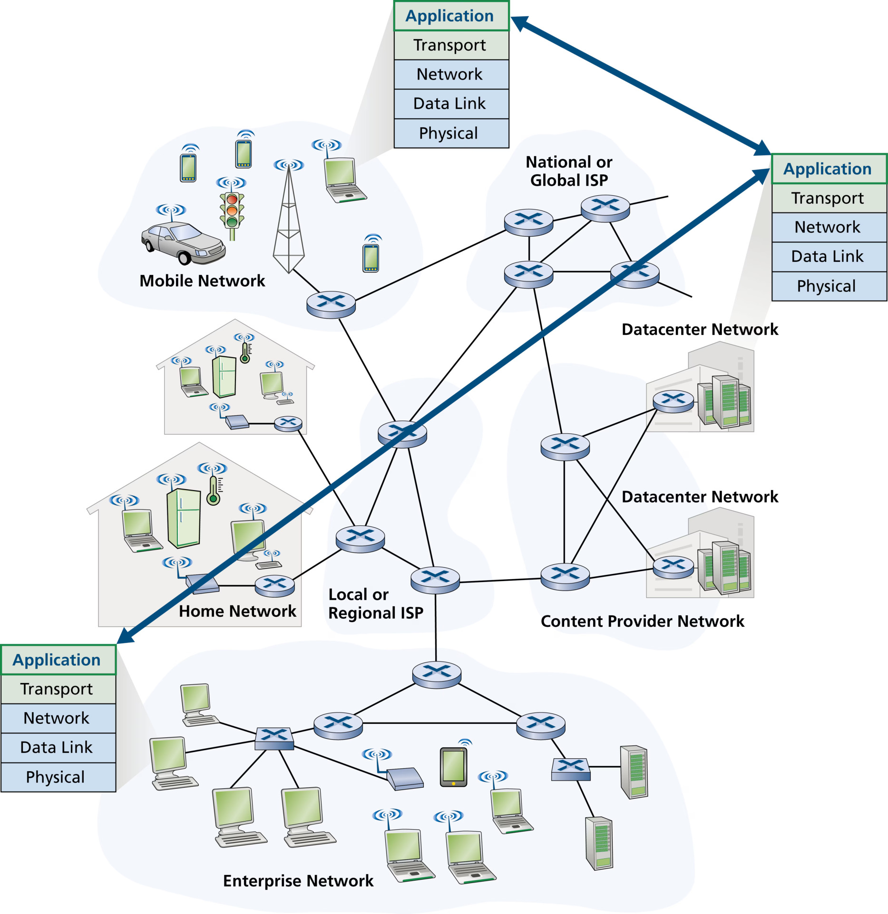

### 应用架构：客户端-服务器 vs P2P

**核心概念①：客户-服务器与 P2P 架构**—— 应用架构（application architecture）由应用开发者设计，决定了应用如何在各端系统间组织；它与网络架构（五层协议栈）是两个不同的概念。现代网络应用只有两大主流架构：**客户-服务器架构（client-server architecture）** 与 **对等架构（P2P，peer-to-peer）**。

**① 客户-服务器架构（C/S）。** 存在一个 **始终在线（always-on）** 的主机——**服务器（server）**，为众多称为 **客户（client）** 的主机提供服务。经典例子是 Web：始终在线的 Web 服务器响应运行在客户端主机上的浏览器。C/S 架构有两大特征：第一，**客户之间不直接通信**（两个浏览器互不对话）；第二，**服务器有固定、众所周知的 IP 地址**，且始终在线，因此客户总能通过向该地址发送分组来联系服务器。Web、电子邮件、视频流都是 C/S 架构的典型。单台服务器往往无法承受海量请求，于是用容纳大量主机的 **数据中心（data center）** 构造强大的虚拟服务器——谷歌、百度、淘宝、Gmail 等顶级服务全部跑在数据中心里。

**② 对等架构（P2P）。** 几乎不依赖数据中心里的专用服务器，而是利用成对 **间歇性连接的主机（对等方 peer）** 之间的直接通信。对等方由用户控制（家庭、校园、办公室的桌面机与笔记本），不归服务提供商所有。文件共享应用 **BitTorrent** 是 P2P 的典范。P2P 最迷人的特性是 **自扩展性（self-scalability）**：每个对等方在请求文件（产生负载）的同时也向系统贡献服务能力（分发文件），因此系统容量随用户数增长。它还 **成本低廉**（几乎不需要服务器基础设施与带宽），但高度分散的结构带来安全、性能与可靠性上的挑战——所以今天绝大多数应用仍采用 C/S 架构。


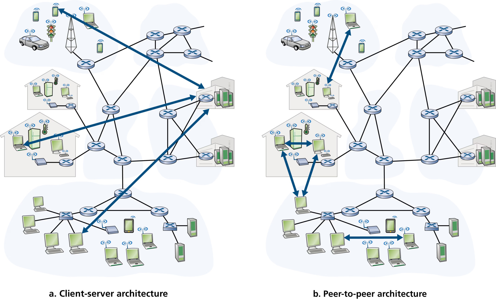

### 进程通信与套接字接口

**核心概念②：套接字接口（socket interface）**—— 操作系统术语中，互相通信的不是「程序」而是 **进程（process）**——运行在端系统内的程序。同一主机上的进程用进程间通信（IPC）交流；本书关心的是 **不同主机**（可能运行不同操作系统）上的进程如何通信：它们通过计算机网络 **交换报文（message）**。

**客户进程与服务器进程的判定标准（408 常考）：** 在一对通信进程中，**发起通信（会话开始时首先联系对方）的一方是客户进程**，**等待被联系而开始会话的一方是服务器进程**。注意：这一判定与「谁更强大」无关，纯粹由「谁先联系谁」决定——例如 SMTP 中，发送方邮件服务器向接收方邮件服务器发邮件时，前者充当 SMTP 客户。

进程把报文送进网络、从网络接收报文，靠的是软件接口 **套接字（socket）**。

!!! info "定义：套接字（Socket）"

    **英文原文（权威定义）：**

    > A process sends messages into, and receives messages from, the network through a software interface called a **socket**. A socket is the interface between the application layer and the transport layer within a host.

    **中文解释：** 套接字是进程与计算机网络之间的软件接口，也是 **应用层与传输层之间的接口**，是应用程序与网络之间的 **应用程序编程接口（API，Application Programming Interface）**。应用开发者控制套接字应用层一侧的一切，但对传输层一侧几乎没有控制——唯一能做的两件事是：**选择传输层协议**（TCP 或 UDP），以及（可能）调整少数传输层参数（如最大缓冲区、最大报文段长度）。

    **类比：** 进程好比一栋房子，套接字就是它的门。进程把报文从门（套接字）推出去，就假定门外的运输基础设施会把报文送到目的进程的门前；目的进程从自己的门（套接字）收到报文后采取动作。

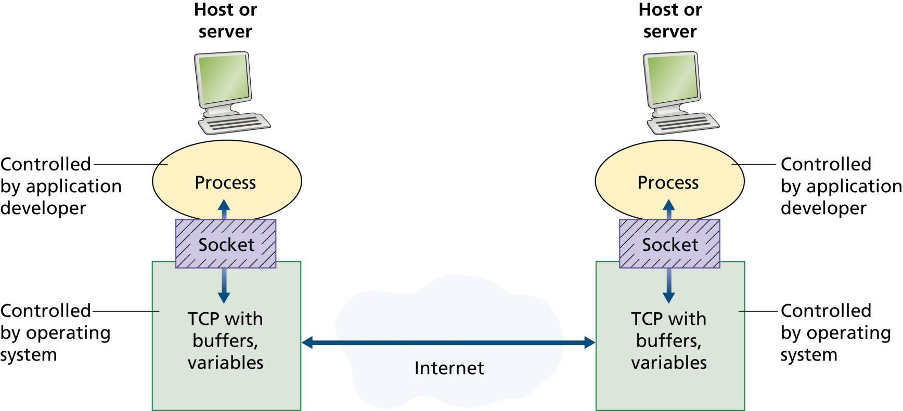

**进程寻址：IP 地址 + 端口号。** 要把报文送给另一台主机上的特定进程，需要两个信息：① 目的 **主机的 IP 地址**（唯一标识主机）；② 目的主机上 **接收进程（接收套接字）的标识符——端口号（port number）**。一台主机可能运行许多网络应用，端口号负责「分用」：到达主机的报文按目的端口交给对应套接字。流行的应用被分配了 **熟知端口号（well-known port number）**：Web 服务器用端口 **80**（HTTP），邮件服务器用端口 **25**（SMTP），DNS 用端口 **53**，完整列表见 www.iana.org。408 常考记忆：**HTTP 80 / HTTPS 443 / FTP 20、21 / SMTP 25 / DNS 53 / TFTP 69 / POP3 110 / IMAP 143 / SNMP 161**。

### 应用需要的传输服务

选择传输层协议前，先看应用需要哪类服务。传输层协议能提供的服务可沿四个维度分类：

- **可靠数据传输（reliable data transfer）**：保证发送方数据 **无差错、无丢失、按序** 送达接收方。电子邮件、文件传输、Web 文档、金融应用绝不容忍数据丢失；而 **容忍丢失的应用（loss-tolerant application）**——如对话式音频/视频——丢失一点数据只造成轻微卡顿，可以接受。
- **吞吐量（throughput）**：发送进程沿网络路径向接收进程交付比特的速率。**带宽敏感型应用（bandwidth-sensitive application）** 有明确的最低吞吐量要求（如以 32 kbps 编码的因特网电话）；**弹性应用（elastic application）** 则能用多少用多少（电子邮件、文件传输、Web 传输）——多多益善。
- **时延（timing）**：对交互式实时应用（因特网电话、视频会议、多人游戏）至关重要——过长的时延会造成交谈停顿、操作无响应。非实时应用「越短越好」但无硬性约束。
- **安全（security）**：传输协议可提供加密（保密性）、数据完整性、端点认证等服务。

### 因特网提供的传输服务：TCP 与 UDP

因特网（TCP/IP 网络）只向应用提供 **两个** 传输层协议：TCP 与 UDP。应用开发者创建新应用时，第一个决策就是 **选 TCP 还是 UDP**。

**TCP 服务（面向连接 + 可靠交付）：**

- **面向连接服务（connection-oriented service）**：应用层报文流动前，客户与服务器先交换传输层控制信息（**握手 handshaking**），之后两者套接字之间建立 **TCP 连接**。该连接是 **全双工（full-duplex）** 的——双方可同时向对方发送报文；应用结束后必须 **拆除连接**。
- **可靠数据传输服务**：TCP 保证把字节流 **无差错、无重复、按序** 送达对方套接字——发送方把字节流丢进套接字即可高枕无忧。
- **拥塞控制（congestion control）**：当网络拥塞时，TCP 主动 **节流发送进程**，并力求让每个 TCP 连接公平分享链路带宽——这是为「因特网的公共福利」服务，而非直接造福通信双方。

**UDP 服务（无连接 + 不可靠）：** UDP 是「简朴、轻量」的协议，提供最小服务：**无握手**、**不可靠数据传输**（报文可能永远到不了接收进程，到达的报文也可能乱序）、**无拥塞控制**（发送方想多快就多快地向网络层泵数据）。因特网电话/视频会议（如 Zoom）常跑在 UDP 上：它们容忍部分丢失，却需要最低速率——UDP 绕开了 TCP 的拥塞控制与分组开销。但许多防火墙屏蔽 UDP 流量，因此这类应用常把 TCP 作为备选。

**Focus on Security：用 TLS 增强 TCP。** TCP 与 UDP 本身 **都不提供加密**——明文密码会以原样穿越所有中间链路、随时可能被嗅探。因特网社区为 TCP 开发了增强方案 **TLS（传输层安全协议，Transport Layer Security，RFC 5246）**：TCP+TLS 在保留 TCP 全部能力的同时，提供加密、数据完整性与端点认证。注意 **TLS 不是第三个传输层协议**，而是对 TCP 的增强，其实现在 **应用层**：应用调用 TLS 套接字 API（与 TCP 套接字 API 类似），明文数据交给 TLS，TLS 加密后交给 TCP 套接字发送；接收方反向解密。TLS 的细节在第八章详述。

**因特网不提供的服务：** 今天因特网的传输协议 **不提供任何吞吐量或时延保证**。时延敏感应用（视频会议）之所以能跑，靠的是 **聪明的设计去适应**（自适应编码等），而非网络保证。

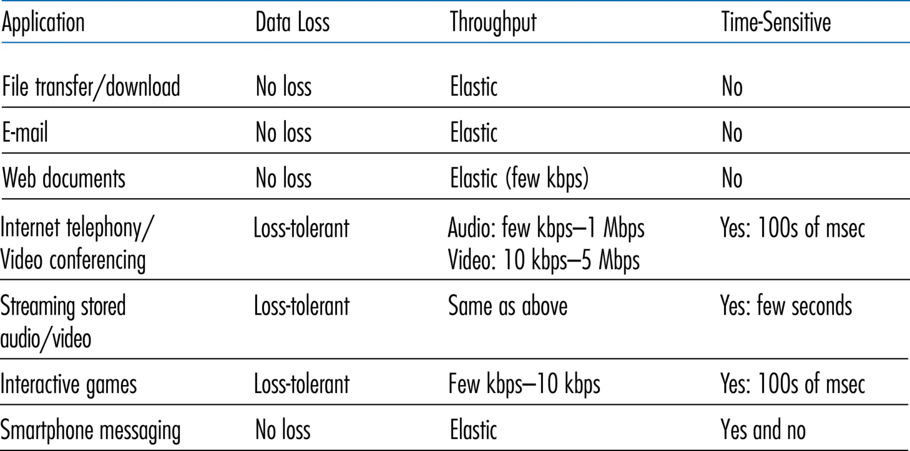

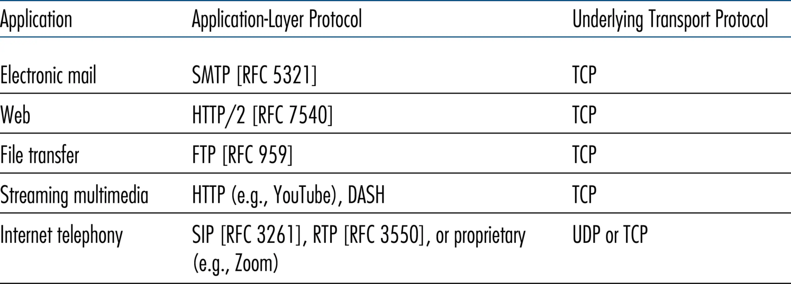

**常见应用与传输协议对照（408 必背）：** 电子邮件（SMTP）、远程终端访问（Telnet）、Web（HTTP）、文件传输（FTP）全部用 TCP——因为它们需要可靠数据传输；因特网电话/视频会议（如 Zoom、Skype）用 UDP；DNS 用 UDP（53 号端口）。**判断口诀：需要「保证送到」的用 TCP，能容忍丢失、追求低时延/低开销的用 UDP。**

### 应用层协议

进程通过套接字交换报文，但报文 **怎么构造**、**各字段什么意思**、**何时发送**？这些由 **应用层协议（application-layer protocol）** 定义。一个应用层协议要明确四件事：

1. **消息类型**：如请求消息与响应消息；
2. **各种消息类型的语法**：消息中的字段及其界定方式；
3. **字段的语义**：字段中信息的含义；
4. **规则**：进程何时、如何发送消息，以及如何响应。

部分应用层协议写在 **RFC** 中（公开标准）：HTTP（RFC 7230）就是如此——浏览器开发者与 Web 服务器开发者只要各自遵守 RFC，程序就能互通。另一部分应用层协议是 **专有（proprietary）** 的，如 Zoom 的自有协议。务必区分 **网络应用** 与 **应用层协议**：应用层协议只是网络应用的一个（重要）组成部分。Web 应用 = HTML 标准 + 浏览器（Chrome、Edge）+ Web 服务器（Apache、Nginx）+ 协议 HTTP；Netflix 视频服务 = 存视频的服务器 + 计费服务器 + 客户端 App + 应用级 DASH 协议。

### 本书覆盖的应用

新应用每天都在诞生，本书只精讲四个 **既普及又重要** 的应用：**Web**（协议 HTTP 相对简单，作为开篇）、**电子邮件**（因特网第一个杀手级应用，涉及多个应用层协议）、**DNS**（目录服务，体现「核心网络功能在应用层实现」）、**视频流与 CDN**（当今流量霸主）。

---

## 2.2 Web 与 HTTP

**高频考点**（HTTP 相关考频极高，2020#34、2022、2024 多次出现，其中「页面请求时间分析」几乎是必考计算）。

**核心概念③：HTTP 家族**—— Web 的传输协议 HTTP 历经四代演进：HTTP/1.0（RFC 1945，非持久连接）、HTTP/1.1（RFC 7230，默认持久连接）、HTTP/2（RFC 7540，单连接多路复用）、HTTP/3（RFC 9114，跑在 QUIC 上）。掌握四代的差异，就是掌握本章一半的计算题。今天绝大多数应用跑在 HTTP 之上：网页浏览、视频流、社交媒体、客户端与邮件服务器之间的邮件传输、智能手机 App 与服务器的通信——HTTP 已然成为因特网的「通用语言」。

### HTTP 概述：对象、URL 与无状态

Web 页面（文档）由 **对象（object）** 组成：对象是一个 **可由单个 URL 寻址的文件**——HTML 文件、JPEG 图像、JavaScript 文件、CSS 样式表或视频片段。大多数 Web 页 = 1 个 **基础 HTML 文件**+ 若干被引用对象。例如页面含 HTML 文本和 5 张 JPEG 图，则该页面有 **6 个对象**。每个 URL 有两个部分：**存放对象的主机名** 与 **对象的路径名**。URL `http://www.someSchool.edu/someDepartment/picture.gif` 的主机名是 `www.someSchool.edu`，路径名是 `/someDepartment/picture.gif`。浏览器实现 HTTP 的客户端，Web 服务器实现服务器端（Apache、Nginx、微软 IIS 是主流实现）。

HTTP 基于 TCP 运行（HTTP/3 例外，跑在 UDP 之上，见 2.2.7）：客户先与服务器建立 TCP 连接，之后双方通过套接字接口交换 HTTP 报文。由于 TCP 提供可靠数据传输，HTTP **完全不必操心丢包与重排**——这是分层体系结构的巨大优势。

!!! warning "常见误区：HTTP 是「无状态」还是「无连接」？"

    两个说法都对，但含义不同，408 曾以此设题。

    - **无状态（stateless）**：HTTP 服务器 **不保存客户的任何状态信息**。客户几秒内两次请求同一对象，服务器不会说「我刚发过」，而是照发不误——它完全忘记了自己做过什么。无状态简化了服务器设计，使高性能服务器能同时处理数千条 TCP 连接。
    - **无连接**：HTTP 在交换报文前 **不先建立 HTTP 连接**——它直接利用 TCP 连接（TCP 的连接建立属于传输层）。严格说，HTTP/1.0 每次请求/响应后关闭 TCP 连接（非持久），HTTP/1.1 则保持连接（持久）。

    **记忆：**「无状态」针对服务器记忆（不记得客户），「无连接」针对会话建立（不先握手）。两者常被混为一谈，答题时务必分开表述。

HTTP 经历了多代版本：早期 HTTP/1.0（RFC 1945，1996 年前后）、广泛部署的 HTTP/1.1（RFC 7230，1997）与 HTTP/2（RFC 7540，2015）都跑在 TCP 之上；最新标准化的 HTTP/3（RFC 9114，2022）跑在 UDP 之上，正快速抢占份额。

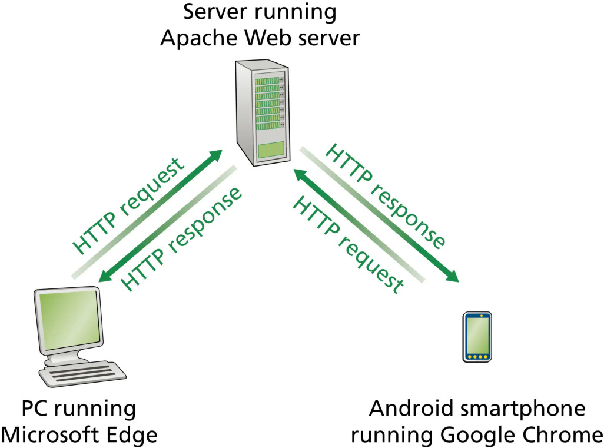

### 非持久与持久连接

**高频考点**（非持久/持久/流水线/并行连接的时间计算是 408 计算题第一梯队，2017#47、2020#34 均在此设题）。

当客户-服务器交互基于 TCP 时，应用开发者必须决策：**每个请求/响应对各用一条 TCP 连接，还是所有请求/响应共用同一条连接？** 前者称 **非持久连接（non-persistent connection）**，后者称 **持久连接（persistent connection）**。HTTP 两种都支持。

**非持久连接的工作过程（HTTP/1.0）：** 假设页面 = 基础 HTML 文件 + 10 张 JPEG 图，都在同一服务器：

1. HTTP 客户进程向服务器 `www.someSchool.edu` 的 **80 号端口** 发起 TCP 连接；
2. 客户经套接字发送 HTTP 请求报文（含路径名 `/someDepartment/home.index`）；
3. 服务器进程收到请求，从存储中取出对象，封装进 HTTP 响应报文，经套接字送回；
4. 服务器进程通知 TCP **关闭连接**（TCP 确认客户完整收到响应后才真正终止）；
5. 客户收到响应报文，提取 HTML 文件，发现其中对 JPEG 对象的引用；
6. 对每张 JPEG 图 **重复步骤 1-4**。

每条非持久 TCP 连接 **恰好传输一个请求报文和一个响应报文**，传输完即关闭——不为其后对象保留。因此上例共产生 **11 条 TCP 连接**。

**响应时间的粗略估算（envelope calculation）：** 定义 **往返时间（RTT，round-trip time）** 为小分组从客户到服务器再返回客户所需时间（含传播时延、中间路由器/交换机的排队时延与处理时延）。

!!! info "定义：往返时间（RTT）"

    **英文原文（权威定义）：**

    > The round-trip time (RTT) is the time it takes for a small packet to travel from client to server and then back to the client. The RTT includes packet-propagation delays, packet-queuing delays in intermediate routers and switches, and packet-processing delays.

    **中文解释：** RTT 是小分组「客户→服务器→客户」一个来回的时间，包含了传播时延、中间节点排队时延与处理时延，但不含发送方把大分组推入链路的时间。它是 HTTP 时间计算的基本计时单位——408 计算题中「每个 RTT = 多少毫秒」通常直接给出。

    用户点击超链接后：浏览器发起 TCP 连接需 **三次握手**——客户发小 TCP 报文段、服务器应答、客户再确认；前两步花 **1 RTT**；客户把 HTTP 请求报文与第三次握手（确认）**合并** 发出，服务器收到后把 HTML 文件放入 TCP 连接——请求/响应又花 **1 RTT**。因此 **非持久连接下，请求并接收一个 HTML 文件的响应时间 ≈ 2 RTT + 服务器传输 HTML 文件的时间**。

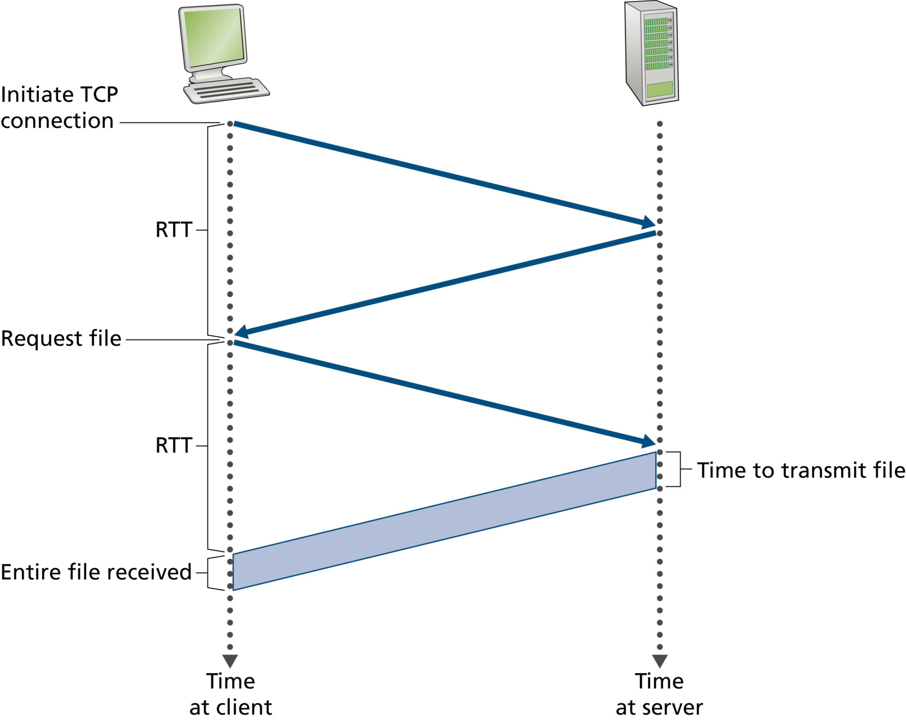

**非持久连接的缺点：** ① 每个请求对象都要 **新建并维护一条连接**（分配 TCP 缓冲区、维护 TCP 变量），给同时服务数百客户的服务器带来沉重负担；② 每个对象都遭受 **2 RTT** 的交付时延（1 RTT 建连 + 1 RTT 请求/接收）。

**持久连接（HTTP/1.1 默认）：** 服务器发送响应后 **保持 TCP 连接打开**，同一客户-服务器之间的后续请求/响应走同一条连接——整个 Web 页、甚至同一服务器的多个 Web 页都可经单条持久连接传输。请求还可以 **流水线（pipelining）** 方式发出：**背靠背连续发送、不等前一个请求的应答**；服务器收到背靠背请求后也背靠背地送回对象。典型情况下，服务器在连接空闲超过可配置的超时时间后关闭连接。

**时间对比（传输时间忽略、RTT 相同）：** 含 1 个基础 HTML + 5 张图像的页面：

- 非持久串行：2 RTT（HTML）+ 5 × 2 RTT = **12 RTT**；
- 非持久并行（浏览器同时开 5 条连接）：2 RTT（HTML）+ 2 RTT（5 图像并行）= **4 RTT**；
- 持久非流水线：2 RTT（HTML）+ 5 × 1 RTT = **7 RTT**；
- 持久流水线：2 RTT（HTML）+ 1 RTT（5 图像流水线）= **3 RTT**。

!!! example "例题 1：非持久与持久连接的响应时间计算（含并行连接）"

    某 Web 页面由 1 个基础 HTML 文件和 5 张 JPEG 图像组成（共 6 个对象），所有对象位于同一服务器。已知客户与服务器之间的 RTT = 100 ms，所有对象的传输时间可忽略，且页面首次访问前无任何缓存。分别求下列四种情况下的总响应时间：

    （1）HTTP/1.0 非持久连接，浏览器 **串行** 请求各对象（每次一条连接）；

    （2）HTTP/1.0 非持久连接，浏览器可同时打开 **5 条并行 TCP 连接**；

    （3）HTTP/1.1 持久连接，**非流水线** 方式；

    （4）HTTP/1.1 持久连接，**流水线** 方式。

    ??? answer "查看答案"
        **（1）非持久串行：** 每个对象都需要 1 RTT 建立 TCP 连接 + 1 RTT 发送请求并接收响应 = 2 RTT：

        $$ T_1 = 6 \times 2 \times 100 = 1200 \text{ ms} $$

        **（2）非持久并行：** 先取基础 HTML 文件花 2 RTT；浏览器解析出 5 张图的 URL 后，同时建立 5 条并行 TCP 连接（并行建连 1 RTT），再并行发送 5 个请求并接收响应（1 RTT）：

        $$ T_2 = 2 \times 100 + 2 \times 100 = 400 \text{ ms} $$

        **（3）持久非流水线：** 建立一条 TCP 连接（含 HTML 请求与响应的前 2 RTT 不变），此后每张图需 1 RTT（请求 + 响应）：

        $$ T_3 = 2 \times 100 + 5 \times 100 = 700 \text{ ms} $$

        **（4）持久流水线：** 建立连接并取回 HTML（2 RTT）后，5 个图像请求背靠背连续发出，服务器背靠背响应，全部只花 1 RTT：

        $$ T_4 = 2 \times 100 + 1 \times 100 = 300 \text{ ms} $$

        **结论：** 流水线持久连接（300 ms）最快，非持久串行（1200 ms）最慢。减少 RTT 开销的手段按代价从小到大是：**流水线 < 持久连接 < 并行连接**。

    ??? success "评分标准"

        - 非持久每对象 2 RTT 的概念（3 分）
        - 串行（1）计算正确（3 分）
        - 并行（2）计算正确（3 分）
        - 持久非流水线与流水线计算正确（各 3 分）
        - 结论对比表述（1 分，可并入前项）

### HTTP 报文格式

HTTP 报文分 **请求报文** 与 **响应报文** 两类，都以普通 ASCII 文本书写（人可读）。

**请求报文：** 典型的 HTTP 请求报文如下：

```text
GET /somedir/page.html HTTP/1.1
Host: www.someschool.edu
Connection: close
User-agent: Mozilla/5.0
Accept-language: fr
```

第一行是 **请求行（request line）**，其后是若干 **首部行（header line）**。请求行含三个字段：**方法（method）、URL 字段、HTTP 版本字段**。常用方法（408 常考，2015）：**GET**（绝大多数请求用它，请求 URL 标识的对象）、**POST**（用户填写表单时，实体主体携带表单内容）、**HEAD**（服务器只返回响应报文、不返回对象，常用于调试）、**PUT**（把对象上传到服务器指定路径，配合 Web 发布工具）、**DELETE**（删除服务器上的对象）。首部行示例含义：`Host:` 指明对象所在主机（Web 代理缓存必需）；`Connection: close` 告知服务器发完对象后关闭连接（不想要持久连接）；`User-agent:` 指明浏览器类型（服务器可据此发送不同版本对象）；`Accept-language:` 内容协商首部之一（用户希望优先收到的语言版本）。请求报文的一般格式见下图，实体主体在 GET 方法下为空，在 POST 方法下存放表单数据。表单也可用 GET：把输入数据拼进 URL 查询串，如 `www.somesite.com/animalsearch?monkeys&bananas`。


**响应报文：** 典型响应如下（响应上一例请求）：

```text
HTTP/1.1 200 OK
Connection: close
Date: Mon, 21 Oct 2024 18:58:21 GMT
Server: Apache/2.2.3 (CentOS)
Last-Modified: Sun, 20 Oct 2024 13:20:46 GMT
Content-Length: 6821
Content-Type: text/html

(data data data data data ...)
```

响应报文分三部分：**状态行（status line）**、**首部行** 与 **实体主体**。状态行含三个字段：**协议版本、状态码（status code）、相应状态短语**。首部行含义：`Date:` 服务器创建并发送响应的时刻（**不是** 对象创建/修改时刻）；`Server:` 类似请求报文的 `User-agent`（指出服务器软件）；`Last-Modified:` 对象最后修改时间（**对缓存至关重要**，见 2.2.5）；`Content-Length:` 对象字节数；`Content-Type:` 实体主体中对象的类型（由该首部正式标识，而非文件扩展名）。

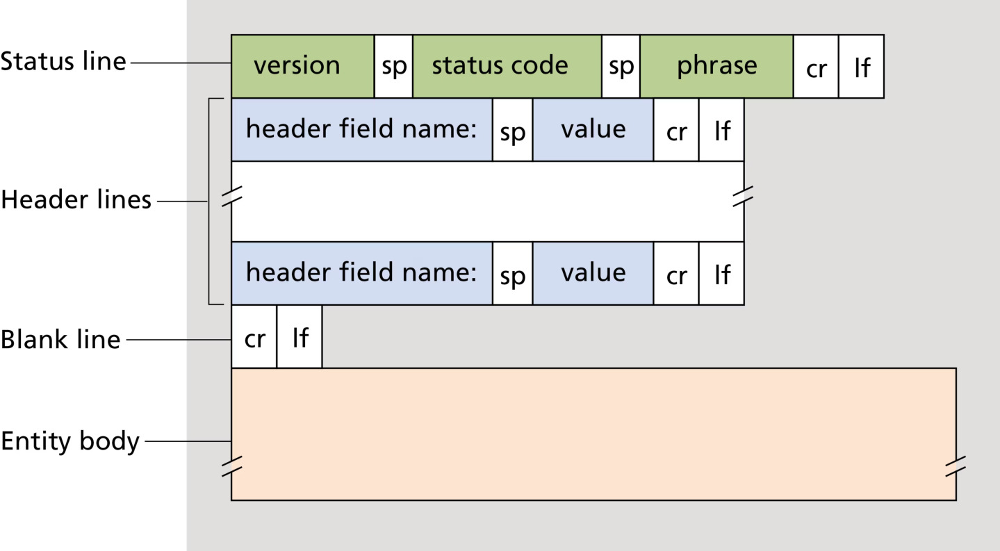

**常用状态码与短语（408 常考）：**

- **200 OK**：请求成功，所请求对象在响应中返回；
- **301 Moved Permanently**：请求对象已永久迁移，新 URL 在响应报文的 `Location:` 首部中，客户软件自动获取新 URL；
- **400 Bad Request**：通用错误码，服务器无法理解该请求；
- **404 Not Found**：服务器上不存在所请求的文档；
- **505 HTTP Version Not Supported**：服务器不支持请求所用的 HTTP 协议版本。

!!! example "例题 2：HTTP 报文格式辨析（写请求报文 / 解析状态码）"

    （1）用浏览器访问 `http://www.someschool.edu/someDepartment/home.index`，请写出一个完整的 HTTP/1.1 GET 请求报文（要求包含 Host、Connection、User-agent、Accept-language 四个首部行），并说明各行含义。

    （2）服务器返回的响应状态行为 `HTTP/1.1 404 Not Found`，请解释其含义；若对象已永久迁移到 `http://www.someschool.edu/new/home.index`，服务器应返回哪个状态码、如何告知浏览器新位置？

    （3）判断：`HTTP/1.1 505 HTTP Version Not Supported` 表示服务器内部出错。（ ）

    ??? answer "查看答案"
        **（1）请求报文：**

        ```text
        GET /someDepartment/home.index HTTP/1.1
        Host: www.someschool.edu
        Connection: close
        User-agent: Mozilla/5.0
        Accept-language: zh-CN
        ```

        请求行三个字段：方法 GET（请求读取对象）、相对 URL `/someDepartment/home.index`、HTTP 版本 1.1。首部行：Host 指明对象所在主机（代理缓存必需）；Connection: close 要求服务器发完即关闭连接（非持久）；User-agent 指明浏览器类型；Accept-language 声明用户优先接受中文版本。

        **（2）**`404 Not Found` 表示服务器上不存在所请求的文档，属 **客户端错误**（URL 拼错或资源已删除）。若对象 **永久** 迁移，应返回 **301 Moved Permanently**，并在 `Location:` 首部行给出新 URL，浏览器自动重定向到新地址。

        **（3）错误（×）。** 505 表示 **服务器不支持请求所用的 HTTP 协议版本**——例如用 HTTP/2.0 的格式请求一台只支持 1.1 的服务器。它不属于「服务器内部出错」（那是 5xx 类中的 500 Internal Server Error）。

    ??? success "评分标准"

        - 请求行三字段正确（3 分）
        - 四个首部行书写与含义（各 1 分，共 4 分）
        - 404 含义（2 分）；301 + Location 重定向（3 分）
        - 判断题 505 语义辨析（2 分）

### 用户-服务器交互：Cookie

HTTP 服务器无状态，简化了设计，但 Web 站点常常希望 **识别用户**（限制访问、按身份提供内容）。为此 HTTP 使用 **Cookie**（RFC 6265），主流商业网站几乎都在用。Cookie 技术有 **四个组件**：

1. HTTP 响应报文中的 **Cookie 首部行**（Set-cookie）；
2. HTTP 请求报文中的 **Cookie 首部行**；
3. 用户端系统上的 **Cookie 文件**（由用户浏览器管理）；
4. Web 站点后端的 **数据库**。

工作流程（以 Susan 首次访问 Amazon 为例）：服务器收到请求后创建 **唯一识别号（identification number）**，在后端数据库中以该号建立条目；响应中带首部 `Set-cookie: 1678`。浏览器收到后，在 Cookie 文件中追加一行（含服务器主机名与识别号）；此后 Susan 每次向 Amazon 发请求，浏览器都从 Cookie 文件取出该站识别号，在请求中附上 `Cookie: 1678`。于是 Amazon 虽不知道 Susan 的名字，却清楚用户 1678 访问了哪些页面、顺序与时间——购物车、个性化推荐、一键下单都靠它实现。Cookie 在无状态的 HTTP 之上 **创建了用户会话层**：用户登录 Web 邮件后，浏览器持续向服务器发送 Cookie 信息，使服务器在整个会话期间都能识别该用户。

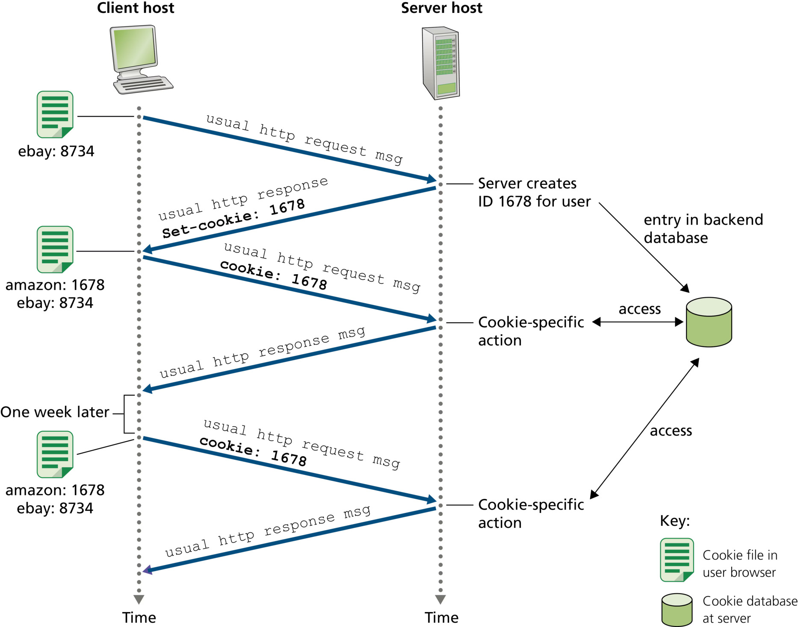

Cookie 让网购更便捷，但也有争议：服务器结合 Cookie 与用户注册信息，能掌握用户的大量行为数据，甚至可能卖给第三方——这是 **隐私** 问题。

### Web 缓存

能否把「获取 Web 对象」的时延降到 **1 RTT 甚至 0 RTT**？可以——用 **浏览器缓存（browser caching）**，现代所有浏览器都实现并广泛使用。浏览器把最近收到的 Web 对象 **本地存储** 在浏览器缓存中；用户再次请求该对象时，浏览器先检查本地缓存，命中则 **直接显示、不再向服务器发起新请求**。这既降低了用户感知时延，又减少了因特网上的 HTTP 流量。代价是引入了新挑战：**浏览器如何知道服务器上的对象自缓存以来是否被修改？**（图像、JS、CSS 很少变，文本可能频繁变）HTTP 提供两个机制（RFC 7232）：

- **Cache-Control**：响应报文中的 `Cache-Control` 字段让服务器指定缓存策略。`Cache-Control: no-store` 指示浏览器不要缓存；`Cache-Control: max-age=3600` 指示对象可缓存 3600 秒、过期后必须重新请求。
- **条件 GET（conditional GET）与 If-Modified-Since**：请求报文中带 `If-Modified-Since:` 首部行的 GET 报文称为条件 GET。客户在报文中告知服务器「我缓存里有该对象，缓存时间是 X」。若对象在 X 之后 **被修改过**，服务器返回完整对象；**未修改** 则返回 `304 Not Modified`（状态行含 304，**空实体主体**），告诉浏览器缓存副本仍然有效——省去重复传输整个对象（对大型对象尤其有价值）。典型流程：

```text
GET /fruit/kiwi.jpg HTTP/1.1
Host: www.exotiquecuisine.com
If-modified-since: Fri, 13 Sep 2024 09:23:24
```

服务器若确认对象未变，返回：

```text
HTTP/1.1 304 Not Modified
Date: Fri, 8 Nov 2024 12:07:29
Server: Apache/2.4.62 (Unix)
```

### HTTP/2：单连接上的多路复用

HTTP/2（RFC 7540，2015 年标准化）是 HTTP/1.1 之后第一个新版本，目标是 **降低用户感知时延**，核心手段是 **在单条 TCP 连接上实现请求/响应多路复用**，同时提供 **请求优先级**、**服务器推送** 与 **首部字段的高效压缩**。HTTP/2 **不改变** 方法、状态码、URL 与首部字段——只改变数据的 **格式化与传输方式**。

**为什么需要 HTTP/2？** HTTP/1.1 的持久连接让一个页面走单条 TCP 连接，但很快暴露出 **队头阻塞（HOL blocking，Head-of-Line blocking）** 问题：设想一个页面含基础 HTML、靠近顶部的一个大视频与许多小对象，路径上有低速瓶颈链路——视频要花很长时间挤过瓶颈，排在其后的小对象全部被阻塞。HTTP/1.1 浏览器通常 **打开多条并行 TCP 连接**（多数浏览器最多 6 条）绕过该问题，这既增加服务器负担，又因 TCP 拥塞控制「每条连接公平分带宽」而让浏览器可以「作弊」抢更多带宽。HTTP/2 的目标之一就是 **消灭（或减少）并行连接**：服务器只需维护更少的套接字，拥塞控制按设计意图工作。

**HTTP/2 分帧（framing）机制——最重要的增强：** 解决队头阻塞的答案是 **把每条消息拆成小帧（frame），在同一条 TCP 连接上交错传输**。例如视频占 100 帧、每个小对象占 2 帧：交错发送时，发完视频第 1 帧后紧接着发各小对象的第 1 帧、再发视频第 2 帧与各小对象第 2 帧——**所有小对象在传输 2 帧后就全部到达**；若不交错，小对象要等视频 100 帧全部发完。帧的拆分/重组由协议的 **分帧子层（framing sub-layer）** 完成：响应报文的首部成为一个帧、实体主体拆成若干帧；各响应的帧在服务器端交错后经单条持久 TCP 连接发送，客户端的分帧子层重组后再交给浏览器。分帧子层还 **对帧进行二进制编码**——二进制协议解析更高效、帧更小、不易出错。

**响应优先级与服务器推送：** 客户并发请求时可给每条消息赋予 **1-256 的权重**（数字越大优先级越高），并声明消息间的依赖关系，服务器据此优先发送高优先级响应的帧。**服务器推送（server push）** 让服务器针对客户的一个请求 **主动发送多个响应**：服务器解析 HTML 基础页，识别完整渲染所需的对象（CSS、JS、图像），在收到明确请求前就推送给客户，消除了「等客户逐个请求」的额外时延。

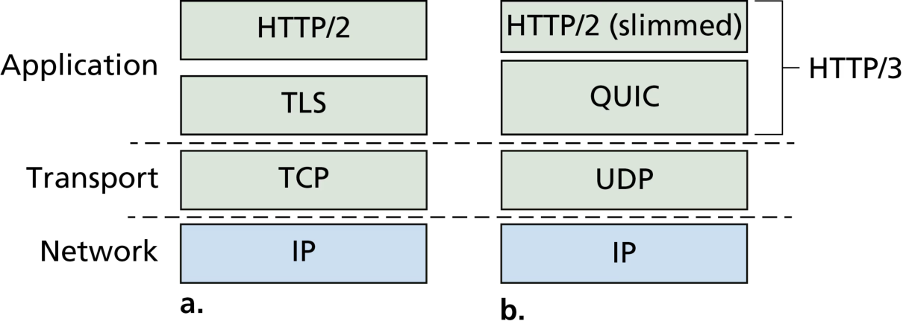

### HTTP/3 与 QUIC

HTTP/1.0、1.1、2 都跑在 TCP 上——但 HTTP/3（RFC 9114，2022 年标准化）**不跑在 TCP 上，而跑在 UDP 之上**！它已成为许多主流浏览器与智能手机应用的默认 HTTP 版本。谜底在于 QUIC。

**QUIC 传输协议（RFC 9000，2021）：** 严格说，因特网仍只有 TCP 与 UDP 两个传输层协议；**QUIC 实际上是应用层的一个子层**，它利用 UDP 收发分组——「QUIC = Quick UDP Internet Connections（快速 UDP 因特网连接）」。但从 **应用开发者视角**，QUIC 就是一个新的传输层协议：开发者创建 QUIC 套接字（类似创建 TCP/UDP 套接字），QUIC 子层在内部再创建 UDP 套接字，应用无需关心内部机制。

**为什么需要 QUIC？** 传统 HTTPS（TLS over TCP）需要 **两次握手**：先建 TCP 连接，再交换加密密钥，交互式应用（网页浏览）延迟明显。QUIC 把 TLS 握手 **吸收进初始连接建立**——连接建立与加密建立 **在一个往返** 内完成（重连时用缓存的会话与加密参数，可做到 **0-RTT** 直接传数据）。同时 QUIC 重新审视了队头阻塞：HTTP/2 把消息拆帧并多路复用在单条 TCP 连接上，但 **只要有一个分组丢失，TCP 就要求先重传并处理该分组**，其他无关消息全被延迟——这是 TCP 层面的新队头阻塞，在无线环境（丢包率高）尤其严重。QUIC **改用 UDP 并在同一 QUIC 连接内为每条消息（流 stream）独立实现可靠传输**：一个流丢包只影响该流，其他流继续收发，彻底消除单连接 TCP 的队头阻塞。

**QUIC 服务一览（与 TCP 对比记忆）：** 与 TCP 相同——**面向连接**（在无连接的 UDP 之上建立 QUIC 连接）、**可靠数据传输**、**拥塞控制与流量控制**；超出 TCP 的额外服务——**内置加密**（TLS 直接集成，默认加密，省去独立 TLS 握手）、**独立数据流**（多条流可同时收发、互不干扰、可分别管理优先级）、**0-RTT 握手**（老客户重连免握手直接发数据）、**连接迁移（connection migration）**（客户 IP 改变——如从 WiFi 切到蜂窝——连接保持存活）。

**HTTP/3：跑在 QUIC 上的 Web。** HTTP/3 是 HTTP 的最新版本，与前几代相比 **唯一的主要改变** 是：不再用客户-服务器之间的持久 TCP 连接发送 HTTP 报文，而改用 **持久 QUIC 连接**。HTTP 报文格式本身不变。借助 QUIC 的快速建连、加密、独立流多路复用、优先级与连接迁移，HTTP/3 能并行高效安全地交付 Web 页面的多个对象，同时降低时延。

---

## 2.3 因特网电子邮件

电子邮件自因特网诞生之初就存在，是最早的杀手级应用，如今仍是使用最广泛的应用之一。因特网邮件系统有 **三大组件**：**用户代理（user agent）**、**邮件服务器（mail server）** 与 **简单邮件传输协议（SMTP）**。

- **用户代理**：允许用户阅读、回复、转发、保存与撰写消息。Outlook、Apple Mail、基于 Web 的 Gmail 都是用户代理。Alice 写完邮件，用户代理把消息发给她的邮件服务器，放入服务器的 **外出消息队列**。
- **邮件服务器**：邮件基础设施的核心。每个收件人（如 Bob）在某个邮件服务器上有一个 **邮箱（mailbox）**。典型旅程：消息从发送方用户代理出发 → 发送方邮件服务器 → 接收方邮件服务器 → 存入收件人邮箱。发送方邮件服务器还要 **应对接收方服务器故障**：若投递失败，消息留在队列中，每 **30 分钟** 左右重试一次；数天后仍失败则删除消息并给发送方回一封通知邮件。
- **SMTP**：电子邮件的主要应用层协议，用 TCP 的可靠数据传输把邮件从发送方邮件服务器传到接收方邮件服务器。邮件服务器同时运行 SMTP 的客户侧与服务器侧：向其他服务器发邮件时充当 SMTP 客户，收邮件时充当 SMTP 服务器。


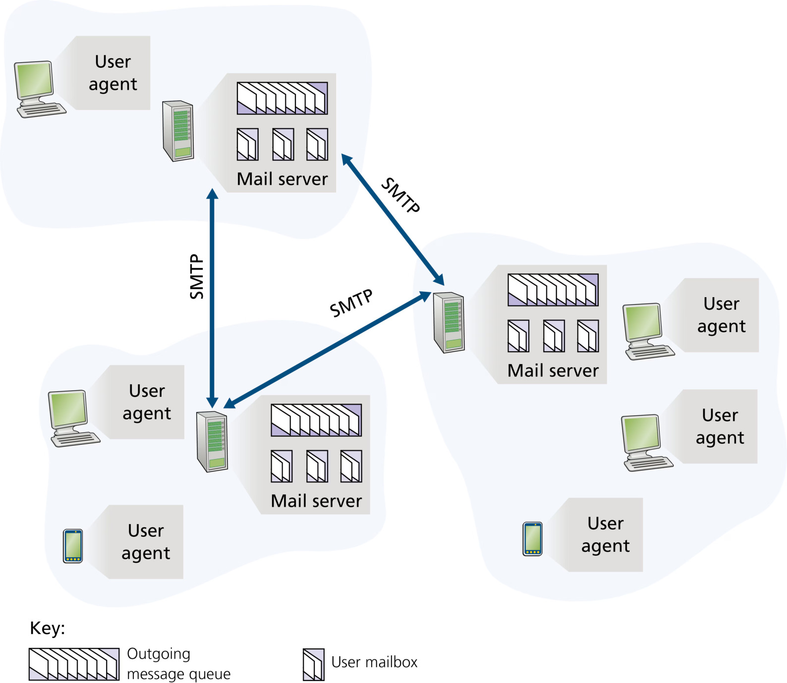

### SMTP

SMTP（RFC 5321）是电子邮件的心脏，比 HTTP 古老得多（原始 RFC 可追溯至 1982 年）。它有一条 **陈旧限制**：把 **所有邮件报文的主体（不仅是首部）限制为简单 7 位 ASCII**。在 1980 年代初这合情合理，但在多媒体时代，二进制多媒体数据必须先编码成 ASCII 才能经 SMTP 传输、到达后再解码回二进制。注意 **HTTP 不要求多媒体数据做 ASCII 编码**——这是两者的重要差异。

**SMTP 传输消息的基本流程（Alice → Bob）：**

1. Alice 调用用户代理，填写 Bob 的邮箱地址（bob@someschool.edu）、撰写消息并发送；
2. Alice 的用户代理把消息发给她的邮件服务器，放入消息队列；
3. 运行在 Alice 邮件服务器上的 SMTP **客户侧** 发现队列中的消息，向运行在 Bob 邮件服务器上的 SMTP **服务器侧** 打开一条 TCP 连接；
4. 经过初始 SMTP 握手后，SMTP 客户把 Alice 的消息送入 TCP 连接；
5. Bob 邮件服务器的 SMTP 服务器侧收到消息，放入 Bob 的邮箱；
6. Bob 随时调用用户代理读取消息。

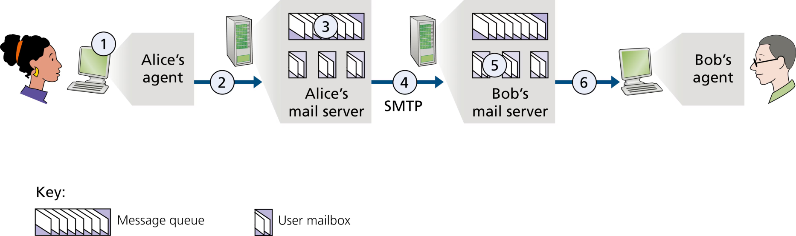

**关键观察：** SMTP **通常不使用中间邮件服务器**——即使 Alice 的服务器在香港、Bob 的在圣路易斯，TCP 连接也是两服务器间的 **直接连接**；Bob 的服务器若宕机，消息留在 Alice 的服务器等待重试，**不会** 被放到某个中间服务器。

**SMTP 会话实录（与人类面对面交流的「自我介绍」异曲同工）：** SMTP 客户连接服务器的 **25 号端口**，握手阶段双方「自我介绍」（客户指明发件人与收件人邮箱地址），随后客户发送消息。客户发五个命令：**HELO**（打招呼）、**MAIL FROM**（发件人）、**RCPT TO**（收件人）、**DATA**（数据）、**QUIT**（退出）；消息以 **单独一行的句点**（CRLF.CRLF）结束。服务器对每条命令返回 **应答码**（220、250、354、221 等）。

```text
S: 220 hamburger.edu
C: HELO crepes.fr
S: 250 Hello crepes.fr, pleased to meet you
C: MAIL FROM: <alice@crepes.fr>
S: 250 alice@crepes.fr ... Sender ok
C: RCPT TO: <bob@hamburger.edu>
S: 250 bob@hamburger.edu ... Recipient ok
C: DATA
S: 354 Enter mail, end with "." on a line by itself
C: Do you like ketchup?
C: How about pickles?
C: .
S: 250 Message accepted for delivery
C: QUIT
S: 221 hamburger.edu closing connection
```

**SMTP 使用持久连接：** 发送方邮件服务器若有 **多条消息** 要发给同一接收方服务器，可全部经同一条 TCP 连接发送——每条消息以新的 `MAIL FROM:` 开始，以孤立句点结束，全部发完才发出 QUIT。

!!! example "例题 3：SMTP 与 HTTP 的对比辨析"

    从报文格式、消息类型、推/拉方式、传输层协议与端口、连接方式、中间节点六个方面，对比 SMTP 与 HTTP 的异同。

    ??? answer "查看答案"
        | 对比维度 | SMTP | HTTP |
        |:---|:---|:---|
        | **报文格式** | 主体限制为 **7 位 ASCII**（多媒体需先经 MIME 编码） | 可传输**任意格式**的多媒体数据（无需 ASCII 编码） |
        | **消息类型** | 命令（HELO/MAIL FROM/RCPT TO/DATA/QUIT）+ 应答码 | 请求（GET/POST 等）+ 响应（状态码） |
        | **推/拉** | **推（push）**：客户把消息推送给服务器 | 请求-响应模式（客户拉取对象） |
        | **传输层与端口** | TCP，**25 号端口** | TCP（HTTP/3 为 UDP），**80 号端口** |
        | **连接方式** | 持久连接（多条消息共用一条 TCP 连接） | HTTP/1.0 非持久、HTTP/1.1+ 持久（可流水线） |
        | **中间节点** | **不使用中间邮件服务器**（发送方服务器直达接收方服务器） | 可经 Web 缓存/代理服务器中转 |

        **本质区别一句话：** 两者都基于 TCP 的文本协议，但 SMTP 是 **推协议**（把邮件推给对端，邮件最终目的地与连接目的地一致），HTTP 是 **请求-响应/拉协议**（客户请求对象，Web 对象可经代理缓存获取）；SMTP 限制 7 位 ASCII，HTTP 无此限制。

    ??? success "评分标准"

        - 报文格式差异（2 分）
        - 推/拉本质区别（3 分）
        - 端口与传输层协议（2 分）
        - 连接方式与中间节点差异（各 2 分）
        - 综合表述（1 分）

### 邮件报文格式

Alice 写普通信件会在顶部写收件人地址、回信地址、日期等外围信息；电子邮件同样在正文前带一组 **首部行**，由 **RFC 5322** 定义其精确格式与语义解释。首部行与正文之间以 **空行**（CRLF）分隔。与 HTTP 类似，每个首部行由「关键字: 值」组成，有些关键字必需、有些可选。**每个首部必须有 `From:` 与 `To:` 行**，还可有 `Subject:` 行等。典型消息首部：

```text
From: alice@crepes.fr
To: bob@hamburger.edu
Subject: Searching for the meaning of life.

（空行后是消息主体）
```

**注意：** 这些首部行与 2.3.1 的 SMTP 命令 **不是一回事**——SMTP 命令属于握手协议，这里的首部行属于邮件消息本身。

**MIME（多用途因特网邮件扩展）。** SMTP 只能传 7 位 ASCII 文本，中文、俄文、重音法文德文以及可执行文件、二进制对象都无法直接传输。**MIME（Multipurpose Internet Mail Extensions）** 并未改动或取代 SMTP：当邮件含非 ASCII 数据时，发送端用 MIME 把数据 **编码为 ASCII 码**，之后仍用 SMTP 传输；接收端再用 MIME **逆转换** 还原。MIME 与 SMTP 的关系可记为「SMTP 负责传，MIME 负责转」。

### 邮件访问协议：POP3 / IMAP / HTTP

邮件送到 Bob 的邮箱后，Bob 如何取回？**注意：不能用 SMTP 取**——取邮件是 **拉（pull）** 操作，而 SMTP 是 **推（push）** 协议。今天有两条主流路径：**基于 Web 的邮件（如 Gmail）用 HTTP 取邮件**（要求 Bob 的邮件服务器既有 SMTP 接口与 Alice 的服务器通信，又有 HTTP 接口供浏览器访问）；传统邮件客户端（如 Outlook）用 **IMAP（因特网邮件访问协议，Internet Mail Access Protocol，RFC 3501）**。HTTP 与 IMAP 两种方式都允许 Bob 管理邮件服务器上的文件夹——移动、删除、标记重要邮件等。

- **POP3（邮局协议版本 3，Post Office Protocol）**：更古老的拉取协议，用户在用户代理上运行 POP3 客户，连邮件服务器的 **110 号端口**；以「下载并（可选）删除服务器上的邮件」为特点，简单但灵活性差。
- **IMAP**：更强大的拉取协议，**143 号端口**；邮件 **保存在服务器** 上，用户代理操作服务器邮箱中的文件夹，多设备同步友好。
- **Web 邮件**：用户代理（浏览器）用 HTTP 与邮件服务器交互，服务器内部再用 SMTP 与其他邮件服务器交换邮件。


**为什么用户代理不直接把邮件发给 Bob 的服务器？** 分两步走（Alice 用户代理 → Alice 邮件服务器 → Bob 邮件服务器）的主要原因：不经自己邮件服务器中转的话，Alice 的用户代理对不可达的目的服务器 **没有任何补救办法**；而 Alice 的邮件服务器可以每 30 分钟重试，直到 Bob 的服务器恢复。

---

## 2.4 DNS——因特网的目录服务

**高频考点**（DNS 相关考频极高：2010、2016、2020、2021 多次出现，递归/迭代查询与报文计数是经典简答）。

主机有两种标识：**主机名（hostname）**——如 `www.facebook.com`，好记但 **几乎不包含主机位置信息**，且可变长字母数字串难以被路由器处理；**IP 地址**——如 `121.7.106.83`，固定长度（4 字节）、有严格的层次结构。人们偏爱主机名，路由器偏爱 IP 地址。调和两者的 **目录服务** 就是 **域名系统（DNS，Domain Name System）**。

**DNS 的定位（408 常考）：** DNS 是（1）一个 **分布式数据库**，实现在 **层次化的 DNS 服务器** 上；（2）一个 **应用层协议**，允许主机查询该分布式数据库。DNS 协议 **运行在 UDP 之上，使用 53 号端口**。DNS 常被 HTTP、SMTP 等其他应用层协议用来把用户提供的主机名翻译成 IP 地址。**关键洞察：DNS 是应用层协议，却实现了一项核心网络功能（名字→地址转换）**——这再次体现了因特网「把复杂性放在网络边缘」的设计哲学。

**一次 DNS 参与的 Web 访问：** 浏览器请求 `www.someschool.edu/index.html` 时：① 用户主机的 DNS 客户侧运行起来；② 浏览器从 URL 提取主机名，交给 DNS 客户侧；③ DNS 客户发送含主机名的查询报文给某 DNS 服务器；④ DNS 客户最终收到含 IP 地址的应答；⑤ 浏览器据此 IP 地址，向 80 端口的 HTTP 服务器进程发起 TCP 连接。可见 **DNS 给因特网应用增加了一次额外的、有时相当可观的时延**——幸好目标 IP 常缓存在「附近」的 DNS 服务器中，减少了 DNS 网络流量与平均时延。

### DNS 提供的服务

除主机名→IP 地址翻译外，DNS 还提供三项重要服务（408 常考概念）：

- **主机别名（host aliasing）**：一台主机可有多个别名。如 `relay1.west-coast.enterprise.com` 有两个别名 `enterprise.com` 与 `www.enterprise.com`，前者称 **规范主机名（canonical hostname）**。应用可请 DNS 获取别名对应的规范主机名及其 IP。
- **邮件服务器别名（mail server aliasing）**：让邮箱地址好记。Bob 的地址可能是 `bob@yahoo.com`，而 Yahoo 邮件服务器的规范主机名复杂得多。**MX 记录** 允许一家公司的邮件服务器与 Web 服务器使用相同的（别名）主机名——如两者都叫 `enterprise.com`。
- **负载分配（load distribution）**：繁忙站点（如 cnn.com）被复制到多台服务器，每台有不同 IP 地址；**一组 IP 地址关联一个别名主机名**。DNS 查询该名字时返回整组地址，但 **每次应答都轮转（rotate）地址顺序**。客户通常把 HTTP 请求发给列表中 **排第一** 的地址，于是 DNS 轮转把流量 **均匀分发** 到各复制服务器。内容分发公司（如 Akamai）还以更精巧的方式利用 DNS（见 2.5.3）。

### DNS 工作机制：层次化分布式数据库

**核心概念④：DNS 层次体系**—— DNS 不是一台服务器，而是由 **根、顶级、权威、本地四类服务器** 组成的层次化分布式数据库；查询从本地 DNS 服务器出发，沿「根 → 顶级 → 权威」逐级迭代（或递归）获得映射，再用缓存加速。这张层次图是 DNS 一切考题的地图。

**为什么不用单一 DNS 服务器？** 集中式设计虽然简单，却完全不适合今天的因特网：**单点故障**（服务器崩溃 = 整个因特网瘫痪）、**流量巨大**（数百亿台主机的一切 HTTP 请求与邮件都要过它）、**离客户太远**（纽约的服务器无法「靠近」澳大利亚的查询者）、**维护困难**（要维护所有主机的记录且频繁更新）。结论：**集中式数据库不可扩展，DNS 必须分布式设计**。

**四类 DNS 服务器（408 常考）：** 映射分布在全世界大量按层次组织的服务器上：

1. **根域名服务器（root DNS server）**：最高层次，约 **13 组**（13 个 IP 地址），2024 年全球已有近 **2000 个实例**（每个「服务器」实为冗余服务器集群），由 IANA 协调管理，每天处理数百亿次查询。根服务器提供 **顶级域名服务器的 IP 地址**。
2. **顶级域名（TLD）服务器**：管理所有顶级域（com、org、net、edu、gov 以及 uk、fr、ca、jp 等国家代码域）。Verisign 维护 com 顶级域的 TLD 服务器，Educause 维护 edu 域。TLD 服务器提供 **权威 DNS 服务器的 IP 地址**。
3. **权威 DNS 服务器（authoritative DNS server）**：每个在因特网上提供可公开访问主机的组织，都必须提供把主机名映射到 IP 地址的公开 DNS 记录，这些记录存放在该组织的 **权威 DNS 服务器** 上。组织可自建（多数大学与大公司维护主/备两台），也可付费存放在服务提供商的权威服务器上。
4. **本地 DNS 服务器（local DNS server，默认名字服务器）**：严格说 **不属于** 服务器层次，却是 DNS 架构的核心。**每个 ISP（住宅或机构）都有一个本地 DNS 服务器**；主机接入 ISP 时（通常经 DHCP）获得一个或多个本地 DNS 服务器的 IP 地址。本地 DNS 服务器通常「靠近」主机（机构 ISP 可能在同一条 LAN 上，住宅 ISP 相距不过几台路由器）。主机的 DNS 查询先发给本地 DNS 服务器，它作为 **代理** 把查询转发进 DNS 服务器层次。


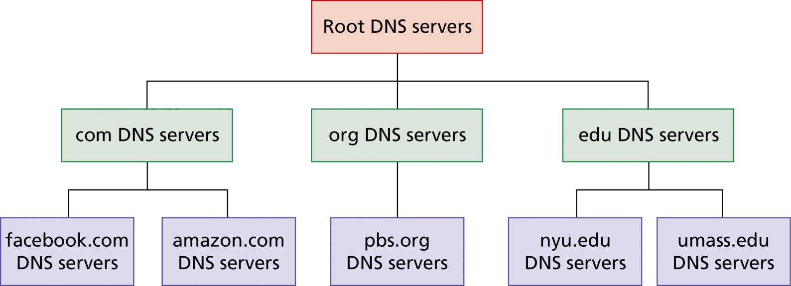

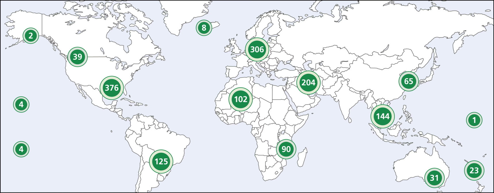


**查询链示例（408 必考流程）：** 主机 `cse.nyu.edu` 想解析 `gaia.cs.umass.edu` 的 IP，NYU 的本地 DNS 服务器为 `dns.nyu.edu`，UMass 的权威 DNS 服务器为 `dns.umass.edu`（无缓存）：

1. 主机向本地 DNS 服务器 `dns.nyu.edu` 发查询报文（含主机名 `gaia.cs.umass.edu`）；
2. 本地 DNS 服务器把查询转发给根 DNS 服务器；
3. 根服务器注意到 `edu` 后缀，返回负责 `edu` 的 TLD 服务器 IP 列表；
4. 本地 DNS 服务器把查询重发给其中一个 TLD 服务器；
5. TLD 服务器注意到 `umass.edu` 后缀，返回 UMass 权威 DNS 服务器 `dns.umass.edu` 的 IP；
6. 本地 DNS 服务器把查询直接发给 `dns.umass.edu`；
7. `dns.umass.edu` 返回 `gaia.cs.umass.edu` 的 IP 地址给本地 DNS 服务器；
8. 本地 DNS 服务器把结果返回给发起查询的主机。

**解析一个主机名共发出 8 条 DNS 报文（4 条查询 + 4 条应答）**。若 TLD 服务器只知道 **中间 DNS 服务器**（如 UMass 校级 `dns.umass.edu`，而各系还有自己的权威服务器 `dns.cs.umass.edu`），则链路上多一级，共 **10 条报文**。


**递归查询 vs 迭代查询（408 高频辨析，2010/2016/2020 考查）：**

- **递归查询（recursive query）**：查询方请求 DNS 服务器 **代自己去取回** 映射。主机 → 本地 DNS 服务器的查询是递归的：本地服务器承诺「我替你查到底，把结果给你」。
- **迭代查询（iterative query）**：DNS 服务器回复「我不知道，但 **你应该去问** 某台服务器」，由查询方（本地 DNS 服务器）自己继续发起后续查询。

**实践中的典型模式：主机 → 本地 DNS 服务器的查询是递归的，本地 → 根/TLD/权威的其余查询是迭代的**（如图 2.17 所示）。理论上任何查询都可是递归或迭代的：图 2.18 展示了 **全部递归** 的查询链——本地 DNS 服务器只需向根服务器查询一次，之后由各服务器递归接力；该方式把负载压给根服务器，实际中几乎不用。

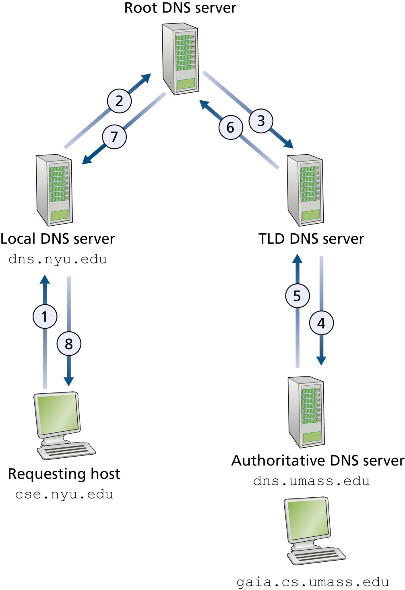


**DNS 缓存（DNS caching）：** DNS 大量利用缓存改善时延、减少报文数量。**当 DNS 服务器收到应答（如主机名→IP 映射）时，它可以把应答中的信息缓存在本地内存**。之后再有对同一主机名的查询，即使它对该名字并非权威，也能直接给出缓存的 IP。由于主机名-IP 映射并非永久，DNS 服务器 **一段时间后丢弃缓存信息**（常设为两天）。缓存还能存储 TLD 服务器的 IP 地址，使本地 DNS 服务器 **绕过根服务器**——事实上，根服务器只被一小部分查询真正访问。

!!! example "例题 4：DNS 递归与迭代查询过程描述（真题 2010 改编）"

    某主机 H 欲访问规范主机名为 `www.abc.xyz.com` 的网站，其本地 DNS 服务器（LDNS）缓存为空。

    （1）若 H 向 LDNS 采用递归查询、LDNS 向其他服务器采用迭代查询，请完整描述该解析过程，并说明共发送几条 DNS 报文。

    （2）若所有 DNS 服务器均采用迭代查询，LDNS 在完成解析的过程中 **最多** 需要向其他服务器发出几次查询？**最少** 呢？

    （3）DNS 缓存对上述过程有何影响？

    ??? answer "查看答案"
        **（1）递归 + 迭代的典型流程（共 8 条报文：4 查询 + 4 应答）：**

        ① H 向 LDNS 发递归查询请求（1 条）；② LDNS 向根服务器发迭代查询（1 条）；③ 根服务器返回 `com` 顶级域名服务器地址（1 条）；④ LDNS 向 `com` TLD 服务器发迭代查询（1 条）；⑤ `com` 服务器返回负责 `xyz.com` 的域名服务器地址（1 条）；⑥ LDNS 向该服务器发迭代查询（1 条）；⑦ 该服务器返回负责 `abc.xyz.com` 的权威服务器地址（1 条）；⑧ LDNS 向权威服务器发查询（1 条），权威服务器返回 `www.abc.xyz.com` 的 IP，LDNS 缓存结果并把 IP 交还 H（应答并入前一条计数，或不另计）。**严格计数：H→LDNS 1 条 + LDNS 向 4 台服务器各 1 条查询 + 4 条应答 = 8 条**（若把 LDNS→根/TLD/权威的应答分开计，则为 4 查询 + 4 应答）。

        **（2）** 全迭代时：**最少 0 次**（LDNS 缓存中有该映射，直接应答）；**最多 4 次**（依次迭代查询根服务器、`com` TLD 服务器、`xyz.com` 服务器、`abc.xyz.com` 权威服务器）。

        **（3）** 缓存使 LDNS 能 **直接应答重复查询**，减少跨网 DNS 报文；缓存 TLD 服务器地址还能 **绕过根服务器**。缓存条目有 TTL，过期即失效，避免长期使用过时映射。

    ??? success "评分标准"

        - 递归/迭代两种查询的概念区分（3 分）
        - （1）流程描述完整、报文计数 8 条正确（5 分）
        - （2）最多 4 次、最少 0 次（4 分）
        - （3）缓存作用（TTL、绕过根服务器）（2 分）

!!! tip "动手试试：交互式演示"

    配套交互 HTML：[DNS 域名解析过程交互演示](demos/DNS域名解析过程交互演示.html)（浏览器打开，逐步观察递归/迭代查询与缓存命中）。

### DNS 记录与报文

**资源记录（RR，Resource Record）：** DNS 分布式数据库存储四元组 **（Name, Value, Type, TTL）**。**TTL（生存时间）** 决定资源记录何时应从缓存移除。Name 与 Value 的含义取决于 Type（408 常考四种类型）：

- **A 记录**：Name 是主机名，Value 是主机名对应的 **IP 地址**。如 `(relay1.bar.foo.com, 145.37.93.126, A)`——标准的主机名→IP 映射。
- **NS 记录**：Name 是 **域**（如 foo.com），Value 是 **知道如何获取该域内主机 IP 地址的权威 DNS 服务器的主机名**。如 `(foo.com, dns.foo.com, NS)`——用于把查询继续导向查询链的下一级。
- **CNAME 记录**：Value 是别名主机名 Name 的 **规范主机名**。如 `(foo.com, relay1.bar.foo.com, CNAME)`——查询者据此获得主机名对应的规范名字。
- **MX 记录**：Value 是 **别名为 Name 的邮件服务器的规范主机名**。如 `(foo.com, mail.bar.foo.com, MX)`——使邮件服务器主机名可以有简单别名；公司因此可让邮件服务器与 Web 服务器共用同一别名（要查邮件服务器规范名就查询 MX 记录，要查其他服务器规范名就查询 CNAME 记录）。

若某 DNS 服务器对某主机名 **权威**，则服务器上必有该主机名的 **A 记录**（非权威也可能有缓存中的 A 记录）；若 **非权威**，则服务器上必有包含该主机名的域的 **NS 记录**，以及把 NS 记录 Value 字段中的 DNS 服务器名映射到 IP 的 **A 记录**。

**DNS 报文格式：** 查询与应答报文 **格式相同**，分五个部分：

1. **首部（header）**：**标识符（identifier）**——客户用它匹配收到的应答与发出的查询；**标志字段** 含——**QR**（0 表示查询、1 表示应答）、**AA**（authoritative，应答中置位表示该服务器是对所查名字的权威）、**RD**（recursion desired，客户希望服务器在无记录时执行递归）、**RA**（recursion available，应答中置位表示服务器支持递归）；另有 **四个「数量」字段**，指明其后四类数据段的个数。
2. **问题段（question）**：包含被查询的 **名字** 与 **类型**（如 Type A 主机地址、Type MX 邮件服务器）。
3. **回答段（answer）**：应答中包含被查询名字的资源记录（一个主机名可有多个 IP，故可返回多条 RR）。
4. **权威段（authority）**：其他权威服务器的记录。
5. **附加段（additional）**：其他有用记录——如对 MX 查询的应答中，回答段给出邮件服务器规范主机名，附加段给出该主机名的 A 记录（IP 地址）。

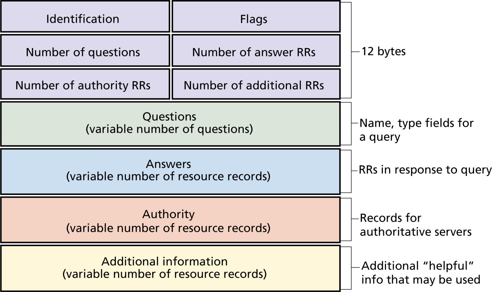

**向 DNS 数据库插入记录（注册过程）：** 假设你创建了新公司 Network Utopia，要注册域名 `networkutopia.com`：向 **注册机构（registrar）**（ICANN 认可的商业实体，负责验证域名唯一性、把域名录入 DNS 数据库）注册时，需提供主/辅权威 DNS 服务器的名字与 IP（如 `dns1.networkutopia.com`、`dns2.networkutopia.com`、`212.212.212.1`、`212.212.212.2`）。注册机构保证在 `com` TLD 服务器中写入两条记录——例如 `(networkutopia.com, dns1.networkutopia.com, NS)` 与 `(dns1.networkutopia.com, 212.212.212.1, A)`。之后你还要在自己的权威服务器中录入 Web 服务器的 A 记录与邮件服务器的 MX 记录。至此，全世界用户都能访问你的网站了：Alice 的主机 → 本地 DNS 服务器 → `com` TLD 服务器（含 NS 与 A 记录）→ 权威服务器 212.212.212.1（返回 `www.networkutopia.com` 的 IP）→ 浏览器发起 TCP 连接。**一次网页浏览背后，远比肉眼看到的复杂！**

**Focus on Security：DNS 漏洞。** DNS 是 Web 与邮件的基础，自然也成攻击目标：① **DDoS 带宽洪泛**——2002 年 10 月 21 日针对 13 个根服务器的攻击（靠包过滤与缓存绕过而收效甚微）；2016 年 10 月 21 日针对 TLD 服务商 **Dyn** 的攻击（约十万台被 **Mirai 恶意软件** 感染的 IoT 设备组成僵尸网络，Amazon、Twitter、Netflix、GitHub、Spotify 受影响近一整天）。② **中间人攻击**——拦截主机查询并返回伪造应答；**DNS 投毒（DNS poisoning）**——向 DNS 服务器发送伪造应答，骗其把伪造记录缓存起来；二者都可能把毫不知情的用户重定向到攻击者的网站。**DNSSEC（DNS 安全扩展，RFC 4033）** 是加固版 DNS，正逐步推广。

---

## 2.5 视频流与内容分发网络

流媒体视频（Netflix、YouTube、AppleTV、Amazon Prime 等）据估计占全球因特网流量的六成以上、移动网络流量近七成。本节介绍流媒体视频服务如何在今天的因特网中实现。

**核心概念⑤：CDN 与 DASH**—— 现代视频分发是「**DASH 分块自适应 + CDN 就近缓存**」的组合拳：视频被压缩成多档码率、切成数秒的小块，客户端按当前带宽自适应选择码率（DASH）；海量用户由分布全球的内容分发网络（CDN）就近服务，避免每一路视频都穿越整个因特网。

### 因特网视频

**流式存储视频（streaming stored video）** 的介质是预先录制的视频（电影、电视节目、体育赛事、用户生成视频），存放在服务器上，用户 **按需（on-demand）** 请求观看。先感受一下视频媒介本身：视频是图像序列，通常以恒定速率显示（如 **24 或 30 帧/秒**）；未压缩的数字图像是像素数组，每像素用若干比特表示亮度与颜色。视频 **可压缩**，在 **画质与比特率之间权衡**——现成的压缩算法可把视频压到任意想要的比特率，比特率越高画质越好。

**从网络角度看，视频最显著的特征是比特率高**：压缩后的因特网视频从低质量的约 100 kbps 到超高清的数 Mbps 不等，一小时视频消耗数 GB 的流量与存储。**流式视频最重要的性能指标是平均端到端吞吐量**：要连续播放，网络提供给流应用的平均吞吐量必须 **不低于压缩视频的比特率**（消费速率）。压缩还能生成同一视频的多个版本（如 300 kbps、1 Mbps、3 Mbps 三档），用户按当前可用带宽选择。

### HTTP 流与 DASH

**HTTP 流（HTTP streaming）：** 视频作为普通文件存放在 HTTP 服务器上，带特定 URL。用户想看时，客户端与服务器建立 TCP 连接、对该 URL 发 HTTP GET 请求；服务器在 HTTP 响应中尽快发送视频文件。客户端把收到的字节收集进 **应用缓冲区**，一旦缓冲区字节数超过预定阈值就开始播放——边接收边缓冲边播放。YouTube 自创立起就用这种方案，但它有个 **重大缺陷：所有客户端收到的是同一编码版本**，无视不同客户端之间、同一客户端不同时刻的巨大带宽差异。

**DASH（Dynamic Adaptive Streaming over HTTP，基于 HTTP 的动态自适应流）：** 为克服上述缺陷而诞生。在 DASH 中，视频被编码成 **多个不同比特率（对应不同画质）的版本**，客户端 **动态请求** 时长数秒的 **视频分块（chunk）**：可用带宽高时选高码率版本的分块，带宽低时选低码率版本。具体机制：

- 每个视频版本存放在 HTTP 服务器上，各有 **不同 URL**；
- 服务器还维护一个 **清单文件（manifest file）**，给出每个版本的 URL 与比特率；
- 客户端先请求清单文件，得知有哪些版本；再用带 **URL + 字节范围** 的 HTTP GET 请求逐块选择；
- 下载分块时客户端 **测量接收带宽**，运行 **速率确定算法（rate determination algorithm）** 决定下一个分块选哪个版本：缓冲区充足、实测带宽高 → 选高码率块；缓冲区告急、带宽低 → 选低码率块。

DASH 让不同接入速率的客户端各得其所（低速连接看低画质、光纤看高画质），也能在会话中随带宽波动自适应——这对移动用户（随基站移动带宽剧烈波动）尤其重要。**Netflix 的分块约 4 秒长**，客户端下载块时测吞吐量、按算法选下一块画质。

### 内容分发网络（CDN）

把视频全部放在一个巨型数据中心直接向全球客户端流式传输，有三个严重问题：① 客户端离数据中心远，端到端路径穿越多条链路、多家 ISP，一旦某条链路吞吐量低于消费速率就会卡顿（瓶颈链路定律）；② 热门视频会在同一条链路上被 **反复传输**，浪费带宽且公司要为重复发送付费；③ 单一数据中心是 **单点故障**。因此几乎所有大型视频公司都用 **CDN**。

**CDN 是什么：** CDN 在多个地理位置 **分布服务器**，存储视频（及文档、图像、音频等 Web 内容）的副本，并设法把每个用户请求导向 **能提供最佳用户体验** 的 CDN 位置。CDN 分两类：**专用 CDN（private CDN）**——内容提供商自建（谷歌的 CDN 分发 YouTube 视频）；**第三方 CDN（third-party CDN）**——代表多家内容提供商分发内容（Akamai、Cloudflare、Amazon CloudFront）。

**服务器部署的两种哲学：**

- **进入深层（Enter Deep）**：Akamai 首创——把服务器集群 **部署进全球各地的接入 ISP 内部**（数千个地点）。目标是最接近终端用户，减少用户与 CDN 服务器之间的链路与路由器数量，改善感知时延与吞吐量；代价是集群维护管理极其困难。
- **带回家（Bring Home）**：Limelight 等采用——在 **较少的站点**（数十个）建大集群，通常放在 **因特网交换点（IXP）**。维护开销低，但可能牺牲时延与吞吐量。

**内容复制：推 vs 拉。** CDN 不必在每个集群都放全部视频（冷门视频或仅在个别国家流行的视频不值得）。许多 CDN **不主动推送**，而用 **拉取策略（pull）**：某集群被请求本地没有的视频时，从中心仓库或另一集群取来，边存边播；存储将满时移除不常被请求的视频。**推送策略（push）** 则预先预测各地点需求，把预计最热门的视频在 **非高峰时段** 主动送入各集群——**Netflix 用推送，YouTube 用拉取**。

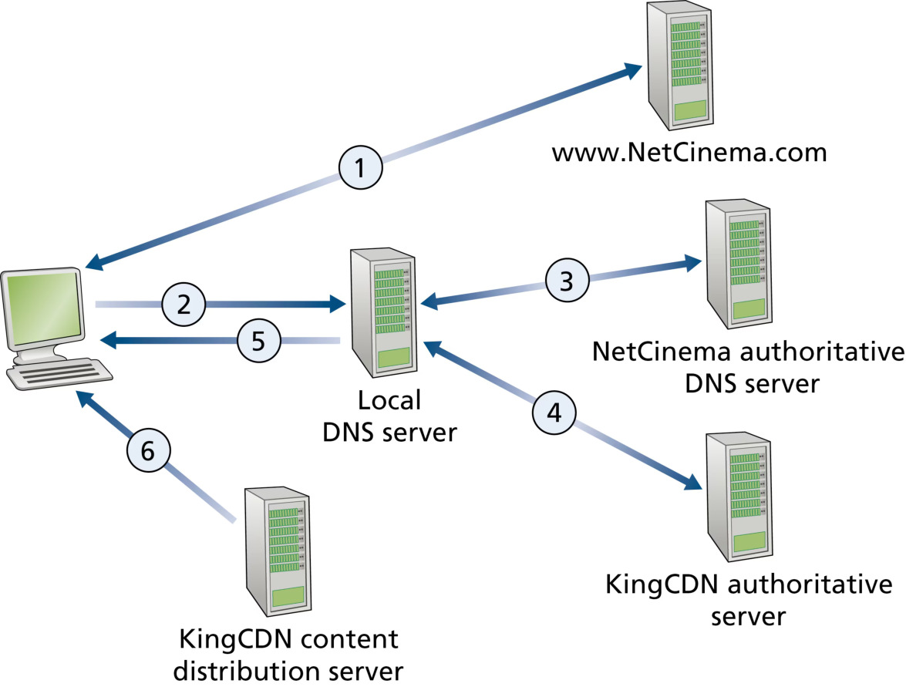

**CDN 的操作：DNS 重定向。** 大多数 CDN 借助 DNS 拦截并重定向请求。以内容提供商 NetCinema 采用第三方 CDN KingCDN 为例，视频 URL 形如 `http://video.netcinema.com/6Y7B23V`，共六步（见图 2.20）：

1. 用户访问 NetCinema 的网页；
2. 用户点击视频链接，主机对 `video.netcinema.com` 发 DNS 查询；
3. 用户的 **本地 DNS 服务器（LDNS）** 把查询转发给 NetCinema 的 **权威 DNS 服务器**，它看到主机名中的字符串 "video"，**不返回 IP**，而是把查询「移交」给 KingCDN，返回 KingCDN 域内的主机名，如 `a1105.kingcdn.com`；
4. 查询进入 KingCDN 的私有 DNS 基础设施：LDNS 对 `a1105.kingcdn.com` 再发查询，KingCDN 的 DNS 系统最终返回 **一台 KingCDN 内容服务器的 IP 地址**——**CDN 服务器正是在 KingCDN 的 DNS 系统内部被指定的**；
5. LDNS 把内容服务器的 IP 转发给用户主机；
6. 客户端与该 IP 建立 TCP 连接、发 HTTP GET 请求视频；若用 DASH，服务器先发 **清单文件**（各版本 URL 列表），客户端动态选择分块。

**集群选择策略（cluster selection strategy）：** 通过客户端 DNS 查询，CDN 得知客户端 LDNS 的 IP 地址，据此选择集群。两种思路：

- **地理最近（geographically closest）**：用商业地理位置数据库（Quova、MaxMind）把每个 LDNS IP 映射到地理位置，选离它最近（直线距离）的集群。对大多数客户端效果不错，但局限明显：地理最近 ≠ 网络路径最近（跳数、长度不同）；有些用户配置了远程 LDNS，其位置可能与客户端相距甚远；且该策略无视路径时延与带宽的时变，总是给同一客户端分配同一集群。
- **实时测量（real-time measurements）**：CDN 让各集群周期性向全球 LDNS 发送探测（ping 或 DNS 查询），实测时延与丢失性能，据此为当前流量状况选最优集群。缺点：许多 LDNS 配置为不响应探测。

**CDN 缓存：** 一个 CDN 可能有成百上千个地点的服务器，把所有内容放进所有地点既费带宽又费存储。CDN 通常在不同地点放 **不同的内容子集**，各地点定期淘汰冷门内容为热门内容腾空间——某一地点的服务器集合整体称为 **缓存（cache）**。内容入缓存的两种策略：**推送**（预测需求、高峰前主动分发，Netflix 采用）与 **拉取**（缓存未命中时从中心服务器取，边传边存，YouTube 采用）；Akamai 混合使用两种。

### 案例研究：Netflix 与 YouTube

**Netflix（2025 年北美领先的在线电影/剧集服务商）：** 其视频分发由 **亚马逊云** 与 **自家私有 CDN** 两大块组成。注册登录、计费、影片目录浏览搜索、推荐系统等 Web 功能及其后端数据库 **全部跑在亚马逊云的服务器上**；亚马逊云还负责：**内容接入**（接收工作室母版并上传到云主机）、**内容处理**（为桌面、手机、游戏机等不同播放器生成多种格式、多档码率的版本，支持 DASH 自适应流）、**把各版本上传到自家 CDN**。Netflix 2007 年刚推出流媒体时用过三家第三方 CDN，之后自建私有 CDN **Open Connect**，在 IXP 与住宅 ISP 内部都安装了服务器机架（IXP 安装点常有数十台服务器、含完整影片库与支持 DASH 的多版本；还有数百个 ISP 内部安装点）。Netflix **用推送方式** 在非高峰时段把视频推进 CDN 服务器（无法容纳全库的地点只推每天统计的热门视频）。

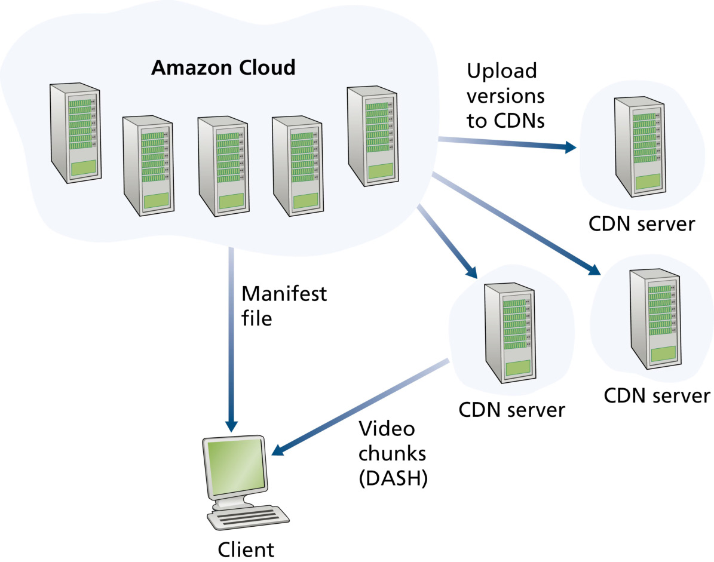


用户点播时：亚马逊云中的软件先确定哪些 CDN 服务器有该影片副本，再从中选出「最优」服务器——若用户所在的住宅 ISP 装了 Netflix 机架且有副本，通常选它；否则选附近 IXP 的服务器。随后 Netflix 把该服务器 IP 与 **清单文件**（各版本 URL）发给客户端，客户端与 CDN 服务器用 **专有版 DASH** 直接交互（HTTP GET 请求的字节范围首部请求约 4 秒长的分块，测吞吐量、按算法选下一块）。**注意：Netflix 不需要 DNS 重定向**——它由亚马逊云中的软件直接把客户端导向特定 CDN 服务器；且 **用推送缓存而非拉取缓存**。

**YouTube（全球最大视频分享站，2006 年被谷歌收购）：** 每分钟上传数百小时视频、每日数十亿次观看。与 Netflix 类似，YouTube 也用谷歌 **私有 CDN** 分发视频，在数百个 IXP 与 ISP 地点以及自有巨型数据中心安装服务器集群。**与 Netflix 不同**：谷歌用 **拉取缓存** 与 **DNS 重定向**。大多数时候，谷歌的集群选择策略把客户端导向 **客户端-集群 RTT 最低** 的集群；为平衡负载，有时会（经 DNS）把客户端导向更远的集群。视频上传同样走 HTTP（客户→服务器），在谷歌数据中心内转码成多码率版本。

---

## 2.6 Socket 编程：创建网络应用

**Socket 编程总览（408 一般只考概念）：** 网络应用由一对程序（客户端程序 + 服务器端程序）组成，运行在两台端系统上，产生客户进程与服务器进程，二者 **通过读写套接字通信**。开发者主要任务就是编写客户与服务器两端代码。开发前先决策：**跑在 TCP 还是 UDP 上？** TCP 面向连接、提供可靠字节流信道；UDP 无连接、发送独立数据报、无交付保证。实现 RFC 定义协议时应用 **熟知端口号**；开发专有应用时避免使用这些端口。本书用 **Python** 演示（Python 的 socket 概念暴露最清晰）。

### UDP 套接字编程

UDP 下发送进程必须先给数据报 **附加目的地址**——**目的主机 IP 地址 + 目的套接字端口号**（源地址由操作系统自动附加）。我们用「客户端从键盘读一行、发给服务器、服务器转成大写、送回客户端」的简单应用演示。

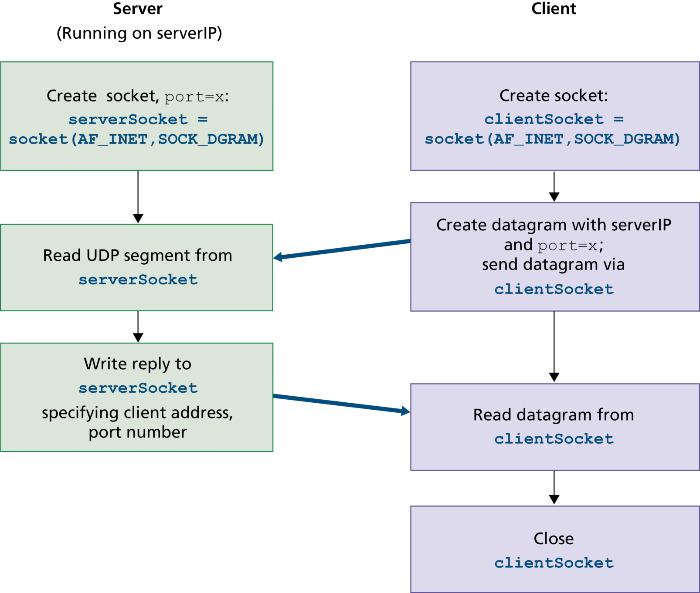


```python
### UDPClient.py —— UDP 客户端：发送一行小写句子，接收大写结果
from socket import *                     # socket 模块是一切网络通信的基础

serverName = '127.0.0.1'                 # 服务器 IP 或主机名（用主机名会自动 DNS 解析）
serverPort = 12000                       # 服务器端口（任意选取，避开熟知端口）
clientSocket = socket(AF_INET, SOCK_DGRAM)  # AF_INET=IPv4；SOCK_DGRAM=UDP 套接字
                                          # 客户端端口由操作系统自动分配
message = input('Input lowercase sentence:')   # 从键盘读入一行
clientSocket.sendto(message.encode(), (serverName, serverPort))  # 编码为字节并附加目的地址发送
modifiedMessage, serverAddress = clientSocket.recvfrom(2048)     # 接收数据与源地址，缓冲区 2048 B
print(modifiedMessage.decode())          # 字节解码为字符串并打印（应为大写结果）
clientSocket.close()                     # 关闭套接字
```

```python
### UDPServer.py —— UDP 服务器：接收消息转成大写并回送（无限循环，可服务多个客户端）
from socket import *                     # 导入 socket 模块

serverPort = 12000                       # 服务器端口（与客户端一致）
serverSocket = socket(AF_INET, SOCK_DGRAM)   # 创建 UDP 套接字
serverSocket.bind(('', serverPort))      # 把端口绑定到套接字：发往该端口的分组都被导向此套接字
print("The server is ready to receive")
while True:                              # 服务器无限循环
    message, clientAddress = serverSocket.recvfrom(2048)   # 接收数据与客户端地址（返回地址）
    modifiedMessage = message.decode().upper()             # 解码并转大写
    serverSocket.sendto(modifiedMessage.encode(), clientAddress)  # 附加客户端地址回送
```

**UDP 要点：** 服务器必须 **先运行**（客户端发消息前）；`bind` 显式把端口赋给服务器套接字；`recvfrom` 返回的 `clientAddress` 兼作回信地址；UDP 的 `sendto` 需要 **每次** 显式附加目的地址。

### TCP 套接字编程

TCP 是 **面向连接** 的：客户与服务器先 **握手建立 TCP 连接**（连接一端接客户套接字、另一端接服务器套接字），之后任一方只要把数据 **丢进连接** 即可——**无需** 每次附加目的地址（区别于 UDP）。服务器必须 **先运行**，且要有一扇「**欢迎门**」：一个特殊套接字 **欢迎（welcoming）** 任意主机的初次联系。

**欢迎套接字 vs 连接套接字（408 常考辨析）：** 服务器进程有 **两个套接字**：`serverSocket`（欢迎套接字，所有客户最初的接触点，服务器全程保持打开）与每次 `accept()` 为 **特定客户** 新建的 `connectionSocket`（连接套接字，专用于与该客户通信）。初学 TCP 者常混淆二者——这是本章最经典的考点之一。从应用视角，客户套接字与服务器的连接套接字被一条「管道」直接连通：客户进程发入套接字的字节，TCP 保证服务器进程 **按发送顺序** 从连接套接字收到；且双方可 **同时** 收发（全双工）。

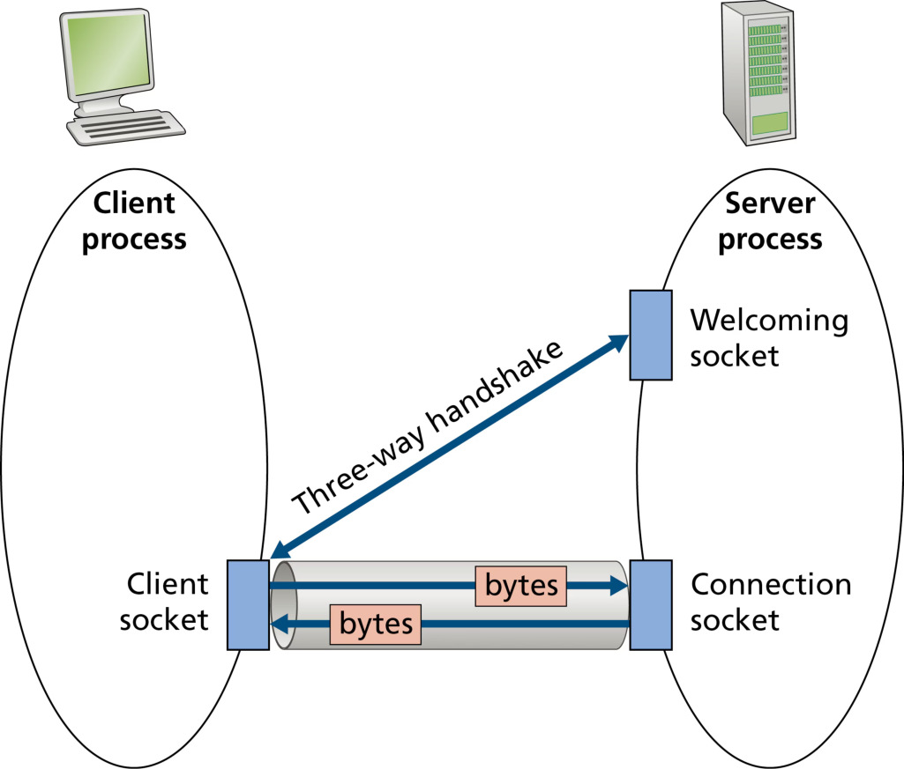


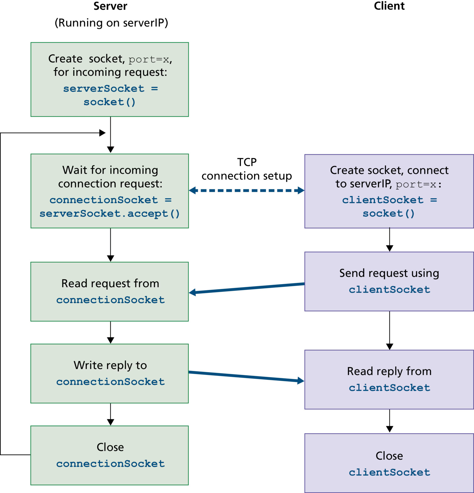

```python
### TCPClient.py —— TCP 客户端：建立连接，发送一行句子，接收大写结果
from socket import *                     # 导入 socket 模块

serverName = '127.0.0.1'                 # 服务器 IP 或主机名
serverPort = 12000                       # 服务器端口
clientSocket = socket(AF_INET, SOCK_STREAM)  # SOCK_STREAM=TCP 套接字
clientSocket.connect((serverName, serverPort))  # 发起 TCP 连接（内部完成三次握手），参数为服务器地址
sentence = input('Input lowercase sentence:')   # 从键盘读入一行
clientSocket.send(sentence.encode())     # 把字节丢进 TCP 连接（无需附加目的地址！）
modifiedSentence = clientSocket.recv(1024)      # 从连接接收字节
print('From Server: ', modifiedSentence.decode())
clientSocket.close()                     # 关闭套接字，同时关闭 TCP 连接
```

```python
### TCPServer.py —— TCP 服务器：欢迎套接字 + 每次 accept 生成连接套接字
from socket import *                     # 导入 socket 模块

serverPort = 12000                       # 服务器端口
serverSocket = socket(AF_INET, SOCK_STREAM)  # 创建 TCP 套接字
serverSocket.bind(('', serverPort))      # 绑定端口
serverSocket.listen(1)                   # 监听连接请求；参数为排队连接数的上限（至少 1）
print('The server is ready to receive')
while True:
    connectionSocket, addr = serverSocket.accept()  # 客户「敲门」时创建连接套接字并完成握手
    sentence = connectionSocket.recv(1024).decode() # 从连接套接字接收并解码
    capitalizedSentence = sentence.upper()          # 转大写
    connectionSocket.send(capitalizedSentence.encode())  # 经连接套接字回送
    connectionSocket.close()             # 关闭连接套接字；欢迎套接字仍开，可服务下一客户
```

**TCP 要点：**`connect()` 发起三次握手（对应用透明）；服务器 `accept()` 为每个客户新建专用连接套接字；`listen(1)` 参数是排队连接数上限；关闭连接套接字后欢迎套接字继续监听。


### QUIC 套接字简述

应用开发者用 QUIC API 发送消息时（如浏览器用 HTTP/3 请求页面）：客户发起的是 **UDP 之上的 QUIC 握手**——QUIC 把连接建立与加密建立 **合并在一次握手** 中并行完成（而非 TCP+TLS 的串行两次握手）。连接建立后，服务器要为每条 HTTP 消息 **创建独立的流（stream）** 并分配流 ID：例如为 HTML 基础页建 Stream 1、为 CSS 建 Stream 2、为图像建 Stream 3，把三条消息背靠背送入同一条 QUIC 连接。应用通过 QUIC API 指定 **连接 ID 与流 ID**；加密、拆帧、流多路复用全部由 QUIC 子层内部处理；应用还可指示 QUIC **按资源重要性给流排优先级**（如先发 HTML 骨架，再发图像与 JS）。**关键：应用代码只与 QUIC API 交互，不碰底层 UDP 套接字 API**——因此对应用开发者而言，HTTP/3 就跑在 QUIC 这个「传输协议」之上。Python 生态中可用 aioquic 库体验 QUIC 编程。

---

## 2.7 小结

本章研究了网络应用的 **概念** 与 **实现** 两个方面。我们认识了绝大多数因特网应用采用的 **客户-服务器架构**，并在 HTTP、SMTP、DNS 中看到了它的身影；详细学习了这些重要应用层协议及其应用（Web、电子邮件、DNS）；学习了 **流式视频** 以及现代视频分发系统如何利用 **CDN**；还考察了如何用 **socket API** 构建网络应用，并走查了面向连接（TCP）与无连接（UDP）两种端到端传输服务的套接字用法。至此，自顶向下旅程的第一步完成！第 1 章给出的协议定义（格式、次序、动作）在 HTTP、SMTP、DNS 的细节中获得了血肉；下一章将下探到传输层，回答「TCP 与 UDP 到底如何提供这些服务模型」。

---

## 🧪 本章习题

> 每道题均可回溯至本章正文（考点映射见章首导览）。A 组为基础题，B 组为提高题，C 组为拓展综合题，最后为原书习题讲解。

### A 基础题（单选/填空/判断，每题 1-2 分）

**A1.**（单选）HTTP 响应状态码 404 表示（ ）。

- A. 服务器内部错误
- B. 请求成功
- C. 服务器上不存在所请求的文档
- D. 服务器不支持请求的 HTTP 版本

??? answer "查看答案"
    **答案：C**

    **404 Not Found** 表示所请求的文档在服务器上不存在（URL 拼错或资源已删除），属客户端错误。A 对应 500 Internal Server Error；B 对应 200 OK；D 对应 505 HTTP Version Not Supported。

**A2.**（单选）DNS 资源记录 `(foo.com, mail.bar.foo.com, MX)` 的含义是（ ）。

- A. 主机 foo.com 的 IP 地址是 mail.bar.foo.com
- B. 别名为 foo.com 的邮件服务器的规范主机名是 mail.bar.foo.com
- C. foo.com 的权威 DNS 服务器是 mail.bar.foo.com
- D. foo.com 的规范主机名是 mail.bar.foo.com

??? answer "查看答案"
    **答案：B**

    **MX 记录** 的 Value 是别名为 Name 的 **邮件服务器** 的规范主机名，用于让邮件服务器主机名可有简单别名。A 是 A 记录；C 是 NS 记录；D 是 CNAME 记录（但 CNAME 的 Name 是别名主机名）。

**A3.**（填空）因特网常用应用的熟知端口号：HTTP 为 **____**，SMTP 为 **____**，DNS 为 **____**（运行于 **____** 协议之上）。

??? answer "查看答案"
    **80、25、53；UDP。**

    HTTP 用 TCP 80；SMTP 用 TCP 25；DNS 用 UDP 53（DNS 查询/应答都是短小报文，用 UDP 效率高、开销小；2018 统考曾考查 DNS 使用传输层无连接服务）。

**A4.**（单选）下列应用中最适合运行在 UDP 之上的（ ）。

- A. 文件传输（FTP）
- B. 电子邮件（SMTP）
- C. 因特网视频会议（如 Zoom）
- D. Web 浏览（HTTP）

??? answer "查看答案"
    **答案：C**

    视频会议 **容忍少量丢失**（丢失只造成轻微卡顿）但 **要求最低速率与低时延**，UDP 无握手、无拥塞控制、开销小，正合适。FTP、SMTP、HTTP 都需要可靠交付，用 TCP。

**A5.**（判断）HTTP/1.1 默认使用持久连接，并支持流水线方式发送请求。（ ）

??? answer "查看答案"
    **正确（√）**

    HTTP/1.1 默认 **持久连接**：服务器发送响应后保持 TCP 连接打开，后续请求/响应走同一条连接；且支持 **流水线（pipelining）**——客户背靠背连续发送请求、不等前一个请求的应答。

### B 提高题（简答/计算，每题 5-10 分）

**B1.**（计算，8 分，真题风格）浏览器请求一个由 1 个基础 HTML 文件和 8 张 JPEG 图像组成的 Web 页，所有对象在同一服务器。客户-服务器 RTT = 120 ms，对象传输时间忽略，无任何缓存。求：

（1）HTTP/1.0 非持久连接、浏览器串行请求各对象的总时间；

（2）HTTP/1.0 非持久连接、浏览器可同时打开 8 条并行 TCP 连接的总时间；

（3）HTTP/1.1 持久连接、流水线方式的总时间。

??? answer "查看答案"
    （1）非持久串行：9 个对象，每个 2 RTT：

    $$ T_1 = 9 \times 2 \times 120 = 2160 \text{ ms} $$

    （2）非持久并行：基础 HTML 2 RTT（240 ms）；8 张图并行建立 8 条连接（1 RTT）并并行请求/接收（1 RTT）：

    $$ T_2 = 2 \times 120 + 2 \times 120 = 480 \text{ ms} $$

    （3）持久流水线：建立连接并取回 HTML 2 RTT；8 个图像请求背靠背发出、服务器背靠背响应，共 1 RTT：

    $$ T_3 = 2 \times 120 + 1 \times 120 = 360 \text{ ms} $$

??? success "评分标准"

    - 非持久每对象 2 RTT（3 分）
    - 三个结果 2160 / 480 / 360 ms 各约 2 分
    - 流水线「全部对象共享 1 RTT」的说明（1 分）

**B2.**（简答，8 分）请描述主机解析域名 `www.abc.com` 的完整过程：说明递归查询与迭代查询的区别、主机与本地 DNS 服务器之间以及本地 DNS 服务器与其他 DNS 服务器之间通常各采用哪种查询方式，并说明 DNS 缓存的作用。

??? answer "查看答案"
    **过程：** ① 主机的 DNS 客户把 `www.abc.com` 放入查询报文，发往 **本地 DNS 服务器**（该查询是 **递归查询**——主机请本地服务器代查到底）；② 本地 DNS 服务器先查本地缓存，未命中则向 **根域名服务器** 发查询（**迭代查询**）；③ 根服务器返回负责 `com` 顶级域的 TLD 服务器 IP；④ 本地服务器向 `com` TLD 服务器查询，TLD 返回负责 `abc.com` 的 **权威 DNS 服务器** IP；⑤ 本地服务器向权威服务器查询，权威服务器返回 `www.abc.com` 的 IP；⑥ 本地服务器把结果缓存并返回给主机。典型情形共 **8 条 DNS 报文（4 查询 + 4 应答）**。

    **递归 vs 迭代：** 递归查询是「服务器代查到底、把最终结果返回」；迭代查询是「服务器只告诉你下一步该问谁，由你自己继续问」。实践中的典型模式：**主机 → 本地 DNS 服务器用递归，本地 → 根/TLD/权威用迭代**（全部递归会把负载压给根服务器，实际几乎不用）。

    **缓存作用：** DNS 服务器把应答中的映射缓存在本地，后续同主机名的查询可 **直接应答**，减少跨网 DNS 报文、降低解析时延；缓存 TLD 服务器地址还可 **绕过根服务器**；缓存有 TTL，过期即失效。

??? success "评分标准"

    - 递归/迭代概念区分（3 分）
    - 查询链完整（主机→本地→根→TLD→权威，各 1 分，共 4 分）
    - 缓存作用（1 分）

**B3.**（简答，6 分）HTTP 服务器是无状态的，Web 站点如何用 Cookie 识别并跟踪用户？请说明 Cookie 技术的四个组件及其工作流程，并指出其隐私争议所在。

??? answer "查看答案"
    **四个组件：** ① HTTP 响应报文中的 Cookie 首部行（Set-cookie）；② HTTP 请求报文中的 Cookie 首部行；③ 用户端系统上由浏览器管理的 Cookie 文件；④ Web 站点后端数据库。

    **工作流程：** 用户首次访问某站点时，服务器创建 **唯一识别号**、在后端数据库建条目，并在响应中附 `Set-cookie: 1678`；浏览器把（服务器主机名 + 识别号）写入 Cookie 文件。此后用户每次向该站点发请求，浏览器都自动在请求中附上 `Cookie: 1678`；服务器凭识别号查数据库，就知道用户 1678 访问了哪些页面、什么顺序、什么时间——从而实现购物车、个性化推荐、会话保持等。Cookie 在无状态的 HTTP 之上 **创建了用户会话层**。

    **隐私争议：** 服务器结合 Cookie 与用户注册信息（姓名、邮箱、地址、信用卡）可掌握用户大量行为数据，甚至可能 **出售给第三方**，构成对用户隐私的侵犯。

??? success "评分标准"

    - 四组件齐全（2 分）
    - 流程（Set-cookie / Cookie 文件 / Cookie 首部 / 数据库查询）完整（3 分）
    - 隐私争议表述（1 分）

### C 拓展题（计算/综合，每题 10-15 分）

**C1.**（计算，15 分，真题 2017#47 改编）主机 H 通过 HTTP 访问 Web 服务器 S，页面由 1 个基础 HTML 文件、5 个 JPEG 小对象和 1 个大视频文件组成（共 7 个对象）。已知 H 与 S 之间的 RTT = 100 ms；HTML 与 JPEG 的传输时间可忽略；视频的传输时间为 2 s。忽略 DNS 解析时延（IP 地址已知）与其他时延。分别计算下列四种方式下，H 从发出 HTTP 请求到接收完所有对象所需的总时间：

（1）HTTP/1.0 非持久连接，浏览器 **串行** 请求各对象；

（2）HTTP/1.0 非持久连接，浏览器可同时打开 **6 条并行 TCP 连接**（HTML 先取回，其余 6 个对象并行传输）；

（3）HTTP/1.1 持久连接，**非流水线** 方式；

（4）HTTP/1.1 持久连接，**流水线** 方式。

并比较四种方式的效率，说明差异来自何处。

??? answer "查看答案"
    **（1）非持久串行：** 7 个对象各需 2 RTT + 传输时间：

    $$ T_1 = 7 \times 2 \times 100 + (0 + 0 + 2000) = 1400 + 2000 = 3400 \text{ ms} $$

    **（2）非持久并行（6 条连接）：** 先取 HTML 花 2 RTT；其余 6 个对象（5 JPEG + 视频）经 6 条并行连接同时传输：建连 1 RTT + 请求/响应 1 RTT = 2 RTT，传输时间取最长者（视频 2 s）：

    $$ T_2 = 200 + (2 \times 100 + 2000) = 200 + 2200 = 2400 \text{ ms} $$

    **（3）持久非流水线：** 建连并取回 HTML 2 RTT；之后每个对象需 1 RTT + 传输时间，逐对象串行：

    $$ T_3 = 200 + 5 \times (100 + 0) + (100 + 2000) = 200 + 500 + 2100 = 2800 \text{ ms} $$

    **（4）持久流水线：** 建连并取回 HTML 2 RTT；随后 6 个对象的所有请求背靠背发出（1 RTT），服务器背靠背响应，响应传输时间累加（5 个小对象可忽略 + 视频 2000 ms）：

    $$ T_4 = 200 + 100 + 2000 = 2300 \text{ ms} $$

    **比较：** 流水线持久连接（2300 ms）最快，非持久串行（3400 ms）最慢。差异来自 **RTT 开销** 的压缩程度：串行每个对象付 2 RTT；并行/持久/流水线把多个对象的 RTT 开销合并为 1-2 个。**注意视频的 2000 ms 传输时间在四种方式中都无法消除**——流水线/并行省的是 RTT，不是带宽与传输时间。

??? success "评分标准"

    - 非持久串行 3400 ms（4 分，含 7×2 RTT + 传输时间）
    - 并行 2400 ms（4 分，含「并行组取最长传输时间」的要点）
    - 持久非流水线 2800 ms（3 分）
    - 持久流水线 2300 ms（3 分）
    - 结论：差异源于 RTT 压缩、视频传输时间不可省（1 分）

**C2.**（综合，15 分，真题风格）某内容提供商采用第三方 CDN 分发视频。用户点击视频链接 `http://video.cdnexample.com/8A2B9C` 后，系统借助 DNS 完成重定向。请回答：

（1）完整描述 CDN 借助 DNS 拦截并重定向用户请求的六步过程；

（2）CDN 有「进入深层」与「带回家」两种部署哲学，分别说明其特点与代表公司；

（3）CDN 的集群选择策略有哪两种思路？各有什么优缺点？若某客户端的地理最近集群 A 与另一集群 B 相比，A 直线距离近但当前网络路径拥塞、时延高，B 直线距离远但路径通畅，你会建议选哪个集群？为什么？

（4）对比 Netflix 与 YouTube 在 CDN 使用上的主要差异（私有/第三方、推送/拉取、是否用 DNS 重定向）。

??? answer "查看答案"
    **（1）DNS 重定向六步（NetCinema/KingCDN 例）：** ① 用户访问内容提供商的网页；② 用户点击视频链接，主机对 `video.cdnexample.com` 发 DNS 查询；③ 用户的本地 DNS 服务器（LDNS）把查询转发给内容提供商的权威 DNS 服务器，它看到主机名含 "video"，**不返回 IP**，而是把查询「移交」给 CDN，返回 CDN 域内的主机名（如 `a1105.cdn.com`）；④ 查询进入 CDN 的私有 DNS 基础设施，LDNS 对 `a1105.cdn.com` 再发查询，CDN 的 DNS 系统返回 **一台 CDN 内容服务器的 IP**（CDN 服务器在此被指定）；⑤ LDNS 把该 IP 转发给用户主机；⑥ 客户端与该 IP 建立 TCP 连接并发 HTTP GET 请求视频（若用 DASH，服务器先发清单文件）。

    **（2）部署哲学：****进入深层（Enter Deep）**——Akamai 首创，把服务器集群部署进全球各接入 ISP 内部（数千地点），最接近用户、改善时延与吞吐量，但集群维护管理成本高；**带回家（Bring Home）**——Limelight 等采用，在较少的数十个站点（常设在 IXP）建大集群，维护开销低，但可能牺牲时延与吞吐量。

    **（3）集群选择：****地理最近**——用商业地理数据库把 LDNS IP 映射到地理位置、选直线距离最近的集群。优点：简单、对多数客户端效果好；缺点：地理最近 ≠ 网络路径最近，远程 LDNS 场景会选错，且无视路径时延/带宽的时变。**实时测量**——各集群周期向全球 LDNS 发探测（ping/DNS 查询），实测时延与丢失，按当前流量状况选择。优点：反映真实路径状况；缺点：许多 LDNS 不响应探测。**本题建议选集群 B**：CDN 的目标是「最佳用户体验」，应以 **实际网络路径的时延与吞吐量** 为准，而非直线距离；A 虽近但拥塞、时延高，选 B 用户体验更好（这正是实时测量策略优于单纯地理最近的原因）。

    **（4）Netflix vs YouTube：** Netflix 用 **自建私有 CDN（Open Connect）**，机架部署在 IXP 与住宅 ISP 内部，**推送** 方式在非高峰时段把视频推入 CDN，**不用 DNS 重定向**（由亚马逊云软件直接把客户端导向选定 CDN 服务器），用约 4 秒分块的专有版 DASH；YouTube 用谷歌 **私有 CDN**，**拉取** 方式（缓存未命中时才取）、**用 DNS 重定向**，集群选择以客户端-集群 RTT 最低为默认、兼顾负载均衡。

??? success "评分标准"

    - 六步过程完整（6 分，每步 1 分）
    - 两种部署哲学及代表公司（2 分）
    - 两种集群选择策略优缺点（3 分）
    - 选 B 并给出「以路径时延为准」的理由（2 分）
    - Netflix/YouTube 差异对比（2 分）

### 原书习题讲解

**原书 R6.**（概念）在客户-服务器架构中，服务器与客户端各有什么特点？为什么说 P2P 架构具有「自扩展性」？

??? answer "查看答案"
    **服务器特点：** 始终在线、有固定且众所周知的 IP 地址，服务来自众多客户主机的请求；客户之间不直接通信。**客户端特点：** 间歇性接入因特网、可能动态获得 IP 地址、彼此不直接通信，通过向服务器发请求获取服务。

    **P2P 自扩展性：** 每个对等方在请求文件（向系统产生负载）的同时，也向系统贡献服务能力（向其他对等方分发文件）。因此 P2P 系统的 **服务容量随用户（对等方）数量增长而增长**，无需像 C/S 那样为应对负载而扩展服务器集群——这是 P2P 最迷人的特性。

??? success "评分标准"

    - 服务器/客户端特点各 2 分
    - 自扩展性：负载 + 服务能力同源（2 分）
    - 表述清晰（2 分）

**原书 R11.**（概念）HTTP 服务器是无状态的。在引入 Cookie 后，服务器如何识别后续请求来自同一用户？

??? answer "查看答案"
    首次访问时，服务器创建 **唯一识别号**、在后端数据库建立以该号为索引的条目，并在响应中附 `Set-cookie: 识别号` 首部；浏览器把（主机名 + 识别号）存入其管理的 Cookie 文件。此后浏览器每次向该服务器发请求，都自动从 Cookie 文件取出识别号、附上 `Cookie: 识别号` 首部；服务器据识别号查数据库，即可把该请求关联到此前记录的同一用户及其历史行为——**Cookie 在无状态的 HTTP 之上建立了一层用户会话**。

??? success "评分标准"

    - Set-cookie 与数据库条目（2 分）
    - Cookie 文件存储与自动回送（3 分）
    - 服务器凭识别号关联用户（2 分）

**原书 P8.**（计算）考虑 HTTP 的非持久连接。平均 RTT 为 150 ms，每个对象的平均传输时间为 33 ms。求浏览器请求一个含 1 个基础 HTML 文件和 10 个 JPEG 对象的页面所需的总时间（忽略 DNS 时延）：

（1）非持久连接（串行，每次一条 TCP 连接）；

（2）持久连接（非流水线）。

??? answer "查看答案"
    （1）非持久连接：HTML 文件花 2 RTT + 33 ms = 333 ms；每个 JPEG 同样花 2 RTT + 33 ms = 333 ms，共 10 个：

    $$ T_1 = 333 + 10 \times 333 = 3663 \text{ ms} $$

    （2）持久连接（非流水线）：建立 TCP 连接并取回 HTML 花 2 RTT + 33 ms = 333 ms；此后每个 JPEG 只需 1 RTT + 33 ms = 183 ms，共 10 个：

    $$ T_2 = 333 + 10 \times 183 = 2163 \text{ ms} $$

    持久连接省下了每个对象「建立新 TCP 连接」的 1 RTT，共节省 10 × 150 = 1500 ms，与 3663 - 2163 = 1500 ms 一致。

??? success "评分标准"

    - 非持久每对象 2 RTT + 传输（3 分）
    - 持久每对象 1 RTT + 传输（3 分）
    - 两个结果正确（各 2 分）

**原书 P11.**（综合）某主机解析域名 www.cs.umass.edu 的 IP 地址。主机与本地 DNS 服务器之间、本地 DNS 服务器与各 DNS 服务器之间通信的 RTT 均为 10 ms，忽略主机与本地 DNS 服务器之间的时延。假设本地 DNS 服务器缓存为空：

（1）采用「主机→本地递归、本地→其他迭代」方式，求本地 DNS 服务器从开始查询到获得答案所需的最长时间；

（2）若本地 DNS 服务器已缓存了该映射，再求所需时间；

（3）说明 DNS 为什么能承受如此巨大的查询流量而不崩溃。

??? answer "查看答案"
    （1）迭代查询链：本地 DNS 服务器依次查询 **根服务器 → `edu` TLD 服务器 → `umass.edu` 权威服务器**，每次查询/应答各 1 RTT，共 3 次查询：

    $$ T_1 = 3 \times 10 = 30 \text{ ms} $$

    （2）缓存命中时本地 DNS 服务器直接应答，不再发起任何跨网查询：

    $$ T_2 = 0 \text{ ms} $$

    （3）DNS 能承受巨大流量的原因：① **分布式设计**——映射分散在全世界海量服务器上，没有任何单一服务器成为瓶颈；② **层次化缓存**——本地 DNS 服务器缓存主机名-IP 映射与 TLD 服务器地址，绝大多数查询在本地即可应答，**根服务器只被极小比例的查询真正访问**；③ **多级冗余**——每级（尤其根）都有大量冗余实例，单点故障不致瘫痪。

??? success "评分标准"

    - 迭代链 3 次查询、30 ms（4 分）
    - 缓存命中 0 ms（2 分）
    - 分布式 + 缓存 + 冗余三点（各 2 分，共 6 分）

---

## ✅ 本章小结

1. **网络应用原理**：应用架构只有两大主流——**客户-服务器（C/S）** 与 **P2P**；进程间靠 **socket 接口** 通信，进程寻址 = **IP 地址 + 端口号**；传输服务四维度（可靠交付、吞吐量、时延、安全）与因特网两个传输协议（**TCP** 面向连接+可靠+拥塞控制；**UDP** 无连接+不可靠+无拥塞控制）的对应关系；应用层协议定义消息的类型、语法、语义与发送规则。
2. **HTTP**：无状态、基于 TCP（HTTP/3 例外）；**非持久**（每对象 2 RTT）vs **持久**（默认，可 **流水线**）连接的 RTT 计算是计算题核心；报文格式（请求行/状态行 + 首部行 + 实体主体）、方法（GET/POST/HEAD/PUT/DELETE）、状态码（200/301/400/404/505）；**Cookie** 四组件；**Web 缓存**（Cache-Control、条件 GET、304）；**HTTP/2**（分帧、多路复用、服务器推送）；**HTTP/3 + QUIC**（跑在 UDP 上、0-RTT、独立流消除队头阻塞）。
3. **电子邮件**：用户代理 + 邮件服务器 + **SMTP**（推协议、7 位 ASCII、25 端口、持久连接、不用中间服务器）；邮件报文格式（RFC 5322 首部 + **MIME** 编码）；取邮件用 **拉** 协议——**POP3（110）/ IMAP（143）/ HTTP（Web 邮件）**。
4. **DNS**：分布式层次数据库（根 / TLD / 权威 / 本地四类服务器）+ 应用层协议（UDP 53）；**递归 vs 迭代查询**（典型：主机→本地递归、本地→其他迭代，解析一个名字 8 条报文）；**缓存**；资源记录 **（Name, Value, Type, TTL）**——A/NS/CNAME/MX；DNS 报文五段（首部/问题/回答/权威/附加）；注册机构写入 NS+A 记录。
5. **视频流与 CDN**：视频压缩与比特率、**DASH**（多版本 + 清单文件 + 分块自适应）；**CDN**（专用 vs 第三方、进入深层 vs 带回家、DNS 重定向六步、集群选择、推/拉缓存）；Netflix（私有 CDN、推送、无 DNS 重定向）vs YouTube（私有 CDN、拉取、DNS 重定向）。
6. **Socket 编程**：UDP 用 `socket(AF_INET, SOCK_DGRAM)` + `sendto/recvfrom`；TCP 用 `SOCK_STREAM` + `connect/accept`，服务器有 **欢迎套接字** 与 **连接套接字** 两个套接字；QUIC 套接字建立在 UDP 之上、以独立流多路复用。

### 术语对照表

| 英文术语 | 中文 | 说明 |
|:---|:---|:---|
| client-server architecture | 客户-服务器架构 | 始终在线的服务器服务众多客户，客户间不直接通信 |
| peer-to-peer (P2P) | 对等架构 | 对等方直接通信，自扩展、低成本 |
| process | 进程 | 运行在端系统内的程序，网络通信的基本实体 |
| socket | 套接字 | 应用层与传输层之间的软件接口（API） |
| port number | 端口号 | 标识主机内接收套接字的编号（HTTP 80 / SMTP 25 / DNS 53） |
| reliable data transfer | 可靠数据传输 | 无差错、无丢失、按序交付数据 |
| connection-oriented | 面向连接 | TCP 在数据传输前握手建立连接 |
| congestion control | 拥塞控制 | TCP 在网络拥塞时节流发送速率 |
| stateless protocol | 无状态协议 | 服务器不保存客户状态信息（HTTP） |
| round-trip time (RTT) | 往返时间 | 小分组客户→服务器→客户一个来回的时间 |
| non-persistent connection | 非持久连接 | 每个请求/响应对用一条 TCP 连接（每对象 2 RTT） |
| persistent connection | 持久连接 | 同一客户-服务器共用一条 TCP 连接（HTTP/1.1 默认） |
| pipelining | 流水线 | 背靠背连续发送请求、不等前一个请求的应答 |
| cookie | Cookie | 在无状态 HTTP 之上识别用户的四组件机制 |
| conditional GET | 条件 GET | 带 If-Modified-Since 首部的 GET，配合 304 使用 |
| HTTP/2 | 超文本传输协议第 2 版 | 单 TCP 连接上的分帧、多路复用、服务器推送 |
| QUIC | 快速 UDP 因特网连接 | 应用层子层，用 UDP 提供类似 TCP 的服务（0-RTT、独立流） |
| HTTP/3 | 超文本传输协议第 3 版 | 跑在 QUIC 之上的 HTTP（RFC 9114） |
| SMTP | 简单邮件传输协议 | 推协议，7 位 ASCII，TCP 25 端口，邮件服务器间传输 |
| MIME | 多用途因特网邮件扩展 | 把非 ASCII 数据编码为 ASCII 供 SMTP 传输 |
| POP3 / IMAP | 邮局协议 3 / 因特网邮件访问协议 | 拉取邮件协议（端口 110 / 143） |
| DNS | 域名系统 | 主机名→IP 的分布式目录服务，UDP 53 |
| recursive query | 递归查询 | 服务器代查询方取回最终映射 |
| iterative query | 迭代查询 | 服务器只告知下一步该问谁，查询方自己继续 |
| resource record (RR) | 资源记录 | （Name, Value, Type, TTL）四元组；A/NS/CNAME/MX |
| TTL | 生存时间 | 资源记录在缓存中的保留时长 |
| DASH | 基于 HTTP 的动态自适应流 | 多码率分块、客户端按带宽自适应选择 |
| CDN | 内容分发网络 | 地理分布式服务器，就近服务用户内容请求 |
| cluster selection strategy | 集群选择策略 | CDN 决定把客户端导向哪个集群的机制 |
| socket programming | 套接字编程 | 用 socket API 编写网络应用（UDP/TCP/QUIC） |

---

## 🚪 下一章预告

第 2 章完成了自顶向下旅程的第一步：我们掌握了应用架构、HTTP/DNS/SMTP 等应用层协议的细节，还亲手写出了 UDP 与 TCP 套接字程序。但有一个大问题悬而未决：**TCP 号称「可靠」，它到底是怎么做到的？** 丢包了怎么重传？乱序了怎么重组？拥塞了怎么降速？滑动窗口、序号与确认号、三次握手与四次挥手……这些都是传输层的看家本领——**第 3 章：传输层** 见。

👉 [进入第 3 章：传输层 →](03-transport-layer.md)
