# 第 3 章：传输层 —— 让每一字节都可靠地穿越不可靠的网络

> 应用层把数据交给传输层后，剩下的全归传输层：把数据送到 **对方主机上正确的那一个进程**，必要时 **保证不丢、不错、不重、不乱序**，还要 **在拥塞的网络里拿捏好发送速率**。本章是 408 计算大题的绝对重灾区——可靠传输（RDT/GBN/SR）与 TCP 拥塞控制轮流坐庄。**这一章，值得你把每个窗口公式、每张演变表都刻进脑海。**

---

## 📋 本章导览

| 项目 | 内容 |
|:---|:---|
| **课时建议** | 12-14 课时（408 一轮复习建议 4-5 天，大题高产区） |
| **教学目标** | ① 理解传输层与网络层的关系、多路复用与解复用；② 掌握 UDP 报文段结构与校验和计算；③ 掌握可靠数据传输原理（rdt1.0→3.0、流水线、GBN、SR）及窗口与序号关系；④ 掌握 TCP 报文段结构、序号/确认号、RTT 估计、可靠传输、流量控制与连接管理；⑤ 掌握拥塞控制原理与 TCP 拥塞控制（慢开始/拥塞避免/快重传/快恢复）全流程计算；⑥ 了解 QUIC |
| **教学重点** | 复用/解复用、UDP 校验和、GBN 与 SR（窗口/序号/信道利用率）、TCP 三次握手与四次挥手、拥塞窗口演变计算（AIMD 锯齿） |
| **教学难点** | 可靠传输协议时序分析、GBN/SR 窗口大小与序号比特数关系、拥塞控制各阶段转换与阈值更新、流量控制 vs 拥塞控制辨析 |
| **考点映射** | 408 考点：停等/GBN/SR 窗口大小与序号比特数关系、信道利用率（大题常考）；TCP 拥塞控制（拥塞窗口动态变化/快重传快恢复/平均发送速率，2023#47 等）；UDP 报文段与校验和；TCP 报文段结构与序号确认号；TCP 连接管理（三次握手/四次挥手）；TCP 可靠传输与流量控制 |
| **习题配置** | 例题 5 道 + A 基础 5 题 + B 提高 3 题 + C 拓展 2 题 + 原书习题讲解 4 道（含真题 2010#47 改编） |


```mermaid
graph TD
    A["第 3 章<br/>传输层"] --> B["3.1 传输层服务概述"]
    A --> C["3.2 多路复用与解复用"]
    A --> D["3.3 无连接传输：UDP"]
    A --> E["3.4 可靠数据传输原理 ★"]
    A --> F["3.5 面向连接传输：TCP"]
    A --> G["3.6 拥塞控制原理"]
    A --> H["3.7 TCP 拥塞控制 ★"]
    A --> I["3.8 传输层功能演化（QUIC）"]
    B --> B1["逻辑通信：传输层 vs 网络层"]
    B --> B2["在端系统实现，路由器不识别"]
    B --> B3["TCP 面向连接可靠 / UDP 无连接尽力而为"]
    C --> C1["端口号 + socket 标识"]
    C --> C2["UDP 二元组（目的 IP + 目的端口）"]
    C --> C3["TCP 四元组（源/目的 IP + 源/目的端口）"]
    D --> D1["UDP 为什么存在（4 个理由）"]
    D --> D2["8 字节首部：源/目的端口 + 长度 + 校验和"]
    D --> D3["校验和：二进制反码和（含回卷）"]
    E --> E1["rdt1.0 可靠信道 / rdt2.x 差错 / rdt3.0 丢包+定时器"]
    E --> E2["流水线 Pipelining 与利用率"]
    E --> E3["GBN：累积确认、单定时器、超时重传窗口内全部"]
    E --> E4["SR：逐分组确认、每分组定时器、重传单个"]
    F --> F1["TCP 连接与报文段结构（MSS）"]
    F --> F2["序号/确认号、RTT 估计（α=1/8 β=1/4）"]
    F --> F3["可靠传输：超时重传 + 快重传（3 冗余 ACK）"]
    F --> F4["流量控制 rwnd / 连接管理（三次握手四次挥手）"]
    G --> G1["拥塞成因与代价（丢包/吞吐量下降/时延增大）"]
    G --> G2["端到端 vs 网络辅助拥塞控制"]
    H --> H1["慢开始（指数）/ 拥塞避免（+1）"]
    H --> H2["快重传 / 快恢复（阈值=窗口/2）"]
    H --> H3["Tahoe vs Reno、AIMD 锯齿、CUBIC/BBR/ECN、公平性"]
    I --> I1["QUIC：基于 UDP、多路复用、0-RTT、连接迁移"]
```

---

## 3.1 传输层服务概述

传输层（transport layer）位于应用层与网络层之间，是分层体系结构的中枢。它的核心职责是：**为运行在不同主机上的应用进程提供逻辑通信（logical communication）** ——即从应用的角度看，仿佛通信双方的主机直接相连；而现实中，这两台主机可能隔着半个地球、经由无数路由器与各种链路相连。应用进程使用传输层提供的逻辑通信互相发送消息，完全不用操心底层物理基础设施的细节。


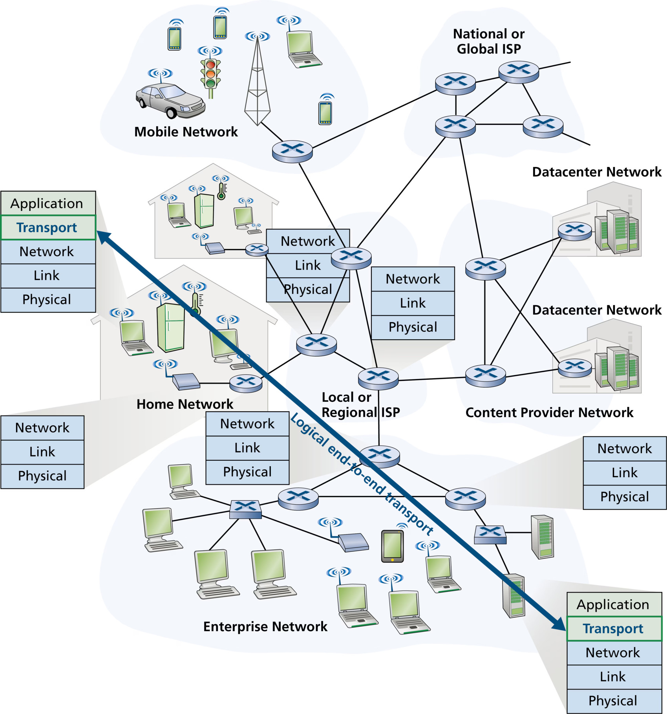

!!! info "定义：逻辑通信（logical communication）"

    **英文原文（权威定义）：**

    > A transport-layer protocol provides for **logical communication** between application processes running on different hosts. By logical communication, we mean that from an application's perspective, it is as if the hosts running the processes were directly connected; in reality, the hosts may be on opposite sides of the planet, connected via numerous routers and a wide range of link types.

    **中文解释：** 传输层协议为运行在不同主机上的应用进程提供 **逻辑通信**。所谓「逻辑」，是指应用层「感觉」自己与对端进程直接相连，而实际上报文要穿越完整的网络核心（无数路由器与各类链路）。这种抽象让应用层不必关心数据在中间网络中如何被路由、排队与转发。

### 传输层与网络层的关系

传输层紧邻网络层之上。**网络层协议提供的是主机与主机之间的逻辑通信（host-to-host）**，而 **传输层协议提供的是进程与进程之间的逻辑通信（process-to-process）**。这一区别细微但至关重要。

用书中的家庭类比来理解：东海岸与西海岸各有一个家庭，每家 12 个孩子，孩子们每周互寄信件。邮政服务（类比网络层）负责把信件从一栋房子运到另一栋房子——**房屋到房屋**；而每家的「收发专员」Ann 和 Bill（类比传输层）负责把信件分发给本家的孩子们——**人到人**。对孩子们而言，Ann 和 Bill 就是「邮件服务」，尽管他们只是端到端交付过程中的一部分（端系统部分）。

这个类比还有两层深意：

- **传输层只在端系统中实现。** Ann 和 Bill 只在自己的家里工作，不参与任何中间分拣中心的分拣。同理，路由器只处理数据报的网络层字段，**从不检查传输层报文段内部的字段**。中间路由器对 TCP 连接完全无感——它们只看到数据报，看不到连接。
- **传输层的服务受制于网络层的服务模型。** 如果邮政服务不能保证三天内送达（网络层不能提供时延/带宽保证），那么 Ann 和 Bill 也不可能向孩子们保证最大交付时延。**网络层不能提供的时延/带宽保证，传输层同样无法提供。**

但反过来，**传输层能提供网络层不能提供的服务**：网络层 IP 是不可靠的（不保证送达、不保证按序、不保证完整），传输层 TCP 却能在其上构建 **可靠的数据传输服务**；传输层还能用加密保证应用消息不被窃读（第八章详述）——这些能力网络层都不具备。

### 因特网中的传输层协议概览

因特网为应用层提供两个传输协议：

- **UDP（User Datagram Protocol，用户数据报协议）**：向应用提供 **不可靠、无连接** 的服务。
- **TCP（Transmission Control Protocol，传输控制协议）**：向应用提供 **可靠、面向连接** 的服务。

术语约定：本书把 TCP 与 UDP 的传输层分组统称为 **报文段（segment）**；网络层分组专称 **数据报（datagram）**。RFC 文献常把 UDP 分组也称作数据报，但本书为清晰起见统一使用「报文段」。

**IP 的服务模型是尽力而为（best-effort）交付**：尽最大努力在主机之间交付报文段，但不保证送达、不保证按序、不保证数据完整性，因此 IP 被称为 **不可靠服务**。UDP 与 TCP 最根本的共同职责，就是把 IP 的 **主机到主机** 交付，扩展为 **进程到进程** 交付——这项工作称为 **传输层多路复用与解复用（multiplexing and demultiplexing）**（3.2 节详述）。此外两者都在报文段首部携带差错检测字段（校验和）。

- **UDP 的全部服务**：进程到进程交付 + 差错检测，仅此两项，与 IP 一样不可靠。
- **TCP 的额外服务**：① **可靠数据传输**（借助流量控制、序号、确认、定时器，保证数据从发送进程正确、按序地到达接收进程）；② **拥塞控制**（这与其说是给调用应用的好处，不如说是为整个因特网服务的「公益」——调节 TCP 发送方注入网络的速率）。UDP 流量不受管制，应用想发多快就发多快。

TCP 同时提供可靠传输与拥塞控制，因而必然复杂。本章的讲授策略是 **原理与协议交替**：先讲可靠传输的一般原理（3.4），再看 TCP 如何具体实现；先讲拥塞控制的一般原理（3.6），再看各版本 TCP 如何实施拥塞控制（3.7）。而这一切，从复用与解复用讲起。

---

## 3.2 多路复用与解复用

假设你正坐在电脑前：一边下载网页，一边开着 Zoom 会议，还开着两个 ssh 会话——你的主机上同时运行着 4 个网络应用进程。当传输层从下层网络层收到数据时，它必须把数据交给这 4 个进程中的 **正确的那一个**。这个「分发」过程就是解复用。

**核心概念①：多路复用与解复用（multiplexing / demultiplexing）** —— 传输层在源主机把多个进程 socket 的数据块分别封装（加首部）后交给网络层，称为 **多路复用**；在目的主机根据首部字段把报文段交付给正确的 socket，称为 **解复用**。复用与解复用是把「主机到主机」服务升级为「进程到进程」服务的关键机制，也是 408 选择题高频考点。

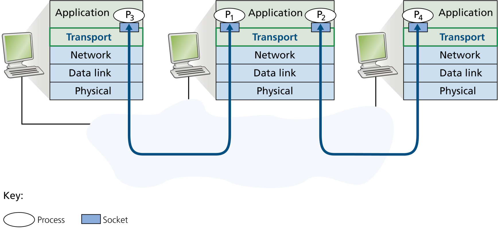

回顾第二章：一个进程可以拥有一个或多个 **socket** ——数据从网络进入进程、或从进程进入网络所经过的「门」。**传输层交付数据的直接对象是 socket，而非进程本身**。既然一台主机上同时存在多个 socket，每个 socket 就必须有唯一的标识符。这个标识符的格式取决于它是 UDP socket 还是 TCP socket。

回到邮寄类比：每个孩子有名字。Bill 收到邮差送来的一批信，通过查看信上的收件人来「解复用」，分发给兄弟姐妹；Ann 收集兄弟姐妹的信件交给邮差，就是「多路复用」。

**多路复用需要两个条件**：① socket 有唯一标识；② 每个报文段携带指明交付目标的特殊字段——**源端口号字段与目的端口号字段**。端口号是 16 位整数，范围 **0～65535**。其中 **0～1023** 为 **熟知端口号（well-known port number）**，保留给著名的应用层协议：HTTP 使用 **80** 号端口、FTP 使用 **21** 号端口、DNS 使用 **53** 号端口、SMTP 使用 **25** 号端口；1024～49151 为注册端口；49152～65535 为动态/私有端口。开发新应用时必须为它分配端口号。

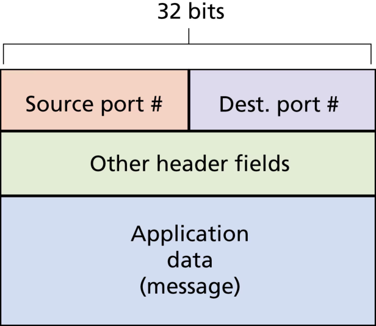

解复用的基本实现：主机中的每个 socket 被分配一个端口号，报文段到达时传输层检查目的端口号，把报文段交给对应的 socket，数据再经 socket 进入进程。**UDP 正是这样做的；TCP 则更微妙一些。**

### 无连接复用：UDP 的二元组

UDP socket 由一个 **二元组（two-tuple）** 唯一标识：**（目的 IP 地址，目的端口号）**。因此，两个源 IP 地址或源端口号不同、但目的 IP 与目的端口相同的 UDP 报文段，会被交付到 **同一个目的 socket、同一个目的进程**。

那么源端口号有什么用？它构成 **回信地址** 的一部分（完整的回信地址是源 IP + 源端口）。如图 3.4 所示：A 发给 B 的报文段中，源端口号被 B 用作回信报文段的目的端口号。UDP 服务器用 `recvfrom()` 从收到的报文段中取出客户端（源）端口号，再以它为回信的目的端口号。

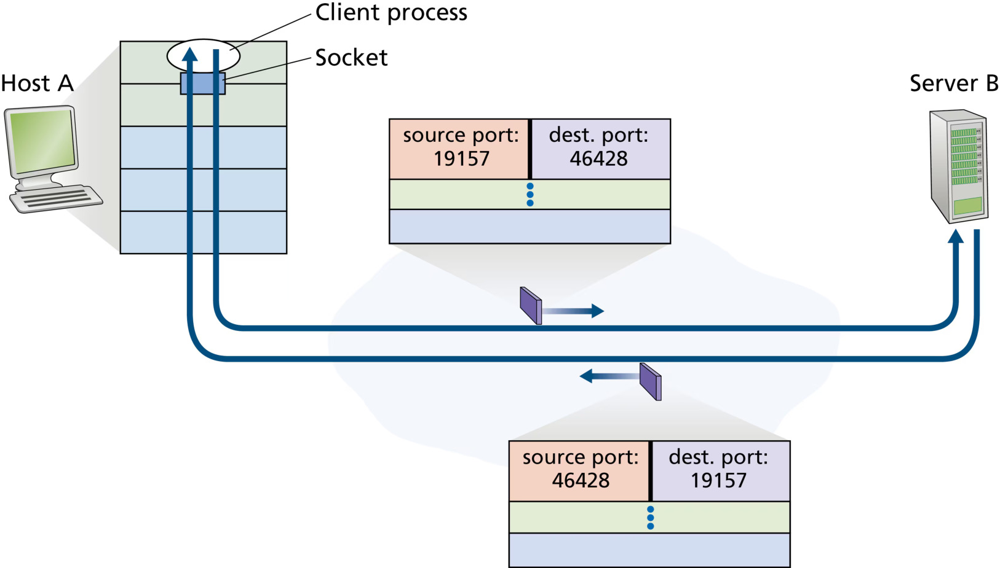

端口号分配惯例：客户端通常让传输层自动（透明地）分配端口号，服务器端则使用特定的熟知端口号（或显式 bind）。

### 面向连接复用：TCP 的四元组

TCP socket 由一个 **四元组（four-tuple）** 唯一标识：**（源 IP 地址，源端口号，目的 IP 地址，目的端口号）**。当一个 TCP 报文段到达主机时，主机用全部四个字段来解复用。

关键区别：**与 UDP 不同，两个源 IP 或源端口不同的 TCP 报文段，即使目的 IP 与目的端口相同，也会被导向两个不同的 socket**（唯一的例外是携带原始连接建立请求 SYN 的报文段，它被导向监听 socket）。

TCP 服务器的工作机制：

1. 服务器应用有一个 **欢迎 socket（welcoming socket）**，在熟知端口上等待客户端的连接建立请求（`serverSocket.accept()`）。
2. 客户端创建一个 socket 并发起连接建立请求——即一个目的端口号为熟知端口、且设置特殊连接建立标志位的 TCP 报文段（详见 3.5.6 三次握手）。
3. 服务器的操作系统收到该报文段后，**创建一个新的连接 socket**，其标识为请求报文段中的四元组。此后所有四元组匹配的报文段都被解复用到这个连接 socket。

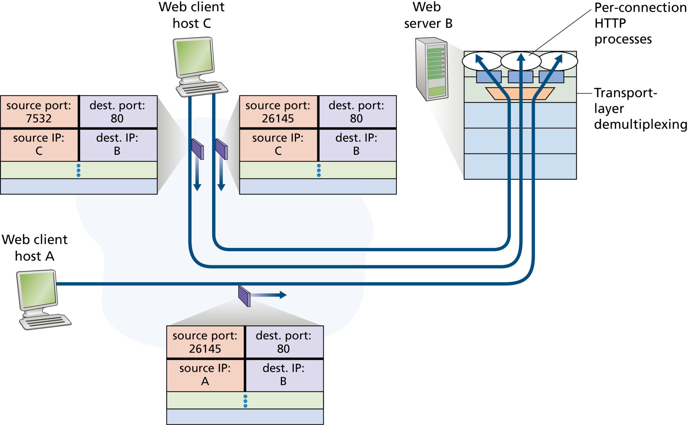

如图 3.5：主机 C 与服务器 B 建立两个 HTTP 会话（分配两个不同的源端口），主机 A 与 B 建立一个会话。A 可能与 C 选择了相同的源端口号，但这没有问题——因为两个连接有 **不同的源 IP 地址**，四元组不同，服务器 B 依然能正确解复用。

**Web 服务器与 TCP**：所有客户端的报文段目的端口都是 80。服务器靠 **源 IP 地址 + 源端口号** 区分不同客户端。注意连接 socket 与进程不一定一一对应——高性能 Web 服务器常只用一个进程、为每个新连接创建一个带新连接 socket 的线程；多个连接 socket（不同四元组）可以挂接在同一个进程上。持久 HTTP 期间，整个连接共用一个 socket；非持久 HTTP 每次请求/响应都要创建并关闭新连接、新建 socket，繁忙服务器下开销显著。

!!! warning "常见错误：UDP 与 TCP 的复用标识混淆"

    - **UDP socket = 二元组（目的 IP，目的端口）**：只要目的二元组相同，无论来自哪个源，都进同一个 socket。
    - **TCP socket = 四元组（源 IP，源端口，目的 IP，目的端口）**：四元组中任何一者不同，就是不同连接、不同 socket。

    408 经典考法：问「两个报文段能否到达同一个 socket」——UDP 看目的二元组，TCP 看完整四元组。另外注意：**端口号是传输层的概念，用于标识进程**；IP 地址是网络层的概念，用于标识主机，两者不可混淆。且 **端口号只具有本地意义**（王道 2026）：端口号只需在本机范围内唯一即可，不同主机上的进程可以使用相同的端口号而互不冲突（如 A 机与 B 机的 Web 进程都可占用 80 号端口）——因为端口号只在「本机内部」标识进程，跨主机寻址靠的是 IP 地址 + 端口号的组合。

**安全视角：端口扫描（port scanning）**。服务器进程在开放端口上等待客户端连接；攻击者可用 nmap 等端口扫描工具探测目标主机的开放端口，从而推断其上运行的应用（若有已知漏洞，如 SQL 服务器缓冲区溢出被 Slammer 蠕虫利用，则该主机极易被攻陷）。端口扫描对系统管理员同样有用——用来盘点自己网络中运行的应用。

---

## 3.3 无连接传输：UDP

假如让你设计一个「最简主义」的传输协议，你会怎么做？最极端的想法是发送方把应用消息直接丢给网络层、接收方把网络层消息直接交给应用进程——但正如 3.2 节所述，**至少还得做一点事**：提供多路复用/解复用服务，把数据在网络层与正确的应用进程之间传递。

**UDP（RFC 768）做的就是「一个传输协议最少能做多少事」这件事**：除复用/解复用与轻度差错检测外，UDP 对 IP 什么也不加。选择 UDP 的应用几乎就是在直接与 IP 对话。UDP 发送方把应用消息附上源/目的端口字段和两个小字段，交给网络层；接收方按目的端口把数据交给正确的进程。**UDP 发送报文段前不需要发送方与接收方握手，因此称为无连接（connectionless）。**

典型应用：**DNS 通常运行在 UDP 之上**——查询主机构造 DNS 查询消息交给 UDP，不经任何握手就发出；若超时未收到回复，可重发查询、换一个名字服务器，或告知应用无法获得回复。

### UDP 为什么存在

既然 TCP 提供可靠数据传输，为什么还要 UDP？原因如下：

- **对发送数据的内容与时机有更精细的应用层控制。** UDP 下，应用进程一把数据交给 UDP，UDP 立刻封装成报文段交给网络层。而 TCP 有拥塞控制机制——当源到目的之间的链路拥塞时，TCP 发送方会被节流；TCP 还会持续重传未确认的报文段，不管可靠交付要多久。实时应用（因特网电话、视频会议）通常要求最低发送速率、不能过度延迟、能容忍少量丢失——TCP 的服务模型与它们不匹配，用 UDP 并在应用层实现所需功能更合适。
- **无连接建立。** TCP 传输数据前要经过三次握手；UDP 直接「开火」，不引入建连延迟。这是 DNS 用 UDP 而非 TCP 的主要原因（TCP 会让 DNS 慢得多）。
- **无连接状态。** TCP 在端系统中维护连接状态（收发缓冲区、拥塞控制参数、序号与确认号等）；UDP 不维护连接状态、不跟踪任何参数。因此 **同一服务器在 UDP 下通常能支持多得多的并发客户端**。
- **首部开销小。** UDP 首部 8 字节，远小于 TCP 首部的最小 20 字节。


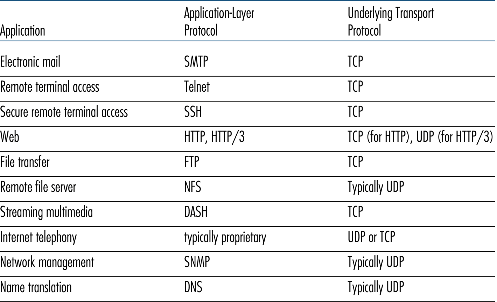

如图 3.6：电子邮件、远程终端访问、文件传输运行在 TCP 之上（需要可靠交付）；网络管理 **SNMP** 用 UDP（网络处于压力状态时，可靠且拥塞受控的传输恰恰难以实现，而网管应用恰恰要在这种状态下工作）；DNS 通常用 UDP（避免建连延迟，也可运行在 TCP 上）；多媒体应用（因特网电话、实时视频会议、存储音视频流）两者皆有——它们能容忍少量丢失，且实时应用对 TCP 的拥塞控制反应极差。

**重要警告：无拥塞控制是把双刃剑。** UDP 没有拥塞控制，而拥塞控制对防止网络进入「几乎不干活」的拥塞状态至关重要。若人人都在 UDP 上以高码率流媒体且不做拥塞控制，路由器分组溢出会极其严重，几乎没有 UDP 分组能穿越路径；同时失控的 UDP 发送方造成的丢失会让 TCP 发送方急剧降速，把 TCP 会话「挤出」网络。因此研究者一直呼吁让包括 UDP 在内的所有源都做自适应拥塞控制（如 DCCP，3.8 节）。

另外：**应用也可以用 UDP 获得可靠传输**——把可靠性建在应用层（自行实现确认与重传机制，如 3.4 节所讲）。QUIC 正是这样做的：基于 UDP、在应用层实现可靠性。

### UDP 报文段结构

UDP 报文段结构如图 3.7，由 RFC 768 定义。数据字段承载应用数据（DNS 查询/响应、音频采样等）。**UDP 首部只有 4 个字段，每字段 2 字节，共 8 字节**（**高频考点**，命题追踪 2018：UDP 首部格式）：

| 字段 | 长度 | 作用 |
|:---|:---|:---|
| **源端口号** | 16 bit | 标识发送进程，供对方回信 |
| **目的端口号** | 16 bit | 接收方据此解复用，交付给正确进程 |
| **长度（length）** | 16 bit | UDP 报文段（首部 + 数据）的总字节数；因数据字段长度可变，必须显式给出 |
| **校验和（checksum）** | 16 bit | 接收方据此检查报文段在传输中是否出现差错 |

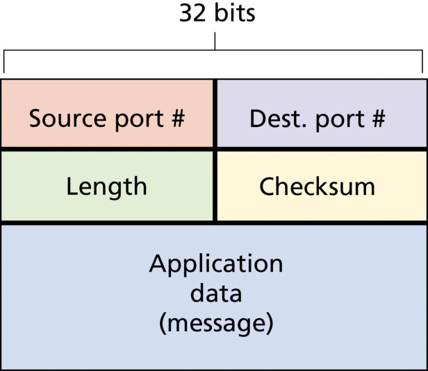


### UDP 校验和

**UDP 校验和提供差错检测**：判断报文段从源到目的的过程中（如链路噪声或路由器存储时）比特是否被改动。发送方对报文段中所有 16 位字求和，**任何求和过程中的溢出都要回卷（wrap around）**，然后取 **反码**（把 0 变 1、1 变 0），结果填入校验和字段。接收方把所有字（包括校验和）相加，若无差错，和应为全 1（1111111111111111）；若任一比特为 0，则报文段出现差错。

**UDP 校验和计算时的伪首部（王道 2026，408 考点）**：计算校验和时，UDP 会在报文段之前临时拼接一个 **12 字节伪首部（pseudo-header）**——源 IP 地址（4 字节）+ 目的 IP 地址（4 字节）+ 全 0（1 字节）+ 协议字段（1 字节，UDP 为 17）+ UDP 长度（2 字节）。伪首部 **只参与校验和计算、不随报文段传输**，其作用是把源/目的 IP 地址纳入差错检测范围，防止 IP 首部中的地址被篡改而 UDP 校验和却无法发现。**TCP 报文段计算校验和时同样使用 12 字节伪首部**（协议字段为 6，TCP）。

!!! example "例题 1：UDP 校验和计算（含回卷）"

    假设 UDP 报文段中有如下三个 16 位字（数据 + 首部按 16 位分组）：

    ```text
    0110011001100000
    0101010101010101
    1000111100001100
    ```

    试计算：（1）校验和的值；（2）若接收方把包括校验和在内的四个字相加，得到的和是什么？（3）若传输过程中某一比特被翻转，接收方能否发现差错？

    ??? answer "查看答案"
        **（1）计算校验和。** 发送方把三个 16 位字逐字相加：

        第一步，前两个字相加（无溢出）：

        ```text
        0110011001100000
        0101010101010101
        -----------------
        1011101110110101
        ```

        第二步，与第三个字相加——**注意此处产生溢出，需要回卷**：

        ```text
        1011101110110101
        1000111100001100
        -----------------
        1 0100101011000001    ← 最高位有进位 1（溢出）
        ```

        把溢出的进位 1 **回卷** 到最低位：

        ```text
          0100101011000001
        +                1
        -----------------
        = 0100101011000010    ← 回卷后的和
        ```

        第三步，取反码（0 与 1 互换）：0100101011000010 的反码为 **1011010100111101**，这就是填入校验和字段的值。

        **（2）接收方验证。** 接收方把三个数据字 + 校验和共四个字相加：

        ```text
        0110011001100000
        0101010101010101
        1000111100001100
        1011010100111101
        -----------------
        1111111111111111
        ```

        得到 **全 1**——说明无差错。这正是校验和设计的巧妙之处：校验和是和的补码，故「数据和 + 校验和」必为全 1。

        **（3）差错检测。** 若传输中任意一个比特被翻转，最终相加的结果中至少出现一个 0，接收方即可判定报文段出错。但注意：**校验和只能「检测」差错，不能「纠正」差错**，且无法检测所有差错组合（例如两个比特同时翻转可能恰好互相抵消，此时和仍为全 1，产生漏检）。

    ??? success "评分标准"

        - 前两字相加正确（2 分）
        - 第三字相加并识别溢出（2 分）
        - 回卷操作正确（2 分）
        - 取反码得校验和（2 分）
        - 接收方四字相加得全 1 并解释原因（2 分）
        - 差错检测能力论述（2 分）

**为什么 UDP 需要校验和？** 链路层协议（如以太网）也提供差错检测，但：① 源到目的之间的某些链路可能使用不提供差错检测的链路层协议；② 即使报文段在链路上正确传输，在路由器内存中存储时也可能引入比特错误。因此 UDP 必须在传输层做 **端到端（end-to-end）** 差错检测——这正是著名的 **端到端原则（end-to-end principle）** 的体现：「某些功能（如差错检测）必须在端到端的基础上实现，放在低层实现可能冗余或价值不高」。UDP 检测到差错后 **不做任何恢复**：有的实现丢弃受损报文段，有的交给应用并给出警告。

**UDP 与 TCP 对比小结**：

| 特性 | UDP | TCP |
|:---|:---|:---|
| 连接 | 无连接 | 面向连接（三次握手） |
| 可靠性 | 不可靠（尽力而为） | 可靠（确认 + 重传 + 序号） |
| 流量控制 | 无 | 有（rwnd 接收窗口） |
| 拥塞控制 | 无 | 有（cwnd 拥塞窗口） |
| 首部开销 | 8 字节 | 至少 20 字节 |
| 交付单位 | 报文段（数据报） | 字节流 |
| 典型应用 | DNS、SNMP、流媒体、QUIC 底层 | HTTP、FTP、SMTP、Telnet/SSH |

---

## 3.4 可靠数据传输原理

**核心概念②：可靠数据传输原理（RDT / GBN / SR）** —— 在不可靠（可能丢失、损坏分组）的下层信道之上，通过 **校验和、序号、确认/否定确认、定时器、窗口** 等机制的组合，向上层提供「无损坏、无丢失、按序交付」的可靠信道抽象。这是全网十大根本问题之首，也是 408 大题的主战场（**高频考点**：停等/GBN/SR 的窗口与序号关系、信道利用率、时序分析都是大题素材）。

可靠数据传输问题不只出现在传输层，链路层、应用层同样需要。其 **服务抽象** 是：上层实体看到一个 **可靠信道（reliable channel）**——经此信道传输的数据比特 **不被破坏（不翻转）、不丢失、且按发送顺序交付**。这正是 TCP 向调用它的因特网应用提供的服务模型。

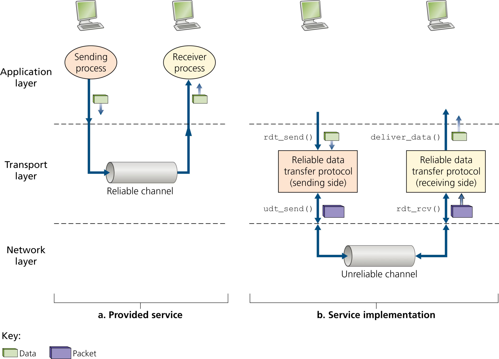


实现可靠数据传输的协议称为 **rdt（reliable data transfer protocol）**。协议接口：上层调用 `rdt_send(data)` 发起发送；下层分组到达时调用 `rdt_rcv(packet)`；向上层交付数据调用 `deliver_data(data)`；向对方发送分组（数据或控制分组）调用 `udt_send(packet)`。本章只考虑 **单向数据传输**（发送→接收），但收发双方仍需双向交换控制分组（ACK/NAK）。一个重要假设：**底层信道不会重排分组**（按序交付，但可能丢包）。

!!! info "定义：可靠信道服务模型（reliable channel）"

    **英文原文（权威定义）：**

    > The service abstraction provided to the upper-layer entities is that of a **reliable channel** through which data can be transferred. With a reliable channel, no transferred data bits are corrupted (flipped from 0 to 1, or vice versa) or lost, and all are delivered in the order in which they were sent.

    **中文解释：** 可靠信道承诺：数据比特 **不被破坏、不丢失、按发送顺序交付**。TCP 向应用提供的正是这一服务。实现这一抽象的难点在于：下层信道（如 IP 网络）并不可靠——可靠传输协议必须自己用各种机制来「对抗」下层的不可靠。

### rdt1.0：完全可靠信道上的协议

最简情形：底层信道 **完全可靠**（不损坏、不丢失比特）。rdt1.0 平凡而直接：

- **发送方**：`rdt_send(data)` 事件到来 → 动作 `make_pkt(data)` 构造分组 → `udt_send(sndpkt)` 发送。
- **接收方**：`rdt_rcv(packet)` 事件到来 → 动作 `extract(packet, data)` 取出数据 → `deliver_data(data)` 交给上层。

rdt1.0 中数据单元与分组没有区别；所有分组单向流动，**接收方无需向发送方反馈任何信息**（因为不可能出错），也无需流控（假设接收方总来得及接收）。发送方与接收方的有限状态机（FSM）各只有一个状态。（原书中 rdt1.0/2.x/3.0 的 FSM 状态图在本教材图库中缺失，此处以文字描述代替，不影响考点。）

### rdt2.0：位差错信道上的停等协议（NAK/ACK）

更现实的信道模型：分组中的 **比特可能被损坏**（典型发生于物理部件）。如何应对？想想你如何在电话上口述长消息：对方每听懂一句就回「OK」（肯定确认），听到听不清的句子就让你重复（否定确认）。这种基于重传的可靠传输协议称为 **ARQ（Automatic Repeat reQuest，自动重传请求）协议**。处理位差错需要三个新能力：

1. **差错检测**：接收方需要检测比特错误——用分组校验和（如 UDP 的因特网校验和）。
2. **接收方反馈**：发送方必须知道接收方的「所见」——回送 **ACK（positive acknowledgment，肯定确认）** 或 **NAK（negative acknowledgment，否定确认）**，各 1 bit 即可。
3. **重传**：接收错误的分组由发送方重传。

**rdt2.0 发送方有两个状态**：等待上层数据；等待 ACK/NAK。收到 ACK → 回去等待新数据；收到 NAK → 重传最近的分组再等 ACK/NAK。注意：在「等 ACK/NAK」状态下，发送方 **不能从上层取新数据**——只有确认当前分组被正确接收后才发新数据。**这种「发一个、等确认、再发下一个」的协议称为停等（stop-and-wait）协议**。

**rdt2.0 的致命缺陷：没考虑 ACK/NAK 本身也可能损坏！** 若 ACK/NAK 被损坏，发送方无从得知接收方是否已正确收到上一个数据分组。三种补救思路：

1. 引入新的「你刚才说什么？」控制分组——但该分组本身也可能损坏，陷入无限递归。
2. 给 ACK/NAK 加足够多的校验位，让发送方能 **纠错** 而非仅检错。
3. 收到损坏的 ACK/NAK 时，发送方 **直接重发当前数据分组**——但这会把 **重复分组** 引入信道：接收方无法区分「新数据」与「重传」。

**解决方案（几乎所有现有协议、包括 TCP 都采用）：为数据分组编号**——在分组中加入 **序号（sequence number）字段**。对停等协议，1 bit 序号（0/1 交替）就够：接收方只要检查序号，就知道收到的是重传（序号与最近收到的相同）还是新数据（序号前进）。

### rdt2.1 与 rdt2.2：修复 ACK/NAK 损坏

- **rdt2.1**：发送方与接收方状态数加倍（反映「当前发送/期望的分组序号是 0 还是 1」）。发送方收到损坏的 ACK/NAK 时重传当前分组；接收方靠序号识别重复分组并丢弃。rdt2.1 同时使用 ACK 与 NAK。
- **rdt2.2（无 NAK 的版本）**：**去掉 NAK，改用冗余 ACK（duplicate ACK）**。接收方收到失序分组时，回送对最近正确接收分组的 ACK；收到损坏分组时，回送对上一个正确接收分组的 ACK（即重复 ACK）。发送方收到两个相同 ACK（重复 ACK）即知「ACK 之后的那一个分组未被正确接收」。rdt2.2 中 ACK 必须携带被确认分组的序号（ACK0/ACK1），发送方也要检查 ACK 的序号。**这一机制是 TCP 快重传的思想源头。**

### rdt3.0：丢包信道上的协议（超时重传）

信道不仅损坏比特，还可能 **丢包**（如今天因特网中常见）。需要解决两个新问题：如何 **检测丢包**、丢失后 **怎么办**。检测靠新机制——**定时器**；处理靠已有的校验和、序号、ACK、重传。

rdt3.0 的基本思想：发送方发送数据分组后，若数据分组或其 ACK 丢失，发送方将收不到任何回应。若发送方等待足够长的时间确信丢失，就重传。**但「足够长」很难确定**（最坏情况时延难以估计），因此实践中采用折中：**谨慎选择超时值，使得超时「很可能但不确定」意味着丢失**。若分组只是被异常延迟，发送方会过早超时重传，引入重复分组——好在 rdt2.2 的序号已能处理重复。

从发送方角度看，重传是「万灵药」：数据丢失、ACK 丢失、分组/ACK 延迟，三种情况动作相同——**重传**。实现基于时间的重传需要 **倒计时定时器（countdown timer）**：发送方要能 ① 每次发送分组（首次或重传）时启动定时器；② 响应定时器中断；③ 停止定时器。由于序号在 0/1 间交替，rdt3.0 又称 **交替比特协议（alternating-bit protocol）**。

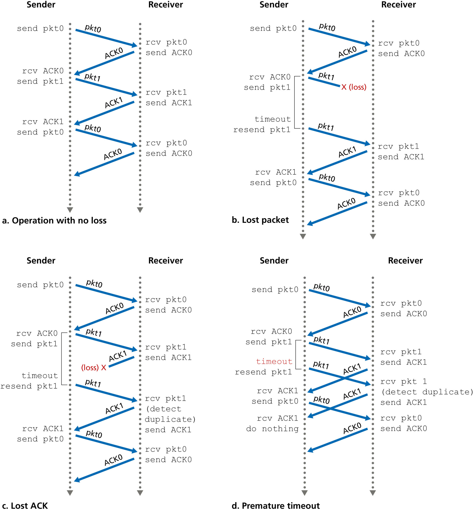


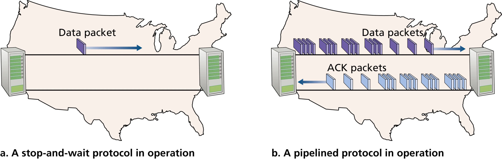

!!! example "例题 2：rdt3.0 时序分析"

    发送方 S 与接收方 R 之间采用 rdt3.0（交替比特协议），序号 0/1 交替。请分别分析以下三种场景下协议的完整动作序列，说明每个动作的原因：

    （1）正常传输：S 发送序号 0 的分组，R 正确收到。

    （2）数据分组丢失：S 发送序号 0 的分组，该分组在信道中丢失。

    （3）ACK 丢失：S 发送序号 0 的分组，R 正确收到并回送 ACK0，但 ACK0 丢失；随后 S 重传序号 0 的分组，R 再次收到。

    ??? answer "查看答案"
        **（1）正常传输：** ① S 启动定时器，发送序号 0 的数据分组；② R 收到后校验无误、交付上层，回送 ACK0；③ S 在超时前收到 ACK0，停止定时器，序号翻转为 1，继续发送新数据。整个周期一收一发，无需重传。

        **（2）数据分组丢失：** ① S 启动定时器，发送序号 0 的分组（信道中丢失）；② S 迟迟收不到 ACK0，定时器超时；③ S 重传序号 0 的分组（**重传的数据分组与首次发送的序号相同**——这正是序号机制的价值）；④ R 收到序号 0 的分组，交付上层、回送 ACK0；⑤ S 收到 ACK0，停止定时器，序号翻转为 1。

        **（3）ACK 丢失：** ① S 启动定时器，发送序号 0 的分组；② R 正确收到，交付上层、回送 ACK0——**但 ACK0 在信道中丢失**；③ S 收不到 ACK0，定时器超时；④ S 重传序号 0 的分组（注意：此时 R 已收到过该分组，这是重复传输）；⑤ R 再次收到序号 0 的分组，**检查序号发现与最近收到的相同，判定为重复分组，丢弃数据但再次回送 ACK0**（不能向上层重复交付！）；⑥ S 收到 ACK0，停止定时器，序号翻转为 1。

        **关键结论：** 发送方无法区分「数据丢失」「ACK 丢失」与「延迟」——三种情况的应对都是重传。重复分组由接收方依据序号识别并丢弃，保证上层「不重、不错、不丢、按序」。这就是 rdt3.0 可靠性的完整逻辑。

    ??? success "评分标准"

        - 场景（1）动作完整（2 分）
        - 场景（2）定时器超时 + 重传 + 序号机制（4 分）
        - 场景（3）重复分组被接收方丢弃 + 重发 ACK（4 分）
        - 结论：发送方无法区分三种异常、统一重传（2 分）

### 流水线协议（Pipelining）

rdt3.0 功能正确，但 **性能堪忧**——它是停等协议。想想两端系统的 RTT 约 30 ms、链路速率 1 Gbps、分组 1000 字节（8000 bit）的场景：传输一个分组需 8 μs，但等 ACK 要等 30 ms。**发送方利用率（utilization）仅约 0.027%**——发送方在 99.97% 的时间里无所事事，即使链路是 1 Gbps，有效吞吐量也只有约 267 kbps。花大价钱买来的吉比特链路只跑出 267 kbps，这是协议限制硬件能力最生动的例证。


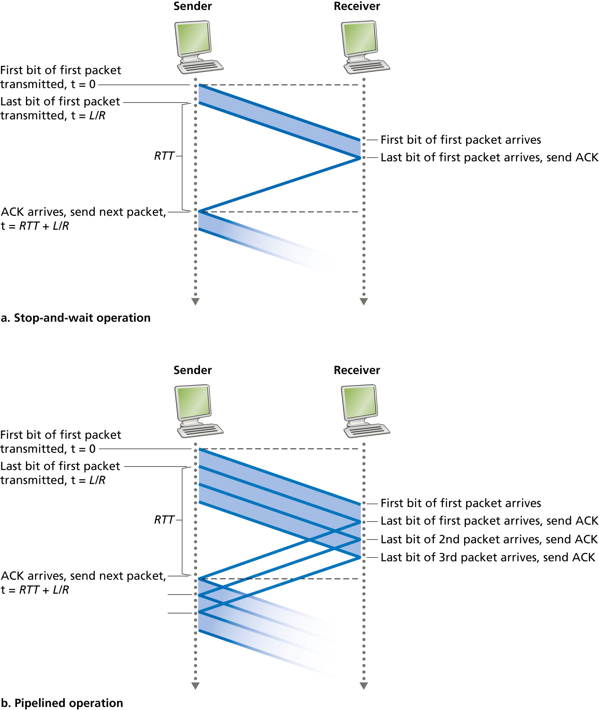

**解决方案：流水线（pipelining）** ——允许发送方在等待确认的同时发送 **多个分组**。如图 3.18，允许发 3 个分组再等确认，利用率约提高 3 倍。在途（in-transit）的分组如同充满管道的流体，故称流水线。


**流水线化的利用率公式（408 常考）**：设分组长 L bit、链路速率 R bit/s，传输一个分组需 T_trans = L/R；RTT 为往返时延。停等协议（忽略 ACK 传输时间与处理时延）：

$$ U_{stop-and-wait} = \frac{T_{trans}}{T_{trans} + RTT} $$

流水线协议发送窗口为 N（最多 N 个未确认分组在途）：

$$ U_{pipelined} = \frac{N \cdot T_{trans}}{T_{trans} + RTT} $$

（当 N·T_trans ≥ T_trans + RTT 时，发送方从不空闲，利用率为 100%。）这与数据链路层的信道利用率公式 U = W·T_f / (T_f + 2T_p) 本质相同，仅 T_p 换成 RTT/2。**408 常考：给定额外 RTT、帧长、带宽，求最大信道利用率与所需窗口/序号位数。**

流水线化对协议提出了两个新要求：

- **序号范围必须扩大**：每个在途分组（不计重传）必须有唯一序号。
- **收发双方可能要缓存多个分组**：发送方至少需缓存已发未确认的分组；接收方可能也需要缓存正确接收的分组。

根据「如何响应丢失、损坏、延迟分组」的不同，流水线错误恢复有两种基本方法：**回退 N 步（Go-Back-N，GBN）** 与 **选择重传（Selective Repeat，SR）**。

### 回退 N 步：GBN

**GBN 协议** 允许发送方发送多个分组，但 **在途未确认分组数不超过窗口大小 N**。定义两个变量：`base` = 最老未确认分组的序号；`nextseqnum` = 下一个待发送分组的序号（最小未使用序号）。序号空间被划分为四个区间：

- **[0, base-1]**：已发送且已确认；
- **[base, nextseqnum-1]**：已发送但未确认；
- **[nextseqnum, base+N-1]**：可立即发送（若上层有数据来）；
- **≥ base+N**：暂不可用，须待 `base` 被确认后窗口前移才能使用。

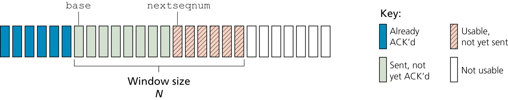

允许发送的未确认分组的序号范围构成一个大小为 N 的 **窗口**，随协议运行 **向前滑动**——因此 N 称为 **窗口大小**，GBN 也称 **滑动窗口协议（sliding-window protocol）**。为什么要限制在途分组数 N？两个原因：**流量控制**（3.5.5）与 **拥塞控制**（3.7）都需要限制发送方。

**序号与模运算**：序号字段为有限位（n 位），范围 0～2ⁿ-1，所有序号运算按 **模 2ⁿ** 进行（序号空间视为大小为 2ⁿ 的环）。rdt3.0 用 1 位序号、范围 0～1。TCP 序号按 **字节** 计数（而非分组），见 3.5.2。

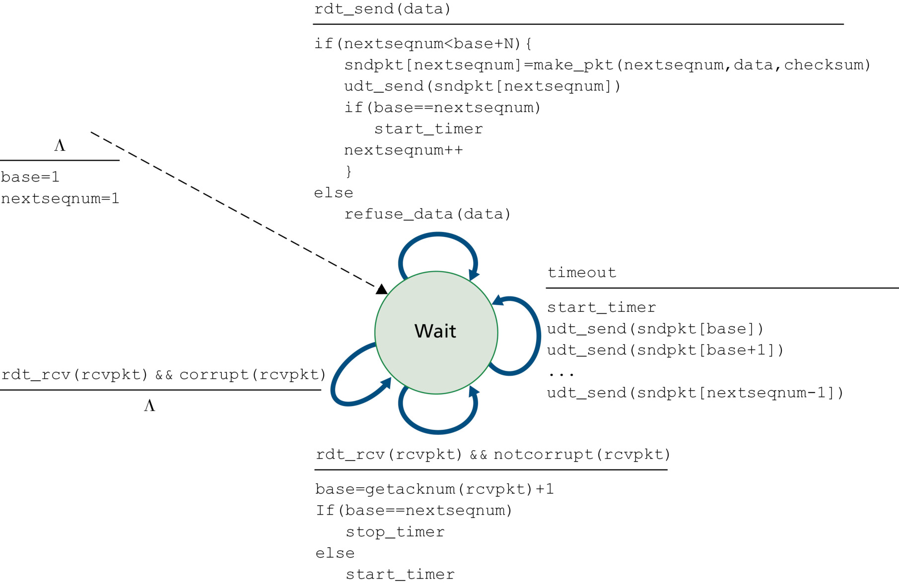


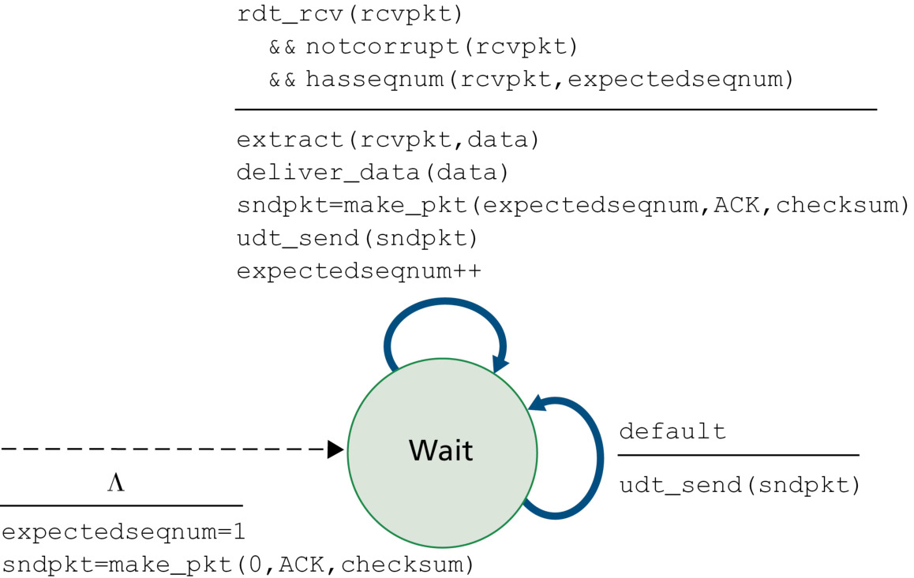

**GBN 发送方需响应三类事件：**

1. **上层调用 `rdt_send()`**：若窗口未满（在途分组 < N），构造并发送分组、更新变量；若窗口已满，把数据退回上层（隐式告知「窗口已满」）。
2. **收到 ACK**：对序号为 n 的 ACK 按 **累积确认（cumulative acknowledgment）** 处理——表示 **序号 ≤ n 的所有分组都已正确接收**。发送方只需记住最小的未确认序号 base；收到 ACK 后窗口前移。
3. **超时事件**：「Go-Back-N」的名字来自发送方对丢失/延迟分组的反应——**超时后重发所有已发送但未确认的分组**。GBN 只用一个定时器（可以理解为最老未确认分组 base 的定时器）：收到 ACK 后若仍有未确认分组则重启定时器；无未确认分组则停止。

**GBN 接收方动作非常简单**：若收到序号为 n 的分组且 **按序到达**（即 n = 期望的 nextseqnum），回送对 n 的 ACK 并交付上层；**其余所有情况（失序或损坏）一律丢弃，并重发对最近按序接收分组的 ACK**。GBN 不缓存失序分组——为什么？因为发送方超时后会重发从 base 起的所有分组，失序分组缓存下来也没用（它们马上会被「正确的副本」覆盖）。累积确认是 GBN 的自然选择：分组逐个交付上层，若 n 已交付，则所有小于 n 的分组必然也已交付。

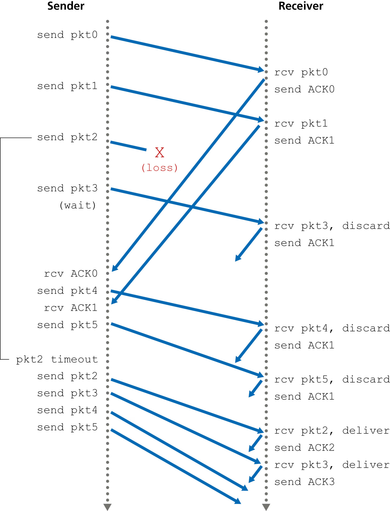


**图 3.22 示例（N=4）**：发送方先发 0、1、2、3 号分组（窗口满），收到 ACK0、ACK1 后窗口前移，可继续发 4、5 号分组；此时 2 号分组丢失，接收方收到失序的 3、4、5 号分组，**全部丢弃** 并连续重发 ACK1；发送方超时后 **重发 2、3、4、5 号全部未确认分组**。这就是「回退 N 步」：回到 base=2，重传窗口中全部。

**GBN 的局限**：当窗口大小与带宽时延积都很大时，管道中可有很多分组，单个分组出错会导致大量不必要的重传——接收方已正确接收但失序、被丢弃的分组都要重传一遍。

### 选择重传：SR

**SR 协议** 只重传接收方认为出错（丢失或损坏）的分组，避免不必要的重传。这要求 **接收方逐分组单独确认（individual acknowledgment）** 正确接收的分组。窗口大小 N 仍用于限制在途分组数，但与 GBN 不同，发送方已收到窗口内部分分组的 ACK。


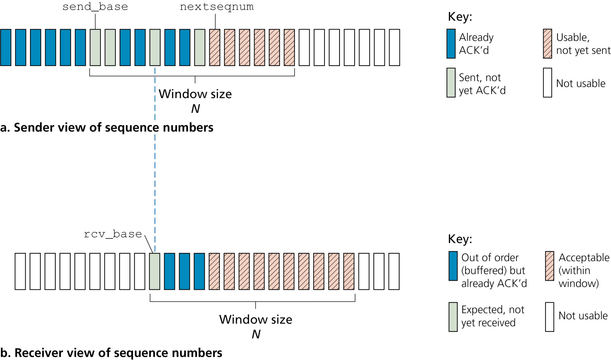

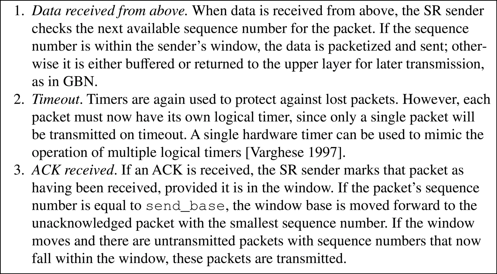


**SR 发送方事件与动作**（图 3.24）：

1. **上层数据到达**：窗口未满则发送，更新 nextseqnum。
2. **超时**：**每个分组都有独立的定时器**（与 GBN 的单定时器不同），超时只重传 **那一个** 分组。
3. **收到 ACK**：若 ACK 的序号在窗口内，标记该分组已确认；若该分组序号 == send_base，则窗口前移，并 **把窗口内所有刚变为可发送（已确认且序号落在新窗口）的分组发送出去**。


**SR 接收方事件与动作**（图 3.25）：**对每个正确收到的分组（无论是否按序）都单独确认**；失序分组被 **缓存**，待缺失分组（序号更小的分组）到齐后，把一批分组按序交付上层。注意图 3.25 步骤 2：接收方对窗口 base 以下已收到的分组 **重新确认**（而非忽略）——否则若 send_base 的 ACK 丢失，发送方最终会重传 send_base，而接收方若不重发 ACK，发送方窗口永远不会前移！


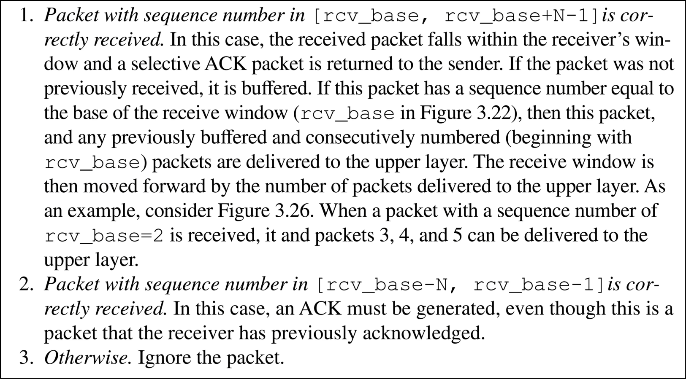

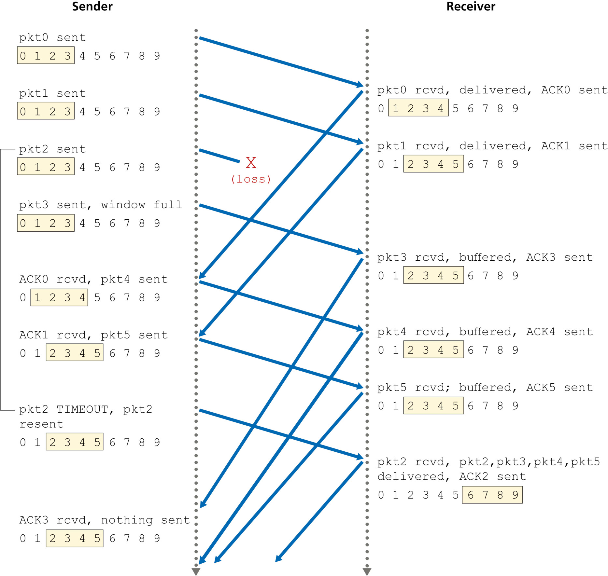


图 3.26 是 SR 在丢包情形下的运行示例：接收方先缓存 2、3 号分组（失序），待 1 号分组补到后，把 1、2、3 号一起按序交付上层。

**一个重要事实：SR 中发送方与接收方的窗口不一定始终重合**（发送方不知道哪些分组已被正确接收，接收方不知道哪些 ACK 已被收到）——这带来 **窗口大小与序号空间的约束**（见下文对比表），也是 SR 的经典考点。

**关于分组重排的补充**：本节假设信道不会重排分组（单条物理链路上通常成立）。但当「信道」是网络时，旧分组的迟来副本可能混入。实践中通过保证「序号不重用直到确认旧分组已不在网中」来防御（假设分组最大存活时间约 3 分钟，RFC 7323）。

### 三种协议对比：停等 / GBN / SR（408 常考）

| 特性 | 停等（stop-and-wait） | GBN（回退 N 步） | SR（选择重传） |
|:---|:---|:---|:---|
| 发送窗口 | 1 | W > 1（最大 2ⁿ-1） | W > 1（收发窗口相等时最大 2ⁿ⁻¹） |
| 接收窗口 | 1 | 1 | W > 1（与发送窗口相等或更小） |
| 确认方式 | 逐分组确认 | **累积确认** | **逐分组独立确认** |
| 定时器 | 每个分组一个 | **只用一个**（最老未确认分组） | 每个分组一个 |
| 失序分组处理 | 不可能出现 | **丢弃** | **缓存** |
| 超时后重传 | 当前分组 | **窗口内全部未确认分组** | **仅丢失的那一个分组** |
| 序号位数关系（n 位序号） | n ≥ 1 | **W ≤ 2ⁿ - 1** | **W ≤ 2ⁿ⁻¹**（收发窗口相等时，即 W_s + W_r ≤ 2ⁿ） |
| 信道利用率 | 低（≈T/(T+RTT)） | 高（连续发送） | 高（连续发送） |

**窗口与序号关系（408 必背）：**

- **GBN**：n 位序号，发送窗口 W 须满足 **W ≤ 2ⁿ - 1**。为什么不能取 2ⁿ？若 W = 2ⁿ，接收窗口为 1，当 ACK 全部丢失、发送方重传从 base 开始的一整窗口时，接收方无法区分「新的一轮分组」与「重传的旧分组」（序号恰好完全重合）。留一个「间隙」即可消歧。
- **SR**：n 位序号，收发窗口相等时须满足 **W ≤ 2ⁿ⁻¹**（等价于 W_s + W_r ≤ 2ⁿ）。若收发窗口都取 2ⁿ⁻¹ 再大，发送方窗口与接收方窗口在序号环上可能重叠，接收方会把新分组误认为旧分组。

!!! example "例题 3：GBN 与 SR 窗口操作对比"

    假设序号用 3 bit 编号（0～7），窗口大小 N = 4，发送方已连续发送 0、1、2、3 号分组。现 2 号分组在信道中丢失。

    （1）分别描述 GBN 与 SR 下，接收方对随后到达的分组如何动作、发送方如何恢复。

    （2）计算 GBN 与 SR 各自允许的最大发送窗口。

    （3）若序号仍为 3 bit，而发送窗口取 5，应选用哪种协议？为什么？

    ??? answer "查看答案"
        **（1）GBN：** 接收方收到失序的 3 号分组（期望收到 2 号），**丢弃 3 号分组** 并重发对最近按序分组（1 号）的 ACK1；发送方 2 号分组的定时器超时后，**重发 2、3 号全部未确认分组**。接收方随后按序收到 2、3 号，正确交付。

        **SR：** 接收方收到失序的 3 号分组，**缓存 3 号并单独确认 ACK3**（同时重发对 1 号的确认）；2 号分组的定时器超时后，发送方 **只重传 2 号分组**；接收方收到 2 号后把 2、3 号一起按序交付上层。

        **对比：** GBN 重传 2 个分组（2、3 号），SR 只重传 1 个（2 号）。当窗口与带宽时延积很大时，GBN 因单分组错误引发的重传风暴会严重浪费带宽，SR 更高效；但 SR 需要接收方缓存与逐分组定时器，实现更复杂。

        **（2）窗口上限：** 3 bit 序号，序号空间大小 2³ = 8。

        - **GBN**：W ≤ 2ⁿ - 1 = 8 - 1 = **7**。
        - **SR**（收发窗口相等）：W ≤ 2ⁿ⁻¹ = **4**。

        **（3）** W = 5 时，**GBN 可用**（5 ≤ 7），SR 不可用（5 > 4）。GBN 接收窗口为 1，只要发送窗口 ≤ 2ⁿ-1 就能正确工作；而 SR 收发窗口之和须 ≤ 2ⁿ，W = 5 时 5 + 5 = 10 > 8，序号会在收发窗口间发生混淆，协议不能正确工作。

    ??? success "评分标准"

        - GBN 接收方丢弃失序分组、发送方重传全部未确认（3 分）
        - SR 接收方缓存失序分组、发送方只重传丢失分组（3 分）
        - 窗口上限计算正确（GBN 7、SR 4）（2 分）
        - W=5 协议选择及理由（2 分）

**原书补充知识**：GBN 的累积确认与 TCP 的确认方式一致（TCP 用累积 ACK，但缓存失序段、配合快重传——见 3.5.4）；TCP 还支持 SACK（选择确认，RFC 2018）选项，启用后 TCP 的差错恢复与 SR 非常相似。因此 TCP 的差错恢复机制本质上是 **GBN 与 SR 的混合体**。

---

## 3.5 面向连接传输：TCP

**核心概念③：TCP 可靠传输与流量控制** —— TCP 在不可靠的 IP 服务之上，用 **序号、累积确认、单一重传定时器、流量控制（rwnd）** 构建可靠、按序、无重、无错的字节流交付，同时用 **拥塞控制（cwnd）** 照顾全网（3.7 节）。这是 408 中题量最大、最细碎的知识点群（**高频考点**：序号/确认号计算、超时与快重传、流量控制窗口计算都是常客）。

在 3.4 节原理的基础上，本节看 TCP 如何落地：TCP 依赖差错检测、重传、累积确认、定时器、序号与确认号字段等原理（RFC 793，现被 RFC 9293 取代）。注意：TCP 与 rdt 协议的关键区别是——**TCP 的序号对字节计数，而非对报文段计数**。

### TCP 连接

TCP 是 **面向连接（connection-oriented）** 的：一个应用进程向另一个应用进程发送数据之前，双方必须先「握手」——互相发送若干预备报文段，建立后续数据传输的参数（双方各自初始化许多 TCP 状态变量）。**TCP 连接不是电路交换中的端到端 TDM/FDM 电路**，而是 **逻辑连接**：连接状态只存在于两个端系统的 TCP 中（收发缓冲区、变量、socket 连接），中间路由器完全不维护 TCP 连接状态（它们只看到数据报，看不到连接）。

TCP 连接提供 **全双工（full-duplex）服务**：数据可同时双向流动。TCP 连接总是 **点对点（point-to-point）**：只在一对发送方/接收方之间——「两台主机是二人世界，三台就是拥挤」。

建立连接时，客户端先发一个特殊 TCP 报文段，服务器回一个特殊报文段，客户端再回第三个——**前两个不含应用数据，第三个可以携带数据**。因为共发送三个报文段，这一过程称为 **三次握手（three-way handshake）**（细节见 3.5.6）。

连接建立后，客户端把数据流经 socket（进程的门）交给客户端的 TCP，TCP 把数据放入该连接的 **发送缓冲区（send buffer）**（图 3.27）。TCP 不时从发送缓冲区抓取数据块交给网络层。**单次抓取放入报文段的数据量上限由最大报文段长度（MSS，Maximum Segment Size）决定**。MSS 的典型设置：先确定本机可发送的最大链路层帧（MTU，Maximum Transmission Unit，以太网与 PPP 均为 1500 字节），再令 MSS 保证「TCP 报文段 + TCP/IP 首部（通常 40 字节）」能装进一个链路层帧——故典型 **MSS = 1500 - 40 = 1460 字节**。**MSS 是报文段中应用层数据的最大量，不是含首部的最大报文段大小**（术语易混，牢记）。

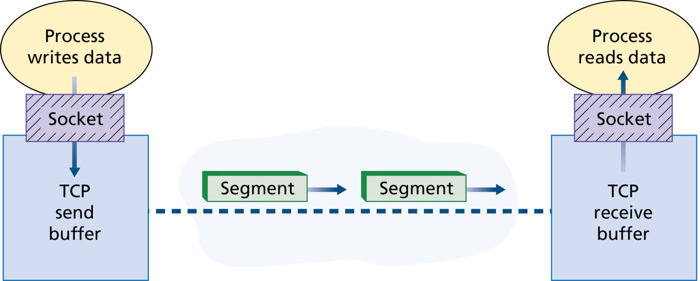

接收端 TCP 把收到的段数据放入 **接收缓冲区（receive buffer）**，应用从缓冲区读取字节流。连接每一侧都有自己的发送缓冲区和接收缓冲区。

### TCP 报文段结构

TCP 报文段由 **首部字段 + 数据字段** 组成。数据字段承载应用数据块，其大小受 MSS 限制：传输大文件时，TCP 把文件切成 MSS 大小的块（最后一块通常不足 MSS）；交互式应用（Telnet、ssh）常一次只发 1 字节数据。TCP 首部 **通常为 20 字节**（比 UDP 首部多 12 字节以上），故 Telnet 报文段可能仅 21 字节。

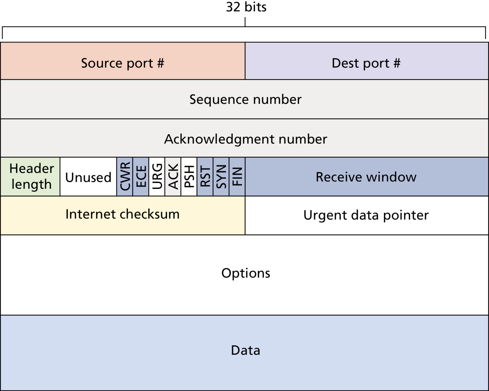


TCP 首部关键字段（图 3.28）：

| 字段 | 长度 | 作用 |
|:---|:---|:---|
| **源端口号 / 目的端口号** | 各 16 bit | 复用/解复用（同 UDP） |
| **序号（sequence number）** | 32 bit | 本报文段数据首字节的字节流编号 |
| **确认号（acknowledgment number）** | 32 bit | 期望收到对方的下一个字节的序号（**累积确认**） |
| **首部长度（header length）** | 4 bit | TCP 首部长度，以 4 字节为单位（因有选项字段故可变） |
| **标志位** | 8 bit | URG、ACK、PSH、RST、SYN、FIN（详见下表） |
| **接收窗口（receive window）** | 16 bit | 流量控制：接收方愿意接收的字节数（rwnd） |
| **校验和（checksum）** | 16 bit | 差错检测 |
| **选项（options）** | 可变 | MSS 协商、窗口缩放因子、时间戳等 |

**标志位速记**：URG（紧急指针有效）、ACK（确认号有效）、PSH（立即交付）、RST（重置连接）、SYN（同步序号，建连）、FIN（结束数据，断连）。**408 常考**：SYN=1、ACK=0 是第一次握手；SYN=1、ACK=1 是第二次握手；ACK=1 是第三次握手；FIN=1 是挥手请求。

**序号与确认号**：TCP 把数据视为 **无结构的、有序的字节流**。**报文的序号 = 数据字段首字节的字节流编号**。例如 MSS=1000 字节，数据流首字节编号为 0，则各段序号为 0、1000、2000……（图 3.29）。

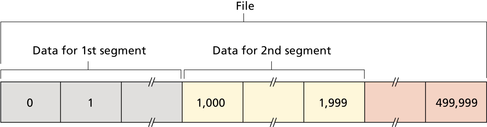

**确认号 = 期望收到对方的下一个字节的序号**（即已正确收到的最大字节序号 + 1）。由于 TCP 只确认到字节流中第一个缺失字节为止，TCP 提供的是 **累积确认（cumulative acknowledgment）**。例如 A 已收到 B 的 0～534 与 900～1324 字节（中间 535～899 缺失），A 仍然期望 535 号字节——A 发给 B 的确认号就是 535。

**乱序段怎么办？** RFC 未强制规定：① 立即丢弃乱序段（简化接收方）；② 缓存乱序字节等缺口补齐（更节省带宽，实践中采用）。连接两侧会 **随机选择初始序号（ISN）**，以降低「上一连接遗留的旧段被误认为本次连接的合法段」的风险。

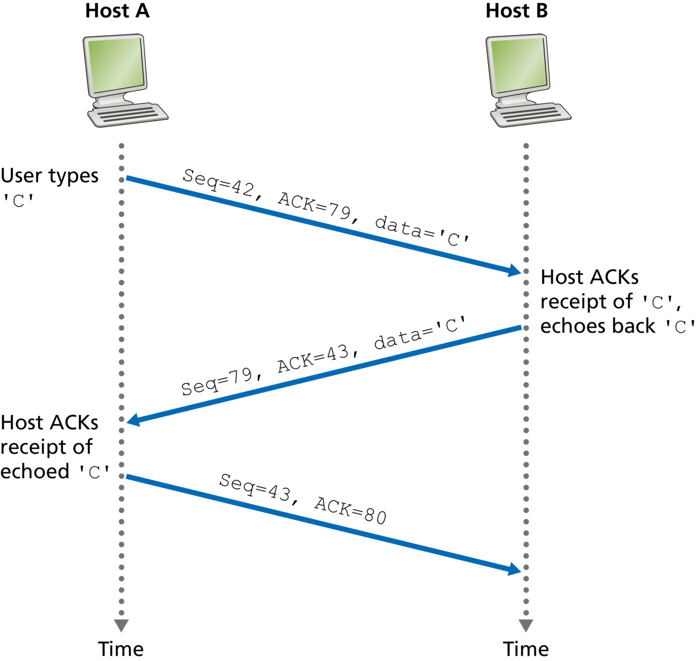


**Telnet 例（图 3.30）**：用户敲击字母 C，客户端发送序号 42 的数据段（携带 ASCII 'C'、确认号 79）；服务器回送双重目的的段——既确认（确认号 43）又回显字符（自己的序号 79）；客户端再回确认段（确认号 80、无数据）。注意：**回显字符的确认是「搭便车」（piggybacked）** 在服务器到客户端的数据段上的。

### 往返时间估计与超时

TCP 用超时/重传机制从丢失中恢复。关键是确定超时间隔：太小 → 不必要的重传；太大 → 丢失后迟迟不重传。RFC 6298 给出标准方法。

**SampleRTT**：报文段发出到收到其确认的时间。TCP **同一时刻只测一个 SampleRTT**（约每 RTT 更新一次），且 **绝不为重传的段测量 SampleRTT**（Karn 算法）。

**EstimatedRTT（指数加权移动平均，EWMA）**，α 推荐值 **1/8**：

$$ EstimatedRTT = (1 - \alpha) \cdot EstimatedRTT + \alpha \cdot SampleRTT $$

$$ EstimatedRTT = 0.875 \cdot EstimatedRTT + 0.125 \cdot SampleRTT $$

**DevRTT（RTT 偏差估计）**，β 推荐值 **1/4**：

$$ DevRTT = (1 - \beta) \cdot DevRTT + \beta \cdot |SampleRTT - EstimatedRTT| $$

**超时值 TimeoutInterval**：

$$ TimeoutInterval = EstimatedRTT + 4 \cdot DevRTT $$

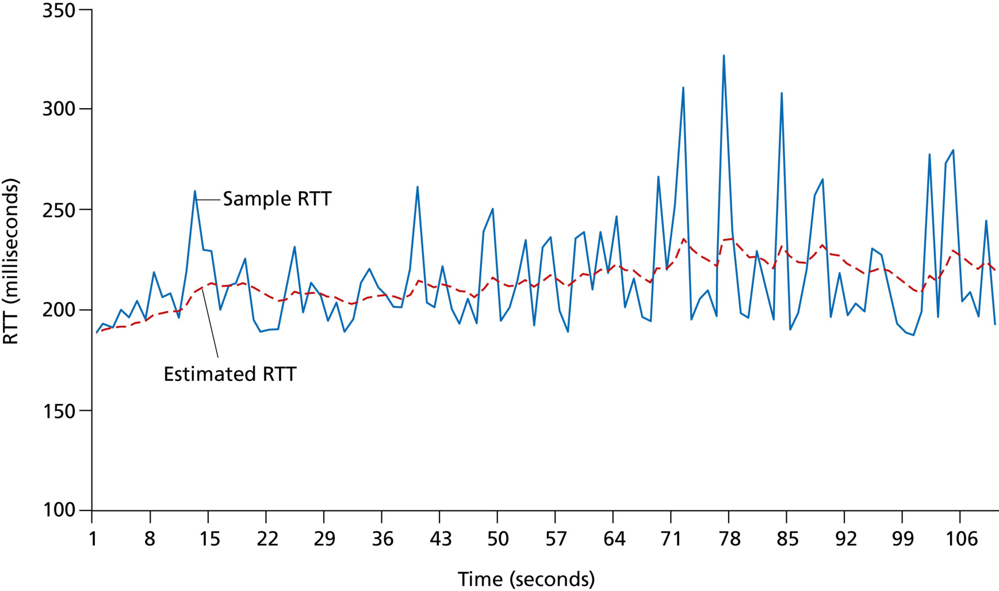

图 3.31 显示 SampleRTT 波动剧烈，EstimatedRTT 平滑得多，TimeoutInterval 始终保持在其上方。**补充规则**：初始 TimeoutInterval 建议 1 秒；发生超时时 TimeoutInterval **加倍**（避免对即将被确认的后续段过早超时）；一旦收到段并更新 EstimatedRTT，立即用公式重算超时值。

### 可靠数据传输

IP 服务不可靠：数据报可能溢出路由器缓冲区而丢失、可能乱序到达、比特可能损坏。TCP 在 IP 之上构建可靠字节流服务：**接收方从 TCP 接收缓冲区读出的字节流无损坏、无缺口、无重复、按序**。

TCP 采用 **单一重传定时器**（推荐做法），即使有多个未确认段。简化版 TCP 发送方（图 3.32）处理三类事件：

1. **从应用收到数据**：封装成段交给 IP。若定时器未在运行，启动定时器（可视为最老未确认段关联）。
2. **超时**：重传引起超时的段，重启定时器。
3. **收到 ACK**：若确认号 y > SendBase（SendBase = 最老未确认字节的序号），更新 SendBase；若仍有未确认段则重启定时器。**累积确认**：y 确认了所有 y 之前的字节。

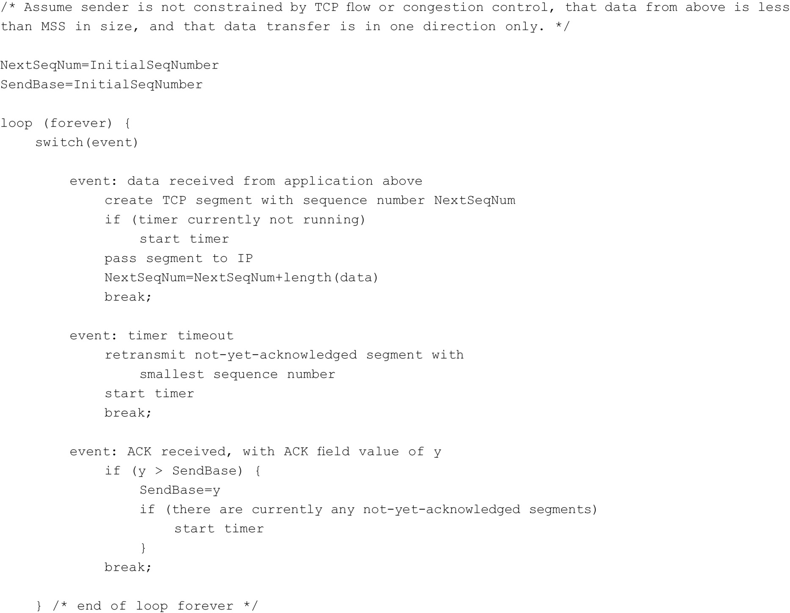

**几个经典场景：**

- **场景一（图 3.33）**：ACK 丢失 → 超时重传同一段；接收方凭序号识别重复数据并丢弃（与 rdt3.0 相同）。
- **场景二（图 3.34）**：连续发两个段，两个 ACK 都在超时前未到 → 超时只重传第一段并重启定时器；只要第二段的 ACK 在新超时前到达，第二段不会被重传。
- **场景三（图 3.35）**：第一段的 ACK 丢失，但超时前收到确认号 120 的 ACK（累积确认覆盖两段）→ 两个段都不重传。

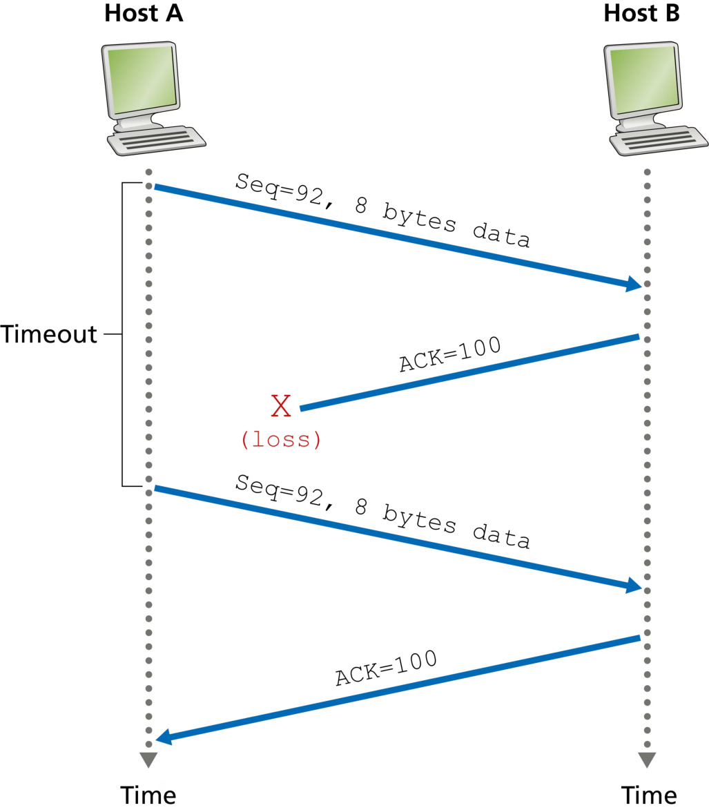


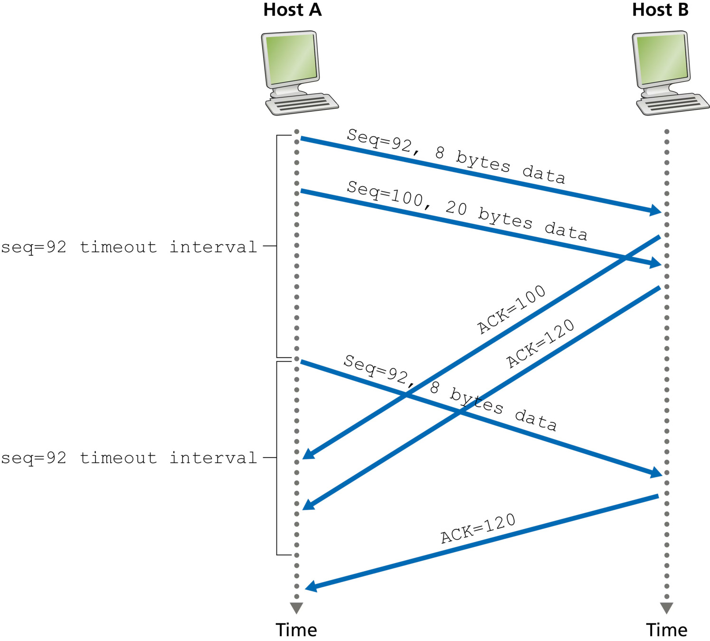

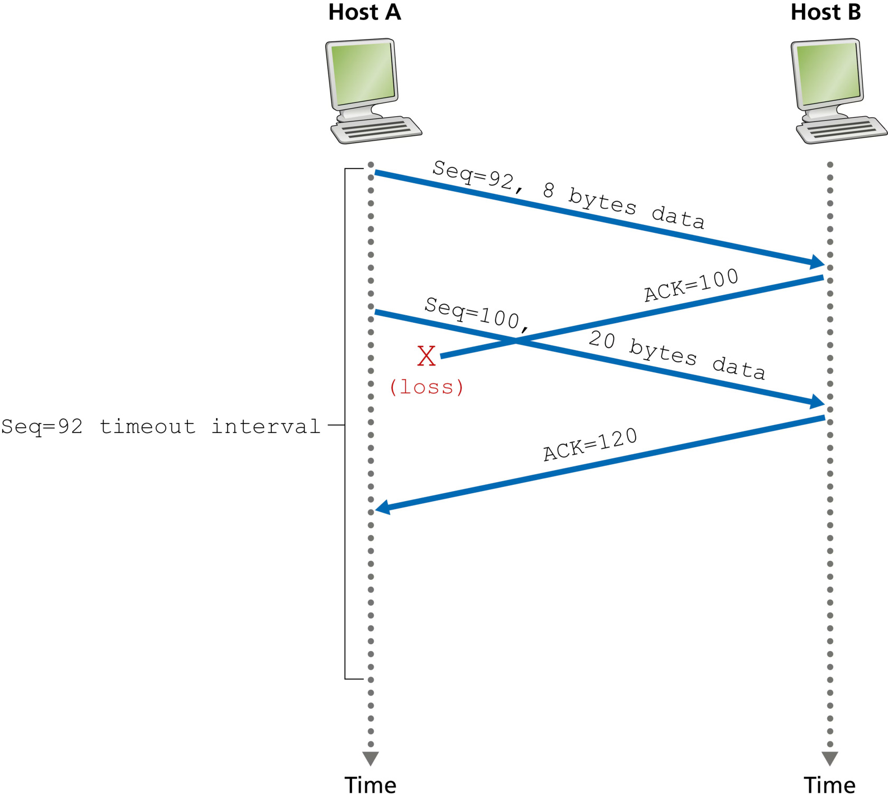


**快重传（fast retransmit）**：超时周期可能很长，等超时再重传会增加端到端时延。TCP 可用 **冗余 ACK（duplicate ACK）** 提前推断丢包：接收方收到序号大于期望按序序号的段时（检测到缺口），立即重发对最后一个按序字节的确认——这就是冗余 ACK。若发送方收到 **对同一数据的 3 个冗余 ACK**（即该数据被确认了 4 次：1 次原始 + 3 次冗余），判定「被确认 4 次的数据之后的段」丢失，**不等定时器超时立即重传**（RFC 5681）。

**TCP 是 GBN 还是 SR？** 都不是，是 **混合体**：

- 累积确认 + 只维护 SendBase 与 NextSeqNum → 像 **GBN**；
- 但多数实现 **缓存乱序段**（不丢弃）、且超时后 **至多重传一个段**（不像 GBN 重传整个窗口）→ 不像 GBN；
- 结合 SACK（选择确认，RFC 2018）后 → 非常像 **SR**。

### 流量控制

流量控制（flow control）**消除发送方淹没接收方缓冲区的可能**——它是 **速度匹配** 服务：把发送方的发送速率与接收应用的读取速率匹配起来。

**流量控制 vs 拥塞控制（408 高频辨析）**：两者都节流发送方，但 **原因完全不同**——流量控制是 **端到端** 问题（防止淹没接收方缓冲区），拥塞控制是 **全局** 问题（防止压垮网络）。可惜很多资料混用术语，读者务必区分。

TCP 通过 **接收窗口（receive window，rwnd）** 实现流量控制。设接收缓冲区大小为 RcvBuffer，定义：

- LastByteRead：应用已从缓冲区读走的最后字节编号；
- LastByteRcvd：从网络到达并放入缓冲区的最后字节编号。

缓冲区不能溢出，须满足 **LastByteRcvd - LastByteRead ≤ RcvBuffer**。接收窗口（空闲空间）：

$$ rwnd = RcvBuffer - (LastByteRcvd - LastByteRead) $$

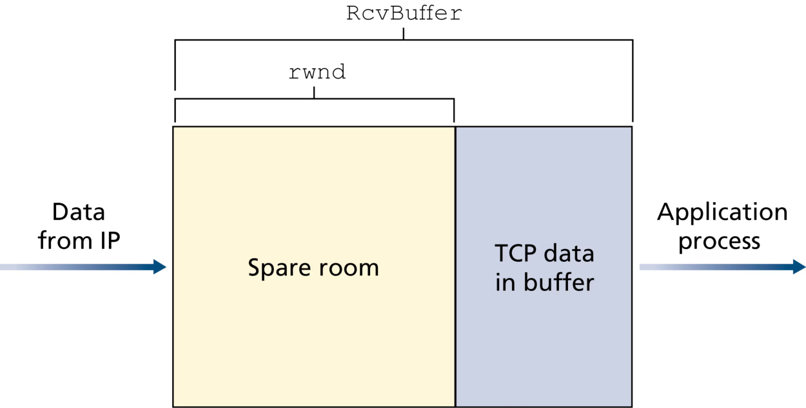

主机 B 在每个发给 A 的报文段中通告自己的 rwnd 当前值。主机 A 保持 **LastByteSent - LastByteAcked ≤ rwnd**（未确认数据量不超过 rwnd），即可保证不淹没 B 的缓冲区。**注意：A 的发送窗口由 rwnd 与 cwnd 共同决定（3.7.1 详述），实际未确认数据量 ≤ min{rwnd, cwnd}。**

**一个技术难题**：B 的缓冲区满、通告 rwnd = 0 后，若 B 无数据可发给 A，A 将永远不知道缓冲区何时空出。解法：**A 在 rwnd = 0 时仍持续发送含 1 字节数据的探测段**；这些段会被确认，最终 ACK 携带非零 rwnd，A 得以继续发送。

对比：**UDP 没有流量控制**——接收方进程读得慢时，有限缓冲区溢出、报文段被丢弃。

### 连接管理：三次握手与四次挥手

**核心概念⑤：TCP 连接管理（三次握手 / 四次挥手）** —— 用 SYN/SYNACK/ACK 三报文建立连接、用 FIN/ACK 四报文释放连接，配合 CLOSED/SYN_SENT/ESTABLISHED/FIN_WAIT/TIME_WAIT 等状态机。408 常考握手/挥手报文标志位与序号确认号、TIME_WAIT 时长（2MSL）、SYN flood 攻击（**高频考点**）。

**三次握手（three-way handshake）**：

1. **第一步**：客户端 TCP 发送一个特殊报文段——**SYN 段**：不含应用数据，**SYN 标志置 1**，并随机选择 **初始序号 client_isn** 填入序号字段。
2. **第二步**：服务器收到 SYN 段后，为该连接分配 TCP 缓冲区与变量，回送 **连接准许段（SYNACK 段）**：不含应用数据，**SYN = 1、ACK = 1**，确认号 = client_isn + 1，并选择自己的初始序号 server_isn。
3. **第三步**：客户端收到 SYNACK 后，回送第三个报文段：**ACK = 1**，确认号 = server_isn + 1，**可携带应用数据**。

此后双方即可发送携带数据的报文段（SYN 位清零）。注意：**SYN 段与 FIN 段即使不携带数据也要消耗一个序号**（408 常考！）。

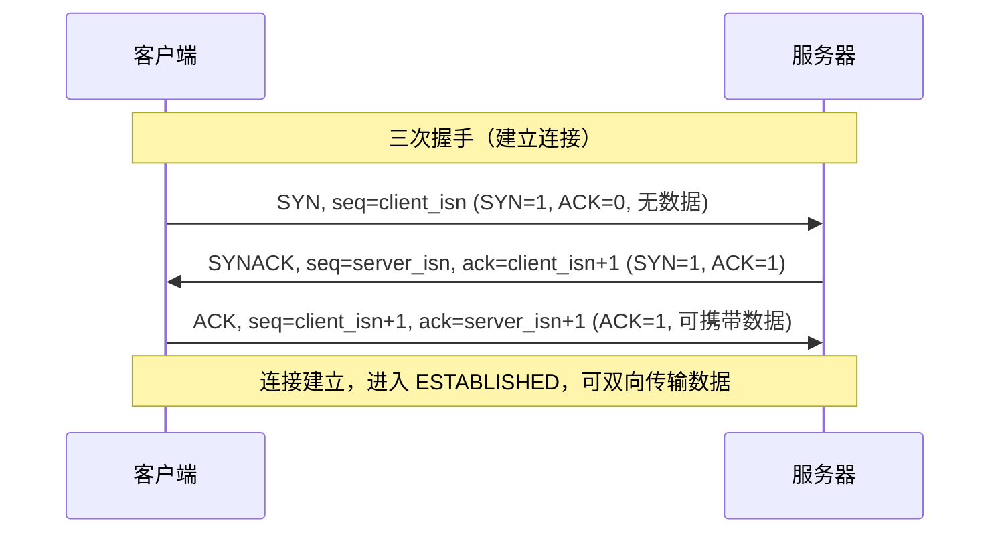
```mermaid
sequenceDiagram
    participant C as 客户端
    participant S as 服务器
    Note over C,S: 三次握手（建立连接）
    C->>S: SYN, seq=client_isn (SYN=1, ACK=0, 无数据)
    S->>C: SYNACK, seq=server_isn, ack=client_isn+1 (SYN=1, ACK=1)
    C->>S: ACK, seq=client_isn+1, ack=server_isn+1 (ACK=1, 可携带数据)
    Note over C,S: 连接建立，进入 ESTABLISHED，可双向传输数据
```

!!! tip "动手试试：交互式演示"

    配套交互 HTML：[TCP 三次握手交互演示](demos/TCP三次握手交互演示.html)（浏览器打开，可逐步观察 SYN/ACK 报文与状态转移）。


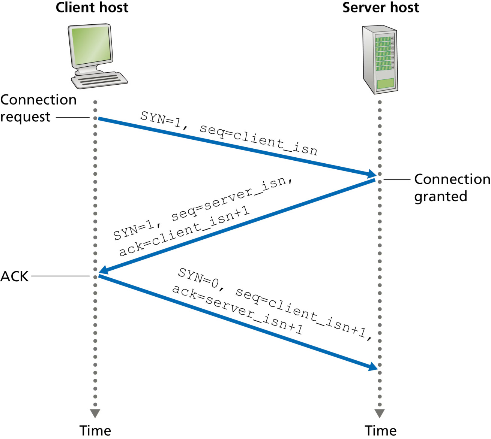

**为什么是三次而不是两次？** 两次握手无法防止「旧连接迟到的 SYN」被误当成新请求（服务器会误分配资源并进入连接状态）；且双方无法确认对方已就绪。三次握手让双方都确认「对方收到了自己的序号」——攀岩者与保护者的「准备就绪」确认协议与 TCP 完全同构。

**四次挥手（关闭连接）**：任何一方都可发起关闭。以客户端主动关闭为例：

1. **第一次挥手**：客户端发 **FIN 段**（FIN = 1），进入 FIN_WAIT_1 状态。
2. **第二次挥手**：服务器回 **ACK**，客户端进入 FIN_WAIT_2 状态（服务器 → 客户端的单向数据传输继续）。
3. **第三次挥手**：服务器发 **FIN 段**（FIN = 1），进入 LAST_ACK 状态（通常发生在服务器也发完数据后）。
4. **第四次挥手**：客户端回 **ACK**，进入 **TIME_WAIT** 状态；**TIME_WAIT 持续 2MSL（最长报文段寿命）后** 进入 CLOSED，资源（含端口号）释放。服务器收到 ACK 后直接进入 CLOSED。

**TIME_WAIT 为什么是 2MSL？** ① 保证最后一个 ACK 丢失时能重发（等待对方重发 FIN）；② 确保本连接的所有旧报文段在网络中消亡，不会污染后续使用相同端口的新连接。

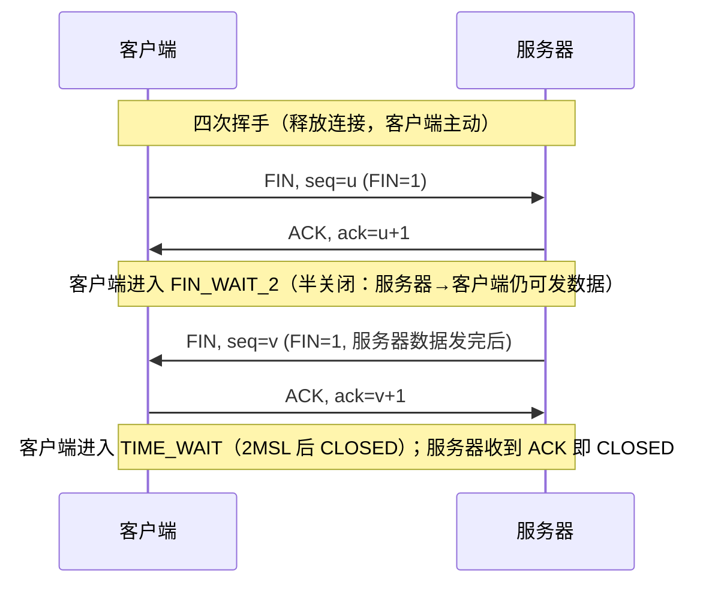
```mermaid
sequenceDiagram
    participant C as 客户端
    participant S as 服务器
    Note over C,S: 四次挥手（释放连接，客户端主动）
    C->>S: FIN, seq=u (FIN=1)
    S->>C: ACK, ack=u+1
    Note over C,S: 客户端进入 FIN_WAIT_2（半关闭：服务器→客户端仍可发数据）
    S->>C: FIN, seq=v (FIN=1, 服务器数据发完后)
    C->>S: ACK, ack=v+1
    Note over C,S: 客户端进入 TIME_WAIT（2MSL 后 CLOSED）；服务器收到 ACK 即 CLOSED
```

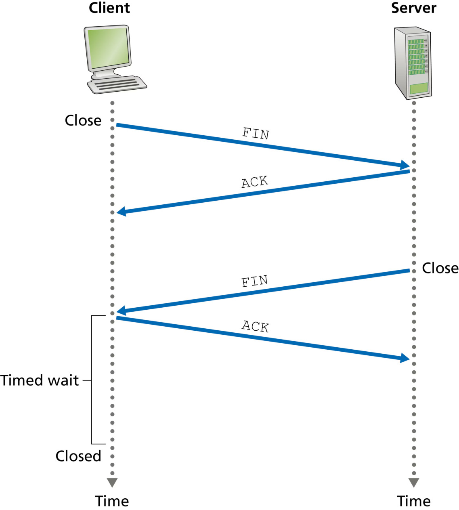


**TCP 状态转换（408 常考）**：

- **客户端**（图 3.39）：CLOSED →（发 SYN）→ SYN_SENT →（收 SYNACK、发 ACK）→ ESTABLISHED →（发 FIN）→ FIN_WAIT_1 →（收 ACK）→ FIN_WAIT_2 →（收 FIN、发 ACK）→ TIME_WAIT →（2MSL 后）→ CLOSED。
- **服务器**（图 3.40）：CLOSED → LISTEN →（收 SYN、发 SYNACK）→ SYN_RCVD →（收 ACK）→ ESTABLISHED →（收 FIN、发 ACK）→ CLOSE_WAIT →（发 FIN）→ LAST_ACK →（收 ACK）→ CLOSED。

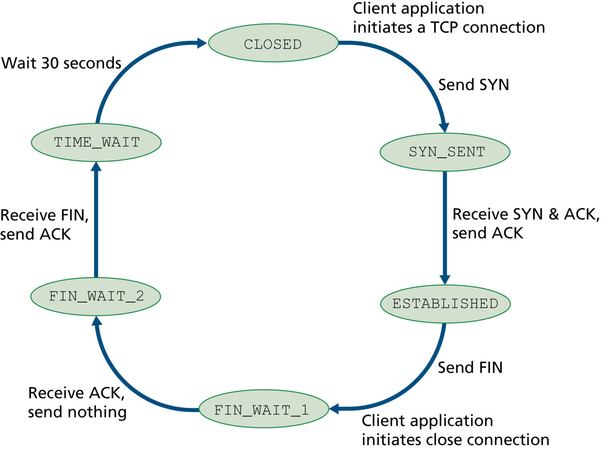

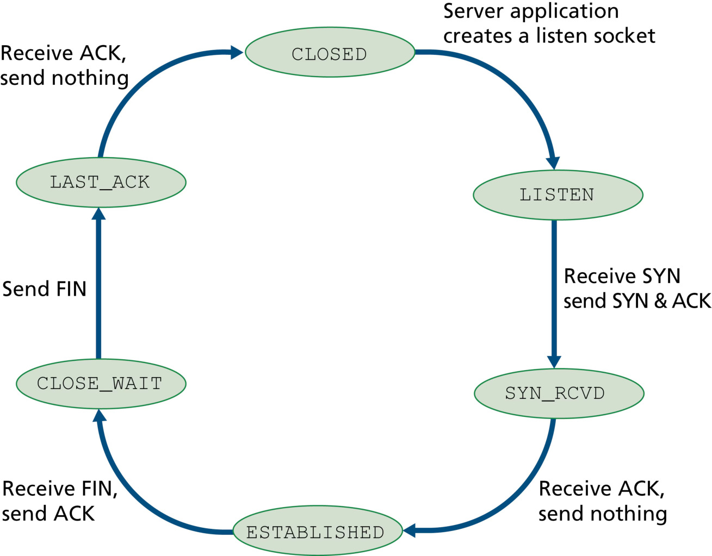


**RST 重置**：若主机收到一个不匹配任何活动 socket 的 TCP 段（如目的端口未开放），会回送 **RST = 1 的重置段**（告知「我没有这个 socket，请勿重发」）；UDP 场景下则回送 ICMP 报文。

**安全：SYN flood 攻击。** 三次握手的 **第二步** 中，服务器收到 SYN 就要分配缓冲区与变量、回 SYNACK、等待第三步 ACK——若客户端不回 ACK，服务器最终（常在一分钟以上）才终止这个 **半开连接** 并回收资源。**SYN flood 攻击** 正是利用这一点：攻击者发送海量 SYN 段而不完成第三步握手，耗尽服务器的连接资源，拒绝合法客户端的服务。对策：**SYN cookie（RFC 4987）**——服务器收到 SYN 时不分配任何资源，仅用「源/目的 IP、端口 + 服务器机密数」经哈希函数算出特殊初始序号（cookie）随 SYNACK 发出；合法客户端回传的 ACK 中确认号必为 cookie+1，服务器据此验证合法性，只有验证通过才建立完整连接。

!!! example "例题 4：TCP 三次握手序号分析（真题 2019#52 改编）"

    主机甲主动向主机乙发起一个 TCP 连接。甲选择的初始序号 client_isn = 2018，乙选择的初始序号 server_isn = 2046。

    （1）写出三次握手各报文段的标志位与序号/确认号字段值。

    （2）第三次握手报文段的确认号是多少？

    （3）连接建立后，甲发送的第一个数据字节的序号是多少？为什么？

    ??? answer "查看答案"
        **（1）三次握手各段：**

        | 握手 | 标志位 | 序号 seq | 确认号 ack | 载荷 |
        |:---|:---|:---|:---|:---|
        | 第一次（甲→乙） | SYN=1，ACK=0 | client_isn = **2018** | 无效（不携带确认） | 无 |
        | 第二次（乙→甲） | SYN=1，ACK=1 | server_isn = **2046** | client_isn+1 = **2019** | 无 |
        | 第三次（甲→乙） | SYN=0，ACK=1 | client_isn+1 = **2019** | server_isn+1 = **2047** | 可携带数据 |

        **（2）第三次握手确认号 = server_isn + 1 = 2047**（真题 2019#52 的答案为 D，即 2047）。确认号表示「期望收到对方的下一个字节」，第二次握手乙发出序号 2046（消耗一个序号），故甲确认 2047。

        **（3）** 甲发送的第一个数据字节序号为 **2019**。因为 **SYN 段即使不携带数据也要消耗一个序号**——甲的初始序号 2018 已被 SYN 段消耗，数据流从 2019 号字节开始。同理，FIN 段也消耗一个序号（断开连接计算数据量时常考）。

    ??? success "评分标准"

        - 三个报文段标志位正确（3 分）
        - 三个报文段的 seq/ack 全部正确（6 分）
        - 第三次握手确认号 2047（2 分）
        - 数据首字节序号 2019 及「SYN 消耗序号」理由（3 分）

---

## 3.6 拥塞控制原理

前面几节讲的可靠传输，是把丢包当成「待处理的症状」——重传处理的是 **具体某条连接丢了一个报文段**，但没有治疗 **网络拥塞的病因**：太多源试图以过高的速率发送数据。要治本，就需要在拥塞面前 **节流发送方**——这就是拥塞控制（congestion control）。

**核心概念④：拥塞控制（AIMD）** —— 拥塞控制是 **全局性** 问题（涉及所有主机、路由器与降低网络性能的所有因素），通过调节各连接发送速率，使 **聚合发送速率接近但不超过瓶颈链路容量**。TCP 经典拥塞控制采用 **加性增、乘性减（AIMD）**：每 RTT 加 1 MSS，丢包时窗口减半。这是 408 大题第一高频（**高频考点**：拥塞窗口动态变化、快重传快恢复、平均发送速率，2023#47 等）。

### 拥塞的成因与代价

**场景 1：两个发送方、一台无限缓冲路由器的共享链路（图 3.41）。** 主机 A 与 B 各以速率 λ_in 向共享输出链路（容量 R）发送，路由器有 **无限** 缓冲。当双方发送速率之和 < R 时，吞吐量 = 发送速率；超过 R 后，各自吞吐量 **封顶为 R/2**——不管发送多快，吞吐量都不会更高（图 3.42 左图）。同时，随着发送速率逼近链路容量，**平均排队时延无限增大**（图 3.42 右图）。**代价之一：接近容量时，排队时延急剧增大。**

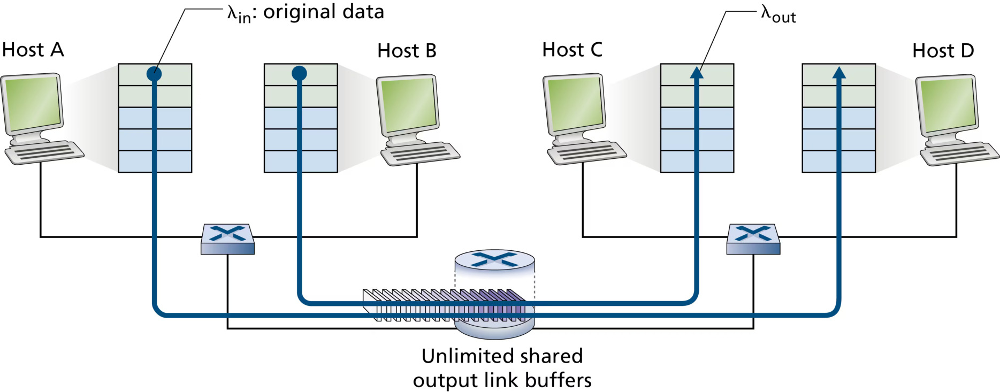

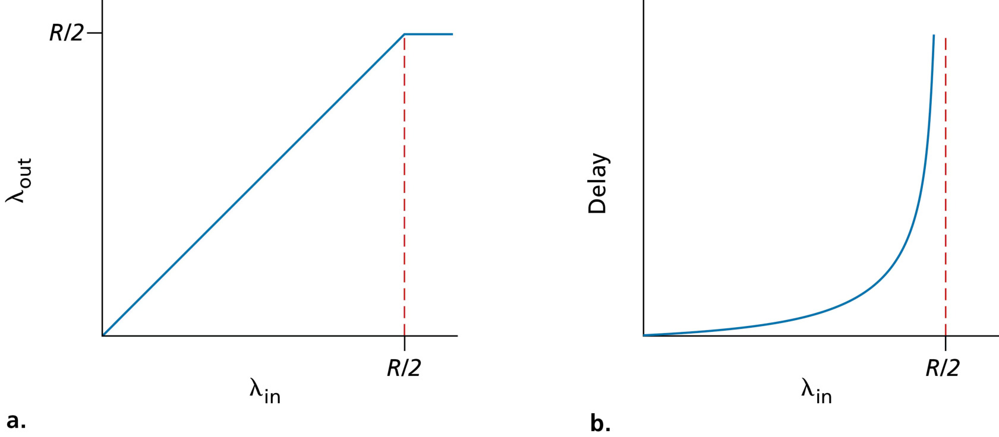

**场景 2：两个发送方、有限缓冲路由器（含重传）（图 3.43）。** 路由器缓冲 **有限**，缓冲满时丢包；且每条连接 **可靠**（丢包就重传）。定义两个速率：λ_in（应用注入原始数据的速率，即本征速率）与 λ_in'（传输层实际注入网络的速率 = 原始数据 + 重传，称为 **供给负载 offered load**）。三种重传情形（图 3.44）：

- (a) 发送方「神预知」缓冲是否空闲：无丢包，吞吐量 = λ_in，理想但不可能。
- (b) 只确认丢失才重传：供给负载为 R/2 时，吞吐量只有 R/4——**一半的传输是重传**。**代价之二：重传消耗带宽，应用到应用的吞吐量下降。**
- (c) 过早超时 + 重传（被延迟但未丢的包也被重发）：一个分组平均被转发两次，吞吐量峰值进一步塌缩到 R/3。**代价之三：不必要的重传浪费路由器链路带宽。**

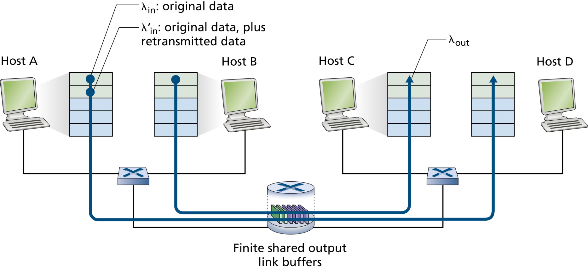

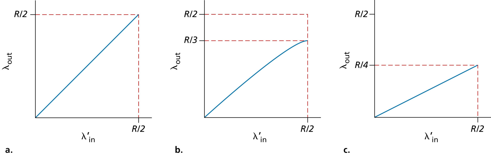


**场景 3：四个发送方、多跳路径（图 3.45）。** 四条连接经两跳重叠路径传输。A→C 与 D→B 在路由器 1 竞争，A→C 与 B→D 在路由器 2 竞争。当供给负载极大时，路由器 1 的缓冲总被 B→D 流量占满，A→C 流量几乎无法通过，**A→C 吞吐量趋于 0**——这就是 **拥塞崩溃（congestion collapse）**（图 3.46）。**代价之四：分组在第二跳被丢弃时，第一跳把它转发到第二跳的传输容量全部白费**——丢弃越深，浪费越多。

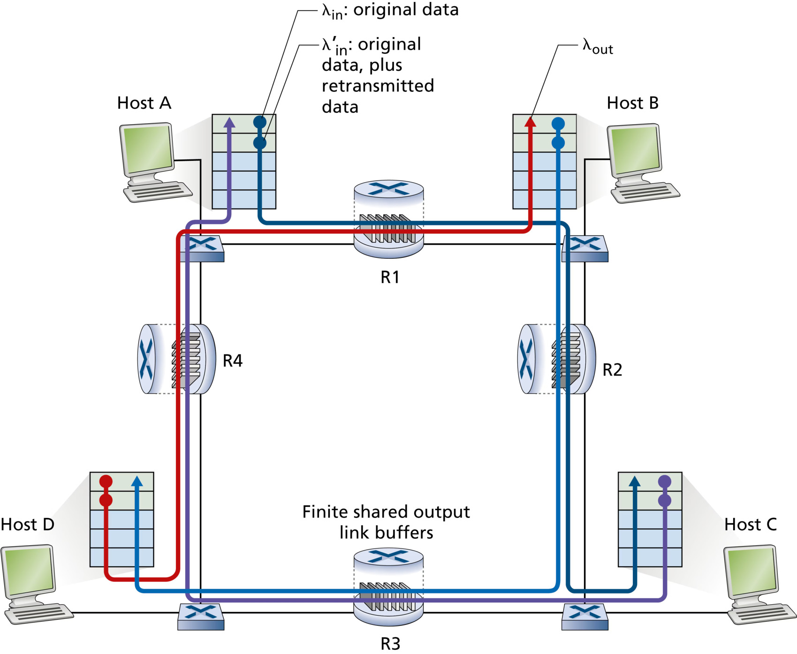


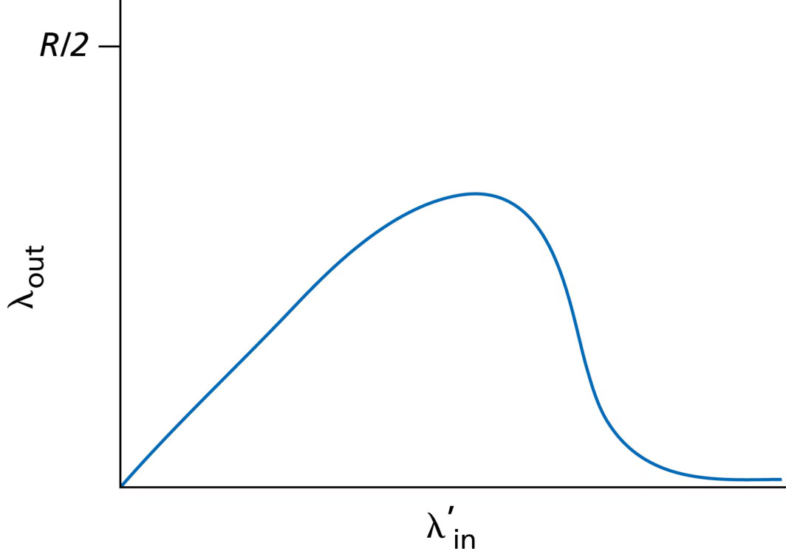


**小结：拥塞的四大代价** ① 分组到达速率接近链路容量时排队时延急剧增大；② 发送方必须重传以补偿缓冲溢出导致的丢包；③ 大时延下的不必要重传浪费链路带宽；④ 沿路径被丢弃的分组，其上游链路已白费传输容量，极端情形导致拥塞崩溃。

**瓶颈链路（bottleneck link）**：一条连接的瓶颈链路是指——沿端到端路径上，若经过它的发送方缓慢增加发送速率，它将是 **第一条出现拥塞丢失的链路**（通常假设一条连接至多一个瓶颈链路）。当瓶颈链路处于拥塞状态（到达速率接近容量 R）时，连接再提速也不会增加任何吞吐量；若容量被各连接 **公平共享**，每条连接分得 R/N。拥塞控制的目标就是：**让各连接的聚合发送速率接近但不超过瓶颈链路容量**——低于则链路闲置，高于则承受上述所有拥塞恶果。

### 端到端拥塞控制 vs 网络辅助拥塞控制

按网络层是否为传输层提供显式帮助，拥塞控制分两大类：

- **端到端拥塞控制（end-to-end congestion control）**：网络层 **不提供任何显式支持**，端系统只能根据 **观察到的网络行为**（丢包、时延）推断拥塞。经典 TCP 正是如此——IP 层不要求向主机反馈拥塞状态。经典 TCP 把 **超时或收到 3 个冗余 ACK（丢失事件）** 视为拥塞信号，据此减小窗口。
- **网络辅助拥塞控制（network-assisted congestion control）**：路由器向发送方/接收方提供 **显式反馈**。最简单的反馈是 **一个指示链路拥塞的比特**（早期 IBM SNA、DEC DECnet、ATM）；更复杂的如 ATM ABR 让路由器告知发送方它可支持的最大发送速率。

网络辅助反馈有两条通路（图 3.48）：① **直接反馈**：路由器向发送方发送阻塞分组（choke packet，「我拥塞了！」）；② **标记反馈**（更常见）：路由器在从发送方到接收方的分组中 **标记/更新某字段**，接收方收到标记后 **再通知发送方**——这条路需要一整个 RTT。ECN 就是标记反馈的现代实现（3.7.3）。


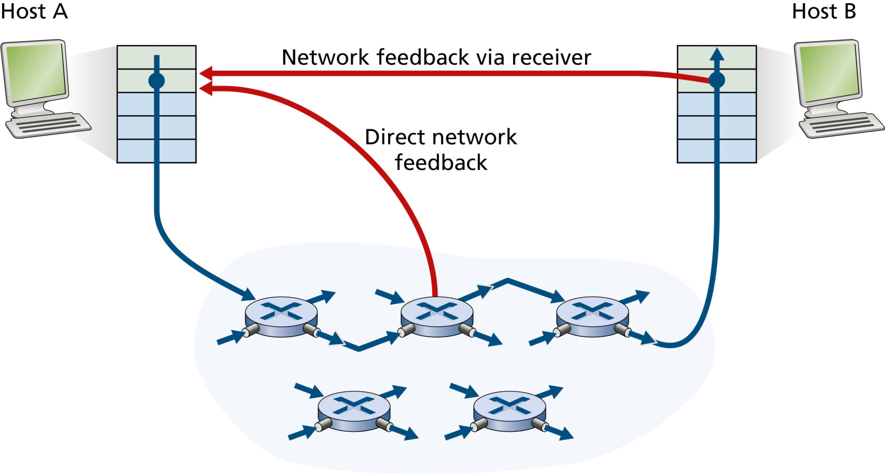

---

## 3.7 TCP 拥塞控制

**核心概念④（续）：TCP 拥塞控制（AIMD 的完整实现）** —— TCP 发送方维护 **拥塞窗口 cwnd**，限制未确认数据量 ≤ min{cwnd, rwnd}；无拥塞（收到 ACK）时 **加性增**（慢开始指数增、拥塞避免每 RTT +1 MSS），检测到拥塞（超时或 3 冗余 ACK）时 **乘性减**。408 大题必考：拥塞窗口演变追踪、阈值更新、快重传快恢复、平均速率（**高频考点**，2023#47 等历年大题）。

经典 TCP（RFC 2581/5681）采用端到端拥塞控制。三个核心问题：**如何限速？如何感知拥塞？如何调整速率？**

**限速**：发送方维护拥塞窗口 cwnd，约束：

$$ LastByteSent - LastByteAcked \le \min\{cwnd, rwnd\} $$

为聚焦拥塞控制，通常假设接收缓冲区足够大、可忽略 rwnd 约束，未确认数据量只由 cwnd 限制。若丢失与传输时延可忽略，则每个 RTT 开始可发送 cwnd 字节、RTT 末收到确认——**发送速率 ≈ cwnd/RTT**。调节 cwnd 即调节发送速率。

**感知拥塞**：定义 **丢失事件（loss event）= 超时 或 收到 3 个冗余 ACK**。路径拥塞过度时，某路由器缓冲溢出、数据报被丢弃，发送方即观察到丢失事件——把它当作拥塞信号。无丢失时，到达的 ACK 是「一切安好」的信号，用来 **增大** cwnd。注意：**TCP 用 ACK 的到达来「时钟」驱动窗口增长，称为自同步（self-clocking）**——ACK 到达快则窗口增得快。

**调整原则（经典 TCP 三大指导原则）：**

1. **丢段 ⇒ 拥塞 ⇒ 降低发送速率。**
2. **收到 ACK ⇒ 网络在交付 ⇒ 可提高发送速率。**
3. **带宽探测（bandwidth probing）**：收到 ACK 就增、遇丢失就减——像不断索要糖果的孩子，被拒绝就退一步，过一会儿再要。TCP 发送方异步地基于本地信息行动，网络不显式告知拥塞状态。

算法三大组件：**慢开始（slow start）、拥塞避免（congestion avoidance）、快恢复（fast recovery）**。前两者为强制组件（区别在 cwnd 如何随 ACK 增长），快恢复为推荐组件。

### 慢开始（Slow Start）

连接刚建立时，cwnd 通常初始化为 **1 个 MSS**（RFC 3390），初始速率约 MSS/RTT。慢开始的目标是 **快速找到可用带宽**：**每收到一个对新报文段的确认，cwnd 增加 1 个 MSS**。由于一个 RTT 内所有段的 ACK 都会把窗口翻倍，**每经过一个 RTT，发送速率翻倍**——指数增长（1 → 2 → 4 → 8……）。「慢」是指一开始注入的分组少（探测），而非增长慢。

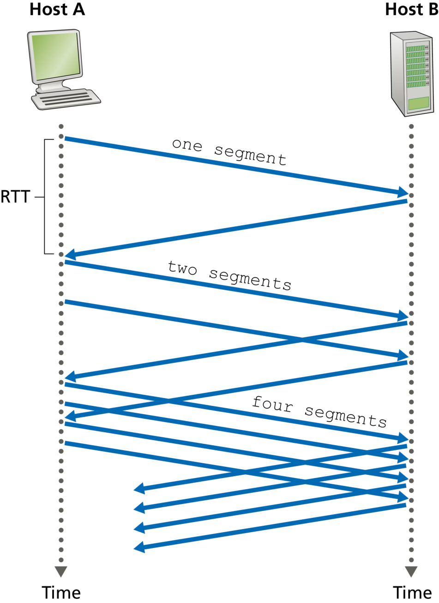

!!! tip "动手试试：交互式演示"

    配套交互 HTML：[慢开始与拥塞避免算法交互演示](demos/慢开始和拥塞避免算法交互演示.html)、[GBN 协议工作原理演示](demos/GBN协议工作原理演示.html)、[SR 协议选择重传交互演示](demos/SR协议选择重传交互演示.html)（浏览器打开，可视化窗口滑动与重传行为）。

**慢开始何时结束？** 三种情况：① **超时（丢失事件）**：cwnd 置 1，重新慢开始，同时设置 **慢开始阈值 ssthresh = cwnd/2**（检测到拥塞时窗口值的一半）；② **cwnd 达到 ssthresh**：此时继续翻倍太鲁莽，转入拥塞避免；③ **收到 3 个冗余 ACK**：执行快重传并进入快恢复（见下文）。**ssthresh 是慢开始与拥塞避免的分界线**：cwnd < ssthresh 用慢开始，cwnd > ssthresh 用拥塞避免，cwnd = ssthresh 时两种皆可（常规取拥塞避免）。

### 拥塞避免（Congestion Avoidance）

进入拥塞避免时，cwnd 约为上次拥塞时的一半——**拥塞可能就在眼前**！因此不再翻倍，改为 **每 RTT 增加 1 个 MSS**（线性增长，「加法增大」）。实现方式：每收到一个新 ACK，cwnd 增加 **MSS/cwnd** 字节——一个 RTT 内收到 cwnd/MSS 个 ACK，正好累计增加 1 个 MSS。

**拥塞避免阶段遇到丢失事件**：

- **超时**：与慢开始相同——cwnd = 1 MSS，ssthresh = 丢失时 cwnd/2，重入慢开始。
- **收到 3 个冗余 ACK**：网络仍在交付（冗余 ACK 说明后续段陆续到达），反应比超时温和——**cwnd 减半（+3 MSS 补偿已收的冗余 ACK 段），ssthresh = 减半前的 cwnd/2**，并进入快恢复。

### 快重传与快恢复

**快重传（fast retransmit）**：发送方收到 **3 个冗余 ACK**（同一数据被确认 4 次：1 次原始 + 3 次冗余）时，不等定时器超时立即重传丢失段（3.5.4 已述）。

**快恢复（fast recovery）**（Reno 推荐实现）：收到 3 个冗余 ACK 后——

1. **ssthresh = cwnd/2**（当前窗口的一半，不能小于 2 MSS）；
2. **cwnd = ssthresh**（注意：不是置 1！）；
3. 之后执行拥塞避免（每 RTT +1 MSS，加法增大）。

**为什么不是慢开始？** 收到冗余 ACK 说明网络仍在交付后续段（未严重拥塞），没必要把窗口砍回 1。快恢复 **跳过了从 1 开始的慢开始过程**，故称「快」恢复。**口诀：超时 = 狠惩罚（cwnd=1，慢开始）；3 冗余 ACK = 轻惩罚（cwnd 减半，快恢复）。**

**TCP Tahoe vs TCP Reno（408 常考对比）**：

| 版本 | 超时事件 | 3 冗余 ACK 事件 |
|:---|:---|:---|
| **Tahoe**（早期） | cwnd = 1，慢开始 | **也**把 cwnd 置 1，慢开始（不做快恢复） |
| **Reno**（后续） | cwnd = 1，慢开始 | **cwnd 减半**（ssthresh = cwnd/2，cwnd = ssthresh），快恢复 + 拥塞避免 |


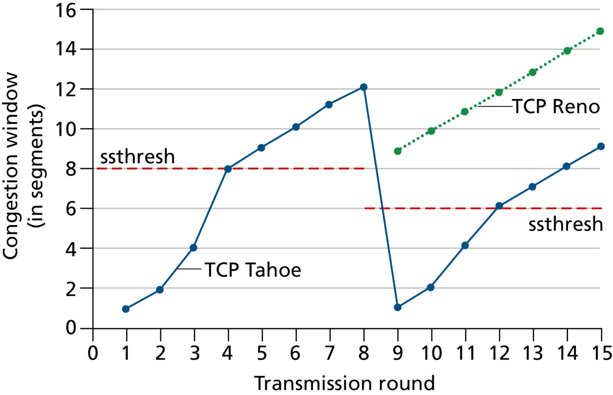


图 3.50 中：前 8 个传输轮次 Tahoe 与 Reno 动作相同——慢开始指数增长，第 4 轮撞到 ssthresh，随后线性增长到第 14 轮后发生 3 冗余 ACK 事件（cwnd = 24 MSS）。此后分道扬镳：**Reno** 把 cwnd 设为 12（24/2）然后线性增长；**Tahoe** 把 cwnd 置 1 重新慢开始，指数增长到 ssthresh 再线性增长。

**AIMD 锯齿**：忽略初始慢开始与超时情形，假设丢失都由 3 冗余 ACK 指示，则 TCP 拥塞控制 = **每 RTT 线性加 1 MSS（加法增大）+ 丢包时 cwnd 减半（乘法减小）**——即 **AIMD（Additive-Increase, Multiplicative-Decrease）**，产生图 3.51 的 **锯齿（sawtooth）** 曲线。TCP 通过「增到丢失、减半、再增」循环来 **探测** 当前可用的带宽。

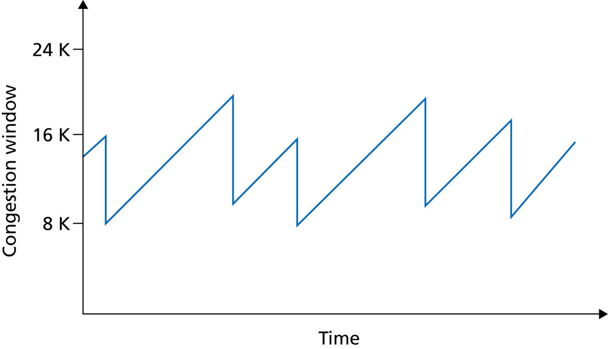


**Reno 稳态平均吞吐量的宏观模型（408 可考）**：丢包发生时的窗口为 W（对应速率 W/RTT），减半后从 W/2 开始线性增回 W，周期 T = (W/2)·RTT。每个周期传 (W/2 + W)/2 个「窗口」的字节，故：

$$ \text{平均吞吐量} \approx \frac{0.75 \cdot W}{RTT} $$

（更精细的丢包率-带宽关系由 Mathis 模型给出。）

!!! example "例题 5：拥塞窗口演变表（慢开始 → 拥塞避免 → 超时 → 恢复）"

    一条 TCP 连接初始 ssthresh = 16 MSS，cwnd = 1 MSS，之后未发生丢失，每轮次按算法增长。

    （1）填写下表，标注各轮次所处阶段：

    | 传输轮次 | 1 | 2 | 3 | 4 | 5 | 6 | 7 | 8 | 9 | 10 | 11 | 12 | 13 |
    |:---|:---|:---|:---|:---|:---|:---|:---|:---|:---|:---|:---|:---|:---|
    | cwnd（MSS） | 2 | ? | ? | ? | ? | ? | ? | ? | ? | ? | ? | ? | ? |

    （2）设第 12 轮次出现 **超时**（此时 cwnd = 24 MSS）：求新的 ssthresh 与 cwnd，并说明随后如何演变。

    （3）若第 12 轮次收到的是 **3 个冗余 ACK**（而非超时），行为有何不同？

    ??? answer "查看答案"
        **（1）演变表（慢开始：每轮翻倍；撞到 ssthresh=16 后转拥塞避免：每轮 +1）：**

        | 传输轮次 | 1 | 2 | 3 | 4 | 5 | 6 | 7 | 8 | 9 | 10 | 11 | 12 | 13 |
        |:---|:---|:---|:---|:---|:---|:---|:---|:---|:---|:---|:---|:---|:---|
        | cwnd（MSS） | 2 | 4 | 8 | 16 | 17 | 18 | 19 | 20 | 21 | 22 | 23 | 24 | 25 |
        | 阶段 | 慢开始 | 慢开始 | 慢开始 | 撞到阈值→拥塞避免 | 拥塞避免 | 拥塞避免 | 拥塞避免 | 拥塞避免 | 拥塞避免 | 拥塞避免 | 拥塞避免 | 拥塞避免 | 拥塞避免 |

        轮次 1-3 慢开始（1→2→4→8，每轮翻倍）；轮次 4 到达 ssthresh=16（2³×2=16），此后转拥塞避免，每轮 +1（17、18、19……），故轮次 12 时 cwnd = 24。

        **（2）超时处理：** 超时时 cwnd = 24 MSS，则：

        - **ssthresh = 24/2 = 12 MSS**（乘法减小）；
        - **cwnd 置为 1 MSS**，重新执行慢开始（指数增长）：轮次 13 → 2、轮次 14 → 4、轮次 15 → 8、轮次 16 → **12**（注意：当 2×8=16 > ssthresh=12 时，只能涨到 ssthresh=12，**不能超过阈值**！）→ 此后转拥塞避免线性增长：13 → 14 → 15 → 16……

        记忆要点：**慢开始阶段若 2×cwnd > ssthresh，则下一轮 cwnd = ssthresh 而非 2×cwnd。**

        **（3）3 冗余 ACK（快重传 + 快恢复）：** ssthresh 同样 = 24/2 = 12 MSS，但 **cwnd = ssthresh = 12 MSS（不减到 1）**，直接进入拥塞避免线性增长（轮次 13 起：13、14、15……）。与超时相比少了一次从 1 开始的慢开始，恢复更快——因为冗余 ACK 表明网络仍在交付，拥塞程度较轻。

    ??? success "评分标准"

        - 慢开始阶段翻倍正确（1-3 轮：2/4/8）（3 分）
        - 撞到阈值转拥塞避免、逐轮 +1（4 分）
        - 超时：ssthresh=12、cwnd=1、慢开始到 12 截断（4 分）
        - 3 冗余 ACK：cwnd=ssthresh=12、快恢复（3 分）
        - 慢开始阶段 2×cwnd > ssthresh 时取 ssthresh（2 分）

### 新 TCP 变体：CUBIC、Vegas 与 BBR

经典 TCP 用「丢失即拥塞」推断拥塞，占据 Web 服务器主流多年；但近年测量显示，最流行的站点大多已改用新变体（2024 年 BBR 使用量已超过其他所有变体之和）。

- **TCP CUBIC（RFC 8312）**：改进 **拥塞避免阶段** 的增长方式。Reno 减半后线性爬升太谨慎——如果拥塞链路状态变化不大，不如快速回到丢包前的速率、再谨慎探测。CUBIC 用 **三次函数** 控制窗口增长：设 W_max 为上次丢失时的窗口、T 为距上次丢失的时间，窗口增量正比于 (T-K)³。**远离 W_max 时增长快**（快速接近丢包前速率），**接近 W_max 时增长慢**（谨慎探测新带宽）。相比 Reno，CUBIC 在相同丢包率下获得更高平均吞吐（图 3.52）。
- **TCP Vegas**：**基于时延** 的拥塞控制。测量所有确认段的 RTT，取最小值（无拥塞时）为基准；若实测吞吐量接近「无拥塞吞吐 cwnd/RTT_min」则增窗，明显低于则减窗——**在丢包发生之前就主动检测拥塞**。
- **BBR（Bottleneck Bandwidth and Round-trip propagation time）**：直接测量 **瓶颈带宽（BtlBw）** 与 **往返传播时延（RTprop）**，目标是「**把管道刚好填满，但不多填**」。把在途数据量（inflight）控制在 BtlBw × RTprop（带宽时延积）附近：低于它则管道闲置、吞吐不足；高于它则瓶颈排队、时延上升（图 3.53）。BBR 分 **加速（probe up）/巡航（cruise）/减速（probe down）** 三阶段循环探测。

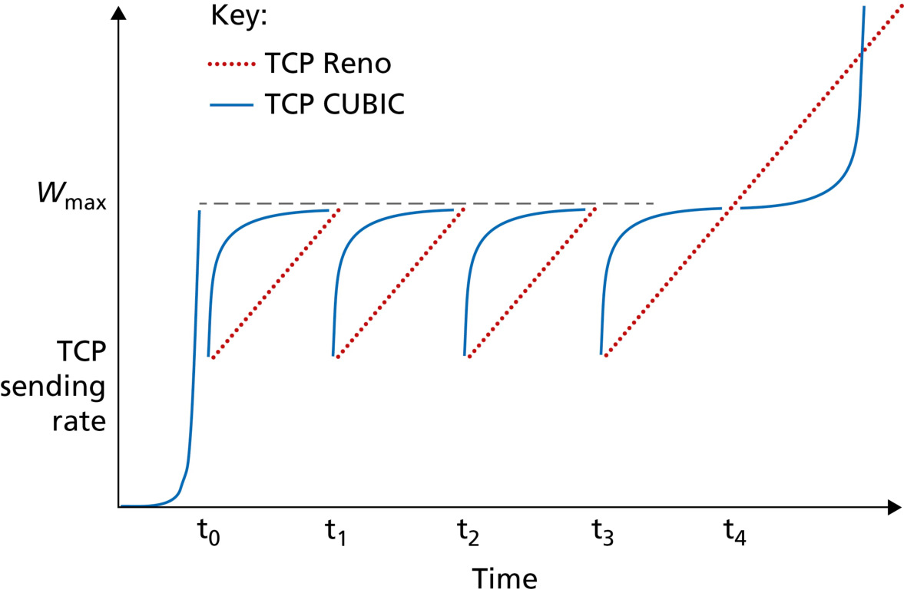

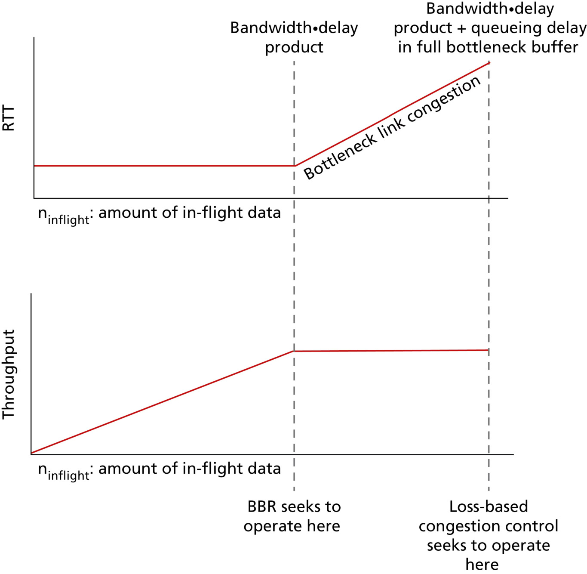


### ECN：显式拥塞通知

**ECN（Explicit Congestion Notification，RFC 3168）** 是 **网络辅助拥塞控制** 的现代实现，让网络 **显式** 把拥塞信号传给发送方（而非依赖丢包推断）：

1. **网络层**：IP 数据报首部的服务类型（ToS）字段中两个 ECN 比特，四种取值：路由器用其一标记「本路由器正经历拥塞」（拥塞经历 CE）；发送主机用另一值通告「发送方与接收方支持 ECN」。
2. **接收方**：收到 CE 标记的数据报后，在回送的 TCP ACK 段中置 **ECE（ECN-Echo）位**，把拥塞指示回显给发送方。
3. **发送方**：收到带 ECE 的 ACK 后，**像快重传那样把 cwnd 减半**，并在下一个发送段中置 **CWR（Congestion Window Reduced）位**，告知接收方已减窗。

ECN 的优势：**在丢包发生之前** 就通知拥塞，减少不必要的丢包与重传（图 3.54）。数据中心场景的 DCTCP 也利用 ECN 实现精细的队列控制。


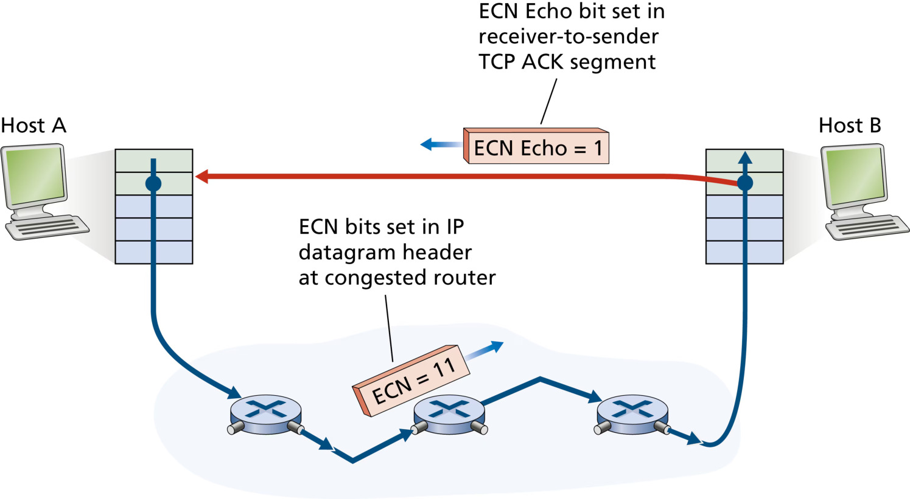

### 公平性（Fairness）

设 K 条 TCP 连接共享一条瓶颈链路（容量 R，各连接其他链路都不拥塞），且每条都在传大文件、链路无 UDP 流量。若每条连接的平均传输速率 ≈ **R/K**，则称该拥塞控制机制是 **公平的**。经典 TCP 的 AIMD 能否收敛到公平？

**两连接收敛分析（图 3.55、3.56）**：设两连接同 MSS、同 RTT，忽略慢开始，全程拥塞避免（AIMD）。在吞吐量平面上（连接 1 吞吐为横轴、连接 2 为纵轴）：若当前状态在公平线（x=y）下方（如图中点 A，总吞吐 < R），无丢失，两连接都线性增窗——状态沿 45° 线向右上移动；总吞吐超过 R 时发生丢失（点 B），两连接各减半窗口（点 C，沿指向原点的方向减半）；再线性增（C→D）再减半……反复振荡后，**状态收敛到公平线附近**（公平分配线 x=y 与满利用率线 x+y=R 的交点附近）。**结论：AIMD 使竞争连接的吞吐量收敛到公平共享，且与起始点无关。**

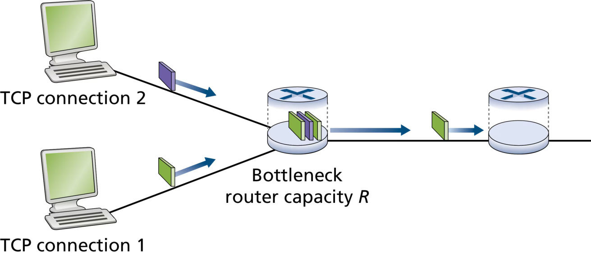


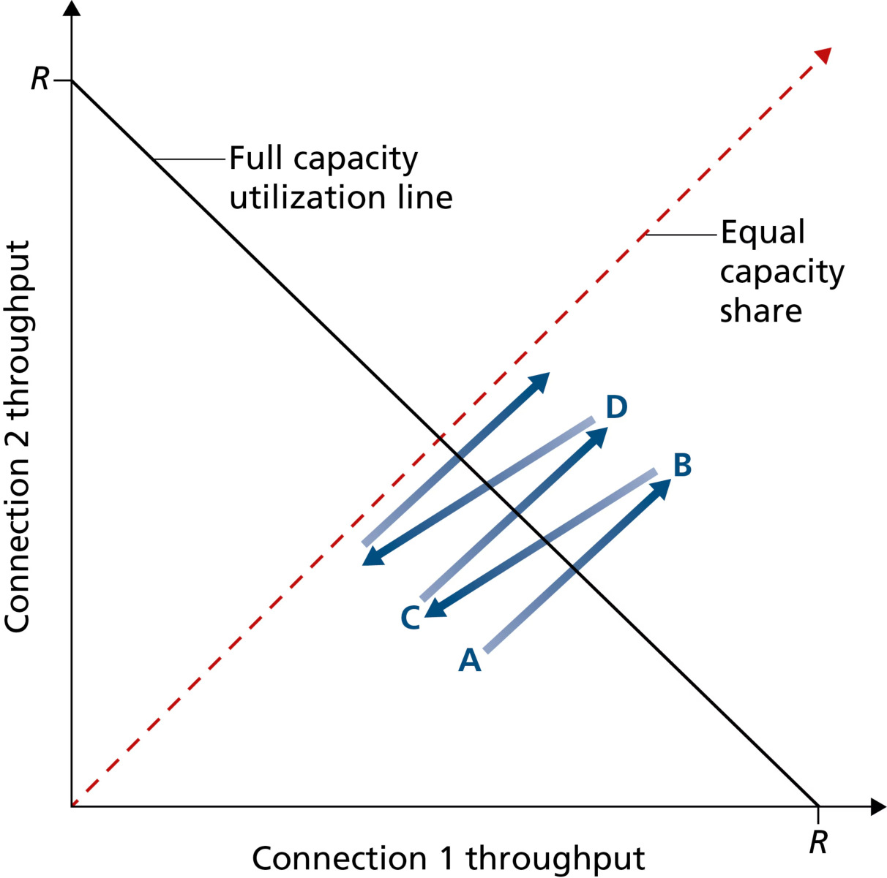

**现实中 TCP 可能不公平的场景（408 常考）：**

- **不同 RTT**：多条连接共享瓶颈时，**RTT 较小的连接**（窗口开得快）抢占更多容量，吞吐量高于 RTT 大的连接。
- **UDP 流量**：多媒体应用常跑在 UDP 上——UDP 没有拥塞控制、不降速，会把 TCP 流量「挤出」瓶颈链路；从 TCP 视角看，UDP 源「不配合、不公平」。
- **并行 TCP 连接**：浏览器常用多条并行 TCP 连接下载一个网页的多个对象。若每个应用用 1 条连接，公平共享；若某应用用 10 条并行连接，它拿到的份额约是单连接应用的 10 倍——**并行连接数越多，分到的带宽越多**，这是浏览器「不守规矩」地提速的手段。

---

## 3.8 传输层功能演化：QUIC

传输层四十年的演进中，除了 TCP 内部的各种补丁（SACK、ECN、时间戳、窗口缩放），还出现了把传输层功能 **搬进应用层** 的「降维打击」式演化。最著名的就是 **QUIC（Quick UDP Internet Connections，RFC 9000/9002）**——Google 发明、HTTP/3 的底层传输协议。

**动机：HTTP/2 的队头阻塞（head-of-line blocking）。** HTTP/1.1 时代，一个 Web 页面需要多个 TCP 连接并行传输；HTTP/2 把多个请求 **多路复用** 到单条 TCP 连接上以提升效率——但 TCP 只提供 **按序** 的字节流交付。若一个 HTTP 请求的某些字节丢失，其后所有请求的字节 **都被阻塞** 在接收缓冲区里等待补序，即使它们互不相关——这就是 TCP 层的队头阻塞。QUIC 的解法：**在单条 QUIC 连接内提供多条独立的「流（stream）」，每条流独立可靠、独立按序交付**，一条流的丢包不再阻塞其他流。

**QUIC 的关键特性：**

- **基于 UDP、连接导向、加密内置。** QUIC 运行在 UDP 之上（图 3.57），但在应用层实现可靠性、流量控制、拥塞控制。QUIC 是 **面向连接** 的：两个端点间建立 QUIC 连接状态（源/目的连接 ID），所有 QUIC 分组加密——它把「建立连接状态」与「认证加密（TLS）」的握手 **合并**，建连比「先 TCP 握手、再 TLS 握手」快得多。
- **0-RTT / 1-RTT 握手。** 传统路径：TCP 三次握手 1 RTT + TLS 握手 1-2 RTT，数据才能出发。QUIC 对 **首次连接** 只需 1-RTT 建立加密连接；对 **再次连接**（携带上次会话的凭据/缓存）可实现 **0-RTT**——第一条消息就能携带应用数据，彻底消除握手时延。
- **连接迁移（connection migration）。** TCP 连接由四元组标识，手机切换 WiFi/蜂窝网络导致 IP 变化时 TCP 连接必须重建。QUIC 用 **连接 ID**（而非 IP+端口）标识连接，IP 变了连接仍在——无缝迁移，适合移动场景。
- **多路复用与流。** 一条 QUIC 连接承载多条应用级「流」（每个流有流 ID），多流数据可合并在同一个 QUIC 分组里经 UDP 传输。可靠、按序、双向交付按 **每条流** 分别保证——这是消除队头阻塞的关键。
- **拥塞控制。** QUIC 的拥塞控制基于 **TCP NewReno**（RFC 6582，Reno 的改良）——「熟悉 TCP 拥塞控制的读者会发现，这里几乎就是众所周知的 TCP 算法」。

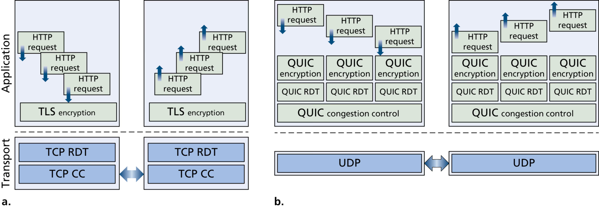

**生态意义**：如今应用开发者有三条路——操作系统内核的 TCP、内核的 UDP、或 **UDP 之上的 QUIC（应用层实现）**。在应用层实现传输功能意味着协议可以按 **应用更新节奏** 演进（不用等内核升级与标准委员会开会），这是 QUIC 阵营津津乐道的「特性速度」。相关协议还有 **DCCP（RFC 4340）**：低开销、面向报文、类 UDP 不可靠，但提供与 TCP 兼容的可选拥塞控制（如 TFRC 基于丢包率方程平滑发送速率，适合流媒体）；SCTP 则是更早的「多流多路复用」先行者。

## 3.9 小结

本章从原理到协议完整走了一遍传输层：

1. **服务**：传输层在不可靠网络层之上提供进程到进程的逻辑通信，服务受制于网络层服务模型；复用/解复用是核心机制。
2. **UDP**：只做复用/解复用 + 差错检测；8 字节首部；校验和（二进制反码和 + 回卷）提供端到端检错。
3. **可靠数据传输**：校验和、序号、ACK/NAK、定时器、窗口的组合——rdt1.0 → rdt2.x → rdt3.0 → 流水线 → GBN → SR；窗口与序号空间约束（GBN：W ≤ 2ⁿ-1；SR：W ≤ 2ⁿ⁻¹）。
4. **TCP**：面向连接（三次握手/四次挥手）、报文段结构（序号按字节、累积确认）、RTT 估计（EstimatedRTT/DevRTT/TimeoutInterval）、单一定时器 + 快重传的可靠传输、流量控制（rwnd）。
5. **拥塞控制**：拥塞的四大代价；端到端 vs 网络辅助两种方法；经典 TCP 的慢开始/拥塞避免/快重传/快恢复（AIMD 锯齿）、Tahoe vs Reno、CUBIC/Vegas/BBR、ECN、公平性。
6. **演化**：QUIC 把可靠传输、拥塞控制、连接管理搬进应用层（基于 UDP），解决 HTTP/2 队头阻塞，支持 0-RTT 与连接迁移。

可靠传输不止传输层需要——链路层、网络层、应用层都可以实现确认、定时器、重传与序号，向上一层提供可靠传输。

---

## 🧪 本章习题

> 每道题均可回溯至本章正文（考点映射见章首导览）。A 组为基础题，B 组为提高题，C 组为拓展综合题（408 大题风格），最后为原书习题讲解与真题改编。

### A 基础题（单选/填空，每题 1-2 分）

**A1.**（单选）UDP 报文段首部中，下列哪个字段是 TCP 报文段首部 **没有** 的？

- A. 源端口号
- B. 序号（sequence number）
- C. 校验和
- D. 目的端口号

??? answer "查看答案"
    **答案：B**

    UDP 首部只有 4 个字段：源端口、目的端口、长度、校验和（共 8 字节）。**序号与确认号是 TCP 首部的字段**（32 bit，用于可靠传输）；UDP 不提供可靠传输，自然不需要序号。长度字段是 UDP 独有的（TCP 首部长度由首部长度字段给出）。

**A2.**（单选）关于端口号，下列说法 **错误** 的是（ ）。

- A. 端口号长度为 16 位，范围 0～65535
- B. 0～1023 为熟知端口号，HTTP 使用 80 号端口
- C. 端口号用于标识主机
- D. 客户端端口号通常由操作系统动态分配

??? answer "查看答案"
    **答案：C**

    端口号用于 **标识进程**（传输层的概念）；**IP 地址** 才用于标识主机（网络层的概念）。A、B、D 均正确：端口号 16 位；熟知端口 0～1023（HTTP 80、FTP 21、DNS 53、SMTP 25）；客户端端口通常动态分配，服务器端口通常固定。

**A3.**（填空）UDP socket 由二元组（**____**，**____**）唯一标识；TCP socket 由四元组（**____**，**____**，**____**，**____**）唯一标识。

??? answer "查看答案"
    UDP：**（目的 IP 地址，目的端口号）**。

    TCP：**（源 IP 地址，源端口号，目的 IP 地址，目的端口号）**。

    要点：UDP 只看「目的二元组」，两个源不同的 UDP 报文段可进同一 socket；TCP 看完整四元组，任一字段不同就是不同连接。

**A4.**（单选）TCP 报文段中，**确认号** 的含义是（ ）。

- A. 本报文段数据首字节的序号
- B. 期望收到对方下一个字节的序号
- C. 已发送的最后一个字节的序号
- D. 接收方缓冲区剩余空间

??? answer "查看答案"
    **答案：B**

    确认号 = **期望收到对方的下一个字节的序号** = 已正确收到的最大按序字节序号 + 1。由于 TCP 只确认到第一个缺失字节为止，这种确认称为 **累积确认**。选项 A 是「序号」的含义；选项 D 是「接收窗口 rwnd」的含义。

**A5.**（填空）TCP 三次握手中：第一次握手报文段置 **____** 标志位（值为 1）；第二次握手报文段置 **____** 与 **____** 标志位（值为 1）；第三次握手报文段置 **____** 标志位，且 **可以携带应用数据**。

??? answer "查看答案"
    第一次：**SYN**；第二次：**SYN 与 ACK**；第三次：**ACK**。

    注意：SYN 段与 FIN 段即使不携带数据也 **各消耗一个序号**（408 常考）。第三次握手的确认号 = 服务器初始序号 + 1。

### B 提高题（简答/计算，每题 5-10 分）

**B1.**（计算，10 分）主机甲通过一条 128 kb/s 的卫星链路采用 GBN 协议向主机乙发送数据，单向传播时延 250 ms，数据帧长 1000 字节，忽略确认帧的传输时延与处理时延。

（1）为使信道利用率不低于 80%，发送窗口至少多大？

（2）帧序号的比特数至少为多少（GBN）？若改用 SR 协议（收发窗口相等），帧序号比特数又至少为多少？

??? answer "查看答案"
    （1）数据帧传输时间 T_f = L/R = 1000×8 / 128000 = **62.5 ms**；RTT = 2×250 = **500 ms**。信道利用率：

    $$ U = \frac{W \cdot T_f}{T_f + RTT} = \frac{W \times 62.5}{62.5 + 500} \ge 0.8 $$

    $$ W \times 62.5 \ge 0.8 \times 562.5 = 450 \Rightarrow W \ge 7.2 $$

    故发送窗口 **至少为 8**。

    （2）**GBN**：W ≤ 2ⁿ - 1，需 2ⁿ - 1 ≥ 8，即 2ⁿ ≥ 9，故 n ≥ 4，**序号至少 4 bit**（2³-1=7 < 8）。

    **SR**（收发窗口相等）：W ≤ 2ⁿ⁻¹，需 2ⁿ⁻¹ ≥ 8，故 n ≥ 4，**序号至少 4 bit**。两种协议在此题条件下同为 4 bit，但一般情形下 GBN 的窗口上限（2ⁿ-1）大于 SR（2ⁿ⁻¹）。

??? success "评分标准"

    - T_f 与 RTT 计算正确（3 分）
    - 利用率不等式建立与求解（W ≥ 8）（3 分）
    - GBN 序号位数（4 bit）（2 分）
    - SR 序号位数（4 bit）（2 分）

**B2.**（计算，8 分）TCP 连接测得连续三个 SampleRTT：30 ms、40 ms、35 ms。已知初始 EstimatedRTT = 25 ms、DevRTT = 5 ms（α = 1/8，β = 1/4）。求每个样本之后的 EstimatedRTT、DevRTT 与 TimeoutInterval。

??? answer "查看答案"
    公式：EstimatedRTT = 0.875·EstimatedRTT + 0.125·SampleRTT；DevRTT = 0.75·DevRTT + 0.25·|SampleRTT − EstimatedRTT|；TimeoutInterval = EstimatedRTT + 4·DevRTT。

    **样本 1（30 ms）：**
    EstimatedRTT = 0.875×25 + 0.125×30 = 21.875 + 3.75 = **25.625 ms**；
    DevRTT = 0.75×5 + 0.25×|30 − 25| = 3.75 + 1.25 = **5 ms**；
    TimeoutInterval = 25.625 + 4×5 = **45.625 ms**。

    **样本 2（40 ms）：**
    EstimatedRTT = 0.875×25.625 + 0.125×40 = 22.421875 + 5 = **27.421875 ms**；
    DevRTT = 0.75×5 + 0.25×|40 − 25.625| = 3.75 + 3.59375 = **7.34375 ms**；
    TimeoutInterval = 27.421875 + 4×7.34375 = 27.421875 + 29.375 = **56.796875 ms**。

    **样本 3（35 ms）：**
    EstimatedRTT = 0.875×27.421875 + 0.125×35 = 23.994 + 4.375 = **28.369 ms**；
    DevRTT = 0.75×7.34375 + 0.25×|35 − 27.421875| = 5.508 + 1.895 = **7.403 ms**；
    TimeoutInterval = 28.369 + 4×7.403 = **57.98 ms**。

    要点：EstimatedRTT 是 EWMA（更看重近期样本）；超时值 = 估计值 + 4 倍偏差，兼顾「避免过早超时」与「快速检测丢失」。

??? success "评分标准"

    - EstimatedRTT 公式与 α 正确（2 分）
    - DevRTT 公式与 β 正确（2 分）
    - 三组数值计算正确（每组约 1.3 分）
    - TimeoutInterval 公式正确（1 分）

**B3.**（简答，8 分）比较 TCP 的 **流量控制** 与 **拥塞控制** 的异同。发送方实际发送窗口由什么决定？

??? answer "查看答案"
    **相同点**：都通过控制发送方发送数据的速率来达到控制效果（都表现为节流发送方）。

    **不同点**：

    - **性质不同**：流量控制是 **端到端（点对点）** 问题——接收端控制发送端，防止发送方淹没接收方缓冲区；拥塞控制是 **全局性** 问题——防止过多数据注入网络，涉及所有主机、路由器与网络承载能力。
    - **原因不同**：流量控制针对「接收方来不及接收」（如某 PC 处理慢，即使链路带宽充裕）；拥塞控制针对「网络承载不了」（如 100 万台 PC 同时发送导致路由器过载）。
    - **依据不同**：流量控制依据接收方通告的 **接收窗口 rwnd**；拥塞控制依据发送方检测到的网络拥塞（丢包/超时/3 冗余 ACK）调整 **拥塞窗口 cwnd**。

    **实际发送窗口**：发送方允许的未确认数据量 = **min{rwnd, cwnd}**——流量控制与拥塞控制共同决定。例题：若 rwnd = 4000 B、cwnd = 2000 B，则发送窗口 = 2000 B（取较小者）。

??? success "评分标准"

    - 相同点（2 分）
    - 三点不同（各 2 分）
    - 发送窗口 = min{rwnd, cwnd}（2 分）

### C 拓展题（计算/综合，每题 10-15 分）

**C1.**（综合，15 分，真题 2023#47 改编）主机 H 通过一条 TCP 数据连接向 FTP 服务器上传一个大小为 **18000 B** 的文件 F。建连时选择初始序号 100，MSS = 1000 B，拥塞控制初始阈值 ssthresh = 4 MSS，RTT = 10 ms，忽略 TCP 段的传输时延；传输过程中 H 均以 MSS 段发送数据。

（1）文件 F 第一个数据字节的序号是多少？共分几个报文段？

（2）H 收到确认号为 2101 的确认段时，拥塞窗口为多少？收到确认号为 7101 的确认段时呢？（分别说明处于哪个阶段）

（3）收到 ack = 7101 后，H 的 cwnd = 5，随即发送 5 个段（序号 7101/8101/9101/10101/11101）。若 7101 段在传输中丢失，接收方对后续到达的失序段会如何确认？H 收到 **1 个原始 + 3 个冗余 ACK（共 4 个 ack = 7101）** 后执行什么操作？新的 ssthresh 与 cwnd 各为多少？

（4）接（3），从请求建立连接到确认 F 全部被接收，至少需要多少时间？期间应用层数据平均发送速率是多少？

??? answer "查看答案"
    **（1）** 建立连接时 SYN 段要 **消耗一个序号**（SYN 段不携带数据但序号 100 被占用），故文件第一个字节的序号为 **101**。文件 18000 B，MSS = 1000 B，共 **18000/1000 = 18 个报文段**（序号依次从 101 起，每段 1000 B）。

    **（2）** 拥塞窗口按传输轮次演变：

    | 传输轮次 | 1 | 2 | 3 |
    |:---|:---|:---|:---|
    | 发送段数 | 1 | 2 | 4 |
    | cwnd 变化 | 1→2 | 2→4 | 4→5 |

    前两个轮次 cwnd < ssthresh（4），处于 **慢开始**（指数增长）；第 2 轮次结束后 cwnd = 4 = ssthresh，第 3 轮次起进入 **拥塞避免**（每轮 +1 MSS）。

    - 收到 **ack = 2101**（服务器已收 2000 B = 2 段）：此时还在第 2 个轮次（慢开始），每收到一个确认 cwnd +1，故 cwnd = 2 + 1 = **3 MSS**。
    - 收到 **ack = 7101**（服务器已收 7000 B = 7 段）：第 3 轮次发送 1+2+4 = 7 段完毕，cwnd = **5 MSS**（4 + 1，拥塞避免的加法增大）。

    **（3）** 7101 段丢失后，接收方收到失序的 8101/9101/10101/11101 段，因 TCP 使用 **累积确认**，接收方对每个失序段 **立即重复确认最后一个按序字节**——即连续回送 4 个 **ack = 7101** 的冗余确认。H 收到「1 原始 + 3 冗余」共 4 个 ack = 7101 后：

    - 判定 7101 段丢失，执行 **快重传**：不等超时立即重传 7101 段；
    - 进入 **快恢复**：**ssthresh = cwnd/2 = 5/2 = 2（向下取整，且不小于 2 MSS）**；
    - **cwnd = ssthresh = 2 MSS**（注意：不是置 1，也没有重新慢开始），此后执行拥塞避免（每 RTT +1）。

    **（4）** 时间线（每个传输轮次 1 个 RTT）：

    - **建连**：1 RTT（三次握手）；
    - 轮次 1：发 1 段（累计 1）；轮次 2：发 2 段（累计 3）；轮次 3：发 4 段（累计 7）；
    - 轮次 4：cwnd = 5，发 5 段（7101…11101，累计 12），7101 丢失 → 快重传 + 快恢复（ssthresh = 2，cwnd = 2），重传 7101 段、收到累积确认 ack = 12101；
    - 轮次 5：cwnd = 2，发 2 段（累计 14）；
    - 轮次 6：cwnd = 3，发 3 段（累计 17）；
    - 轮次 7：cwnd = 4，发 1 段（累计 18，全部发出）；
    - 轮次 8：收到对最后一段的确认 ack = 18101（最后数据字节为 18100，故累计确认 18101）。

    传输共 8 个 RTT + 建连 1 RTT = **9 RTT = 9 × 10 ms = 90 ms**。

    平均发送速率 = 18000 × 8 bit / (9 × 10 ms) = 144000 bit / 0.09 s = **1.6 Mb/s**（= 0.2 MB/s）。

    **要点回顾**：快重传快恢复下 ssthresh = cwnd/2 = 2（而非 5/2 向上取整的 3）；超时与 3 冗余 ACK 的响应截然不同——前者 cwnd = 1 慢开始，后者 cwnd = ssthresh 快恢复。

??? success "评分标准"

    - 序号与段数（101、18 段）（2 分）
    - 慢开始/拥塞避免各轮 cwnd 演变正确（3 分）
    - ack=2101→cwnd=3、ack=7101→cwnd=5（3 分）
    - 冗余 ACK 机制、快重传触发、ssthresh=2、cwnd=2（4 分）
    - 总时间 9 RTT=90ms、平均速率 1.6Mb/s（3 分）

**C2.**（综合，15 分，真题 2011#23 改编）数据链路层采用选择重传协议（SR）传输数据，序号用 3 bit 编号，发送窗口与接收窗口相等且均为最大值。主机甲已发送 0～3 号帧，现收到 1 号帧的确认，而 0、2 号帧依次超时。

（1）此时甲需要重传哪些帧？为什么？

（2）若将协议改为 GBN（接收窗口为 1），其他条件相同，甲需要重传哪些帧？

（3）分别计算 SR 与 GBN 在此序号位数下的最大发送窗口，并说明 GBN 序号空间约束 W ≤ 2ⁿ-1 的原因。

??? answer "查看答案"
    **（1）SR：重传 0 号与 2 号帧（共 2 个）。** SR 只重传「接收方未正确接收」的分组：3 号帧已发送但尚未超时且未确认，不重传；1 号帧已确认，不重传；0、2 号帧超时，说明其数据帧或确认丢失，各单独重传一次（每帧有自己的定时器）。3 号帧即使已到接收方，也只是被缓存等待 2 号补齐。

    **（2）GBN：重传 2 号与 3 号帧（共 2 个）。** GBN 发送方 **只有一个定时器**（关联最老未确认帧 base）。0、2 号超时意味着定时器（即 0 号或 2 号对应的最老未确认帧）超时，发送方重传 **从 base 起所有未确认帧**。本题中已确认 1 号，未确认的是 2、3 号，故重传 2、3 号。注意与 SR 的区别：SR 不重传 3 号（它没有超时），GBN 重传 3 号（它是 base 之后的所有未确认帧）。

    **（3）窗口上限（3 bit 序号，序号空间 2³ = 8）：**

    - **SR**（收发窗口相等）：W ≤ 2ⁿ⁻¹ = 2² = **4**。
    - **GBN**：W ≤ 2ⁿ - 1 = 8 - 1 = **7**。

    **GBN 约束 W ≤ 2ⁿ-1 的原因**：GBN 接收窗口为 1。若 W = 2ⁿ，当发送方发送序号 0～2ⁿ-1 的整窗口帧后，若这些帧的确认全部丢失，发送方超时重传同样的整窗口；此时接收方收到的虽是「旧帧的重复」，但序号与「新的一轮」完全重合，接收方无法区分「重传的旧帧」与「新一轮的新帧」——协议失效。将窗口限制为 2ⁿ-1，重传窗口与下一轮窗口在序号环上错开一个位置，接收方凭序号即可区分新旧。

??? success "评分标准"

    - SR 重传 0、2 号及理由（4 分）
    - GBN 重传 2、3 号及理由（4 分）
    - SR 最大窗口 4、GBN 最大窗口 7（3 分）
    - GBN 约束 W ≤ 2ⁿ-1 的原因（4 分）

### 原书习题讲解

**原书 R12.**（概念）可靠数据传输协议（如 rdt3.0）中，为什么需要序号（sequence number）？为什么需要定时器（timer）？

??? answer "查看答案"
    **序号**：解决 **重复分组** 问题。当 ACK/NAK 损坏、或分组/确认丢失后重传时，接收方无法凭内容区分「新数据」与「重传的旧数据」；加入序号后，接收方只需检查序号：序号与最近收到的相同 → 重复分组，丢弃；序号前进 → 新数据，接收。停等协议 1 bit 序号（0/1 交替）即可。

    **定时器**：解决 **丢包检测** 问题。发送方无法预知分组或 ACK 是否丢失，只能等待一段「很可能意味着丢失」的时间（超时值由 RTT 估计决定）；定时器超时即触发重传。发送方需要能启动定时器、响应超时中断、停止定时器三个操作。

    二者缺一不可：没有序号，重传会造成重复交付；没有定时器，丢包后协议会永远等下去。

??? success "评分标准"

    - 序号解决重复分组问题（3 分）
    - 定时器解决丢包检测问题（3 分）
    - 缺一不可的论证（2 分）

**原书 R21.**（概念）TCP 是 GBN 协议还是 SR 协议？为什么？

??? answer "查看答案"
    **两者都是，又都不是——TCP 是 GBN 与 SR 的混合体。**

    - **像 GBN 之处**：① TCP 使用 **累积确认**（确认号 = 期望的下一个字节序号）；② 发送方只需维护两个变量 SendBase（最老未确认字节）与 NextSeqNum；③ 采用 **单一重传定时器**。
    - **不像 GBN（偏向 SR）之处**：① 大多数 TCP 实现 **缓存乱序段**（不丢弃，等缺口补齐）；② 超时后 TCP **至多重传一个段**（引起超时的那个段），而非像 GBN 那样重传整个窗口；③ 若收到「更高确认号的累积 ACK」，即使中间某段的 ACK 丢失，该段也不会被重传。
    - 启用 **SACK（选择确认，RFC 2018）** 后，接收方可以逐段选择确认乱序段，TCP 与 SR 非常相似。

??? success "评分标准"

    - 结论：混合体（2 分）
    - 像 GBN 的三点（3 分）
    - 偏向 SR 的三点（3 分）
    - SACK 的作用（2 分）

**原书 P8（类似）。**（计算）TCP 连接的最大发送窗口为 64 KB，网络平均往返时间 RTT = 20 ms，忽略接收窗口与拥塞窗口约束，问 TCP 能达到的最大数据传输速率是多少？

??? answer "查看答案"
    TCP 的发送速率 ≈ 窗口大小 / RTT（每个 RTT 发送一个窗口的数据）。窗口以字节计：

    $$ \text{最大速率} = \frac{64 \times 1024 \text{ B}}{20 \text{ ms}} = \frac{64 \times 1024 \times 8 \text{ bit}}{20 \times 10^{-3} \text{ s}} = \frac{524288 \times 8}{0.02} = 26.2144 \times 10^{6} \text{ b/s} \approx 26.2 \text{ Mb/s} $$

    即最大数据传输速率约 **26.2 Mb/s**。这是「单窗口流量 = 带宽时延积」思想的体现：窗口太小则链路利用不充分（管道填不满），窗口 = 带宽 × RTT 时才刚好把管道填满。

??? success "评分标准"

    - 速率 = 窗口/RTT 模型（4 分）
    - 单位换算正确（KB→字节→bit、ms→s）（4 分）
    - 数值 26.2 Mb/s（2 分）

**真题 2010#47 改编。**（综合）某以太网交换机连接主机 A 与主机 B，链路速率 10 Mb/s。主机 A 向 B 发送一个长 1000 字节的帧（含 6 字节目的 MAC、6 字节源 MAC、2 字节类型、4 字节 FCS）。

（1）若交换机采用 **直通（cut-through）交换**（收到目的地址即可转发，不缓存整帧），从帧的第一个比特到达交换机输入端口到它开始从输出端口发送，需多长时间？

（2）若交换机采用 **存储转发**，需多长时间（忽略处理与排队时延）？

（3）结合 3.4 节停等协议的分析，说明直通交换相比存储转发在转发时延上的优势。

??? answer "查看答案"
    （1）**直通交换**：只需接收 **目的 MAC 地址（6 字节）** 即可决定转发端口并开始输出：

    $$ t_{cut} = \frac{6 \times 8 \text{ bit}}{10 \times 10^6 \text{ b/s}} = 4.8 \text{ μs} $$

    （2）**存储转发**：必须 **收完整帧** 才能转发，帧长 = 6 + 6 + 2 + 1000 + 4 = 1018 字节：

    $$ t_{store} = \frac{1018 \times 8}{10 \times 10^6} = 814.4 \text{ μs} $$

    （3）直通交换的转发时延（4.8 μs）远小于存储转发（814.4 μs），因为存储转发需要先把整帧接收并缓存（相当于每跳多付一个「传输时延」）。这呼应 3.4 节的利用率分析：**任何「先收完再发」的机制（存储转发、停等）都会引入整帧的传输时延开销**；直通交换边收边发，把每跳的存储时延压缩到只读首部的最小值。代价是直通无法在转发前做差错检测（FCS 在帧尾）。

??? success "评分标准"

    - 直通时延 4.8 μs（4 分）
    - 帧长计算与存储转发时延 814.4 μs（5 分）
    - 两种方式对比论述（3 分）
    - 与停等/存储转发的原理联系（3 分）

---

## ✅ 本章小结

本章是 408 大题重灾区，核心线索归纳：

1. **传输层服务**：把 IP 的「主机到主机」交付扩展为「进程到进程」交付（复用/解复用）；服务受制于网络层服务模型，但能提供网络层没有的可靠传输。
2. **UDP**：无连接、8 字节首部、端到端校验和（二进制反码和 + 回卷）；适合实时/无连接状态要求的应用，但没有流量控制与拥塞控制。
3. **可靠传输原理**：校验和 + 序号 + 确认 + 定时器 + 窗口；rdt1.0 → rdt2.x（停等）→ rdt3.0（超时重传）→ 流水线（利用率 = N·T/(T+RTT)）→ GBN（累积确认、单定时器、W ≤ 2ⁿ-1）→ SR（逐分组确认、每分组定时器、W ≤ 2ⁿ⁻¹）。
4. **TCP**：三次握手（SYN/SYNACK/ACK）与四次挥手（FIN×2 + ACK×2，TIME_WAIT = 2MSL）；报文段结构（32 位序号按字节、累积确认、rwnd）；RTT 估计（EstimatedRTT = 0.875·E + 0.125·S，DevRTT β = 1/4，TimeoutInterval = E + 4·D）；可靠传输（单一定时器 + 快重传 3 冗余 ACK）；流量控制（未确认数据 ≤ rwnd，零窗口探测）。
5. **拥塞控制**：拥塞四大代价；端到端 vs 网络辅助（ECN）；经典 TCP = 慢开始（指数）+ 拥塞避免（线性）+ 快重传/快恢复（ssthresh = cwnd/2），AIMD 锯齿；超时 cwnd = 1、3 冗余 ACK cwnd = ssthresh；Tahoe vs Reno；CUBIC/Vegas/BBR；公平性（RTT 越小越占优、UDP 与并行连接破坏公平）。
6. **QUIC**：基于 UDP、应用层实现可靠传输/拥塞控制/连接管理，多流消除队头阻塞，0-RTT/1-RTT，连接迁移。

### 术语对照表

| 英文术语 | 中文 | 说明 |
|:---|:---|:---|
| multiplexing / demultiplexing | 多路复用 / 解复用 | 源端多个 socket 封装成段 / 目的端按首部字段把段交付给正确 socket |
| port number | 端口号 | 16 位，标识进程；熟知端口 0～1023（HTTP 80、FTP 21、DNS 53） |
| two-tuple / four-tuple | 二元组 / 四元组 | UDP socket（目的 IP，目的端口）；TCP socket（源/目的 IP，源/目的端口） |
| segment | 报文段 | 传输层分组（TCP/UDP 通用术语） |
| checksum | 校验和 | 差错检测字段；二进制反码和，溢出回卷 |
| connectionless | 无连接 | UDP 特性：发送前不握手、不维护连接状态 |
| reliable data transfer | 可靠数据传输 | 无损坏、无丢失、按序交付的服务抽象 |
| ARQ | 自动重传请求 | 基于确认 + 重传的可靠传输协议族 |
| stop-and-wait | 停等 | 发一个等一个确认的协议（rdt2.0/3.0） |
| pipelining | 流水线 | 不等确认连续发送多分组，利用率 = N·T/(T+RTT) |
| Go-Back-N (GBN) | 回退 N 步 | 累积确认、单定时器、超时重传窗口内全部；W ≤ 2ⁿ-1 |
| Selective Repeat (SR) | 选择重传 | 逐分组确认、每分组定时器、只重传丢失分组；W ≤ 2ⁿ⁻¹ |
| sliding-window protocol | 滑动窗口协议 | 用大小 N 的窗口限制在途未确认分组数 |
| cumulative acknowledgment | 累积确认 | ACK(n) 表示序号 ≤ n 的分组全部正确接收 |
| duplicate ACK | 冗余 ACK | 对同一数据的重复确认，3 个冗余 ACK 触发快重传 |
| maximum segment size (MSS) | 最大报文段长度 | 报文段中应用数据的最大量（典型 1460 B） |
| sequence number | 序号 | TCP 按字节计数，序号 = 数据首字节的字节流编号 |
| EstimatedRTT / DevRTT | RTT 估计 / RTT 偏差 | EWMA 估计；α=1/8、β=1/4 |
| TimeoutInterval | 超时间隔 | EstimatedRTT + 4·DevRTT；超时后加倍 |
| flow control | 流量控制 | 端到端：防止发送方淹没接收方缓冲区（rwnd） |
| congestion control | 拥塞控制 | 全局：防止过多数据注入网络（cwnd） |
| receive window (rwnd) | 接收窗口 | 接收方通告的空闲缓冲字节数 |
| congestion window (cwnd) | 拥塞窗口 | 发送方根据拥塞程度动态调整的窗口 |
| slow start | 慢开始 | 每收到一个确认 cwnd +1（每 RTT 翻倍，指数增长） |
| congestion avoidance | 拥塞避免 | 每 RTT 增加 1 个 MSS（线性增长） |
| fast retransmit | 快重传 | 收到 3 个冗余 ACK 立即重传，不等超时 |
| fast recovery | 快恢复 | 3 冗余 ACK 后 cwnd = ssthresh = cwnd/2，跳过硬开始 |
| ssthresh | 慢开始阈值 | 慢开始与拥塞避免的分界；超时/3 冗余 ACK 时置为 cwnd/2 |
| AIMD | 加性增乘性减 | TCP 拥塞控制：线性增、丢包减半，形成锯齿曲线 |
| TCP Tahoe / Reno | 塔霍 / 雷诺 | 早期 TCP（丢包一律置 1）/ 改进版（3 冗余 ACK 减半） |
| ECN | 显式拥塞通知 | 网络层标记 + 接收方回显 ECE + 发送方减窗 |
| three-way handshake | 三次握手 | SYN → SYNACK → ACK 建立 TCP 连接 |
| four-way handshake | 四次挥手 | FIN → ACK → FIN → ACK（TIME_WAIT = 2MSL）释放连接 |
| SYN flood | SYN 洪泛攻击 | 海量 SYN 不完成握手耗尽服务器资源；对策 SYN cookie |
| QUIC | 快速 UDP 因特网连接 | 基于 UDP 的应用层传输协议（HTTP/3），多流、0-RTT、连接迁移 |

---

## 🚪 下一章预告

第 3 章完成了「网络边缘」的最后一块拼图：应用层与传输层都跑在端系统上，我们已经吃透了进程与进程之间的通信。下一站，我们走进 **网络核心**——网络层（第 4 章）将回答：数据报如何在路由器之间转发？IP 地址如何编址？路由器如何处理分组？这将是从「端到端」到「逐跳」的视角切换。

👉 [进入第 4 章：网络层 →](04-network-layer-data-plane.md)
