# 第 4 章：网络层：数据平面 —— 从路由器内部到 IP 编址的逐比特解剖

> 传输层告诉你「报文段如何在两台主机之间可靠地走」，却刻意不告诉你「数据报如何在网络中被逐跳转发」。本章揭开这块面纱：**转发（forwarding）** 是路由器本地、纳秒级的动作，**路由（routing）** 是全网、秒级的规划——前者构成数据平面，后者构成控制平面。而数据平面上最值钱的，是 IPv4 的分片计算、子网划分与 CIDR 聚合——**CIDR 相关考点在 408 中考频高达 9 次，是本章当之无愧的计算题重灾区**。

---

## 📋 本章导览

| 项目 | 内容 |
|:---|:---|
| **课时建议** | 10-12 课时（408 一轮复习建议 3-4 天，计算题高产区） |
| **教学目标** | ① 理解转发与路由、数据平面与控制平面的区别；② 掌握路由器内部结构（输入/输出端口、交换结构、排队、调度）；③ 掌握 IPv4 数据报格式与分片计算（★408 必考）；④ 掌握 IPv4 编址：分类编址、子网划分、CIDR 与路由聚合、DHCP、NAT；⑤ 掌握 IPv6 格式、冒号十六进制记法与过渡策略；⑥ 理解通用转发（匹配+动作）与 OpenFlow、中间盒；⑦ 了解因特网体系结构原则（端到端原则、IP 沙漏） |
| **教学重点** | IPv4 数据报格式与分片（片偏移单位 8B、首部长度单位 4B）、CIDR 编址与路由聚合（最长前缀匹配）、NAT 转换、IPv6 压缩记法 |
| **教学难点** | 分片计算（DF/MF/片偏移配合）、子网划分（定长 vs 变长子网掩码）、CIDR 聚合与最长前缀匹配、NAT 转换表的读写 |
| **考点映射** | 408 考点：CIDR 划分/地址分配/IP 地址合法性判断（**考频=9**：2023#39、2022#35、2021#35、2019#37、2017#38、2012#39、2011#38、2010#37、2017#36；大题 2019#47、2018#47、2013#47 等）；子网掩码作用（考频高）；IPv4 首部字段分析（2011、2012）；TTL 字段分析与计算（2014、2024）；IP 分片原理（2021）；NAT 原理（2016、2019、2020、2023）；DHCP（2015、2022）；IPv6（2023）；SDN 南向接口（2022） |
| **习题配置** | 例题 5 道 + A 基础 5 题 + B 提高 3 题 + C 拓展 2 题 + 原书习题讲解 3 道（含真题 2019#47、2013#47、2023#39、2022#35、2021#35 改编） |

<div class="chapter-route" aria-label="第 4 章学习路线">
<a class="route-step" href="#41"><span class="route-index">01</span><strong>网络层概述</strong><small>转发、路由与数据平面</small></a>
<a class="route-step" href="#42"><span class="route-index">02</span><strong>路由器内部</strong><small>输入端口、交换结构与排队</small></a>
<a class="route-step" href="#43-ipipv4ipv6"><span class="route-index">03</span><strong>IP 协议</strong><small>IPv4、CIDR、NAT 与 IPv6</small></a>
<a class="route-step" href="#44-sdn"><span class="route-index">04</span><strong>通用转发与 SDN</strong><small>匹配、动作与 OpenFlow</small></a>
<a class="route-step" href="#45"><span class="route-index">05</span><strong>体系结构原则</strong><small>IP 沙漏与端到端原则</small></a>
</div>
<p class="chapter-route-note">点击卡片跳转到对应小节。本路线图只负责定位，地址计算、转发表和排队分析在正文中展开。</p>

---

## 4.1 网络层概述

上一章我们学习了传输层：它依靠网络层的「主机到主机」通信服务，为应用进程提供「进程到进程」的通信，却 **完全不了解网络层如何实现这一服务**。本章与下一章将揭开网络层的神秘面纱。请注意一个关键事实：与应用层、传输层不同，**网络层在每一台主机和每一台路由器中都存在**——正因如此，网络层协议是协议栈中最具挑战性（也因此最有趣）的一层。

网络层内容极多，本书用两章来覆盖：**本章（第 4 章）讲数据平面（data plane）**——路由器内部逐跳的转发功能；**第 5 章讲控制平面（control plane）**——决定数据报端到端路径的网络级逻辑（路由算法与 OSPF、BGP 等路由协议）。把网络层划分为数据平面与控制平面，是现代网络体系结构（尤其是软件定义网络 SDN）的核心思想，请带着这个视角学习本章。


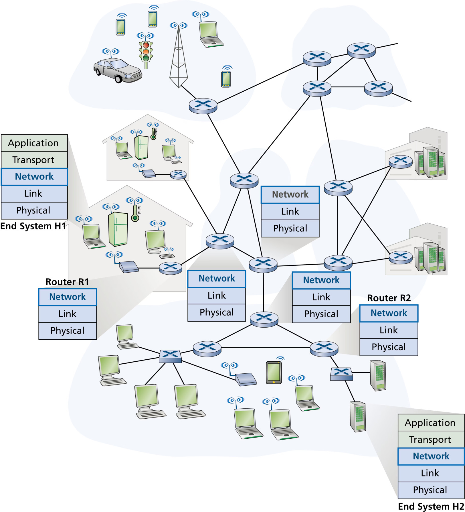

图 4.1 给出了两台主机 H1、H2 与若干路由器的简单网络：H1 的网络层把传输层报文段封装成 **数据报（datagram）** 交给邻近路由器 R1；各路由器的数据平面把数据报从入链路转发到出链路；控制平面协调这些逐跳的转发动作，使数据报最终沿端到端路径到达 H2。注意图中路由器的协议栈是「截断」的——路由器不运行应用层与传输层协议，因为路由器不需要识别端口号与报文内容。

**核心概念①：转发与路由（forwarding & routing）** —— 网络层两个最重要功能的二分：**转发** 是路由器本地动作（把到达的分组从入链路移到出链路，纳秒级、硬件实现）；**路由** 是全网过程（确定分组端到端路径，秒级、软件实现）。转发属于数据平面，路由属于控制平面。这是本章的第一条主线。

### 转发与路由：数据平面与控制平面

**转发（forwarding）**：分组到达路由器的入链路时，路由器必须把它移到适当的出链路。转发只是数据平面实现的功能之一（尽管是最常见、最重要的一种）；更一般的情形（4.4 节）还包括：分组可能被 **阻止** 离开路由器（如来源是被标记的恶意主机、目的是被禁止的主机），或可能被 **复制** 并从多条出链路发出。

**路由（routing）**：网络层必须确定分组从发送方流向接收方所走的 **路由或路径**。计算这些路径的算法称为 **路由算法（routing algorithm）**，路由在控制平面实现。

转发与路由常被混用，但本书严格区分：**转发是路由器本地的、纳秒级的动作**（通常硬件实现），**路由是全网的、秒级的过程**（通常软件实现）。开车类比：转发好比通过一个立交桥——车从一条路进来，决定走哪条路出去；路由好比规划从宾夕法尼亚到佛罗里达的整个行程——出发前查地图选一条路径，路径由一串在立交桥相连的路段组成。

**转发表（forwarding table）** 是每台路由器中的关键元素：路由器检查到达分组首部的一个或多个字段值，用这些值 **索引转发表**，表项中存储的值指出该分组应被转发到哪条出链路接口。

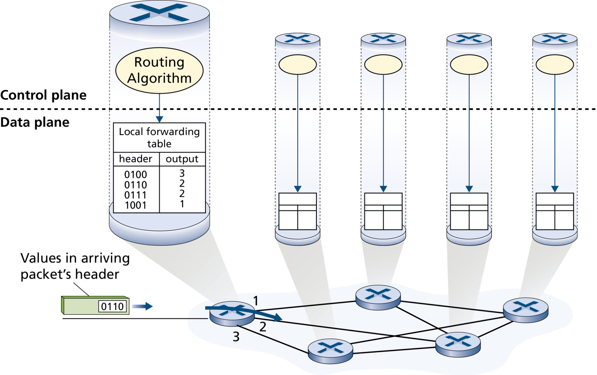

那么转发表是怎么配置出来的？这正是控制平面的职责。有两种方式：

- **传统方式**：如图 4.2，**每台路由器内部都运行路由算法**，转发与路由功能同处一台路由器之中。路由算法进程通过 **路由协议（routing protocol）** 与其他路由器的路由算法进程交换路由消息，共同计算转发表的值。
- **SDN 方式**：如图 4.3，一台 **物理上分离的远程控制器** 计算转发表，并分发给网络中的每一台路由器。路由器只做转发，控制器负责路由——这就是 **软件定义网络（SDN，Software-Defined Networking）** 的核心思想：网络之所以是「软件定义」的，是因为计算转发表、与路由器交互的控制器是用软件实现的，且越来越多地开源。

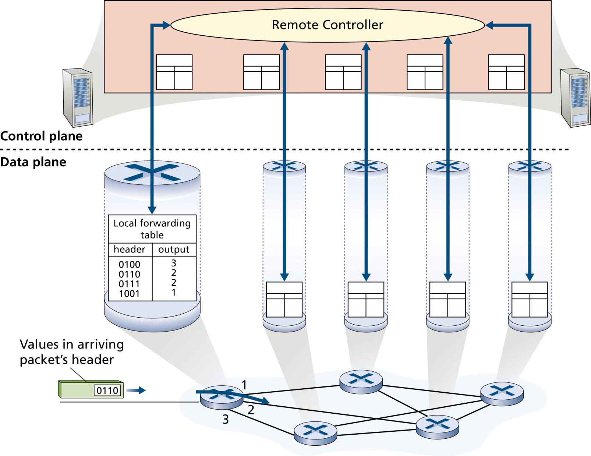

注意：图 4.2 与图 4.3 的 **数据平面完全相同**，区别仅在于控制平面的实现位置——分布式在路由器内，还是集中式在远程控制器。SDN 中，路由器与远程控制器通过交换「包含转发表的路由信息消息」通信（如 OpenFlow 协议，见 4.4 节）。

### 网络服务模型

在深入数据平面之前，先问一个根本问题：网络层能为传输层提供什么样的服务？发送主机的传输层把报文段交给网络层时，能指望它把分组送到目的地吗？多个分组会按发送顺序到达吗？网络会就拥塞提供反馈吗？这些问题的答案由 **网络服务模型（network service model）** 决定——它定义了分组在发送主机与接收主机之间端到端交付的特性。

网络层理论上可以提供的服务包括（部分列举）：

- **保证交付（guaranteed delivery）**：源主机发送的分组最终一定到达目的主机。
- **有界时延的保证交付（guaranteed delivery with bounded delay）**：不仅保证交付，还保证在指定端到端时延上界内交付。
- **按序交付（in-order packet delivery）**：分组按发送顺序到达目的地。
- **保证最小带宽（guaranteed minimal bandwidth）**：模拟一条指定速率的传输链路的行为，只要发送速率不超过该速率，所有分组最终都被交付。
- **安全性（security）**：源端加密所有数据报、目的端解密，为传输层报文段提供机密性。

!!! info "定义：尽力而为服务（best-effort service）"

    **英文原文（权威定义）：**

    > The Internet's network layer provides a single service, known as **best-effort service**. With best-effort service, packets are neither guaranteed to be received in the order in which they were sent, nor is their eventual delivery even guaranteed. There is no guarantee on the end-to-end delay nor is there a minimal bandwidth guarantee.

    **中文解释：** 因特网的网络层只提供一种服务——**尽力而为服务**。它包含 **五个不保证**：① 不保证按序到达；② 不保证最终交付；③ 不保证端到端时延；④ 不保证最小带宽；⑤ 不保证安全性。看似「没有服务」，但正是这种极简服务模型，结合充足的带宽供给与带宽自适应应用层协议（如第 2 章的 DASH 流媒体），支撑起了 Netflix 流媒体、Zoom/微信视频会议等海量应用。对比：ATM 网络架构提供保证按序、有界时延与保证最小带宽的服务；Intserv 架构（RFC 1633）试图提供端到端时延保证，但都未能取代尽力而为。

注意：**可靠交付不是网络层的承诺**。丢失的分组由端系统（TCP）负责重传——这是第 3 章与第 4 章之间最核心的衔接点：网络层尽力而为，传输层在其上构建可靠服务。

---

## 4.2 路由器内部

**核心概念②：路由器内部结构** —— 路由器四大部件：**输入端口（input port）**、**交换结构（switching fabric）**、**输出端口（output port）** 与 **路由处理器（routing processor）**。数据平面（前三个部件，硬件实现）完成转发；控制平面（路由处理器，软件实现）完成路由。排队、阻塞、调度都发生在端口处，是时延与丢包的物理来源。

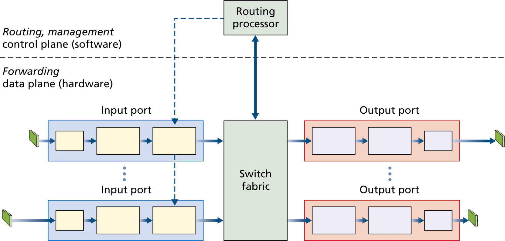

图 4.4 是一台通用路由器的高层视图，四大部件各司其职：

- **输入端口（input port）**：① 执行物理层功能，端接入物理链路（图 4.4 输入端口最左框）；② 执行链路层功能，与入链路对端互操作（中间框）；③ 最关键的 **查找（lookup）功能**（最右框）：查阅转发表，确定到达分组应经交换结构转发到哪个输出端口。注意这里的「端口」指路由器的物理接口，与第 2、3 章的软件端口号完全不同。
- **交换结构（switching fabric）**：把路由器的输入端口连接到输出端口。交换结构完全包含在路由器内部——「路由器内嵌的一个网络」。
- **输出端口（output port）**：存储交换结构送来的分组，执行链路层与物理层功能，把它们发送到出链路上。链路是双向时，同一链路的上/下行端口通常配对在同一 **线路卡（line card）** 上。
- **路由处理器（routing processor）**：执行控制平面功能。传统路由器中，它运行路由协议、维护路由表、计算转发表；SDN 路由器中，它与远程控制器通信，接收并安装远程控制器计算出的转发表项。

**为什么数据平面必须用硬件实现？** 设想一条 10 Gbps 的输入链路与一个 64 字节的 IP 数据报：输入端口必须在约 51 ns 内处理完一个数据报，下一个才到达；若多个端口集成在同一线路卡上，处理流水线还要快数倍——软件实现根本来不及。因此转发硬件（查找、交换）用专用芯片实现，而控制功能（执行路由协议、响应链路状态变化、与控制器通信）在毫秒到秒级运行，用软件实现即可。

用一个「环岛（roundabout）」类比帮助建立直觉：入路与入站岗亭 = 输入端口（含查找功能）；环岛 = 交换结构；出环岛坡道 = 输出端口。若车流极快而岗亭服务员很慢，入路会堵塞；若多数车都要从同一个出口离开，出口也会堵塞——这些都是路由器设计者面对的排队与调度问题。

### 输入端口处理与基于目的地的转发

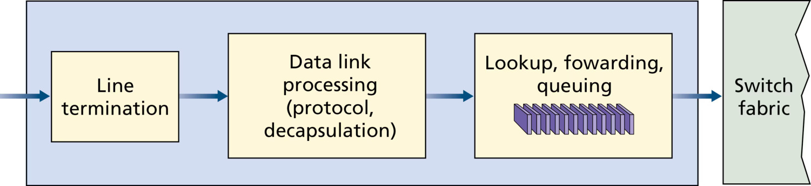

输入端口处理的核心是 **查找**：用转发表确定到达分组应经交换结构发往哪个输出端口。转发表由路由处理器计算（经 PCI 总线等单独总线拷贝到各线路卡），或由远程 SDN 控制器下发。**每块线路卡都保存一份转发表影子副本**，转发决策在本地完成，避免每分组都调用集中式路由处理器造成瓶颈。

转发表的一个朴素实现是为 **每一个可能的目的地址** 建一条表项——IPv4 有超过 40 亿个地址，完全不现实。实际做法：用 **地址前缀（prefix）** 聚合。设路由器有 4 条链路，转发规则如下：

| 目的地址范围（二进制） | 链路接口 |
|:---|:---:|
| 11001000 00010111 00010000 00000000 ~ 11001000 00010111 00010111 11111111 | 0 |
| 11001000 00010111 00011000 00000000 ~ 11001000 00010111 00011000 11111111 | 1 |
| 11001000 00010111 00011001 00000000 ~ 11001000 00010111 00011111 11111111 | 2 |

这个地址范围映射可用 **仅含 4 条表项** 的前缀转发表代替：

| 前缀（prefix） | 链路接口 |
|:---|:---:|
| 11001000 00010111 00010 | 0 |
| 11001000 00010111 00011000 | 1 |
| 11001000 00010111 00011 | 2 |
| 其余（otherwise） | 3 |

路由器把分组目的地址的 **前缀** 与表项匹配：目的地址 11001000 00010111 00010110 10100001 与第一项匹配 → 转发到接口 0；不与前三项匹配 → 走默认接口 3。**关键微妙之处**：一个目的地址可能与多条表项匹配（如 11001000 00010111 00011000 10101010 既匹配第一项也匹配第二项）——此时使用 **最长前缀匹配（longest prefix matching）规则**：找到表中匹配长度最长的那一项，转发到它对应的接口。

!!! info "定义：最长前缀匹配（longest prefix matching）"

    **英文原文（权威定义）：**

    > When there are multiple matches, the router uses the **longest prefix matching** rule; that is, it finds the longest matching entry in the table and forwards the packet to the link interface associated with the longest prefix match.

    **中文解释：** 查找转发表时若命中多条表项，取 **匹配位数最长（即最具体）** 的那一条。前缀越长，地址块越小、路由越具体。这一规则在 4.3 节 CIDR 编址中尤为重要：例如目的地址 169.96.40.5 同时匹配 169.96.40.0/23、169.96.40.0/25、169.96.40.0/27，则选择前缀最长的 **169.96.40.0/27** 对应的接口。**高频考点**（考频高：2013、2015 命题追踪），408 常考「给路由表 + 目的地址，选最长前缀匹配的下一跳」。

吉比特速率下，查找必须在 **纳秒级** 完成。实践中常用 **三态内容可寻址存储器（TCAM，Ternary Content Addressable Memory）**：把一个 IP 地址送入这种关联存储器，一个时钟周期内就返回对应表项内容。「三态」指每个位可取 0、1 或 *（不关心），这些「不关心」位正是保持查找表小的关键。TCAM 昂贵且功耗高，因此也有结合 SRAM 的混合方案与纯算法查找方案。

查找确定输出端口后，分组被送入交换结构。除查找外，输入端口还要：① 完成物理层与链路层处理；② 检查并重写版本号、校验和与 TTL 字段；③ 更新网络管理计数器（如收到的 IP 数据报数）。

**「匹配 + 动作」抽象**：输入端口「查找目的 IP 地址（匹配）→ 送入交换结构（动作）」是更一般的 **匹配加动作（match plus action）** 抽象的特例。链路层交换机的 MAC 地址查找、防火墙的报文过滤（匹配到特征即丢弃）、NAT 的端口重写（匹配到端口号即改写），都是「匹配 + 动作」——这一抽象是 4.4 节通用转发的基石。

### 交换结构：三种交换方式

交换结构是路由器的心脏，分组经它从输入端口实际「交换」到输出端口。图 4.6 展示了三种方式：


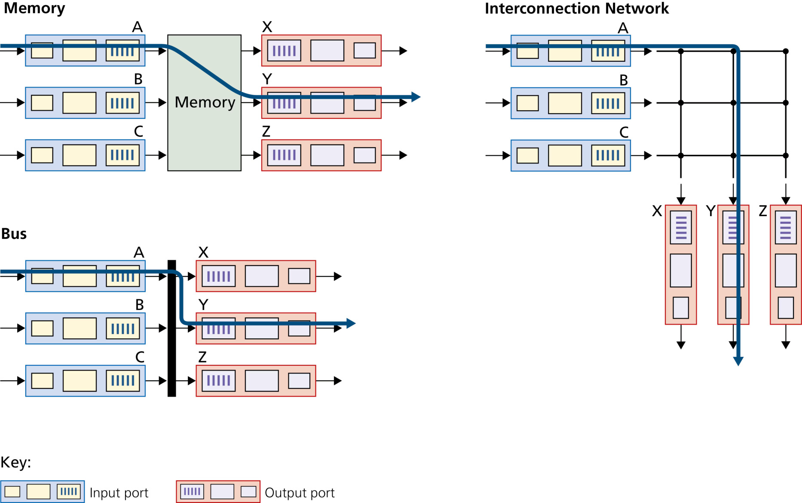


- **经内存交换（switching via memory）**：最早、最简单的路由器本质是传统计算机，输入/输出端口是传统设备。输入端口用中断通知路由处理器，分组被复制到处理器内存；处理器提取目的地址、查转发表、把分组复制到输出端口缓存。**瓶颈**：若内存带宽限制为每秒最多 B 个分组，则总转发吞吐量必须低于 B/2；且共享系统总线同一时刻只能做一次内存读写，即使两个分组目的端口不同也不能同时转发。现代经内存交换的路由器把查找与存储放在输入线路卡上完成，类似共享内存多处理器。
- **经总线交换（switching via a bus）**：输入端口直接经 **共享总线** 把分组送往输出端口，无需路由处理器介入：输入端口给分组加一个 **交换机内部标签**（指明目标输出端口），把分组送上总线；所有输出端口都收到分组，但只有标签匹配的端口保留它，随后移除标签。**瓶颈**：同一时刻总线上只能有一个分组——若多个输入端口同时到达分组，除一个外其余都要等待。对小型局域网与园区网路由器通常够用。
- **经互连网络交换（switching via an interconnection network）**：克服单总线带宽限制，使用多处理器互连中使用的 **纵横式交换机（crossbar switch）**：N 条水平总线与 N 条垂直总线在 **交叉点（crosspoint）** 相交，交叉点由交换结构控制器开合——只要目的端口不同，多个分组可 **并行** 穿越交叉点。更复杂的互连网络用 **多级交换元件**，允许不同输入端口的多个分组 **同时** 去往同一个输出端口（如 Cisco CRS 的三级无阻塞交换策略）。还可以 **并行运行多个交换结构**：输入端口把分组切成小块「喷洒」到多条并行织物上，输出端口再重组。

### 输出端口处理

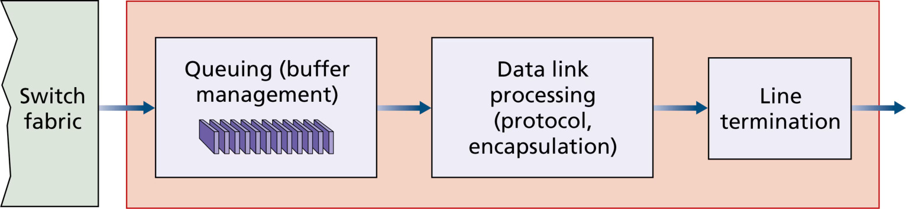

输出端口处理：取出存储在输出端口内存中的分组，经输出链路发送。包括 **选择（调度）并出队** 待发送分组，以及执行必要的链路层与物理层发送功能。

### 排队出现在哪里

输入与输出端口都会形成队列——就像环岛类比中，车既可能在入路等待（输入排队），也可能在出口等待（输出排队）。排队的位置与规模取决于流量负载、交换结构相对速度与线路速率。队列一旦增长到耗尽内存，就会发生 **丢包**——此前我们说分组「在网络中丢失」「在路由器被丢弃」，实际丢弃就发生在这里。

**输入排队（input queueing）与 HOL 阻塞**：若交换结构不够快（相对输入线路速率），分组不得不在输入端口排队等待穿越织物。考虑纵横式交换结构的极端情形：两个输入队列队首的分组恰好要送往 **同一个输出端口**，则交换结构一次只能传输一个，另一个必须等待。更要命的是：设图 4.8 中左下队列队首的分组被阻塞，那么排在它后面的第二个分组 **即使目的端口空闲（中右输出端口）也必须等待**——因为队首分组挡住了去路。

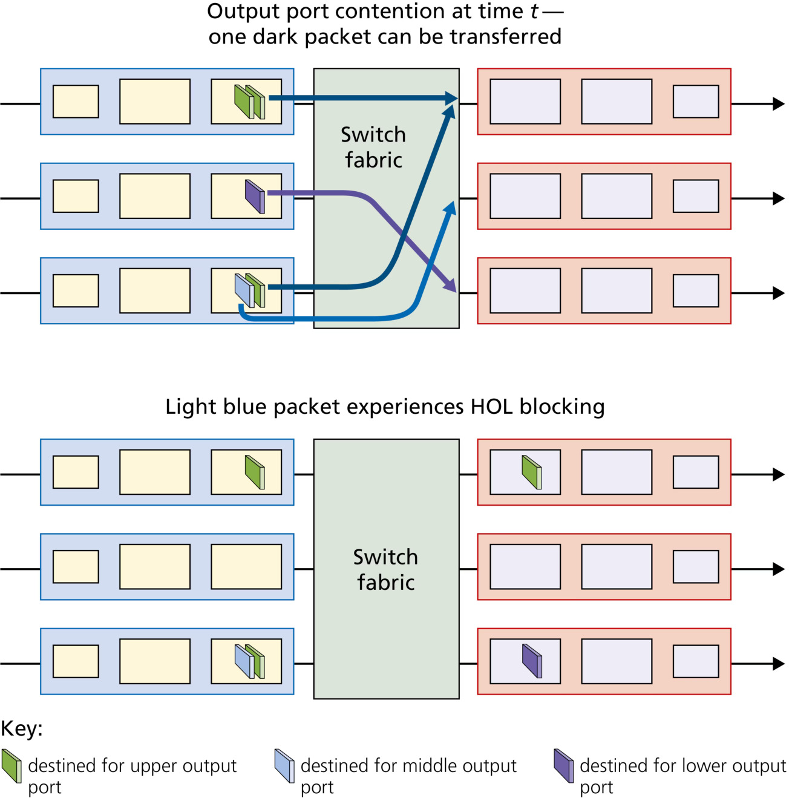

这一现象称为 **队头阻塞（HOL blocking，Head-Of-the-Line blocking）**：输入队列中的一个分组因被队首分组阻塞而等待穿越织物，尽管它的目的输出端口是空闲的。研究表明，在输入排队交换机中，一旦输入链路的到达率仅达到其容量的约 58%，HOL 阻塞就会使输入队列无限增长（等价于严重丢包）。

**输出排队（output queueing）**：即使交换结构比端口线路快 N 倍，若 N 个输入端口的分组恰好都去往同一个输出端口，那么在输出端口发送一个分组的时间内，会到达 N 个新分组——它们只能在输出端口排队。因此 **输出排队在交换结构足够快时依然发生**，最终耗尽输出端口内存。

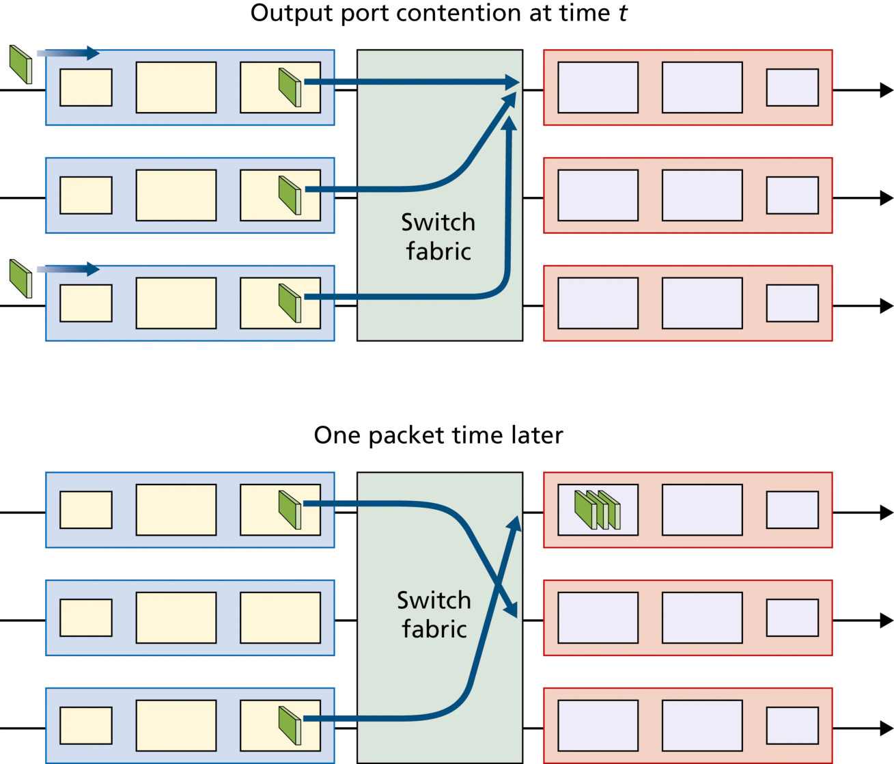

**缓存溢出时的取舍**：内存不足时，要么丢弃新到达的分组（**drop-tail** 策略），要么移走一个或多个已排队分组为新分组腾位。有时在缓存满之前就丢弃或 **标记** 分组，以向发送方提供拥塞信号（可用第 3 章学的 **显式拥塞通知 ECN** 位）。这类主动丢弃/标记策略统称 **主动队列管理（AQM，Active Queue Management）**，最著名的是 **随机早期检测（RED，Random Early Detection）**，以及较新的 PIE、CoDel。

**缓冲区多大才「够」？** 多年来的经验法则（RFC 3439）：缓冲量 ≈ 平均 RTT × 链路容量（如 RTT 250 ms 的 10 Gbps 链路需 2.5 Gb 缓冲）。但近年理论表明，当大量独立 TCP 流通过一条链路时，所需缓冲可大幅降低。**缓冲是一把双刃剑**：更多缓冲吸收突发、降低丢包，但也意味着更长的排队时延——对游戏与交互式视频会议，几十毫秒都至关重要；缓冲过量还会使 TCP 发送方对早期拥塞反应迟钝。**缓冲像盐**：适量让菜更好吃，过量则无法下咽。

**Bufferbloat**：图 4.10 展示了「缓冲膨胀」现象——家路由器出口队列持续排满，端到端管道已满（以瓶颈速率逐包交付），但排队时延恒定而持久，即使家里没有其他流量。游戏玩家抱怨延迟，家长（即使会用 Wireshark）也困惑不已。这说明不仅吞吐量重要，**最小延迟同样重要**。DOCSIS 3.1 标准专门加入 AQM 机制来对抗 bufferbloat。

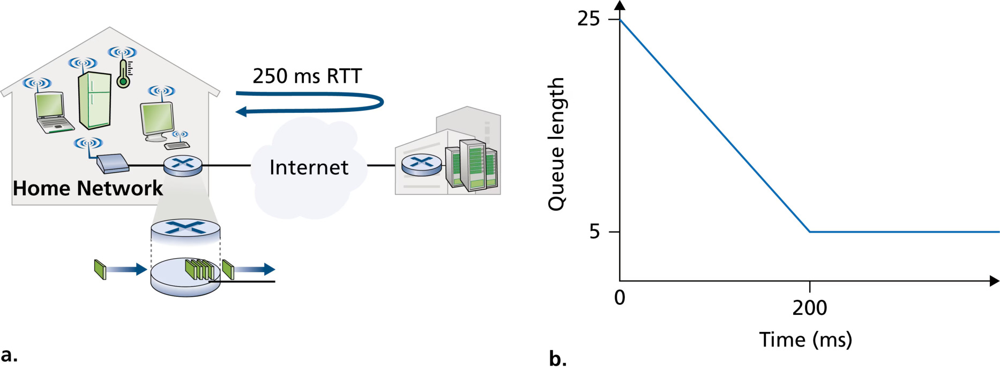

### 分组调度

输出端口的排队使我们面临一个新问题：**队列中的分组以什么顺序发送？** 排队论里叫「排队纪律（queueing discipline）」，路由器的分组调度器负责作答。

**① FIFO（先进先出）**：也叫 FCFS（先到先服务）。分组按到达输出队列的先后顺序被选择发送——大家都很熟悉：到达者排在队尾，保持顺序，到达队首时被服务。图 4.11 是 FIFO 的排队模型抽象（到达的分组若链路忙则等待；若缓冲不足则按丢弃策略处理）。


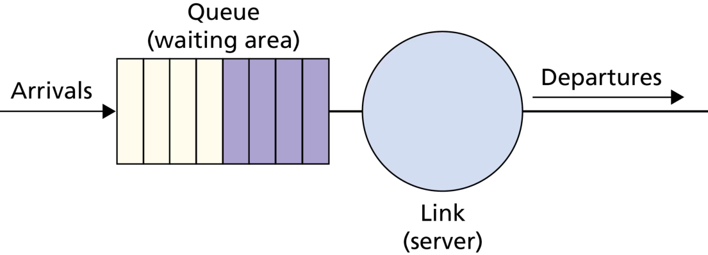


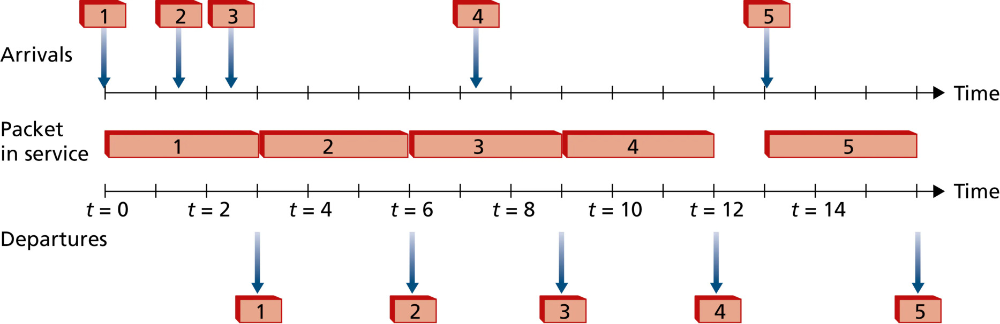

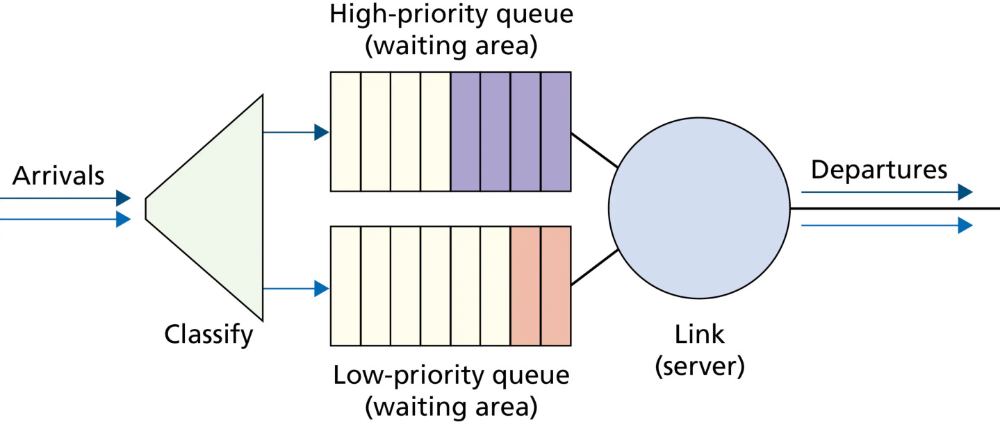

图 4.12 展示 FIFO 的运行：上时间轴箭头表示分组到达（编号即到达顺序），下时间轴表示离开，矩形水平长度表示传输耗时（假设每包 3 个时间单位）。分组按到达顺序离开；分组 4 离开后链路空闲，直到分组 5 到达。

**② 优先级排队（priority queuing）**：到达分组先被分类进 **优先级类**，每类通常有自己的队列。发送时，调度器 **总是从非空最高优先级队列取包**，同类内部按 FIFO。实践中网络管理信息（如按端口号识别）可优先于用户流量；实时 VoIP 可优先于电子邮件等非实时流量。注意优先级排队 **可能饿死低优先级流量**——只要高优先级队列持续非空，低优先级就永无发送机会。


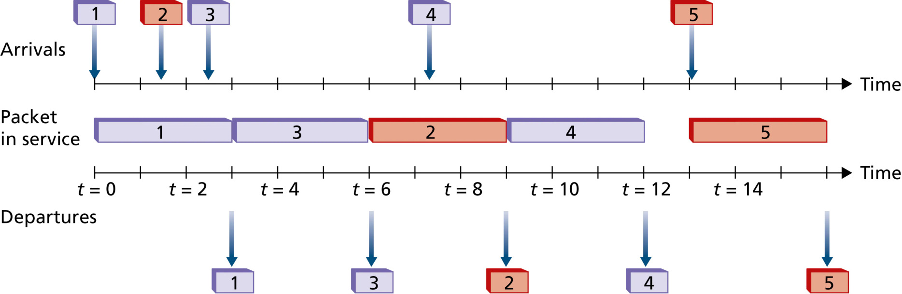

图 4.14 是两优先级队列的运行示例：分组 1、3、4 属高优先级，2、5 属低优先级。分组 1 到达时链路空闲立即发送；期间 2（低）、3（高）到达；分组 1 发完后，**先发 3（高优先级）而非先到的 2（低优先级）**；随后发 2。低优先级分组 5 在分组 2 发送期间到达——在 **非抢占式** 优先级排队下，正在发送的分组不被中断，5 只能等 2 发完再发送。

**③ 轮询（round robin，RR）**：分组同样按类排队，但各类 **轮流获得服务**，没有固定优先级。最简形式：一类发一个分组，轮到下一类发一个，循环往复。**工作保持（work-conserving）** 的轮询调度器绝不空闲——某类队列为空时立即检查序列中的下一类。

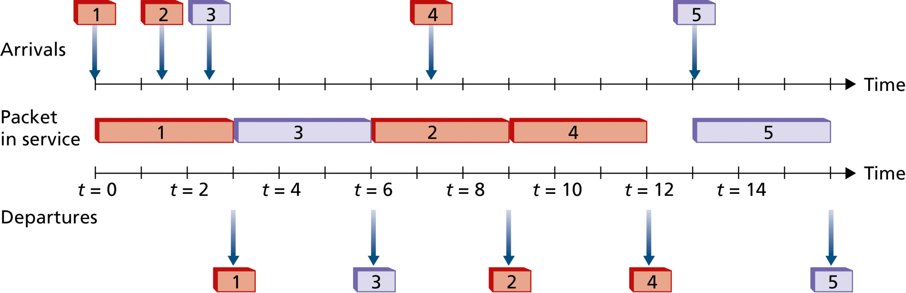

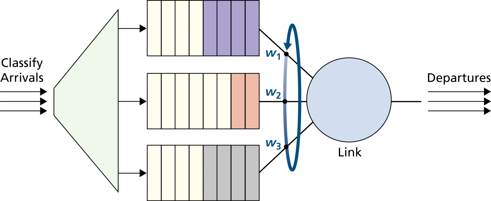

**④ 加权公平排队（WFQ，Weighted Fair Queuing）**：轮询的推广，图 4.16。每类分配一个 **权重 w_i**；在任何时间间隔内，类 i 保证获得的服务比例 = w_i / (所有非空类权重之和)。最坏情况下（所有类都有排队分组），类 i 仍保证获得 w_i / (Σ所有类 w_j) 的带宽。因此对速率为 R 的链路，类 i 的吞吐量至少为 R × w_i / Σw_j。


**网际网络中立性（Net Neutrality）** 的争论正是建立在分组调度之上：ISP 可以用优先级/WFQ 对流量类别区别对待，甚至依据源 IP 地址为付费公司提供优先服务或阻断某国流量。美国 FCC 2015 年「开放互联网」法令确立三条原则：**不得阻塞（No Blocking）**、**不得限速（No Throttling）**、**不得付费优先（No Paid Prioritization）**；该法令在 2017 年被废止、2024 年又基本恢复。技术手段（分组调度）本身中立，政策法规决定 ISP 能用它做什么。

---

## 4.3 网际协议 IP：IPv4、编址、IPv6 与更多

**核心概念③：IPv4 编址与 CIDR** —— 32 位地址、点分十进制；分类编址（A/B/C/D/E）与默认掩码；子网划分（从主机号借位）；CIDR 无类编址（网络前缀任意长度）与路由聚合（一条前缀代表多个网络）；查找时用 **最长前缀匹配**。CIDR 划分/地址判断在 408 中考频高达 **9 次**（2023#39、2022#35、2021#35、2019#37、2017#38、2012#39、2011#38、2010#37、2017#36），是本章 **必考的** 计算核心，必须把每个换算刻进脑海。

目前因特网使用两个版本的 IP：广泛部署的 **IPv4**（RFC 791）与旨在取代它的 **IPv6**（RFC 2460、4291）。本节先讲 IPv4 数据报格式，再讲编址，最后讲 IPv6 与过渡。

### IPv4 数据报格式

因特网网络层的分组称为 **数据报（datagram）**。IPv4 数据报的格式如图 4.17，关键字段如下（**408 必背**）：

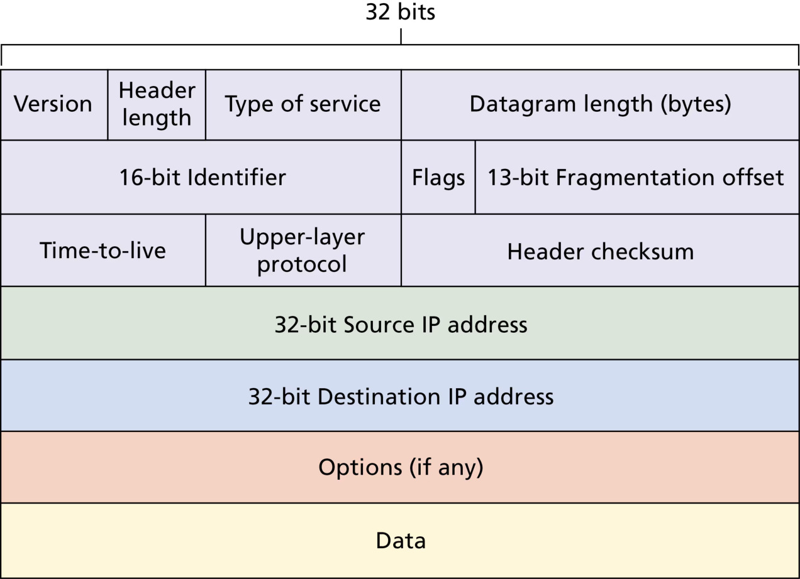

- **版本（version，4 位）**：IP 协议版本号。IPv4 数据报中该字段值为 **4**；路由器据此确定如何解释数据报其余部分。
- **首部长度（header length，4 位）**：以 **4 字节（4B）为单位**。因 IPv4 首部长度可变（含可选项），必须显式指出载荷起点。最大可表示首部长度 = 15 × 4B = **60B**；最常用首部长度是 **20B**（字段值 = 5，即 5 × 4B），此时不含选项。**口诀：首部长度单位 4B、总长度单位 1B、片偏移单位 8B。** 正常 IP 首部前两个字节以 0x45 开头，可用于定位 IP 数据报起点。
- **区分服务 / 服务类型（TOS，8 位）**：允许区分不同类型的 IP 数据报（如区分实时数据报与非实时流量）；其中 2 位用于 **显式拥塞通知 ECN**（见第 3 章）。
- **总长度（datagram length，16 位）**：IP 数据报（首部 + 数据）的 **总字节数**，单位 1B。理论最大值 = 2¹⁶ - 1 = **65535B**。以太网帧的 **MTU = 1500B**，因此封装成帧时数据报总长度不能超过下层数据链路层的 MTU。
- **标识（identifier，16 位）**：计数器，每产生一个数据报加 1 并赋给标识字段。它 **不是序号**（IP 是无连接服务），而是供分片重组使用：分片时每个片都复制原数据报的标识号。
- **标志（flags，3 位）**：只有后 2 位有意义——**DF（Don't Fragment）** 与 **MF（More Fragment）**。DF = 1 表示禁止分片（超过 MTU 则丢弃并回 ICMP 差错报文）；MF = 1 表示后面还有分片，MF = 0 表示最后一个分片。
- **片偏移（fragment offset，13 位）**：指出某片的数据部分在 **原数据报数据部分** 中的相对位置，单位 **8B**。除最后一个分片外，每个分片的数据部分长度必须是 **8B 的整数倍**。
- **生存时间（TTL，8 位）**：数据报在网络中可通过的路由器数最大值。路由器转发前先将 TTL 减 1，**若减为 0 则丢弃该数据报**（并向源发送 ICMP 时间超过报文），确保数据报不会因路由环路无限循环。**高频考点**（2014、2024 命题追踪：TTL 字段的分析与计算）。
- **协议（protocol，8 位）**：指出数据部分应交给哪个上层协议。值为 **6** 表示 TCP，值为 **17** 表示 UDP（如第 3 章所述，还可能是 ICMP 等）。协议号在网络层的作用类似端口号在传输层的作用——**协议号是把网络层与传输层粘合的胶水**。
- **首部校验和（header checksum，16 位）**：只检验 **首部**（不含数据部分），用二进制反码和（与 TCP/UDP 校验和方法相同，溢出回卷后取反码）。**每经过一台路由器都必须重新计算**——因为 TTL（可能还有选项）发生了变化。问「为什么 TCP/IP 在传输层和网络层都做差错检验」：① IP 只校验首部，TCP/UDP 校验整个报文段；② TCP 可以跑在 IP 之外的其他网络层协议上，IP 也可能承载非 TCP/UDP 的数据。
- **源地址 / 目的地址（各 32 位）**：源主机创建数据报时填入自己的 IP 地址与最终目的地址（通常经 DNS 查询获得）。
- **选项（options，可变）**：允许扩展首部，但设计意图是 **极少使用**（省开销），因此几乎总是 20B 首部。

IP 数据报首部共 **20B**（无选项）；若携带 TCP 报文段，则每数据报共 20B（IP 首部）+ 20B（TCP 首部）+ 应用数据。

**常见错误：片偏移、首部长度、总长度的单位混淆。** 这是 408 必考陷阱——IP 首部中 **三个长度字段的单位不同**：**首部长度字段** 以 **4B** 为单位（值 5 → 20B；最大 15 → 60B）；**总长度字段** 以 **1B** 为单位（最大 65535B）；**片偏移字段** 以 **8B** 为单位（片偏移值 100 → 数据首字节编号 800）。分片计算的三步曲：① 用 (MTU - 20) 得到每片最大数据长度，**向下取整到 8 的倍数**；② 数据总长除以每片数据长，向上取整得分片数；③ 片偏移 = 累计数据字节数 ÷ 8。**除最后一个分片外，每片数据长度必须是 8B 的整数倍。**

#### IPv4 分片计算

一个链路层数据帧能承载的最大数据量称为 **最大传送单元（MTU）**。IP 数据报被封装在链路层帧中，因此链路层 MTU 严格限制 IP 数据报长度；且源与目的路径上的各段链路可能使用不同链路层协议、具有不同 MTU（以太网 1500B，许多广域网不超过 576B）。当 IP 数据报总长度大于链路 MTU 时，数据部分被分装在多个较小的数据报中，这些较小的数据报称为 **片（fragment）**。

**片在目的主机重组**，不在中间路由器重组——因为各片可能经不同路径到达，中间路由器无法保证收集到全部片。目的主机用 **标识、标志、片偏移** 三个字段完成重组：标识号相同的片属于同一原始数据报；MF 指明是否还有后续片；片偏移确定片在原始数据报中的位置。

!!! example "例题 1：IPv4 数据报分片计算（真题 2021#35 同源改编）"

    一个长 **4000B** 的 IP 数据报（首部 20B，数据部分 3980B）到达一个路由器，需要转发到一条 **MTU = 1500B** 的链路上。假定原始数据报的标识号为 777。

    （1）应分为几个片？各片的数据字段长度分别为多少？

    （2）各片的 DF、MF 标志位取值如何？片偏移字段的值分别为多少？

    （3）若目的主机收到片偏移为 185、MF = 0 的片，能否断定它属于分片？为什么？

    ??? answer "查看答案"
        **（1）分片数与数据长度。** 每片都是独立 IP 数据报，含 20B 首部。每片最大数据长度 = 1500 - 20 = 1480B。1480 是 8 的整数倍（1480 ÷ 8 = 185），满足片偏移单位要求。

        数据部分共 3980B：1480 + 1480 = 2960，剩余 3980 - 2960 = 1020B（1020 不必是 8 的倍数，因为它是最后一片）。故分为 **3 个片**，数据字段长度依次为 **1480B、1480B、1020B**。

        **（2）标志与片偏移。** 只有 DF = 0 才允许分片，故 **DF 全为 0**。MF：前两个片后面还有分片，MF = **1**；最后一个片 MF = **0**。

        片偏移 = 该片数据首字节在原数据部分中的相对位置 ÷ 8：

        - 片 1：偏移 0 ÷ 8 = **0**
        - 片 2：偏移 1480 ÷ 8 = **185**
        - 片 3：偏移 2960 ÷ 8 = **370**

        片 2 的片偏移为 185，与 MF = 1 一起确认「这是第 2 片，后面还有」。

        **（3）不能断定是分片。** 片偏移 = 185 > 0 且 MF = 0，只能确定「它是分片序列中的最后一个片」；但片偏移 = 0 且 MF = 0 时，既可能是 **未分片的独立数据报**，也可能是分片的 **第一片也是唯一一片**。只有「MF = 0 且片偏移 > 0」才能确定是分片的最后一片。

    ??? success "评分标准"

        - 每片最大数据长度 1480B 且为 8 的倍数（3 分）
        - 分片数 3、各片数据长度 1480/1480/1020（3 分）
        - DF=0、MF=1/1/0 正确（2 分）
        - 片偏移 0/185/370 计算正确（3 分）
        - （3）「不能断定」及理由（3 分）

    本题改编自 2021 统考真题（MTU = 800B、总长 1580B 的类似计算，答案第 2 片总长 796、MF = 1）与王道综合应用题的经典 4000B/1500B 例题。

### IPv4 编址

**IP 地址** 是分配给连接到互联网的每台主机（或路由器）的 **每个接口** 的一个全球唯一 32 位标识符。注意措辞：**IP 地址与接口（interface）相关联**，而非与主机/路由器本身相关联——一台路由器有多个接口，就有多个 IP 地址。为方便书写，32 位地址分成 4 段、每段 8 位，写成十进制并以点分隔，即 **点分十进制记法（dotted-decimal notation）**。例如二进制 11000001 00100000 11011000 00001001 = 193.32.216.9。

一个关键概念是 **子网（subnet）**。图 4.18 展示了一个路由器（3 个接口）互连 7 台主机的例子：左上角 3 台主机与路由器接口的 IP 地址左 24 位相同（形如 223.1.1.xxx），它们之间由 **不含路由器的网络** 相连（以太网交换机或无线接入点）。


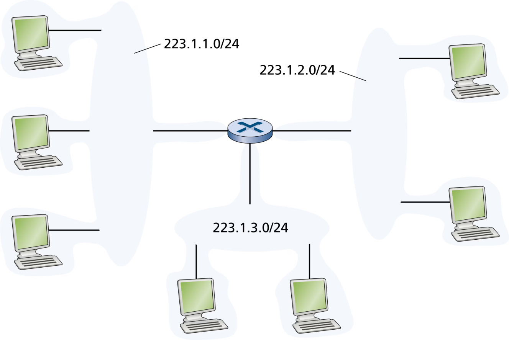


**子网的定义**：把每台主机的接口与其主机/路由器 **分离**，形成若干隔离的「岛」，每个岛就是一个 **子网（subnet）**（RFC 950；也称 IP 网络或直接称网络）。子网内部的主机可直接相互通信（无需路由器），子网之间的通信必须经过路由器。图 4.18 中，这个「岛」（3 个主机接口 + 1 个路由器接口）构成一个子网，其子网地址为 223.1.1.0/24——**/24 表示左边 24 位定义子网地址**，这种记法也叫 **子网掩码（subnet mask）**，掩码 = 255.255.255.0。


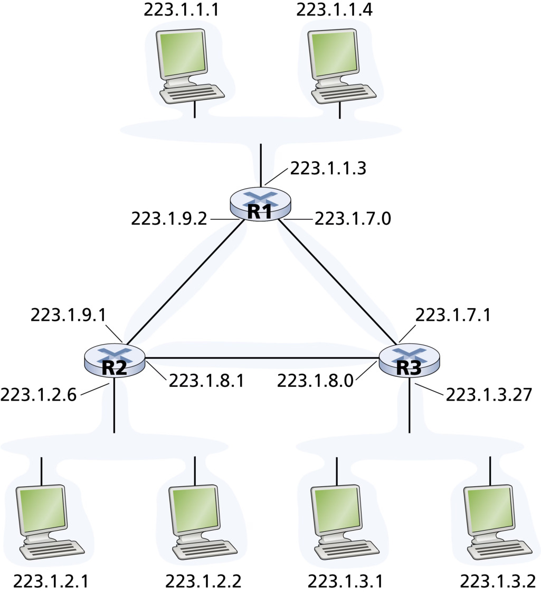

图 4.19 标出图 4.18 中的三个子网：223.1.1.0/24、223.1.2.0/24、223.1.3.0/24。**判断子网的标准程序**：把每个接口从主机/路由器上摘下来，形成隔离网络的「岛」，每个岛就是一个子网。图 4.20 中三台路由器由点对点链路互连，除三个「主机侧」子网外，**每条点对点链路自身也是一个子网**（接口 223.1.9.2/223.1.9.1、223.1.8.1/223.1.8.2、223.1.7.1/223.1.7.2）——共 6 个子网。


#### 分类编址

在 CIDR 之前，网络部分长度被 **强制固定为 8、16 或 24 位**，即 **分类编址（classful addressing）**：子网为 A、B、C 类网络。32 位地址的类别由最高位确定：

| 类别 | 首字节范围 | 网络号位数 | 主机号位数 | 默认子网掩码 | 每网络最大主机数 |
|:---|:---|:---:|:---:|:---|:---:|
| **A 类** | 1 ~ 126（0 开头） | 8 | 24 | 255.0.0.0 | 2²⁴ - 2 |
| **B 类** | 128 ~ 191（10 开头） | 16 | 16 | 255.255.0.0 | 2¹⁶ - 2 |
| **C 类** | 192 ~ 223（110 开头） | 24 | 8 | 255.255.255.0 | 2⁸ - 2 = 254 |
| **D 类** | 224 ~ 239（1110 开头） | — | — | — | 多播地址 |
| **E 类** | 240 ~ 255（1111 开头） | — | — | — | 保留 |

**特殊 IP 地址**（不作为普通主机地址）：① 主机号全 0 表示本网络本身（如 202.98.174.0）；② 主机号全 1 表示本网络的广播地址（直接广播地址，如 202.98.174.255）；③ **127.x.x.x** 保留为本地软件环回测试（loopback test），本主机不会把目的为环回地址的数据报发送到任何网络；④ 32 位全 0（0.0.0.0）表示本网络上的本主机（DHCP 客户源地址）；⑤ 32 位全 1（255.255.255.255）表示 **受限广播地址**，只在本网络广播，路由器一律不转发。

分类编址的两个致命问题：① **C 类太小**（最多 254 台主机，且 2 个保留），许多组织不够用；② **B 类太大**（最多 65534 台），一个只有数千主机的组织被分配 B 类地址，浪费数万个地址，导致 B 类空间快速枯竭、分配利用率低下。

#### 子网划分

从 1985 年起，IP 地址增加了「子网号」字段，使两级地址（网络号 + 主机号）变成三级（网络号 + 子网号 + 主机号），即 **划分子网（subnetting）**：**从主机号借用若干位作为子网号**，主机号相应减少相同位数。划分子网纯属单位内部事务，对外仍表现为一个网络。路由器转发仍依据目的网络号；本单位路由器再按网络号 + 子网号找到目的子网，最后交付给目的主机。

**子网掩码（subnet mask）** 是一个与 IP 地址对应的 32 位串：一串 1 后跟一串 0，**1 对应网络号与子网号，0 对应主机号**。主机或路由器把 IP 地址与子网掩码逐位「与」（AND），即得子网的网络地址。例如 192.168.5.56 与掩码 255.255.255.0 相与得 192.168.5.0。

**默认网关（default gateway）**：子网与外部网络连接的设备，即连接本子网的路由器接口 IP 地址。主机发送数据时：用目的 IP 与自己的子网掩码相与，判断目的主机是否在子网内——**在子网内则直接发送，不在则发给默认网关**，由网关转发。**高频考点**（2015、2016、2019、2022 命题追踪：默认网关与子网掩码的配置分析）。

**划分子网要点（408 常考）**：① 子网中主机号全 0 的地址是子网的 **网络地址**，主机号全 1 的地址是子网的 **广播地址**，均不能指派给主机；② 划分子网增加了灵活性，但 **减少了能够连接在网络上的主机总数**；③ 同属一个子网的所有主机及路由器相应端口必须设置 **相同** 的子网掩码；④ 路由器的路由表包含：目的网络地址、子网掩码、下一跳地址。

**划分子网的两类方法**：

- **定长子网掩码**：所有子网用相同掩码、分配相同数量地址。简单但浪费（按最大需求定块）。
- **变长子网掩码（VLSM）**：各子网可用不同掩码、地址数量可不同，按需分配，减少浪费。**建议从大的子网开始划分**。

!!! example "例题 2：子网划分（给定 /24 地址块划分 4 个子网）"

    某单位拥有 CIDR 地址块 **208.115.21.0/24**，有三个部门，主机台数分别为 59、20、5（各含 1 个路由器接口地址，即分别需要 60、21、6 个 IP 地址）。

    （1）采用 **定长子网掩码** 划分子网，给出划分方案、各子网地址与子网掩码。

    （2）改用 **变长子网掩码**，给出一种更省的划分方案。

    ??? answer "查看答案"
        **（1）定长子网划分。** 三个部门共需 60 + 21 + 6 个地址。从主机号借用 2 位作子网号（2² = 4 个子网），每子网主机号剩 6 位，可分配 2⁶ - 2 = **62 个地址**，满足最大需求 60。

        四个子网（后 8 位二进制展开）：

        - 208.115.21.**000000** 00 → 208.115.21.0/26，分配给部门 1（需求 60 ≤ 62）
        - 208.115.21.**010000** 00 → 208.115.21.64/26，分配给部门 2
        - 208.115.21.**100000** 00 → 208.115.21.128/26，分配给部门 3
        - 208.115.21.**110000** 00 → 208.115.21.192/26，留作以后用

        子网掩码：255.255.255.11000000 = **255.255.255.192**（即 /26）。

        **（2）变长子网划分。** 按主机号位数：部门 1 需 6 位主机号（2⁶-2=62 ≥ 60）→ /26；部门 2 需 5 位（2⁵-2=30 ≥ 21）→ /27；部门 3 需 3 位（2³-2=6 ≥ 6）→ /29。从大到小划分：

        - 208.115.21.0/26（掩码 255.255.255.192）→ 部门 1，可分配 62 个
        - 208.115.21.64/27（掩码 255.255.255.224）→ 部门 2，可分配 30 个
        - 208.115.21.96/29（掩码 255.255.255.248）→ 部门 3，可分配 6 个
        - 剩余 256 - 64 - 32 - 8 = 152 个地址留用

        变长划分方案不唯一（也可从另一侧开始），但 **子网地址必须从主机号全 0 的边界开始**，且各子网不重叠。本例 208.115.21.64/27 覆盖 .64~.95，208.115.21.96/29 覆盖 .96~.103，互不重叠。**注意**：/26、/27、/29 与 /24 前缀重叠使用（前 24 位相同的单位地址块内），正是 CIDR 允许「分配到的地址块内部再划分子网」的体现。

    ??? success "评分标准"

        - 定长：借 2 位 → 4 子网 /26（2 分）
        - 定长：四个子网地址 + 掩码 255.255.255.192（3 分）
        - 定长：每子网 62 个可分配地址、满足 60/21/6 需求（2 分）
        - 变长：主机号位数分析 6/5/3（3 分）
        - 变长：/26 + /27 + /29 划分方案与剩余 152（3 分）
        - 说明不唯一、不重叠原则（2 分）

#### CIDR 与路由聚合

**无分类域间路由选择（CIDR，Classless Inter-Domain Routing，读作「cider」）**（RFC 4632）消除了传统 A、B、C 类地址及划分子网的概念：IP 地址 = {**网络前缀（network prefix）**，主机号}，**网络前缀位数可任意选取**，用 **斜线记法（CIDR 记法）** 写为「IP 地址 / 前缀位数」。例如 128.14.32.5/20：掩码 = 20 个连续的 1 后跟 12 个 0，网络前缀 = 128.14.32.0（前 20 位）。**高频考点**（2011、2015、2016、2019、2023 命题追踪：CIDR 地址块分析）。

**CIDR 地址块**：网络前缀都相同的连续 IP 地址组成一个 CIDR 地址块。已知地址块内任一地址，即可求出块的最小地址（主机号全 0）、最大地址（主机号全 1）与地址数（2^主机号位数）。例如 128.14.32.5/20 所在地址块：最小 128.14.32.0、最大 128.14.47.255，共 2¹² = 4096 个地址。**网络前缀越短，地址块越大**。实际可指派地址数通常为 2^N - 2（N = 主机号位数），主机号全 0 是网络号、全 1 是广播地址。**高频考点**（2023#39：最小/最大可分配地址的考查）。

**路由聚合（route aggregation）**：一个大的 CIDR 地址块包含很多小地址块，路由表中可用一个大 CIDR 地址块代表许多小地址块——**路由聚合**（也称路由汇总 route summarization）。它使路由表一个表项代替传统分类地址的多条路由，压缩路由表、提高性能。**高频考点**（2009、2011、2013、2014、2018 命题追踪）。

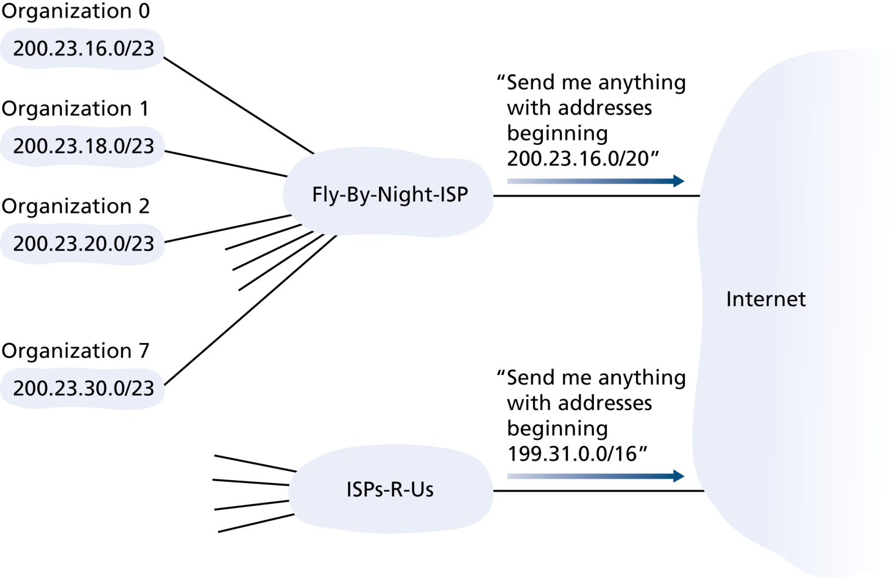

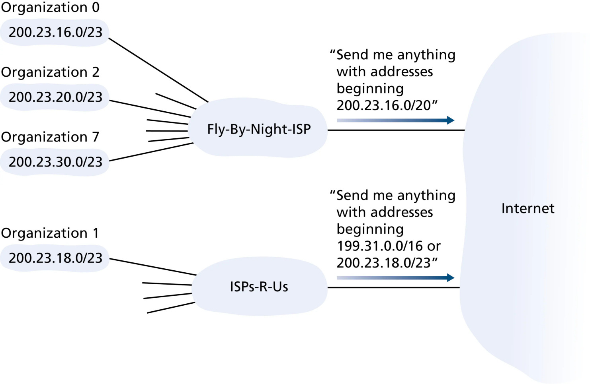

图 4.21 是经典的 Fly-By-Night-ISP 例子：ISP 把地址块 200.23.16.0/20 均分成 8 块给 8 个组织，每组织一个 /23 子块。对 ISP 之外的整个世界，只需一条 **地址聚合** 路由 200.23.16.0/20——外部路由器不必知道块内还有 8 个组织。

但聚合并非总能完美进行。图 4.22：若 Fly-By-Night-ISP 收购了 ISPs-R-Us，而组织 1 的地址落在 ISPs-R-Us 的地址块之外，组织 1 不愿改号（改号昂贵）。此时 Fly-By-Night-ISP 继续通告 200.23.16.0/20，ISPs-R-Us 继续通告自己的地址块，**并额外通告组织 1 的地址块**。外部路由器要路由到组织 1 的地址时，同时匹配两条前缀，将按 **最长前缀匹配** 选择 ISPs-R-Us 通告的更具体前缀——这就是 4.2.1 节最长前缀匹配规则存在的根本原因。


!!! tip "动手试试：交互式演示"

    配套交互 HTML：[子网划分计算器](demos/子网划分计算器.html)、[CIDR 地址计算器](demos/CIDR地址计算器.html)（浏览器打开，输入 IP 与掩码实时计算子网范围与可用地址）。

!!! example "例题 3：CIDR 路由聚合（真题 2018#35 同源改编）"

    某路由表中有转发接口相同的 4 条路由表项，其目的网络地址分别为：

    - 172.18.129.0/24
    - 172.18.130.0/24
    - 172.18.132.0/24
    - 172.18.133.0/24

    将这 4 条路由聚合后，目的网络地址应为多少？

    ??? answer "查看答案"
        聚合即找 4 个地址的 **最长共同前缀**。前 2 个字节完全相同，只需比较第 3 字节的二进制：

        ```text
        129 = 10000001
        130 = 10000010
        132 = 10000100
        133 = 10000101
        ```

        从高位对齐比较：第 3 字节的 **前 5 位** 均为 10000，第 6 位起出现分歧（1、0、1、0 交替）。因此共同前缀长度 = 8 + 8 + 5 = **21 位**。

        聚合后的网络地址 = 共同前缀 + 主机号全 0，第 3 字节 = 10000000 = **128**，即：

        $$ \text{聚合地址} = 172.18.128.0/21 $$

        **验证**：172.18.128.0/21 覆盖 172.18.128.0 ~ 172.18.135.255，包含 129/130/132/133 四个 /24 块且不引入 136 之后的多余网络。

    ??? success "评分标准"

        - 思路：找最长共同前缀（3 分）
        - 4 个第 3 字节二进制展开正确（4 分）
        - 共同前缀 21 位、聚合地址 172.18.128.0/21（5 分）
        - 覆盖性验证（3 分）

    提示：2018 统考真题的类似题聚合 35.230.32.0/21、35.230.40.0/21、35.230.48.0/21、35.230.56.0/21，答案为 35.230.32.0/19（第 3 字节共同前 3 位 001）。

**CIDR 的查找**：CIDR 路由表项由「网络前缀 + 下一跳地址」组成，查找可能命中多条，必须选 **最长网络前缀**——前缀越长、地址块越小、路由越具体。为高效查找，通常把无分类路由表存放在 **层次式数据结构（二叉线索树）** 中，自上而下逐层查找；也可按前缀长度降序排列，从最长的开始查，命中即止。转发表中还有两种特殊路由：**特定主机路由**（目的网络为 ab.c.d/32，匹配优先级最高，常用于网络测试）与 **默认路由**（前缀 0.0.0.0/0，与任何地址相与均为 0，匹配优先级最低，用于连向互联网）。

**路由器转发分组算法（408 背诵级）**：① 提取目的 IP 地址 D；② 先查特定主机路由（/32），命中则转发；③ 否则按前缀长度从长到短，将每行子网掩码与 D 逐位相与，若结果与本行前缀匹配则按该行转发（或直接交付本网络）；④ 都不匹配则走默认路由；⑤ 无默认路由则报告转发错误。注意：**转发表不指明完整路径，只指明下一跳**；且下一跳的 IP 地址需经 **ARP** 转换为 MAC 地址填入帧首部（ARP 详见第 5 章）。

#### DHCP：动态主机配置协议

组织从何处获得地址块？由 ICANN 授权给区域注册机构（ARIN、RIPE、APNIC 等），再逐级分配给 ISP 与组织。而主机从地址块中获得单个地址，**通常用 DHCP（Dynamic Host Configuration Protocol，动态主机配置协议）**（RFC 2131）自动完成。DHCP 让主机自动获得 IP 地址，还可顺带学到 **子网掩码、第一跳路由器（默认网关）地址、本地 DNS 服务器地址**。因自动化了主机入网的全部配置，DHCP 又称 **即插即用（plug-and-play）** 或 **零配置（zeroconf）** 协议——学生带着笔记本从宿舍到图书馆再到教室，每次进入新子网都能自动拿到新地址，无需管理员介入。

DHCP 是 **客户端-服务器** 协议。最简单的场景：每个子网都有一个 DHCP 服务器；若无，则需 **DHCP 中继代理（relay agent）**（通常是路由器）转发。

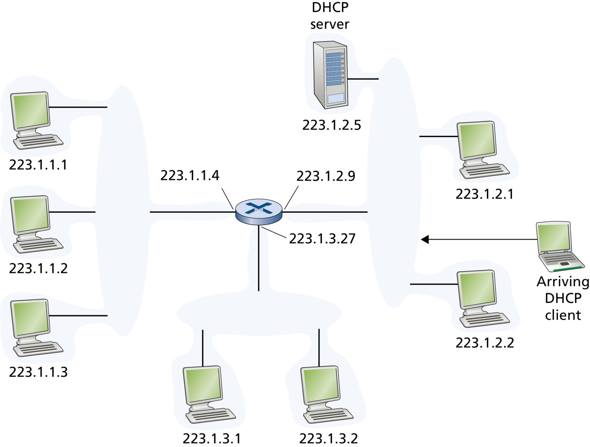


新到主机获取地址的 **四步过程**（图 4.24，yiaddr 表示分配给客户的 IP 地址，即「your Internet address」）：

1. **DHCP 服务器发现（DHCP server discovery）**：新主机发 **DHCP discover 报文**（UDP 目的端口 **67**），封装在 IP 数据报中，**目的 IP = 255.255.255.255（广播）、源 IP = 0.0.0.0（本主机）**，经链路层广播到本子网所有节点。
2. **DHCP 服务器提供（DHCP server offer(s)）**：服务器收到 discover 后回应 **DHCP offer 报文**，仍用广播地址 255.255.255.255 发给子网所有节点。offer 含：收到的 discover 的 **事务 ID**、为客户 **提议的 IP 地址**、网络掩码、**租用期（lease time）**（地址可使用时限）。多个服务器可各发 offer，客户端有挑选权。
3. **DHCP 请求（DHCP request）**：客户从若干 offer 中选一个，回发 **DHCP request 报文**（目的 IP 仍为广播 255.255.255.255，源 IP 0.0.0.0），指明接受哪个服务器（事务 ID）的提议。
4. **DHCP 确认（DHCP ACK）**：被选中的服务器回 **DHCP ACK 报文** 确认分配。此后客户可在租用期内使用该地址；期满前客户可 **续租（renew）** 其租用期。

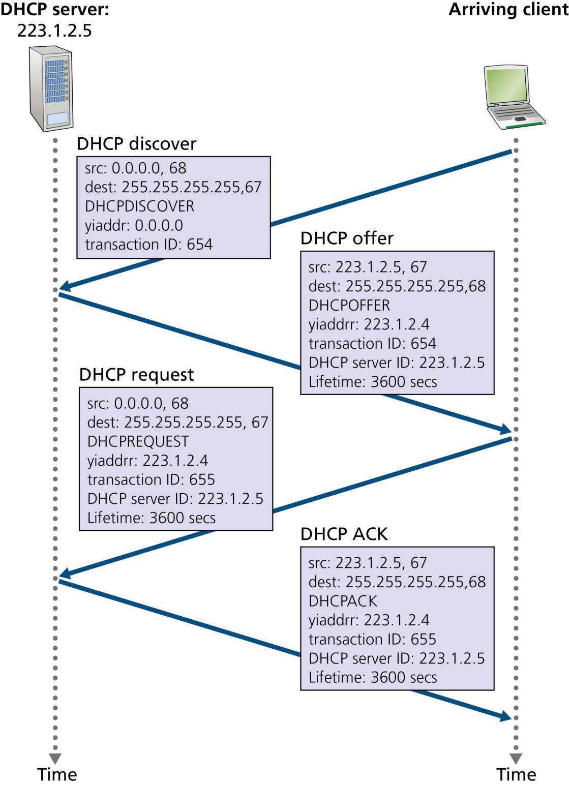

**为什么用 UDP 广播？** ① DHCP 执行初期客户连服务器的 IP 地址都不知道（更不知道目的主机的 IP 地址），只能广播寻找；② 执行中间客户 **尚未获得 IP 地址**，无法单播，也必须广播。**为什么不用 TCP？** TCP 需要先建立连接（三次握手），连对方 IP 都不知道，更不可能通过套接字建立连接。**高频考点**（2015、2022：DHCP 发现报文的源/目的地址 0.0.0.0 与 255.255.255.255；2022：DHCP 发现报文的作用）。

**DHCP 的不足**：节点每次连入新子网都获得新 IP 地址，导致移动节点跨子网移动时无法维持与远程应用的 TCP 连接（移动蜂窝网络用其他机制保留地址，见第 7 章）。

#### 私有地址与 NAT

每个 IP 设备都需要 IP 地址，但家庭（SOHO）网络中的手机、平板、游戏机、打印机……都要地址？ISP 不可能给每个家庭分配一整段公网地址。解决方案是 **网络地址转换（NAT，Network Address Translation）**（RFC 2663、3022）。

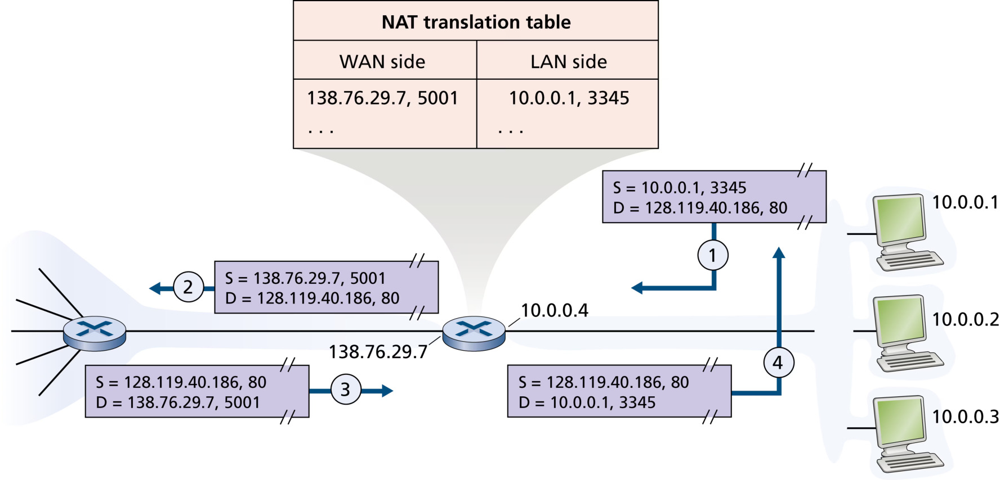

**核心概念④：NAT（网络地址转换）** —— 家庭/企业网络内部使用 **私有地址（private address）**，NAT 路由器把内网流量转换成一个（或少数几个）公网 IP 地址 + 端口号，对外隐藏整个内网。私有地址可重用、节省公网地址、隐藏内网结构。三个私有地址块（RFC 1918）：**10.0.0.0/8、172.16.0.0/12、192.168.0.0/16**。**互联网中的所有路由器对目的地址是私有地址的数据报一律不转发**。**高频考点**（NAT 原理：2016、2019、2020、2023）。

图 4.25 中，NAT 路由器（家庭网关）WAN 侧接口有公网地址 138.76.29.7，LAN 侧子网为 10.0.0.0/24（私有地址段）。**对外界，NAT 路由器像一台单一设备**：所有离开家庭网络去往因特网的流量源地址都是 138.76.29.7，所有进入的流量目的地址也都是 138.76.29.7——NAT 把家庭网络的细节全部隐藏。

**NAT 转换表（NAT translation table）**：若所有来自 WAN 的数据报目的地址都相同，路由器如何知道该转发给内网哪台主机？窍门是：**转换表中同时记录 IP 地址与端口号**。设家庭网络中 10.0.0.1 的主机（源端口 3345）请求 Web 服务器 128.119.40.186（端口 80）：

1. 主机把数据报发往 LAN（源 IP 10.0.0.1、源端口 3345）。
2. NAT 路由器收到后：**生成一个新源端口号 5001**，把源 IP 改为 WAN 侧地址 138.76.29.7、源端口改为 5001，并在转换表中增加表项 **（WAN 端 138.76.29.7:5001 ↔ LAN 端 10.0.0.1:3345）**。
3. Web 服务器不知内情，响应数据报的目的地址是 NAT 路由器的 138.76.29.7、目的端口 5001。
4. 响应到达 NAT 路由器后，**用目的 IP + 目的端口（138.76.29.7, 5001）索引转换表**，把目的 IP 改为 10.0.0.1、目的端口改为 3345，转发到内网浏览器。

因为端口号字段 16 位，**NAT 协议用一个 WAN 侧 IP 地址可支持超过 6 万个并发连接**。NAT 路由器对外仍是一台 L3 路由器，但 **转发时必须查看并改写传输层的端口号**——这正是网络中立性与架构纯粹主义者批评 NAT 的地方：**路由器本应只处理到网络层，NAT 却越界修改了传输层端口号**（4.5 节中间盒讨论）。

**运营商级 NAT（Carrier-grade NAT）**：ISP 也用 NAT 给家庭网关路由器分配私有地址，数据报经两级 NAT 到达互联网；RFC 6598 为 ISP 专用新增了私有地址块 100.64.0.0/10，避免与家庭 NAT 的地址块重叠。

!!! example "例题 4：NAT 转换表操作（真题 2023#40 同源改编）"

    某家庭网络通过 NAT 路由器接入互联网，NAT 路由器 WAN 侧接口的公网 IP 地址为 138.76.29.7。内网主机 10.0.0.1（源端口 3345）向 Web 服务器 128.119.40.186（端口 80）发送 HTTP 请求。

    （1）NAT 路由器为此次连接生成新源端口号 5001。写出 NAT 路由器收到请求后建立的转换表项。

    （2）Web 服务器回送的响应数据报中，目的 IP 与目的端口分别是多少？

    （3）若内网另一台主机 10.0.0.2 也要与同一 Web 服务器通信，NAT 路由器如何区分两条连接？

    ??? answer "查看答案"
        **（1）转换表项。** NAT 转换表以四元组记录映射（WAN 端 ↔ LAN 端）：

        | WAN 端 IP | WAN 端端口 | LAN 端 IP | LAN 端端口 |
        |:---|:---:|:---|:---:|
        | 138.76.29.7 | 5001 | 10.0.0.1 | 3345 |

        **（2）响应数据报。** 服务器只看到「来自 138.76.29.7:5001」的请求，其响应数据报的 **目的 IP = 138.76.29.7（NAT 路由器 WAN 接口）、目的端口 = 5001**。数据报到达 NAT 路由器后，用（138.76.29.7, 5001）索引转换表，把目的 IP 改写为 10.0.0.1、目的端口改写为 3345，再转发给内网主机。

        **（3）区分多条连接。** 每条内网连接分配 **不同的 WAN 侧端口号**。若 10.0.0.2:4000 发起新连接，NAT 路由器分配一个未被占用、不同于 5001 的端口（如 5002），建立第二条表项（138.76.29.7:5002 ↔ 10.0.0.2:4000）。回送数据报靠 **目的端口号** 区分应送往哪台内网主机。一个 16 位端口号字段支持超过 6 万个并发连接。

    ??? success "评分标准"

        - 转换表项四元组正确（4 分）
        - 响应目的 IP/端口 = 138.76.29.7:5001（3 分）
        - 靠不同 WAN 端口号区分连接（4 分）
        - 指出端口号字段 16 位、支持大量连接（3 分）

    **核心原理（对比普通路由器）**：普通路由器转发分组时 **源/目的 IP 地址不变**，只改 MAC 地址；NAT 路由器转发时 **必须改写 IP 地址**（源或目的），并查看/改写 **传输层端口号**。普通路由器只工作在网络层，NAT 路由器必须「看到」传输层。

### IPv6

1990 年代初，IETF 意识到 IPv4 地址空间正被快速耗尽（2011 年 2 月 IANA 已把最后的未分配地址池分配给了区域注册机构），开始制定 IPv4 的继任者 **IPv6**（RFC 2460）。IPv6 设计者还借机根据运营经验增补了其他方面。你可能好奇「IPv5 呢」——它原本是实验性流协议 ST，后来被放弃。

#### IPv6 数据报格式

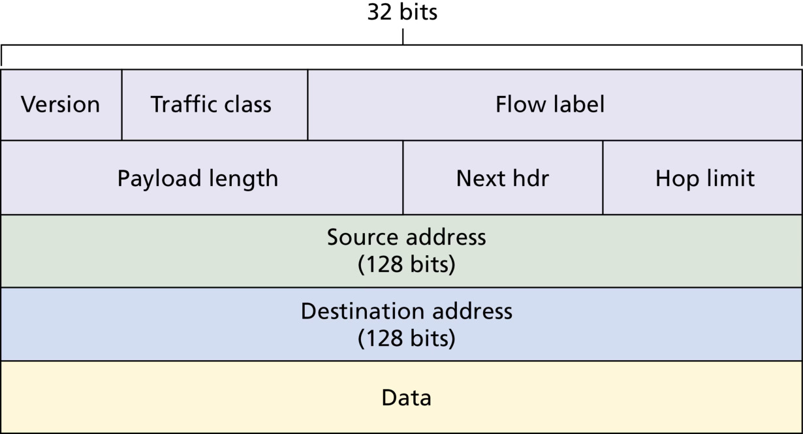

IPv6 最重要的变化（对比图 4.17 与图 4.26）：

- **更大的地址空间**：地址从 32 位扩大到 **128 位**（2¹²⁸ ≈ 3.4×10³⁸ 个地址，是 IPv4 的 **2⁹⁶ 倍**，足以让地球上的每粒沙子都可寻址）。除单播、多播外，新增 **任播（anycast）地址**：数据报交付给一组主机中的 **任意一台**（如最近的镜像站点）。
- **精简首部（streamlined header）**：IPv6 基本首部 **固定 40B、仅 8 个字段**，路由器处理更快；选项不再出现在基本首部，而是作为 **扩展首部（extension header）** 由「下一个首部」字段链式指向。

IPv6 基本首部 8 个字段：

- **版本（version，4 位）**：值 = **6**。
- **通信量类（traffic class，8 位）**：类似 IPv4 的 TOS，可给流内数据报或某些应用（VoIP 优先于 SMTP）设定优先级。
- **流标号（flow label，20 位）**：标识「流」——从特定源发往特定目的地（单播或多播）的一串数据报（如实时音/视频），路径上的路由器可为同一流保证指定服务质量。**流标号是 IPv6 新增的抽象**。
- **有效载荷长度（payload length，16 位）**：数据报中 **紧跟基本首部之后** 的字节数（所有扩展首部都算在有效载荷内），单位字节，最大 65535。
- **下一个首部（next header，8 位）**：相当于 IPv4 的协议字段（标识 TCP/UDP 等），或标识第一个扩展首部的类型。
- **跳数限制（hop limit，8 位）**：等价于 IPv4 的 **TTL**——每台路由器转发时减 1，减为 0 则丢弃。**高频考点（2023：Hop Limit ≡ TTL）**。
- **源地址 / 目的地址（各 128 位）**。

**IPv6 取消了哪些字段？（对比记忆）** ① **分片/重组（fragmentation/reassembly）**：IPv6 **不允许中间路由器分片**——数据报过大无法转发时，路由器直接丢弃并回送 ICMPv6「Packet Too Big」差错报文，由源端重发更小的数据报。分片重组只能在源与目的主机进行（时间昂贵，从路由器移除极大加快 IP 转发）。② **首部校验和（header checksum）**：因传输层（TCP/UDP）与链路层（以太网）都已做校验，网络层校验冗余，被移除——顺带消除了「每跳都要重算校验和」的开销。③ **选项（options）**：不再是标准首部的一部分，改为扩展首部，由「下一个首部」字段指向，使基本首部固定 40B。

#### IPv6 地址与冒号十六进制记法

IPv6 用 **128 位** 地址，若沿用 IPv4 的点分十进制，写起来将极其冗长。IPv6 标准采用 **冒号十六进制记法（colon hexadecimal notation）**：把地址每 4 位用一个十六进制数表示，每 16 位一组、组间用冒号分隔。如：

$$ \text{4BF5:AA12:0216:FEBC:BA5F:039A:BE9A:2170} $$

**缩写（压缩）规则**：① 每个 16 位组 **开头的 0 可以省略**（但组内必须至少保留一个数字），如 0000 → 0、039A → 39A、000A → A；② **连续的全 0 组** 可用 **双冒号（::）** 压缩，但 **一个地址中 :: 只能出现一次**（因为 0 值组的个数没有被编码，需从总数 8 组推算）。例如：

$$ \text{4BF5:0000:0000:0000:BA5F:039A:000A:2176} \Rightarrow \text{4BF5::BA5F:39A:A:2176} $$

!!! example "例题 5：IPv6 地址压缩与展开"

    （1）把完整地址 1A22:120D:0000:0000:72A2:0000:0000:00C0 写出最紧凑的压缩形式。

    （2）IPv6 地址的简化写法为 0008:0000:0000:0000:00D0:0123:CDEF:089A，写出其完整形式（补全所有 0 组）。

    ??? answer "查看答案"
        **（1）压缩。** 先省略各组的开头 0：1A22:120D:**0**:**0**:72A2:**0**:**0**:**C0**。两组全 0 的「120D:0000:0000:72A2」之间恰有两组连续的 0（第 3、4 组），可用 :: 压缩一次；第 6、7 组也是连续两组 0，但 :: 只能出现一次，故选择较长或任意一处连续 0 压缩。最紧凑形式：

        $$ \text{1A22:120D::72A2:0:0:C0} $$

        即把第 3、4 组压缩为 ::，第 6、7 组保留为 0:0（也可把 :: 用在末尾，得到 1A22:120D:0:0:72A2::C0，两种写法等价且都合法）。注意 **不能** 写成 1A22::120D::72A2::C0——:: 出现三次，非法。

        **（2）展开。** 压缩形式 0008:0000:0000:0000:00D0:0123:CDEF:089A 中无 ::，只需把每组补足 4 位十六进制（开头的 0 补回）：

        $$ \text{0008:0000:0000:0000:00D0:0123:CDEF:089A} $$

        若题目给出的是 8::D0:123:CDEF:89A 这类含 :: 的形式，则先按 8 组总数推算 :: 代表 3 组 0000，再逐组补零得 0008:0000:0000:0000:00D0:0123:CDEF:089A。

    ??? success "评分标准"

        - 各组件内开头 0 省略正确（4 分）
        - :: 只出现一次、位置正确（4 分）
        - 展开补零正确（3 分）
        - 指出「:: 最多一次」规则（3 分）

**IPv6 地址分类**（王道表 4.3 对应，408 选择题常考前缀）：

| 地址类型 | 二进制前缀 | 记法 | 作用 |
|:---|:---|:---|:---|
| 未指明地址 | 00…0（128 位） | ::/128 | 只能作源地址（尚未配置 IPv6 地址的主机） |
| 环回地址 | 00…01（128 位） | ::1/128 | 作用同 IPv4 的 127.0.0.1，仅此一个 |
| 多播地址 | 11111111 | FF00::/8 | 一组主机，占 IPv6 地址空间的 1/256 |
| 本地链路单播地址 | 1111111010 | FE80::/10 | 类似 IPv4 私有地址（仅本地链路有效） |
| 全球单播地址 | 其余所有 | — | 三级结构：全球路由选择前缀（48 位）+ 子网标识符（16 位）+ 接口标识符（64 位） |

**IPv6 全球单播地址的三级结构**：全球路由选择前缀 48 位（相当于 IPv4 网络号）、子网标识符 16 位（机构内构建子网）、接口标识符 64 位（标识单个接口，相当于主机号）。因接口标识符多达 64 位，可直接对硬件地址编码——**IPv6 可从地址后 64 位直接提取硬件地址，无需 ARP 进行地址解析**（IPv6 用邻居发现协议 NDP 替代 ARP）。

#### IPv4 向 IPv6 过渡

公共因特网基于 IPv4，如何迁移到 IPv6？宣告「flag day」（在某一天关闭所有机器升级）完全不可行——上一次重大技术迁移（NCP → TCP）发生在近 40 年前、因特网还很小的时候。实际采用两种策略（**高频考点**：2023 命题追踪）：

- **双协议栈（dual stack）**：一台设备同时装有 IPv4 与 IPv6 两个协议栈，分别配置 IPv4 地址与 IPv6 地址，既能与 IPv4 网络通信也能与 IPv6 网络通信。主机经 DNS 获知目的主机用哪种地址：DNS 返回 IPv4 地址则用 IPv4 通信，返回 IPv6 地址则用 IPv6 通信。
- **隧道技术（tunneling）**：当 IPv6 数据报要穿越 IPv4 网络时，把 **整个 IPv6 数据报封装成 IPv4 数据报的数据部分**，像在隧道中传输；IPv4 数据报离开 IPv4 网络时，再取出 IPv6 数据报继续按 IPv6 路由。

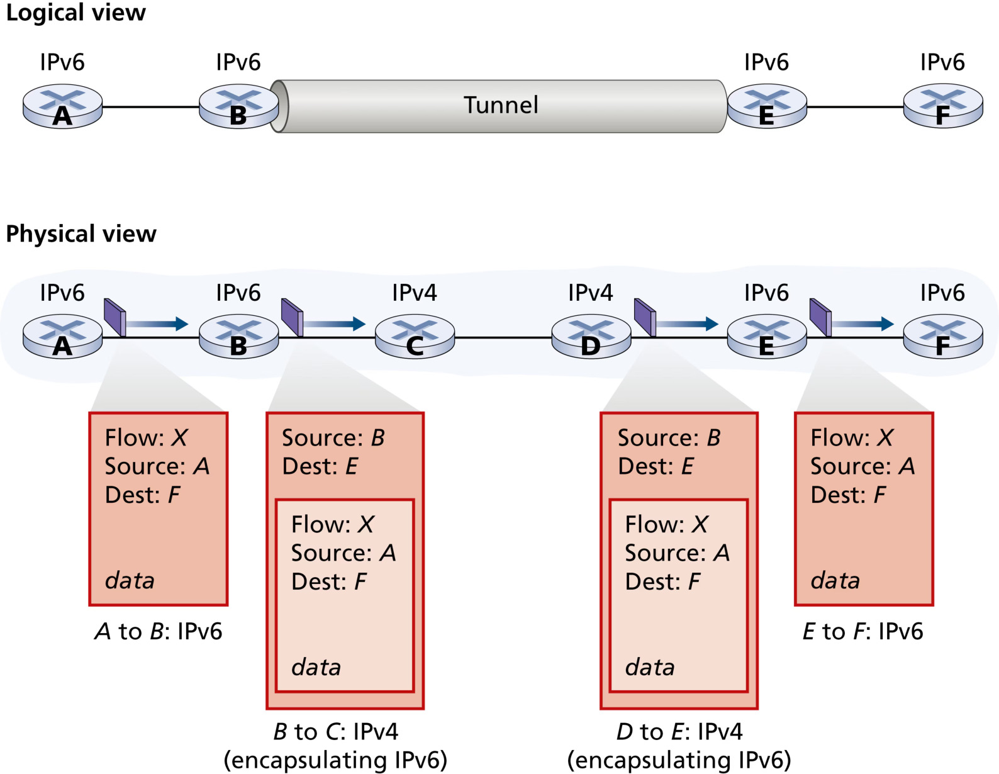

图 4.27：两个 IPv6 路由器 A 与 B 之间的 IPv4 路由器群构成一条 **隧道**。A 把整个 IPv6 数据报放入 IPv4 数据报的载荷字段，IPv4 数据报的目的地址为隧道对端 B；中间 IPv4 路由器浑然不觉（它们只按普通 IPv4 数据报路由）；B 收到后根据 IPv4 首部的协议号字段（值为 41，指示载荷是 IPv6 数据报）取出 IPv6 数据报，再正常路由。

**部署现状**：IPv6 部署虽起步缓慢但已大规模推进——谷歌报告近 40% 的客户端经 IPv6 访问其服务（2012 年仅约 1%）。**重要教训**：改变网络层协议极其困难（如同更换房子的地基），而应用层协议（Web、即时消息、流媒体）的更新就像给房子刷漆，容易得多——因此未来网络层变化仍将远比应用层缓慢。

**对比小结（IPv4 vs IPv6）**：地址 32 位 vs 128 位；首部 20B（可变、含选项）vs 40B（固定、无选项字段）；有首部校验和（每跳重算）vs 无校验和；中间路由器可分片 vs 不允许分片（源端路径 MTU 发现）；有 TTL vs 有 Hop Limit（等价）；协议字段 vs 下一个首部；无流标号 vs 有 20 位流标号；新增任播地址。

---

## 4.4 通用转发与 SDN

4.2.1 节把基于目的地的转发刻画为两步：查找目的 IP 地址（「匹配」），把分组送入交换结构到指定输出端口（「动作」）。**通用转发（generalized forwarding）** 把这一范式推广为 **匹配 + 动作（match-plus-action）**：**「匹配」可以对协议栈不同层次的多个首部字段进行**，「动作」可以是转发到 **一个或多个** 输出端口（负载均衡）、**重写首部字段值**（NAT）、**故意阻止/丢弃** 分组（防火墙）、发送到特殊服务器做进一步处理（DPI）等。


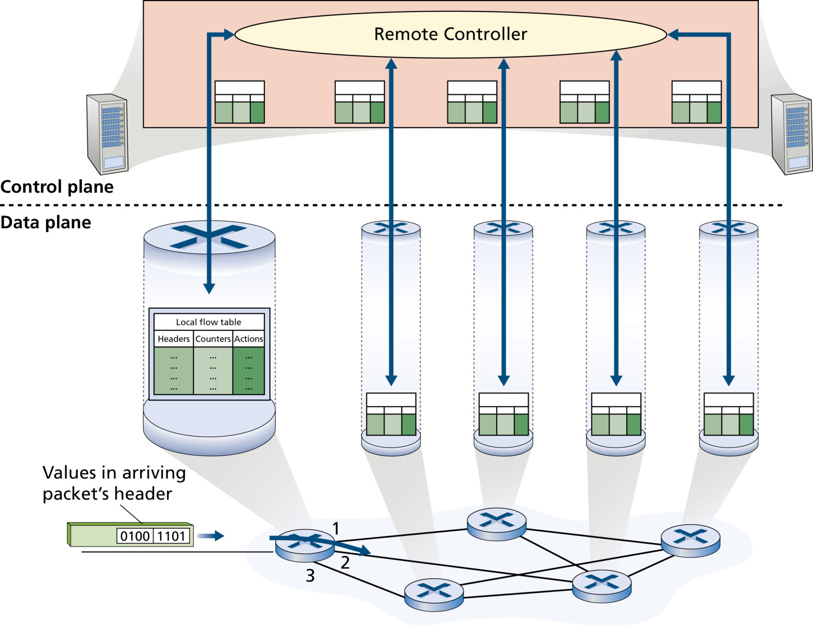

由于转发决策可能依据网络层和/或链路层的源/目的地址，图 4.28 中的设备更应称为 **分组交换机（packet switch）** 而非「L3 路由器」或「L2 交换机」。匹配+动作表由 **远程控制器** 计算、安装与更新（SDN 的标准实践）。

**OpenFlow**（McKeown 2008，ONF）是匹配+动作转发抽象与 SDN 革命的先锋标准。OpenFlow 中，匹配+动作转发表称 **流表（flow table）**，每个表项包含三部分：

1. **一组首部字段值**（匹配条件）：入端口号 + 来自链路层/网络层/传输层的字段（见 4.4.1）。硬件匹配用 TCAM 最快（可容纳上百万条目）。无匹配的分组可被丢弃或送远程控制器处理。
2. **一组计数器**：随分组匹配而更新，如该表项已匹配的分组数、上次更新的时间。
3. **一组动作**：转发到指定输出端口、丢弃、复制到多个输出端口、重写选定首部字段。

流表本质上是 **一个 API**——通过它可编程单个分组交换机的行为；网络级行为（路由、L2 交换、防火墙、负载均衡、虚拟网络）可通过在众多交换机的流表中配置相应规则来编程实现。

### 匹配（Match）

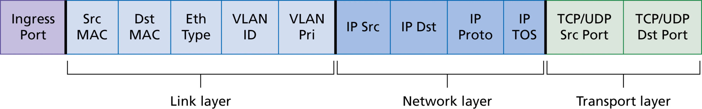

OpenFlow 1.0 允许匹配来自 **三个层次** 的字段（公然违背了 1.5 节的分层原则）：链路层（源/目的 **MAC 地址**、以太网类型、VLAN 字段）、网络层（源/目的 **IP 地址**、IP 协议字段、IP 服务类型）、传输层（源/目的 **端口号**）以及 **入端口号（ingress port）**。按以太网地址转发使 OpenFlow 设备既能当路由器（L3）也能当交换机（L2）。

流表项还支持 **通配符（wildcard）**，如 IP 地址 128.119.*.* 匹配前 16 位为 128.119 的任何数据报；每个流表项有 **关联的优先级**，分组匹配多个表项时，选择 **优先级最高** 的表项执行对应动作。注意并非所有字段都可匹配——如 OpenFlow 不允许匹配 TTL 字段或数据报长度字段。这是 **功能与复杂度的权衡**：Lampson 名言「一次只做好一件事；接口应抓住抽象的最小本质；不要泛化，泛化通常是错的」——OpenFlow 选择了一个恰到好处的抽象。

### 动作（Action）

每个流表项含 **零个或多个动作**，多个动作按列表顺序执行。最重要的动作：

- **转发（forwarding）**：转发到某个物理输出端口、向所有端口广播（除到达端口外）、向选定端口组多播；还可 **封装后发送给远程控制器**——控制器可能安装新流表项并（可能）把分组送回设备按新规则转发。
- **丢弃（dropping）**：无动作的流表项表示匹配分组应被丢弃（防火墙的典型实现）。
- **修改字段（modify-field）**：在转发前重写分组首部字段值（图 4.29 中除 IP 协议字段外的所有 2、3 层字段）。

### OpenFlow 示例

图 4.30 所示网络：6 台主机（h1~h6）与 3 台分组交换机（s1~s3，各 4 个接口），远程 OpenFlow 控制器统一编程。

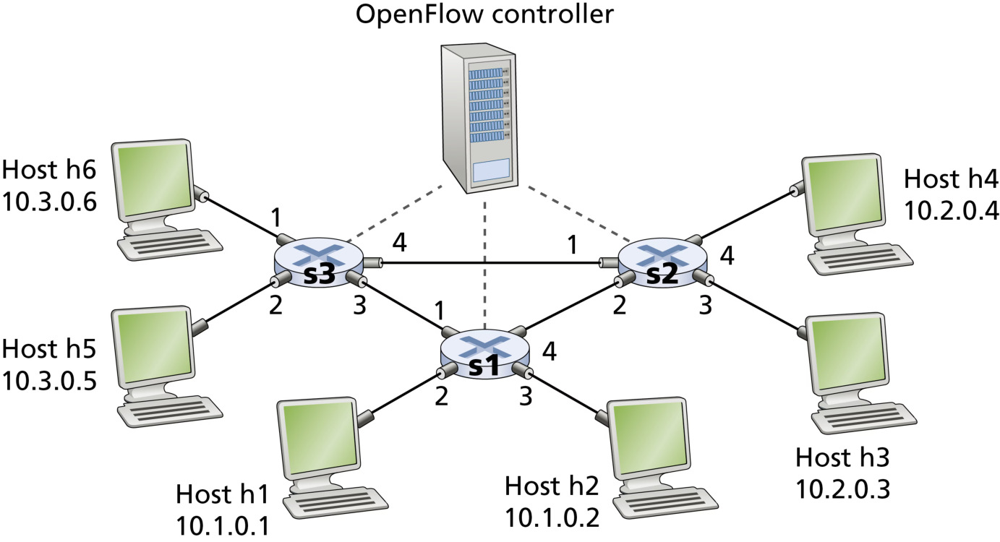

**示例一：简单转发**。要求来自/发往 10.3.*.* 与 10.2.*.* 的分组经 s1 → s3 → s2（避开 s1-s2 链路）。三张流表协同：

```text
s1 流表（示例 1）:
  匹配: 入端口=1; IP 源=10.3.*.*; IP 目的=10.2.*.*   动作: 转发(4)
s3 流表（示例 1）:
  匹配: IP 源=10.3.*.*; IP 目的=10.2.*.*             动作: 转发(3)
s2 流表（示例 1）:
  匹配: 入端口=2; IP 目的=10.2.0.3                   动作: 转发(3)
  匹配: 入端口=2; IP 目的=10.2.0.4                   动作: 转发(4)
```

**示例二：负载均衡**。h2 发往 10.1.*.* 的分组走 s1-s2 直连链路，h3 发往 10.1.*.* 的分组走 s1-s3 链路（分散两条路径的流量）。**注意：这一行为用传统 IP 的基于目的地转发根本无法实现**——两台不同主机的流量都去往 10.1.*.*，必须结合入端口号才能区分。s2 流表：

```text
s2 流表（示例 2）:
  匹配: 入端口=3; IP 目的=10.1.*.*   动作: 转发(2)
  匹配: 入端口=4; IP 目的=10.1.*.*   动作: 转发(1)
```

**示例三：防火墙**。s2 只接收来自 10.3.*.* 的流量发往其下主机（其他源一律不放行）：

```text
s2 流表（示例 3）:
  匹配: IP 源=10.3.*.*; IP 目的=10.2.0.3   动作: 转发(3)
  匹配: IP 源=10.3.*.*; IP 目的=10.2.0.4   动作: 转发(4)
```

若 s2 流表中没有其他表项，则非 10.3.*.* 来源的流量都被丢弃（无匹配 → 丢弃）。

流表本质上是 **有限形式的可编程性**。更强的可编程性由 **P4（Programming Protocol-independent Packet Processors）** 语言提供——支持变量、算术/布尔运算、函数、条件语句等高层构造，自推出以来获得广泛关注。

### 中间盒（Middleboxes）

路由器是网络层的「主力」，但数据通路上还坐着大量 **做转发以外工作的设备**。RFC 3234 把 **中间盒（middlebox）** 定义为：**「源主机与目的主机之间数据路径上，执行 IP 路由器正常标准功能以外功能的任何中间设备」**。**核心概念⑤：中间盒**——位于数据路径上、执行转发以外功能（NAT、安全、性能增强）的网络设备。广义的中间盒服务分三类：

- **NAT 转换**：实现私有网络编址，改写数据报的 IP 地址与端口号。
- **安全服务**：防火墙按首部字段值阻止流量或重定向做深度分组检测（DPI）；入侵检测系统（IDS）识别预定模式并过滤；应用层邮件过滤器拦截垃圾/钓鱼邮件。
- **性能增强**：压缩、内容缓存、服务请求负载均衡（把 HTTP 请求分发给一组可提供服务的服务器之一）。

中间盒激增带来运营/管理/升级成本，催生了 **网络功能虚拟化（NFV，Network Function Virtualization）**：用通用硬件（网络、计算、存储）+ 通用软件栈实现这些服务，正如 SDN 十年前在控制平面所做的那样。

**架构上的争议**：多年来因特网架构清晰地分离「网络核心的路由器」与「网络边缘的主机」。中间盒明显破坏这一分离：NAT 改写网络层 IP 地址与传输层端口号；防火墙用应用层、传输层、网络层字段过滤；邮件安全网关过滤应用层邮件内容。有人视中间盒为「架构上的污点」（Garfinkel），有人则认为它们「因重要而永久的理由而存在」，未来会更多而非更少（Walfish）——这就是 4.5 节「哑核心、智能边缘」原则在现实中面临的侵蚀。

---

## 4.5 因特网体系结构原则

因特网是人类建造的最大、最复杂的工程系统，它的体系结构遵循哪些原则？RFC 1958《因特网体系结构原则》给出了极简的回答：

> 「因特网社区许多成员会争辩说，没有体系结构，只有传统……但笼统而言，社区相信：**目标是连通性，工具是网际协议，智能在端到端而非隐藏在网络中**。」（The goal is connectivity, the tool is the Internet Protocol, and the intelligence is end to end rather than hidden in the network.）

即：**目标 = 连通性，工具 = IP，智能（复杂度）放在网络边缘而非核心**。来看后两点。

### IP 沙漏（The IP Hourglass）

五层协议栈的另一种可视化——**IP 沙漏（IP hourglass）**：物理层、链路层、传输层、应用层都有大量协议，而 **网络层只有 IP 一个协议**——它是每一台联网设备都必须实现的唯一协议，形成沙漏的「**窄腰（narrow waist）**」。

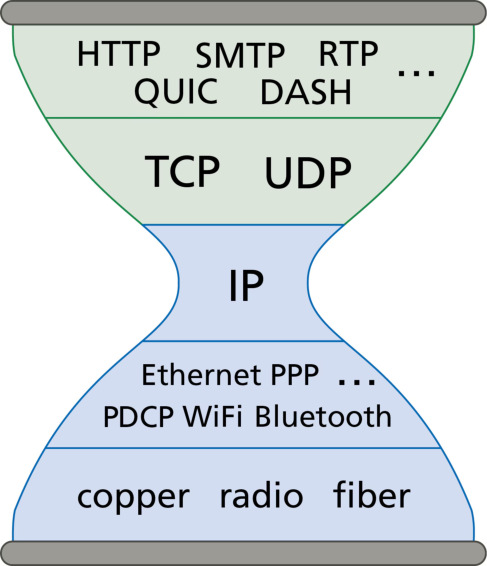

窄腰在因特网惊人增长中扮演了关键角色：IP 的相对简单与「联网的唯一通用要求」身份，使以太网、WiFi、蜂窝、光网络等千差万别的底层技术都能融入因特网。Clark 称之为「**跨层（spanning layer）**」：隐藏下层各种技术的差异，向上层呈现统一的服务接口。有趣的是，「窄腰」中年也可能「变宽」——中间盒的崛起正在加宽这个腰。

### 端到端原则（The End-to-End Argument）

RFC 1958 的第三条原则「智能在端到端」涉及功能在网络中的位置。与电话网（哑终端 + 智能交换机）相反，因特网有 **智能端点**（可编程计算机）与相对简单的核心，复杂功能可以放在端点。经典论文（Saltzer 1984）提出了 **端到端参数（end-to-end argument）**：

!!! info "定义：端到端原则（end-to-end argument）"

    **英文原文（权威定义）：**

    > The function in question can completely and correctly be implemented **only with the knowledge and help of the application standing at the end points** of the communication system. Therefore, providing that questioned function as a feature of the communication system itself is not possible. (Sometimes an incomplete version of the function provided by the communication system may be useful as a performance enhancement.)

    **中文解释：** 某功能 **只有在通信系统端点的应用的知识与帮助下才能完整、正确地实现**，因此把它作为通信系统自身的特性来提供是不可能的（通信系统内提供的不完整版本有时可作为性能增强）。**经典例子——可靠数据传输**：分组可能因路由器崩溃、链路故障而在网络内丢失，即使某些链路层协议做局部差错控制，这种局部控制也是「不完整的」，不足以提供端到端的可靠交付——**可靠传输必须由端点（TCP）端到端地实现**（呼应第 3 章）。

注意与 4.4 节中间盒的呼应：中间盒（NAT、防火墙、DPI）正是在「智能应在端到端」的框架下「存在但备受争议」的实体——它们改变了网络层的纯度，却满足了现实需求。

---

## 4.6 小结

本章覆盖了网络层 **数据平面**——路由器内部逐跳转发功能的全部要点：

1. **网络层概述**：转发（本地、纳秒级、硬件）与路由（全网、秒级、软件）的二分；数据平面 vs 控制平面（传统分布式 vs SDN 远程控制器）；尽力而为服务模型（五个不保证）。
2. **路由器内部**：四大部件（输入端口/交换结构/输出端口/路由处理器）；输入端口查找（前缀匹配 + TCAM）；三种交换（经内存/经总线/经互连网络 crossbar）；输出端口处理；排队（输入排队与 HOL 阻塞、输出排队、bufferbloat）；分组调度（FIFO/优先级/RR/WFQ）。
3. **IPv4**：20B 首部各字段（版本/首部长度 4B 单位/总长度/标识/DF-MF/片偏移 8B 单位/TTL/协议/首部校验和/源目的地址）；分片计算（片在目的主机重组）；编址（32 位、点分十进制、分类编址、特殊地址、子网划分、子网掩码、CIDR 与路由聚合、最长前缀匹配、DHCP 四步、私有地址与 NAT）。
4. **IPv6**：128 位地址、40B 固定基本首部（8 字段）、冒号十六进制与 :: 压缩、地址分类、无校验和、不允许中间分片、双栈与隧道过渡。
5. **通用转发与 SDN**：匹配+动作抽象、OpenFlow 流表（匹配字段/计数器/动作/优先级）、三个示例（简单转发/负载均衡/防火墙）、中间盒三类服务与 NFV。
6. **体系结构原则**：IP 沙漏窄腰、端到端原则。

下一章进入网络层的 **控制平面**：路由算法与 OSPF、BGP 路由协议，以及 SDN 控制器——那时你将看到「转发表从何而来」的完整答案。

---

## 🧪 本章习题

> 每道题均可回溯至本章正文（考点映射见章首导览）。A 组为基础题，B 组为提高题，C 组为拓展综合题，最后为原书习题讲解。CIDR/编址类题目为 408 高频考点（考频=9），务必逐题吃透。

### A 基础题（单选/填空，每题 1-2 分）

**A1.**（单选）在 IPv4 数据报首部中，指出「数据部分应交给哪个上层协议（如 TCP、UDP）」的字段及其取值是（ ）。

- A. 版本字段，值为 4
- B. 协议字段，值为 6 表示 TCP、17 表示 UDP
- C. 服务类型字段，值为 8
- D. 首部校验和字段，值为 16

??? answer "查看答案"
    **答案：B**

    协议字段（8 位）指出数据报数据部分应上交给哪个协议：值为 6 表示 TCP，17 表示 UDP（ICMP 为 1）。版本字段指出 IP 版本（IPv4 为 4）；服务类型用于区分数据报类别；首部校验和用于首部检错。协议号是把网络层与传输层「粘合」的字段，作用类似传输层的端口号。

**A2.**（单选）下列关于 IPv4 数据报首部字段的说法，错误的是（ ）。

- A. 首部长度字段以 4B 为单位，最大可表示 60B
- B. 总长度字段以字节为单位，理论最大值为 65535B
- C. 片偏移字段以 8B 为单位
- D. 三个长度字段（首部长度、总长度、片偏移）的基本单位相同

??? answer "查看答案"
    **答案：D**

    三个长度字段的基本单位 **不同**：首部长度以 **4B** 为单位、总长度以 **1B** 为单位、片偏移以 **8B** 为单位（记住：4B、1B、8B）。首部长度 4 位最大 15×4B=60B；总长度 16 位最大 65535B；片偏移 13 位，除最后一片外每片数据长度必须是 8B 的整数倍。**高频考点**（首部字段分析，2011、2012）。

**A3.**（单选）主机 168.16.84.24/20 所在子网的最小可分配 IP 地址和最大可分配 IP 地址分别是（ ）。（**真题 2023#39 改编**）

- A. 168.16.80.1，168.16.84.254
- B. 168.16.80.1，168.16.95.254
- C. 168.16.84.1，168.16.84.254
- D. 168.16.84.1，168.16.95.254

??? answer "查看答案"
    **答案：B**

    /20 表示前 20 位为网络前缀，主机号 12 位。子网掩码 = 11111111.11111111.11110000.00000000（255.255.240.0）。168.16.84.24 与掩码逐位相与：

    $$ 168.16.84.24 \;\&\; 255.255.240.0 = 168.16.80.0 $$

    网络地址 168.16.80.0/20，地址块范围 = 168.16.80.0 ~ 168.16.95.255（第 3 字节 0101 0000 ~ 0101 1111）。去掉主机号全 0（网络地址）与全 1（广播地址）后，**最小可分配 = 168.16.80.1，最大可分配 = 168.16.95.254**。

    （本题即 2023 统考真题第 39 题，原题答案为 B；CIDR 地址块最小/最大地址分析为高频考点。）

??? success "评分标准"

    - 掩码 255.255.240.0 正确（2 分）
    - 网络地址 168.16.80.0/20（4 分）
    - 地址块范围 168.16.80.0 ~ 168.16.95.255（3 分）
    - 去除全 0/全 1 得 168.16.80.1 ~ 168.16.95.254（3 分）

**A4.**（单选）某主机的 IP 地址为 183.80.72.48，子网掩码为 255.255.192.0，则该主机所在网络的网络地址是（ ）。（**真题 2022#35 改编**）

- A. 183.80.0.0
- B. 183.80.64.0
- C. 183.80.72.0
- D. 183.80.192.0

??? answer "查看答案"
    **答案：B**

    子网掩码 255.255.192.0 的二进制前 18 位为 1、后 14 位为 0（第 3 字节 11000000）。把主机 IP 地址 183.80.72.48 的后 14 位（第 3 字节低 6 位 + 第 4 字节）置 0：72 = 01001000，前 2 位 01 属于网络部分（保留），后 6 位置 0 → 第 3 字节 = 01000000 = 64。网络地址 = **183.80.64.0**。

    （本题即 2022 统考真题第 35 题，原题答案为 B；子网掩码求网络地址为高频考点，命题追踪 2022。）

??? success "评分标准"

    - 掩码 255.255.192.0 即 /18（3 分）
    - 正确把主机号位置 0（5 分）
    - 网络地址 183.80.64.0（4 分）

**A5.**（填空）NAT 转换表记录的是 **____** 到 **____** 的映射；三个私有地址块分别是 **____**、**____** 与 **____**。互联网中的路由器对目的地址是私有地址的数据报 **____**（转发/不转发）。

??? answer "查看答案"
    NAT 转换表记录 **{本地 IP 地址: 端口号}** 到 **{全球 IP 地址: 端口号}** 的映射，使多个私有 IP 地址可映射到同一个全球 IP 地址。三个私有地址块（RFC 1918）：**10.0.0.0/8**、**172.16.0.0/12**、**192.168.0.0/16**。互联网中的路由器对目的地址是私有地址的数据报 **一律不转发**。

    NAT 转发时必须改写源/目的 IP 地址，并查看/改写传输层端口号——这是它与普通路由器（转发时 IP 地址不变）的本质区别。

### B 提高题（简答/计算，每题 8-10 分）

**B1.**（计算，10 分）某路由器的路由表如下：

| 目的网络 | 下一跳 | 接口 |
|:---|:---|:---:|
| 169.96.40.0/23 | 176.1.1.1 | S1 |
| 169.96.40.0/25 | 176.2.2.2 | S2 |
| 169.96.40.0/27 | 176.3.3.3 | S3 |
| 0.0.0.0/0 | 176.4.4.4 | S4 |

若路由器收到一个目的地址为 169.96.40.5 的 IP 分组，应转发到哪个接口？（**真题 2015#58 同源改编**）

??? answer "查看答案"
    使用 **最长前缀匹配**：169.96.40.5 与各表项逐项比较匹配长度。

    - 169.96.40.0/23：前 23 位匹配（第 3 字节前 7 位 0010100 与 40 = 00101000 的前 7 位一致）。
    - 169.96.40.0/25：匹配 25 位（第 3 字节前 1 位 0 相同）。
    - 169.96.40.0/27：40 = 00101000，其前 3 位 001；5 的第 3 字节前 3 位也是 001 → **匹配 27 位**。
    - 0.0.0.0/0：默认路由，匹配 0 位，任何地址都匹配。

    三条路由都匹配，按最长前缀匹配选择匹配位数最多的 **169.96.40.0/27** → 接口 **S3**。默认路由只在其他表项都不匹配时才使用。

??? success "评分标准"

    - 列出最长前缀匹配规则（2 分）
    - 逐项匹配长度计算正确（5 分）
    - 选择 /27 → S3（3 分）

**B2.**（简答，8 分）描述新主机通过 DHCP 获取 IP 地址的完整四步过程，说明每一步报文的名称、源 IP 地址、目的 IP 地址，并解释为什么 DHCP 使用 UDP 广播。（**真题 2015#42、2022 同源改编**）

??? answer "查看答案"
    四步过程（假设子网上有 DHCP 服务器）：

    1. **DHCP 服务器发现（DHCPDISCOVER）**：新主机广播 discover 报文（UDP 目的端口 67）。**源 IP = 0.0.0.0，目的 IP = 255.255.255.255**（广播）。
    2. **DHCP 服务器提供（DHCPOFFER）**：服务器回应 offer 报文，含提议 IP 地址、网络掩码、租用期。**源 IP = 服务器地址，目的 IP = 255.255.255.255**（广播）。
    3. **DHCP 请求（DHCPREQUEST）**：客户从若干 offer 中选定一个，广播 request 报文。**源 IP = 0.0.0.0，目的 IP = 255.255.255.255**。
    4. **DHCP 确认（DHCPACK）**：服务器广播 ACK 报文，完成分配。**源 IP = 服务器地址，目的 IP = 255.255.255.255**。

    **为什么用 UDP 广播**：① DHCP 执行初期，客户不知道服务器的 IP 地址，只能广播寻找；② 执行过程中客户尚未获得 IP 地址，无法单播，也必须广播。**为什么用 UDP 而非 TCP**：TCP 需要先建立连接（三次握手），连对方 IP 都不知道，根本不可能通过套接字建立连接。

??? success "评分标准"

    - 四步名称与顺序正确（每步 1 分，共 4 分）
    - 每步源/目的 IP 地址正确（4 分）
    - UDP 广播原因分析（2 分）

**B3.**（计算，10 分）若路由器向一条 **MTU = 800B** 的链路转发一个 **总长度为 1580B** 的 IP 数据报（首部长度 20B）时进行了分片，且每个分片尽可能大，则第 2 个分片的总长度字段和 MF 标志位的值分别是多少？（**真题 2021#35 同源改编**）

??? answer "查看答案"
    原始数据报数据部分 = 1580 - 20 = 1560B。每片最大数据长度 = 800 - 20 = 780B，但 **片偏移以 8B 为单位，除最后一片外每片数据长度必须是 8B 的整数倍**——780 不是 8 的倍数，向下取整为 **776B**（776 = 97 × 8）。

    分片：776 + 776 + 8 = 1560，共 3 片。

    - 第 1 片：数据 776B，总长度 = 20 + 776 = **796**，MF = 1
    - 第 2 片：数据 776B，总长度 = 20 + 776 = **796**，**MF = 1**（后面还有第 3 片）
    - 第 3 片：数据 8B，总长度 = 28，MF = 0

    故第 2 个分片的总长度字段 = **796**，MF = **1**。（本题即 2021 统考真题第 36 题同型，答案为 796、1。）

??? success "评分标准"

    - 数据部分 1560B（2 分）
    - 每片最大数据长度取 8 的倍数 776B（3 分）
    - 分片 776/776/8 正确（3 分）
    - 第 2 片总长 796、MF=1（2 分）

### C 拓展题（综合，每题 15 分）

**C1.**（综合，15 分，**真题 2019#47 改编**）某公司网络如下图所示，路由器 R1 通过接口 E1、E2 分别连接局域网 1、局域网 2，通过接口 L0 连接路由器 R2，并经 R2 连接域名服务器与互联网。R1 的 L0 接口 IP 地址为 202.118.2.1；R2 的 L0 接口 IP 地址为 202.118.2.2，L1 接口 IP 地址为 130.11.120.1，E0 接口 IP 地址为 202.118.3.1；域名服务器的 IP 地址为 202.118.3.2。公司获得 IP 地址空间 **202.118.1.0/24**，局域网 1 与局域网 2 各需分配 **不少于 120 个** 可用的 IP 地址。

（1）将 202.118.1.0/24 划分为两个子网，分别分配给局域网 1 与局域网 2，给出划分结果并说明理由（给出必要计算）。

（2）给出 R1 的路由表，使其明确包括到局域网 1、局域网 2 的路由、到域名服务器的特定主机路由和到互联网的路由（默认路由）。

（3）采用路由聚合技术，给出 R2 到局域网 1 和局域网 2 的路由。

??? answer "查看答案"
    **（1）子网划分。** 每个局域网需 ≥ 120 个可用地址，主机号至少 7 位（2⁷ - 2 = 126 ≥ 120；6 位只有 2⁶ - 2 = 62 < 120，不够）。子网号位数 = 8 - 7 = **1 位**，可划分 2¹ = 2 个子网：

    - 子网 1：**202.118.1.0/25**（子网掩码 255.255.255.128），主机号 7 位，可用地址 126 个（202.118.1.1 ~ 202.118.1.126）→ 局域网 1
    - 子网 2：**202.118.1.128/25**（子网掩码 255.255.255.128），可用地址 126 个（202.118.1.129 ~ 202.118.1.254）→ 局域网 2

    计算依据：2⁶ - 2 = 62 < 120 ≤ 126 = 2⁷ - 2，故主机号必须 7 位、子网号 1 位。（注意：子网号可全 0 或全 1，故两个子网 /25 可用。）

    **（2）R1 的路由表。**

    | 目的网络地址 | 子网掩码 | 下一跳地址 | 接口 |
    |:---|:---|:---|:---:|
    | 202.118.1.0 | 255.255.255.128 | —（直接交付） | E1 |
    | 202.118.1.128 | 255.255.255.128 | —（直接交付） | E2 |
    | 202.118.3.2 | 255.255.255.255 | 202.118.2.2 | L0 |
    | 0.0.0.0 | 0.0.0.0 | 202.118.2.2 | L0 |

    说明：① 局域网 1、2 与 R1 的 E1、E2 直接相连，下一跳为空、按接口直连转发；② 域名服务器是特定主机，用 **特定主机路由**（掩码 255.255.255.255，即 /32，匹配优先级最高）；③ 互联网路由用 **默认路由** 0.0.0.0/0（掩码 0.0.0.0，任何地址都匹配，匹配优先级最低）。

    **（3）R2 到局域网 1、2 的路由聚合。** 两个子网 202.118.1.0/25 与 202.118.1.128/25 的二进制前 24 位相同（202.118.1），第 25 位分别为 0 与 1——**恰好互补覆盖 /24**。聚合为一条：

    $$ \text{202.118.1.0/24，掩码 255.255.255.0，下一跳 202.118.2.1（R1 的 L0 接口），接口 L0} $$

    验证：202.118.1.0/24 恰好覆盖两个 /25 子网，不引入多余地址。

??? success "评分标准"

    - 主机号 7 位分析（2⁶-2<120≤2⁷-2）（4 分）
    - 两个 /25 子网划分正确（3 分）
    - R1 路由表 4 项完整正确（直连 2 项 + 主机路由 + 默认路由）（5 分）
    - R2 聚合为 202.118.1.0/24 正确（3 分）

**C2.**（综合，15 分，**真题 2013#47 改编**）假设 Internet 的两个自治系统构成一个网络：自治系统 AS1 由路由器 R1 连接两个子网构成；自治系统 AS2 由路由器 R2、R3 互连并连接 3 个子网构成。各子网地址与接口 IP 地址如下图所示：

- **AS1**：R1 连接两个局域网，地址分别为 **133.14.5.0/25** 与 **133.14.5.128/25**。
- **AS2**：R2 的接口 E0 直接连接子网 **194.17.20.128/25**；R2 的接口 L0 连接 R1（链路 194.17.22.0/30，R2 侧 194.17.22.1，R1 侧 194.17.22.2）；R2 的接口 L1 连接 R3（链路 194.17.23.0/30，R2 侧 194.17.23.1，R3 侧 194.17.23.2）；R3 的接口 E0 连接子网 **194.17.20.0/25**、E1 连接子网 **194.17.21.0/24**。

请回答下列问题：

（1）利用路由聚合技术，给出 R2 的路由表，要求包括到达图中所有子网的路由，且路由项尽可能少（路由表结构：目的网络 | 下一跳 | 接口）。

（2）若 R2 收到目的 IP 地址分别为 194.17.20.200 与 194.17.21.200 的两个 IP 分组，R2 应分别通过哪个接口转发？结合最长前缀匹配说明理由。

（3）R1 与 R2 之间、R2 与 R3 之间分别属于什么关系？它们之间交换路由信息通常使用哪类路由协议（域内/域间）？

??? answer "查看答案"
    **（1）R2 的路由表（含聚合）。** 逐接口/逐方向聚合：

    - **AS1 两个子网**：133.14.5.0/25 与 133.14.5.128/25 的第 25 位分别为 0、1，前 24 位相同 → 聚合成 **133.14.5.0/24**。下一跳 R1 的 L0 接口（194.17.22.2），走 **L0**。
    - **E0 直连子网**：194.17.20.128/25，直接交付，走 **E0**。
    - **R3 侧两个子网**：194.17.20.0/25 与 194.17.21.0/24。第 3 字节 20 = 00010100、21 = 00010101，前 23 位相同（0001010）→ 聚合成 **194.17.20.0/23**（覆盖 194.17.20.0 ~ 194.17.21.255，恰好包含这两个子网）。下一跳 R3 的 L0 接口（194.17.23.2），走 **L1**。注意：该 /23 与 E0 直连的 194.17.20.128/25 **重叠**（/23 含 .20.128 ~ .20.255），靠最长前缀匹配消歧（见（2））。
    - **两条点对点链路**：194.17.22.0/30（到 R1）与 194.17.23.0/30（到 R3），直连，分别走 **L0、L1**。

    R2 路由表（6 项）：

    | 目的网络 | 下一跳 | 接口 |
    |:---|:---|:---:|
    | 133.14.5.0/24 | 194.17.22.2 | L0 |
    | 194.17.20.128/25 | —（直连） | E0 |
    | 194.17.20.0/23 | 194.17.23.2 | L1 |
    | 194.17.22.0/30 | —（直连） | L0 |
    | 194.17.23.0/30 | —（直连） | L1 |
    | 0.0.0.0/0（默认，可选） | 194.17.23.2 | L1 |

    **（2）最长前缀匹配。** 目的 **194.17.20.200**：200 ∈ [128, 255]，既匹配 E0 直连的 **194.17.20.128/25**（25 位），也匹配聚合的 **194.17.20.0/23**（23 位）。两条都命中时按 **最长前缀匹配** 选 25 位的表项 → 走 **E0 接口**（直接交付，说明该地址属于 R2 直连的 .128/25 子网）。

    目的 **194.17.21.200**：200 落在 .21.0 ~ .21.255，匹配 **194.17.20.0/23**（23 位）；不匹配 194.17.20.128/25（第 3 字节为 20 而非 21）→ 走 **L1 接口**，转发给 R3，由 R3 交付到 194.17.21.0/24 子网。

    **（3）协议关系。** R1 与 R2 分属不同自治系统（AS1/AS2），之间是 **域间（inter-AS）** 关系，用 **边界网关协议 BGP** 交换路由信息（BGP 报文封装在 TCP 中，见第 5 章）；R2 与 R3 同属 AS2，之间是 **域内（intra-AS）** 关系，用 **RIP 或 OSPF** 等内部网关协议（IGP）。

??? success "评分标准"

    - AS1 两子网聚合为 133.14.5.0/24（3 分）
    - R3 侧两子网聚合为 194.17.20.0/23 及计算过程（4 分）
    - 路由表 5-6 项完整正确（4 分）
    - 最长前缀匹配判断两个目的地址（.20.200 → E0、.21.200 → L1）（2 分）
    - 域间 BGP / 域内 IGP 判断（2 分）

### 原书习题讲解

**原书 R1.**（概念辨析）转发（forwarding）与路由（routing）有什么区别？各属于网络层的哪个平面？

??? answer "查看答案"
    **转发（forwarding）** 是路由器本地的动作：把到达的分组从入链路接口转移到适当的出链路接口。转发发生在 **极短时间尺度**（通常几纳秒），因此 **通常用硬件实现**，属于 **数据平面**。

    **路由（routing）** 是全网过程：确定分组从源到目的端到端路径。路由发生在 **长得多的时间尺度**（通常几秒），**通常用软件实现**，属于 **控制平面**。

    开车类比：转发是「通过一个立交桥」——车从一条路进来决定从哪条路出去；路由是「规划宾州到佛州的整个行程」——出发前查地图选路径。二者协同：路由算法计算转发表，转发按转发表逐跳执行。

??? success "评分标准"

    - 转发定义与时间尺度/硬件（3 分）
    - 路由定义与时间尺度/软件（3 分）
    - 数据平面/控制平面归属（2 分）
    - 二者关系（路由算转发表、转发按表执行）（2 分）

**原书 R8.**（概念辨析）路由器如何确定转发表的下一跳？什么是「最长前缀匹配」？为什么需要它？

??? answer "查看答案"
    路由器收到分组后，检查分组首部的目的 IP 地址，用该地址（或其前缀）**索引转发表**，转发表项指出该分组应转发到哪个输出链路接口。转发表由路由处理器（传统方式）或远程 SDN 控制器（SDN 方式）计算并下发。

    **最长前缀匹配**：一个目的地址可能匹配多条前缀表项，此时选择 **匹配位数最长（最具体）** 的那一项。为什么需要它？因为 CIDR 下外层路由器可能同时通告聚合前缀（如 194.17.20.0/24）与更具体的子网前缀（如 194.17.20.128/25），只有选最具体的表项，分组才能被路由到正确的组织/子网（如 4.3.2 节 ISPs-R-Us 例子）。

??? success "评分标准"

    - 转发表查找过程（3 分）
    - 最长前缀匹配定义（3 分）
    - 需要它的原因（CIDR 聚合 vs 具体前缀）（4 分）

**原书 P12.**（计算，与王道综合题同源）一个数据报长度为 4000B（首部固定 20B），经过一个 MTU 为 1500B 的网络传送。试问应当划分为几个片？各片的数据字段长度、片偏移字段和 MF 标志应为何值？

??? answer "查看答案"
    原始数据部分 = 4000 - 20 = 3980B。每片最大数据长度 = 1500 - 20 = 1480B（8 的倍数，1480 = 185 × 8）。3980 = 1480 + 1480 + 1020，共 **3 个片**：

    | 片 | 数据长度 | 片偏移（=累计数据÷8） | MF |
    |:---|:---:|:---:|:---:|
    | 片 1 | 1480B | 0 | 1 |
    | 片 2 | 1480B | 185 | 1 |
    | 片 3 | 1020B | 370 | 0 |

    注：片 3 是最后一片，数据长度 1020B 无需是 8 的倍数；片偏移 370 = 2960 ÷ 8。

??? success "评分标准"

    - 每片最大数据 1480B（2 分）
    - 分片数 3（3 分）
    - 各片长度 1480/1480/1020（2 分）
    - 片偏移 0/185/370 与 MF 1/1/0（3 分）

---

## ✅ 本章小结

本章是 408 计算题重灾区，核心线索归纳：

1. **转发与路由**：转发（本地、纳秒、硬件、数据平面）vs 路由（全网、秒、软件、控制平面）；转发表是两者的交汇点；传统分布式 vs SDN 远程控制器。
2. **路由器内部**：输入端口（查找 + TCAM）、交换结构（内存/总线/互连网络）、输出端口、路由处理器；排队（输入排队与 HOL 阻塞、输出排队、bufferbloat）与调度（FIFO/优先级/RR/WFQ）。
3. **IPv4 数据报与分片**：20B 首部 11 个关键字段（版本/首部长度 4B/总长度/标识/DF-MF/片偏移 8B/TTL/协议/首部校验和/源目的地址）；分片三步曲（MTU-20 → 8 的倍数 → 片偏移 = 累计÷8），片在目的主机重组。
4. **IPv4 编址**：32 位点分十进制；分类编址与特殊地址；子网划分（借位、子网掩码 AND、默认网关）；CIDR（任意前缀长度、斜线记法、地址块、路由聚合、最长前缀匹配）；DHCP 四步；私有地址与 NAT。
5. **IPv6**：128 位、40B 固定基本首部、冒号十六进制与 :: 压缩（只能一次）、地址分类、无校验和无中间分片、双栈与隧道过渡。
6. **通用转发与体系结构**：匹配+动作、OpenFlow 流表、中间盒与 NFV；IP 沙漏窄腰、端到端原则。

### 术语对照表

| 英文术语 | 中文 | 说明 |
|:---|:---|:---|
| forwarding | 转发 | 路由器本地动作：分组从入链路移到出链路（纳秒级、硬件） |
| routing | 路由 | 全网过程：确定分组端到端路径（秒级、软件） |
| data plane | 数据平面 | 网络层逐跳转发功能的集合 |
| control plane | 控制平面 | 决定数据报端到端路径的网络级逻辑 |
| forwarding table | 转发表 | 把目的地址（前缀）映射到输出链路接口的表 |
| input port / output port | 输入端口 / 输出端口 | 路由器入接口（物理/链路层处理 + 查找）/ 出接口（存储、调度、发送） |
| switching fabric | 交换结构 | 连接输入/输出端口的内部互连（内存/总线/互连网络） |
| longest prefix matching | 最长前缀匹配 | 多表项命中时选择匹配位数最长者（最具体路由） |
| TCAM | 三态内容可寻址存储器 | 一个时钟周期完成前缀查找的硬件（0/1/* 三态） |
| HOL blocking | 队头阻塞 | 输入队列队首分组阻塞，使后续分组即使目的端口空闲也等待 |
| packet scheduling | 分组调度 | 决定输出队列中分组发送顺序的规则（FIFO/优先级/RR/WFQ） |
| WFQ | 加权公平排队 | 按权重分配带宽的轮询调度 |
| IPv4 datagram | IPv4 数据报 | 网络层分组，20B 首部 + 数据 |
| TTL | 生存时间 | 数据报可通过的路由器数上限，每跳减 1，减为 0 丢弃 |
| fragment offset | 片偏移 | 某片数据在原数据报数据部分中的相对位置（单位 8B） |
| MTU | 最大传送单元 | 链路层帧可承载的最大数据量（以太网 1500B） |
| subnet | 子网 | 不含路由器、接口可直接互通的网络 |
| subnet mask | 子网掩码 | 1 对应网络号/子网号、0 对应主机号的 32 位串，AND 求网络地址 |
| CIDR | 无分类域间路由选择 | 任意长度网络前缀 + 斜线记法；路由聚合的基础 |
| route aggregation | 路由聚合 | 用一个大 CIDR 地址块代表多个小地址块 |
| DHCP | 动态主机配置协议 | 自动分配 IP 地址/掩码/网关/DNS 的四步协议（UDP 广播） |
| NAT | 网络地址转换 | 私有地址 ↔ 公网地址 + 端口号转换，隐藏内网 |
| private address | 私有地址 | 10/8、172.16/12、192.168/16，路由器不转发其目的流量 |
| IPv6 | 网际协议第 6 版 | 128 位地址、40B 固定基本首部、冒号十六进制记法 |
| dual stack | 双协议栈 | 设备同时运行 IPv4 与 IPv6 的过渡策略 |
| tunneling | 隧道 | 整个 IPv6 数据报封装进 IPv4 数据报载荷穿越 IPv4 网络 |
| match-plus-action | 匹配+动作 | 通用转发范式：按多字段匹配并执行转发/丢弃/重写动作 |
| middlebox | 中间盒 | 数据路径上执行转发以外功能（NAT/安全/性能）的设备 |
| end-to-end argument | 端到端原则 | 功能应尽可能放在端点实现（如可靠传输在 TCP） |

---

## 🚪 下一章预告

第 4 章解剖了网络层的数据平面：转发是「路由器内如何搬分组」，编址是「IP 地址怎么写、怎么分、怎么聚」。但还留着一个根本问题：**转发表里的那些表项，到底是谁、怎么算出来的？** 下一章进入网络层的 **控制平面**——路由算法（Dijkstra 与距离向量）、自治系统与层次路由、RIP/OSPF/BGP 三大路由协议，以及 SDN 控制器的内部机制。学完第 5 章，你将看到「转发 + 路由」这对孪生概念如何在真实因特网中协同运转。

👉 [进入第 5 章：网络层：控制平面 →](05-network-layer-control-plane.md)
