# 第 5 章：网络层控制平面 —— 全网的路由，由谁说了算

> 第 4 章讲的是「数据平面」：路由器收到一个分组，如何按转发表把它转发出去。但一个根本问题悬而未决——**转发表里的每一行是从哪来的？** 本章的回答就是控制平面：决定「分组从源到目的该走哪条路」的全网逻辑。第 4 章学的是「怎么转」，本章学的是「怎么算出路」。两条路线的博弈贯穿始终：**传统每路由器分布式控制**（RIP/OSPF/BGP 各自为战）与 **SDN 集中式控制**（一台「大脑」统一指挥）。而路由算法（Dijkstra 与距离向量）正是 408 大题最肥沃的土壤——请把每一步推导都练成肌肉记忆。

---

## 📋 本章导览

| 项目 | 内容 |
|:---|:---|
| **课时建议** | 10-12 课时（408 一轮复习建议 3-4 天，大题高产区） |
| **教学目标** | ① 理解控制平面的两种实现方式（每路由器控制 vs 逻辑集中式控制）；② 掌握链路状态（LS）算法 Dijkstra 的逐步推导、复杂度与振荡问题；③ 掌握距离向量（DV）算法、Bellman-Ford 方程、好消息快/坏消息慢与毒性逆转；④ 掌握 OSPF 特点与 RIP/OSPF/BGP 三大协议对比；⑤ 掌握 BGP 路由通告（eBGP/iBGP、AS-PATH/NEXT-HOP）、路径选择算法与路由策略；⑥ 了解 SDN 控制平面架构、OpenFlow 与 ICMP/SNMP/NETCONF-YANG 网络管理 |
| **教学重点** | Dijkstra 算法步骤表、DV 更新计算、RIP 路由表更新过程、BGP 路径选择四规则、OSPF 特点 |
| **教学难点** | 计数到无穷（count-to-infinity）与毒性逆转的机制辨析、BGP 热土豆路由与策略的交互、LS 与 DV 的收敛性对比 |
| **考点映射** | 408 考点：RIP/OSPF 构造路由表过程（**高频**，2017#47 变形）；链路状态 vs 距离向量算法对比；RIP 跳数 16 表示不可达（2010）；RIP/OSPF/BGP 封装所用协议（2013、2017）；BGP 的作用与路径向量（2013）；BGP 路由选择顺序与热土豆（2024）；ICMP 差错报文类型（2022）；ICMP 封装与 PING/Traceroute（2012） |
| **习题配置** | 例题 5 道 + A 基础 5 题 + B 提高 3 题 + C 拓展 3 题（含真题 2012#34、2017#47 改编）+ 原书习题讲解 3 道 |

<div class="chapter-route" aria-label="第 5 章学习路线">
<a class="route-step" href="#51"><span class="route-index">01</span><strong>控制平面</strong><small>计算、维护与安装转发表</small></a>
<a class="route-step" href="#52"><span class="route-index">02</span><strong>路由算法</strong><small>链路状态、距离向量与收敛</small></a>
<a class="route-step" href="#53-ospf"><span class="route-index">03</span><strong>OSPF</strong><small>自治系统、洪泛与 Dijkstra</small></a>
<a class="route-step" href="#54-bgp"><span class="route-index">04</span><strong>BGP</strong><small>域间可达性、策略与路径选择</small></a>
<a class="route-step" href="#55-sdn"><span class="route-index">05</span><strong>SDN 控制平面</strong><small>控制器、北向接口与 OpenFlow</small></a>
<a class="route-step" href="#56-icmp"><span class="route-index">06</span><strong>ICMP</strong><small>差错报告、PING 与 Traceroute</small></a>
<a class="route-step" href="#57-snmp-netconfyang"><span class="route-index">07</span><strong>网络管理</strong><small>SNMP、NETCONF 与 YANG</small></a>
</div>
<p class="chapter-route-note">点击卡片跳转到对应小节。本路线图只负责定位，算法步骤、路由表和报文分析在正文中展开。</p>

---

## 5.1 引言：控制平面做什么

回顾第 4 章的图 4.2 与 4.3：**转发表（forwarding table）**（基于目的转发时）或 **流表（flow table）**（通用转发时）是连接网络层数据平面与控制平面的枢纽。转发表规定了路由器本地的数据平面转发行为：把分组转发到哪个输出端口、丢弃、复制、重写首部字段……但第 4 章没有回答：**这些表项是谁算出来的、由谁维护、怎么安装到每台路由器上的？** 这正是本章的主题——控制平面（control plane），即控制数据报如何沿端到端路径路由、以及网络层组件与服务如何配置与管理的 **全网逻辑（network-wide logic）**。

实现控制平面有两条根本不同的路线：

- **每路由器控制（per-router control）**：每个路由器内部都运行一个路由算法组件，各路由器上的路由组件相互通信，协同计算各自转发表的值。路由算法组件与转发功能 **紧耦合** 在同一台路由器里，几十年间因特网一直如此。本章的 OSPF 与 BGP 都基于这种模式。

- **逻辑集中式控制（logically centralized control）**：一台 **逻辑上集中** 的控制器为每一台路由器计算并分发转发表。控制器经明确定义的协议与每台路由器中的 **控制代理（CA，control agent）** 交互，配置并管理路由器的流表。控制代理功能极简：只负责与控制器通信、执行控制器的指令——它既不与其他代理直接交互，也不参与计算转发表。这正是 5.5 节 SDN 的思想内核。

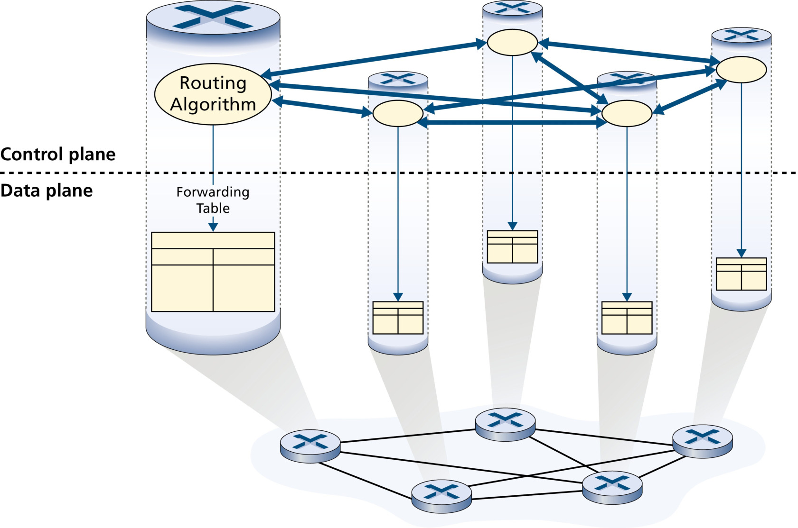


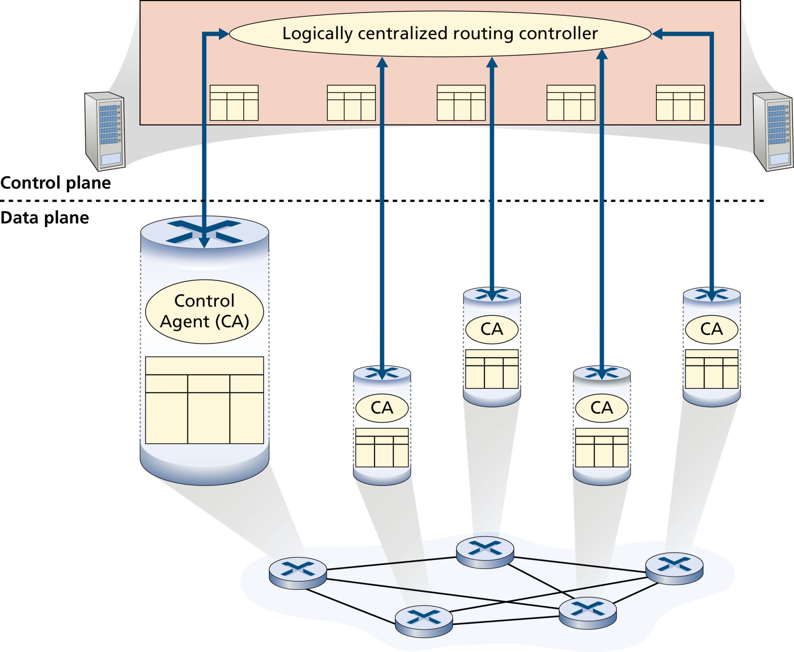


「逻辑集中」的含义：从外部看，路由控制服务仿佛是一个 **单一的中心服务点**，而实际上该服务很可能由多台服务器共同实现（容错与性能扩展的需要）。无论采用哪条路线，数据报从源到目的总要经过一条确定的路由器序列——**计算这些路径的路由算法，是两种控制模式共同的基础**，也是本章 5.2 节的主角。

**核心概念①：链路状态算法（link-state algorithm）** —— 一种 **集中式** 路由算法：每个节点先通过洪泛获得 **全网完整的拓扑与链路代价信息**，再本地运行 Dijkstra 算法计算出到所有目的节点的最低成本路径。信息全局、计算本地、一劳永逸（直到拓扑变化）。

**核心概念②：距离向量算法（distance-vector algorithm）** —— 一种 **分布式、迭代、异步** 的路由算法：每个节点只掌握到 **直接邻居** 的链路代价，通过与邻居反复交换「距离向量」并套用 Bellman-Ford 方程，逐步收敛到全网最低成本路径。信息局部、迭代扩散。

**关于「数据平面」与「控制平面」的分工再强调一次**：数据平面是 **每台路由器本地** 的转发动作——查表、换出、转发，速度优先，通常用硬件（如 TCAM）实现；控制平面是 **全网范围** 的决策逻辑——算表、维护、安装，正确性与全局视角优先，传统上以分布式软件实现，SDN 中则集中到控制器。第 4 章的分组转发、第 5 章的路由算法与 SDN 控制，构成网络层「转发 + 路由 + 管理」的完整图景。此外请注意：**转发是逐路由器独立完成的，路由决策则必须全网协调**——这正是路由算法存在的意义，也是本章所有内容的第一性原理。

---

## 5.2 路由算法

路由算法（routing algorithm）的目标是：在由路由器构成的网络中，确定从发送方到接收方的 **好路径（good path）**——通常指 **最低成本路径（least-cost path）**。现实中的策略因素（如「属于组织 X 的路由器不应转发源自组织 Y 网络的分组」）也会介入，但算法层面我们先聚焦最小成本。

**图模型**：把网络抽象成图。节点代表路由器（转发决策点），边代表路由器间的物理链路。如图 5.3，每条边带一个 **代价（cost）**：可反映链路的物理长度、速率或货币成本。记 c(x,y) 为节点 x 与 y 间链路的代价；若 (x,y) 不是边，则 c(x,y)=∞。路径代价 = 路径上所有边代价之和。若所有边代价相等，则最低成本路径退化为 **最短路径**（经过链路数最少的路径）。


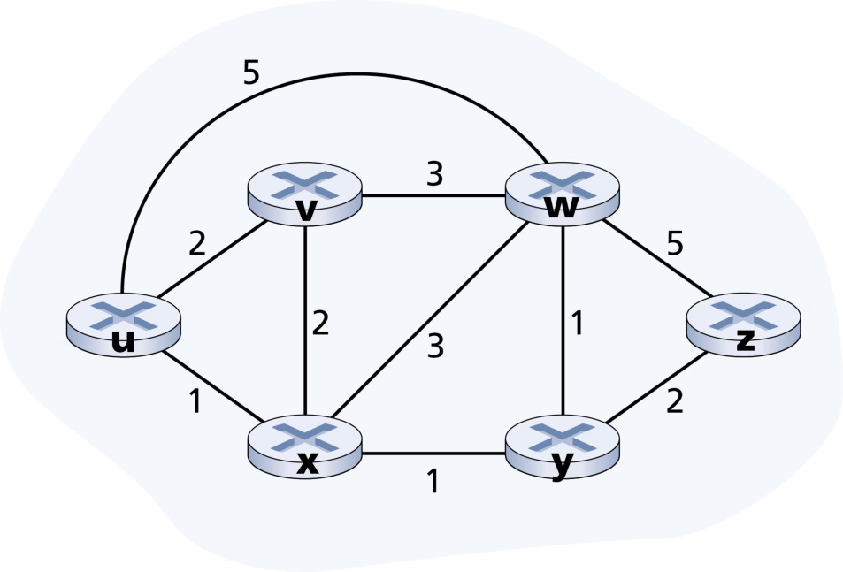

**路由算法的三种分类维度**（408 选择题常考）：

- **集中式 vs 分布式**：集中式算法（centralized）用 **全网完整信息** 计算最低成本路径，典型代表是 **链路状态（LS）算法**——算法必须知道每条链路的代价。分布式算法（decentralized）由各路由器 **迭代式地分布式计算**，没有任何节点掌握全网链路代价，典型代表是 **距离向量（DV）算法**——每个节点只从自己的直接邻居迭代地获取信息。
- **静态 vs 动态**：静态路由（static routing）的路径变化极慢（通常由人工干预，如手动修改链路代价）；动态路由（dynamic routing）随流量负载或拓扑变化而改变路径，可周期运行或响应拓扑/代价变化即时运行。动态算法对网络变化响应快，但也更易出现路由环路（routing loop）与路由振荡。
- **负载敏感 vs 负载不敏感**：负载敏感算法（load-sensitive）让链路代价随当前拥塞程度动态变化（早期 ARPAnet 曾采用，但遇到诸多困难）；今天的因特网路由算法（RIP、OSPF、BGP）都是 **负载不敏感** 的——链路代价不显式反映当前拥塞。

### 链路状态算法：Dijkstra

**核心概念①（续）：Dijkstra 算法** 是最经典的链路状态算法。实际中，每个节点通过 **链路状态广播（link-state broadcast）** 把包含自身相连链路标识与代价的 **链路状态分组（link-state packet）** 洪泛给全网所有节点，使每个节点都拥有 **一致且完整的全网视图**，然后各自运行 Dijkstra 算法——所有节点算出 **相同的** 最低成本路径集合（OSPF 正是这样做的，见 5.3 节）。

**链路状态广播的要点**：洪泛要求可靠交付（分组可能丢失），因此 LS 广播通常配合确认与重传（如 OSPF 的链路状态确认分组）；广播完成后全网各节点掌握的链路状态数据库 **完全一致**，这是「各节点算出相同结果」的前提。洪泛的消息开销是 O(|N||E|)：每台路由器向所有邻居发送、邻居再向除来源外的邻居转发，最坏情形全网每台路由器收到每条链路状态通告——这就是 LS 不适合超大规模网络的原因，也是 5.3 节 OSPF 要用区域（area）限制洪泛范围的动机。

Dijkstra 算法计算从源节点 u 到 **所有其他节点** 的最低成本路径。它是迭代算法：第 k 次迭代后，到 k 个目的节点的最低成本路径已确定。记号约定：

- **D(v)**：本次迭代结束时，源节点到目的节点 v 的最低成本路径的代价。
- **p(v)**：沿当前最低成本路径，v 的前一个节点（v 的邻居）。
- **N′**：已确定最低成本路径的节点子集。

**链路状态算法（源节点 u）伪代码：**

```text
1  Initialization:
2  N' = {u}
3  for all nodes v:
4      if v is neighbor of u:  D(v) = c(u,v)
5      else:                   D(v) = ∞
6  Loop
7      find w not in N' such that D(w) is minimum
8      add w to N'
9      for each neighbor v of w and not in N':
10         D(v) = min( D(v),  D(w) + c(w,v) )   /* 经 w 的新代价 vs 旧代价 */
11 until N' = N
```

**关键动作解析**：初始化把源节点放入 N′，D(v) 设为直接链路代价（非邻居为 ∞）。循环里每轮 **挑出不在 N′ 中且 D 值最小的节点 w** 加入 N′，然后检查 w 的邻居 v：若 **经 w 的路径** D(w)+c(w,v) 比 v 当前已知代价更小，就更新 D(v) 并把 p(v) 记为 w。循环共执行 |N| 次（节点总数），结束时 D(v) 即最低成本路径代价。

**复杂度**：第 1 轮要搜索全部 n 个节点找最小值，第 2 轮 n-1 个……总搜索次数为 n+(n-1)+…+1 = n(n+1)/2，故最坏情况复杂度为 **O(n²)**（n 为节点数）。若用堆（heap）数据结构找最小值，可降至 O(n log n)。

!!! example "例题 1：Dijkstra 算法逐步推导（含转发表）"

    对图 5.3 所示的六节点网络（节点 u、v、w、x、y、z），链路代价为：c(u,v)=2、c(u,x)=1、c(u,w)=5、c(v,x)=2、c(v,w)=3、c(x,w)=3、c(x,y)=1、c(w,y)=1、c(w,z)=5、c(y,z)=2。以 u 为源节点运行 Dijkstra 算法：

    （1）仿照表 5.1 的格式，逐轮填写 N′、D(v)、D(w)、D(x)、D(y)、D(z) 的值（含前驱节点 p）。

    （2）给出 u 到各目的节点的最低成本路径及路径代价，特别求 u→z 的最低成本路径。

    （3）据此构造节点 u 的转发表（按目的节点给出下一跳）。

    （4）该实现的算法复杂度是多少？若链路代价改为「当前负载」后可能出现什么现象？

    ??? answer "查看答案"
        **（1）逐步推导。** 初始化：N′={u}，D(v)=2（前驱 u）、D(w)=5（u）、D(x)=1（u）、D(y)=∞、D(z)=∞。

        **第 1 轮**：不在 N′ 中 D 值最小的是 x（D=1）→ 加入 N′。更新 x 的邻居（v、w、y）：D(v)=min{2, 1+2}=2（不变）；D(w)=min{5, 1+3}=4（经 x，前驱改为 x）；D(y)=min{∞, 1+1}=2（经 x，前驱 x）。

        **第 2 轮**：v 与 y 的 D 值都是 2，任选其一（教科书任选 v）→ 加入 v。更新 v 的邻居（w，已在 N′ 中的不算）：D(w)=min{4, 2+3}=4（不变）。

        **第 3 轮**：y（D=2）最小 → 加入。更新 y 的邻居（w、z）：D(w)=min{4, 2+1}=3（经 y，前驱改为 y）；D(z)=min{∞, 2+2}=4（经 y，前驱 y）。

        **第 4 轮**：w（D=3）→ 加入。更新 w 的邻居 z：D(z)=min{4, 3+5}=4（不变）。

        **第 5 轮**：z（D=4）→ 加入，N′=N 结束。

        汇总成表（每行表示该轮结束后的状态，括号内为前驱）：

        | 轮次 | N′ | D(v) | D(w) | D(x) | D(y) | D(z) |
        |:---:|:---|:---:|:---:|:---:|:---:|:---:|
        | 初始 | {u} | 2(u) | 5(u) | 1(u) | ∞ | ∞ |
        | 1 | {u,x} | 2(u) | 4(x) | 1(u) | 2(x) | ∞ |
        | 2 | {u,x,v} | 2(u) | 4(x) | 1(u) | 2(x) | ∞ |
        | 3 | {u,x,v,y} | 2(u) | 3(y) | 1(u) | 2(x) | 4(y) |
        | 4 | {u,x,v,y,w} | 2(u) | 3(y) | 1(u) | 2(x) | 4(y) |
        | 5 | {u,x,v,y,w,z} | 2(u) | 3(y) | 1(u) | 2(x) | 4(y) |

        **（2）最低成本路径：** 由前驱链回溯：

        - u→v：u-v，代价 2；
        - u→x：u-x，代价 1；
        - u→y：u-x-y，代价 1+1=2；
        - u→w：u-x-y-w，代价 1+1+1=3；
        - u→z：**u-x-y-z**，代价 1+1+2=**4**（注意：直接链路 u-w-z 代价 5+5=10，远非最优）。

        **（3）转发表**（按目的给出下一跳，即最低成本路径上的第一个节点）：

        | 目的 | v | w | x | y | z |
        |:---|:---:|:---:|:---:|:---:|:---:|
        | 下一跳 | v | x | x | x | x |

        即目的为 w、y、z 的分组都先发给 x（对应路径 u-x-y-w 与 u-x-y-z 均经 x）。

        **（4）** 该实现的复杂度为 **O(n²)**（n 为节点数，不包括源）。若链路代价依赖当前负载，可能出现 **路由振荡（oscillation）**：各节点周期性重算导致流量在两条路径间来回摆动（详见下文）。

    ??? success "评分标准"

        - 初始化正确（1 分）
        - 每轮选出最小 D 的节点并更新邻居正确（每轮 1 分，共 5 分）
        - u→z 最低成本路径与代价正确（2 分）
        - 转发表正确（2 分）
        - 复杂度 O(n²) 与振荡现象（2 分）

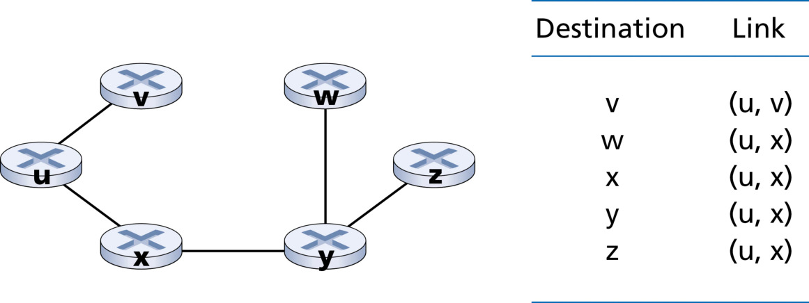

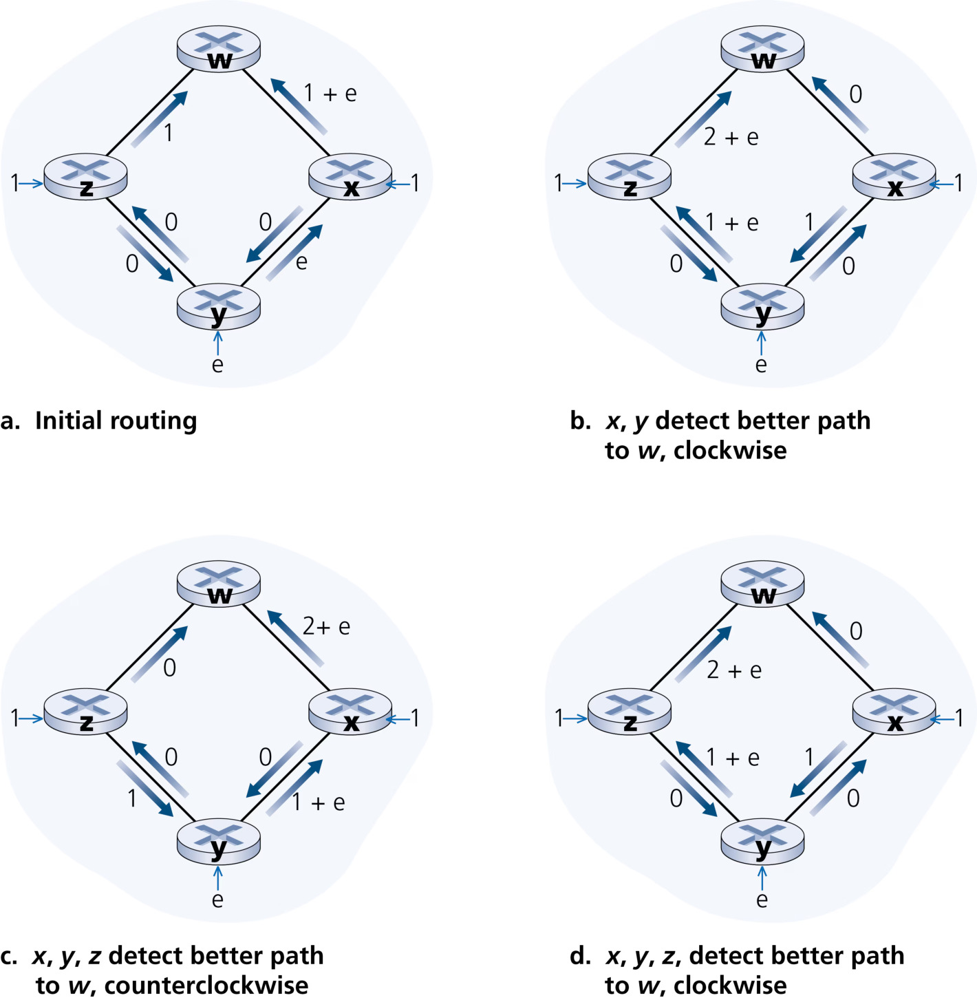

**振荡问题（oscillation）**：若链路代价反映当前负载（如时延），会出现图 5.5 所示的病理现象——节点反复在顺时针与逆时针路径之间摇摆：第一次运行 LS 后全部走顺时针，代价变化；再次运行后全部发现逆时针零代价路径，改走逆时针；再运行又回到顺时针……如此振荡。对策：① 强制链路代价不依赖流量（不可取，回避了避拥塞的目标）；② 不让所有路由器同时运行 LS 算法——问题是因特网路由器会 **自同步（self-synchronize）**，即使初始时刻不同，运行时刻也会逐渐同步；③ 实际解法：**每台路由器随机化发送链路通告的时间**，打散同步。


### 距离向量算法：Bellman-Ford 方程

与 LS 的全局信息不同，**距离向量（DV）算法** 是 **分布式（distributed）、迭代（iterative）、异步（asynchronous）** 的：每个节点从 **一个或多个直接邻居** 接收信息，完成计算后把结果 **分发给邻居**；迭代持续到邻居间不再交换信息为止（算法 **自终止**——没有显式停止信号，算完自然停）；异步指各节点不必同步地锁步运行。

!!! info "定义：Bellman-Ford 方程"

    **英文原文（权威定义）：**

    > Let d_x(y) be the cost of the least-cost path from node x to node y. Then the least costs are related by the celebrated **Bellman-Ford equation**, namely, d_x(y) = min_v { c(x,v) + d_v(y) }, where the min in the equation is taken over all of x's neighbors.

    **中文解释：** 设 d_x(y) 为从节点 x 到节点 y 的最低成本路径代价。**Bellman-Ford 方程**：d_x(y) = min_v { c(x,v) + d_v(y) }，其中 v 遍历 x 的所有邻居。直觉：从 x 出发必须先走到某个邻居 v（代价 c(x,v)），再沿 v 到 y 的最低成本路径继续（代价 d_v(y)）；x 到 y 的最低成本就是所有「先到某邻居」方案中的最小值。验证（图 5.3）：从 u 到 z，d_v(z)=7、d_w(z)=2、d_x(z)=3，代入得 min{2+7, 5+2, 1+3}=4，与 Dijkstra 结果一致。

**Bellman-Ford 方程的实际意义**：它不仅是一条方程，还直接给出转发表项——取到最小值的那个邻居 v，就是 x 发往 y 时转发表中的 **下一跳（next-hop）**。同时它暗示了 DV 算法中邻居间的通信形式。

**距离向量**：记 D_x(y) 为节点 x 对「自己到 y 的最低成本」的 **估计**。节点 x 的距离向量是 D_x = [D_x(y): y ∈ N]。每个节点维护：① 到每个直接邻居 v 的代价 c(x,v)；② 自己的距离向量 D_x；③ 每个邻居的距离向量 D_v。

**DV 算法（节点 x）伪代码：**

```text
1  Initialization:
2      for all destinations y in N:  Dx(y) = c(x,y)   /* 非邻居则 c(x,y)=∞ */
3      for each neighbor w:          Dw(y) = ? for all y in N   /* 未知，先置 ∞ */
4      for each neighbor w:          send distance vector Dx = [Dx(y): y in N] to w
5  Loop
6      wait (until I see a link cost change to some neighbor w
7            or until I receive a distance vector from some neighbor w)
8      for each y in N:
9          Dx(y) = min_v { c(x,v) + Dv(y) }
10     if Dx(y) changed for any destination y:
11         send distance vector Dx = [Dx(y): y in N] to all neighbors
12 Forever
```

**运行机制**：节点在「看到直达链路代价变化」或「收到邻居的距离向量」时触发更新：对每个目的 y，按 Bellman-Ford 方程重算 Dx(y)；若任何目的的距离估计发生变化，就把新的距离向量发给所有邻居。只要各节点持续异步地交换距离向量，**每个代价估计最终收敛到真实最低成本**。DV 类算法被 RIP、BGP、ISO IDRP 等大量实际协议采用。

**DV 算法求「下一跳」**：节点 x 更新转发表时，真正需要的不是到目的 y 的距离值，而是 **沿最短路径的下一跳路由器**——即方程中取最小值的那个邻居 v（若多个邻居并列最小，可任选其一）。因此在重算 Dx(y) 的同时，x 也为目的 y 记录并更新转发表项（下一跳 = 取得最小值的 v）。这是把「算法收敛值」落成「逐跳转发」的关键一步，408 计算题常要求给出转发表，务必记住：**下一跳来自 Bellman-Ford 方程的最小值项，而非直觉上的直连邻居**（例题 2 中 x 到 z 的下一跳是 y 而非直连，正是反直觉点）。

**DV 收敛的正确性直觉**：为什么「每个节点只知道邻居信息、异步地各自计算」最终能收敛到全局最优？因为 Bellman-Ford 方程是 **最优性原理（optimality principle）** 的体现：全局最优路径的任何子路径也必然最优。每个节点在自己「视野」内取最小值，等价于在向全局最优解逼近；只要网络拓扑不再变化、消息不丢失，经过有限轮交换，所有估计都会稳定在真实值上。收敛速度与网络直径、代价变化方向有关——这正是「好消息快、坏消息慢」两种表现的根源。

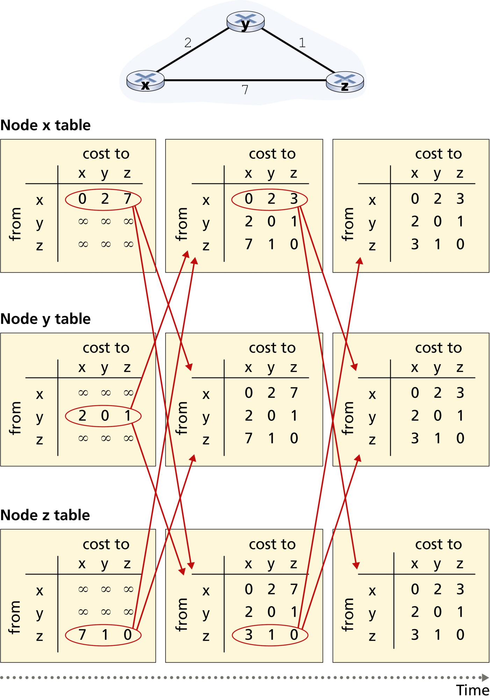


!!! example "例题 2：距离向量更新计算"

    考虑图 5.6 所示的三节点网络：节点 x、y、z，链路代价 c(x,y)=2、c(x,z)=7、c(y,z)=1。

    （1）写出三个节点的初始距离向量 Dx、Dy、Dz。

    （2）各节点把自己的距离向量发给两个邻居后，重新计算各自的新距离向量，指出哪些目的的距离估计发生了变化。

    （3）第二轮交换后是否收敛？给出最终距离向量与 x 的转发表。

    ??? answer "查看答案"
        **（1）初始距离向量**（自己到自己的代价为 0，直连为链路代价，非邻居为 ∞）：

        Dx = [0, 2, 7]，Dy = [2, 0, 1]，Dz = [7, 1, 0]。

        **（2）第一次交换后重新计算**（x 用 Bellman-Ford 方程：Dx(y)=min{2+0, 7+1}=2；Dx(z)=min{2+1, 7+0}=3）：

        Dx = [0, 2, 3]，Dy = [2, 0, 1]，Dz = [3, 1, 0]。

        变化：Dx(z) 从 7 降为 3（好消息：发现经 y 到 z 只要 2+1=3）；Dz(x) 从 7 降为 3（经 y：1+2=3）。x 与 z 的距离向量变化，需再发给邻居；y 的向量未变，不发。

        **（3）第二轮**：x 收到 z 的新向量 [3,1,0]，重算 Dx(z)=min{7, 2+1}=3 不变；z 收到 x 的新向量 [0,2,3]，重算 Dz(x)=min{7, 1+2}=3 不变。无任何变化 → **收敛**，进入静止状态。最终：

        Dx = [0, 2, 3]，Dy = [2, 0, 1]，Dz = [3, 1, 0]。

        x 的转发表：到 y 的下一跳为 y（直接）；到 z 的下一跳为 **y**（因为 Dx(z)=3 是经 y 取得：2+1=3，而非直连 7）。收敛仅需两轮，因为链路代价越小越容易传播（好消息传得快）。

    ??? success "评分标准"

        - 初始向量正确（3 分）
        - 第一次交换后更新正确（x、z 各 2 分，共 4 分）
        - 第二轮收敛判断正确（1 分）
        - 最终向量与 x 的转发表（下一跳为 y）（2 分）

#### 链路代价变化：好消息快，坏消息慢

当节点检测到直达链路代价变化时，DV 算法会传播该变化。考虑图 5.7 场景（x、y、z 三节点，c(x,z)=50、c(y,z)=1）：

**好消息传得快**（图 5.7(a)）：设 c(x,y) 从 4 降到 1。t0 时刻 y 检测到变化，更新 Dy(x)=min{1, 1+5}=1，通知邻居；t1 时刻 z 收到后更新 Dz(x)=min{50, 1+1}=2，通知邻居；t2 时刻 y 收到 z 的更新，Dy(x) 不变，算法静止。**只需两次迭代**——链路代价降低的好消息在网络中传播得很快。

**坏消息传得慢（计数到无穷）**（图 5.7(b)）：设 c(x,y) 从 4 增到 60。变化前 Dy(x)=4、Dz(x)=5（经 y）。t0 时刻 y 检测到变化，重算 Dy(x)=min{60, 1+Dz(x)=1+5}=6——**这是错误的**！y 打算经 z 到达 x，而 z 又经 y 到达 x，形成 **路由环路（routing loop）**：发往 x 的分组在 y 与 z 之间来回弹跳。y 把自己的新向量 6 通知 z；z 重算 Dz(x)=min{50, 1+6}=7 并通知 y；y 重算 Dy(x)=min{60, 1+7}=8……如此循环，**代价每次增加 1**，直到 z 经 y 的代价超过 50（约 44 次迭代），z 才改走直连 x，y 最终确定直连代价 60。坏消息传播极其缓慢，此现象称为 **计数到无穷（count-to-infinity）**——DV 算法的经典缺陷。

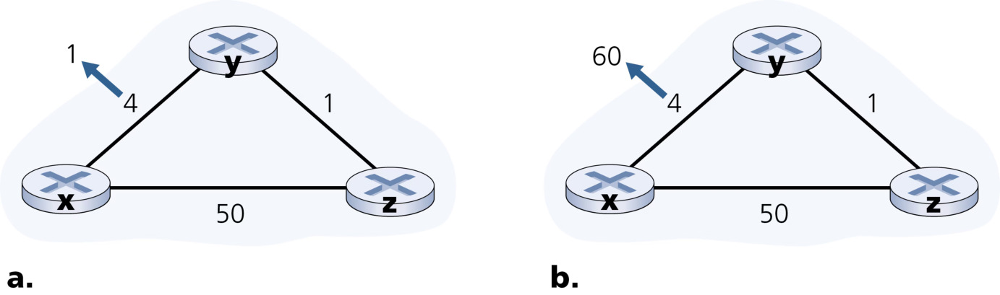

#### 毒性逆转（Poisoned Reverse）

**毒性逆转** 是缓解上述两节点环路的技术：**若 z 经 y 路由到达目的 x，则 z 向 y 通告「Dz(x)=∞」**（善意的谎言——z 明明知道真相，却告诉 y 自己到不了 x）。这样 y 收到 z 的 ∞ 后，绝不再尝试经 z 到 x，环路即被切断。回到图 5.7(b)：毒性逆转下 z 通告 y 的 Dz(x)=∞，当 c(x,y) 变为 60 时，y 直接走直连，Dy(x)=60，一步收敛。

**注意**：毒性逆转 **不能解决一般性的计数到无穷问题**——涉及三个及以上节点（而非两个相邻节点）的环路无法被其检测。这一点 408 选择题常考：毒性逆转只能处理「两节点之间的直接环路」。

!!! tip "动手试试：交互式演示"

    配套交互 HTML：[距离向量算法交互演示](demos/距离向量算法交互演示.html)、[RIP 路由表更新算法交互演示](demos/RIP路由表更新算法交互演示.html)、[虚电路与数据报服务对比演示](demos/虚电路与数据报服务对比演示.html)（浏览器打开，输入拓扑观察 DV 收敛与 RIP 路由表更新过程）。

!!! example "例题 4：计数到无穷与毒性逆转演示"

    三节点网络 x、y、z，链路代价 c(x,y)=4、c(y,z)=1、c(x,z)=50。初始已收敛：Dy(x)=4（直连）、Dz(x)=5（经 y：1+4）、Dy(z)=1、Dz(y)=1。

    （1）若 c(x,y) 从 4 增大到 60，写出 y 与 z 之间前几轮距离向量更新过程，说明路由环路如何形成。

    （2）若不采取措施，该过程大约持续多久？最终 Dy(x)、Dz(x) 收敛到何值？这种现象称为什么？

    （3）若采用毒性逆转，该链路代价变化后如何收敛？与（2）对比说明毒性逆转的作用。

    ??? answer "查看答案"
        **（1）坏消息的传播过程：**

        - t0：y 检测到 c(x,y) 变为 60，重算 Dy(x)=min{60, 1+Dz(x)=1+5}=**6**。注意：y 误以为可经 z 到达 x（代价 6），而 z 又要经 y 到达 x——**路由环路**形成（y→z→y，发往 x 的分组在两节点间来回弹跳）。y 把新向量 [6] 通知 z。
        - t1：z 收到，重算 Dz(x)=min{50, 1+6}=**7**，通知 y。
        - t2：y 收到，重算 Dy(x)=min{60, 1+7}=**8**，通知 z。
        - t3：z 重算 Dz(x)=min{50, 1+8}=**9**……如此往复，Dy 与 Dz 每次迭代各增加 1。

        **（2）** 该过程将一直持续到 z 经 y 的代价超过 50（约 44 次 y-z 消息交换）：z 最终判定 Dz(x)=min{50, 1+Dy(x)≥51}=**50**（改走直连 x）；y 随后重算 Dy(x)=min{60, 1+50}=**51**（经 z 更小，保持经 z）。坏消息传播极其缓慢，且中间各轮数值都是错误估计——此现象称为 **计数到无穷（count-to-infinity）**，是 DV 算法的经典缺陷。

        **（3）** 毒性逆转下：z 因经 y 路由到达 x，**向 y 通告 Dz(x)=∞**。c(x,y) 变为 60 后：y 重算 Dy(x)=min{60, 1+∞}=**60**（只能走直连），一步收敛；y 通知 z 后，z 重算 Dz(x)=min{50, 1+60}=50 不变。**对比**：无毒性逆转需约 44 次迭代且中途出现错误数值，有毒性逆转只需 1-2 次迭代——毒性逆转消除了两节点间的直接环路，但无法解决涉及三节点及以上的环路。

    ??? success "评分标准"

        - 正确写出前几轮更新（Dy=6、Dz=7、Dy=8……）（4 分）
        - 指出路由环路的形成原因（2 分）
        - 约 44 次迭代与最终值（Dy=51、Dz=50）（2 分）
        - 毒性逆转收敛过程与作用对比（2 分）

### LS 与 DV 的对比（408 高频对比表）

| 比较维度 | 链路状态 LS（Dijkstra） | 距离向量 DV（Bellman-Ford） |
|:---|:---|:---|
| 信息获取 | 全网拓扑与链路代价（洪泛广播，O(\|N\|\|E\|) 消息） | 只与直接邻居交换距离向量 |
| 交换内容 | 只告诉别人自己直接相连链路的代价 | 告诉邻居自己到 **所有节点** 的代价估计 |
| 消息复杂度 | 高：每个节点需与全网通信（洪泛） | 低：只与直接邻居通信，但收敛时间依赖因素多 |
| 收敛速度 | 快（O(\|N\|\|E\|) 消息后即收敛） | 可能慢；收敛过程中可能产生 **路由环路** |
| 健壮性 | 较好：路由器只广播自身相连链路的（错误）代价，各节点独立计算，故障影响被隔离 | 较差：一个节点可通告到任意目的的错误路径，错误会扩散到邻居的邻居；1997 年一台故障路由器曾致因特网大面积断连数小时 |
| 典型协议 | OSPF | RIP、BGP（路径向量变体） |

**记忆要点**：LS「**说得少**（只说自己的链路代价），**知道得多**（知道全网）」；DV「**说得多**（说出自己到所有目的），**知道得少**（只知道邻居）」；LS 以全网通信换快速收敛与健壮性，DV 以局部通信换简单性、付出环路与慢收敛的代价。两者互补，因特网中都在用（域内 OSPF = LS，域间 BGP ≈ DV 的路径向量扩展）。

**一句话判别方法（408 快速判断）**：问「每个节点需要什么信息」——需要 **全网拓扑** 的是 LS，只需要 **邻居信息** 的是 DV；问「节点之间交换什么」——只交换 **自己链路的代价** 的是 LS，交换 **到所有目的的距离向量** 的是 DV；问「谁来计算」——各节点 **独立用同一份数据** 算的是 LS，**互相参考结果迭代** 的是 DV。

!!! warning "常见错误：路由算法的三个误区"

    误区一：**「Dijkstra 是分布式算法」**。错——Dijkstra 是 **集中式** 算法：它需要全网完整拓扑作为输入（由链路状态广播提供），计算发生在本地的单一节点上。分布式的是 DV。

    误区二：**「DV 收敛一定快」**。错——DV 收敛速度取决于网络拓扑与代价变化方向：好消息快、坏消息慢（计数到无穷可需数十次迭代），收敛期间还可能出现路由环路。

    误区三：**「毒性逆转解决了一切环路」**。错——它只解决两节点间的直接环路；三节点及以上的环路（如 A→B→C→A）无法被毒性逆转检测。

---

## 5.3 域内路由：OSPF

### 自治系统（AS）与路由协议的层次

前两节把网络看成「一堆执行相同路由算法的同质路由器」——这个模型有两个致命问题：**规模**（今天因特网有数亿台路由器，全网广播与全量存储不可承受，DV 迭代也永不收敛）与 **管理自治**（每个 ISP 希望按自己的意愿运行网络、隐藏内部组织，同时仍能与外部网络互联）。

解决办法：把路由器组织进 **自治系统（AS，Autonomous System）**——**同一管理控制下的路由器集合**。一个 ISP 的路由器与互连链路通常构成一个 AS（大型 ISP 也可能划分为多个 AS）。AS 由全局唯一的 **自治系统号（ASN，Autonomous System Number）** 标识（由 ICANN 区域注册机构分配）。

- **域内路由协议（intra-AS routing protocol，又称 IGP）**：同一 AS 内的路由算法，如 **RIP** 与 **OSPF**。
- **域间路由协议（inter-AS routing protocol，又称 EGP）**：不同 AS 之间的路由，即 **BGP**（5.4 节）。

**核心概念③：OSPF** —— 因特网最广泛使用的 **域内（intra-AS）链路状态路由协议**：用洪泛法在全 AS 内传播链路状态，每台路由器以自己为根运行 Dijkstra 求出最短路径树。特点：不基于跳数、支持负载均衡与认证、可分层划分区域，是 408 对比 RIP 的高频考点。

### OSPF：开放最短路径优先

**OSPF（Open Shortest Path First，开放最短路径优先）**（RFC 2328）是最广泛使用的域内路由协议。「开放（Open）」表示其规范公开可获取。OSPF 是 **链路状态协议**：**使用洪泛法传播链路状态信息 + 本地运行 Dijkstra 算法**。每台 OSPF 路由器构造整个 AS 的完整拓扑图，然后以自己为根节点本地运行 Dijkstra，求出到所有子网的最短路径树（shortest-path tree）。

**OSPF 与 RIP 的四大区别**（王道 2026 总结，408 高频，**高频考点**：RIP/OSPF 构造路由表过程是大题常客，真题 2017#47 变形）：

1. **发送方式**：OSPF 用 **洪泛法（flooding）** 向 AS 内 **所有路由器** 发送信息（经所有输出端口发送，相邻路由器收到后再向除发来者外的所有邻居转发）；RIP 只向 **直接相邻** 的几个路由器发送。
2. **发送内容**：OSPF 发送的是 **与本路由器相邻的所有路由器的链路状态**（只涉及邻居与直接链路）；RIP 发送的是 **本路由器知道的全部信息（整个路由表）**。
3. **发送时机**：OSPF 只在 **链路状态发生变化时** 洪泛更新，收敛快，**不会出现 RIP「坏消息传得慢」**；RIP 无论拓扑是否变化都定期交换整个路由表（默认 30 秒）。
4. **承载协议**：OSPF 是 **网络层协议**，**直接封装在 IP 数据报中**（IP 首部协议字段为 89），不用 UDP 或 TCP；RIP 是 **应用层协议**，通过 **UDP（端口 520）** 传送。

**OSPF 的其余特点**（选择/填空常考）：

- 允许对每条链路设置 **不同的代价**，对不同类型业务可计算不同路由；链路代价由网络管理员配置（可设为 1 实现最少跳数，或与链路带宽成反比以避开低带宽链路）。
- 若到同一目的网络存在 **多条相同代价路径**，OSPF 允许 **负载均衡**（把通信量分配给多条路径）。
- OSPF 分组具有 **鉴别（认证）功能**，保证只在可信赖路由器间交换链路状态信息（默认不认证易被伪造，可配简单口令或基于共享密钥的 MD5 认证，并用序号防重放攻击）。
- 支持 **可变长子网掩码 VLSM 与 CIDR**（RIP 不支持）。
- 每个链路状态都带 **32 位序号**，序号越大状态越新。
- OSPF 每隔 30 分钟刷新一次链路状态（即使未变化，增强健壮性）。
- OSPF 用 **HELLO 报文**（问候分组）检测邻站可达性：相邻路由器每 **10 秒** 交换一次问候分组，若 **40 秒** 未收到，则认为该邻居不可达，立即修改链路状态数据库并重算路由表。

**OSPF 的层次结构**：OSPF 自治系统可 **层次化地划分为若干区域（area）**。每个区域运行自己的链路状态算法，洪泛范围被限制在区域内，大大减少全网通信量。AS 内恰好有一个 **主干区域（backbone area）**，负责连通其他区域；连接两个区域的边界路由器称为 **区域边界路由器（area border router）**；专门与 AS 外其他 AS 交换路由信息的称为 **自治系统边界路由器**。跨区域路由：先经本区域边界路由器 → 穿主干区域 → 目的区域的边界路由器 → 目的地。

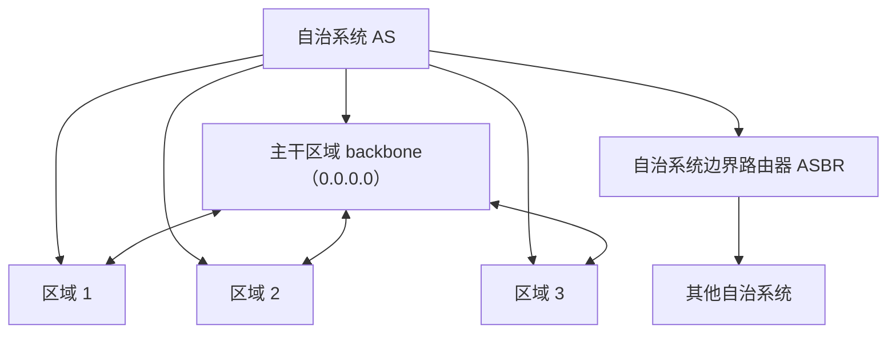
```mermaid
graph TD
    AS["自治系统 AS"] --> Area0["主干区域 backbone（0.0.0.0）"]
    AS --> A1["区域 1"]
    AS --> A2["区域 2"]
    AS --> A3["区域 3"]
    Area0 <--> A1
    Area0 <--> A2
    Area0 <--> A3
    AS --> ASBR["自治系统边界路由器 ASBR"]
    ASBR --> 其他AS["其他自治系统"]
```

**划分区域的价值（408 常考）**：把洪泛交换链路状态信息的范围 **局限在每个区域内**，而非整个 AS，从而大幅减少链路状态分组的总量与路由器的存储/计算开销，使 OSPF 可用于大型自治系统；代价是协议更复杂、交换信息的种类增多（跨区域路由需经主干区域转接，路径未必是全局最短）。

**OSPF 的报文类型**（五种，408 常考）：① 问候分组（Hello，发现与维持邻站可达）；② 数据库描述分组（向邻站给出链路状态数据库摘要）；③ 链路状态请求分组（请求缺失的链路状态详细信息）；④ 链路状态更新分组（**洪泛更新全网，OSPF 最核心**）；⑤ 链路状态确认分组（确认更新）。路由器启动时经 ②③ 交换摘要建立全网同步链路数据库；运行中链路变化时经 ④⑤ 可靠洪泛。

**RIP 补充知识**（王道 2026，408 高频）：RIP 是 **分布式基于距离向量** 的域内协议。规定：每台路由器维护到每个目的网络的距离记录（距离向量）；用 **跳数（hop count）** 度量距离，直连网络距离为 1，每经一个路由器加 1；**RIP 允许一条路径最多经过 15 个路由器，距离 16 表示不可达**（防止分组在环路上无限循环，也说明 RIP 只适用于小型网络）；每个路由表项含三个关键字段：**<目的网络 N，距离 d，下一跳路由器地址 X>**。RIP 交换信息三特点：**只与相邻路由器交换**、**交换自己的整个路由表**、**按固定时间间隔（30 秒）交换**（拓扑变化时也及时通告）。RIP 选择的是 **跳数最少** 的路由（不一定是时延最短）。优点：实现简单、开销小、收敛较快（好消息传得快）；缺点：规模受限（最大距离 15）、交换整个路由表开销大、坏消息传播慢（慢收敛）。

**RIP/OSPF/BGP 三大协议横向对比**（王道 2026 表 4.6，408 必背）：

| 比较项 | RIP | OSPF | BGP |
|:---|:---|:---|:---|
| 类型 | 距离向量（DV） | 链路状态（LS） | 路径向量 |
| 工作范围 | 域内（AS 内） | 域内（AS 内） | 域间（AS 间） |
| 度量 | 跳数（≤15，16 不可达） | 链路代价（管理员配置，不基于跳数） | 策略 + AS 跳数（无统一代价） |
| 与邻居交换什么 | 自己的 **整个路由表** | 本路由器相邻的 **链路状态** | 路由通告（前缀 + 属性） |
| 向谁通告 | 仅直接相邻路由器 | 洪泛给 AS 内 **所有路由器** | 经 eBGP/iBGP 会话的 **对等方** |
| 何时通告 | 每 30 秒定期 + 拓扑变化 | 链路状态变化时 + 每 30 分钟刷新 | 路由变化时（增量 Update） |
| 承载方式 | 应用层，UDP 端口 520 | 网络层，直接封装 IP（协议 89） | 应用层，TCP 端口 179 |
| 收敛 | 较慢（坏消息传得慢） | 快 | 慢（策略协商 + 全网传播） |

!!! example "例题 5：RIP 路由表更新过程（王道风格，真题 2017#47 同源思想）"

    路由器 R6 与 R4 互为相邻路由器。R6 当前路由表如下表 (a)；某时刻收到相邻路由器 R4 发来的路由更新信息如下表 (b)。请按 RIP 的距离向量算法更新 R6 的路由表，给出修改后的 R4 报文与更新后的 R6 路由表，并逐条说明理由。

    表 (a) R6 当前路由表：

    | 目的网络 | 距离 | 下一跳 |
    |:---|:---:|:---|
    | Net1 | 3 | R4 |
    | Net2 | 4 | R5 |
    | Net3 | 1 | 直接交付 |

    表 (b) R4 发来的路由表：

    | 目的网络 | 距离 | 下一跳 |
    |:---|:---:|:---|
    | Net1 | 1 | 直接交付 |
    | Net2 | 2 | R2 |
    | Net3 | 2 | R3 |

    ??? answer "查看答案"
        **第一步：修改 R4 发来的报文。** 对 R4 报文中的每一项：「距离」加 1，「下一跳」改为 R4（因为经 R4 转发）。

        | 目的网络 | 距离 | 下一跳 |
        |:---|:---:|:---|
        | Net1 | 1+1=2 | R4 |
        | Net2 | 2+1=3 | R4 |
        | Net3 | 2+1=3 | R4 |

        **第二步：逐项与 R6 原路由表比较。**

        - **Net1**：原表中有 Net1 且 **下一跳也是 R4**（距离 3）。规则：**下一跳相同 → 无条件更新**（以更新的消息为准）→ Net1 改为距离 2、下一跳 R4。
        - **Net2**：原表中有 Net2 但 **下一跳不同**（原为 R5）。规则：**比较距离，只有新距离更小才更新**。新距离 3 < 原距离 4 → 更新为距离 3、下一跳 R4。
        - **Net3**：原表中有 Net3 但 **下一跳不同**（原为直接交付）。新距离 3 > 原距离 1 → **不更新**（保持距离 1、直接交付）。

        **更新后的 R6 路由表：**

        | 目的网络 | 距离 | 下一跳 |
        |:---|:---:|:---|
        | Net1 | 2 | R4 |
        | Net2 | 3 | R4 |
        | Net3 | 1 | 直接交付 |

        **要点**（RIP 更新三规则）：① 目的网络不在表中 → 添加；② 目的网络在表中且下一跳相同 → 无条件替换；③ 目的网络在表中但下一跳不同 → 仅当新距离更小才更新。另注意：若 180 秒未收到某相邻路由器的更新，则把该路由器标记为不可达（距离置 16）。

    ??? success "评分标准"

        - 修改 R4 报文（距离 +1、下一跳改 R4）正确（3 分）
        - Net1 同下一跳无条件更新（2 分）
        - Net2 不同下一跳、新距离更小则更新（3 分）
        - Net3 不同下一跳、新距离更大则不更新（2 分）

---

## 5.4 域间路由：BGP

第 5.3 节的 OSPF 解决 AS 内部路由，但数据报要跨多个 AS（例如从非洲的手机到硅谷数据中心的服务器），就需要 **域间路由协议（inter-AS routing protocol）**。因特网中所有 AS 运行同一个域间协议——**边界网关协议（BGP，Border Gateway Protocol）**（RFC 4271）。BGP 是把数千个 ISP「粘合」在一起的协议，重要性仅次于 IP 本身。

**核心概念④：BGP** —— 因特网唯一的 **域间路由协议**，为每个 AS 提供两件事：① 从相邻 AS 获取目的前缀的 **可达性信息**；② 依据策略与可达性信息 **确定到达各前缀的「最佳」路由**。BGP 是 **分布式、异步** 的协议，属于距离向量家族的 **路径向量（path-vector）** 变体——通告的不再只是「距离」，而是到达目的所经过的 **AS 序列**，从而天然防环并支持策略。

### BGP 的作用

BGP 中分组不是路由到某个具体目的地址，而是路由到 **CIDR 化的前缀（prefix）**——每个前缀代表一个子网或若干子网的集合。路由器的转发表项形如 <前缀, 接口号>。作为域间协议，BGP 为每台路由器提供两种能力：

1. **获取前缀可达性信息**：每个子网把自己的存在通告给全网（「我存在，我在这里」），BGP 保证全网路由器都知道它——否则每个子网都是孤岛。
2. **确定到前缀的最佳路由**：路由器可能学到多条到同一前缀的路由，通过本地运行的 **BGP 路由选择过程**（基于策略与可达性信息）选出最佳者，写入转发表。

### BGP 路由通告：eBGP 与 iBGP

考虑图 5.8 的网络：三个 AS（AS1、AS2、AS3），AS3 中包含一个前缀为 x 的子网。AS 中每台路由器要么是 **网关路由器（gateway router）**——位于 AS 边缘、直接连接其他 AS 中的路由器；要么是 **内部路由器（internal router）**——只连接本 AS 内的主机与路由器。

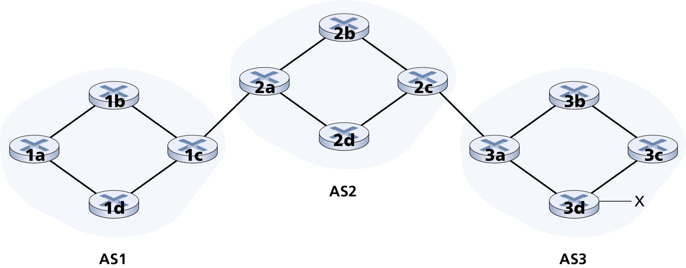


**可达性通告流程**：AS3 的网关路由器 3a 通过 **eBGP** 会话通告「x 存在且在 AS3」给 AS2 的网关路由器 2c；2c 通过 **iBGP** 把通告传播给 AS2 内所有路由器（含网关 2a）；2a 再经 **eBGP** 通告给 AS1 的网关 1c；1c 经 **iBGP** 通告给 AS1 内所有路由器。每个 AS 不仅知道 x 的存在，还知道 **到达 x 所经过的 AS 序列**。

**iBGP 为什么需要全网状？** 回忆 BGP 的两个原则：① AS-PATH 的防环依赖「AS 内每个路由器都知道所有到达某前缀的路径」；② 路由器只把它 **选择的** 最佳路由通告给 eBGP 对等方。若内部路由器之间不通告 eBGP 学到的路由，外部前缀的可达性就无法在 AS 内传播——因此 iBGP 通常把 AS 内所有路由器连成 **TCP 全网状（full mesh）**。此外，iBGP 会话中通告的路由 **不再附加本 AS 的 ASN**（只有 eBGP 通告才追加 ASN），否则防环机制会被破坏。

**BGP 会话（BGP connection/session）**：BGP 路由器对之间通过 **半永久 TCP 连接**（端口 **179**）交换路由信息，连接上承载的所有 BGP 消息构成一个 BGP 会话。

- **eBGP（external BGP）**：跨越两个 AS 的 BGP 会话（不同 AS 的网关路由器之间）。
- **iBGP（internal BGP）**：同一 AS 内路由器之间的 BGP 会话（通常在全 AS 内形成 TCP 全网状连接，iBGP 连接不一定对应物理链路）。

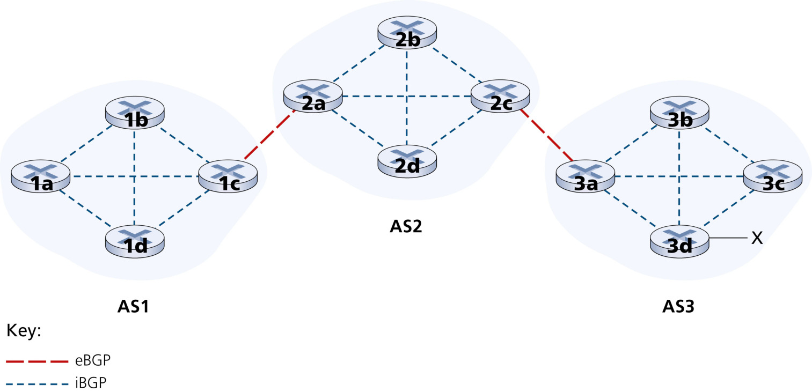

**BGP 属性与路由**：路由器经 BGP 会话通告前缀时，附带若干 **BGP 属性（attribute）**；前缀连同其属性称为一条 **BGP 路由（route）**。两个最重要的属性：

- **AS-PATH（自治系统路径）**：通告所经过的 AS 列表。前缀每经过一个 AS，该 AS 把自己的 ASN 追加进 AS-PATH。两个用途：① 路由器据此知道经哪些 AS 可到达前缀；② **环路检测**——若路由器发现自己的 AS 已在 AS-PATH 中，就丢弃该通告（防环）。
- **NEXT-HOP（下一跳）**：**开始该 AS-PATH 的路由器接口的 IP 地址**。它提供域间路由与域内路由的关键衔接：NEXT-HOP 可能是别的 AS 的路由器，但其所在子网直接连到本 AS——本 AS 用 **域内协议（如 OSPF）** 找到去往该 NEXT-HOP 的路由，从而把分组送到下一跳，再沿 AS-PATH 继续。

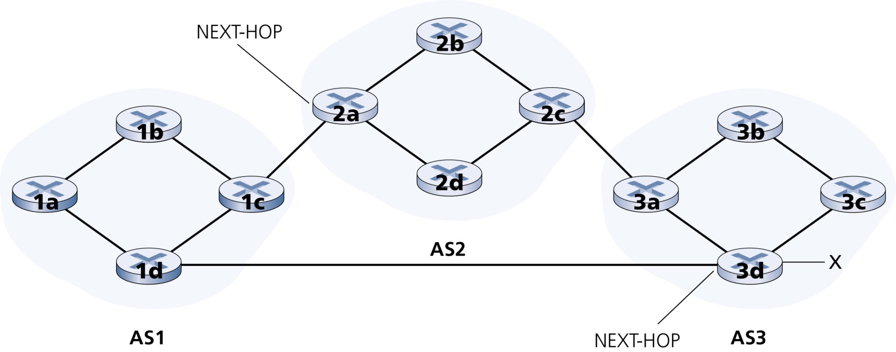

### 确定最佳路由

路由器可能学到多条到同一前缀的 BGP 路由（因特网中常有几十条）。**热土豆路由（hot potato routing）** 是最简单的选择算法：**选择到 NEXT-HOP 路由器域内代价最小的那条路由**——即尽快把「烫手的土豆」分组甩出本 AS，不考虑 AS 外的剩余路径代价。它是「自私」的：只最小化本 AS 内的成本。注意热土豆路由下，同一 AS 中两台路由器可能为同一前缀选择不同的 AS 路径。图 5.11 给出把 AS 外前缀加入转发表的完整步骤（**同时使用域间协议 BGP 与域内协议如 OSPF**）。

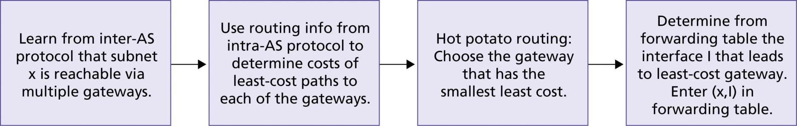

**BGP 路由选择算法（对给定前缀，按顺序应用以下规则直到只剩一条路由）**——408 高频，**高频考点**：

1. **选择本地偏好（local preference）值最高的路由**。本地偏好是路由的属性之一（可由路由器自身设置或从同 AS 路由器学得），其取值是 **完全由 AS 网络管理员的策略决定** 的。
2. **选择 AS-PATH 最短的路由**（剩余路由本地偏好相同）。若只有此规则，BGP 就是「以 AS 跳数为距离度量」的 DV 算法。
3. **使用热土豆路由**：选择到 NEXT-HOP 路由器最近（域内代价最小）的路由（剩余路由的本地偏好与 AS-PATH 长度均相同）。
4. 仍有多条则用 **BGP 标识符（BGP identifier）** 选择（取最小者）。

**要点**：规则 1 先于规则 2，规则 2 先于规则 3——**策略（本地偏好）压过 AS 路径长度，AS 路径长度压过热土豆**。因此 BGP 不再「自私」：它优先寻找 AS 路径短的（通常端到端时延更小），其次才考虑尽快甩出本 AS。

**关于「最佳路由」的准确表述（408 辨析点）**：BGP 只力求寻找一条 **能够到达目的网络且比较好的路由**（且不能兜圈子），**并不保证找到全局最佳路由**——因为 AS 之间不存在统一的代价定义，选路受策略约束（本地偏好由管理员拍板），且 BGP 路由器只见自己学到的通告、不见全网信息。这与 RIP「跳数最小」、OSPF「链路代价之和最小」的明确最优化目标形成鲜明对比。

!!! info "定义：BGP 路由（route）与属性（attribute）"

    **英文原文（权威定义）：**

    > When a router advertises a prefix across a BGP connection, it includes with the prefix several **BGP attributes**. In BGP jargon, a prefix along with its attributes is called a **route**. Two of the more important attributes are **AS-PATH** and **NEXT-HOP**.

    **中文解释：** BGP 路由 = **<CIDR 前缀, BGP 属性>**。属性中最重要的是 **AS-PATH**（通告经过的 AS 序列，用于选择路径与检测环路）与 **NEXT-HOP**（开始该 AS-PATH 的路由器接口 IP，用于衔接域内路由）。另外还有 **本地偏好（local preference）** 属性：由 AS 策略决定，是路由选择第一规则的标准。

!!! example "例题 3：BGP 路径选择（含策略与热土豆）"

    路由器 1b 位于 AS1，经 eBGP/iBGP 学到以下三条到前缀 x 的 BGP 路由（NEXT-HOP 后括号内为 1b 用 OSPF 计算到该 NEXT-HOP 的域内代价）：

    - 路由 R1：本地偏好 100，AS-PATH = [AS2, AS3]，NEXT-HOP = 2a 左侧接口（域内代价 1）；
    - 路由 R2：本地偏好 100，AS-PATH = [AS3]，NEXT-HOP = 3d 左侧接口（域内代价 3）；
    - 路由 R3：本地偏好 90，AS-PATH = [AS4, AS3]，NEXT-HOP = 4a 左侧接口（域内代价 2）。

    （1）按 BGP 路由选择算法，1b 最终选择哪条路由？逐条说明淘汰过程。

    （2）若仅用热土豆路由（不考虑其他规则），1b 会选择哪条？与（1）对比说明了什么？

    （3）若把 R2 的本地偏好改为 80，结果如何？这体现了 BGP 的什么设计思想？

    ??? answer "查看答案"
        **（1）四步规则：**

        - **规则 1（本地偏好最高）**：R1、R2 的本地偏好为 100，R3 为 90 → **淘汰 R3**，剩 R1、R2。
        - **规则 2（AS-PATH 最短）**：R1 的 AS-PATH 长度 2（AS2, AS3），R2 的长度 1（AS3）→ **淘汰 R1**，选择 **R2**。
        - 规则 3（热土豆）、规则 4（BGP 标识符）无需再用。

        最终 1b 选择 **R2**（经 AS3 直连 3d）。

        **（2）** 仅热土豆：R1 的 NEXT-HOP（2a）域内代价 1 < R2 的 NEXT-HOP（3d）域内代价 3 → 选 **R1**。对比说明：完整算法中 **AS-PATH 最短（规则 2）先于热土豆（规则 3）**，BGP 优先考虑缩短 AS 路径（通常意味着更小端到端时延），而非仅仅把分组尽快甩出本 AS。

        **（3）** R2 本地偏好改为 80 后：规则 1 中最高本地偏好为 100，只剩 **R1** → 选 R1（尽管其 AS-PATH 更长、NEXT-HOP 更近也无关）。这体现了 **策略优先**：本地偏好由 AS 管理员设定，可强制选择特定路径（如遵循客户-提供商经济关系），策略可以压过路径长度与热土豆等所有技术考虑。

    ??? success "评分标准"

        - 规则 1 淘汰 R3（2 分）
        - 规则 2 淘汰 R1、选出 R2（3 分）
        - 热土豆对比与规则顺序说明（3 分）
        - 本地偏好改写后的选择与策略优先思想（2 分）

### IP 任播（IP-Anycast）

BGP 还常被用来实现 **IP 任播（IP-anycast）** 服务（RFC 1546、RFC 7094），广泛用于 DNS。任播的思想：**把同一内容复制到多个地理分散的服务器上，让每个用户访问「最近的」那份副本**。实现机制（图 5.12）：CDN 把 **同一个 IP 地址** 分配给所有服务器，用标准 BGP 从每台服务器通告这个 IP 地址；BGP 路由器收到对该地址的多条路由通告时，把它们当作「到达同一物理位置的多个路径」；用 BGP 路由选择算法挑出「最佳」（例如 AS 跳数最少，即地理位置最近）的路径。客户端向该 IP 地址发请求时，因特网路由器自动把分组转发给「最近的」服务器——用户无感知。

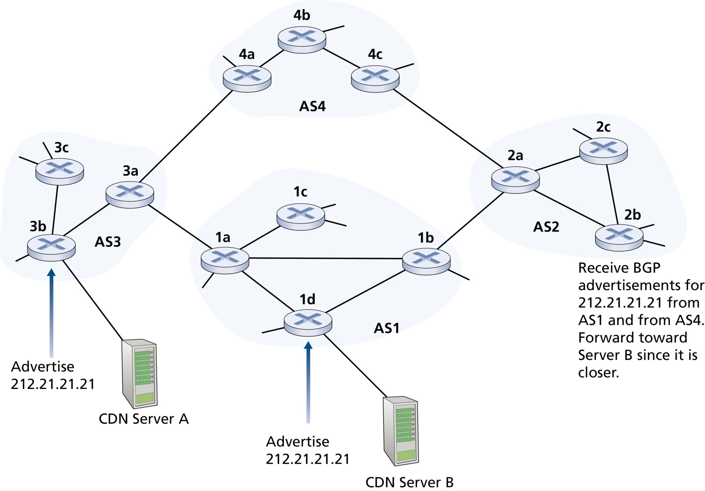


**任播的局限与应用**：CDN 通常不用 IP 任播做主要分发——因为 BGP 路由变化可能导致 **同一 TCP 连接的不同分组到达不同服务器实例**，破坏连接。但 DNS 系统广泛使用任播：13 个根服务器 IP 地址中，每个地址背后都有多台（有的地址背后超过 100 台）遍布全球的根服务器，DNS 查询经任播自动送达最近的那一台。

### 路由策略（Routing Policy）

**策略可以凌驾于一切技术考虑之上**——本地偏好属性由本 AS 策略决定，而规则 1 最先应用。图 5.13 是一个六 AS 的策略示例：W、X、Y 是接入 ISP（access ISP），A、B、C 是骨干提供商网络。

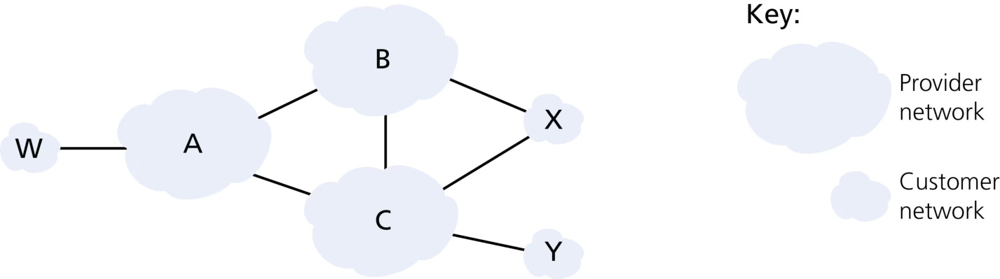

**客户-提供商关系与 stub 网络**：X 是 **多宿接入 ISP（multi-homed access ISP）**——经两个不同提供商（B、C）接入因特网。X 作为 **stub 网络（末端网络）**：进出 X 的所有流量必须源于或止于 X。如何强制执行？通过 **选择性地通告路由**：X 只向 B 和 C 通告「我自己」的前缀，**不通告任何其他可达路径**——即使 X 知道某条经 C 到达 W 的路径，也不把它通告给 B。B 不知道 X 有到 W 的路径，就绝不会经 X 转发目的为 W 的流量。这就是用「选择性的路由通告」实现客户/提供商经济关系。

**提供商的对等与免费搭车**：骨干提供商 A 从客户 W 学到路径 AW 后，可以把 BAW 通告给客户 B（让 B 经 A 到达 W），但 **不应把 BAW 通告给同为骨干的 C**——否则 C 可经 A 免费转接流量（**免费搭车，free ride**），A 不愿承担这份成本。商业 ISP 的通行规则：**任何流经某 ISP 骨干网络的流量，其源或目的（或两者）必须在该 ISP 的客户网络内**；否则就是在该 ISP 网络上免费搭车。逐对 ISP 之间的对等协议（peering agreement）通常秘密协商。

**为什么域间与域内协议不同？**（原书思考题）：① **策略**：AS 间策略主导（控制转接流量、政治经济因素），AS 内同一管理控制下策略次要；② **规模**：AS 间必须可扩展到海量网络，AS 内规模问题较小（太大可拆分 AS 或用 OSPF 区域）；③ **性能**：AS 间路由受策略约束，性能（路径长短）常是次要的，甚至没有「代价」概念（只有 AS 跳数）；AS 内则更关注路径性能。

### 综合：BGP 路径选择示例与「获得因特网存在」

**综合路径选择流程**（图 5.10 网络为例）：AS1 中路由器 1b 学到两条到 x 的 BGP 路由——经 AS2（NEXT-HOP = 2a 左侧接口）与绕过 AS2 直达 AS3（NEXT-HOP = 3d 左侧接口）。若只按热土豆路由，1b 比较到两个 NEXT-HOP 的域内代价，选小者（例如经 2a）；但按完整选择算法，**规则 2（AS-PATH 最短）先于规则 3（热土豆）**，[AS1, AS3] 比 [AS1, AS2, AS3] 短，故 1b 选择直达 AS3 的路径。若该 AS-PATH 中出现了自己的 ASN，则丢弃该通告（防环）。把外部前缀加入转发表必须 **同时使用 BGP 与域内协议（如 OSPF）**：BGP 给出 NEXT-HOP，OSPF 提供去往该 NEXT-HOP 的域内下一跳。

**「获得因特网存在」的完整流程**（把许多协议串起来）：新公司向本地 ISP 签约接入 → 获得 IP 地址范围（前缀）与网关路由器 → 向注册机构申请域名（如 xanadu.com），并在 .com 顶级域名服务器登记公司 DNS 服务器的 IP → 在公司 DNS 服务器中配置 www.xanadu.com 等主机名到 IP 的映射 → 本地 ISP 用 **BGP** 把公司前缀通告给其连接的 ISP，这些 ISP 再继续通告，最终全网路由器都知道该前缀，能把目的为公司服务器的数据报正确转发。可见：**IP 编址 + DNS + BGP 三者共同把一家公司「接上」因特网**。

**BGP 报文类型补充**（王道 2026，408 高频）：BGP-4 使用四种报文——**Open（打开）报文**：与相邻 BGP 对等方建立关系、初始化通信（TCP 连接建立后必须首先发送，收到后回送 Keepalive 表示接受）；**Update（更新）报文**：BGP 核心，通知新路由或撤销旧路由（撤销可一次多条，增加新路由每报文一条）；**Keepalive（保活）报文**：周期性（默认 60 秒）证实邻站连通性，仅 19 字节；**Notification（通知）报文**：发送检测到的差错。BGP 刚运行时先交换整个路由表，此后只在变化时增量更新，节省带宽与开销。

---

## 5.5 SDN 控制平面

本节深入 **SDN（软件定义网络，Software-Defined Networking）控制平面**——控制 SDN 设备间分组转发的全网逻辑。SDN 文献习惯把转发设备称为「分组交换机（packet switch，简称交换机）」，因为转发决策可基于传输层、网络层、链路层首部的任意字段（第 4 章 OpenFlow 支持基于 11 个首部字段值转发）。

**核心概念⑤：SDN 控制平面** —— 把网络的控制逻辑从交换机中抽离出来，放到一台 **逻辑集中** 的 SDN 控制器与一组 **网络控制应用** 中：数据平面（交换机）只管「匹配 + 动作」的执行，控制平面（控制器 + 应用）负责计算、管理并安装所有交换机的流表。

**SDN 体系结构的四个关键特征**（Kreutz 2015，408 常考）：

1. **基于流的转发（flow-based forwarding）**：SDN 交换机的转发可基于传输/网络/链路层首部的任意字段值（OpenFlow 支持 11 个字段），与传统「只按目的 IP 地址转发」截然不同；转发规则写在交换机的 **流表（flow table）** 中，由 SDN 控制平面负责计算、管理与安装。
2. **数据平面与控制平面分离（separation of data and control planes）**：数据平面是网络中的交换机——执行流表中「匹配 + 动作」规则的简单（但快速）设备；控制平面是决定并管理交换机流表的服务器与软件。
3. **网络控制功能位于数据平面交换机之外（network control functions external to data-plane switches）**：控制平面软件运行在 **独立且远程** 的服务器上，由两部分组成——**SDN 控制器**（或称网络操作系统）与一组 **网络控制应用**。控制器维护准确的网络状态（远程链路、交换机、主机的状态），把状态提供给网络控制应用，并提供应用监控、编程、控制底层设备的手段。控制器虽然画成一台中央服务器，实际是 **逻辑集中** 的：由多台服务器协同实现，提供可扩展性能与高可用。
4. **可编程的网络控制平面（programmable network control plane）**：网络控制应用是控制平面的「大脑」，通过控制器提供的 API 指定并控制数据平面的行为。例如：路由应用可用 Dijkstra 计算端到端路径；访问控制应用决定哪些分组在交换机处被阻塞；另一应用可让交换机按特定方式转发。

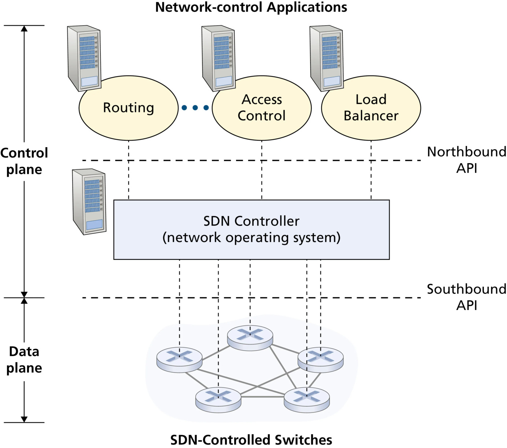

**「解捆绑（unbundling）」的意义**：SDN 把网络功能从「单厂商垂直整合的路由器」中解放出来——数据平面交换机、SDN 控制器、网络控制应用可以是 **不同厂商** 的独立实体。这好比计算领域从「主机」（硬件+系统软件+应用一家提供）演进到「PC」（三者分离、开放生态）。SDN 期待同样的创新红利。

**SDN 与「网络操作系统」**：控制器常被称为 **网络操作系统（network operating system）**——它像操作系统一样管理「网络资源」（交换机、链路、流表），向上层应用提供统一的编程接口（北向 API），屏蔽底层设备异构性。路由应用、访问控制应用、负载均衡应用都是运行在「网络 OS」之上的程序，可以独立开发、动态加载、随时替换——这是传统路由器（软件固化在设备里）做不到的。

### SDN 控制器与网络控制应用

SDN 控制平面分为两个部分：**SDN 控制器** 与 **网络控制应用**。控制器结构自下而上分三层：

1. **通信层（communication layer）**：负责 SDN 控制器与被控设备之间的通信，是控制器架构的最低层。控制器与被控设备之间的通信跨越 **南向接口（southbound interface）**。设备向控制器上报本地观察事件（链路 up/down、设备加入、心跳），控制器据此获得最新网络视图。5.5.2 的 **OpenFlow** 协议就提供这种通信功能，几乎所有 SDN 控制器都实现了它。
2. **网络状态管理层（network-wide state management layer）**：控制器维护全网的主机、链路、交换机状态（含流表计数器值与流表副本），供上层应用查询。
3. **北向接口层（northbound interface）**：控制器经北向 API 与应用交互：应用可读/写网络状态与流表，注册状态变化事件通知，从而响应设备上报的事件。流行控制器（如 ONOS）用 **REST** 请求-响应接口与应用通信。

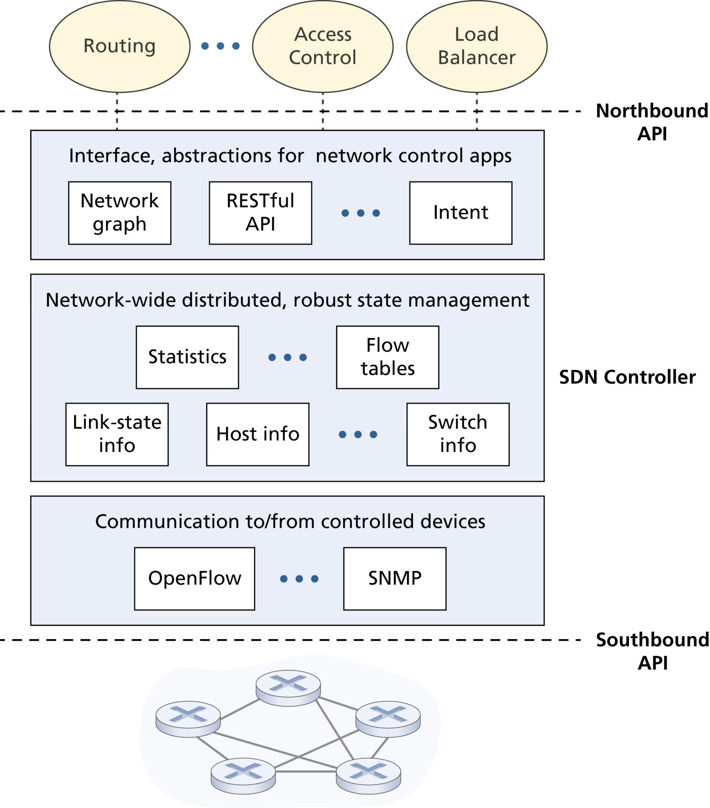

**逻辑集中与物理分布**：控制器从外部看是单一服务，实际由一组分布式服务器实现（容错、高可用、性能）。这带来分布式系统的经典挑战：事件逻辑时间排序、一致性、共识（共识协议如 Paxos/Raft 的用武之地）。现代控制器（ONOS、Orion）都强调「逻辑集中、物理分布」的架构设计。

### OpenFlow 协议

**OpenFlow 协议** 运行于 SDN 控制器与实现了 OpenFlow API 的被控交换机之间，**运行在 TCP 之上（默认端口 6653）**。

**控制器 → 交换机** 的重要消息：

- **Configuration（配置）**：控制器查询与设置交换机的配置参数。
- **Modify-State（修改状态）**：控制器添加/删除/修改交换机流表项、设置交换机端口属性。
- **Read-State（读取状态）**：控制器收集交换机流表与端口的统计与计数器值。
- **Send-Packet（发送分组）**：控制器让交换机从指定端口发出特定分组（分组在消息负载中）。

**交换机 → 控制器** 的重要消息：

- **Flow-Removed（流移除）**：通知控制器某流表项已被移除（超时或收到 modify-state）。
- **Port-status（端口状态）**：交换机通知控制器端口状态变化。
- **Packet-in（分组进入）**：到达交换机端口但不匹配任何流表项的分组被送到控制器做进一步处理（匹配的分组也可按动作被送到控制器）。

### 数据平面与控制平面的交互：一个例子

图 5.16 展示了用 Dijkstra 算法做最短路径路由的 SDN 场景，与 5.2/5.3 的每路由器控制有两个关键区别：**Dijkstra 作为独立应用运行在交换机之外**；**交换机把链路更新发给 SDN 控制器，而非互相洪泛**。

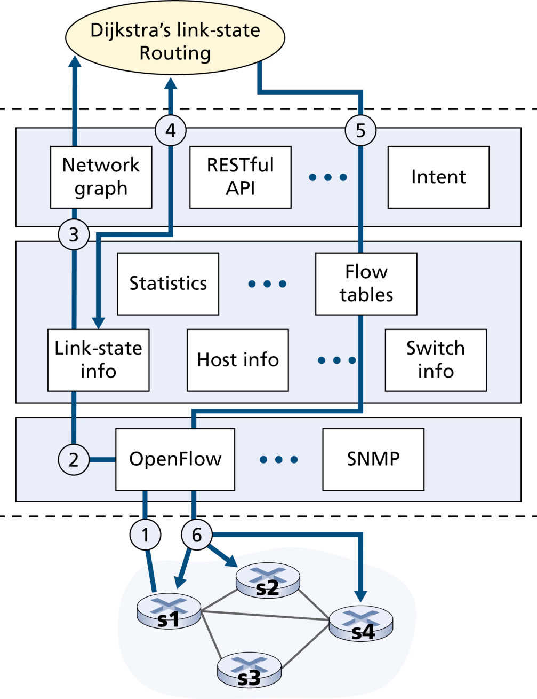

假设交换机 s1 与 s2 之间的链路中断，采用最短路径路由，s1、s2、s3 的出入流表项受影响：

1. 交换机 s1 用 **OpenFlow port-status 消息** 向控制器报告链路状态变化。
2. 控制器收到消息，通知 **链路状态管理器**，更新链路状态数据库。
3. 已注册链路状态变化通知的 **Dijkstra 路由应用** 收到事件通知。
4. 路由应用从链路状态管理器获取最新链路状态，**计算新的最低成本路径**。
5. 路由应用与 **流表管理器** 交互，确定需要更新的流表。
6. 流表管理器用 OpenFlow 协议更新受影响交换机（s1、s2、s3）的流表项。

**要点**：SDN 控制平面把过去「每台路由器各跑各的」的路由服务集中起来。ISP 想改路由策略时，只需修改 **控制应用软件**；传统每路由器控制下，则需要更新（可能来自多家厂商的）所有路由器的软件——这就是 SDN 的可编程性与可演进性优势。

### SDN：演进

**早期根源**：数据/控制平面分离并非 SDN 首创。1970 年代初的 TYMNET I 与 AT&T Spider 网络就采用集中控制器；2004 年前后 Feamster 等人的工作与 RFC 3746 明确主张两者分离；**Ethane 项目**（2007 年）开创了「简单流式以太网交换机 + 集中控制器」的模式，迅速演化为 OpenFlow 项目——「剩下的就是历史」。

**ONOS 控制器**：开源 SDN 控制器（ONF 支持）。与通用控制器一样分三层：**北向抽象与协议**（特色是 **意图框架 intent framework**——应用只需声明高层意图如「连接主机 A 与 B」，无需知道实现细节）、**分布式核心**（网络链路/主机/设备状态存储在分布式核心中，多台服务器各跑一份相同软件、提供逻辑集中的服务）、**南向抽象与协议**（屏蔽底层异构设备，使核心与设备/协议无关）。

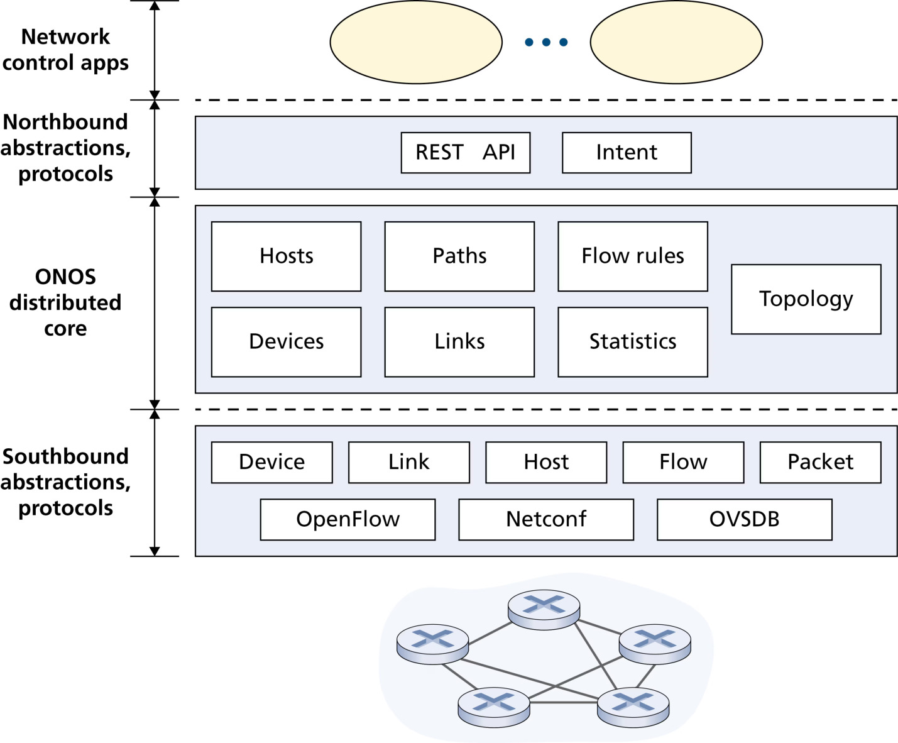


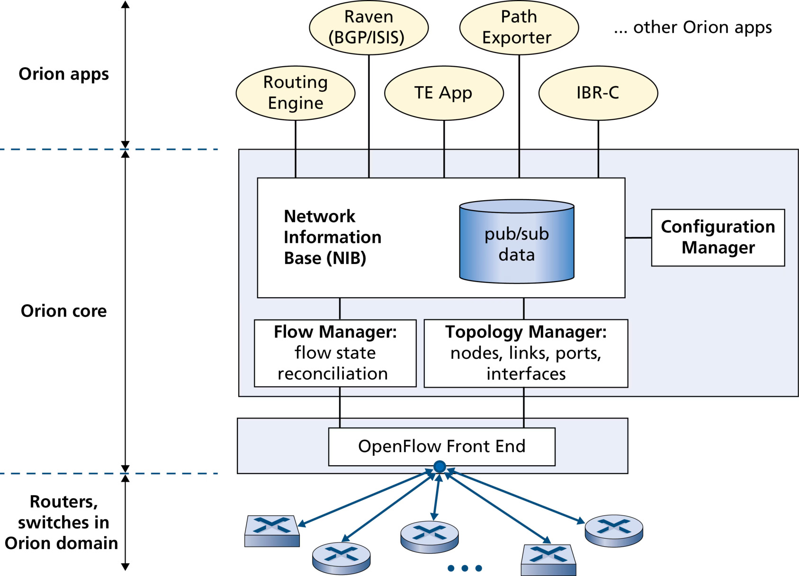


**Orion 控制器**：谷歌第二代 SDN 平台，控制 Jupiter 数据中心网络与互联各数据中心的广域网。每个谷歌网络划分为若干 **域（domain）**，一个 Orion 控制器实例管理一个域内的设备（限制故障影响面与控制器工作量）。核心是 **网络信息库（NIB，Network Information Base）**——逻辑集中的数据存储 + 数据驱动的发布/订阅（pub/sub）系统，Orion 应用与核心组件经 NIB 读写数据并接收变更通知。核心内的微服务：**拓扑管理器**（维护链路/路由器/交换机状态与端口统计）、**配置管理器**（设置配置参数并校验）、**流管理器**（保证应用登记的目标状态与设备上报的实际状态一致）。Orion 实现了 **意图驱动的网络（intent-based networking）**：指定「网络的最终目标状态是什么（what）」，而非「如何一步步改（how）」。


**未来方向**：SDN 的推广正在用「简单商品交换硬件 + 复杂软件控制平面」取代「专用单片交换机/路由器」。**NFV（网络功能虚拟化）** 是 SDN 的泛化：用商品服务器/存储/交换替代专用中间盒。RCP（路由控制平台，AT&T 的早期集中式路由原型，可在一台商品机上为整个骨干网计算路由）与 **P4**（可编程数据平面语言，让交换机行为可编程）代表了控制平面从集中到可编程的持续演进。挑战：SDN 控制器自身要能容忍故障并快速恢复。

---

## 5.6 ICMP：因特网控制报文协议

**ICMP（Internet Control Message Protocol，因特网控制报文协议）**（RFC 792）被主机与路由器用来 **彼此通信网络层信息**，最常见的用途是 **差错报告**。例如 HTTP 会话中遇到「目的网络不可达」错误——某台 IP 路由器找不到通往目的主机的路径，就构造并发送一条 ICMP 报文通知源主机。

**ICMP 的位置**：ICMP 常被视为 IP 的一部分，但 **在体系结构上它位于 IP 之上**——ICMP 报文 **封装在 IP 数据报中**（作为 IP 载荷），就像 TCP/UDP 报文段作为 IP 载荷一样。主机收到上层协议号为 ICMP（值为 1）的 IP 数据报时，把它解复用给 ICMP。**重要辨析（王道 2026）**：ICMP 是 **网络层协议**（不是传输层/应用层协议）；而 PING 程序运行在应用层但直接使用网络层的 ICMP 回送报文，Traceroute/Tracert 工作在网络层。

**ICMP 报文的构成**：ICMP 报文有 **类型（type）** 与 **代码（code）** 字段，并且 **携带触发该 ICMP 报文的 IP 数据报的首部与前 8 字节**（让发送方知道是哪个数据报出了错）。常见类型见图 5.19。**记忆口诀**：类型号 3 目的不可达、4 源点抑制（已废弃）、5 重定向、8/0 回送请求/回答、11 时间超过、12 参数问题——其中「差错报告五大类 + 询问两大类」是选择题必考点。

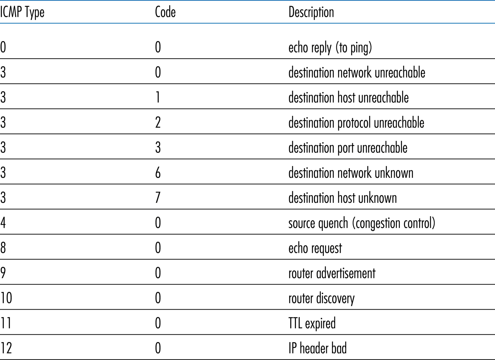


**ICMP 差错报告报文（5 种，408 高频，2022 真题考点）**：

1. **目的不可达（destination unreachable，类型 3）**：路由器或主机不能交付数据报时，向源主机报告（如目的主机不存在、端口不可达等，用代码字段细分）。
2. **源点抑制（source quench，类型 4）**：路由器或主机因拥塞丢弃数据报时通知源点放慢发送速率。**注意**：最新 ICMP 标准（RFC 6633）已 **不再使用** 源点抑制报文（该机制被证明无效，已废弃）。
3. **时间超过（time exceeded，类型 11）**：路由器收到数据报时把 TTL 减 1，若结果为 0 则丢弃并向源点发送时间超过报文；终点在预定时间内未收齐某个数据报的全部分片时，也丢弃已收分片并发送时间超过报文。
4. **参数问题（parameter problem，类型 12）**：路由器或目的主机发现 IP 首部中某字段值不正确时，丢弃数据报并向源点发送参数问题报文。
5. **改变路由（重定向，redirect，类型 5）**：路由器把改变路由报文发给主机，告诉它下次应把数据报送给另一台（更好的）路由器。

**不应发送 ICMP 差错报告报文的四种情况**（408 常考）：① 对 ICMP 差错报告报文，不再发送 ICMP 差错报告报文；② 对第一个分片之后的所有后续分片，都不发送 ICMP 差错报告报文；③ 对具有 **多播地址** 的数据报不发送；④ 对具有 **特殊地址**（如 127.0.0.0 环回或 0.0.0.0）的数据报不发送。

**ICMP 询问（查询）报文**：① **回送请求与回答（echo request/reply，类型 8/0）**——测试目的主机是否可达及其状态；② **时间戳请求与回答**——发送方据此计算往返时延。

**两个经典应用（408 高频）**：

- **PING**：发送 **ICMP 回送请求（echo request，类型 8）** 给指定主机，目的主机收到后回送 **ICMP 回送回答（echo reply，类型 0）**。PING 用来测试两台主机之间的连通性，并统计往返时延、丢包率等。多数 TCP/IP 实现的 ping 服务器直接内置于操作系统。
- **Traceroute（Windows 中叫 Tracert）**：源主机向目的主机发送一系列 **携带不可达 UDP 端口号** 的普通 IP 数据报：第 1 个 TTL=1、第 2 个 TTL=2、第 3 个 TTL=3……并为每个数据报启动定时器。数据报到达第 n 台路由器时 TTL 恰好到期，路由器丢弃该数据报并回送 **ICMP 时间超过（time exceeded，类型 11）** 报文，其中含路由器名字与 IP 地址；源主机据此获得第 n 跳路由器的标识与往返时延。当某个数据报终于到达目的主机时，因为携带不可达端口号，目的主机回送 **ICMP 端口不可达（类型 3 的代码 3）** 报文——源主机收到它就停止发送探测数据报。标准 Traceroute 对每个 TTL 发送 3 个分组（3 次结果），从而测得每跳的往返时延与路由。

**ICMPv6**：RFC 4443 为 IPv6 定义了新版 ICMP，除重组类型/代码外还新增了「**分组太大（Packet Too Big）**」类型与「未识别选项」错误代码（IPv6 路径 MTU 发现的基石）。

---

## 5.7 网络管理：SNMP 与 NETCONF/YANG

一个网络由成百上千个复杂部件组成（链路、交换机、路由器、主机……），网络管理员要让网络「持续正常运行」绝非易事。**网络管理（network management）** 的定义（Saydam 1996）：以合理的成本，满足网络在实时性、运行性能与服务质量方面要求，对网络的 **部署、集成与协调**——包括对网络及网元资源的 **监控、测试、轮询、配置、分析、评估与控制**。本节只讲其中的机制骨架：架构、协议与数据。

### 网络管理框架

图 5.20 给出网络管理的五个要素：

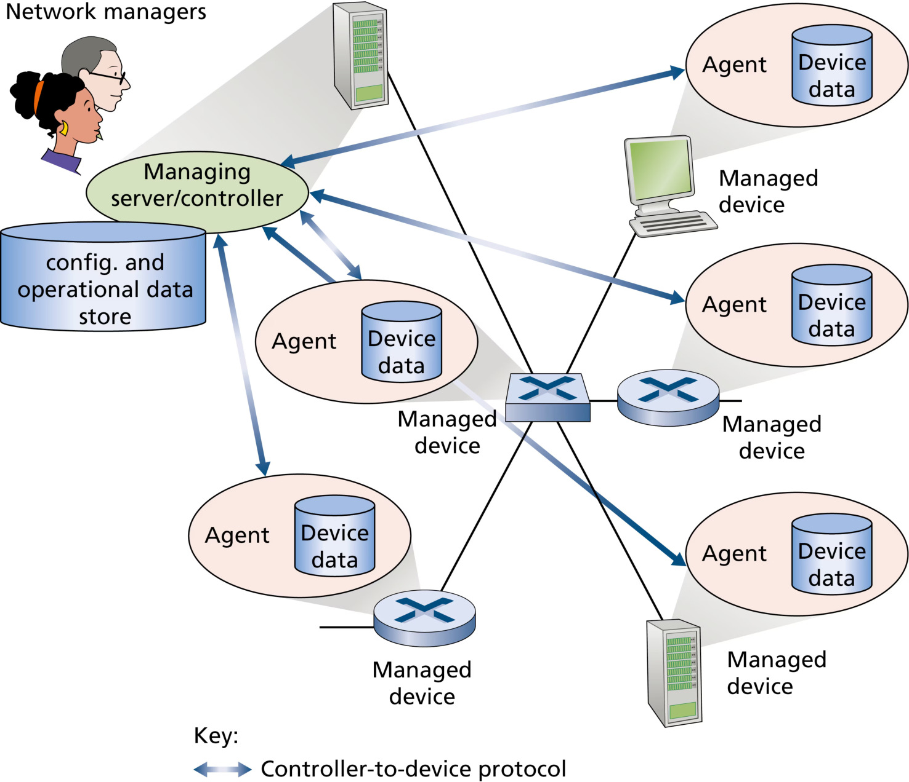

1. **管理服务器（managing server）**：运行在网络运维中心（NOC）集中式网管工作站上的应用（通常有人类网络管理员参与）。它是网管活动的中心：控制网管信息的收集、处理、分析、分发，在这里发起配置、监控、控制被管设备的动作。
2. **受管设备（managed device）**：受管网络上的网络设备（含其软件），如主机、路由器、交换机、中间盒、调制解调器甚至温度计。设备内有多个可管部件（网络接口只是其中之一）。
3. **数据（data）**：每个受管设备有与其关联的数据（又称状态）。分三类：**配置数据**（管理员显式配置的，如 IP 地址、接口速率）、**运行数据**（设备运行中获取的，如 OSPF 的邻居列表）、**设备统计**（运行中更新的状态指示与计数，如某接口丢弃的分组数、风扇转速）。管理服务器也维护自己的副本。
4. **网络管理代理（network management agent）**：运行在受管设备中的软件进程，与管理服务器通信、在设备上按管理服务器的命令与控制采取本地动作（类似 5.1 图 5.2 的路由代理）。
5. **网络管理协议（network management protocol）**：运行在管理服务器与受管设备之间，让管理服务器查询设备状态、经代理对设备采取动作；代理也可用该协议把异常事件（组件故障、性能阈值违例）通知管理服务器。**注意**：网络管理协议本身并不管理网络，它只是提供网管人员可以用来管理网络的能力。

**三种实际管理方式**：① **CLI**：运维人员直接在被管设备控制台或经 Telnet/SSH 敲命令——厂商相关、易出错、难自动化、难扩展；② **SNMP/MIB**：用 SNMP 查询/设置设备 **MIB**（管理信息库）对象——主要用于监控运行状态与统计，再用 CLI 主动配置控制；两种方式都是 **逐设备管理**；③ **NETCONF/YANG**：更抽象、全网化、面向整体，强调 **配置管理**（指定正确性约束、多设备原子操作），源自 RFC 3535 对 SNMP 配置能力不足的总结。

### SNMP 与 MIB

**SNMP（Simple Network Management Protocol，简单网络管理协议）v3**（RFC 3410）是应用层协议，用于在管理服务器与代理之间传送网管控制与信息报文。两种常见用法：**请求-响应模式**（管理服务器发请求，代理执行动作并回送应答；典型请求用于查询 get 或修改 set MIB 对象值）与 **trap 模式**（代理主动向管理服务器发送 **trap 报文**，通知异常事件，如链路接口 up/down）。

**MIB（Management Information Base，管理信息库）**：受管设备的运行状态数据（及部分配置数据）以 **对象（object）** 形式组织成该设备的 MIB。MIB 对象可能是计数器（如因 IP 首部差错被丢弃的数据报数）、描述信息（DNS 服务器软件版本）、状态信息（设备是否正常）、协议信息（到某目的的路由）。对象用 **SMI（结构化管理信息）** 数据描述语言正式定义（保证语法语义无歧义）；相关对象聚合为 MIB 模块。典型的对象定义如 ipSystemStatsInDelivers（只读计数器，统计已成功交付给上层协议的 IP 数据报总数）。

**SNMPv3 的 PDU 类型**（表 5.2，408 常考 get/set/trap）：

| PDU 类型 | 发送方→接收方 | 描述 |
|:---|:---|:---|
| GetRequest | 管理服务器→代理 | 获取一个或多个 MIB 对象实例的值 |
| GetNextRequest | 管理服务器→代理 | 获取列表/表中下一个 MIB 对象实例的值 |
| GetBulkRequest | 管理服务器→代理 | 获取大数据块（如大表），避免多次往返 |
| SetRequest | 管理服务器→代理 | 设置一个或多个 MIB 对象实例的值 |
| InformRequest | 管理服务器→管理服务器 | 通知远程管理实体其访问范围外的 MIB 值 |
| Response | 代理→管理服务器 | 对 Get/Set/Inform 请求的应答 |
| trap | 代理→管理服务器 | 异步事件通知（冷/热启动、链路 up/down、失去邻居、认证失败） |

**传输**：SNMP PDU 通常承载在 **UDP 数据报** 中（RFC 3417 称 UDP 是「首选的传输映射」）。由于 UDP 不可靠，请求或应答可能丢失；SNMP 标准未强制规定重传机制，只要求管理服务器「负责任地」决定重传频率与时长。

**安全演进**：SNMP 历经三个版本。v1 缺乏足够安全性，导致 SetRequest 几乎不被使用（SNMP 主要用于监控而非控制）；v3 在 **管理与安全** 上大幅增强（认证、加密、访问控制）。

### NETCONF 与 YANG

**NETCONF（网络配置协议）**（RFC 6241）运行于管理服务器与受管设备之间，提供三类消息能力：① 检索、设置、修改受管设备的 **配置数据**；② 查询设备的 **运行数据与统计**；③ **订阅** 设备产生的通知。NETCONF 采用 **远程过程调用（RPC）** 范式，协议消息用 **XML** 编码，在 **安全、面向连接的会话**（如 TLS over TCP）上交换。图 5.21 展示一次 NETCONF 会话：建立安全连接 → 双方交换 <hello> 声明能力 → 用 <rpc>/<rpc-reply> 交互（检索、设置、查询、修改配置与订阅通知）→ 设备主动推送 <notification> → <session-close> 关闭会话。


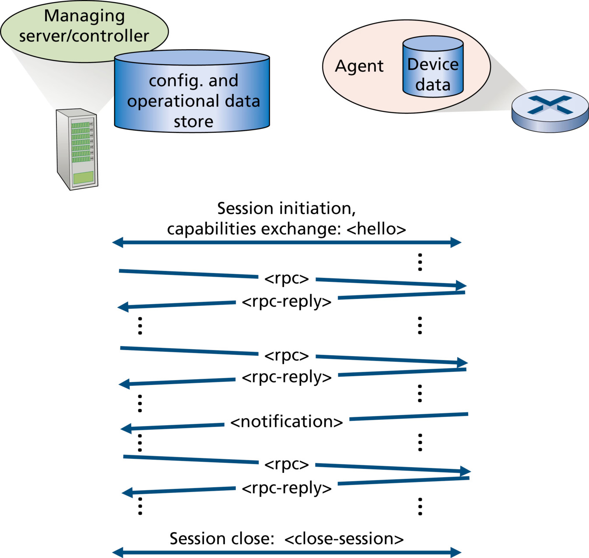

**常用 NETCONF 操作**：<get-config>（取全部或部分配置）、<get>（取配置与运行状态）、<edit-config>（修改配置，成功回 <ok>，失败回 <rpc-error> 且可回滚到先前状态）、<lock>/<unlock>（锁定/解锁整个配置数据库，防止并发修改冲突）、<create-subscription>（发起事件通知订阅）。用基本操作还可构造 **多设备事务**：要么原子地全部成功，要么全部回滚——这实现了「把网络作为整体配置而非逐设备配置」的运维目标（RFC 3535 的核心诉求）。

**YANG**（RFC 6020）：用于精确描述 NETCONF 所用网管数据 **结构、语法、语义** 的 **数据建模语言**（类似 SNMP 中 SMI 的角色）。YANG 模块定义内置数据类型，还可表达 **约束条件**（合法的 NETCONF 配置必须满足），帮助保证配置的正确性与一致性；YANG 也用于描述 NETCONF 通知。

**SNMP 与 NETCONF/YANG 的定位差异**：SNMP 长于 **监控**（get/trap），NETCONF 长于 **配置**（edit-config/lock + 多设备事务）；SNMP 逐设备、简单，NETCONF 全网化、面向整体、支持校验与回滚。两者互补共存。

---

## 5.8 小结

本章完成了网络核心的两章旅程。控制平面是「数据报如何路由 + 网络层组件与服务如何配置管理」的全网逻辑。两种实现路线：**传统每路由器控制**（每个路由器跑路由算法、互相通信）与 **SDN 逻辑集中式控制**（一台控制器计算并分发转发表）。两种基础路由算法：**链路状态（LS）**——集中式、洪泛全网信息、Dijkstra 计算、O(n²)、有振荡问题；**距离向量（DV）**——分布式迭代异步、Bellman-Ford 方程、好消息快坏消息慢、计数到无穷、毒性逆转只能缓解两节点环路。两大因特网协议：**OSPF**（域内，LS + 洪泛 + Dijkstra，不基于跳数，可分层）与 **BGP**（域间，路径向量，eBGP/iBGP 会话，AS-PATH/NEXT-HOP 属性，本地偏好 → AS-PATH → 热土豆 → BGP 标识符的选择顺序，支持 IP 任播与策略控制）。SDN 控制平面把控制逻辑集中到控制器与网络控制应用，OpenFlow 是南向通信协议。网络管理方面：ICMP 负责差错报告与询问（ping 用回送、Traceroute 用时间超过）；SNMP/MIB 负责监控（get/set/trap），NETCONF/YANG 负责配置管理。下一章将沿协议栈继续下行到链路层。

---

## 🧪 本章习题

> 每道题均可回溯至本章正文（考点映射见章首导览）。A 组为基础题，B 组为提高题，C 组为拓展综合题（408 大题风格，含真题改编），最后为原书习题讲解。

### A 基础题（单选/填空，每题 1-2 分）

**A1.**（单选）下列路由算法中，属于 **集中式** 算法的是（ ）。

- A. 距离向量（DV）算法
- B. Dijkstra 链路状态（LS）算法
- C. RIP 算法
- D. BGP 算法

??? answer "查看答案"
    **答案：B**

    Dijkstra 算法需要 **全网完整的拓扑与链路代价信息** 作为输入（集中式）；DV 算法是分布式迭代的，RIP 基于 DV，BGP 是路径向量协议，三者都是分布式。

**A2.**（单选）关于 OSPF 协议，下列说法 **错误** 的是（ ）。

- A. OSPF 是链路状态协议，使用洪泛法向 AS 内所有路由器发送信息
- B. OSPF 直接封装在 IP 数据报中（协议字段 89），是网络层协议
- C. OSPF 使用跳数作为度量，路径最多经过 15 个路由器
- D. OSPF 支持将自治系统划分为多个区域，洪泛范围被限制在区域内

??? answer "查看答案"
    **答案：C**

    **跳数限制 15（16 表示不可达）是 RIP 的规定**，不是 OSPF 的。OSPF 是链路状态算法，度量是链路代价（可由管理员配置），不基于跳数。A、B、D 均正确。

**A3.**（填空）BGP 路由通告中最重要的是两个属性：**____**（通告所经过的自治系统列表，用于路径选择与防环）与 **____**（开始该 AS-PATH 的路由器接口 IP 地址，用于衔接域内路由）。

??? answer "查看答案"
    **AS-PATH**；**NEXT-HOP**。

    AS-PATH 每经过一个 AS 就追加其 ASN，路由器若发现自己的 ASN 已在其中则丢弃该通告（防环）；NEXT-HOP 是下一跳路由器接口的 IP 地址，本 AS 用域内协议（如 OSPF）找到去往该地址的路由。

**A4.**（单选）使用 **PING** 测试两台主机的连通性，利用的是 ICMP 的（ ）报文；**Traceroute** 跟踪路由利用的是 ICMP 的（ ）报文。

- A. 回送请求与回答；时间超过
- B. 时间超过；回送请求与回答
- C. 目的不可达；源点抑制
- D. 源点抑制；参数问题

??? answer "查看答案"
    **答案：A**

    PING 发送 ICMP **回送请求（echo request，类型 8）** 并接收 **回送回答（echo reply，类型 0）**；Traceroute 逐跳递增 TTL，路由器在 TTL 到期时回送 **时间超过（time exceeded，类型 11）** 报文，源主机据此获得每跳信息；目的主机则回送端口不可达报文使 Traceroute 停止。

**A5.**（单选）SNMP 中，由受管设备上的代理 **主动** 向管理服务器发送、用于报告异常事件（如链路 up/down）的报文是（ ）。

- A. GetRequest
- B. SetRequest
- C. Response
- D. trap

??? answer "查看答案"
    **答案：D**

    **trap（陷阱）报文** 是异步生成的：不响应任何请求，而是在异常事件发生时主动通知管理服务器（如冷/热启动、链路 up/down、失去邻居、认证失败）。GetRequest/SetRequest 是管理服务器发往代理的请求，Response 是代理对请求的应答。

### B 提高题（简答/计算，每题 5-10 分）

**B1.**（计算，10 分）某网络拓扑含 5 个节点 a、b、c、d、e，链路代价：c(a,b)=1、c(a,c)=2、c(b,d)=3、c(c,d)=3、c(c,e)=5、c(d,e)=1。以 a 为源节点运行 Dijkstra 算法：

（1）填写完整的迭代步骤表（每轮：N′、D(b)、D(c)、D(d)、D(e) 及前驱）。

（2）给出 a 到各节点的最低成本路径与 a 的转发表。

??? answer "查看答案"
    （1）初始化：N′={a}，D(b)=1(a)、D(c)=2(a)、D(d)=∞、D(e)=∞。

    **第 1 轮**：b（D=1）最小 → 加入。更新 b 的邻居 d：D(d)=min{∞, 1+3}=4（前驱 b）。

    **第 2 轮**：c（D=2）最小 → 加入。更新 c 的邻居 d、e：D(d)=min{4, 2+3}=4（不变）；D(e)=min{∞, 2+5}=7（前驱 c）。

    **第 3 轮**：d（D=4）最小 → 加入。更新 d 的邻居 e：D(e)=min{7, 4+1}=5（前驱 d）。

    **第 4 轮**：e（D=5）→ 加入，结束。

    | 轮次 | N′ | D(b) | D(c) | D(d) | D(e) |
    |:---:|:---|:---:|:---:|:---:|:---:|
    | 初始 | {a} | 1(a) | 2(a) | ∞ | ∞ |
    | 1 | {a,b} | 1(a) | 2(a) | 4(b) | ∞ |
    | 2 | {a,b,c} | 1(a) | 2(a) | 4(b) | 7(c) |
    | 3 | {a,b,c,d} | 1(a) | 2(a) | 4(b) | 5(d) |
    | 4 | {a,b,c,d,e} | 1(a) | 2(a) | 4(b) | 5(d) |

    （2）最低成本路径：a→b：a-b（1）；a→c：a-c（2）；a→d：a-b-d（1+3=4）；a→e：**a-b-d-e**（1+3+1=5）。

    a 的转发表：目的 b→下一跳 b；目的 c→下一跳 c；目的 d→下一跳 b；目的 e→下一跳 b。

??? success "评分标准"

    - 初始化正确（1 分）
    - 每轮选出最小节点并更新邻居正确（每轮 1 分，共 4 分）
    - 最低成本路径与代价正确（3 分）
    - 转发表正确（2 分）

**B2.**（简答，8 分）距离向量算法中，「好消息传得快，坏消息传得慢」的原因是什么？什么是计数到无穷问题？毒性逆转为什么只能缓解两节点间的环路？

??? answer "查看答案"
    **原因**：DV 算法中，节点只把自己的距离向量告知直接邻居。当链路代价 **降低** 时，收到好消息的节点立即算出更小的距离并继续向邻居传播——新值沿最短路径向外扩散，每轮传播一跳，很快就位（好消息传得快）。当链路代价 **增大甚至中断** 时，节点看到邻居仍通告着「旧的好消息」（经由自己到达目的地的距离），便误以为仍可经邻居绕行，算出一个偏大的错误距离再通告回去——错误估计逐轮递增却难以发现，必须等到「绕行距离」超过真实直连代价才醒悟，故坏消息传得慢。

    **计数到无穷**：代价增大时节点间互相参考对方的错误估计，距离逐轮 +1 地增长，可能需要数十次迭代才能收敛（甚至趋向无穷），称为 count-to-infinity。

    **毒性逆转的局限**：毒性逆转只处理「A 经 B 到达目的 X」这种 **两节点直接互相依赖** 的环路——A 对 B 谎报「到 X 为 ∞」即可切断。但涉及 **三个及以上节点** 的环路（A→B→C→A）中，各节点并未直接互为邻居，单节点的谎报无法覆盖间接依赖，环路仍会存在。

??? success "评分标准"

    - 好消息传播机制（2 分）
    - 坏消息传播机制与计数到无穷（3 分）
    - 毒性逆转机制（2 分）
    - 三节点及以上环路的局限（1 分）

**B3.**（计算，8 分）路由器 R 位于 AS1，学到三条到前缀 y 的 BGP 路由：

- 路由 M：本地偏好 120，AS-PATH = [AS2, AS4, AS5]，NEXT-HOP 的域内代价 2；
- 路由 N：本地偏好 120，AS-PATH = [AS3, AS5]，NEXT-HOP 的域内代价 1；
- 路由 P：本地偏好 100，AS-PATH = [AS5]，NEXT-HOP 的域内代价 4。

按 BGP 路由选择算法，R 最终选择哪条？写出淘汰过程。

    ??? answer "查看答案"

        - **规则 1（本地偏好最高）**：M、N 的本地偏好为 120，P 为 100 → **淘汰 P**，剩 M、N。
    - **规则 2（AS-PATH 最短）**：M 的 AS-PATH 长度 3（AS2, AS4, AS5），N 的长度 2（AS3, AS5）→ **淘汰 M**，选择 **N**。
    - 规则 3（热土豆）、规则 4（BGP 标识符）无需使用。

    最终选择 **路由 N**（本地偏好 120、AS-PATH 最短 [AS3, AS5]）。注意：虽然 N 的 NEXT-HOP 域内代价 1 也恰好最小，但即使其域内代价更大（如 5），规则 2 仍先于规则 3 使其胜出——策略与路径长度优先于热土豆。

??? success "评分标准"

    - 规则 1 淘汰 P（2 分）
    - 规则 2 淘汰 M、选出 N（4 分）
    - 规则顺序说明（2 分）

### C 拓展题（计算/综合，每题 10-15 分）

**C1.**（计算，15 分，真题 2012#34 改编）某网络拓扑如下图所示，链路代价已标注。路由器 R1 使用链路状态算法（Dijkstra）计算最短路径树。

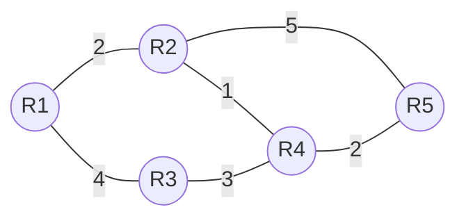
```mermaid
graph LR
    R1((R1)) -- 2 --- R2((R2))
    R1 -- 4 --- R3((R3))
    R2 -- 1 --- R4((R4))
    R2 -- 5 --- R5((R5))
    R3 -- 3 --- R4((R4))
    R4 -- 2 --- R5((R5))
```

（1）以 R1 为源运行 Dijkstra 算法，写出完整步骤表（N′、D(R2)、D(R3)、D(R4)、D(R5) 及前驱）。

（2）给出 R1 到各节点的最短路径树与 R1 的转发表。

（3）若改用距离向量算法：写出各节点的初始距离向量，并说明第一轮交换后 R2 的距离向量变化。

??? answer "查看答案"
    （1）初始化：N′={R1}，D(R2)=2(R1)、D(R3)=4(R1)、D(R4)=∞、D(R5)=∞。

    **第 1 轮**：R2（D=2）最小 → 加入。更新 R2 的邻居 R4、R5：D(R4)=min{∞, 2+1}=3（前驱 R2）；D(R5)=min{∞, 2+5}=7（前驱 R2）。

    **第 2 轮**：R4（D=3）最小 → 加入。更新 R4 的邻居 R3、R5：D(R3)=min{4, 3+3}=4（不变，前驱仍 R1）；D(R5)=min{7, 3+2}=5（前驱 R4）。

    **第 3 轮**：R3（D=4）最小 → 加入。更新 R3 的邻居（R1、R4 已在 N′）无变化。

    **第 4 轮**：R5（D=5）→ 加入，结束。

    | 轮次 | N′ | D(R2) | D(R3) | D(R4) | D(R5) |
    |:---:|:---|:---:|:---:|:---:|:---:|
    | 初始 | {R1} | 2(R1) | 4(R1) | ∞ | ∞ |
    | 1 | {R1,R2} | 2(R1) | 4(R1) | 3(R2) | 7(R2) |
    | 2 | {R1,R2,R4} | 2(R1) | 4(R1) | 3(R2) | 5(R4) |
    | 3 | {R1,R2,R4,R3} | 2(R1) | 4(R1) | 3(R2) | 5(R4) |
    | 4 | {R1,R2,R4,R3,R5} | 2(R1) | 4(R1) | 3(R2) | 5(R4) |

    （2）最短路径树（R1 为根）：R1→R2（2）；R1→R3（4，直连，不经 R4 因为 3+3=6>4）；R1→R2→R4（3）；R1→R2→R4→R5（5，注意经 R4 而非直连 R2-R5 的 7）。

    R1 的转发表：目的 R2→下一跳 R2；目的 R3→下一跳 R3；目的 R4→下一跳 R2；目的 R5→下一跳 R2。

    （3）初始距离向量（记 Dx(y) 为 x 到 y 的估计）：

    D(R1)=[0, 2, 4, ∞, ∞]；D(R2)=[2, 0, ∞, 1, 5]；D(R3)=[4, ∞, 0, 3, ∞]；D(R4)=[∞, 1, 3, 0, 2]；D(R5)=[∞, 5, ∞, 2, 0]。

    第一轮交换后，R2 用 Bellman-Ford 方程更新（邻居 R1、R4、R5）：

    D(R2,R1)=min{2, 1+D(R4,R1), 5+D(R5,R1)}=min{2, 1+∞, 5+∞}=2（不变）；
    D(R2,R3)=min{∞, 1+D(R4,R3)=1+3, 5+D(R5,R3)}=**4**（经 R4）；
    D(R2,R4)=1、D(R2,R5)=min{5, 1+2}=3（经 R4，从 5 降为 3）。

    故 R2 的新距离向量 D(R2)=[2, 0, 4, 1, 3]——到 R3、R5 的距离估计都因 R4 的通告而更新（好消息：新值变小）。

??? success "评分标准"

    - Dijkstra 步骤表完整正确（每轮 1 分，共 5 分）
    - 最短路径树与转发表正确（4 分）
    - 初始距离向量正确（3 分）
    - 第一轮交换后 R2 更新正确（3 分）

**C2.**（综合，15 分）考虑图 5.13 风格的 BGP 策略场景：接入 ISP：W（客户为骨干 A）、X（**多宿**：同时连接骨干 B 与 C）、Y（客户为骨干 C）；骨干 A、B、C 两两互连。

（1）X 是 stub 网络。X 应如何通告 BGP 路由，才能保证骨干 B 与 C 之间不会经 X 转发流量？

（2）骨干 A 从客户 W 学到路径 AW（A→W）。A 应把 BAW 通告给客户 B 吗？应把 BAW 通告给对等骨干 C 吗？分别说明理由。

（3）说明「任何流经某 ISP 骨干网络的流量，其源或目的必须在该 ISP 的客户网络内」这条商业规则如何由 BGP 的路由通告机制实现。

??? answer "查看答案"
    （1）X 只向 B 和 C 通告 **到达 X 自身** 的前缀，**不通告任何中转路径**。即使 X 从 C 学到了经 C 到达 W 的路径，也绝不通告给 B。这样 B 不知道 X 存在到 W 的路径，就永远不会把目的为 W 的流量交给 X 转发——X 的「stub」性质由选择性的路由通告强制执行。

    （2）**应通告给 B**：B 是 A 的客户，A 通告 BAW 使 B 能经 A 到达 W（A 作为提供商赚取转接费用、尽到连接义务）。**不应通告给 C**：C 是与 A 对等的骨干（不是客户），若 A 通告 BAW，C 可把发往 W 的流量经 A 免费转接——C 与 W 无客户关系，这份转接成本应由 C（或其客户链）承担；A 通告 BAW 给 C 等于让 C 在 A 的骨干上 **免费搭车（free ride）**。

    （3）实现机制：BGP 的通告是 **选择性的**——提供商只把「其客户网络可达」的路径通告给对等方，而 **不把「对等方路径」或「其他提供商路径」通告给对等方**。具体地，骨干 A 对等骨干 C 时：A 只通告「A 的客户（如 W）可达」的路径，不通告「经 B 到达的路径」。这样经 A 骨干转发的流量，其源/目的必然落在 A 的客户网络内（否则该路径不会被通告进来），从而杜绝免费搭车。客户-提供商、对等关系由此被编码进路由通告策略中。

??? success "评分标准"

    - X 的通告策略（只通告自身前缀）（4 分）
    - A 通告 B 与否及理由（3 分）
    - A 不通告 C 的理由（免费搭车）（4 分）
    - 选择性通告机制论述（4 分）

**C3.**（综合，15 分，真题 2017#47 改编）三台路由器 R1、R2、R3 互连成线形拓扑：R1—R2—R3（相邻链路代价均为 1），R1 直连网络 N1，R2 直连网络 N2，R3 直连网络 N3，三台路由器运行 RIP。

（1）写出 R1、R2、R3 的初始路由表（各自只知直连网络，距离为 1）。

（2）假设各路由器每 30 秒交换一次路由表（RIP），给出第一次交换并更新后 R1、R2、R3 的路由表。

（3）若此时 R1 到 N1 的链路中断，说明「坏消息传得慢」如何体现（简要叙述 R1、R2 的更新过程）。

??? answer "查看答案"
    （1）初始路由表（只含直连网络，距离 1，下一跳「直接交付」）：

    | 路由器 | 路由表 |
    |:---|:---|
    | R1 | <N1, 1, 直接交付> |
    | R2 | <N2, 1, 直接交付> |
    | R3 | <N3, 1, 直接交付> |

    （2）第一次交换：R1 收到 R2 的 <N2,1>，距离 +1 得 <N2,2>（下一跳 R2），R1 表中无 N2 → 添加；R1 把自己的 <N1,1> 发给 R2，R2 添加 <N1,2>（下一跳 R1）。同理 R2↔R3 交换后，R2 添加 <N3,2>（下一跳 R3），R3 添加 <N2,2>（下一跳 R2）。R1 不直接收 R3 的表（RIP 只与相邻路由器交换）。

    第一次交换并更新后：

    | 路由器 | 路由表 |
    |:---|:---|
    | R1 | <N1,1,直接交付>；<N2,2,R2> |
    | R2 | <N1,2,R1>；<N2,1,直接交付>；<N3,2,R3> |
    | R3 | <N2,2,R2>；<N3,1,直接交付> |

    （3）R1 到 N1 的链路中断后：R1 把到 N1 的距离改为 16（不可达）并通告给 R2。但 **R2 仍持有旧表项 <N1, 2, R1>**——R2 先经 R1 学到 N1，此时它不知道 R1 已不可达 N1，仍会通告 R1 说「我经你到达 N1（距离 2）」。R1 收到后误以为可经 R2 绕行：D(R1,N1)=min{16, 1+2}=3（错误），再通告 R2；R2 更新 D(R2,N1)=1+3=4，通告 R1；R1 更新为 5……**距离逐轮 +1**，直到绕行距离超过 16 才醒悟（计数到无穷）。若中途没有其他机制（如毒性逆转），需要多轮交换才能收敛——这就是 RIP「坏消息传得慢」、慢收敛的体现。

??? success "评分标准"

    - 初始路由表正确（3 分）
    - 第一次交换后三台路由器的路由表正确（R1、R2、R3 各 3 分，共 9 分）
    - 坏消息慢传播的更新过程叙述正确（3 分）

### 原书习题讲解

**原书 R6.**（概念辨析）比较链路状态（LS）路由算法与距离向量（DV）路由算法在消息复杂度、收敛速度与健壮性三方面的差异。

??? answer "查看答案"
    **消息复杂度**：LS 需要每个节点知道全网每条链路的代价，需发送 O(|N||E|) 条消息（洪泛），且链路代价变化时要通告所有节点；DV 只要求直接邻居间在每次迭代时交换消息，链路代价变化也只在引起最短路径变化时才传播结果——DV 的消息交互更局部，但收敛时间依赖因素多。

    **收敛速度**：LS 收敛快（洪泛完成后各节点立即本地算完，实现是 O(|N||E|) 消息）；DV 收敛可能慢，收敛过程中可能出现路由环路，还受 **计数到无穷** 问题困扰（坏消息传得慢）。

    **健壮性**：LS 较好——路由器只广播自己相连链路的（错误）代价，各节点独立计算自己的转发表，故障影响被隔离；DV 较差——一个节点可向任何目的通告错误的最短路径，错误会扩散到邻居的邻居，甚至波及全网（1997 年一台故障路由器曾使因特网大片断连数小时）。

??? success "评分标准"

    - 三个维度各 2 分（共 6 分）
    - 每个维度 LS 与 DV 对比正确（各维度再 1 分，共 3 分）
    - 表述清晰（1 分）

**原书 R14.**（概念辨析）为什么因特网使用不同的域间（inter-AS）与域内（intra-AS）路由协议？

??? answer "查看答案"
    三个根本原因：

    1. **策略（Policy）**：AS 之间策略主导——一个 AS 可能不希望流量经过某特定 AS，也可能要控制自己承载的转接流量；BGP 携带路径属性并提供受控的路由信息分发，从而支持基于策略的路由决策。AS 内部名义上处于同一管理控制之下，策略在选路中的作用小得多。
    2. **规模（Scale）**：域间路由算法及其数据结构必须能扩展到处理海量网络（因特网数百万前缀）；AS 内部规模问题较小——ISP 太大时可以拆分为多个 AS，或用 OSPF 区域构建层次。
    3. **性能（Performance）**：域间路由过于策略化，路由质量（性能）常是次要的——满足策略的较长/较贵路径可能胜出；AS 间甚至没有「代价」概念（只有 AS 跳数）。AS 内部策略影响小，路由可以更关注路径的实际性能。

??? success "评分标准"

    - 策略原因（3 分）
    - 规模原因（2 分）
    - 性能原因（2 分）
    - 论述完整（1 分）

**原书 P2.**（计算，结构同原书）考虑三节点网络 x、y、z：c(x,y)=4、c(y,z)=1、c(x,z)=50。初始各节点距离向量为 Dx=[0,4,5]、Dy=[4,0,1]、Dz=[5,1,0]（已收敛）。

（1）若 c(x,y) 从 4 降为 1，写出收敛过程（每轮各节点的相关更新与迭代次数）。

（2）若改为 c(x,y) 从 4 升为 60，说明为何需要约 44 次迭代才收敛（计数到无穷）。

??? answer "查看答案"
    （1）c(x,y) 降为 1 后（好消息传得快）：

    - t0：y 检测到变化，Dy(x)=min{1, 1+5}=**1**，通知邻居（z）。
    - t1：z 收到，Dz(x)=min{50, 1+1}=**2**，通知邻居（y、x）。
    - t2：y 收到 z 的更新，Dy(x)=min{1, 1+2}=1 不变；x 收到 z 的更新，Dx(y)=min{1, 50+1}=1 不变。算法进入静止状态。

    **仅需 2 次迭代**（t0 与 t1 的传播，t2 只是确认不再变化），好news沿最短路径迅速扩散。

    （2）c(x,y) 升为 60 后：y 检测到变化，重算 Dy(x)=min{60, 1+Dz(x)=1+5}=**6**（错误，经 z 形成环路 y↔z），通知 z；z 重算 Dz(x)=min{50, 1+6}=7，通知 y；y 重算 Dy(x)=min{60, 1+7}=8……**每轮距离估计 +1**，一直持续到 z 经 y 的代价超过 50（约 44 次 y-z 消息交换）：z 最终取 Dz(x)=50（直连），y 取 Dy(x)=min{60, 1+50}=51。中间各轮数值全部错误、传播极慢——计数到无穷。若链路更长或代价上限更大，迭代次数更多，甚至可视为「趋向无穷」。

??? success "评分标准"

    - 好消息传播过程正确（3 分）
    - 迭代次数 2 次判断正确（2 分）
    - 坏消息传播过程正确（4 分）
    - 约 44 次迭代的机制说明（3 分）

---

## ✅ 本章小结

本章的核心线索归纳：

1. **控制平面的两条路线**：每路由器控制（OSPF/BGP 各自为战）vs 逻辑集中式控制（SDN 控制器统一计算并分发转发表）；无论哪条路线，计算路径的路由算法都是基础。
2. **链路状态（LS）算法**：集中式——洪泛获得全网拓扑，本地 Dijkstra 计算，O(n²)，收敛快、健壮；病理是 **振荡**（代价依赖负载 + 自同步），对策是随机化链路通告时间。
3. **距离向量（DV）算法**：分布式迭代异步——Bellman-Ford 方程 d_x(y)=min{c(x,v)+d_v(y)}；**好消息传得快、坏消息传得慢（计数到无穷）**；毒性逆转只缓解两节点环路；收敛慢、健壮性差。LS vs DV 对比：消息复杂度、收敛速度、健壮性三张表刻进脑海。
4. **OSPF（域内）**：链路状态 + 洪泛 + Dijkstra；不基于跳数（代价可配）、支持负载均衡/认证/VLSM-CIDR/区域层次；与 RIP 对比四大区别（发送方式/内容/时机/承载协议），RIP 跳数上限 15（16 不可达）、UDP 520、只与邻居交换整个路由表。
5. **BGP（域间）**：路径向量协议，eBGP/iBGP 会话（TCP 179）；AS-PATH（防环+选路）与 NEXT-HOP（衔接域内路由）；路由选择四规则：**本地偏好 → AS-PATH 最短 → 热土豆 → BGP 标识符**；IP 任播（DNS 根服务器）、选择性通告实现客户-提供商/对等经济关系。
6. **SDN 控制平面**：四特征（流式转发、数据/控制分离、控制功能外部化、可编程）；控制器三层（通信层/状态管理层/北向接口）；OpenFlow 消息（controller→switch：config/modify-state/read-state/send-packet；switch→controller：flow-removed/port-status/packet-in）；ONOS 意图框架与 Orion NIB。
7. **ICMP**：差错报告（目的不可达、源点抑制已废弃、时间超过、参数问题、重定向）+ 询问（回送、时间戳）；PING 用回送请求/回答，Traceroute 用时间超过 + 端口不可达；ICMP 封装在 IP 数据报中。
8. **网络管理**：管理服务器/受管设备/数据/代理/网管协议五要素；SNMP（get/set/trap，UDP，MIB/SMI）；NETCONF/YANG（XML/RPC、配置管理、多设备事务、数据建模）。

### 术语对照表

| 英文术语 | 中文 | 说明 |
|:---|:---|:---|
| control plane | 控制平面 | 决定数据报路由与网络组件配置管理的全网逻辑 |
| per-router control | 每路由器控制 | 每台路由器内部运行路由算法、相互通信的传统模式 |
| logically centralized control | 逻辑集中式控制 | 一台（逻辑上）集中的控制器计算并分发转发表 |
| routing algorithm | 路由算法 | 计算发送方到接收方最低成本路径的算法 |
| link-state (LS) algorithm | 链路状态算法 | 用全网信息集中计算最短路径的算法（如 Dijkstra） |
| Dijkstra's algorithm | 迪杰斯特拉算法 | LS 算法核心：从源到所有节点的最短路径，O(n²) |
| flooding | 洪泛 | 把链路状态向全网所有路由器广播的方式 |
| distance-vector (DV) algorithm | 距离向量算法 | 分布式迭代异步的算法，邻居间交换距离向量 |
| Bellman-Ford equation | 贝尔曼-福特方程 | d_x(y)=min{c(x,v)+d_v(y)}，DV 算法的核心方程 |
| count-to-infinity | 计数到无穷 | 坏消息传播极慢、距离逐轮 +1 的 DV 缺陷 |
| poisoned reverse | 毒性逆转 | 经邻居路由时向该邻居谎报 ∞，切断两节点环路 |
| autonomous system (AS) / ASN | 自治系统 / 自治系统号 | 同一管理控制下的路由器集合，由全局唯一 ASN 标识 |
| IGP / EGP | 内部网关协议 / 外部网关协议 | 域内路由协议（RIP、OSPF）/ 域间路由协议（BGP） |
| OSPF | 开放最短路径优先 | 域内链路状态协议：洪泛 + Dijkstra，不基于跳数 |
| RIP | 路由信息协议 | 域内距离向量协议：跳数度量，最大 15（16 不可达），UDP 520 |
| BGP | 边界网关协议 | 因特网唯一的域间路由协议，路径向量，TCP 179 |
| eBGP / iBGP | 外部 BGP / 内部 BGP | 跨 AS 的 BGP 会话 / AS 内部的 BGP 会话 |
| AS-PATH | 自治系统路径 | BGP 属性：通告经过的 AS 列表，用于选路与防环 |
| NEXT-HOP | 下一跳 | BGP 属性：开始 AS-PATH 的路由器接口 IP |
| local preference | 本地偏好 | BGP 属性：由 AS 策略设定，选路第一规则 |
| hot potato routing | 热土豆路由 | 选择到 NEXT-HOP 域内代价最小的路由（尽快甩出本 AS） |
| IP-anycast | IP 任播 | 同一 IP 分配给多台服务器，BGP 把用户导向最近的副本 |
| SDN | 软件定义网络 | 数据平面与控制平面分离、控制逻辑集中可编程的网络 |
| southbound / northbound interface | 南向 / 北向接口 | 控制器与设备 / 控制器与应用之间的接口 |
| OpenFlow | OpenFlow 协议 | SDN 控制器与交换机间的南向通信协议（TCP 6653） |
| ICMP | 因特网控制报文协议 | 差错报告与询问协议，封装在 IP 数据报中 |
| Traceroute / Tracert | 路由跟踪 | 用 ICMP 时间超过报文逐跳探测路径的工具 |
| SNMP | 简单网络管理协议 | 应用层网管协议（get/set/trap），承载于 UDP |
| MIB | 管理信息库 | 受管设备状态对象集合，用 SMI 定义 |
| NETCONF / YANG | 网络配置协议 / 数据建模语言 | XML/RPC 的配置管理协议及其数据建模语言 |

---

## 🚪 下一章预告

第 5 章讲完了控制平面的全景：从 Dijkstra 与距离向量的算法世界，到 OSPF/BGP 的真实协议，再到 SDN 的集中式革命与 ICMP/SNMP 的运维工具——网络层的数据平面（第 4 章）与控制平面（第 5 章）就此合拢。下一站，我们沿协议栈继续下行到 **链路层**：帧如何在相邻节点之间的链路上可靠传输？以太网与 WiFi 如何共享介质？ARP 如何把 IP 地址翻译成 MAC 地址？交换机如何自学习转发？——**第 6 章：链路层与局域网** 见。

👉 [进入第 6 章：链路层与局域网 →](06-link-layer-and-lans.md)
