# 第 6 章：链路层与局域网 —— 从逐跳转发到交换式以太网的最后一公里

> 前五章里，网络层把数据报从一台主机送到另一台主机——但这是「一路上的故事」：数据报真正移动时，是在一段一段的链路上、由链路层 **逐跳（hop-by-hop）** 搬动的。本章回答四个问题：网络层的数据报如何在单条链路上封装成帧？广播信道上多台主机同时发送时如何协调（多路访问）？链路层有没有自己的地址、它如何与 IP 地址协作（ARP）？交换机与路由器到底有什么区别？**这一章是 408 的中坚考点区：CRC、CSMA/CD、交换机自学习、VLAN 轮番登场，CSMA/CD 一项考频就达 6 次。**

---

## 📋 本章导览

| 项目 | 内容 |
|:---|:---|
| **课时建议** | 10-12 课时（408 一轮复习建议 3-4 天，计算题高产区） |
| **教学目标** | ① 掌握链路层四大服务（组帧、链路接入、可靠交付、差错检测与纠正）与实现位置（网卡）；② 掌握差错检测三技术（奇偶校验、校验和、CRC）及 CRC 模 2 除完整计算；③ 掌握多路访问协议三类（信道划分、随机访问、轮转），重点是 CSMA/CD 的争用期、最短帧长与二进制指数退避；④ 掌握 MAC 地址、ARP 解析流程（含跨网段经默认网关）；⑤ 掌握以太网帧格式、交换机自学习与转发、VLAN 与 802.1Q；⑥ 了解 MPLS、VXLAN、数据中心网络；⑦ 贯通 6.7 网页请求全流程（DHCP+ARP+DNS+TCP+HTTP） |
| **教学重点** | CRC 计算、CSMA/CD（争用期 2τ、最短帧长 = 2τ×R、二进制指数退避）、ARP 流程、交换机自学习与过滤/转发/洪泛、VLAN 与 802.1Q 帧、交换机 vs 路由器（冲突域/广播域） |
| **教学难点** | 争用期与最短帧长的定量关系、二进制指数退避的等待时间计算、跨网段 ARP（默认网关的 MAC 而非目的主机 MAC）、802.11 三地址与 NAV 计算、直通 vs 存储转发时延 |
| **考点映射** | 408 考点：CSMA/CD 冲突检测与最短帧长（6 次：2023#36、2019#36、2016#36、2009#37、2015#36、2013#36；大题 2010#47、2022#47）；802.11 三地址与 CSMA/CA（5 次：2017#35、2020#37、2018#35、2011#36、2024#36）；交换机转发/自学习（2014#36、2016#36 等）；ARP 与 VLAN（2024#36、2022#47 等）；CRC（2023#36 同考点、2023#40） |
| **习题配置** | 例题 5 道 + A 基础 5 题 + B 提高 3 题 + C 拓展 2 题 + 原书习题讲解 3 道（含真题 2023#36、2024#36、2010#47、2017#47 改编） |

<a class="route-step" href="#61">01<strong>链路层概述</strong><small>组帧、接入、可靠交付与网卡</small></a>
<a class="route-step" href="#62-408">02<strong>差错检测与纠正</strong><small>奇偶校验、校验和与 CRC</small></a>
<a class="route-step" href="#63-408">03<strong>多路访问协议</strong><small>信道划分、随机访问与轮转</small></a>
<a class="route-step" href="#64-408">04<strong>交换局域网</strong><small>MAC、ARP、以太网与 VLAN</small></a>
<a class="route-step" href="#65">05<strong>链路虚拟化</strong><small>MPLS、VXLAN 与标签交换</small></a>
<a class="route-step" href="#66">06<strong>数据中心网络</strong><small>ToR、核心交换与 Leaf-Spine</small></a>
<a class="route-step" href="#67-408">07<strong>网页请求全链路</strong><small>DHCP、ARP、DNS、TCP 到 HTTP</small></a>

点击卡片跳转到对应小节。本路线图只负责定位，CRC 计算、帧格式和 VLAN 实验在正文中展开。

---

## 6.1 链路层概述

**核心概念①：链路层的差错检测（CRC）** —— 链路层在硬件（网卡）上为帧计算循环冗余校验码（CRC），接收方用同一生成多项式做模 2 除法，余数为 0 则无差错接受，否则丢弃。这是本章第一个必考计算点（**高频考点**，2023#36 同考点），6.2.3 详述。

在进入细节之前，先建立两个贯穿全章的术语：

- **节点（node）**：任何运行链路层协议的设备——主机（host）、路由器（router）、链路层交换机（link-layer switch）、WiFi 接入点（access point）都是节点。
- **链路（link）**：连接通信路径上 **相邻节点** 的通信信道。一条链路可以是点对点的（两个路由器之间的长途链路、主机到交换机的连接），也可以是广播式的（多台主机共享）。

数据报从源主机到目的主机，要 **逐跳** 穿过端到端路径上的每一段链路；在每一段链路上，发送节点把网络层数据报 **封装（encapsulate）** 进链路层 **帧（frame）** 再送进链路。链路层的工作范围是「从一个节点到相邻节点的单条链路」——这正是它与网络层（端到端）的根本区别。

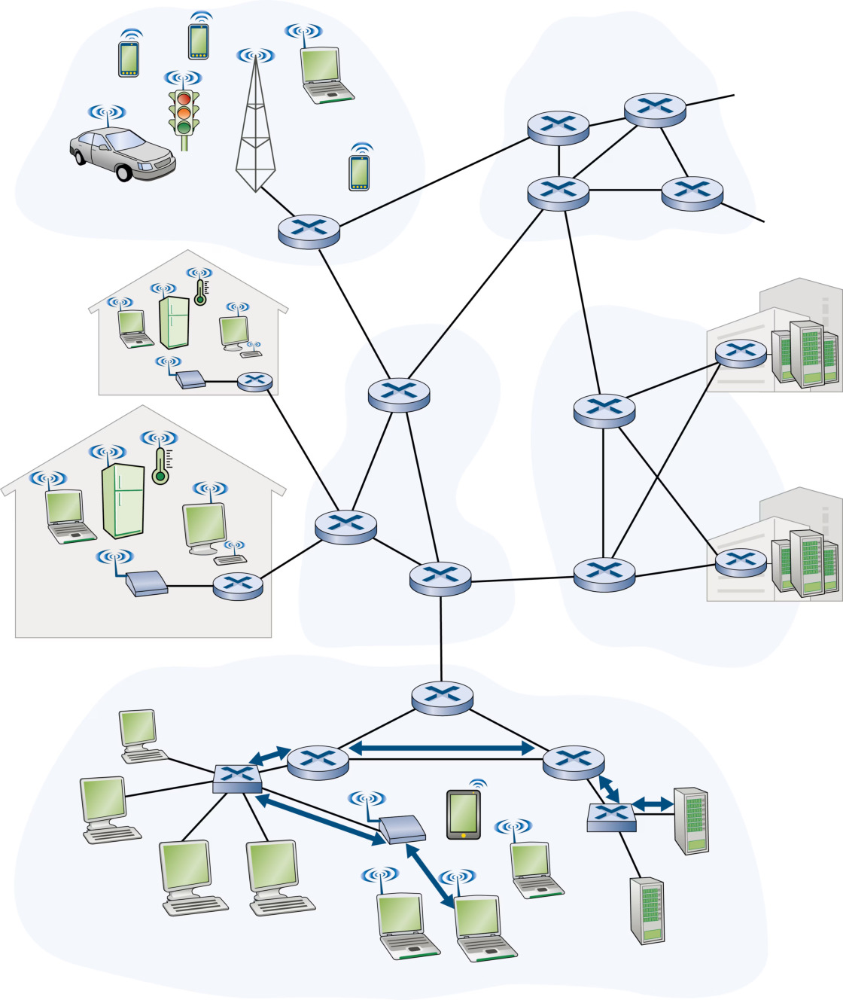

**旅行类比（原书）：** 游客从普林斯顿去瑞士洛桑，旅行社（路由协议）规划三段行程：普林斯顿乘豪车到 JFK 机场、JFK 乘飞机到日内瓦机场、日内瓦乘火车到洛桑车站。三段行程由不同公司运营、使用完全不同的交通工具，但每段都提供「把乘客从相邻两地中的一处送到另一处」的基本服务。这里：游客 = 数据报，每段行程 = 一条链路，交通工具 = 链路层协议，旅行社 = 路由协议。**链路层的「本地」特性**（每段独立封装、独立协议）由此一目了然——不同链路段可以使用完全不同的链路层协议，互不干涉。

### 链路层提供的服务

虽然任何链路层的基本服务都是「把数据报从一节点移动到相邻节点」，但具体服务内容因协议而异。链路层协议可能提供的服务有四种：

**① 组帧（framing）。** 几乎所有链路层协议都把网络层数据报封装进链路层帧：帧 = 数据字段（承载网络层数据报）+ 若干首部字段（有些协议还有尾部）。帧结构由协议规定，本章后半部分将看到多种帧格式。

**② 链路接入（link access）。** 介质访问控制（MAC，Medium Access Control）协议规定帧如何送上链路。点对点链路（一端一个发送者、一端一个接收者）的 MAC 协议很简单甚至不存在——发送者可在链路空闲时随时发送。有趣的是 **多路访问问题**：多个节点共享一条广播链路时，MAC 协议负责协调众多节点的帧发送（6.3 节详述）。

**③ 可靠交付（reliable delivery）。** 某些链路层协议保证每个网络层数据报 **无差错** 地穿过链路，同样靠确认与重传实现（如第 3 章的 rdt 原理）。无线链路误码率高，用链路层可靠交付把错误 **本地纠正**，避免触发端到端重传；而光纤、同轴、多数双绞线误码率极低，链路层可靠交付反而是不必要的开销——**因此多数有线链路层协议（包括以太网）不提供可靠交付**，丢帧交给 TCP 端到端处理。

**④ 差错检测与纠正（error detection and correction）。** 接收节点网卡硬件可能把帧中的 0 判成 1 或反之（比特差错，源于信号衰减与电磁噪声）。发送节点在帧中加入差错检测位，接收节点做差错检查，出错帧直接丢弃、不再向上转发。链路层的差错检测通常比传输层/网络层的因特网校验和 **更复杂**，且由 **硬件** 实现。差错纠正更进一步：接收方不仅能检测出错，还能定位错误位置并纠正（前向纠错 FEC）。

!!! info "定义：组帧与透明传输（Framing and Transparent Transmission）"

    **英文原文：**

    > Almost all link-layer protocols encapsulate each network-layer datagram within a link-layer frame before transmission over the link. A frame consists of a data field, in which the network-layer datagram is inserted, and a number of header fields.

    **中文解释：** 组帧（framing）就是发送方按规则把网络层分组封装成帧：在一段数据的前后分别添加首部和尾部，构成帧；帧长 = 数据部分长度 + 首部 + 尾部。首尾部的重要作用是 **帧定界**——接收方从连续比特流中区分出帧的开始与结束。链路层数据单元是帧，分组（IP 数据报）只是帧的数据部分。

    组帧还要解决 **透明传输**：数据中若恰好出现与帧定界符相同的比特组合，会被误认为「帧结束」而丢弃后续数据。解决手段有四类（王道 2026 补充，408 考纲内容）：

    - **字符计数法**：帧首部用一个计数字段记录帧所含字节数。缺点：计数字段一旦出错就失去定界依据，灾难性失步。
    - **字节填充法（字符填充）**：用特定字符（如 SOH/EOT）定界，数据中出现定界符时在其前插入转义字符 ESC，接收方再删除。ESC 本身出现时也需再插一个 ESC。
    - **零比特填充法（比特填充）**：HDLC 用比特串 01111110 定界；发送方扫描数据，每遇到 **5 个连续的 1** 就插入一个 0，接收方每收到 5 个连续的 1 就删除后面紧跟的 0。性能优于字节填充，易由硬件实现。
    - **违规编码法**：借用曼彻斯特编码中的违规电平对（高-高、低-低）定界帧首尾。IEEE 802 局域网采用此法。不增加填充开销，但只适用于冗余编码环境。

### 链路层在协议栈中的位置：主机、路由器与交换机

回顾第 1 章：**主机实现全部五层**（因特网把复杂性放在网络边缘）；**路由器实现 1-3 层**（识别 IP 地址、不识别链路层地址）；**链路层交换机实现 1-2 层**（识别 MAC 地址、不识别 IP 地址）。链路层正是「软件与硬件相遇」之处：它介于网络层的软件实现与物理层的纯硬件之间。

### 链路层的实现位置：网络适配器

链路层在哪里实现？答案是 **网络适配器（network adapter）**，又称 **网络接口控制器（NIC，Network Interface Controller）**，即常说的 **网卡**。以太网功能或集成在主板芯片组中，或用独立廉价芯片实现。网卡在硬件中实现了组帧、链路接入、差错检测等多数链路层功能（例如 Intel 系列网卡实现本章 6.4 的以太网协议）。

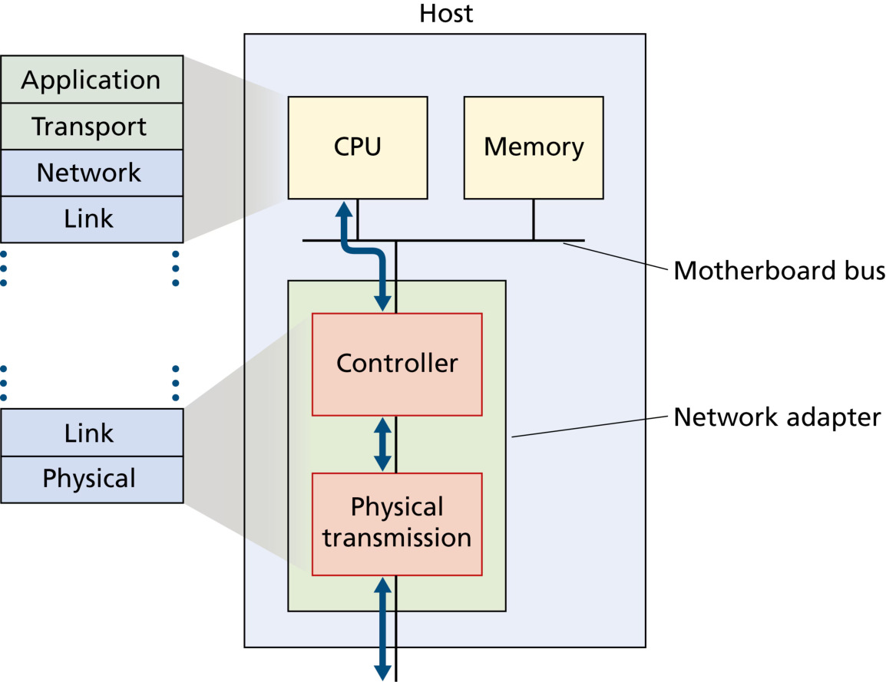

**发送侧**：网卡控制器从主机内存取走高层（网络层以上）已造好的数据报，封装成链路层帧（填好各字段），按链路接入协议把帧送上链路。**接收侧**：控制器收下整个帧，抽出网络层数据报向上传递；若链路层做差错检测，发送侧控制器负责置差错检测位，接收侧控制器负责校验。

注意：链路层 **软件** 部分运行在主机 CPU 上（组装链路层地址信息、激活控制器硬件、响应控制器中断、处理错误条件并把数据报交给网络层）。**一句话：链路层 = 硬件（网卡芯片）+ 软件（设备驱动与高层链路逻辑）的混合体，是协议栈中软件与硬件交汇的地方。**

**网卡的三个细节（王道 2026）：** ① 网卡与局域网通过电缆/双绞线 **串行** 通信，与计算机内存通过 IO 总线 **并行** 通信，因此网卡要做 **串并转换**；② 网卡收帧时先检查目的 MAC 地址，只接收单播（目的地址匹配）、广播（全 1）与多播帧，否则丢弃；③ 以太网网卡发送用曼彻斯特编码（每个码元中间有一次电压跳变，便于接收方提取位同步信号）。

---

## 6.2 差错检测与纠正（★408 计算常考）

比特在链路传输中可能被翻转：发送的 1 变成 0、0 变成 1——这就是 **比特差错（bit error）**，由信号衰减与电磁噪声引起。链路层提供 **差错检测与纠正**：发送节点把数据 D 与差错检测位 EDC（error-detection and -correction bits）一起放进帧；接收节点收到 D' 与 EDC' 后判断 D' 是否等于原 D。

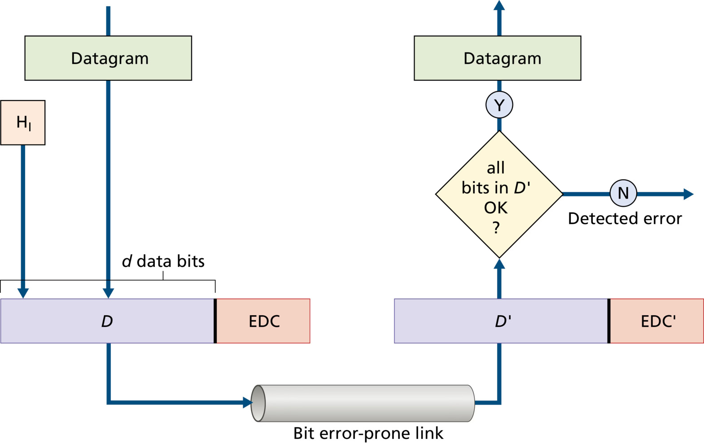

**重要表述**：差错检测技术让接收方 **有时（而非总是）** 能检测出发生了比特差错——即使使用了差错检测位，仍可能存在 **未检测出的差错（undetected bit error）**。目标是把漏检概率压到很小。经验法则：技术越复杂（漏检概率越小），开销越大（需要更多计算与更多差错检测位）。本节的三种技术由简到繁：**奇偶校验（parity checks）→ 校验和（checksumming）→ 循环冗余校验（CRC）**。

### 奇偶校验

**单比特奇偶校验** 是最简单的差错检测：发送方附加 1 位校验位，使「原始信息 + 校验位」中 1 的总数为偶数（**偶校验**）或奇数（**奇校验**）。接收方只需统计收到的 1 的个数：偶校验下若 1 的个数为奇数，则知道发生了奇数个比特差错。

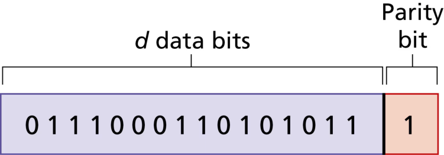

**致命弱点**：若发生 **偶数个** 比特差错，1 的个数奇偶性不变，差错无法检出。若比特差错独立发生且概率很小，偶数个错几乎不可能；但实测表明错误常 **成簇出现（突发错误）**，此时单比特奇偶校验的漏检概率可能接近 50%——显然不够用。

**二维奇偶校验** 把单比特校验推广到行与列两个维度：把 D 的比特排成 i 行 j 列，对每一行、每一列各计算一个奇偶位。单个比特出错时，其所在行与列的奇偶校验都出错，接收方用「行索引 + 列索引」交叉定位出错的比特并 **纠正它**——因此二维奇偶校验 **既可检测又可纠正单个比特差错**，还可检测（但不能纠正）任意两个比特差错。

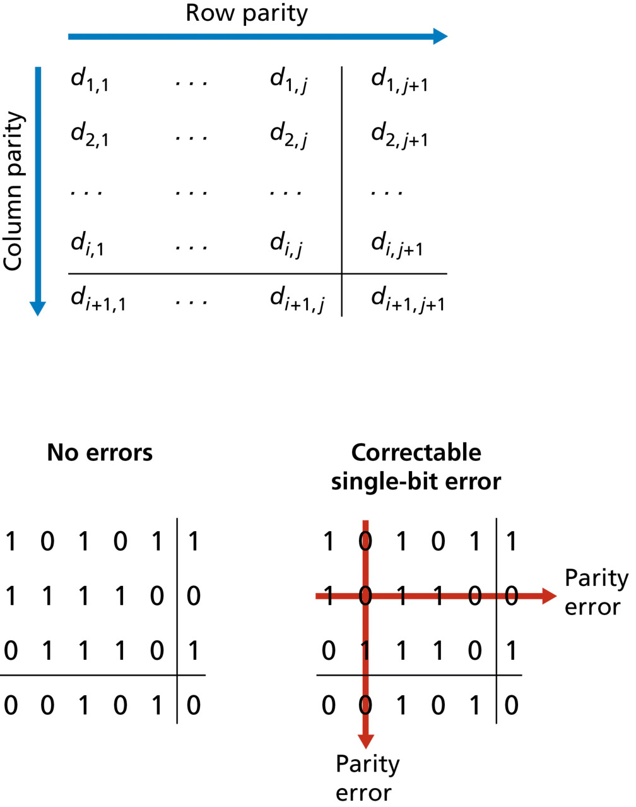

接收方既能检测又能纠正差错的能力称为 **前向纠错（FEC，Forward Error Correction）**。FEC 的价值：① 减少发送方重传次数；② 在接收方 **立即** 纠正错误，不必等一个往返传播时延让发送方重传——这对实时应用与深空链路等长传播时延场景尤为重要。注意：奇偶校验是「检错编码」，海明码才是典型的「纠错编码」（详见本节末王道补充）。

### 校验和（因特网校验和）

**校验和方法** 把数据当作整数序列求和，用和作为差错检测位。**因特网校验和（Internet checksum）** 就是基于此：把数据字节当作整数相加，对和取 **二进制反码**（按位取反）作为校验和放在报文段首部（第 3 章已详述 UDP/TCP 校验和：发送方求和 → 取反 → 放入；接收方把收到的数据连同校验和一起求和，结果为全 1 则无错）。**TCP 与 UDP 的校验和覆盖所有字段（首部 + 数据）；IP 的校验和只覆盖 IP 首部。**

**为什么传输层用校验和、链路层用 CRC（408 常考辨析）？** 传输层在主机操作系统中以 **软件** 实现，需要简单快速的方案——校验和只有少量开销（TCP/UDP 仅 16 位）；链路层在网卡 **专用硬件** 中实现，硬件能快速完成更复杂的 CRC 运算。**对比结论：校验和实现简单、开销小，但检错能力弱于 CRC。**

### CRC：循环冗余校验（★核心）

**循环冗余校验（CRC，Cyclic Redundancy Check）** 是链路层最广泛使用的检错技术，也称 **多项式编码（polynomial code）**——因为可以把待发送比特串看成系数为 0/1 的多项式，运算按多项式算术进行。**高频考点**：CRC 的模 2 除计算、FCS 位数与生成多项式最高次数的关系，408 计算题常客（2023#36 同考点、2023#40 等）。

**CRC 的工作原理：**

1. **约定生成多项式**：收发双方先约定一个 r+1 位的比特模式 **生成多项式 G(x)**（记为 G），要求 G 的最高位（最左边）为 1，且最低位（x⁰ 项系数）为 1。
2. **计算 FCS**：发送方基于数据 D 与 G 计算出 r 位冗余码，称为 **帧检验序列（FCS，Frame Check Sequence）**，附加在 D 后面一起发送。关键性质：**「D 后接 FCS」得到的 (n+r) 位比特串，恰好能被 G 整除（模 2 除法余数为 0）**。
3. **接收方检验**：用同一 G 去除收到的比特串，余数为 0 则无差错接受；余数非 0 则检出差错、丢弃。

**模 2 运算规则（CRC 的灵魂）：** 加法不进位、减法不借位——加、减完全等价，都等于按位 **异或（XOR）**。例如 1011 XOR 0101 = 1110、1001 XOR 1101 = 0100。乘除与普通二进制类似，只是过程中所有加减法按模 2（XOR）进行；乘以 2ⁱ 就是把比特模式左移 i 位。

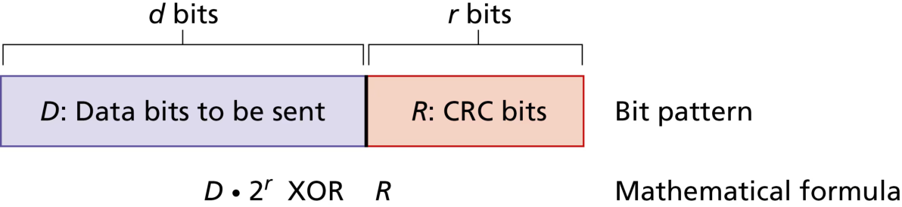

**FCS 的计算步骤（王道 2026 归纳，408 必背）：**

1. **加 0**：设 G(x) 的最高次数为 r，在数据 D 后面补 r 个 0（相当于乘以 2ʳ）；
2. **模 2 除**：用 G 对应的二进制串做模 2 除法去除补零后的数据串，得到的 **r 位余数就是 FCS**（前面的 0 不可省略）。

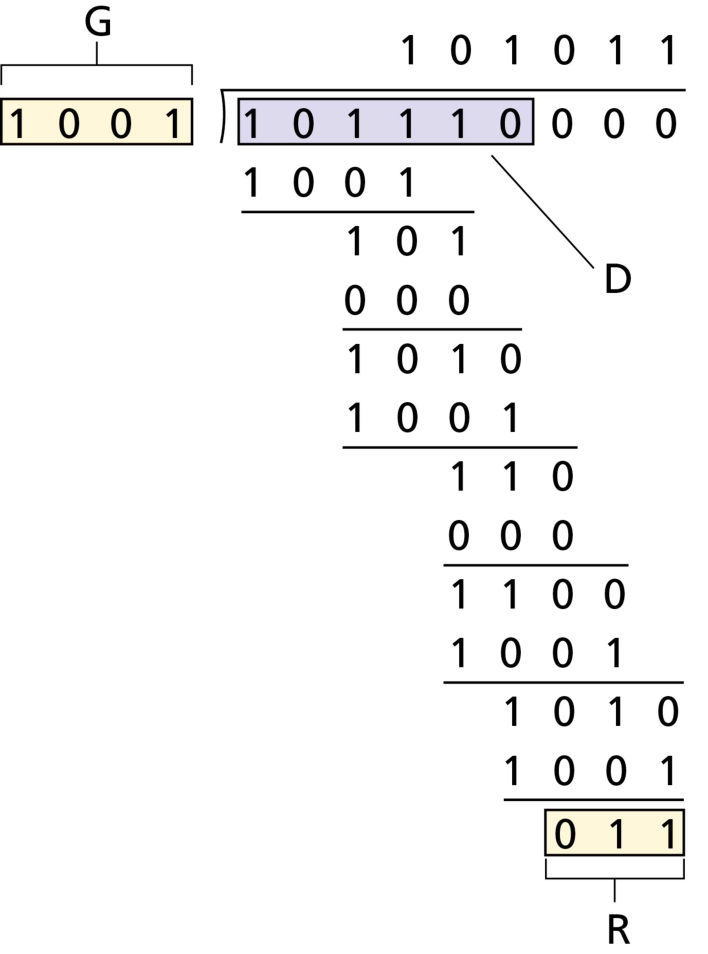

图 6.7 演示了一个完整计算示例（原书例，具体数字以本节例题为准）。发送数据 = 2ⁿ·D + FCS，其中余数（FCS）位数恒等于生成多项式最高次数 r。

**CRC 的检错能力（结论直接背）：** 国际标准定义了 CRC-8、CRC-16、CRC-32 等生成多项式（CRC-32 用于以太网）。每个标准都能检测 **长度小于 r+1 位的所有突发错误**；长度大于 r+1 位的突发错误被检出的概率约为 1-(1/2)ʳ；**每个标准都能检测任意奇数个比特差错**。发送方的 FCS 生成与接收方的 CRC 检验都由 **硬件** 完成，处理迅速、不影响数据传输。

!!! example "例题 1：CRC 计算（真题 2023#36 同考点）"

    设待发送数据 M = 101001（6 位），生成多项式 G(x) = x³ + x² + 1（即二进制 1101）。

    （1）求帧检验序列 FCS 与最终发送的比特串；

    （2）接收方如何检验该帧？若接收方收到 101001101，能否判定出错？

    ??? answer "查看答案"
        **（1）** 生成多项式 1101 的最高次数 r = 3，故在 M 后面补 3 个 0，得到被除数 **101001000**。用 G = 1101 做模 2 除法（XOR 逐步消位）：

        | 步骤 | 当前 4 位余数寄存器 | 首位为 1 则 XOR 1101 | 处理后的 3 位 |
        |:---|:---|:---|:---|
        | 1 | 1010 | 1010 ⊕ 1101 = 0111 | 111（下一位补入 0） |
        | 2 | 1110 | 1110 ⊕ 1101 = 0011 | 011（下一位补入 1） |
        | 3 | 0111 | 首位为 0，直接左移 | 111（下一位补入 0） |
        | 4 | 1110 | 1110 ⊕ 1101 = 0011 | 011（下一位补入 0） |
        | 5 | 0110 | 首位为 0，直接左移 | 110（下一位补入 0） |
        | 6 | 1100 | 1100 ⊕ 1101 = 0001 | **001** |

        余数（FCS）= **001**（3 位，不足 3 位时前面补 0）。最终发送的比特串为：

        $$ \text{发送比特串} = M + FCS = 101001\ 001 = 101001001 $$

        **验证**：101001001 除以 1101 的余数为 0——即「D 后接 FCS」恰好能被 G 整除，这正是 CRC 设计的核心性质。

        **（2）** 接收方用同一个 G = 1101 对收到的 101001001 做模 2 除法，余数为 0 → 无差错接受。若收到 **101001101**（最后一位由 0 变 1），模 2 除 1101 的余数非 0 → **判定传输出错，丢弃该帧**。

        要点：FCS 位数 = 生成多项式最高次数 r = 3；发送总长度 = n + r = 6 + 3 = 9 位。

    ??? success "评分标准"

        - 正确写出补零后的被除数 101001000（2 分）
        - 模 2 除法过程正确、余数 = 001（5 分）
        - 最终发送比特串 101001001（2 分）
        - 接收方检验原理（余数为 0 接受、非 0 丢弃）与判定（2 分）

**海明码补充（王道 2026，408 常考纠错编码）：** 海明码是最常见的 **纠错编码**，可纠正 1 位差错。核心概念 **码距（海明距离）**：两个码字对应位取值不同的比特数；编码集的最小码距 d 决定检错/纠错能力：**d = c + e + 1**（c 为纠错位数、e 为检错位数，且纠错能力 ≤ 检错能力）。例如码距 d = 3 时，最多能检 2 位错或纠 1 位错。编码时在信息位中加入检验位（检验位放在 2ⁱ 位置，即海明码位号 1、2、4、8…），每个数据位被若干检验位分组校验，出错后由检验方程 S₃S₂S₁ 的取值直接指出错误位号。例如信息位 1010（4 位）需 3 位检验位（2⁴ ≥ 4+3+1 满足），得到海明码 1010010；若 S₃S₂S₁ = 001 则第 1 位出错，取反即纠错。

!!! tip "动手试试：交互式演示"

    配套交互 HTML：[CRC 循环冗余检验演示](demos/CRC循环冗余检验演示.html)、[海明码编码与检验交互演示](demos/海明码编码与检验交互演示.html)、[字节填充法交互演示](demos/字节填充法交互演示.html)（浏览器打开，输入数据实时观察检错/纠错与组帧过程）。

---

## 6.3 多路访问协议（★408 高频）

链路有两种：**点对点链路**（一端一个发送者、一端一个接收者，PPP、HDLC 是代表）与 **广播链路**（多台发送/接收节点共享同一条广播信道——任何节点发送帧时，信道向所有其他节点广播该帧的副本；以太网与无线局域网都是广播链路技术）。广播链路的核心问题是 **多路访问问题（multiple access problem）**：如何协调多个发送/接收节点对共享广播信道的访问？

**PPP 协议（王道 2026，点对点链路的代表协议，408 常考）**：**点对点协议（PPP，Point-to-Point Protocol）** 广泛用于拨号上网、DSL 与家庭宽带等串行点对点链路，由三部分组成：① 一个把 IP 数据报封装到串行链路的方法；② 一个用于建立、配置和测试数据链路连接的 **链路控制协议（LCP）**；③ 一组 **网络控制协议（NCP）**（每种网络层协议一个，如 IPCP 负责协商分配 IP 地址）。**PPP 帧格式**：标志（Flag，01111110）+ 地址（11111111）+ 控制（00000011）+ 协议（2 字节）+ 信息（IP 数据报，≤ 1500 字节）+ FCS（帧检验序列，2 或 4 字节）+ 标志。PPP 面向 **字节** 的透明传输采用 **字节填充**：信息字段中出现与标志相同的字节 0x7E 时，转换为 2 字节序列（0x7D, 0x5E）；出现 0x7D 时，转换为（0x7D, 0x5D）。**PPP 只支持点对点链路、不支持多点接入**；它只检错不纠错、不重传（接收方发现有差错就把帧丢弃），也不提供流量控制与拥塞控制——这些留给上层（TCP）处理。

**人类类比（原书）：** 鸡尾酒会上许多人共处一室交谈——大家演化出了一套礼仪：「给每个人发言机会」「别人讲话时不要打断」「不要独占话题」「提问先举手」。计算机网络同样需要 **多路访问协议（multiple access protocol）** 来规范节点何时、如何把帧送上共享信道。

**为什么必须协调？** 两个以上节点同时发送时，所有接收者同时收到多路信号——帧 **碰撞（collide）**，碰撞的帧互相纠缠、全部丢失，碰撞期间信道被浪费。理想的多路访问协议应满足四个特性：① 只有 1 个节点有数据时，该节点获得全部速率 R；② M 个节点都有数据时，每个节点获得平均 R/M 的速率；③ 协议 **分散（decentralized）**——没有单点故障的集中控制器；④ 协议简单、实现廉价。

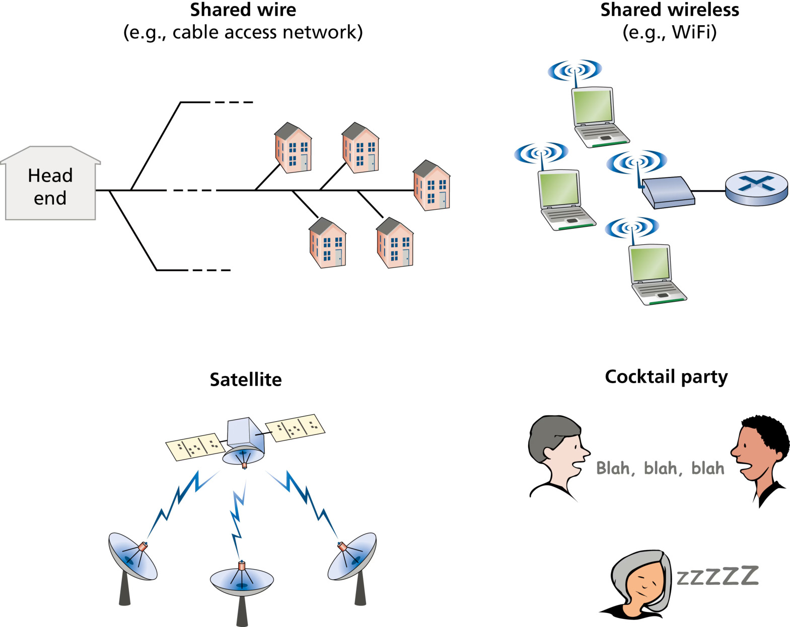

多路访问协议可归为三大类（几乎所有协议都能归入其一）：

- **信道划分协议（channel partitioning protocols）**：TDM、FDM、CDMA——把信道切分给各节点，杜绝碰撞；
- **随机访问协议（random access protocols）**：ALOHA、CSMA、CSMA/CD、CSMA/CA——节点以全速率发送，碰撞后按规则重传；
- **轮转协议（taking-turns protocols）**：轮询、令牌传递——轮流获得发送权，消除碰撞与空时隙。

### 信道划分协议：TDM、FDM 与 CDMA

**时分复用（TDM）**：把时间划分为固定时长的 **时帧（frame）**，每帧再划分为 N 个 **时隙（slot）**，每个时隙固定分配给一个节点。节点只在属于自己的时隙发送。TDM 消除了碰撞且绝对公平（每节点获得 R/N 的专用速率），但两大缺点：① 即使只有自己是唯一活跃节点，也仅能以 R/N 的平均速率发送；② 即使只有自己要发，也必须等待属于自己的时隙——「聚会上唯一有话要说的人却必须按顺序等」。

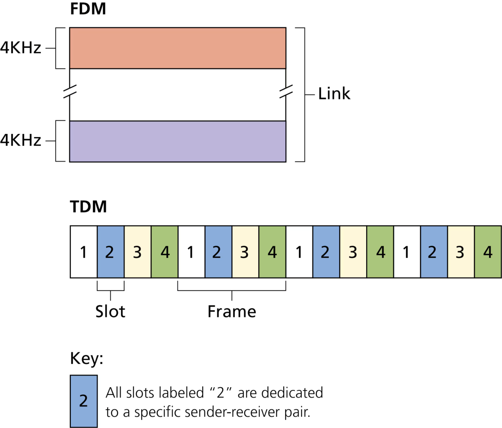

**频分复用（FDM）**：把信道频谱划分为 N 个频带（每个带宽 R/N），每个频带固定分配给一个节点。FDM 与 TDM 优缺点相同：无碰撞、公平，但单节点也被限制在 R/N。TDM/FDM 广泛用于蜂窝、WiFi、蓝牙、卫星系统以及电缆接入网。

**码分多址（CDMA，Code Division Multiple Access）**：与前两者都不同——TDM 分时、FDM 分频，CDMA **分码**：给每个节点分配一个唯一的 **码片序列（chip sequence）**，节点用它编码发送的数据比特。精心设计的码片序列使 **不同节点可同时发送，接收方仍能正确解出各发送方的数据**（前提是知道发送方的码片序列）。CDMA 曾是有线/无线网络的基础技术，现已主要被更先进技术取代，但 **码片内积计算仍是 408 经典题型**。

**CDMA 编码规则（王道 2026）：** 把每个比特时间再划分为 m 个短时间槽（码片 chip，常用 m = 64 或 128）。发送比特 **1** 时发送自己的码片序列，发送比特 **0** 时发送码片序列的 **反码**。为方便计算，把码片中的 0 写为 -1、1 写为 +1。码片序列须满足 **正交性**：任意两站码片向量 S、T 的 **规格化内积为 0**（S·T/m = 0）；S 与自身的规格化内积为 1；S 与反码的规格化内积为 -1。

**CDMA 解码示例（408 常考）：** A 站码片 (-1 -1 -1 +1 +1 -1 +1 +1)，B 站码片 (-1 -1 +1 -1 +1 +1 +1 -1)。A 向 C 发 1（发送向量 S），B 向 C 发 0（发送 -T = (+1 +1 -1 +1 -1 -1 -1 +1)），两向量在公共信道 **线性相加**：S + (-T) = (0 0 -2 +2 0 -2 0 +2)。C 站解码 A：S·(S-T)/8 = [(-1×0)+(-1×0)+(-1×-2)+(1×2)+(1×0)+(-1×-2)+(1×0)+(1×2)]/8 = 8/8 = **1**，即 A 发的是 1；解码 B：T·(S-T)/8 = **-1**，即 B 发的是 0。**原理**：其他站的信号在内积中被正交性过滤掉，只剩目标站的分量。

### 随机访问协议：ALOHA 与 CSMA

**随机访问协议（random access protocol）** 的思想：发送节点 **总是以信道全速率 R 发送**；发生碰撞后，每个碰撞节点 **独立随机等待** 一段时间再重传，直到帧无碰撞地通过。随机等待使碰撞节点不会同步重发而永续碰撞。**核心思想：胜利者通过争用获得信道，故又称争用型协议。**

**纯 ALOHA（pure ALOHA）**：节点有帧立即发送整个帧；发生碰撞则等一个帧传输时间后以概率 p 重传、以概率 1-p 再等。完全不检测信道，冲突概率大。一个帧要发送成功，需在 **2 倍帧传输时间**（该帧传输期间 ± 一个帧时间）内没有其他节点开始发送，因此纯 ALOHA 的最大效率（长期成功时隙比例）只有：

$$ S_{pure} = G \cdot e^{-2G}, \quad S_{max} = \frac{1}{2e} \approx 0.184 \ (18\%) $$

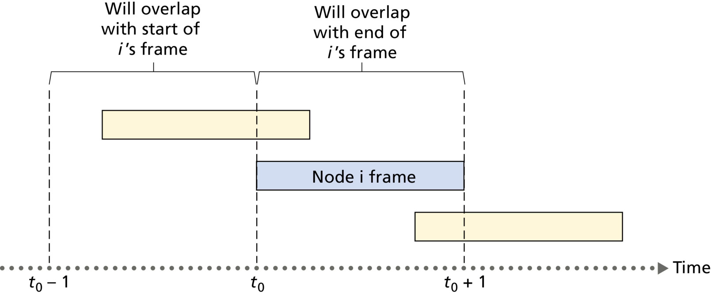

**时隙 ALOHA（slotted ALOHA）**：把时间划分为等长时隙，节点 **只能在时隙开始时** 发送整个帧；碰撞后每个后续时隙以概率 p 重传。因为只要求「一个帧时间内没有其他节点开始发送」，成功概率翻倍：

$$ S_{slotted} = G \cdot e^{-G}, \quad S_{max} = \frac{1}{e} \approx 0.368 \ (37\%) $$

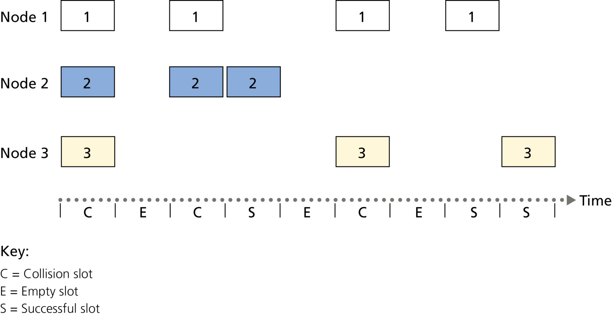

**结论（408 填空常考）**：时隙 ALOHA 最大效率 1/e ≈ 37%，纯 ALOHA 只有 1/(2e) ≈ 18%——时隙 ALOHA 恰好是纯 ALOHA 的两倍，这就是「同步付出的代价换来的回报」。推导思路：N 个活跃节点、每节点每时隙以概率 p 发送时，成功时隙概率 = N·p·(1-p)^(N-1)，在 p = 1/N 处取最大，N→∞ 时趋于 1/e。

**载波监听多路访问（CSMA，Carrier Sense Multiple Access）** 改进 ALOHA：发送前 **先听再说**（载波监听 carrier sensing）——先检测信道是否忙，忙则等待；**边说边听**（碰撞检测）——发送过程中也监听，发现干扰就停止。这两种人类谈话礼仪对应 CSMA 家族的两个核心机制。**但为什么都做了载波监听还会碰撞？** 因为 **传播时延**：B 的比特在介质上传播需要时间，D 开始发送时 B 的比特还没到 D，D 误以为信道空闲。

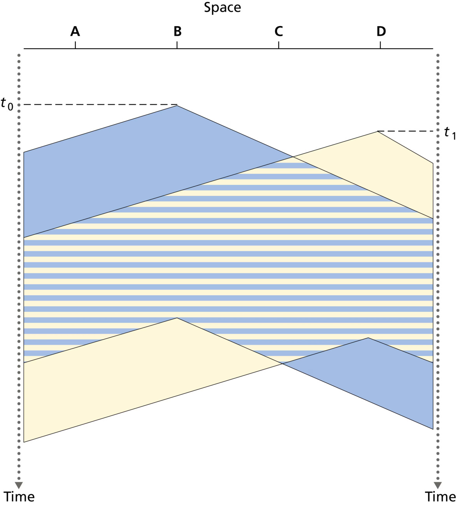

**CSMA 三种变体（王道 2026 归纳，408 常考辨析）：**

| 协议 | 信道空闲时 | 信道忙时 | 特点 |
|:---|:---|:---|:---|
| **1-坚持 CSMA** | 立即发送（概率 1） | 持续监听，直到空闲 | 冲突概率大（多个等待者同时抢发） |
| **非坚持 CSMA** | 立即发送 | 放弃监听，随机等一段时间再监听 | 冲突少，但平均时延增大 |
| **p-坚持 CSMA** | 以概率 p 发送，1-p 推迟到下一时隙 | 持续监听 | 非坚持与 1-坚持的折中，只适用于时隙信道 |

### CSMA/CD：载波监听多路访问/冲突检测（★核心）

**CSMA/CD（CSMA with Collision Detection）** 在 CSMA 基础上加入 **冲突检测**：适配器边发送边检测信道电压变化，一旦检测到碰撞立即停止发送（避免继续浪费信道传完损坏的帧），随机等待后重试。适用于 **总线形网络或半双工网络**；全双工网络收发用两条独立信道、不会碰撞，不需要 CSMA/CD。

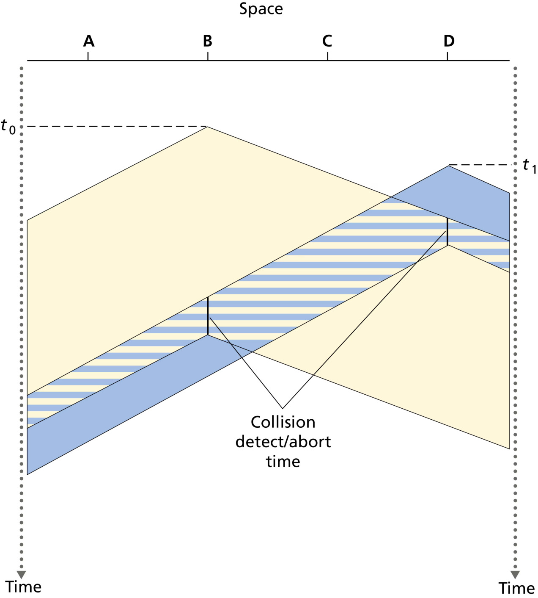

**核心概念②：多路访问协议（CSMA/CD）** —— CSMA/CD 的工作流程八字口诀「**先听后发，边听边发，冲突停发，随机重发**」；其定量核心是 **争用期（冲突窗口）2τ、最短帧长 = 2τ×R、二进制指数退避** 三件套。这是 408 高频考点区（**高频考点**，考频 6 次：2023#36、2019#36、2016#36、2009#37、2015#36、2013#36；大题 2010#47、2022#47），所有计算都从这里展开。

**① 争用期（contention period）与传播时延的关系。** 电磁波在总线上传播速率有限，当某站检测到信道空闲时，信道 **不一定真的空闲**——另一端的帧可能还在路上。设 τ 为 **单程端到端传播时延**：A 在 t=0 发送，B 在 t=τ-δ 时误判空闲而发送，t=τ-δ/2 处两信号碰撞，B 在 t=τ 检测到碰撞，A 在 t=2τ-δ 才检测到碰撞。因此 **A 从开始发送到最晚得知碰撞，最多需经过 2τ**——这个端到端往返传播时延 2τ 称为 **争用期（又称冲突窗口）**。每个站在发送后的一小段时间内存在碰撞可能，**只有经过争用期 2τ 仍未检测到碰撞，才能确定本次发送不会碰撞**。

**② 最短帧长（408 计算核心）。** 若某站发送一个很短的帧，发送完之前未检测到碰撞，但该帧在到达目的站前与其他站的帧碰撞——目的站收到损坏帧后丢弃，发送站却因已发完而不知情、不会重传。为防止这种情况，以太网规定：**在争用期 2τ 内应能发送的数据长度，即最短帧长**：

$$ \text{最短帧长} = \text{最大单向传播时延} \times \text{数据传输速率} \times 2 = 2\tau \cdot R $$

**等价表述**：发送帧的时间 ≥ 争用期（发送时间 = 帧长/速率）。若发送完之前就发生碰撞，则发送方一定能检测到；凡长度小于最短帧长的帧，都是因冲突而异常中止的无效帧，接收方应立即丢弃。**10 Mb/s 以太网**：争用期定为 51.2 μs，在争用期内可发送 512 bit = **64 B**，故最短帧长为 64 B；若数据字段不足 46 B（64 = 6 + 6 + 2 + 46 + 4），MAC 子层在数据字段后加填充字段补齐。**设计关系（反向运用）**：数据传输速率提高 → 发送帧的时间缩短 → 需 **增大最短帧长** 或 **缩短网段长度（减小 τ）** 来保持「发送时间 ≥ 争用期」。

**③ 二进制指数退避（binary exponential backoff）。** 碰撞后若立即重发必然再次碰撞。以太网用 **截断二进制指数退避算法** 确定重传时机（王道 2026）：

1. 基本退避时间取 **争用期 2τ**；
2. 从集合 {0, 1, …, 2ᵏ-1} 中随机取数 r，其中 **k = min(重传次数, 10)**；重传推迟时间 = **r × 2τ**；
3. **重传 16 次仍不成功**，认为网络过拥塞，放弃该帧并向高层报错（易忽略条件）。

**效果**：重传次数越多，随机数取值范围按 2 的幂指数扩大，平均等待时间动态增大，降低再次冲突概率、利于系统稳定。例：第 1 次冲突后 r ∈ {0,1}（等待 0 或 2τ）；第 2 次冲突后 r ∈ {0,1,2,3}（等待 0、2τ、4τ 或 6τ）；以此类推，k 最大封顶 10。**另外**：以太网规定帧间最小间隔为 9.6 μs（相当于发送 96 bit 的时间），让刚收到帧的站点清理接收缓存。

**CSMA/CD 适配器工作流程（归纳）：** ① 从网络层获得分组，封装成帧放入适配器缓存；② 若信道忙则持续检测，直至信道空闲；若在 9.6 μs 内信道保持空闲，则发送该帧；③ 发送过程中继续检测信道；④ 发送成功：争用期内未检测到碰撞，该帧必然发送成功；发送失败：争用期内检测到碰撞，立即停止发送，执行退避算法，随机等待后回到步骤 ②。

**CSMA/CD 效率（了解）**：设 τ 为信号在任意两适配器间传播的最大时间，t_trans 为传输一个最大长度帧的时间，则

$$ \text{效率} \approx \frac{1}{1 + 5\tau / t_{trans}} $$

当 τ → 0 时效率 → 1（无传播时延，碰撞立即被感知、信道不浪费）；当 τ 很大时效率趋近于 0（帧被碰撞浪费的比例上升）。

!!! example "例题 2：CSMA/CD 最短帧长计算（真题 2023#36 风格）"

    一条采用 CSMA/CD 的 10 Mb/s 以太网，网段长度为 1 km，信号在电缆中的传播速度为 2×10⁸ m/s。

    （1）求争用期（冲突窗口）与最短帧长；

    （2）若把速率提升到 100 Mb/s 而网段长度不变，最短帧长应为多少？若不改变帧长而保持最短帧长 64 B 不变，网段长度最多可为多少？

    ??? answer "查看答案"
        **（1）** 单程传播时延：

        $$ \tau = \frac{d}{v} = \frac{1000}{2 \times 10^8} = 5 \ \mu s $$

        争用期 = 2τ = **10 μs**。最短帧长 = 争用期 × 速率：

        $$ L_{min} = 2\tau \cdot R = 10 \times 10^{-6} \times 10 \times 10^6 = 100 \ \text{bit} $$

        **（2）** 速率提升到 100 Mb/s、网段不变（2τ 仍为 10 μs）：

        $$ L_{min} = 10 \times 10^{-6} \times 100 \times 10^6 = 1000 \ \text{bit} = 125 \ \text{B} $$

        若保持最短帧长 64 B = 512 bit 不变，则允许的争用期为 512/100×10⁶ = 5.12 μs，即单程传播时延最多 2.56 μs，网段长度最多为：

        $$ d_{max} = v \times 2.56 \ \mu s = 2 \times 10^8 \times 2.56 \times 10^{-6} = 512 \ \text{m} $$

        要点：**速率提高 → 帧发送时间缩短 → 要么加长最短帧长，要么缩短网段长度**，两条路都是为了守住「发送时间 ≥ 争用期」这条底线（2019#36 直接考了这条关系）。

    ??? success "评分标准"

        - τ 与争用期 2τ 计算正确（3 分）
        - 最短帧长公式与（1）数值 100 bit（3 分）
        - （2）速率提升后最短帧长 1000 bit（3 分）
        - （2）帧长不变时网段长度 512 m（3 分）

!!! tip "动手试试：交互式演示"

    配套交互 HTML：[CSMA/CD 协议工作过程演示](demos/CSMA_CD协议工作过程演示.html)、[交换机自学习过程演示](demos/交换机自学习过程演示.html)、[VLAN 交换机转发过程交互演示](demos/VLAN交换机转发过程交互演示.html)（浏览器打开，观察冲突检测、退避与交换机转发行为）。

### CSMA/CA 与 802.11 无线局域网（RTS/CTS、NAV、隐藏站）

无线局域网不能直接搬用 CSMA/CD，原因有二（王道 2026）：① 无线适配器接收信号强度远小于发送信号强度、且动态范围很大，实现冲突检测硬件代价过高；② **并非所有站点都能听见对方**——存在 **隐蔽站（hidden station）问题**，冲突检测机制无法检测到所有冲突。因此 **IEEE 802.11** 定义了 **CSMA/CA（CSMA with Collision Avoidance）**：把「冲突检测」改为「**冲突避免**」——冲突避免并非完全避免冲突，而是尽量降低冲突概率，因为 802.11 站点一旦开始发送帧就会完整发送（无法边发边停），长帧在冲突时浪费严重。

**802.11 的关键机制（408 高频，考频 5 次：2017#35、2020#37、2018#35、2011#36、2024#36）：**

**① 链路层确认（ARQ）**：无线信道误码率高，802.11 每发完一帧必须等接收方回 ACK 才能发下一帧（停等式的可靠传输）。

**② 帧间间隔（IFS，InterFrame Space）**：站点检测到信道空闲后，还要等待一段很短时间（继续监听）才能发送。按帧类型分三种：**SIFS（短 IFS）** 最短，用于 ACK、CTS、分片后的数据帧及响应 AP 探询的帧；**PIFS（点协调 IFS）** 中等，PCF 方式使用；**DIFS（分布式协调 IFS）** 最长，DCF 方式下发送数据帧与管理帧。

**③ 虚拟载波监听与 NAV**：源站把它要占用信道的持续时间（含目的站回 ACK 的时间）通知所有其他站，其他站在该时间内停止发送——**网络分配向量（NAV，Network Allocation Vector）** 指出信道忙的持续时间。其他站并未真正监听信道，而是因收到通知才不发送，故称「虚拟载波监听」。

**④ RTS/CTS 信道预约（处理隐蔽站问题）**：源站发送数据前先监听信道，信道空闲则等待 DIFS 后广播 **RTS（Request To Send）** 控制帧（含源地址、目的地址、所需持续时间）；AP 正确收到 RTS 且信道空闲则回 **CTS（Clear To Send）** 控制帧；源站收到 CTS 后等待 SIFS 发送数据帧；AP 正确收到数据后等待 SIFS 回 ACK。**CTS 有两个目的**：给源站明确的发送许可、指示其他站在预约期内不要发送。隐蔽站 B 虽听不见 A 的 RTS，却能听见 AP 的 CTS——据 CTS 中的持续时间设置 NAV，从而避免与 A 的通信碰撞。**NAV 取值**：RTS 帧中填写的持续时间 = SIFS + CTS + SIFS + 数据帧 + SIFS + ACK；CTS 帧中填写的持续时间 = SIFS + 数据帧 + SIFS + ACK。

**⑤ CSMA/CA 退避**：与 CSMA/CD 的退避略不同，第 i 次退避在 {0, …, 2^i - 1} 个时隙（slot）中随机选择（i 从 1 计），时隙范围最大到 255（第 6 次退避）后不再增加，不同于 CSMA/CD 的 1023。只有「信道空闲且是第一个要发送的帧」才不用退避，其他情况（检测到信道忙后发送、每次重传、每次成功发送后发下一帧）都必须退避。

**CSMA/CD 与 CSMA/CA 的区别（408 常考对比）**：① CSMA/CD 能检测冲突（边发边听、电压变化判定），CSMA/CA 发送时不能检测冲突、只能尽量避免；② 传输介质不同——CSMA/CD 用于总线形以太网（有线），CSMA/CA 用于 802.11 无线局域网；③ 检测方式不同——CSMA/CD 靠电压变化检测，CSMA/CA 靠能量检测、载波检测、混合检测三种方式判断信道空闲；④ 前者冲突后停止发送，后者发送后等待确认、未收到 ACK 则重传。

**802.11 帧结构（王道 2026，408 考三地址）**：802.11 数据帧由 MAC 首部（30 字节）、帧主体（数据，≤ 2312 字节）、FCS（4 字节）组成。MAC 首部最重要的 4 个地址字段（地址 4 用于自组网络），由帧控制字段的「去往 AP / 来自 AP」决定：

| 去往 AP | 来自 AP | 地址 1 | 地址 2 | 地址 3 |
|:---|:---|:---|:---|:---|
| 1 | 0（站→AP） | AP 地址（接收） | 源站地址（发送） | **目的站地址** |
| 0 | 1（AP→站） | 目的站地址（接收） | AP 地址（发送） | **源站地址** |

记忆要点：**地址 1、2 是无线信道两端的接收/发送地址；地址 3 存放「真正的」目的或源地址**。站发往 AP 时，接收地址（地址 1）是 AP 而非目的站，故地址 3 存放目的站 MAC；AP 发往站时，发送地址（地址 2）是 AP 而非源站，故地址 3 存放源站 MAC。

!!! example "例题 3：CSMA/CA 的 NAV 计算（真题 2024#36 改编）"

    在采用 CSMA/CA 的 802.11 无线局域网中，DIFS = 128 μs，SIFS = 28 μs，RTS、CTS 与 ACK 帧的传输时延分别为 3 μs、2 μs、2 μs。A 站要向 AP 发送一个总长度为 1998 B 的数据帧，无线链路带宽为 4 Mb/s。

    （1）求数据帧的传输时延与 A 在 RTS 帧中填写的持续时间；

    （2）隐蔽站 B 收到 AP 发送的 CTS 帧时，设置的 NAV 值是多少？

    ??? answer "查看答案"
        **（1）** 数据帧传输时延：

        $$ t_{data} = \frac{1998 \times 8}{4 \times 10^6} = 3996 \ \mu s $$

        A 站 RTS 帧中填写的持续时间为整个通信占用信道的时间（从收到 RTS 后到目的站最后发完 ACK）：

        $$ \text{RTS 持续时间} = SIFS + CTS + SIFS + DATA + SIFS + ACK = 28 + 2 + 28 + 3996 + 28 + 2 = 4084 \ \mu s $$

        **（2）** 隐蔽站 B 听不见 A 的 RTS，但能听见 AP 广播的 CTS；B 依据 **CTS 帧** 中填写的持续时间设置 NAV。CTS 帧中填写的时间是「从收到 CTS 后到目的站发完 ACK 为止」：

        $$ NAV = SIFS + DATA + SIFS + ACK = 28 + 3996 + 28 + 2 = 4054 \ \mu s $$

        **要点**：RTS 帧与 CTS 帧携带的持续时间不同——RTS 从「收到 RTS 后」计起（多含一个 SIFS + CTS），CTS 从「收到 CTS 后」计起。真题 2024#36 原题中无线链路带宽为 54 Mb/s（1998 B 数据帧传输时延 296 μs），答案为 28 + 296 + 28 + 2 = **354 μs**；本例题改编带宽为 4 Mb/s，计算原理完全一致：**NAV = 从收到该帧时刻起，其余站点必须静默的总时长**。

    ??? success "评分标准"

        - 数据帧传输时延计算正确（3 分）
        - RTS 中持续时间公式与计算（3 分）
        - NAV 公式（SIFS+DATA+SIFS+ACK）与计算正确（4 分）

**802.11 组成补充（王道 2026）**：802.11 使用星形拓扑，中心为 **接入点（AP，Access Point）**。最小构件是 **基本服务集（BSS，Basic Service Set）** = 一个 AP + 若干移动站；AP 需配置 ≤ 32 字节的服务集标识符（SSID）与一个信道；多个 BSS 经 **分配系统（DS）** 连成 **扩展服务集（ESS）**。802.11 定义两个 MAC 子层：**DCF（分布式协调功能）** 无中心控制、各站争用信道（默认方式、必须实现）；**PCF（点协调功能）** 由 AP 集中控制、类似轮询提供无争用服务（可选、很少用）。

### 轮转协议：轮询与令牌传递

随机访问协议拥有「单节点活跃时获得全部速率」的特性，却做不到「多节点活跃时每个节点接近 R/M」。**轮转协议（taking-turns protocols）** 弥补这一缺陷：

**轮询（polling）**：指定一个 **主节点（controller）** 以循环方式轮询每个从节点，允许被轮询节点最多发送一定数量帧。轮询消除了碰撞与空时隙，效率高；缺点是 **轮询时延**（通知节点可以发送所需的时间）与 **单点故障**（主节点失效则整个信道瘫痪）。蓝牙（7.5.1 节）是轮询协议的例子。

**令牌传递（token passing）**：没有控制器，一个特殊的短帧 **令牌（token）** 按固定顺序在节点间传递。收到令牌的节点：有帧要发则持有令牌发送（最多一定数量帧）后把令牌传给下一节点；无帧要发则立即转发令牌。令牌传递分散且高效；但节点故障可摧毁整个信道，节点若忘记释放令牌则需恢复过程。典型实现：FDDI（光纤分布式数据接口）与 IEEE 802.5 令牌环。**令牌环特点（王道）**：令牌只有一个 → 同一时刻只有一个节点在传输 → **不会发生冲突**；适合 **负载重** 的广播信道（负载重时随机访问冲突概率大，令牌传递反而稳定高效）；站点收到自己发出去的帧后不再转发、重新产生令牌。**408 常考结论：令牌传递协议既不共享时间也不共享频率，它通过「限定唯一发送权」把广播信道变成逻辑上的点对点信道。**

### DOCSIS：电缆接入网的链路层协议

电缆接入网（1.2 节 HFC）是三类多路访问协议的绝佳综合案例。**DOCSIS（Data-Over-Cable Service Interface Specifications）** 规范电缆数据网络架构：用 **FDM** 把下行（CMTS→调制解调器）与上行（调制解调器→CMTS）分成多个频率信道；每个信道都是广播信道。**下行** 只有 CMTS 一个发送者，无多路访问问题；**上行** 多台电缆调制解调器共享同一频率信道，可能碰撞。

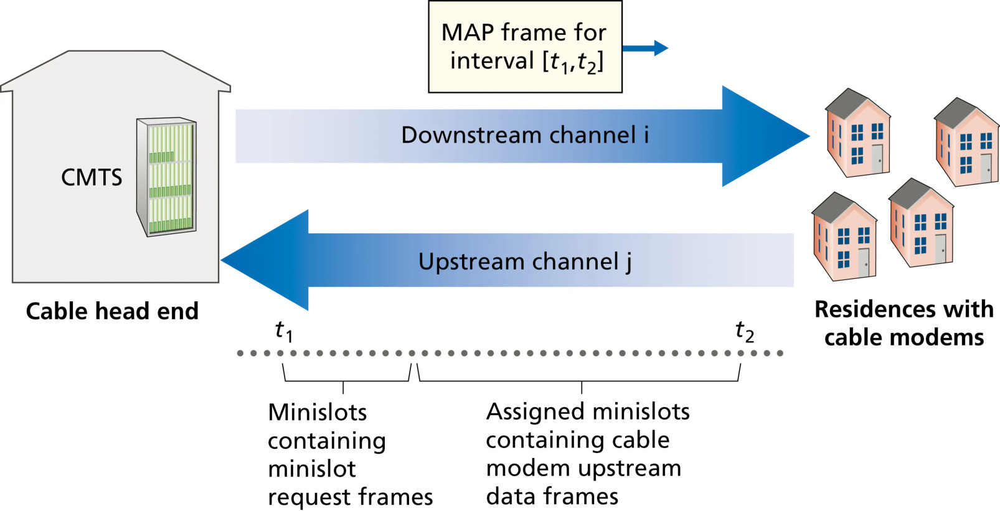

**上行的协调机制**：每个上行信道按时间划分为时隙序列（TDM 式），其中一部分 **微时隙（mini-slot）** 专门用于调制解调器发送 **微时隙请求帧**——这些请求帧 **以随机访问方式** 发送，可能互相碰撞。调制解调器无法监听上行信道，通过「在下行控制消息中是否收到分配响应」推断请求是否碰撞；碰撞后用 **二进制指数退避** 推迟重发。CMTS 通过下行信道发送 **MAP 控制消息** 显式授予各调制解调器在特定微时隙的发送权，被分配的微时隙内保证无碰撞。**一句话总结：一个 DOCSIS 电缆接入网里，FDM（频分）、TDM（时隙）、随机访问（微时隙请求）、集中分配（MAP 授权）四种机制并存。**

---

## 6.4 交换局域网（★408 高频）

**交换局域网（switched LAN）** 由工作在链路层的 **交换机（switch）** 互连而成：交换机交换链路层帧（而非网络层数据报）、不识别网络层地址、不使用路由算法。图 6.15 是典型机构网络：四台交换机连接三个系、两台服务器与一台路由器。

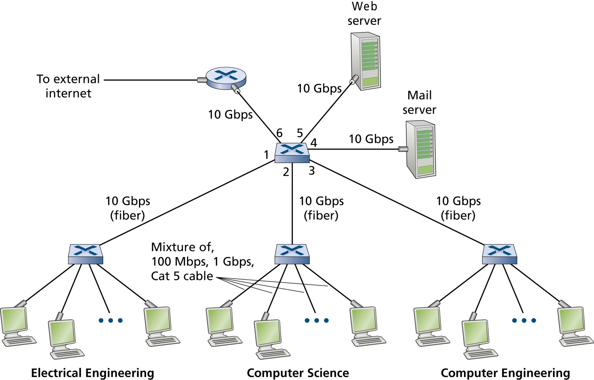

本节的脉络：**MAC 地址与 ARP（6.4.1）→ 以太网（6.4.2）→ 交换机（6.4.3）→ VLAN（6.4.4）**。

### 链路层地址与 ARP（★核心）

**核心概念③：MAC 地址与 ARP** —— 主机与路由器接口同时拥有网络层地址（IP）与链路层地址（MAC）。MAC 地址 **扁平**、全球唯一、与位置无关（像身份证号）；IP 地址 **层次**、随位置变化（像邮政编码）。ARP 负责把同一子网内的 IP 地址解析为 MAC 地址——广播请求、单播响应、表项自动老化。这是 408 高频考点（**高频考点**：ARP 解析流程、跨网段经默认网关、2016#36/2022#47 等），务必把「帧的目的 MAC 填什么」彻底搞清楚。

**MAC 地址（链路层地址 / LAN 地址 / 物理地址）**：注意——不是主机/路由器拥有 MAC 地址，而是它们的 **适配器（网络接口）** 拥有 MAC 地址；多接口设备（路由器）就有多个 MAC 地址。**链路层交换机与主机/路由器相连的接口没有 MAC 地址**——交换机对主机透明，主机不必把帧显式寻址到中间的交换机（图 6.16）。MAC 地址长 **48 位（6 字节）**，共 2⁴⁸ 种可能，用十六进制表示（每字节一对十六进制数），如 02-60-8c-e4-b1-21（高 24 位为厂商代码，低 24 位由厂商分配）。**IEEE 管理 MAC 地址空间**：厂商付费购买一段地址空间（固定前 24 位，自行组合后 24 位），保证全球唯一。

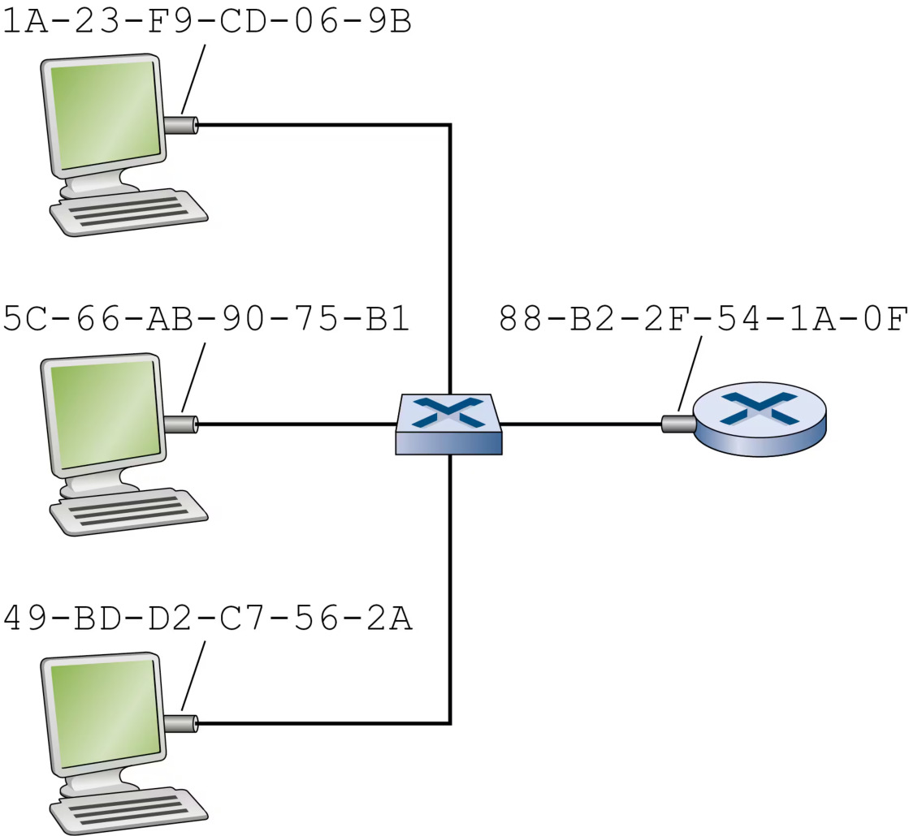

**MAC 地址 vs IP 地址（408 经典辨析）**：

| 对比项 | MAC 地址 | IP 地址 |
|:---|:---|:---|
| 结构 | **扁平**（flat），无层次 | **层次**（网络号 + 主机号） |
| 位置相关性 | 与位置无关，适配器移动不改变 | 随网络位置改变而改变 |
| 类比 | 身份证号（SSN） | 邮政地址 |
| 唯一性 | 全球唯一（IEEE 分配） | 因特网唯一（ICANN 分配） |

**为什么需要两层地址？**（原书「保持层独立」要点）① LAN 被设计为支持任意网络层协议（IP、IPX、DECnet），若适配器用 IP 地址，就不能方便地支持其他网络层协议；② 若用网络层地址，适配器移动或上电时须重配置；③ 若适配器不用任何地址、把所有帧都上交网络层检查，主机会被 LAN 上每个帧中断（包括发给别人的帧）。**结论：各层需要自己的地址方案——应用层主机名、网络层 IP、链路层 MAC。**

**适配器收帧规则**：发送适配器把目的 MAC 插入帧的目的地址字段；接收适配器检查目的 MAC 是否与自己匹配——匹配则抽出数据报上交协议栈，不匹配则 **丢弃**（不打扰上层）。需要发给所有适配器的帧使用 **广播地址 FF-FF-FF-FF-FF-FF**（48 位全 1）。

**ARP（Address Resolution Protocol，RFC 826）**：把同一局域网内的 IP 地址解析为 MAC 地址——**相当于链路层的 DNS**（DNS 把全球范围内的主机名解析为 IP，ARP 只解析同一子网内的 IP→MAC；跨地域解析会出错）。每个主机与路由器内存中都维护 **ARP 表**（IP 地址 ↔ MAC 地址映射 + TTL 生存时间，典型 20 分钟超时删除），表不保证包含子网上所有主机。

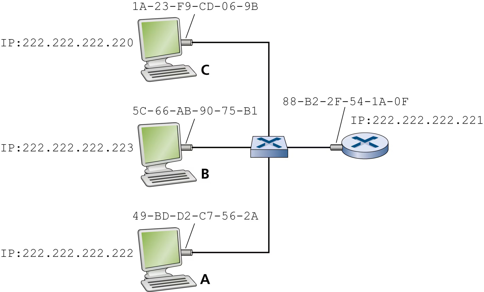

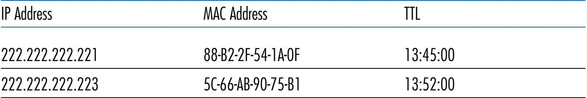

**ARP 解析流程（同子网）：**

1. **查表**：发送主机先查自己的 ARP 表，命中则直接使用映射；
2. **广播请求**：未命中则构造 **ARP 请求分组**（含发送方 IP/MAC、目标 IP、目标 MAC 为空），封装进目的 MAC 为广播地址 FF-FF-FF-FF-FF-FF 的帧，广播到子网所有适配器；
3. **单播响应**：每个适配器把 ARP 分组交给本机 ARP 模块，检查目标 IP 是否与自己匹配；唯一匹配的主机回送 **ARP 响应分组**（含自己的 IP-MAC 映射），**封装进普通（单播）帧** 发给请求方；
4. **更新表**：请求方收到响应后更新 ARP 表，然后构造目的 MAC 为该主机的帧发送 IP 数据报。

**为什么请求要广播、响应却单播？** 请求方不知道目标 MAC，只能广播询问「谁是这个 IP」；响应方已经知道请求方的 MAC（从请求帧的源地址字段），直接单播即可。**ARP 即插即用**：表自动建立、无需管理员配置；主机离开子网后其表项最终超时删除。**ARP 属于哪一层？** ARP 分组封装在链路层帧中、架构上位于链路层之上，却同时含链路层与网络层地址——**ARP 是跨越链路层与网络层边界的协议**，不严格属于任何一层（408 若考归属，通常答「链路层与网络层之间的协议」）。

**跨网段 ARP：经默认网关转发（408 大题高频素材）。** 图 6.19 中两个子网（子网 1：222.222.222.0/24，子网 2：222.222.223.0/24）经路由器互联，路由器两个接口各有一个 IP、一个 ARP 模块、一个适配器。

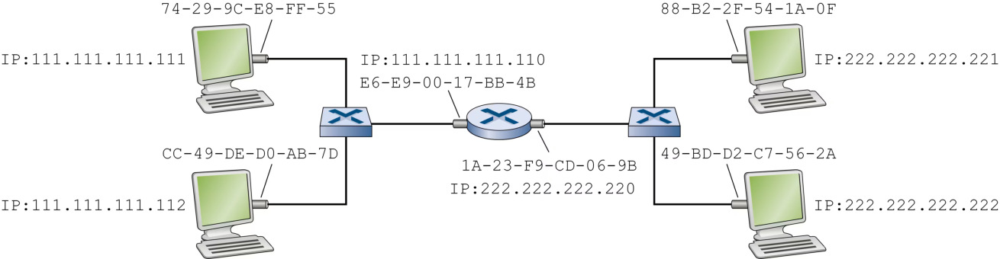

主机 A（222.222.222.221）向子网 2 的主机 B（222.222.223.222）发送数据报时，**帧的目的 MAC 地址绝不能填 B 的 MAC**——那样的话子网 1 上没有任何适配器匹配该目的地址，帧会「静默死亡」。正确流程：

1. **判网**：A 用目的 IP 与自身子网掩码按位与，发现 B 不在同一子网；
2. **查网关 ARP**：数据报必须先送到 **默认网关**——路由器面向子网 1 的接口（222.222.222.220）。A 用 ARP 解析该路由器接口 IP 对应的 MAC（查表或广播请求）；
3. **封装第一跳**：A 把数据报封装进 **目的 MAC = 网关接口 MAC** 的帧，发送到子网 1；
4. **路由器转发**：路由器收帧（目的 MAC 匹配自己）→ 解封装取出数据报 → 查转发表确定出接口（子网 2 方向接口 222.222.223.220）；
5. **第二跳 ARP**：路由器在该接口上再用 ARP 解析 B 的 MAC（查自己的 ARP 表或广播请求）；
6. **封装第二跳**：路由器把数据报封装进 **目的 MAC = B 的 MAC** 的新帧，发送到子网 2，B 收到。

**要点**：跨网段时 **帧的目的 MAC 是下一跳路由器接口的 MAC，而不是最终目的主机的 MAC**；IP 数据报首部的目的 IP 始终是最终目的主机，逐跳不变。每一跳路由器都要把数据报重新封装成新的链路层帧（重新填源/目的 MAC）——这就是「IP 地址端到端不变、MAC 地址逐跳改变」的经典结论。

!!! example "例题 4：ARP 跨网段解析流程（真题 2010#47 相关）"

    主机 H1（IP：192.168.1.2，子网掩码 255.255.255.0，默认网关 192.168.1.1）要向主机 H2（IP：192.168.2.2，子网掩码 255.255.255.0）发送 IP 数据报。路由器 R 的接口 E0（192.168.1.1）连接 H1 所在子网，接口 E1（192.168.2.1）连接 H2 所在子网。H1 与 R 的 ARP 表初始均为空。

    请写出 H1 到 H2 的完整 ARP 与帧转发流程（标注每一步的目的 MAC 地址），并回答：整个过程中 ARP 请求广播了几次？帧的目的 MAC 发生了怎样的变化？

    ??? answer "查看答案"
        **步骤（目的 MAC 变化是本题核心）：**

        1. **判网**：H1 用目的 IP 192.168.2.2 与子网掩码逐位相与，得网络号 192.168.2.0 ≠ 自身网络号 192.168.1.0，判定 H2 不在同一子网，需经默认网关转发；
        2. **解析网关 MAC（第 1 次 ARP）**：H1 查 ARP 表未命中默认网关 192.168.1.1 → 广播 ARP 请求（目的 MAC = FF-FF-FF-FF-FF-FF，目标 IP = 192.168.1.1）→ R 的 E0 接口匹配并单播回复自己的 MAC（记为 M_R0）；
        3. **第一跳帧**：H1 将数据报封装进帧，**目的 MAC = M_R0（网关接口 MAC）**，发送到子网 1；
        4. **路由器接收与转发决策**：R 收帧（目的 MAC 匹配 E0）→ 取出数据报 → 查转发表，目的 192.168.2.2 的下一跳接口为 E1；
        5. **解析目的主机 MAC（第 2 次 ARP）**：R 在子网 2 上查/广播 ARP 请求解析 192.168.2.2 → H2 单播回复自己的 MAC（记为 M_H2）；
        6. **第二跳帧**：R 把数据报重新封装成新帧，**目的 MAC = M_H2**，经 E1 发送到子网 2，H2 收帧（目的 MAC 匹配自己）→ 解封装上交网络层。

        **回答**：ARP 请求共 **广播 2 次**（子网 1 一次解析网关、子网 2 一次解析目的主机）。帧的目的 MAC 变化为：**第 1 跳（子网 1 内）= 网关接口 MAC（M_R0），第 2 跳（子网 2 内）= 目的主机 MAC（M_H2）**——帧的目的 MAC 逐跳变化，而数据报首部的目的 IP 始终保持 192.168.2.2 不变。

        **易错点**：H1 的第一跳帧目的 MAC 是 **网关接口 MAC** 而非 H2 的 MAC；若误填 H2 的 MAC，子网 1 上没有任何适配器匹配，数据报会「静默死亡」。

    ??? success "评分标准"

        - 判网（不在同一子网、经网关转发）（2 分）
        - 两次 ARP 的位置与过程（广播请求/单播响应）（5 分）
        - 帧的目的 MAC 逐跳变化、IP 目的地址不变（3 分）

### 以太网：帧格式与技术演进

**以太网（Ethernet）** 是统治有线局域网的技术：自 1970 年代中期 Metcalfe 与 Boggs 发明以来，以太网击败令牌环、FDDI、ATM 等对手，持续进化（速率提升三个数量级、介质多样化、交换式以太网成为主流），**帧格式近 50 年未变**——这是以太网标准唯一不变的「中心」。早期以太网用同轴总线（广播 LAN），后来用 **集线器（hub）** 星形拓扑（集线器是物理层设备，收到比特就向所有其他接口重发，仍是广播 LAN、仍会碰撞），2000 年代后被 **交换机** 取代。

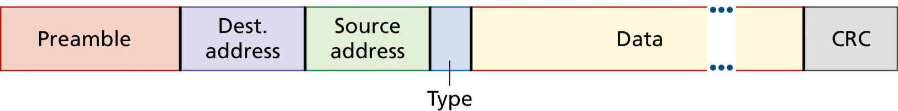

**以太网 V2 帧格式（408 必背）：**

| 字段 | 长度 | 说明 |
|:---|:---|:---|
| 前导码（preamble） | 8 字节 | 前 7 字节为 10101010…（唤醒接收适配器并同步时钟），最后 1 字节 10101011 为 **帧开始定界符（SFD）**，表示其后为 MAC 帧；**不计入帧长** |
| 目的地址 | 6 字节 | 目的适配器 MAC 地址（或广播/多播地址） |
| 源地址 | 6 字节 | 发送适配器 MAC 地址 |
| 类型（type） | 2 字节 | 上层协议类型（如 IP = 0x0800、ARP = 0x0806），用于 **解复用** |
| 数据 | 46-1500 字节 | 承载网络层数据报；**MTU = 1500 B**，超过需分片；不足 46 B 需填充 |
| CRC（FCS） | 4 字节 | 32 位 CRC 校验码（CRC-32），覆盖目的地址到数据字段，不含前导码 |

**帧长关系（408 计算常考）**：最短帧长 64 B = 6 + 6 + 2 + 46 + 4（由 CSMA/CD 争用期决定）；最大帧长 1518 B = 6 + 6 + 2 + 1500 + 4。**前导码 8 字节不计入 64/1518 B**；填充字段由 IP 数据报首部长度字段识别并剥离。以太网 **不需要帧结束定界符**：帧间有 9.6 μs 间隙，接收方找到帧开始定界符后，后续连续比特流都属于同一帧；且以太网用曼彻斯特编码，发完一帧后网卡电压不再跳变，接收方据此定位帧尾（违规编码思想）。

**以太网的服务模型（408 常考）**：① **无连接（connectionless）**——发送前不与接收方握手；② **不可靠（unreliable）**——接收方 CRC 通过不回 ACK、失败只丢弃不告警，发送方不知道帧是否到达。丢弃的帧造成的数据缺口由高层处理：UDP 应用会看到缺口，TCP 则不确认这些数据、触发重传（重传的「新」帧对以太网来说与全新帧无异）。**无连接 + 不可靠让以太网简单廉价。**

**以太网技术命名（理解规律）**：如 10BASE-T、100BASE-T、1000BASE-T、10GBASE-T 等——第一部分是速率（10/100/1000/10G 表示 Mb/s 或 Gb/s）；BASE 表示 **基带**（介质只承载以太网流量）；结尾表示介质（T = 双绞线，F = 光纤，早期 5/2 表示同轴段最大长度 500/185 m）。**高速以太网要点（王道 2026）**：100BASE-T 保持最短帧长不变、把网段最大长度减至 100 m、帧间间隔由 9.6 μs 改为 0.96 μs，支持全双工（全双工下不用 CSMA/CD）；千兆以太网支持全/半双工，半双工用 CSMA/CD；**10 吉比特以太网只工作在全双工、无争用问题、不使用 CSMA/CD**（帧格式与最小/最大帧长保持不变以向后兼容）。

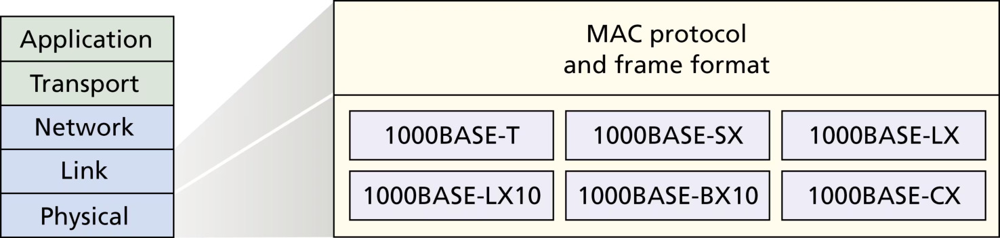

**现代交换式以太网还需要 MAC 协议吗？** 不需要——交换机协调传输、任何时刻不在同一接口上转发超过一个帧，且现代交换机全双工（交换机和节点可同时互发），**交换式以太网没有碰撞、也就不需要 CSMA/CD 协议**。

### 链路层交换机：自学习、过滤与转发

交换机（switch）的作用是接收链路层帧并转发到出链路，**对子网内主机完全透明**。交换机输出接口有缓存（帧到达速率可能暂时超过接口容量）。交换机的两种基本功能：**过滤（filtering）**——决定帧是转发到某接口还是丢弃；**转发（forwarding）**——决定帧应导向哪些接口并移动帧。二者借助 **交换表（switch table）** 完成：每个表项含（MAC 地址、到达该 MAC 的接口、表项建立时间）。

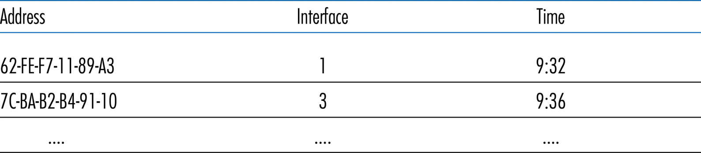

**过滤与转发的三种情况（设帧从接口 x 到达，目的地址为 D）：**

1. **表中无 D 的表项**：交换机 **广播（洪泛 flooding）**——把帧复制到除接口 x 外的所有接口的输出缓存；
2. **表中有 D 且关联接口就是 x**：D 与源在同一网段，帧无需转发，执行 **过滤**——丢弃该帧；
3. **表中有 D 且关联接口 y ≠ x**：把帧放入接口 y 的输出缓存，执行 **转发**。

**核心概念④：以太网与交换机** —— 交换机是 **自学习（self-learning）** 的即插即用设备：转发表完全由观察到的帧流量自动建立，无需管理员配置。自学习三规则：① 表初始为空；② 每收到一个帧，把「源 MAC 地址 → 到达接口 → 当前时间」记入表；③ 若某源地址经过 **老化时间（aging time）** 没有帧再出现，删除该表项。交换机还支持 **全双工**（接口同时收发）。**高频考点**：自学习过程追踪（2014#36、2016#36、2021#36 等）与过滤/转发/洪泛三决策，务必逐帧手推转发表变化。

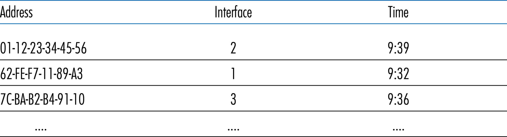

!!! example "例题 5：交换机自学习过程追踪（真题 2014#36/2016#36 风格）"

    一台 4 接口以太网交换机，接口 1、2、3、4 分别连接主机 A、B、C、D（MAC 地址分别为 A、B、C、D），交换表初始为空。各主机依次进行以下通信：

    （1）A 发送帧给 B；（2）B 发送帧给 A；（3）D 发送帧给 C；（4）C 发送帧给 D。

    请追踪每次通信后交换表的变化，并说明每次通信中帧被如何处理（转发/过滤/洪泛）。

    ??? answer "查看答案"
        **（1）A→B**：交换机收到帧（源 A、目的 B，到达接口 1）。查表无 B → 学习表项（A，1），**洪泛** 到接口 2、3、4。B 收帧（目的匹配），C、D 丢弃。表：{（A，1）}。

        **（2）B→A**：收到帧（源 B、目的 A，到达接口 3）。查表有（A，1）且接口 1 ≠ 3 → 学习表项（B，3），**转发** 到接口 1。A 收帧。表：{（A，1），（B，3）}。

        **（3）D→C**：收到帧（源 D、目的 C，到达接口 4）。查表无 C → 学习表项（D，4），**洪泛** 到接口 1、2、3。A、B 丢弃，C 收帧。表：{（A，1），（B，3），（D，4）}。

        **（4）C→D**：收到帧（源 C、目的 D，到达接口 2）。查表有（D，4）且接口 4 ≠ 2 → 学习表项（C，2），**转发** 到接口 4。D 收帧。表：{（A，1），（B，3），（D，4），（C，2）}。

        **规律总结**：交换机只学习 **源** MAC 地址与其进入接口的对应关系（从不按目的地址学习）；目的地址命中表项且不在同一接口 → 转发，在同一接口 → 过滤（丢弃），未命中 → 洪泛。转发表记录的是「源地址 → 进入接口」，转发时按目的地址查表。老化时间到期的表项会被自动删除，保证表符合网络当前状态（2016#36 就考了「转发决策使用的 PDU 地址是目的物理地址」这一条）。

    ??? success "评分标准"

        - 每次通信正确学习源地址表项（4 分）
        - 正确判定转发/过滤/洪泛并说明理由（4 分）
        - 总结自学习规律（2 分）

**交换机的优点（408 常考）：** ① **消除碰撞**：交换机缓冲帧、任何时刻不在同一网段转发超过一个帧，无碰撞带宽浪费，最大聚合吞吐量 = 各接口速率之和；② **异构链路**：隔离链路使不同速率、不同介质的链路可以混用（如铜线 + 光纤 + 高速链路）；③ **便于管理**：可检测并内部断连故障适配器（jabbering adapter）、收集带宽使用统计；④ 提供安全：交换式 LAN 中主机通常只收到发给自己的帧，嗅探比集线器/无线局域网难得多（但有 **交换机毒化 switch poisoning** 攻击：发送大量伪造源 MAC 填满转发表，迫使交换机洪泛大部分帧）。

**交换机 vs 路由器（408 高频对比）：**

| 特性 | 交换机（链路层，L2） | 路由器（网络层，L3） |
|:---|:---|:---|
| 转发依据 | MAC 地址（目的物理地址） | IP 地址（最长前缀匹配） |
| 即插即用 | **是**（自学习转发表） | 否（需配置 IP） |
| 环路处理 | 受限于生成树（活动拓扑无环） | 可用最短路（支持冗余路径） |
| 广播风暴 | 易受广播风暴影响 | 可隔离广播域、提供防火墙 |
| 处理开销 | 只处理到 L2，转发率高 | 处理到 L3，每分组处理更大 |
| 典型规模 | 小型网络（数百主机） | 大型网络（数千主机） |

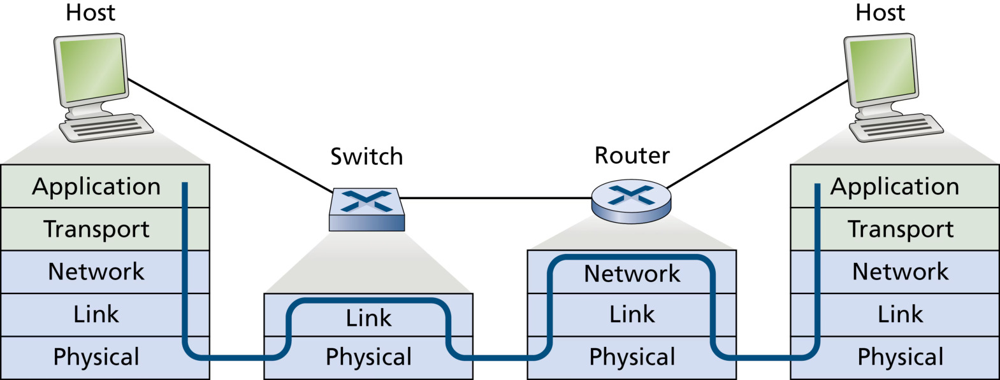

**冲突域与广播域（408 必考概念）：**

- **冲突域（collision domain）**：可能发生碰撞的范围。**集线器不隔离冲突域**（同一集线器所有接口在同一冲突域）；**交换机/网桥每个接口隔离一个冲突域**（16 接口交换机 = 16 个冲突域）；**路由器也隔离冲突域**。
- **广播域（broadcast domain）**：广播帧可达的范围。**集线器与交换机都不隔离广播域**（一个 LAN 内所有接口同属一个广播域）；**路由器隔离广播域**（每个接口一个广播域）。

**结论一句话**：**物理层设备（中继器/集线器）既不隔离冲突域也不隔离广播域；数据链路层设备（网桥/交换机）隔离冲突域但不隔离广播域；网络层设备（路由器）两者都隔离。**（2020#35、2016#35、2010#38 常考）

!!! info "名词解释：冲突域与广播域（Collision Domain and Broadcast Domain）"

    **冲突域** 指共享同一信道、可能发生碰撞的站点集合：两台站点同时发送会碰撞，则它们属于同一冲突域。**广播域** 指广播帧能到达的站点集合：域内任意站点发送广播帧，域内所有站点都会收到。

    - 集线器（物理层）：不隔离冲突域，也不隔离广播域——N 接口集线器 = **1 个冲突域 + 1 个广播域**；
    - 交换机（链路层）：隔离冲突域，不隔离广播域——N 接口交换机 = **N 个冲突域 + 1 个广播域**；
    - 路由器（网络层）：隔离冲突域，也隔离广播域——N 接口路由器 = N 个冲突域 + N 个广播域。

    例（王道 2026）：16 接口集线器的冲突域与广播域个数分别是 1、1；16 接口以太网交换机分别是 16、1。

### VLAN：虚拟局域网与 802.1Q

机构 LAN 的层次化配置存在三大问题：① **缺乏流量隔离**——广播流量（ARP、DHCP 请求、未被自学习交换机学习的帧）必须穿越整个机构网络，既降性能又不利安全（如高管流量不应到达普通员工主机）；② **交换机利用低效**——部门数很多时，为每个部门单独配交换机不经济且不隔离流量；③ **用户管理困难**——员工换部门须改物理布线。

**虚拟局域网（VLAN，Virtual Local Area Network）** 在单一物理 LAN 基础设施上定义多个 **虚拟局域网**：同一 VLAN 内的主机互相通信时如同独占一台交换机，VLAN 之间的帧完全隔离。**基于端口（port-based）的 VLAN** 最常见：网络管理员把交换机端口划分为若干组，每组构成一个 VLAN，**每个 VLAN 是一个广播域**（某端口发出的广播帧只能到达同组端口）。图 6.25：8 端口交换机中端口 1-6 属 EE VLAN、7-8 属 CS VLAN。

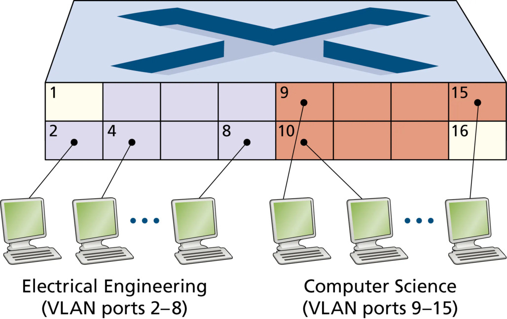

**核心概念⑤：VLAN** —— 用一台物理交换机切出多个逻辑广播域：VLAN 隔离广播域（802.1Q 帧打 4 字节标签标识所属 VLAN），不同 VLAN 之间不能直接二层通信、必须经路由器（三层设备）。这是 408 高频考点（**高频考点**：VLAN 特性 2024#36、802.1Q 帧格式、trunk 干道），也是综合大题（2017#47 等）的常客。

**跨 VLAN 通信**：VLAN 完全隔离后，EE 部门如何与 CS 部门通信？把某端口连到外部路由器并把该端口同时划入 EE 与 CS 两个 VLAN——逻辑上两个部门如同各自独立交换机经路由器互连：EE 的 IP 数据报先经 EE VLAN 到路由器，再由路由器经 CS VLAN 转发回 CS 主机。交换机厂商常把 VLAN 交换机与路由器做成一体设备，免去外部路由器。

**跨交换机的 VLAN 与干道（trunking）**：EE/CS 教职员工可能分散在不同建筑，需要两台交换机。若每 VLAN 用一条专线连接（图 6.26(a)），N 个 VLAN 就需要 N 条线，不可扩展。更优方案 **VLAN 干道**（图 6.26(b)）：每台交换机配置一个 **干道端口（trunk port）** 互连两台交换机，干道端口属于 **所有** VLAN，任意 VLAN 的帧都经干道链路转发。但干道上必须能区分帧属于哪个 VLAN——**IEEE 802.1Q** 扩展帧格式登场。

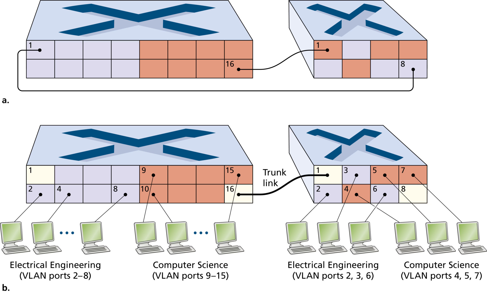

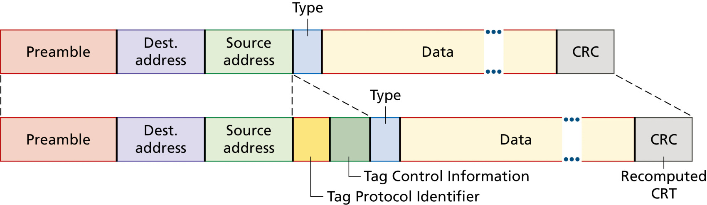

**802.1Q 帧（408 必考细节）：**

- **位置**：4 字节 **VLAN 标签（tag）** 插在 **源地址字段与类型字段之间**；
- **结构**：前 2 字节为 **标签协议标识（TPID）**，固定值 **0x8100**，表示这是 802.1Q 帧；后 2 字节为标签控制信息（TCI），其中 **12 位 VLAN 标识符（VID）** 唯一标识帧所属 VLAN（最多识别 **4096** 个 VLAN，0 与 4095 保留），另有 3 位优先级（类似 IP 的 TOS 字段）与 1 位 CFI/DEI；
- **对帧长的影响**：VLAN 帧首部增加 4 字节 → 数据字段最小长度由 46 变为 42 字节、最大 1500 不变 → **最大帧长由 1518 变为 1522 字节**；插标签后 **FCS 必须重新计算**；
- **处理方式**：发送侧交换机在进入干道前插入标签，接收侧交换机解析并剥除标签后再转发给主机——**主机收发的仍是标准以太网帧，看不到 VLAN 标签**（主机甚至不知道自己属于哪个 VLAN）。**A 站向同交换机同 VLAN 的 B 站发帧**：交换机直接按目的 MAC 转发、不加标签；**A 站向跨交换机的 E 站发帧**：交换机加标签后经干道转发，对端交换机剥标签后交付 E。

**VLAN 划分方式（王道 2026）**：① **基于端口**——最简单有效，但主机换端口可能改变所属 VLAN；② **基于 MAC 地址**——主机移动到其他交换机仍属原 VLAN；③ **基于 IP 地址/网络层协议**——可跨路由器扩展。**VLAN 只是局域网提供的一种服务，不是一种新型局域网。**

---

## 6.5 链路虚拟化：把网络当作一条链路

回顾「链路」概念的演化：从物理导线 → 共享信道/无线频谱 → 交换式基础设施 → **把整个网络虚拟成一条链路**。拨号上网中，两台主机的「链路」实际是电话网——从因特网链路层视角，电话网只是一根「线」。本节两种技术：**MPLS** 与 **VXLAN**，都让两台设备之间的虚拟链路在逻辑上表现得像一条物理链路。

### MPLS：多协议标签交换

**MPLS（Multiprotocol Label Switching）** 源于 1990 年代中后期提高 IP 路由器转发速度的努力：借鉴虚电路网络的 **定长标签（fixed-length label）** 概念，**有选择地** 给数据报打标签，让路由器在可能时 **按标签转发**（而非按目的 IP 最长前缀匹配）。MPLS 与 IP 协同工作：**使用 IP 编址与路由**，只是增强而非取代 IP 转发。

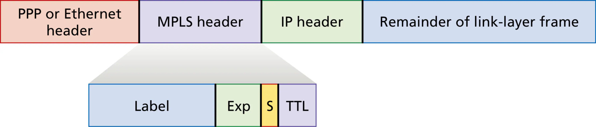

**MPLS 头（RFC 3032，32 位 = 4 字节）**：位于链路层（如以太网）头与网络层（IP）头之间。字段包括：**20 位标签（label）**、3 位 EXP（试验/服务等级）、**1 位 S（栈底指示，表示这是否是标签栈的最后一层）**、8 位 TTL（生存时间）。

**MPLS 转发**：MPLS 路由器（**标签交换路由器，label-switched router**）收到帧后 **只查 MPLS 标签**、不做最长前缀匹配，把数据报交给标签对应的出接口。**关键点**：MPLS 路由器 **从头到尾不碰 IP 首部**。MPLS 帧只能在与 MPLS 路由器之间传送（非 MPLS 路由器会在「该出现 IP 头的位置」遇到 MPLS 头而不知所措）。

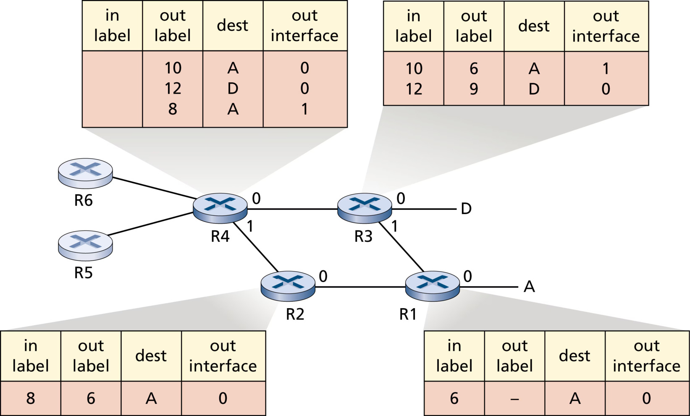

**MPLS 的真正价值不在转发速度，而在流量工程（traffic engineering）**：图 6.29 中路由器 R4 有两条到达 A 的 MPLS 路径（经接口 0 的标签 6、经接口 1 的标签 5）——若按 IP 转发，路由协议只会选一条最短路；而 MPLS 能让运营商 **按策略把去往同一目的地的流量分配到不同路径**（性能、策略等原因），这是标准 IP 路由做不到的。MPLS 还可用于：快速故障恢复（预先计算的备用路径重路由）、实现 **虚拟专用网（VPN）**。标签分发协议（如 RSVP-TE、LDP）与路径计算细节超出本书范围。**注：MPLS 的许多流量工程能力也可用第 5 章的 SDN 通用转发实现，二者可能长期共存。**

### VXLAN：以太网 Over IP

VLAN 有两个局限：① VID 只有 12 位，最多 4096 个 VLAN；② VLAN 必须包含在 **单一的、全交换式以太网** 基础设施内。**VXLAN（Virtual eXtensible LAN，RFC 7348）** 把以太网（二层）子网扩展到跨越三层网络边界——把以太网帧封装进 UDP，让分布在全球的物理以太网段组成一个逻辑 VLAN。

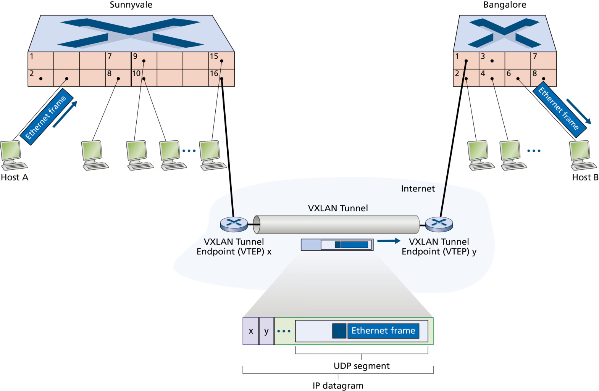

**VXLAN 工作过程**：**VXLAN 隧道端点（VTEP，VXLAN Tunnel Endpoint）** 是配置了 VXLAN 的普通交换机/路由器（或数据中心里的虚拟交换机）。Host A（Sunnyvale）发送目的 MAC 为 Host B（Bangalore）的以太网帧 → VTEP x 收到后把整个以太网帧连同 **VXLAN 头**（含 **24 位 VNI，VXLAN Network Identifier**，可标识 **1600 多万** 个 VXLAN，解决 VLAN 4096 上限）放进 **UDP 数据报** 的载荷 → 再放进目的地址为对端 VTEP y 的 IP 数据报 → IP 网络透明转发（对内容毫不知情）→ VTEP y 解封装、抽出原始以太网帧发到 Bangalore 以太网 → Host B 收到。**层次封装链：以太网帧 → UDP 段 → IP 数据报**——把整个 IP 网络虚拟化为一条单链路。VXLAN 的 1600 万级虚拟 LAN 规模对数据中心尤其有价值（6.6 节）。

---

## 6.6 数据中心网络

谷歌、微软、亚马逊、阿里等公司建有容纳数万至数十万台主机的巨型数据中心。数据中心网络（data center network）内部互连其主机。数据中心三大职责：① 向用户提供内容（网页、搜索结果、AI 聊天机器人、邮件、流媒体）；② 作为特定数据处理任务的大规模并行计算基础设施；③ **向其他公司提供云计算**（AWS、Azure、阿里云）。成本构成：主机约占一半（3-4 年更换）、基础设施约 1/4、电力约 1/6、网络约 1/10——**网络虽非最大成本，但网络创新是降本增效的关键**。

### 数据中心架构

数据中心的主力是 **刀片服务器（blade）**：形似披萨盒的通用主机，堆叠在 **机架（rack）** 中（每架 20-40 台）。每架顶部有一台 **架顶交换机（TOR，Top-of-Rack switch）** 互连架内主机，TOR 又有额外端口连接其他交换机。**边界路由器（border router）** 把数据中心网络接入公共因特网。数据中心网络支撑两类流量：外部客户端与内部主机之间（南北向）、内部主机之间（东西向）。

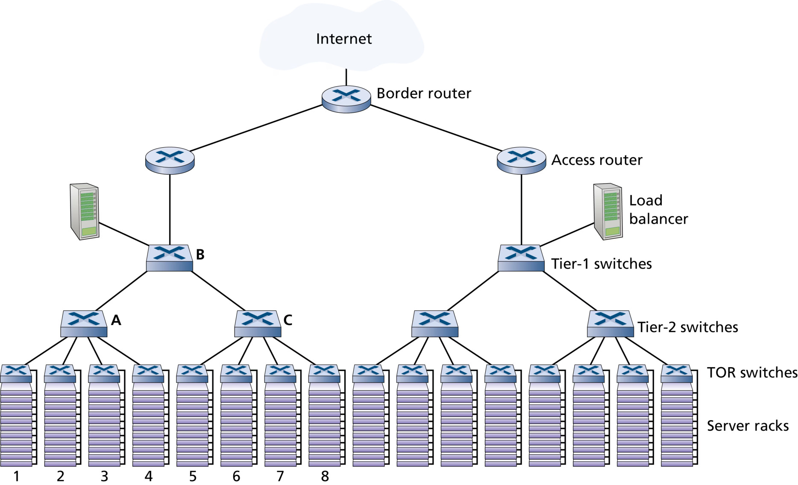

**负载均衡器（load balancer）**：每个云应用关联一个对外公开 IP；外部请求先到负载均衡器，它按各主机当前负载把请求分发到处理该应用的主机。负载均衡器又称「**4 层交换机**」——它依据目的端口号（4 层）与目的 IP 地址决策；还提供 **NAT 式功能**：把对外 IP 翻译为内部主机 IP（反向亦然），隐藏内部结构、防止客户端直接接触主机。

**层次架构**：边界路由器 → 接入路由器（access router）→ 三层交换机（核心/汇聚/接入 TOR）。每个接入路由器下的主机形成一个子网，为本地化 ARP 广播流量，子网再划分为 **VLAN**（每 VLAN 数百台主机）。层次架构可扩展到数十万台主机，但存在 **主机到主机容量受限** 问题：同架内主机可全速通信（受限于网卡速率），跨架通信经高层交换机时，多条流共享链路、每条流只分得链路容量的几分之一。

**改进方案**：① 换更高端交换机（昂贵）；② **就近放置** 相关服务与数据（只能缓解）；③ **增加层间连通度**——每台 TOR 连两台汇聚交换机、汇聚与核心之间多条链路与多台交换机，形成多条 **链路/交换机不相交** 的路径（图 6.32），既增容量又增可靠性（路径多样性）。这种多层互连网络即 **Clos 网络**（Charles Clos 在电话交换研究中提出）。

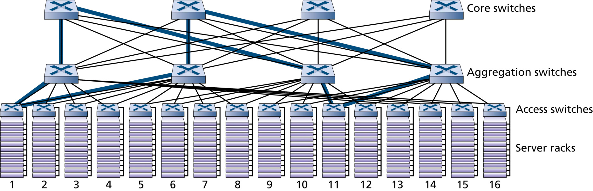

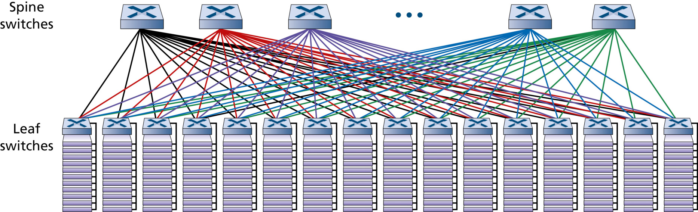

**多路径路由**：连通度提高使多路径成为常态。简单方案 **ECMP（等价多路径，RFC 2992）** 在源与目的之间做随机化下一跳选择；更精细的方案按流粒度做负载均衡，甚至流内逐分组多路径。**leaf-spine（叶脊）拓扑**（图 6.33）是层次拓扑的两层演化：每个 **叶交换机（leaf，接入交换机）** 连接到 **每一台** 脊交换机（spine，核心交换机）。扩展方式：升级叶-脊链路速率，或横向增加脊交换机。**leaf-spine 中，接入交换机之外的任何通信都恰好经过 2 跳**（固定、最小的跳数），远优于层次拓扑的可变跳数。leaf-spine 的流行反映了东西向流量占比上升。

### 数据中心网络的趋势

- **集中式 SDN 控制与管理**：数据中心由单一组织管理，天然适合 SDN 式逻辑集中控制（谷歌 Orion 平台）；数据平面（简单通用交换机）与控制平面（软件）分离，自动化配置与运维状态管理至关重要。
- **虚拟化**：虚拟机（VM）把运行软件与物理硬件解耦，支持 VM 在不同机架间无缝迁移。为支持迁移中保持活跃连接，把整个数据中心网络视为单一扁平二层网络：**ARP 机制改为 DNS 式目录查询**（目录维护「VM 的 IP ↔ 当前所在物理交换机」映射），替代广播。
- **物理约束**：数据中心链路容量极高、时延极低（微秒级）、缓冲区小，TCP 拥塞控制在此不适用（需快速反应、极低丢包）；解决方案从专用 TCP 变体到在标准以太网上实现 **RDMA（远程直接内存访问）**。
- **模块化与定制化（MDC）**：工厂在标准集装箱内预制「迷你数据中心」（数千主机、数十机架），运到现场多箱互连；箱内设计为优雅降级，性能低于阈值时整箱更换。云巨头正自研/定制数据中心里的几乎所有组件（网卡、交换机、路由器、TOR、软件、协议）。
- **能效与碳效**：数据中心 2024 年消耗约 460 TWh 电力（全球 1-2%，AI/大模型推动下十年末预计升至更高比例）；除能效外还强调 **碳效率**。亚马逊「**可用区（availability zone）**」：在相隔数公里的不同建筑复制独立数据中心，事务数据跨数据中心同步并容错。

---

## 6.7 回顾：网页请求的一生（★408 综合大题经典素材）

前五章的知识在此汇合。学生 Bob 把笔记本接入学校的以太网交换机（经学校路由器连到 ISP Comcast），请求 www.google.com 的首页。看似简单的请求背后是 **DHCP → ARP → DNS → TCP → HTTP** 的完整协议链——这正是 408 综合大题的经典素材（**高频考点**：2010#47、2017#47、2022#47 均以「主机通信全流程」设问，王道 PAGE 219 附近的主机发送 IP 数据报过程可对照复习）。

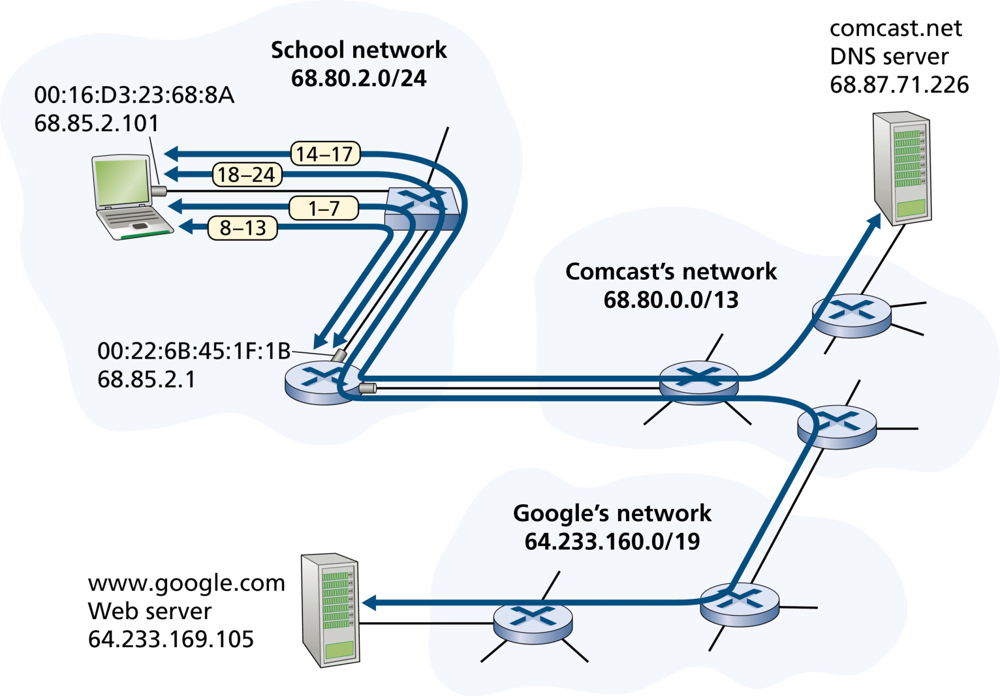

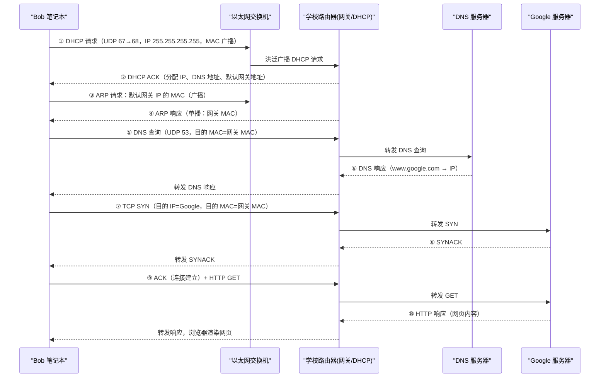
```mermaid
sequenceDiagram
    participant L as "Bob 笔记本"
    participant S as "以太网交换机"
    participant R as "学校路由器(网关/DHCP)"
    participant D as "DNS 服务器"
    participant G as "Google 服务器"
    L->>S: ① DHCP 请求（UDP 67→68，IP 255.255.255.255，MAC 广播）
    S->>R: 洪泛广播 DHCP 请求
    R-->>L: ② DHCP ACK（分配 IP、DNS 地址、默认网关地址）
    L->>S: ③ ARP 请求：默认网关 IP 的 MAC（广播）
    R-->>L: ④ ARP 响应（单播：网关 MAC）
    L->>R: ⑤ DNS 查询（UDP 53，目的 MAC=网关 MAC）
    R->>D: 转发 DNS 查询
    D-->>R: ⑥ DNS 响应（www.google.com → IP）
    R-->>L: 转发 DNS 响应
    L->>R: ⑦ TCP SYN（目的 IP=Google，目的 MAC=网关 MAC）
    R->>G: 转发 SYN
    G-->>R: ⑧ SYNACK
    R-->>L: 转发 SYNACK
    L->>R: ⑨ ACK（连接建立）+ HTTP GET
    R->>G: 转发 GET
    G-->>R: ⑩ HTTP 响应（网页内容）
    R-->>L: 转发响应，浏览器渲染网页
```

**阶段一：DHCP 获取配置（6.7.1）**。Bob 开机接入网络时还没有 IP 地址，第一件事是运行 DHCP：

1. Bob 的 OS 构造 **DHCP 请求报文**（UDP 目的端口 67、源端口 68）→ 封装进 **IP 数据报**（目的 IP = 广播地址 255.255.255.255、源 IP = 0.0.0.0，因为自己还没有 IP）→ 再封装进 **以太网帧**（目的 MAC = FF-FF-FF-FF-FF-FF 广播、源 MAC = Bob 笔记本网卡）；
2. 广播帧到达交换机，交换机 **洪泛** 到所有端口（包括连路由器的端口）；路由器收到后解封装、按目的 IP 广播指示上交上层，UDP 解复用交付 DHCP 服务器（DHCP 服务器常运行在路由器内）；
3. DHCP 服务器从 CIDR 地址块中分配 IP（如 68.85.2.101），构造 **DHCP ACK**（含分配 IP、DNS 服务器 IP、默认网关 IP、子网掩码），封装后 **单播** 回 Bob（交换机自学习过 Bob 的 MAC，直接向 Bob 的端口转发）；
4. Bob 的 DHCP 客户端记录自己的 IP、DNS 地址，并把默认网关装入 IP 转发表——**目的地址在子网外的一切数据报都交给默认网关**。

**阶段二：DNS 与 ARP（6.7.2）**。Bob 在浏览器输入 www.google.com，浏览器创建 TCP socket 需要先知道服务器 IP：

5. OS 构造 **DNS 查询报文**（www.google.com 放入问题区）→ UDP 目的端口 53 → IP 目的地址 = DHCP 给的 DNS 服务器 IP → 封装进帧时发现：**只知道网关 IP、不知道网关 MAC**；
6. Bob 构造 **ARP 查询报文**（目标 IP = 默认网关 IP）→ 封装进目的 MAC 广播的帧 → 交换机洪泛 → 网关路由器匹配目标 IP，回送 **ARP 响应**（单播，目的 MAC = Bob）告诉 Bob 自己的 MAC；
7. Bob 终于能正确封装帧：**IP 目的地址是 DNS 服务器、帧目的 MAC 是网关**——数据报逐跳路由（域内 RIP/OSPF + 域间 BGP）送达 DNS 服务器，DNS 服务器查库返回 www.google.com 的 IP，Bob 获得服务器 IP。

**阶段三：TCP 与 HTTP（6.7.4）**：

8. Bob 创建 TCP socket，发出 **SYN 报文段**（目的端口 80）→ IP 目的 = Google 服务器 IP → 帧目的 MAC = 网关 MAC（ARP 表已有）；
9. 各路由器查转发表逐跳转发（跨 Comcast 与 Google 网络的域间路由由 BGP 决定）；SYN 到达 www.google.com，服务器为连接创建连接 socket，回送 **SYNACK**；Bob 收到后回 **ACK**，TCP 连接建立；
10. Bob 浏览器构造 **HTTP GET 报文**（请求的 URL）写入 socket → 成为 TCP 段载荷 → 封装数据报与帧发送；Google 的 HTTP 服务器读取 GET、构造 **HTTP 响应报文**（含请求的网页内容）发送回；Bob 浏览器从 socket 读出响应、提取 HTML 并渲染——**网页显示！**

**完整协议链复习（408 大题答题骨架）**：① DHCP（UDP 67/68、IP 广播、MAC 广播、分配 IP/DNS/网关）→ ② ARP（广播请求/单播响应、解析默认网关 MAC）→ ③ DNS（UDP 53、查询 www 域名、返回服务器 IP）→ ④ TCP 三次握手（SYN/SYNACK/ACK）→ ⑤ HTTP（GET 请求、响应返回网页）。**每一跳的封装链**：报文（应用）→ 报文段（传输）→ 数据报（网络）→ 帧（链路）；**IP 地址端到端不变，MAC 地址逐跳改变。**

---

## 6.8 小结

本章完成协议栈的最后一块：链路层把网络层数据报从一节点搬到相邻节点，服务包括组帧、链路接入、可靠交付与差错检测/纠正，实现位置是网络适配器（硬件）+ 主机软件。核心线索回顾：

1. **差错检测与纠正**：奇偶校验（单比特检奇数错、二维可纠 1 位错）、校验和（传输层软件用，二进制反码和）、**CRC**（链路层硬件用，模 2 除、FCS 位数 = 生成多项式最高次数、能检测任意奇数个错与短突发错）。
2. **多路访问协议**：信道划分（TDM/FDM/CDMA——CDMA 靠码片正交性同时传输）、随机访问（纯 ALOHA 1/2e、时隙 ALOHA 1/e、CSMA 三变体、**CSMA/CD**：争用期 2τ、最短帧长 = 2τ×R、二进制指数退避、16 次放弃；CSMA/CA：RTS/CTS、NAV、隐蔽站）、轮转（轮询、令牌传递）。
3. **交换局域网**：MAC 地址（48 位扁平）与 **ARP**（同子网广播请求/单播响应；跨子网经默认网关、目的 MAC 填网关接口）；以太网帧（前导码 8 B + 6+6+2+46~1500+4，无连接不可靠）；交换机（自学习、过滤/转发/洪泛、隔离冲突域不隔离广播域、vs 路由器）；**VLAN**（802.1Q 4 字节标签、TPID 0x8100、12 位 VID、trunk 干道）。
4. **链路虚拟化**：MPLS（20 位标签、FEC、流量工程）与 VXLAN（以太网封装进 UDP、24 位 VNI）。
5. **数据中心网络**：机架/刀片/TOR/负载均衡器/边界路由器、层次拓扑 → Clos 网络 → leaf-spine、趋势（SDN、虚拟化、RDMA、可用区）。
6. **网页请求的一生**：DHCP → ARP → DNS → TCP → HTTP 的完整协议链，贯通五层协议栈。

---

## 🧪 本章习题

> 每道题均可回溯至本章正文（考点映射见章首导览）。A 组为基础题，B 组为提高题，C 组为拓展综合题（408 大题风格），最后为原书习题讲解与真题改编。

### A 基础题（单选/填空，每题 1-2 分）

**A1.**（单选）关于 **奇偶校验码**，下列说法正确的是（ ）。

- A. 能够检测出任意个数的比特错误
- B. 只能检测出奇数个比特错误，且无法定位错误位置
- C. 既能检测错误又能纠正一位错误
- D. 能够检测出所有突发错误

??? answer "查看答案"
    **答案：B**

    奇偶校验通过附加校验位使码字中 1 的个数为奇数（奇校验）或偶数（偶校验），只能检测出 **奇数个** 比特错误；偶数个错误会使 1 的个数的奇偶性不变而漏检。它只能报告「出错了」，无法指出哪一位错（定位与纠错是二维奇偶校验或海明码的能力）。A、D 错误，C 是二维奇偶校验/海明码的特性。

**A2.**（单选）下列关于 **MAC 地址** 的说法，错误的是（ ）。

- A. MAC 地址长 48 位，用十六进制表示
- B. MAC 地址具有扁平结构，与主机所在位置无关
- C. MAC 地址由 IEEE 统一管理，全球唯一
- D. MAC 地址具有层次结构，主机更换网络位置时必须重新配置

??? answer "查看答案"
    **答案：D**

    MAC 地址是 **扁平** 结构（与身份证号类似），适配器无论移动到何处都不变；与之相反，**IP 地址** 具有层次结构（网络号 + 主机号），主机更换网络时必须重新配置。A、B、C 均正确：MAC 地址 48 位（6 字节）、十六进制表示（如 02-60-8c-e4-b1-21）、由 IEEE 管理分配（前 24 位厂商代码 + 后 24 位序列号）。

**A3.**（填空）CSMA/CD 中，**争用期（冲突窗口）** 等于信号在端到端距离上的 **____** 传播时延；最短帧长 = **____ × ____**。10 Mb/s 以太网的最短帧长为 **____** 字节。

??? answer "查看答案"
    **两倍（往返）** 传播时延；**争用期 × 数据传输速率**（即 2τ × R）；**64** 字节。

    推导：A 站开始发送后最多经过 2τ（τ 为单程端到端传播时延）就能知道是否发生碰撞，故争用期 = 2τ；为保证发送方在发送完之前若发生碰撞必然能检测到，要求发送时间 ≥ 争用期，即最短帧长 = 争用期 × 速率 = 2τ × R。10 Mb/s 以太网争用期 51.2 μs，可发送 512 bit = 64 B。

**A4.**（单选）关于 **VLAN**，下列说法正确的是（ ）。

- A. 不同 VLAN 内的主机之间可以直接进行二层通信
- B. 一个 VLAN 内的所有端口属于同一个广播域
- C. 交换机上的每个端口都必须属于不同的 VLAN
- D. 802.1Q 帧的 VLAN 标签占用 8 字节

??? answer "查看答案"
    **答案：B**

    每个 VLAN 是一个 **广播域**：同一 VLAN 内的广播帧只在该 VLAN 内传播（A 错误——不同 VLAN 的主机不能直接二层通信，必须经路由器等三层设备）。C 错误——多个端口可划入同一 VLAN。D 错误——802.1Q 的 VLAN 标签为 **4 字节**（TPID 2 字节固定 0x8100 + TCI 2 字节，其中 12 位 VID）。

**A5.**（单选）以太网 V2 帧中，**数据字段** 的长度范围是（ ）。

- A. 0～1500 字节
- B. 46～1500 字节
- C. 64～1518 字节
- D. 46～1518 字节

??? answer "查看答案"
    **答案：B**

    数据字段承载网络层数据报：最大 **1500 字节**（以太网 MTU），超过需分片；最小 **46 字节**——由 CSMA/CD 最短帧长 64 B 反推：64 = 6（目的）+ 6（源）+ 2（类型）+ 46（数据）+ 4（FCS），数据不足 46 B 时 MAC 子层加填充字段补齐。选项 C、D 是帧的总长度（64 B 与 1518 B），不是数据字段长度。

### B 提高题（简答/计算，每题 5-10 分）

**B1.**（计算，10 分）要发送的数据是 1101011011（10 位），采用 CRC 检验，生成多项式是 10011（即 G(x) = x⁴ + x + 1）。

（1）求帧检验序列 FCS 与最终发送的比特串；

（2）接收方如何判断传输是否出错？

??? answer "查看答案"
    **（1）** 生成多项式 10011 的最高次数 r = 4，故在数据后补 4 个 0，得到被除数 **11010110110000**。用 G = 10011 做模 2 除法：

    | 步骤 | 当前余数寄存器（5 位） | 首位为 1 则 XOR 10011 | 处理后 4 位 |
    |:---|:---|:---|:---|
    | 1 | 11010 | 11010 ⊕ 10011 = 01001 | 1001（下一位补入 1） |
    | 2 | 10011 | 10011 ⊕ 10011 = 00000 | 0000（下一位补入 1） |
    | 3 | 00001 | 首位为 0，直接左移 | 0001（下一位补入 0） |
    | 4 | 00010 | 首位为 0，直接左移 | 0010（下一位补入 1） |
    | 5 | 00101 | 首位为 0，直接左移 | 0101（下一位补入 1） |
    | 6 | 01011 | 首位为 0，直接左移 | 1011（下一位补入 0） |
    | 7 | 10110 | 10110 ⊕ 10011 = 00101 | 0101（下一位补入 1） |
    | 8 | 01010 | 首位为 0，直接左移 | 1010（下一位补入 0） |
    | 9 | 10100 | 10100 ⊕ 10011 = 00111 | 0111（下一位补入 0） |
    | 10 | 01110 | 首位为 0，直接左移 | **1110** |

    余数（FCS）= **1110**（4 位）。最终发送的比特串 = 1101011011 **1110**，即 **11010110111110**。

    **验证**：11010110111110 除以 10011 的余数为 0（「D 后接 FCS」恰好被 G 整除）。

    **（2）** 接收方用同一生成多项式 10011 对收到的比特串做模 2 除法：**余数为 0 → 无差错接受**；**余数非 0 → 判定出错，丢弃该帧**。

??? success "评分标准"

    - 正确补 4 个 0 得被除数（2 分）
    - 模 2 除法过程正确、余数 = 1110（5 分）
    - 最终发送串 11010110111110（2 分）
    - 接收方检验原理（1 分）

**B2.**（计算，10 分，真题 2019#36 改编）假设一个采用 CSMA/CD 协议的 100 Mb/s 局域网，最短帧长为 128 B。

（1）求该网络的争用期与允许的最大单向传播时延；

（2）若网段内最远两站点之间的距离加倍（其他条件不变），最短帧长应变为多少？

??? answer "查看答案"
    **（1）** 最短帧长 = 争用期 × 速率：

    $$ \text{争用期} = \frac{L_{min}}{R} = \frac{128 \times 8}{100 \times 10^6} = 10.24 \ \mu s $$

    争用期 = 2τ（τ 为单向传播时延），故最大单向传播时延：

    $$ \tau_{max} = \frac{10.24}{2} = 5.12 \ \mu s $$

    与真题 2019#36 一致：100 Mb/s、最短帧长 128 B 时，一个冲突域内两站点之间的单向传播时延最多为 **5.12 μs**。

    **（2）** 距离加倍 → 单程传播时延加倍：τ' = 10.24 μs，争用期 2τ' = 20.48 μs。要保持「发送时间 ≥ 争用期」，最短帧长：

    $$ L'_{min} = 20.48 \times 10^{-6} \times 100 \times 10^6 = 2048 \ \text{bit} = 256 \ \text{B} $$

    **规律**：网段距离（冲突域范围）加倍 → 最短帧长也加倍（传输速率不变时，最短帧长与距离成正比）。

??? success "评分标准"

    - 争用期 10.24 μs（3 分）
    - 单向传播时延 5.12 μs（3 分）
    - 距离加倍后最短帧长 256 B（4 分）

**B3.**（计算，10 分，真题 2010#47 改编）主机 A 与主机 B 通过一台 10 Mb/s 以太网交换机相连，交换机转发表中已有 A、B 的表项。主机 A 向 B 发送一个长 1518 字节的以太网帧（6 字节目的地址 + 6 字节源地址 + 2 字节类型 + 1500 字节数据 + 4 字节 FCS）。

（1）若交换机采用 **直通（cut-through）交换**（收到目的地址即可转发，不缓存整帧），该帧从第一个比特到达交换机输入端口到开始从输出端口发送，需多长时间？

（2）若采用 **存储转发**，需多长时间（忽略处理与排队时延）？

（3）100 Mb/s 交换机上同样的 1518 字节帧，两种方式各需多长时间？（真题 2013#36 同考点）

??? answer "查看答案"
    **（1）直通交换**：只需接收 **目的 MAC 地址（6 字节）** 即可决定转发端口并开始输出：

    $$ t_{cut} = \frac{6 \times 8 \ \text{bit}}{10 \times 10^6 \ \text{b/s}} = 4.8 \ \mu s $$

    **（2）存储转发**：必须 **收完整帧** 才能转发，帧长 = 1518 字节：

    $$ t_{store} = \frac{1518 \times 8}{10 \times 10^6} = 1.2144 \ \text{ms} $$

    **（3）100 Mb/s**：直通 t_cut = 6×8/100×10⁶ = **0.48 μs**；存储转发 t_store = 1518×8/100×10⁶ = **121.44 μs**（真题 2013#36 的答案正是 0.48 μs 与 121.44 μs）。

    **对比结论**：直通交换时延远小于存储转发（约差两个数量级），因为直通只需读到帧首部的目的 MAC；但直通 **不做差错检测**（FCS 在帧尾，直通转发时 FCS 还没收到），可能把无效帧转发出去。存储转发可靠性高、支持速率匹配与协议转换，但时延大。

??? success "评分标准"

    - 直通时延公式与数值 4.8 μs（3 分）
    - 存储转发时延 1.2144 ms（3 分）
    - 100 Mb/s 两种时延 0.48 μs / 121.44 μs（2 分）
    - 直通 vs 存储转发优缺点对比（2 分）

### C 拓展题（计算/综合，每题 10-15 分）

**C1.**（计算，15 分，真题 2023#36 改编）某 10 Mb/s 以太网采用 CSMA/CD 协议，网段长度 1 km，信号传播速度 2×10⁸ m/s。主机甲与主机乙位于网段两端。

（1）求争用期与最短帧长；若主机甲与主机乙同时开始发送，从开始发送到 **两台主机都检测到冲突**，最短需多长时间？最长需多长时间？

（2）若主机甲、乙各自以最短帧长发送，发送完一个最短帧后立即开始退避：第一次冲突后重传等待时间从哪个集合中选取？若连续发生第 4 次冲突，基于二进制指数退避算法，再次尝试重发前等待的最长时间是多少？

（3）若把该以太网改为 10BaseT（争用时间片为 51.2 μs），某网卡发送某帧时连续发生 4 次冲突，重发前等待的最长时间是多少？（真题 2023#36 原题设问）

??? answer "查看答案"
    **（1）** 单程传播时延 τ = 1×10³ / (2×10⁸) = **5 μs**；争用期 2τ = **10 μs**；最短帧长 = 2τ × R = 10×10⁻⁶ × 10×10⁶ = **100 bit**。

    冲突检测时间分析（2010#47 风格）：设甲检测到冲突的时刻为 t₁、乙为 t₂，则 t₁ + t₂ = 往返时延 2τ = 10 μs。

    - **最短**：甲乙 **同时** 开始发送，冲突发生在中点，冲突信号向两端传播，两台主机同时检测到冲突，t₁ = t₂ = τ = **5 μs**（单程传播时延）；
    - **最长**：甲先发送，数据即将到达乙时乙才开始发送（或反之）——后发的一台立即检测到冲突（t = τ），先发的一台要等冲突信号传播回来，两台都检测到的时间 = **2τ = 10 μs**（往返传播时延，即争用期）。

    **（2）** 截断二进制指数退避：第 k 次冲突后从集合 {0, 1, …, 2ᵏ-1} 中随机选取 r，等待时间 = r × 争用期（k = min(冲突次数, 10)）。

    - 第一次冲突后：r ∈ **{0, 1}**（等待 0 或 10 μs）；
    - 第 4 次冲突后：r ∈ {0, 1, …, 15}，等待时间最长 = 15 × 10 μs = **150 μs**。

    **（3）** 10BaseT 争用时间片 = 51.2 μs。第 4 次冲突（重传次数 k = 4）后，r 从 {0, 1, …, 2⁴-1} = {0,…,15} 中选取，等待的最长时间：

    $$ t_{max} = (2^4 - 1) \times 51.2 = 15 \times 51.2 = 768 \ \mu s $$

    即真题 2023#36 的答案 **768 μs**（选项 C）。

??? success "评分标准"

    - τ、争用期、最短帧长计算正确（4 分）
    - 冲突检测最短 5 μs / 最长 10 μs 及分析（4 分）
    - 退避集合与第 4 次冲突最长等待（3 分）
    - 10BaseT 情形 768 μs（4 分）

**C2.**（综合，15 分，真题 2017#47 改编）主机 H 接入校园网交换机，交换机经路由器 R 连接因特网，路由器 R 兼作 DHCP 服务器。H 的 OS 刚启动，尚未配置任何网络参数。请按时间顺序描述 H 访问 Web 服务器 www.example.com 并获取首页的完整过程，要求：

（1）依次写出各阶段使用的协议及其封装层次；

（2）指出每一阶段中帧的目的 MAC 地址（广播还是某接口的 MAC）与数据报的目的 IP 地址；

（3）说明 IP 地址与 MAC 地址在全过程中的变化规律。

??? answer "查看答案"
    **阶段一：DHCP 获取配置（DHCP + UDP + IP + 以太网）。**

    1. H 的 OS 构造 DHCP 请求报文（UDP 目的端口 67、源端口 68）→ 封装进 IP 数据报（目的 IP = **255.255.255.255** 广播、源 IP = 0.0.0.0）→ 封装进以太网帧（目的 MAC = **FF-FF-FF-FF-FF-FF** 广播、源 MAC = H 网卡）；
    2. 交换机洪泛广播帧，R 收到后解封装、UDP 解复用把 DHCP 请求交给 DHCP 服务器；服务器分配 IP（设为 192.168.1.100）、DNS 服务器 IP、默认网关 IP（R 的接口 192.168.1.1）、子网掩码，构造 **DHCP ACK** 单播回 H（交换机已自学习 H 的 MAC）；
    3. H 记录自己的 IP、DNS 地址，把默认网关装入转发表：**子网外的一切数据报交给默认网关**。

    **阶段二：DNS 查询与 ARP（DNS + UDP + IP + 以太网；ARP）。**

    4. H 构造 DNS 查询（www.example.com 放入问题区，UDP 目的端口 53，IP 目的地址 = DHCP 给的 DNS 服务器 IP）；
    5. H 只知道默认网关 IP 192.168.1.1、不知道其 MAC → 广播 **ARP 请求**（目标 IP = 192.168.1.1，帧目的 MAC = 广播地址）→ R 匹配后单播 **ARP 响应** 告知自己的 MAC（记为 M_R）；
    6. H 把 DNS 查询封装进帧：**IP 目的地址 = DNS 服务器、帧目的 MAC = M_R（网关）**，经交换机、R 与因特网逐跳转发（域内 RIP/OSPF + 域间 BGP）到达 DNS 服务器；服务器查库返回 www.example.com 的 IP（记为 93.184.216.34）。

    **阶段三：TCP 三次握手（TCP + IP + 以太网）。**

    7. H 创建 TCP socket（目的端口 80），发出 **SYN 报文段**（IP 目的 = 93.184.216.34，帧目的 MAC = M_R）；逐跳转发到 www.example.com，服务器回 **SYNACK**，H 回 **ACK**——连接建立。

    **阶段四：HTTP 请求与响应（HTTP + TCP + IP + 以太网）。**

    8. H 的浏览器把 **HTTP GET 报文** 写入 socket → 成为 TCP 段载荷 → 封装数据报与帧发送；Web 服务器读出 GET、构造 **HTTP 响应报文**（含首页 HTML）发回；H 浏览器读出响应、提取 HTML 渲染显示。

    **规律总结**：

    - **IP 地址**：数据报首部的源/目的 IP 在通信过程中 **端到端不变**（源始终是 H 的 192.168.1.100，目的始终是最终目标：先 DNS 服务器、后 www.example.com）；
    - **MAC 地址**：帧的源/目的 MAC **逐跳改变**——H 发出的每一跳帧，目的 MAC 都是默认网关 R 的接口 MAC（M_R），路由器每转发一跳都把数据报重新封装成新帧、重填源/目的 MAC；
    - **ARP 只在本子网内广播**：H 只解析默认网关的 MAC；跨子网目的主机的 MAC 由路径上的路由器在其各自子网内解析。

??? success "评分标准"

    - 四个阶段协议与封装层次正确（DHCP/UDP/IP/以太网、ARP、DNS/UDP/IP、TCP、HTTP）（5 分）
    - 各阶段目的 MAC 与目的 IP 正确（广播地址、网关 MAC、DNS/服务器 IP）（5 分）
    - IP 端到端不变、MAC 逐跳改变、ARP 仅本子网（5 分）

### 原书习题讲解

**原书 R2.**（概念）链路层向网络层提供的服务有哪些？分别解释之。

??? answer "查看答案"
    链路层可能提供的四种服务：

    1. **组帧（framing）**：把网络层数据报封装进链路层帧（数据字段 + 首部字段），帧结构由链路层协议规定；
    2. **链路接入（link access）**：介质访问控制（MAC）协议规定帧如何送上链路——点对点链路简单（空闲即发），广播链路需协调多节点（多路访问问题）；
    3. **可靠交付（reliable delivery）**：靠确认与重传保证数据报无差错穿过链路；无线链路误码率高时用于本地纠正，低误码有线链路（以太网）不提供；
    4. **差错检测与纠正（error detection and correction）**：发送节点附加差错检测位，接收节点检查并丢弃出错帧；差错纠正还能定位并修复错误位（FEC）。

??? success "评分标准"

    - 四种服务各 2 分（共 8 分）
    - 每项给出简要解释（2 分）

**原书 R5.**（概念）本章讨论了几种差错检测/纠正技术？它们各自的适用场景是什么？

??? answer "查看答案"
    三种，由简到繁：

    1. **奇偶校验（parity checks）**：单比特奇偶校验只能检测奇数个错误，二维奇偶校验还能纠正单个错误。用于说明差错检测/纠正的基本思想；
    2. **校验和（checksumming）**：把数据按整数求和、取二进制反码作为校验和。主要用于 **传输层**（TCP/UDP 的 16 位校验和）——因为传输层在主机操作系统软件中实现，需要简单快速的方案；
    3. **循环冗余校验（CRC）**：模 2 除法、生成多项式与 FCS。主要用于 **链路层**（以太网 CRC-32）——因为链路层在网卡硬件中实现，硬件能快速完成更复杂的 CRC 运算。

    适用场景的分工本质：**软件适合简单方案（校验和），硬件适合复杂方案（CRC）**。

??? success "评分标准"

    - 三种技术各 2 分（6 分）
    - 传输层用校验和、链路层用 CRC 的原因（4 分）

**原书 P6（类似）。**（计算，CDMA）站点 A 的码片序列为 (-1 -1 -1 +1 +1 -1 +1 +1)，站点 B 的码片序列为 (-1 -1 +1 -1 +1 +1 +1 -1)。

（1）验证 A、B 码片序列正交（规格化内积为 0）；

（2）若 A 向接收站发送比特 1、B 同时发送比特 0，公共信道上叠加后的信号向量是什么？接收站分别用 A、B 的码片解码，各得到什么结果？

??? answer "查看答案"
    **（1）正交性验证**：两向量逐位相乘再求和、除以码片数 8：

    $$ S \cdot T = \frac{(-1)(-1)+(-1)(-1)+(-1)(1)+(1)(-1)+(1)(1)+(-1)(1)+(1)(1)+(1)(-1)}{8} = \frac{1+1-1-1+1-1+1-1}{8} = \frac{0}{8} = 0 $$

    规格化内积为 0 → 两码片序列正交，可同时传输。

    **（2）** A 发比特 1 → 发送 S；B 发比特 0 → 发送 T 的反码 -T = (+1 +1 -1 +1 -1 -1 -1 +1)。公共信道线性叠加：

    $$ S + (-T) = (0 \ 0 \ -2 \ +2 \ 0 \ -2 \ 0 \ +2) $$

    解码 A（用 S 与叠加向量做规格化内积）：

    $$ S \cdot (S-T) = \frac{0+0+2+2+0+2+0+2}{8} = \frac{8}{8} = 1 \Rightarrow \text{A 发送的是比特 1} $$

    解码 B（用 T 与叠加向量做规格化内积）：

    $$ T \cdot (S-T) = \frac{0+0-2-2+0-2+0-2}{8} = \frac{-8}{8} = -1 \Rightarrow \text{B 发送的是比特 0（反码）} $$

    **原理**：正交性使其他站的信号在内积运算中被过滤为零，只剩目标站的分量（正 1 表示比特 1、负 1 表示比特 0）。

??? success "评分标准"

    - 正交性验证计算正确（4 分）
    - 叠加向量计算正确（3 分）
    - A、B 解码结果（1 与 -1）正确（3 分）

---

## ✅ 本章小结

链路层是「网络边缘」最后一块拼图，也是 408 计算题高产区。核心线索归纳：

1. **链路层服务与实现**：组帧、链路接入、可靠交付、差错检测/纠正四服务；实现于网络适配器（网卡硬件）+ 主机软件；节点与链路逐跳移动数据报。
2. **差错检测与纠正**：奇偶校验（单比特检奇数错；二维可检可纠 1 位错）、校验和（传输层软件用，二进制反码和）、**CRC**（链路层硬件用：模 2 除、FCS 位数 = 生成多项式最高次数、能检任意奇数个错与短突发错）。海明码（纠错编码，码距决定检错/纠错能力）。
3. **多路访问协议**：信道划分（TDM/FDM/CDMA 内积）、随机访问（纯 ALOHA 1/2e ≈ 18%、时隙 ALOHA 1/e ≈ 37%、CSMA 三变体、**CSMA/CD**：争用期 2τ、最短帧长 = 2τ×R、二进制指数退避、16 次放弃、效率 ≈ 1/(1+5τ/t)；**CSMA/CA**：IFS、虚拟载波监听 NAV、RTS/CTS、隐蔽站）、轮转（轮询、令牌传递）、DOCSIS（FDM+TDM+随机访问+集中授权并存）。
4. **交换局域网**：MAC 地址（48 位、扁平、IEEE 管理）与 **ARP**（同子网广播请求/单播响应、跨子网经默认网关）；以太网帧（前导码 8 B + 目的/源 6 B + 类型 2 B + 数据 46-1500 B + FCS 4 B，最短帧 64 B、最长 1518 B，无连接不可靠）；交换机（自学习、过滤/转发/洪泛、隔离冲突域不隔离广播域、vs 路由器）；**VLAN**（802.1Q 4 字节标签、TPID 0x8100、12 位 VID、trunk 干道）。
5. **链路虚拟化**：MPLS（20 位标签、FEC、流量工程）与 VXLAN（以太网封装进 UDP、24 位 VNI，解决 VLAN 4096 上限）。
6. **数据中心网络**：刀片/机架/TOR/负载均衡器/边界路由器；层次拓扑 → Clos 网络 → leaf-spine；趋势（集中式 SDN、虚拟化、RDMA、MDC、可用区）。
7. **网页请求的一生**：DHCP（UDP 67/68、广播）→ ARP（解析默认网关 MAC）→ DNS（UDP 53）→ TCP 三次握手 → HTTP；**IP 端到端不变、MAC 逐跳改变**——五层协议栈的完整贯通。

### 术语对照表

| 英文术语 | 中文 | 说明 |
|:---|:---|:---|
| link layer | 链路层 | 把数据报从一节点移动到相邻节点的层（TCP/IP 第 2 层） |
| node / link | 节点 / 链路 | 运行链路层协议的设备 / 连接相邻节点的信道 |
| framing | 组帧 | 把数据报封装进帧并加首尾部；含帧定界与透明传输 |
| transparent transmission | 透明传输 | 数据中与定界符相同的比特组合不被误判（字符/零比特/违规编码填充） |
| error detection / correction | 差错检测 / 纠正 | 附加冗余位发现/定位并修复比特差错 |
| parity check | 奇偶校验 | 单比特检奇数错；二维可纠 1 位错（FEC） |
| checksum | 校验和 | 数据按整数求和取反码；传输层软件实现（TCP/UDP 16 位） |
| CRC | 循环冗余校验 | 模 2 除的检错码；链路层硬件实现（以太网 CRC-32） |
| generator polynomial | 生成多项式 | 收发双方约定的 r+1 位除数 G(x)，FCS 位数 = 其最高次数 r |
| FCS | 帧检验序列 | CRC 计算的 r 位余数，附在数据后一起发送 |
| multiple access | 多路访问 | 协调多节点共享广播信道的访问问题 |
| TDM / FDM | 时分复用 / 频分复用 | 按时间 / 按频率切分信道的信道划分协议 |
| CDMA | 码分多址 | 按码片序列区分各站；码片正交（规格化内积为 0） |
| ALOHA | ALOHA 协议 | 随机访问协议；纯 ALOHA 效率 1/2e、时隙 ALOHA 效率 1/e |
| CSMA | 载波监听多路访问 | 发送前监听信道（1-坚持/非坚持/p-坚持） |
| CSMA/CD | 带冲突检测的 CSMA | 边发边听、冲突停发；争用期 2τ、最短帧长 = 2τ×R |
| contention period | 争用期（冲突窗口） | 信号在端到端距离上往返的传播时延 2τ |
| binary exponential backoff | 二进制指数退避 | 第 k 次冲突后 r ∈ {0,…,2ᵏ-1}，等待 r×2τ；16 次放弃 |
| CSMA/CA | 带冲突避免的 CSMA | 802.11 无线局域网 MAC 协议；无冲突检测 |
| RTS / CTS | 请求发送 / 清除发送 | 信道预约控制帧，解决隐蔽站问题 |
| NAV | 网络分配向量 | 虚拟载波监听；指出信道忙的持续时间 |
| MAC address | MAC 地址 | 48 位扁平地址，IEEE 管理，全球唯一 |
| ARP | 地址解析协议 | 把同子网 IP 解析为 MAC；广播请求、单播响应 |
| Ethernet frame | 以太网帧 | 前导码 8B + 目的/源 6B + 类型 2B + 数据 46-1500B + FCS 4B |
| switch | 链路层交换机 | 自学习、过滤/转发/洪泛；隔离冲突域、不隔离广播域 |
| self-learning | 自学习 | 交换机从帧的源 MAC 地址自动建立转发表 |
| flooding | 洪泛 | 转发表无目的表项时向除入接口外所有接口转发 |
| VLAN | 虚拟局域网 | 物理 LAN 上的逻辑广播域；VLAN 间需三层设备通信 |
| 802.1Q | 802.1Q 帧 | 4 字节 VLAN 标签（TPID 0x8100 + 12 位 VID），最大帧长 1522B |
| trunk | 干道（汇聚链路） | 连接两台交换机、属于所有 VLAN 的端口链路 |
| MPLS | 多协议标签交换 | 20 位标签转发、FEC、流量工程 |
| VXLAN | 虚拟可扩展局域网 | 以太网帧封装进 UDP；24 位 VNI，支持 1600 万+ 虚拟网络 |
| data center | 数据中心 | 容纳数万至数十万台主机的网络；TOR、负载均衡器、leaf-spine |
| DHCP | 动态主机配置协议 | 自动分配 IP/DNS/网关（UDP 67/68、广播） |

---

## 🚪 下一章预告

第 6 章补全了「网络边缘」的最后一块：链路层如何逐跳搬运数据报、交换局域网如何组织。至此，本书第一部分（应用 → 传输 → 网络 → 链路）的协议栈之旅全部完成——6.7 的网页请求一生正是这条旅程的浓缩检验。下一站进入第二部分专题章节：**无线网络与移动网络**（第 7 章）——本章已初见 802.11 的 CSMA/CA、三地址与 NAV，第 7 章将深入无线链路特性、蜂窝网络与移动性管理；随后是 **网络安全**（第 8 章）。这两章横跨多层协议栈，正是本章打下的五层基础要派上用场的时刻。

👉 [进入第 7 章：无线网络与移动网络 →](07-wireless-and-mobile.md)
