# 第 7 章：无线与移动网络 —— 从无线电波到移动 IP 的最后一公里

> 因特网正变得「无处不在」：2025 年通过无线接入因特网的订阅用户已是有线宽带用户的 **5 倍**。无线网络之所以值得单独一章，是因为它把一系列有线世界不存在的问题摆上台面：**共享且时变的无线信道、无法检测的冲突、随时可能移动的设备**。本章采用「自底向上」的讲述顺序（这是全书唯一的例外）——先懂无线电波，才能懂 802.11 与 5G；再回答一个核心问题：**当设备真的动起来，网络如何保证通信不中断？**

---

## 📋 本章导览

| 项目 | 内容 |
|:---|:---|
| **课时建议** | 6 课时（408 一轮复习建议 1-2 天；802.11 基本机制必须掌握） |
| **教学目标** | ① 掌握无线网络四大组成要素与两种工作模式；② 理解无线信道特性（路径损耗、多径、隐藏站）与编码调制基本原理；③ 掌握 802.11 WiFi 的 CSMA/CA、三地址帧、RTS/CTS 与 NAV（★408 重点）；④ 理解 5G 接入网与核心网（OFDMA、UPF、网络切片）；⑤ 掌握移动性原理（归属/外部代理、间接/直接路由、移动 IP）与 WiFi/5G 中的具体实现；⑥ 了解蓝牙、卫星与 IoT 网络 |
| **教学重点** | 802.11 体系结构（BSS/AP/SSID）、CSMA/CA 与 CSMA/CD 对比、RTS/CTS 预约与 NAV、802.11 帧三地址、移动 IP 路由机制 |
| **教学难点** | 隐藏站问题与 RTS/CTS 解决原理、802.11 三地址字段在不同方向帧中的含义、间接路由的三角路由问题、5G 控制面/用户面分离与注册流程 |
| **考点映射** | 408 考点：802.11 帧结构三地址 / CSMA/CA 预约信道（考频 5 次：2017#35、2020#37、2018#35、2011#36、2024#36；大题 2022#47Q4）；无线局域网为何不能用 CSMA/CD（隐蔽站/无法边发边听）；移动 IP 概念（归属代理、转交地址、三角路由） |
| **习题配置** | 例题 4 道 + A 基础 4 题 + B 提高 3 题 + C 拓展 2 题 + 原书习题讲解 3 道（含真题 2017#35、2024#36 改编） |

```mermaid
graph TD
    A["第 7 章<br/>无线与移动网络"] --> B["7.1 引言"]
    A --> C["7.2 无线物理层"]
    A --> D["7.3 无线接入网 ★"]
    A --> E["7.4 无线核心网"]
    A --> F["7.5 移动性 ★"]
    A --> G["7.6 蓝牙/卫星/IoT"]
    A --> H["7.7 小结"]
    B --> B1["组成要素：无线主机/基站/无线链路/核心网"]
    B --> B2["基础设施模式 vs 自组织 ad hoc"]
    B --> B3["分类：单跳有基础设施/单跳无基础设施/多跳 mesh"]
    C --> C1["信道特性：衰减/多径/干扰/隐藏站"]
    C --> C2["编码与调制：ASK/FSK/PSK/QPSK/QAM"]
    D --> D1["共享信道：OFDMA + CSMA/CA ★"]
    D --> D2["802.11 WiFi：BSS/AP/三地址帧/RTS-CTS ★"]
    D --> D3["5G RAN：gNB/OFDMA/波束成形"]
    D --> D4["发现与附着：beacon/扫描/关联"]
    D --> D5["调度与节能：RR-MT-BET-PF/PSM-DRX"]
    E --> E1["5G 核心：网络功能/网络切片"]
    E --> E2["UPF 与隧道/控制面用户面分离"]
    E --> E3["身份 IMSI-SUPI/注册/寻呼"]
    F --> F1["移动性原理：归属/外部代理、三角路由 ★"]
    F --> F2["WiFi 中移动：ESS 内切换"]
    F --> F3["5G 中移动：切换三阶段"]
    F --> F4["移动 IP：COA/绑定更新"]
    G --> G1["蓝牙：piconet/跳频"]
    G --> G2["卫星：GEO/LEO/Starlink"]
    G --> G3["IoT：LoRaWAN/NB-IoT"]
```

---

## 7.1 引言

**核心概念①：无线链路特性与隐藏站** —— 无线信道的信号衰减（路径损耗）、多径传播与相互干扰，造成「听不到对方却在破坏对方通信」的 **隐藏站问题**，这一特性贯穿驱动着后面所有无线协议的底层设计（CSMA/CA、RTS/CTS 皆因它而生）。

图 7.1 给出了本章讨论无线与移动网络的整体图景。与有线网络相比，无线网络多出一类 **有线世界完全没有的核心组件——基站（base station）**。所有无线网络都可以在四种要素的框架下理解：

- **无线接入网（wireless access network）**：位于网络最边缘，通过无线信道把设备接入更大的网络，本质是一种局域网（链路层服务）。蜂窝网络中称为 **无线接入网（RAN，Radio Access Network）**；WiFi 网络中称为 **无线局域网（WLAN，Wireless Local Area Network）**。
- **无线核心网（wireless core network）**：位于接入网与外部网络之间，由服务器、存储、路由器与（通常有线的）链路构成，实现高层控制面/管理面服务（用户身份、移动性、接入安全管理）与数据面服务（转发数据报）。
- **无线设备（wireless device）**：智能手机、平板、笔记本，或传感器、家电等 IoT 设备——应用运行在这些设备上，它们附着到无线接入网。
- **基站（base station）**：负责向与其关联（associated）的无线设备收发分组。蜂窝网络中基站称为 **gNB（Next Generation Node B，5G）** 或 **eNB（evolved Node B，4G）**；WiFi 网络中基站称为 **接入点（AP，Access Point）**。

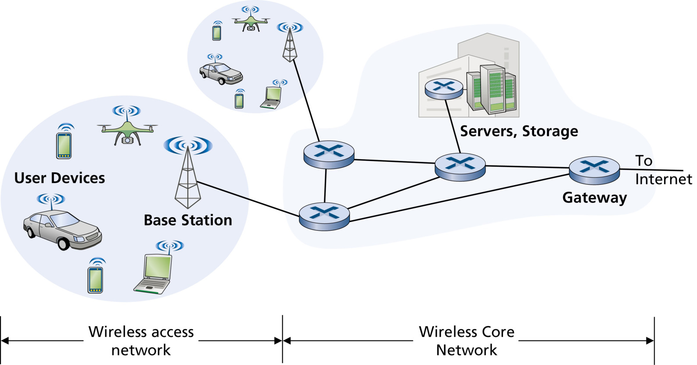

### 两种工作模式：基础设施模式与自组织模式

附着于基站的设备通常工作在 **基础设施模式（infrastructure mode）**：传统网络服务（地址分配、身份与访问权限、路由）由设备经基站连入的网络基础设施提供。与之相对，**自组织网络（ad hoc network）** 中没有任何基础设施可连，设备必须 **自行组织**，自己提供路由、地址分配、名字解析等服务。WiFi 两种模式都支持（本书默认基础设施模式）；蓝牙是典型的纯自组织网络；WiFi ad hoc 与传感器自组网构成了 **网状网络（mesh network）** 的雏形。

### 无线网络分类

按「每跳是否有基站/是否多跳」可把无线网络分为三类：

- **单跳 + 有基础设施**：WiFi（设备 → AP）、蜂窝（设备 → 基站）。最常见。
- **单跳 + 无基础设施**：蓝牙（微微网内设备间直接通信）。
- **多跳 + 无基础设施**：**网状网络（mesh）**——设备互为中继，把分组逐跳转发到更远的目的地。

设备在不同基站间移动并改变附着点，称为 **切换（handoff / handover）**。移动性带来一连串问题：如何在网络中定位移动设备？设备可能处于多个位置之一，如何编址？设备在 TCP 连接或语音通话期间移动，如何保证连接不中断？这些问题在 7.5 节解答。

---

## 7.2 无线物理层

前六章几乎不需要深究物理层；但无线网络恰恰相反——无线信道的 **复杂、时变、容量受限、共享** 特性决定了上层几乎所有设计。本节自底向上讲清无线信道，**408 补充**：奈氏准则与香农定理已在物理层复习中掌握，这里重点是把这些理论放到「无线信道」的真实场景下理解。

### 无线信道的特性

**电磁波三要素：幅度、频率、相位。** 发送端的时变电流产生电磁（无线电）波，接收天线感应出电流。把信息编入电磁信号的方式就是 **调制（modulation）**——改变波的幅度、频率或相位。

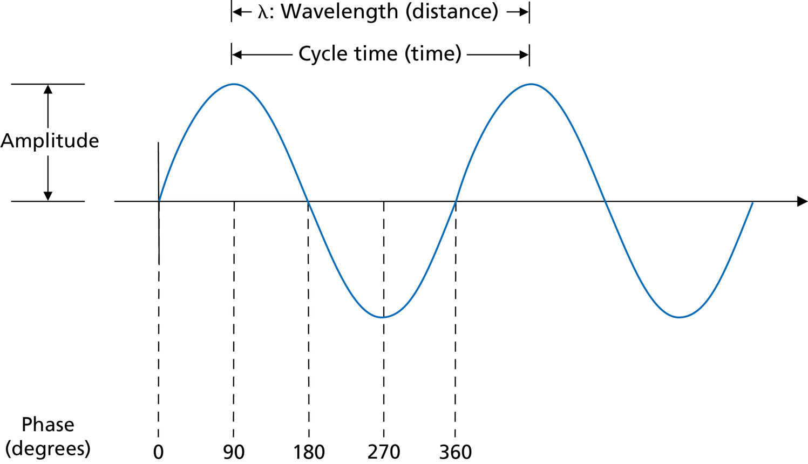

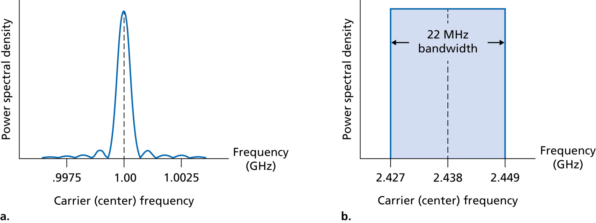

**功率、带宽与噪声。** 理想波只有一个频率；实际发射机的功率分布在多个频率上，由 **功率谱密度（power spectral density）** 刻画（图 7.3(a)），通常以 **载波频率（carrier frequency）** 为中心。由此严格定义无线物理层的 **带宽（bandwidth）**：信号占用的 **频带宽度**（单位 Hz）——这与网络其他地方把「带宽」当作链路速率（bit/s）的用法完全不同，务必区分。

噪声来源主要有三：**干扰发射机**（免许可频段里婴儿监视器、车库门、微波炉，以及别人的 WiFi——「一个人的网络传输是另一个人的噪声」）、**电磁辐射体**（电机、微波炉）、**热噪声与电子噪声**。信号功率与噪声功率之比称为 **信噪比（SNR，Signal-to-Noise Ratio）**，通常以 dB 计：0 dB 意味着信号与噪声等强。WiFi 可接受的最小 SNR 约 25 dB，LTE 约 -5 至 5 dB（取决于调制方式）。

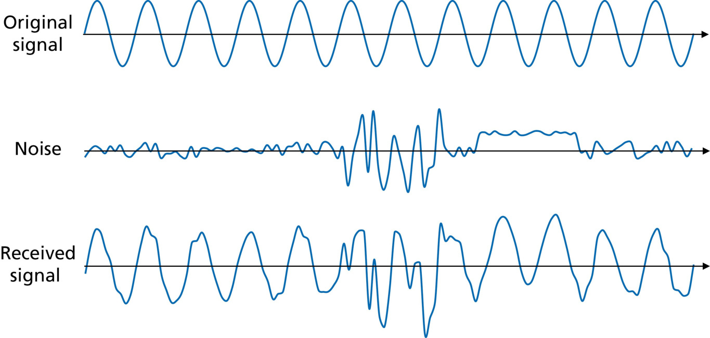

!!! info "定义：信噪比与香农容量定理"

    **英文原文（权威定义）：**

    > Shannon's theorem relates communication channel capacity, C — the maximum possible rate at which data can be transmitted (measured in bits per second), error-free, over the channel — to the channel's bandwidth (B), and received signal and noise powers.

    **中文解释：** 对带宽为 B（Hz）、接收信噪比为 SNR 的信道，**香农容量定理** 给出无差错传输速率的理论上限：

    $$ C = B \log_2(1 + \text{SNR}) $$

    两个重要推论：① **容量随带宽线性增长**——信道带宽越大，潜在每秒比特数越高；② **高 SNR 下再提高 SNR 收益甚微**——容量只随 SNR 对数（亚线性）增长。注意香农容量是 **上限**：再巧妙的编码调制也无法超过 C。

**路径损耗（path loss / attenuation）**：信号随传播距离衰减。自由空间（视距）下，接收功率与距离的平方成反比（**平方反比律**）：

$$ \frac{P_t}{P_r} \propto \left(\frac{d}{f}\right)^2 $$

其中 P_t、P_r 为发射/接收功率，d 为距离，f 为频率。路径损耗指数（path loss exponent）：自由空间为 2；户外城区常见 3-4；建筑物内可达 4 以上——因此室内路径损耗更严重。

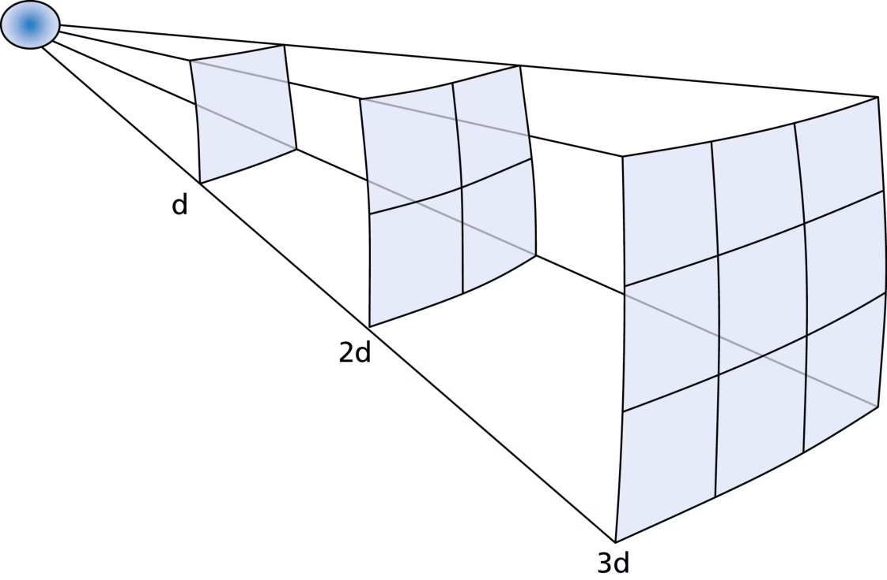

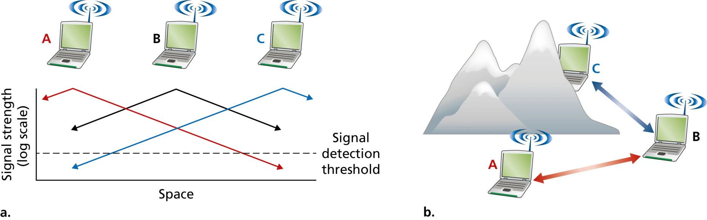

**隐藏站问题（hidden terminal problem）**：图 7.6(a) 中 A 与 B 互相听得到（接收功率高于检测阈值），B 与 C 也互相听得到，但 A 与 C 因路径损耗彼此听不到——A 与 C 互为 **隐藏站**。若 A 和 C 都想向 B 发送，它们各自监听信道都听不到对方，于是同时发送，**在 B 处相互干扰**。这正是无线多路访问协议设计的关键难题（7.3.1 的 RTS/CTS 正是为它而生）。

**多径传播（multipath）**：发送信号除直射路径外，还会被建筑物等物体反射，反射波走更长的路程、**稍晚到达**（图 7.7(b) 的红、紫脉冲），使接收端把同一时刻发送的信号在时间上摊开。多径使接收端重构原信号更加困难。

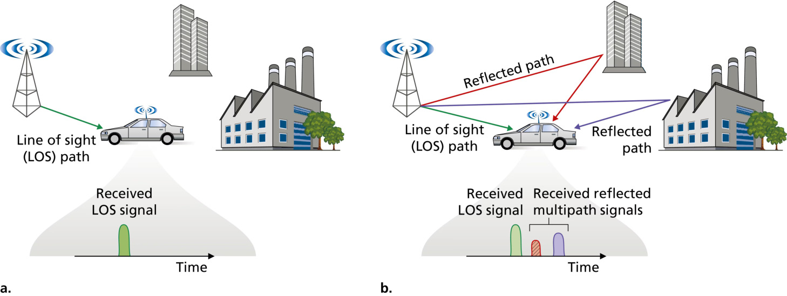

多径还限制发送方改变信号的最高速率：发送方必须让直射脉冲及其多径反射都在下一个直射脉冲到达前被接收完毕，否则脉冲会在接收端混叠。这个由接收端决定的、信号两次变化之间的最短时间称为 **相干时间（coherence time）**。

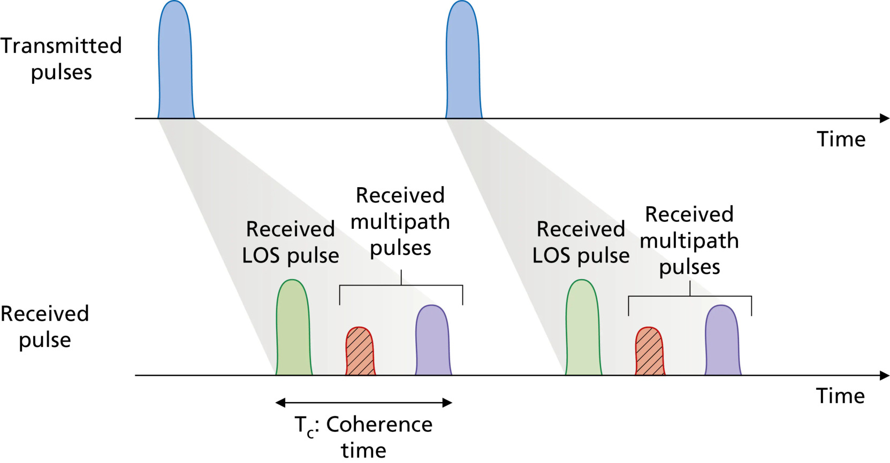

**MIMO（Multiple-Input and Multiple-Output）**：发射端与接收端都使用多根天线。两种利用方式：**空间分集（spatial diversity）**——发送冗余信息流，利用不同路径经历不同衰落的特点合并信号，对抗多径衰落；**空间复用（spatial multiplexing）**——多条独立信息流沿不同路径并行发送，成倍提升吞吐量。

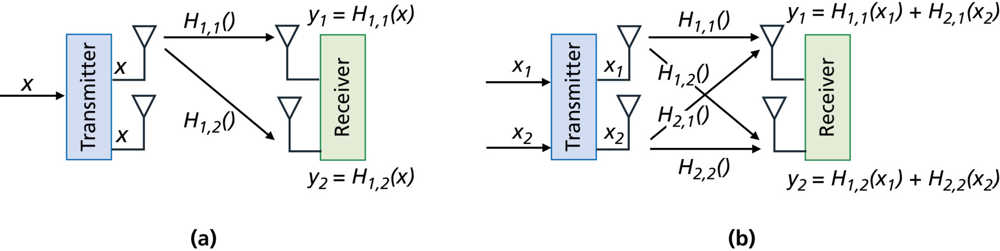

**波束成形（beamforming）**：用天线阵列调整各天线信号的相位与幅度，使期望方向 **相长干涉**、其他方向 **相消干涉**，形成定向「波束」。收益：增强目标用户信号强度、减少对其他用户的干扰、扩大覆盖、提升容量。**多用户 MIMO（MU-MIMO / Massive MIMO）** 用不同天线子集同时服务多个设备，再叠加波束成形——现代 5G 基站天线阵列可含上百个波束成形发射单元。

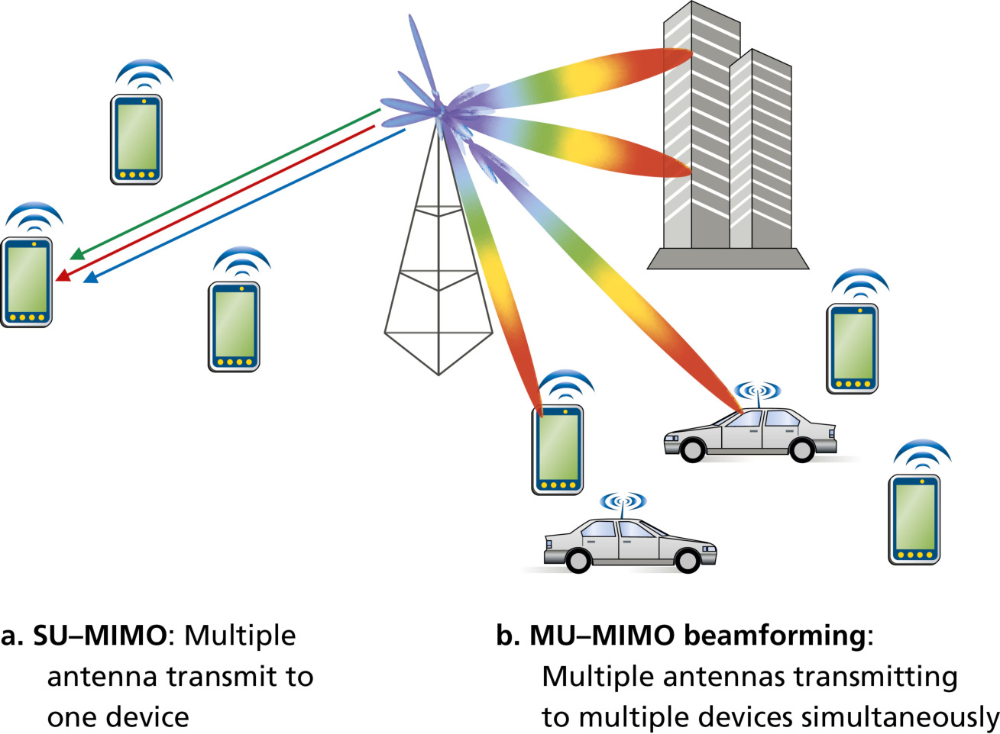

**无线电频谱**：从约 3 kHz 到 300 GHz 的电磁频谱被视为国家资产，由各国政府管制（联合国 ITU 做协调）。两大使用类别：

- **许可频谱（licensed spectrum）**：必须取得政府执照才能发射，商用蜂窝网络即在此频段（频谱拍卖已为多国带来数百亿美元收入）；CBRS 等共享方案允许非持牌设备在特定规则下使用持牌频谱。
- **免许可频谱（unlicensed spectrum）**：无需执照即可使用（车库门、婴儿监视器、微波炉、WiFi），但必须遵守功率限制等规则；大量无协调设备共用导致相互干扰不可避免——无线网络在免许可频段的一切设计（CSMA/CA、跳频）都是在「避免、缓解、应对」这种干扰。WiFi 使用 2.4 GHz、5 GHz 与 6 GHz 免许可频段；蜂窝网络使用低频段（600-700 MHz，覆盖远但速率低）、中频段（2.5-4 GHz，「甜点区」）、高频段（毫米波 28-39 GHz，距离短但速率极高）。

### 编码与调制：从比特到符号再到波形

物理层发射/接收的流程如图 7.11：链路层数据比特 → **编码**（加入冗余、重排）→ **调制**（映射为符号、生成波形）→ 无线信道传播 → 接收端解调、解码还原比特。

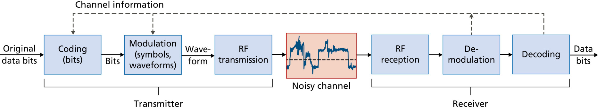

**编码（coding）**：对原始比特加入冗余副本，防信道噪声破坏（如 8 个原始比特扩展为 24 个再打乱重排，即使出现连续 3 bit 突发差错仍可恢复）；编码冗余是链路层 CRC 之外的 **额外** 保护。

**调制（modulation）**：把编码后的比特映射为载波波形。三种基本方式（图 7.12）：

- **幅度调制 / ASK（Amplitude Shift Keying）**：用多个离散幅度值表示比特。
- **频率调制 / FSK（Frequency Shift Keying）**：用不同频率表示比特。
- **相位调制 / PSK（Phase Shift Keying）**：用不同相位表示比特（如 0° 编 0、180° 编 1）。

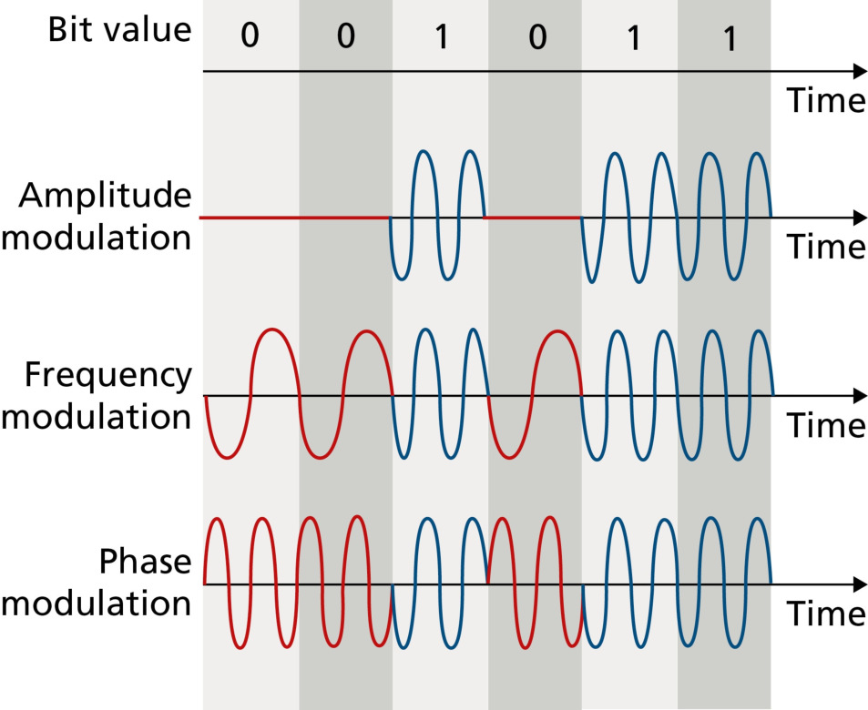

**QPSK（Quadrature Phase Shift Keying）**：每两个比特合为一个 **符号（symbol）**（00、01、10、11），用 4 个相差 90° 的相位表示——每个符号携带 **2 bit**，符号速率只有比特速率的一半。符号的相位与幅度可用 **星座图（constellation diagram）** 直观刻画。

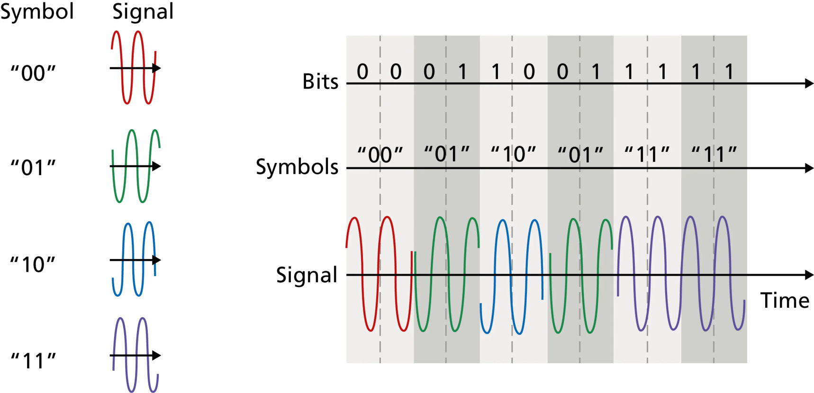

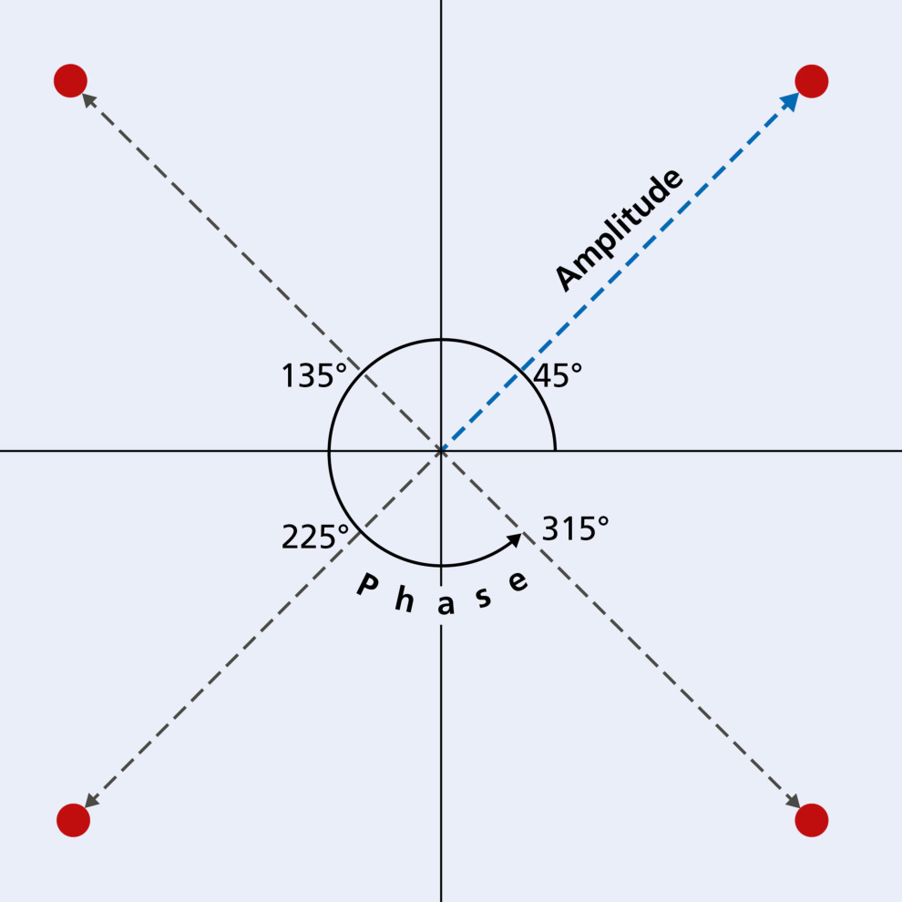

**QAM（Quadrature Amplitude Modulation）**：同时调制 **相位与幅度**。4-QAM 即 QPSK（每符号 2 bit），16-QAM 每符号 4 bit，64-QAM 每符号 6 bit——更高阶 QAM 每符号携带更多比特，但星座点更密集，对噪声更敏感、误码率更高。

**自适应调制（adaptive modulation）**：目标是把误码率（BER）维持在阈值以下、同时尽量提高比特率——于是根据当前 SNR **动态选择调制方式**：SNR 低时用 4-QAM，中等用 16-QAM，高时用 64-QAM（图 7.17）。收发双方需协调测量并报告 SNR/BER。这就是 4G/5G 与 WiFi 中链路自适应（adaptive modulation and coding）的原理。

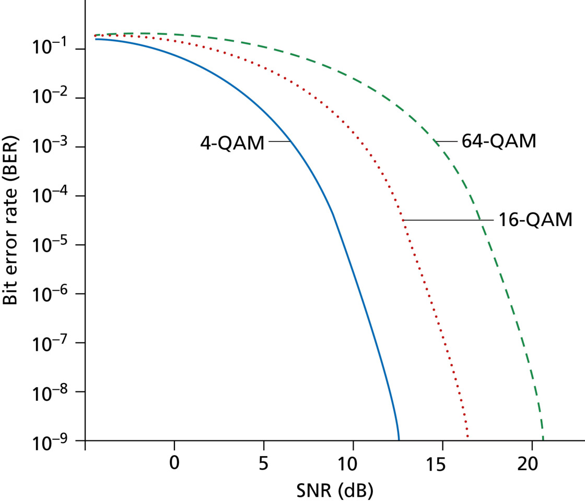

---

## 7.3 无线接入网

**核心概念②：802.11 WiFi 与 CSMA/CA** —— WiFi（IEEE 802.11）是无处不在的无线局域网；它用 **载波监听多路访问/冲突避免（CSMA/CA）** 共享无线信道——把有线以太网 CSMA/CD 的「冲突检测」换成「冲突避免」，配合链路层确认、DIFS/SIFS 帧间间隔与 RTS/CTS 预约，构成了 408 最常考的无线知识点。

本节研究无线接入网的原理与实践：7.3.1 讲无线信道共享（OFDMA 与 CSMA/CA），7.3.2 讲 802.11 WiFi（★408 重点），7.3.3 讲 5G 无线接入网，7.3.4-7.3.6 讲发现与附着、调度与节能。

### 共享无线信道

回顾第六章学过的多路访问三大类技术：**信道划分**（TDM/FDM）、**随机访问**（Aloha、CSMA）、**轮转**（轮询）。这三类在无线网络中都被使用，并针对无线信道做了专门改造。本节重点讲两种无线专用方案：**OFDMA**（5G 与 WiFi 6）与 **CSMA/CA**（历代 WiFi）。

#### 信道划分：从 FDM 到 OFDM 再到 OFDMA

**OFDM（Orthogonal Frequency Division Multiplexing）**：宽带信道在实现上有困难（不同频率处损伤不同），且单个设备用不到全部带宽，故把频带划分为多个窄带子信道（图 7.18(b)，子信道间有 **保护带 guard band** 防止相互干扰）。**OFDM 让子信道载波正交，重叠信号相互抵消**，从而省去保护带、提高频谱效率（图 7.18(c) 功率谱密度曲线下面积更大）。

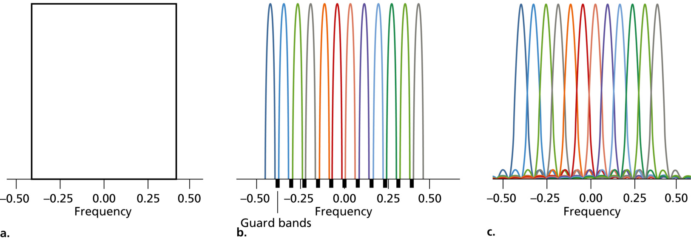

**OFDMA（Orthogonal Frequency Division Multiple Access）** = FDM + TDM：每个频率子信道再划分为时间微时隙。**资源元素（RE，Resource Element）** = 一个子信道频率上的一个时间微时隙，是可发送 **一个符号** 的最小信道资源单位；相邻的 RE（频率与时间上）组成 **资源块（RB，Resource Block）**（蜂窝）或 **资源单元（RU，Resource Unit）**（WiFi），同一组内符号使用相同调制与功率。基站/设备在若干 RB/RU 中发送数据。

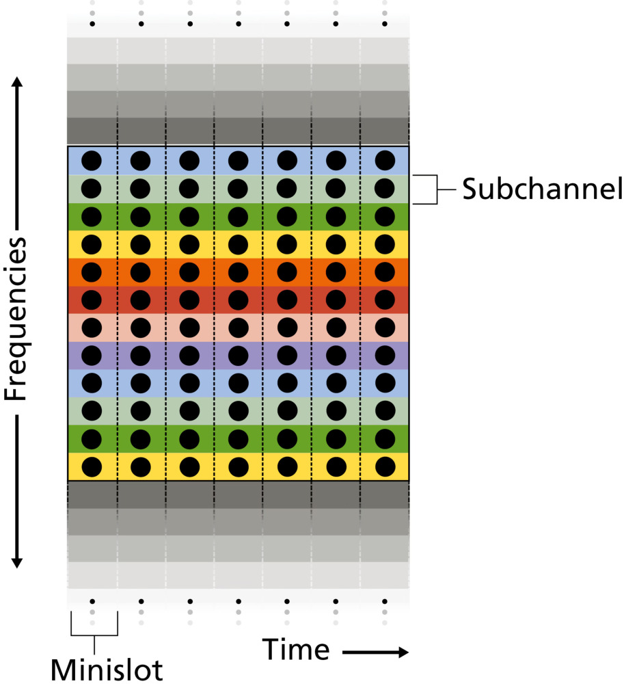

**CDMA（码分多址）简述（408 补充，王道 3.5）**：所有用户 **同时、同频** 发送，每个用户被分配一个 **码片序列（chip sequence）**，多个用户的信号在信道中叠加；接收方用目标用户的码片序列做 **规格化内积**，即可从叠加信号中解出该用户发送的比特（1 或 0）。各码片序列必须两两 **正交**（规格化内积为 0）。CDMA 属于信道划分类协议，**不会发生冲突**——408 常考「给定码片序列，计算某站发送的比特」。

#### 随机访问：CSMA/CA

无线环境无法照搬有线以太网的 CSMA/CD，原因有二（**高频考点**，408 常以简答/选择考查）：

1. **无法实现冲突检测**：接收信号的强度通常远小于发射信号强度，无线适配器难以「边发送边听」自己的发送；一旦开始发送一个帧，就会 **完整发送该帧**——冲突时整帧（尤其是长帧）被浪费。
2. **隐藏站问题**：并非所有站都能听见对方（但能产生冲突），冲突检测机制检测不到全部冲突。

为此 802.11 把「冲突检测」改为 **冲突避免（Collision Avoidance）**——「避免」并非完全不冲突，而是 **尽量降低冲突概率**。同时由于无线信道质量远不如有线，802.11 使用 **链路层确认/重传（ARQ）**：每发完一帧，须收到确认帧才能继续（停-等式的可靠传输，2011 考过）。

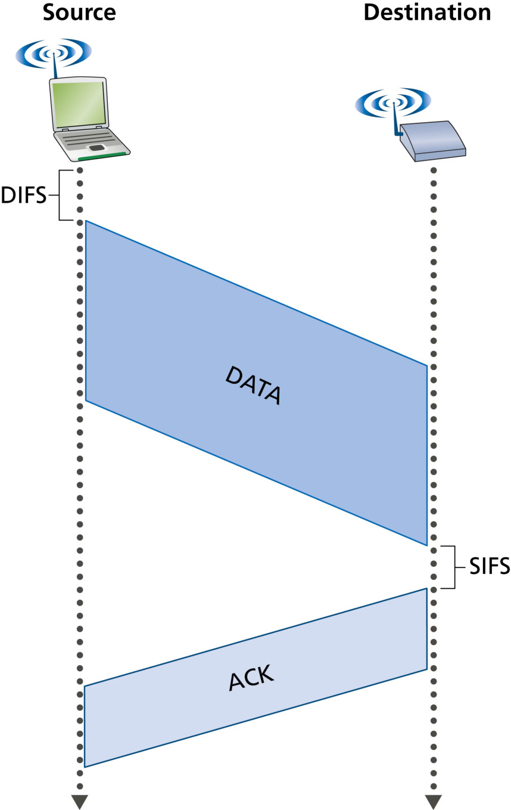

**帧间间隔（IFS，InterFrame Space）**（2020#37 考过「哪种最长」）：所有站检测到信道空闲后，还必须等待一段很短的时间（继续监听）才能发送，时长取决于帧的类型：

| 帧间间隔 | 长短 | 用途 |
|:---|:---|:---|
| **SIFS（短 IFS）** | 最短 | 分隔一次对话的各帧：ACK 帧、CTS 帧、分片数据帧、回答 AP 探询的帧 |
| **PIFS（点协调 IFS）** | 中等 | PCF 方式（AP 集中控制、轮询）中使用 |
| **DIFS（分布式协调 IFS）** | 最长 | DCF 方式（分布式协调，默认方式）下发送数据帧与管理帧 |

**CSMA/CA 完整流程**（设某站有帧要发）：

1. 若站 **最初** 检测到信道空闲（且是第一次发送，非重传），等待 **DIFS** 后直接发送整个数据帧。
2. 否则执行 **退避算法**：随机选一个退避值（二进制指数退避，范围 [0, 2^k - 1] 个时隙，第 k 次退避；WiFi 最大 255，小于以太网的 1023），信道空闲时倒计时，信道忙时 **冻结** 计数器。
3. 计数器减到 0（此时信道必然空闲）时发送整个帧，然后等待确认。
4. 收到 ACK 即发送成功；若还要发下一帧，从步骤 2 重新开始退避；若在超时时间内未收到 ACK，重传该帧，退避区间增大；多次失败后放弃。

**虚拟载波监听与 NAV**：源站把它将占用信道的 **持续时间**（含目的站发回 ACK 的时间）通知所有其他站，其他站在该时段内停止发送——「虚拟载波监听」意味着其他站 **并未实际监听信道**，而是因收到通知才不发送。这个「信道忙的持续时间」称为 **网络分配向量（NAV，Network Allocation Vector）**，写在 RTS、CTS 与数据帧的首部。

**处理隐藏站问题：RTS 与 CTS**（2018#35：CSMA/CA 的信道预约方法）：

1. 源站监听信道，空闲则等待 **DIFS** 后广播 **RTS（Request To Send）** 控制帧，内含源地址、目的地址与本次通信所需持续时间（= SIFS + CTS + SIFS + 数据帧 + SIFS + ACK）。
2. AP 正确收到 RTS 且信道空闲，则广播 **CTS（Clear To Send）** 帧，其持续时间 = SIFS + 数据帧 + SIFS + ACK。CTS 有两个目的：给源站明确的发送许可；指示其他站（包括 **听不到 RTS 的隐藏站**，但能听到 AP 的 CTS）在预约期内不要发送——这些站据此设置自己的 NAV。
3. 源站收到 CTS 后，等待 **SIFS** 即可发送数据帧。
4. AP 正确收到数据后，等待 **SIFS** 发送 ACK。

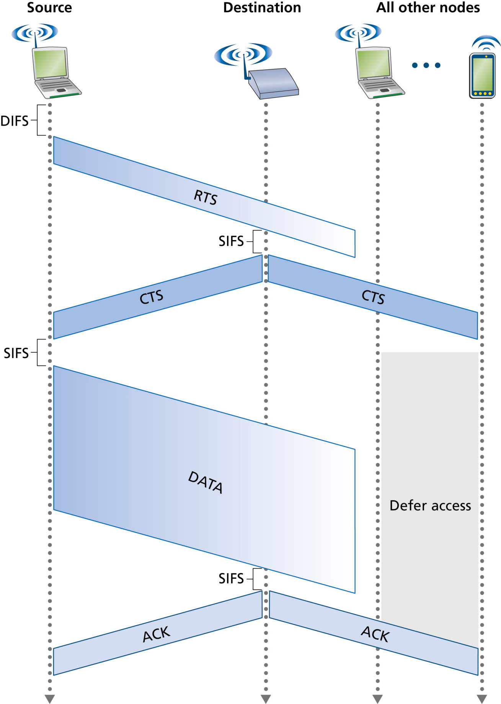

RTS/CTS 的收益：① 长数据帧只在信道被预约成功后传输，缓解隐藏站问题；② RTS/CTS 很短，即使冲突也只浪费短帧时间，其后的 DATA 与 ACK 通常无冲突。代价：引入额外时延、消耗信道资源——所以 **RTS/CTS 只用于长数据帧**，且不是强制规定（普通模式不做信道预约）。

### WiFi：802.11 无线局域网

**WiFi 体系结构**：802.11 无线局域网（即 WiFi，WiFi 联盟的品牌名）的基本构件是 **基本服务集（BSS，Basic Service Set）**：包含两个或更多无线节点，其中一个是中心基站 **接入点（AP）**。AP 经互连设备（交换机/路由器）接入因特网；典型家庭网络常把 AP、二层交换机、三层路由器集成在一个物理盒子里（本书按 802.11 标准视 AP 为 **纯二层设备**，设备只能与 AP 通信，**设备之间不能直接通信**）。

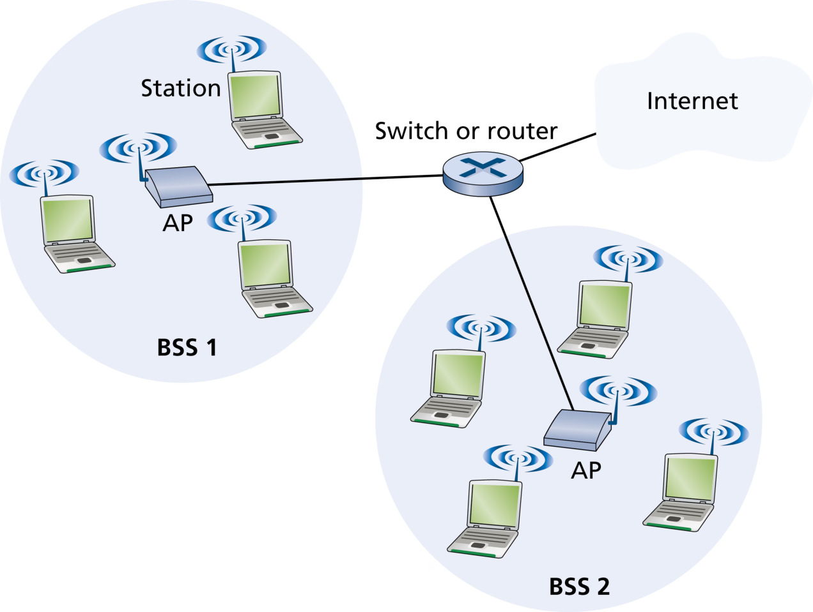

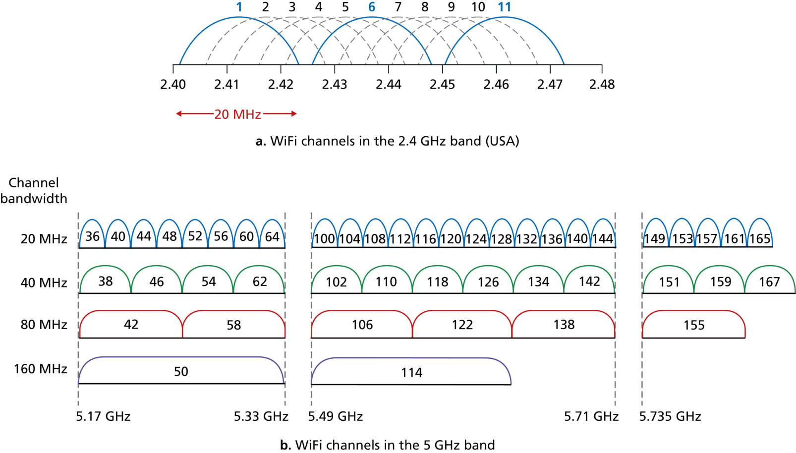

**SSID 与关联（association）**：每个 BSS 通过 **服务集标识（SSID，Service Set Identifier）** 命名（如校园网、家庭 WiFi 名）。设备加入 BSS 的过程称为 **关联**：设备扫描可用网络（7.3.4）→ 发送关联请求帧 → AP 回复关联响应帧；随后设备经 DHCP 获得子网内 IP 地址，对外界而言它只是该子网中又一个 IP 设备。多个 BSS 若使用同一 SSID 且同属一个子网，就构成 **扩展服务集（ESS）**——设备在 ESS 内的移动对网络层透明（7.5.2）。

**信道与频率（图 7.23）**：WiFi 把 2.4 GHz 与 5 GHz 频段划分为信道，每个信道有唯一编号。2.4 GHz 频段定义部分重叠的 **20 MHz 宽** 信道：两个信道相隔 4 个及以上才不重叠；**信道 1、6、11 是仅有的三对互不重叠信道**——三个 AP 分别用 1/6/11 可在同一空间并行而不干扰。5 GHz 频段信道更多、更不易拥挤；WiFi 6 还支持 6 GHz 频段。更高信道带宽通过 **信道绑定（channel bonding）** 把相邻信道合并实现。

**802.11 MAC 链路层（图 7.25）**：无线设备实现全部五层；AP 是纯二层设备——一侧用 WiFi 与用户设备通信，另一侧用以太网与三层路由器通信。每个 MAC 有 **数据平面**（承载链路层帧）与 **控制平面**（RTS/CTS、ACK/NAK、信标、功率控制）。

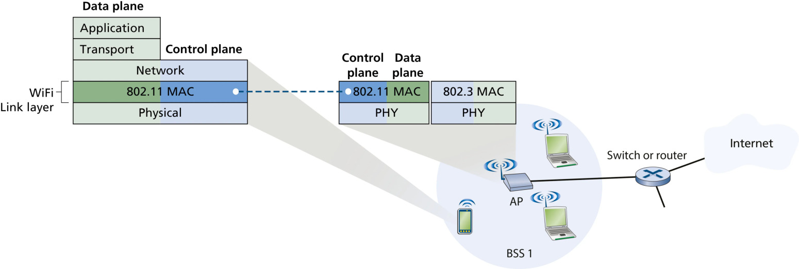

**CSMA/CA、OFDM、OFDMA 如何共存（WiFi 6）**（**高频考点**，考频 5 次：2017#35、2020#37、2018#35、2011#36、2024#36）：AP 必须同时支持旧设备（OFDM + CSMA/CA）与新设备（OFDMA）。解决方案是把 802.11 的基本 RTS/CTS 扩展为 **多用户 RTS（MU-RTS）**：AP 下行要发起 OFDMA 多用户传输时，用 OFDM 广播 MU-RTS（含各设备的 RU 分配与信道占用时长），所有设备都收到；纯 OFDM 设备按老规矩回 CTS，OFDMA 设备在分配给自己的频段上回 CTS——预约成功后 AP 即可用 OFDMA 并行下发各 RU。

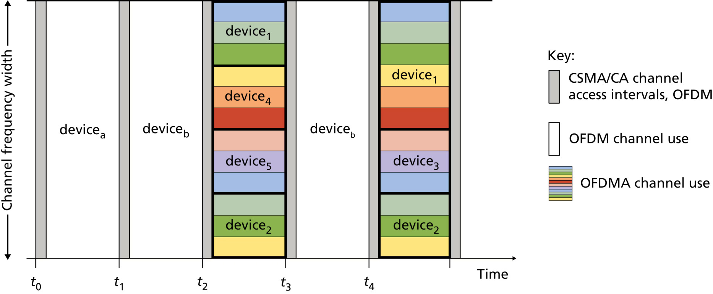

**802.11 帧格式（★必考，三地址）**：帧的核心是载荷（通常为 IP 数据报、MAC 控制帧或 ARP 分组）+ CRC 检错（无线误码率高，CRC 尤其重要）。与以太网帧最大的区别是 **四个地址字段**（各可容纳一个 MAC 地址）。为什么需要四个？——把网络层数据报从无线站点经 AP 搬到路由器接口，**需要三个地址**；第四个地址用于 ad hoc 模式下设备互转发（基础设施模式下不用）。三地址的含义（图 7.27 场景）：

- **地址 1（接收方）**：本帧的无线接收设备的 MAC 地址。非 AP 设备发送时 = 目的 AP 的 MAC；AP 发送时 = 目的无线设备的 MAC。
- **地址 2（发送方）**：本帧的无线发送设备的 MAC 地址。非 AP 设备发送时 = 该设备的 MAC；AP 发送时 = AP 的 MAC。
- **地址 3（用于与有线网互联）**：AP 据此构造以太网帧的源/目的 MAC——**即路由器的接口 MAC 地址（BSS 的「上联」地址）**。

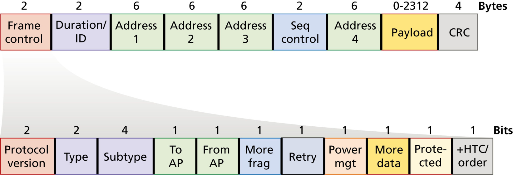

**三地址用法实例**（图 7.27，路由器 R1 → AP → 无线设备 H1 的下行方向）：路由器按普通以太网方式用 ARP 得到 H1 的 MAC，封装以太网帧（源=R1 接口 MAC，目的=H1 MAC）发给 AP；AP 把以太网帧转换为 802.11 帧：**地址 1 = H1 的 MAC（接收方）**、**地址 2 = AP 自己的 MAC（发送方）**、**地址 3 = R1 接口的 MAC**——H1 从地址 3 得知是谁把数据报送进子网的。上行方向（H1 → AP → R1）：地址 1 = AP 的 MAC、地址 2 = H1 的 MAC、地址 3 = R1 接口的 MAC——AP 据此构造以太网帧的 **目的 MAC = R1 接口 MAC**。**地址 3 在 BSS 与有线 LAN 互联中起关键作用。**

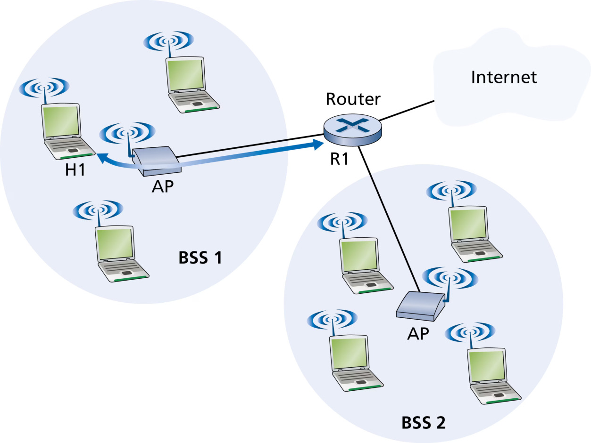

**其余字段**：**序号字段（sequence number）** 让接收方区分新帧与重传帧（与传输层序号同理）；**持续时间字段（duration）** 以微秒计，写入数据帧与 RTS/CTS，用于虚拟载波监听（NAV）；**帧控制字段（frame control）** 含类型/子类型（区分 RTS、CTS、ACK 等控制帧与数据帧）、**功率管理位（power management bit）**（设备睡眠时置 1，见 7.3.6）。

**802.11 演进（表 7.2）**：

| 标准 | 年份 | WiFi 代 | 频段（GHz） | 理论最大速率 | 物理层技术 |
|:---|:---|:---|:---|:---|:---|
| 802.11 | 1999 | — | 2.4 | 2 Mbps | 直接序列扩频（DSSS） |
| 802.11a | 1999 | — | 5 | 54 Mbps | OFDM |
| 802.11b | 1999 | — | 2.4 | 11 Mbps | DSSS |
| 802.11g | 2003 | — | 2.4 | 54 Mbps | OFDM |
| 802.11n | 2009 | WiFi 4 | 2.4 / 5 | 600 Mbps | OFDM + MIMO |
| 802.11ac | 2013 | WiFi 5 | 5 | 约 6.9 Gbps | OFDM + MIMO（信道绑定、MU-MIMO） |
| 802.11ax | 2020 | WiFi 6 | 2.4 / 5 / 6 | 约 9.6 Gbps | OFDM + OFDMA + MIMO（密集部署、TWT 节能） |
| 802.11be | 2024 | WiFi 7 | 2.4 / 5 / 6 | 数十 Gbps | OFDM + OFDMA + MIMO |

三个演进趋势：**频率** 从拥挤的 2.4 GHz 扩展到 5 GHz 再到 6 GHz（及 802.11ah 的 sub-1GHz、802.11ad/ay 的毫米波）；**带宽** 信道带宽不断增大（20 → 40 → 80 → 160 MHz，靠信道绑定）；**物理层** 从扩频 → OFDM → OFDMA（与蜂窝一致）。现代 WiFi 的驱动力从「单用户最大吞吐」转向 **密集部署下高效支持大量并发用户**。

### 5G 无线接入网

**5G 网络全景（图 7.28）**：蜂窝网络由边缘与核心两大部件构成。**无线接入网（RAN）** 位于边缘：用户设备（UE）+ 无线信道（New Radio，NR）+ 基站（gNB）。RAN 是蜂窝版的 WLAN——包含用户与网络间的第一跳无线链路。**5G 核心网（5G Core）** 由链路、路由器、服务器与 **核心网功能（Core Network Functions）** 构成，提供接入授权、移动性支持等控制/管理服务（7.4 详述）；这些服务只要求「可通过 IP 到达」，可在基站附近的小型边缘云、或远处大型数据中心实现。应用代码也可跑在基站或核心的服务器上与设备通信，称为 **本地分流（local breakout）**——用户流量不离开蜂窝网络。

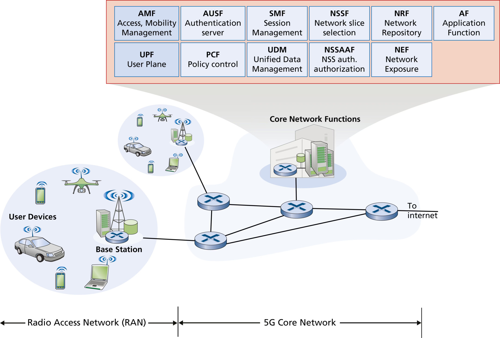

**OFDMA 资源与物理信道**：4G/5G RAN 都用 OFDMA 共享信道。4G 最小子信道带宽 15 kHz（一个符号约 67 μs）；5G 还定义了更大的子载波间隔（30/60/120 kHz）与更短的微时隙。**资源块（RB）** 是 4G/5G 中发射设备使用的最小信道资源单位：4G 中一个 RB 捆绑 12 个相邻子载波 × 7 个连续时间微时隙（图 7.29）；5G 有多种 RB 组合方式。标准信道带宽：4G 为 1.4-20 MHz，5G 最高可达 100 MHz 以上。**频带（band）** 是一个或多个信道的聚合，由 3GPP 定义、国家分配。

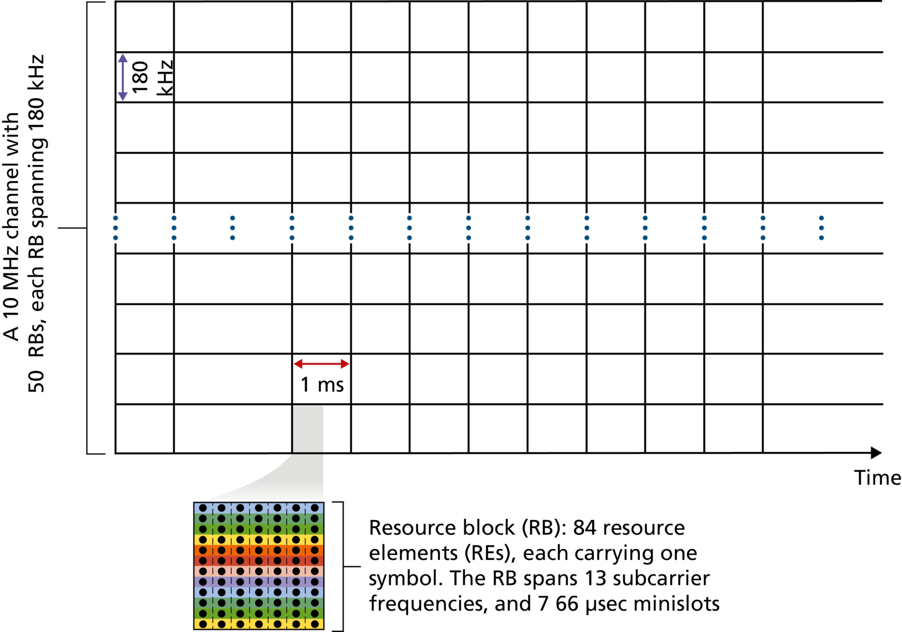

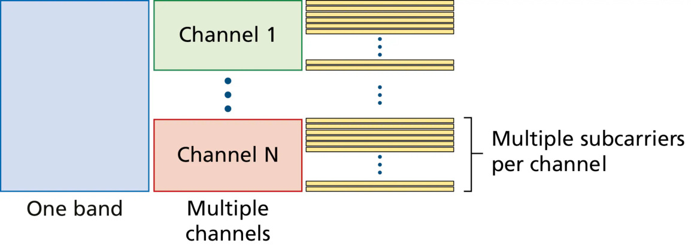

**上行/下行与双工**：**下行（downlink）** 从基站到设备，**上行（uplink）** 从设备到基站。蜂窝流量下行约占 5/6。运营商可分配上下行 OFDMA 时隙比例（**时分双工 TDD**）或按频率划分（**频分双工 FDD**）。RB 按用途分组为物理信道：下行 **PDSCH**（承载所有用户面数据与控制消息）、**PDCCH**（告知设备在哪些 RB 收/发）、**PBCH**（广播发现与入网所需信息）；上行 **PUSCH**（上行用户面数据）、**PRACH**（设备入网时用随机接入请求连接）、**PUCCH**（请求分配上行 RB、承载测量数据与链路层 ACK/NAK）。

**5G RAN 链路层协议栈（图 7.31）**：设备与基站的链路层都分用户面与控制面，包含多个子层：**RRC（Radio Resource Control，控制面）**——建立/维护/释放逻辑信道、管理连接状态与移动性、测量上报；**SDAP（用户面最高子层）**——分配 QoS Flow ID 并映射到无线资源；**PDCP**——IP 头压缩与（可选）加密、完整性校验；**RLC**——分段/重组与基于 ARQ 的可靠传输（序号 + CRC + ACK/NAK）；**MAC**——调度帧发送、把数据映射到 OFDMA 资源块。

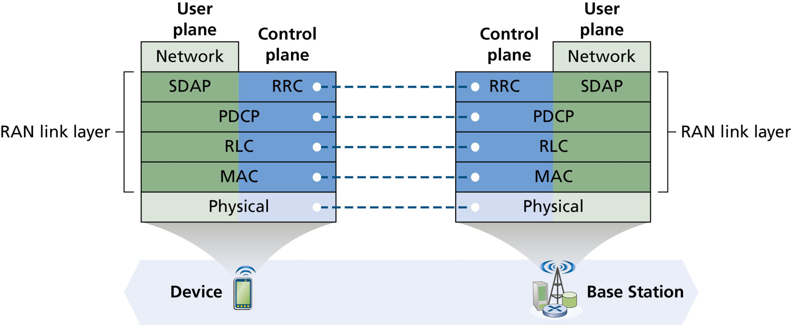

**基站分解（disaggregation，图 7.33）**：从 5G 起基站不再是一台厂商专有「盒子」，而分解为三个功能单元，经标准化接口互操作（类似 SDN 的动机：多厂商竞争、降低门槛）：**无线单元（RU）**、**分布式单元（DU）**、**集中单元（CU）**。O-RAN 联盟进一步标准化单元间接口。

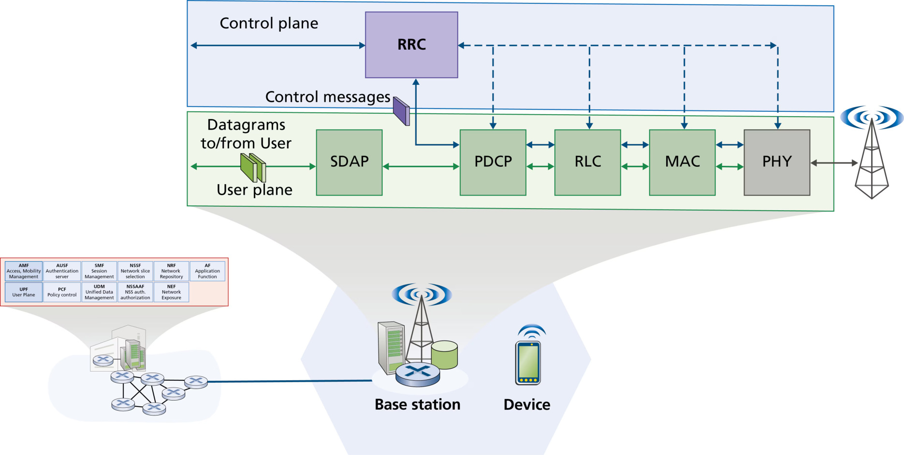

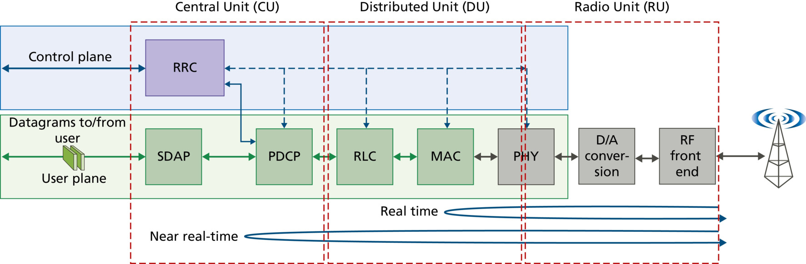

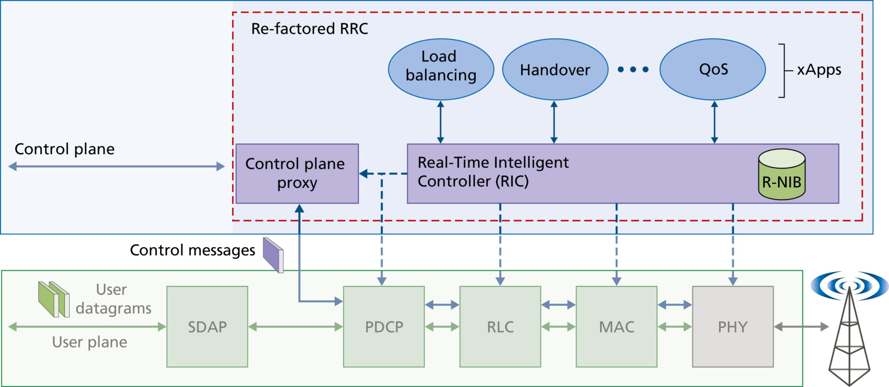

**SD-RAN（软件定义 RAN 控制面，图 7.34）**：RRC 控制面与用户面分离，可像 SDN 一样集中实现：**控制面代理** 实现 RAN 与核心控制面之间符合标准的接口；**实时智能控制器（RIC）** 含下层通信层、RAN 全网状态管理层（RAN 节点信息库 R-NIB）、应用层控制进程接口——控制进程（xApps）负责负载均衡、设备切换、QoS 等决策。

### 发现与附着

任何边缘网络（有线以太网、RAN、WiFi）都需要让设备 **发现网络基础设施的存在并加入**，这个过程称为 **网络关联（network association）**。

!!! info "定义：网络关联（Association）"

    **英文原文（权威定义）：**

    > The process by which a device detects the existence of network infrastructure and attaches to that network is known as network association.

    **中文解释：** **网络关联** 指设备发现接入网络的存在并「加入」该网络的过程。802.11 中设备通过关联请求/响应帧与 AP 建立关联；关联成功后设备再经 DHCP 获得 IP 地址。注意：关联 ≠ 认证——WPA 认证（第 8 章）通常在收到信标后、关联前后进行。

**信标（beacon）**：基站（蜂窝或 WiFi）周期性地发送 **信标消息**，通告接入网络的存在及其特性（网络名、传输能力、无线信道物理层参数）。想入网的设备在可能的信道上 **被动扫描（passive scanning）** 寻找信标。设备如何选择网络由自身决定（最近关联过的网络、有序列表、信号最强、或运营商 SIM 卡归属）。

**附着到 WiFi（图 7.35）**：扫描并选定 AP 后，设备发送 **关联请求帧（association request）**，AP 回复 **关联响应帧（association response）**。随后设备经 AP 发送 DHCP 发现报文以获得子网内 IP 地址。

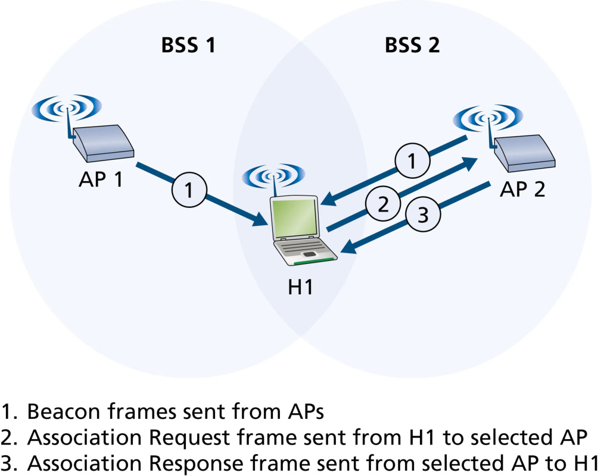

**附着到 5G（图 7.36）**：比 WiFi 复杂，多步完成：

1. **发现**：基站广播 **主同步信号（PSS）**（设备据此同步时钟）与 **辅同步信号（SSS）**（提供初始网络标识），PSS+SSS 定期在每个信道中心子载波广播；设备再获取 **主信息块（MIB）**（子载波间隔、小区是否开放入网）——PSS、SSS、MIB 合称 **同步信号块（SSB）**；随后接收若干 **系统信息块（SIB）**，其中 **SIB1** 含移动国家码（MCC）、移动网络码（MNC）、基站标识与可接受的最低接收电平。
2. **初次接入**：设备决定加入后，基站在上行 **随机接入信道（PRACH）** 上接收设备发送的 **RRC 连接建立请求**（类似 DHCP 发现），基站为其分配上行 RB 并回复建立响应。
3. 此后设备与基站能交换 RAN 控制消息，但 **尚未真正入网**：还没向网络标识/认证自己，也没有 IP 地址——完整的注册与 PDU 会话建立要到 7.4 节（核心网）与第 8 章（认证）。

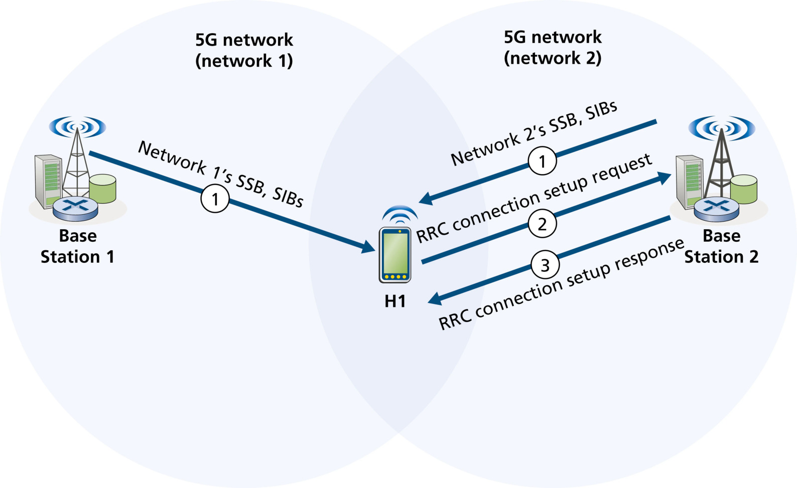

### 调度传输

MAC 层最重要的功能之一是 **调度（scheduling）**：决定下行方向基站向各设备、上行方向各设备在哪些资源块发送数据。有线网络中调度顺序几乎不影响聚合吞吐；**无线中截然不同**——基站向近处、视距清晰的设备可高速率发送（高阶调制），向远处、多径严重的设备只能低速率发送。因此 WLAN/RAN 的吞吐量 **取决于调度的对象**。调度算法不在标准中规定，是运营商拉开差距的「秘密武器」。四大考量：**信道质量感知**、**设备间公平性**、**业务类别优先级**（控制面 vs 用户面、实时 vs 非实时）、**QoS 感知**。

图 7.37 展示四种代表性调度算法（基站向 6 个下游设备发送队列中的帧，调度决策周期性进行，5G 中周期更短）：

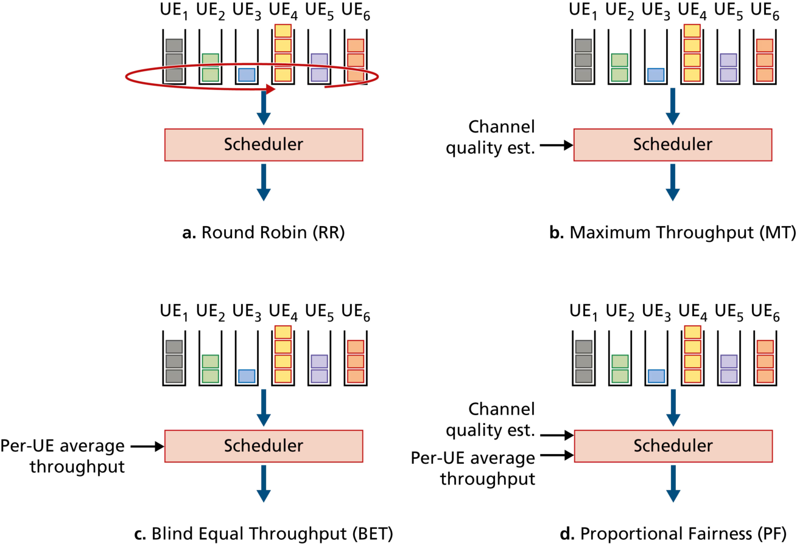

- **轮询（RR，Round Robin）**：给每设备分配相同数量的 RB。信道不感知、QoS 不感知；按轮次公平，但不一定按吞吐量公平（信道条件不同）。
- **最大吞吐量（MT，Maximum Throughput）**：把每个 RB 分配给对该 RB **信道质量最高**（如 CQI 报告最高）且有数据要发的设备。信道感知但 **不公平**——最坏情况一个好信道设备独占全部 RB。
- **盲等吞吐（BET，Blind Equal Throughput）**：维护每设备平均吞吐量的指数加权移动平均（EWMA），把 RB 分配给 **平均吞吐量最小** 的设备。显式追求吞吐量公平。
- **比例公平（PF，Proportional Fairness）**：把 RB 分配给使 **期望吞吐量 ÷ 平均吞吐量 最大** 的设备（分子鼓励高吞吐，分母照顾低吞吐设备）。兼顾性能与公平。

上行方向同样由基站调度：基站在控制信道（PDCCH/PUCCH）上告知设备可用的上行资源与时机。

### 节能考虑

电池是无线移动设备的宝贵资源。能量管理的基本思想：设备在 **睡眠与唤醒** 状态间交替——有活干时唤醒，没活干时睡眠（LTE 无线电发射/接收时能耗是关机状态的约 100 倍）。两大方案：

- **协调式睡眠/唤醒（coordinated sleep/wake）**：设备与基站通过协议协调睡眠/唤醒周期，双方都知道设备何时唤醒；基站把发给睡眠设备的数据报 **缓存**，待其唤醒时再发送。**WiFi 与蜂窝网络都采用**。
- **非协调的「唤醒即发」（uncoordinated wake-and-send）**：设备只在有数据要发时唤醒（如 IoT 传感器偶发读数），发完（可选等待下行回复）再睡。**蓝牙、LoRaWAN、NB-IoT 采用**。

**WiFi 节能（PSM，Power Save Mode）**：设备在帧首部的 **功率管理位** 置 1 表示即将睡眠；AP 缓存发给它的帧；设备唤醒后扫描 AP 信标帧中的 **流量指示图（TIM，Traffic Indication Map）**——标记哪些设备有缓存的帧；若没有，设备可继续睡；若有，设备发送轮询请求取回帧。WiFi 6 新增 **目标唤醒时间（TWT，Target Wake Time）**：设备可与 AP **协商睡眠时长**（最长可达数月甚至数年），非常适合偶发上报的 IoT 场景；802.11ah 专为 IoT 设计，继承节能机制并缩小帧头。

**5G 节能（DRX，Discontinuous Reception）**：连接态设备空闲时可进入 **非连续接收（DRX）轻睡眠**，分 **短 DRX 周期** 与 **长 DRX 周期** 两阶段（图 7.38）：设备接收传输后启动活动定时器；定时器到期且无活动 → 进入短 DRX 周期，每个周期结束唤醒检查有无待收/待发数据；持续无活动 → 进入长 DRX 周期（唤醒更少、更省电但时延更大）；基站在设备睡眠期间到达的数据报被缓存，设备唤醒后发现基站通告有数据，重新进入活动态接收。更长无活动后设备进入 **空闲（Idle）/非激活（Inactive）态**，恢复活动需更多步骤（7.5.3）。

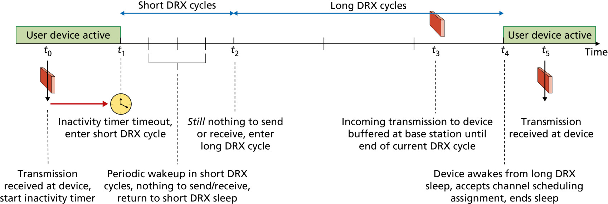

**LoRa 的唤醒即发（图 7.39）**：LoRa **Class A** 设备有数据就唤醒，直接向网关发送（不协调、甚至不知道网关在不在），可选等待下行数据，然后继续睡；网关有消息发给设备时必须等设备下次联系。

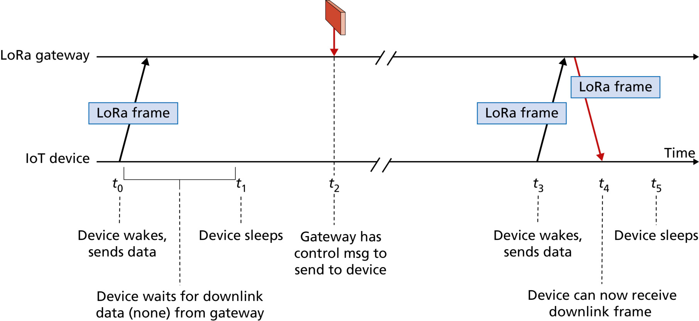

---

## 7.4 无线核心网

**核心概念③：5G 接入与核心网** —— 5G 网络 = RAN（边缘，无线接入）+ 5G 核心网（身份、移动性、计费等控制服务 + 数据面转发）。核心网采用 **服务化架构（SBA）**：把传统「盒子」式的网络实体重构为 **网络功能（NF）** 及其服务，实现 **控制面/用户面分离**，这是理解 5G 的关键钥匙。

WiFi 没有对应的「无线核心网」——企业把 WiFi 当作有线网络的另一种链路层技术，管理与控制沿用传统 IP 网络的机制。蜂窝核心网之所以如此重要，源于其电话网血统：SIM 卡身份、网内移动性、跨运营商漫游、计费结算等原生服务，传统 IP 因特网没有。

### 5G 核心网与网络功能

5G 核心网采用 **服务化架构（SBA，Service-Based Architecture）**，构件定义为网络功能（NF）及其提供的服务；NF 间可用请求/响应（HTTP）或订阅/通知（发布/订阅）方式交互。图 7.40 展示了关键网络功能：

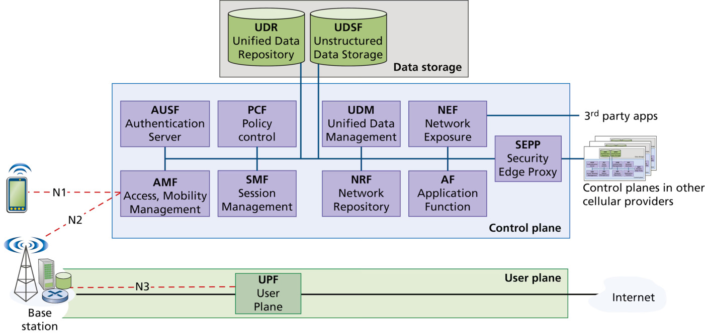

**「三大」核心网络功能：**

- **用户面功能（UPF，User Plane Function）**：数据面中 **唯一的网络功能**，负责 RAN 与外部因特网之间的数据转发。每个设备发给因特网的数据报（及反向）都经过其 UPF；UPF 结构上是 **隧道中继**（7.4.2），并充当设备的 **锚点**。
- **接入与移动性管理功能（AMF，Access and Mobility Management Function）**：控制面的核心 NF，负责授权并建立设备对网络服务的接入、管理设备移动性；与 **认证服务器功能（AUSF）** 协作完成设备认证；是 **唯一** 与基站/设备直接交换控制消息的 NF。
- **会话管理功能（SMF，Session Management Function）**：负责建立和管理设备的数据面（选择 UPF、建立隧道）。

**其他网络功能**：**UDM（统一数据管理）/ UDR（统一数据仓库）** 管理设备档案、服务与认证信息；**NEF/AF** 向本地分流应用开放网络数据与服务；**SEPP** 保障运营商间 NF 安全通信（如漫游认证）；**NRF（网络仓储功能）** 提供 NF 注册与自动发现；**PCF（策略控制功能）** 提供移动性管理、每设备 QoS 与漫游的控制策略；**NSSF（网络切片选择功能）** 是 **网络切片** 的核心。

**网络切片（network slicing）**：5G 的重要新概念——把 RAN 与核心资源 **虚拟化**，在同一物理网络上定义 **多个逻辑网络**（类似 6.5 节多个 VPN 共享同一物理网络）。不同切片可服务不同业务（如增强移动宽带 eMBB、海量机器通信 mMTC、超可靠低时延 URLLC），由 NSSF 负责切片选择。

### 用户面功能 UPF 与隧道

**隧道（tunneling）** 是 5G 数据面的关键机制：为每个设备在其基站与它的 UPF 实例之间建立一条隧道（图 7.41），把基站与 UPF 之间的回传网络（一海路由器和链路）抽象为一条 **虚拟链路**。

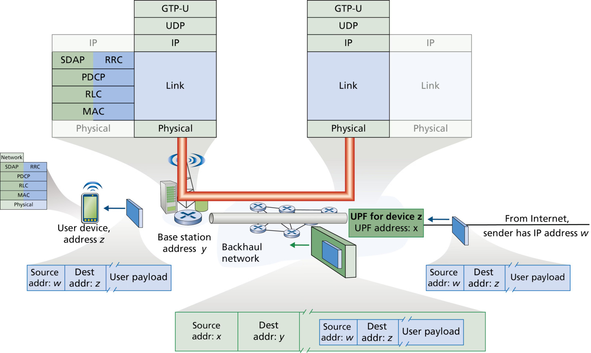

**隧道工作过程**：UPF 从外部因特网收到发给某设备的数据报后，用 **GTP（GPRS Tunneling Protocol）** 把它封装进 UDP 报文段，UDP 数据报再作为载荷装入新的 IP 数据报，经回传网络像普通 IP 数据报一样发给基站；基站解封装、取出原始 IP 数据报，经 RAN 发给设备。**为什么需要隧道？答案在移动性**：没有隧道，回传网络所有路由器都要维护「设备当前附着在哪个基站」的实时信息（成千上万设备！）；有了隧道，**只有隧道端点（UPF）需要知道设备附着在哪个基站**，回传路由器只需知道如何路由到各基站即可。UPF 因此在设备附着网络的整个期间充当其数据转发 **锚点**，无论设备实际附着在哪个基站。

### 用户身份、注册与会话建立

**身份：SIM 卡与 IMSI/SUPI**。设备须有物理 **SIM（Subscriber Identity Module）** 卡（或软件 eSIM）才能入网——SIM 卡是全球唯一的网络身份。SIM 存储的信息一般包括：

- **IMSI（International Mobile Subscriber Identity，国际移动用户识别码）**：由三部分构成——**移动国家码（MCC）** + **移动网络码（MNC）** 共同标识 **归属网络（home network）**（发卡并提供订阅套餐的运营商），**移动用户识别号（MSIN）** 在归属网络内唯一标识该 SIM。IMSI 之外，**SUPI（Subscription Permanent Identifier，订阅永久标识）** 是 5G 中的用户永久身份标识；为防窃听，空口上以加密的 **SUCI（Subscription Concealed Identifier）** 传输。
- 电话号码与可访问的服务集合；**密码学密钥与 PIN**（用于入网认证）；本地区域身份信息（当前与最近访问的网络列表）。

不在归属网络覆盖区时，设备可附着到另一运营商的网络，称为 **漫游（roaming）到被访网络（visited network）**；可用的服务集合取决于归属网络的订阅套餐与两网间的结算机制。

**注册（registration）与会话建立（PDU session establishment）**（图 7.42）：设备入网有两组关键动作。**注册**：设备向网络标识并认证自己（反之亦然）。**PDU 会话建立**：为设备分配 IP 地址、创建设备到 UPF 的数据面通路（PDU = Protocol Data Unit，即「分组」的术语）。此后设备才完全入网、可移动通信。

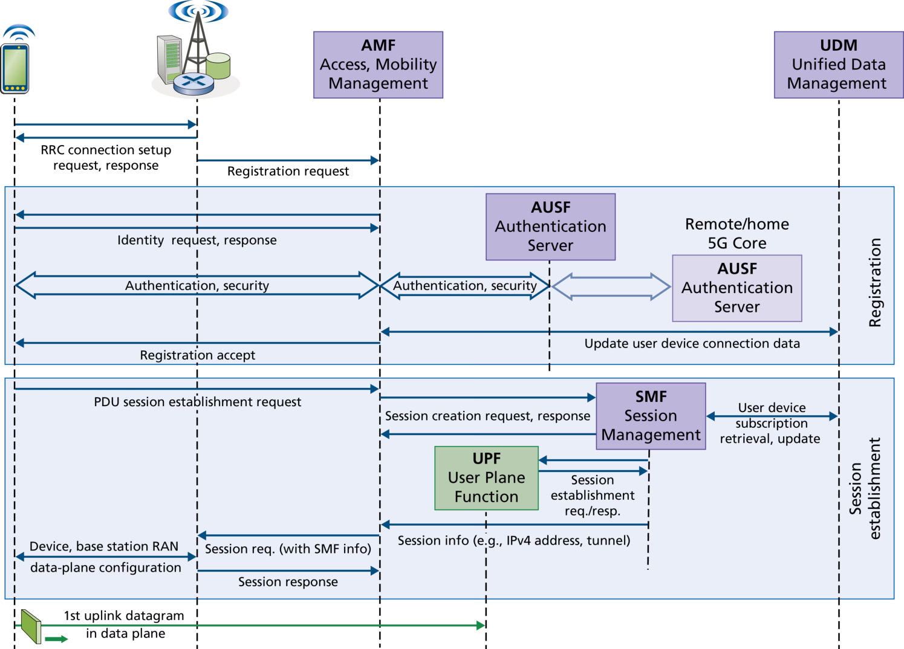

**注册流程**：设备与基站交换连接建立请求/响应建立 RAN 信令信道后，基站为设备选择一个 AMF 并发送注册请求；AMF 请求并获取设备身份信息，交给 **认证功能（AUSF）** 与设备做 **双向认证**（第 8 章详述；漫游时被访网的 AUSF 作为代理，由归属网的 AUSF 实际认证）；认证成功后 AMF 在本地 UDM 注册设备身份与订阅服务信息，向设备返回注册接受消息。

**PDU 会话建立流程**：设备向 AMF 发送 PDU 会话建立请求；AMF 选择 **SMF** 负责建立并管理设备数据面；SMF 经 UDM 验证会话参数许可后，选择 **UPF 实例** 并在设备的基站与 UPF 之间建立隧道；SMF 经 AMF 与基站把隧道、地址信息返回设备；最后基站与设备交互配置 RAN 数据面——至此设备可以发送数据报进入因特网！

**寻呼（paging）简述**：设备进入空闲/非激活态后，核心网可能不知道设备位于哪个 RAN。**跟踪区更新（tracking area update）** 让核心网知道设备的大致区域；**寻呼（paging）** 程序由核心网发起，精确定位设备的 RAN。这些话题超出本书范围（详见 3GPP 规范）。

---

## 7.5 移动性

**核心概念④：移动性管理** —— 移动设备的本质难题是 **地址问题**：IP 地址既标识身份又标识位置，设备移动后位置变了、地址却没变。解决之道是引入 **归属/外部代理**，把「发给设备的流量」经 **间接路由（三角路由）** 或 **直接路由（锚点）** 转发到设备当前所在位置；移动 IP（COA + 绑定更新）是这一原理的经典标准化实现。

### 移动性原理

**什么是「移动性」？** 一台开机的设备在通信中能移动「多远」而不中断（保持 TCP 连接、无需显式加入新网络）？借用域内/域间路由的区分，有三种移动场景（图 7.43）：

- **(a) 仅在单个接入网内移动**：设备只能在一个接入网内保持连接；跨接入网必须断开重连（如学生离开教室 WiFi、关机走到食堂再连食堂 WiFi）。这是受限移动性，7.3/7.4 的机制已足够。
- **(b) 在单运营商网络的多个接入网间移动**：设备在多个 WLAN/RAN 间移动时保持 IP 通信与高层（如 TCP）连接——网络需提供 **切换（handover）**：把设备数据转发责任从一个基站移交到另一个。
- **(c) 跨多个运营商网络移动（漫游）**：运营商须协调切换，显著更复杂。

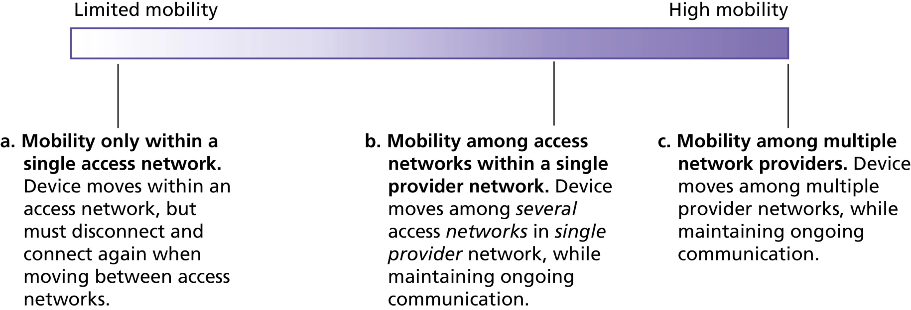

**移动性支持的三个基本问题：**

1. **仅在链路层支持，还是需要网络层参与？** 只在链路层支持，设备只能在当前子网（地址意义）内无中断移动——因为发给设备的入站数据报总是被转发到这个子网。**企业 WiFi 正是如此**（7.5.2）。跨整个运营商网络移动则需要网络层支持：核心网须知道设备当前附着的接入网，以便把入站数据报转发到该子网——**蜂窝网络正是如此**（7.5.3）。
2. **为什么切换、谁发起切换？** 设备移动时无线信号质量变化，可能为提升性能而换接入网；网络也可能为 **负载均衡** 把设备从拥挤的接入网移走。设备会测量周围所有基站的信号质量并上报：5G 设备周期性上报 **信道质量指示（CQI）**；WiFi 设备测量各 AP 信号强度并返回 **接收信号强度指示（RSSI）**。切换决定可主要由设备发起，也可由网络控制面发起。
3. **切换如何完成？** 两个任务：① 设备状态（认证状态、允许的服务）从旧基站控制面 **转移** 到新基站；② 修改路由器/交换机的转发表，把数据报重定向到设备的新附着点。

**移动节点的地址问题：归属网络与外部网络。** 以经典 **移动 IP** 框架理解：设备有一个 **归属网络（home network）**（其永久 IP 地址属于该网络）。设备移动到别的网络，称为 **外部网络（foreign network）**。**归属代理（home agent）** 是设备归属网络中的一个实体，**外部代理（foreign agent）** 是外部网络中的实体——移动节点每次进入外部网络，向归属代理登记一个 **转交地址（COA，Care-of Address）**，使归属代理总能知道设备当前的位置。

**两种路由方案（★408 概念重点）：**

- **间接路由（indirect routing，三角路由）**：发送方（通信对端）始终把数据报发给设备在归属网络中的 **永久地址**，由归属代理截获，**封装** 后经隧道转发给设备当前的外部代理（转交地址处），外部代理解封装交付设备。设备把回复直接发给发送方。**优点**：发送方无需感知设备移动；**缺点**：即使收发双方近在咫尺，流量也要绕道归属网络——**三角路由问题**（路径被拉长，时延增大，对实时业务不利）。
- **直接路由（direct routing）**：发送方先询问归属代理获得设备的 **转交地址**，然后 **直接** 向该地址发送（经外部代理转发），归属代理不再参与数据路径。**优点**：路径最优；**缺点**：发送方必须处理「绑定更新」（设备移动后转交地址变化，发送方须重新查询），复杂度从网络边缘转移到发送方。

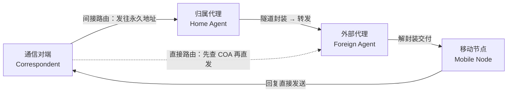
```mermaid
graph LR
    CN["通信对端<br/>Correspondent"] -->|"间接路由：发往永久地址"| HA["归属代理<br/>Home Agent"]
    HA -->|"隧道封装 → 转发"| FA["外部代理<br/>Foreign Agent"]
    FA -->|"解封装交付"| MN["移动节点<br/>Mobile Node"]
    CN -.->|"直接路由：先查 COA 再直发"| FA
    MN -->|"回复直接发送"| CN
```

**移动 IP 概念**：移动 IP（Mobile IP，RFC 5944）是让 IP 设备在网络间移动而保持连接的标准，其核心就是上面这套机制：转交地址（COA）+ 绑定更新（binding update，移动节点把当前位置登记给归属代理）+ 隧道转发。尽管技术上 25 年前已标准化，但因缺乏业务驱动力与计费模型（蜂窝网络先发优势），移动 IP 在传统因特网并未大规模部署——今天的现实是「双技术方案」：真正移动时用蜂窝，静止或局部移动时用 WiFi/有线。

### WiFi 中移动

WiFi 对移动性采取 **纯链路层** 方案（802.11 本来就是链路层标准），因此 WiFi 移动性只支持 **同一子网内的 AP 之间**。回顾 7.3.2：传统 WiFi 网络是 **基本服务集（BSS）**（一个 AP + 若干设备）；多个 BSS（如 BSS1、BSS2 及其 AP）使用 **同一 SSID** 且同属一个子网，就构成 **扩展服务集（ESS，Extended Service Set）**（图 7.44）——从设备视角和网络层视角看，ESS 都只是 **一个** WLAN。

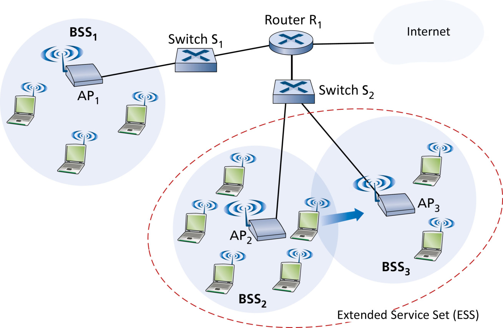

设备在 ESS 内从一个 AP 移动到另一个 AP：**重新关联（re-association）** 到新 AP，但由于 **从未离开子网**，从网络层看它根本没有「移动」——IP 地址不变、上层连接不受影响，**移动对上层完全透明**。802.11 引入 **快速 BSS 转换（FT，Fast Basic Service Set Transition）** 加速 AP 间切换的认证，并允许 AP 建议目标 AP；大厂商还有私有方案进一步管理 ESS 内切换。注意：**跨子网的 WiFi 漫游（跨 ESS）需要网络层移动性支持**，超出 WiFi 标准范围。

### 5G 中移动

与 WiFi 的链路层方案不同，**蜂窝移动性是全网性工程**：涉及 RAN 与核心网两个层面，且数据面隧道（UPF ↔ 基站）也要随之改变。5G 切换（图 7.45，源自 3GPP 规范）分三个阶段：

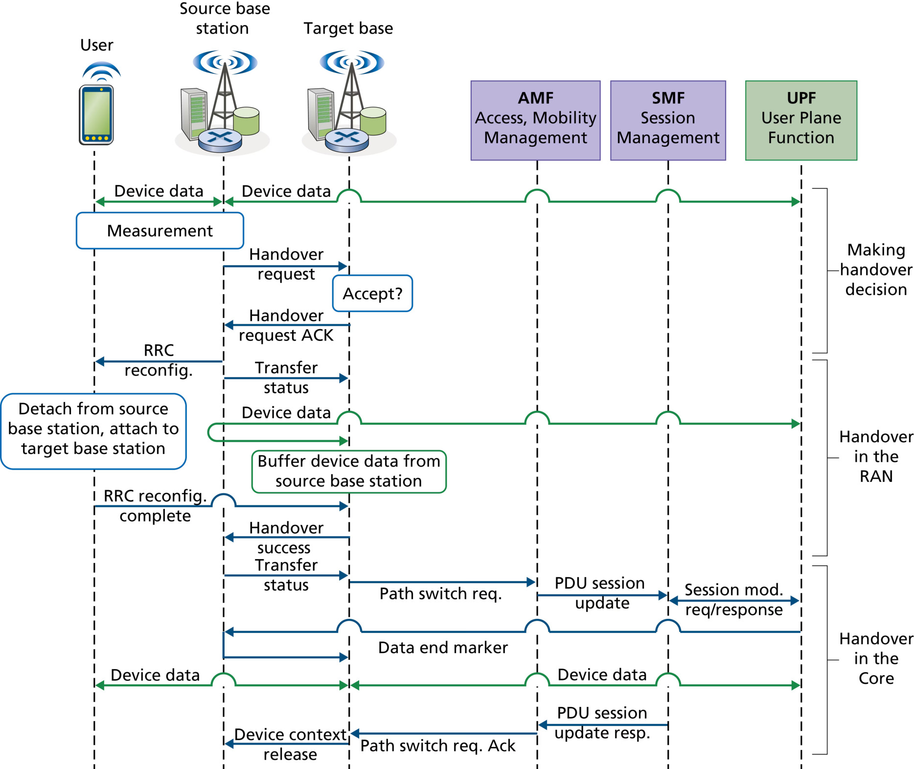

1. **做出切换决定**：设备测量能听到的各基站无线信道质量并上报给 **源基站**；源基站认为需要切换时，向 **目标基站** 发送切换请求，目标基站决定是否接受并回复（图中为接受）。
2. **在基站间转移设备**：源基站向设备发送重配置消息、向目标基站发送转移状态消息（移交设备状态）；设备与目标基站建立新的 RAN 连接，设备发重配置完成消息，源/目标基站做最终握手。**期间 UPF 隧道端点不变**：源基站把发给设备的数据报 **转发给目标基站**，目标基站缓存待设备上线后交付——**保证切换中不丢失入站数据报**。
3. **更新核心网状态与 UPF 隧道**：目标基站经 AMF 通知 **SMF**「我现在是该设备的基站」；SMF 指示 **UPF** 把设备隧道端点改到目标基站；UPF 向源基站发送 **数据结束标记（data-end marker）**，源基站据此得知隧道端点已切换并告知目标基站；目标基站交付缓存的数据报，此后数据直接由 UPF 流向目标基站。清理握手后切换完成。

更复杂的情况：设备长睡眠进入 **空闲（Idle）/非激活（Inactive）态** 后移动，核心网可能不知道设备所在 RAN——需 **跟踪区更新** 让核心网知道大致区域、**寻呼** 精确定位；跨运营商切换还需运营商间信令。这些超出本书范围。

### 互联网移动性：移动 IP

传统（非蜂窝）因特网今天没有广泛部署的「移动中上网」基础设施，但这 **不是缺少技术方案**——移动 IP 体系结构 25 年前就已标准化（RFC 5944），研究也从未停止。其核心机制即 7.5.1 所讲：

- **转交地址（COA，Care-of Address）**：移动节点在外部网络获得的临时地址，标识其当前位置。
- **绑定更新（binding update）**：移动节点向归属代理登记当前位置（COA）的过程。
- **归属代理** 截获发给移动节点永久地址的数据报，封装后经隧道转发到 COA；外部代理解封装交付移动节点。

移动 IP 未能大范围部署的主因是 **缺乏业务与计费驱动力**：蜂窝网络 25 年前就提供了移动语音（移动用户的「杀手级应用」）与全球移动数据服务，背后有归属网络订阅计费与运营商间结算协议；传统因特网缺少支持漫游的这类商业基础设施。今天的移动上网是 **双技术方案**：真移动用蜂窝，静止/局部移动用 WiFi 或有线。

---

## 7.6 蓝牙、卫星与 IoT 网络

**核心概念⑤：蓝牙、卫星与 IoT** —— 三类更专业的无线网络：蓝牙是短距、低功耗、自组织的个人区域网（微微网 + 跳频）；卫星网络以 GEO/LEO 星座提供广域覆盖（Starlink、GPS/WPS 定位）；IoT 网络（LoRaWAN、NB-IoT 等）在「覆盖面积、能耗、数据速率」三者间各有取舍。408 低频，了解即可。

### 蓝牙网络

蓝牙是 **电缆替代** 技术：短距（几十米内）、低功耗、低成本，连接无线键盘、耳机、手表、健康监测带、车载音响等，又称 **无线个人区域网（WPAN）** 或 **微微网（piconet）**。蓝牙在免许可 **ISM 频段**（2.4 GHz，与微波炉、车库门共存）工作，因此设计上就针对噪声与干扰：信道采用 TDM + FDM 结合——79 个（或 40 个，低功耗）频信道、每信道 625 μs 时隙，发送方在每个时隙用一个信道，**从一时隙到下一时隙按预定方式跳变信道**，即 **跳频扩频（FHSS，Frequency-Hopping Spread Spectrum）**（图 7.46）。干扰只影响少数时隙；信噪比很差的时隙可从跳频图案中自适应剔除；不同跳频图案的多个蓝牙网络可同地共存。

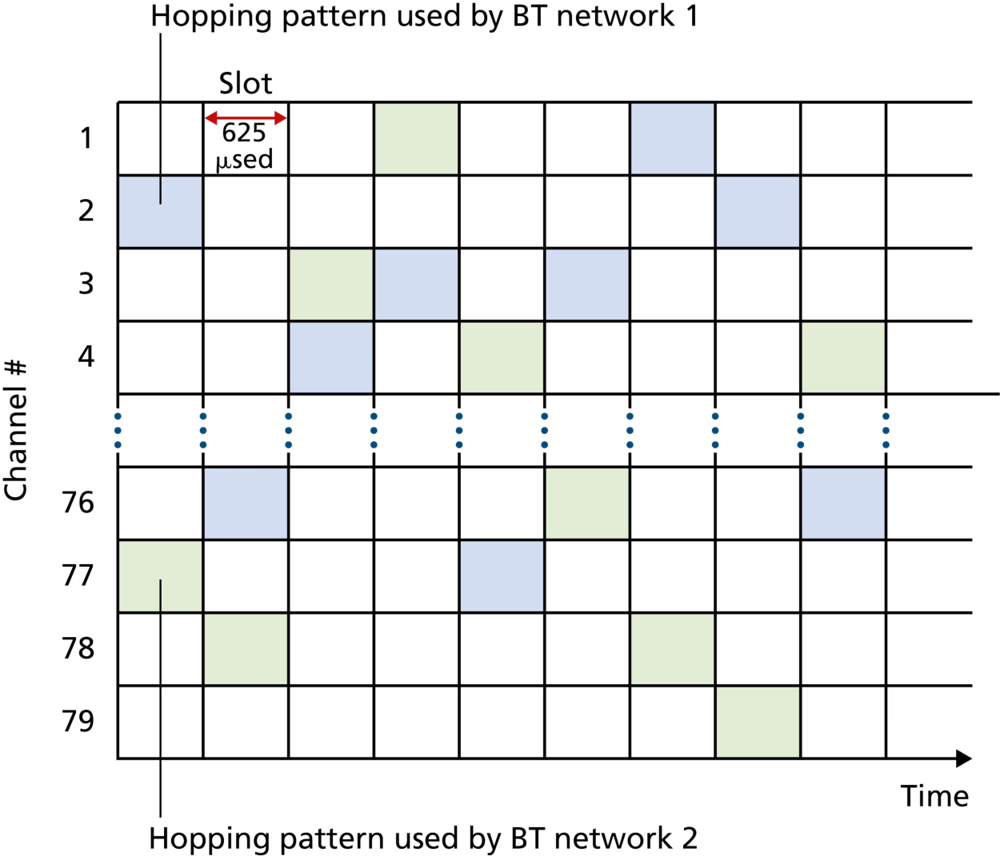

蓝牙是 **纯自组织网络**（无基础设施）。设备组织成最多 **8 个活动设备** 的 **微微网（piconet）**（图 7.47）：一个设备被指定为 **集中控制器（主设备）**，其余为外围（从）设备。主设备统治微微网：其时钟决定网内时间（TDM 时隙边界）与跳频序列，控制从设备准入、发射功率，并用 **轮询** 授予从设备发送权。**通信只发生在主设备与从设备之间，从设备之间不能直接通信。**

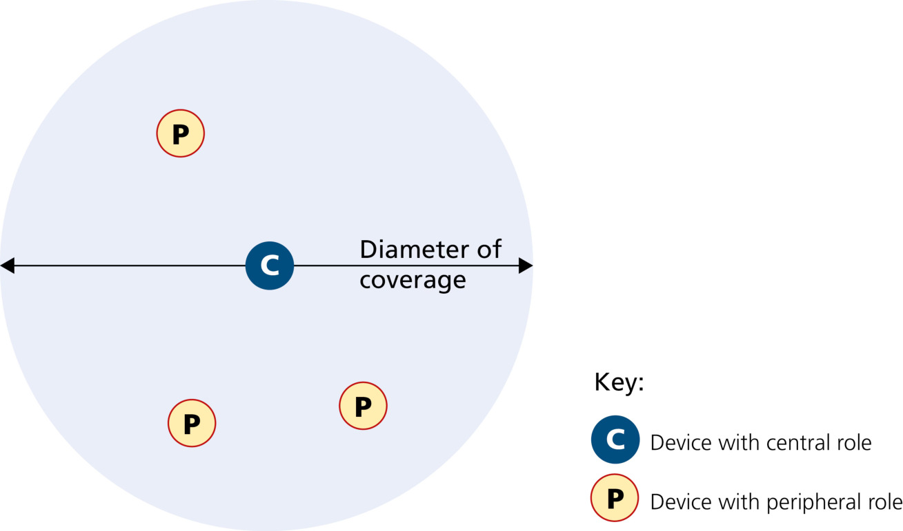

**自组织引导（bootstrap）**：主设备广播一系列 **查询（inquiry）消息**（各在不同频信道上）做 **邻居发现**；从设备在自己的频率上监听到查询后，**随机退避**（避免响应冲突，类似二进制指数退避）再回复设备 ID。主设备发现候选从设备后进入 **寻呼（paging）阶段**：向特定从设备重复发送寻呼邀请（仍用不同频率），从设备回复 ACK 后，主设备发送跳频信息、时钟同步信息与活动成员地址，最后用跳频图案轮询确认其入网。

**蓝牙协议栈（图 7.48）**：蓝牙 **没有网络层，也没有传统传输层**——单跳、只主从通信，无需多跳路由；传统传输层的可靠传输、流控、分段、面向连接服务等由 **L2CAP（Logical Link Control and Adaptation Protocol）** 提供，它还提供为多媒体应用预留周期性时隙的服务。蓝牙低功耗（BLE）与安全是后续版本重点。

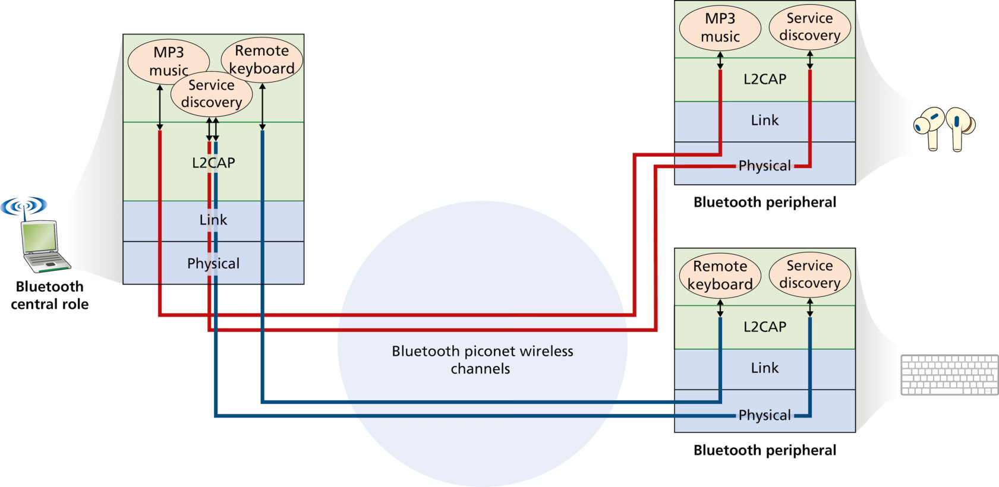

### 卫星网络

**定位：GPS 与 WiFi 定位。** 今天的手机定位结合两大系统：**GPS（全球定位系统）** 与 **WiFi 定位系统（WPS）**。GPS 卫星星座广播卫星位置与时间信息，接收机从至少 **4 颗卫星** 获得信息后解 **三边测量（trilateration）** 方程估算自身位置。GPS 在城市高楼区常因视线受阻而不准，此时 **WiFi 定位** 登场：各互联网公司维护数亿个 WiFi 接入点的数据库（SSID + 地理位置估计）；手机向定位服务报告附近 AP 的 SSID 与信号强度（及可用的 GPS 位置），服务端据此估计手机与各 AP 的距离、解三边测量得位置估计，再与 GPS 估计融合。**AP 帮手机定位，手机也帮 AP 定位**——上万部手机路过某 AP 时上报的信号强度数据，反过来用于估计该 AP 的位置。

**GEO 与 LEO 卫星。** 十年前卫星通信几乎都用 **地球静止轨道（GEO）** 卫星（赤道上方约 36000 km，与地球同步旋转、相对地面固定），用于广播电视、遥感与无地面因特网地区的接入；其缺点是往返时延（RTT）高达数百毫秒。近十年 **低地球轨道（LEO）** 卫星爆发式增长：更小、更便宜、距地 500-2000 km，RTT 远短于 GEO。2019-2024 五年间仅 Starlink 就发射了相当于历史全部卫星数量的 LEO 卫星；今天绝大多数新发射卫星都是 LEO。

**LEO 卫星网络架构**：LEO 卫星组成「星座」；卫星对地覆盖区称为 **足迹（footprint）**（典型 LEO 卫星足迹直径数百公里）；下行广播、上行多址（地面站单播到卫星，经典多路访问信道）。由于卫星高速运动，地面站只与一颗卫星相连数分钟就要 **切换** 到下一颗卫星——LEO 网络中 **移动的是基础设施（卫星）而非用户设备**。两种组网架构（图 7.50）：

- **弯管（bent pipe）架构**：把每颗卫星当作一条「链路」，端到端路径是一系列单跳卫星链路，每跳分组都要落地再上天。
- **天中之网（network in the sky）**：**星间链路（ISL）** 直接连接卫星，分组可在卫星间多跳后才回到地面；由于卫星相对地面与彼此不断运动，ISL 动态变化，LEO 路由是极具挑战的问题。

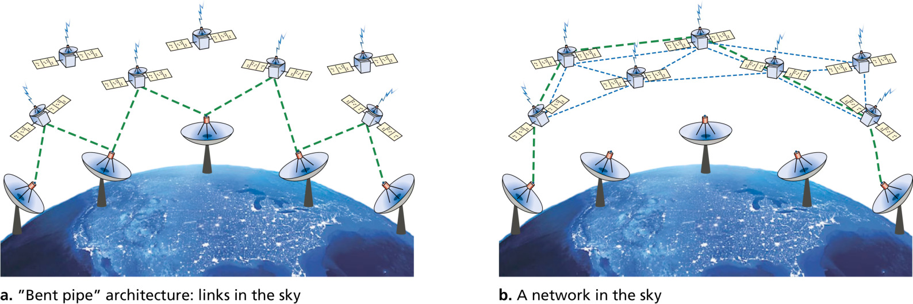

### IoT 网络

**物联网（IoT，Internet of Things）**：把大量小型、能量受限、带计算能力的设备连接起来，感知、监测、上报并控制物理世界（制造、物流、农业、智慧城市、健康监测）。IoT 设备数量将在本十年末超过 PC/笔记本/平板/手机之和的 3 倍。

IoT 技术多样，图 7.51 用三维刻画各类技术侧重的两个维度（覆盖面积、能耗、数据速率）——**每种技术强调三者之二，无一三者全占**：

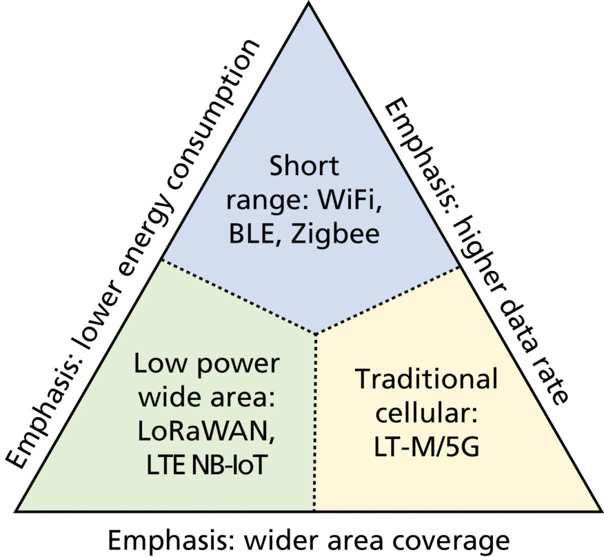

- **侧重低能耗 + 低速率（短距）**：**802.11ah**（WiFi 的 IoT 变体，继承 BSS 结构，sub-1GHz 免许可频段，速率 150 kbps-4 Mbps，中继可覆盖约 1 km）、**BLE（Bluetooth Low Energy）**（原蓝牙标准面向 IoT 的重大扩展，支持设备主动唤醒即发）、**Zigbee**（基于 IEEE 802.15.4 低速个人区域网标准，最早的 IoT 技术之一）。
- **侧重低能耗 + 广覆盖**：**LoRaWAN（Long Range Wide Area Network）**——ITU 标准化的 **全网级**（非链路层）标准，含服务器、网关与设备，星形之星的拓扑，网关作每颗边缘星的中心节点；Class A 设备即 7.3.6 的「唤醒即发」模式。**LTE NB-IoT（Narrowband IoT）**——4G 蜂窝标准，天然继承 RAN 架构（基站、设备、下行 OFDM、上行单载波 FDMA），200 kHz 信道带宽，速率约 200 kbps，支持设备唤醒即发。
- **侧重广覆盖 + 高速率**：**LTE-M**——功能更完整的 LTE IoT 标准，支持设备在基站间移动，信道带宽为 NB-IoT 的 6 倍。5G 标准未来将重点支撑 **海量机器类通信（mMTC）** 与 **超可靠低时延通信（URLLC）** 两大 IoT 场景（当前 5G 主要聚焦增强移动宽带 eMBB）。

---

## 7.7 小结

无线移动网络从革命性改变电话业开始，如今深刻影响着计算机网络：无线订阅用户已是有线的 5 倍。本章采用自底向上结构：

1. **无线物理层（7.2）**：无线信道特性——路径损耗（平方反比律、损耗指数）、多径（相干时间）、干扰（SNR、香农容量）、**隐藏站问题**；编码（冗余）与调制（ASK/FSK/PSK → QPSK → QAM）与自适应调制；MIMO（分集/复用）、波束成形与 MU-MIMO；许可/免许可频谱。
2. **无线接入网（7.3）**：信道共享（OFDM/OFDMA 的 RE/RB；CSMA/CA 的 DIFS/SIFS、退避、链路层确认、RTS/CTS 与 NAV）；**802.11 WiFi**（BSS/AP/SSID/关联、信道 1/6/11、**三地址帧**、MU-RTS、演进 a/b/g/n/ac/ax）；5G RAN（gNB、物理信道、RRC/PDCP/RLC/MAC 协议栈、RU/DU/CU、SD-RAN）；发现与附着（信标、PSS/SSS/MIB/SIB、关联、RRC 连接）；MAC 调度（RR/MT/BET/PF）；节能（PSM/TIM、TWT、DRX、LoRa 唤醒即发）。
3. **无线核心网（7.4）**：5G 核心服务化架构与网络功能（UPF/AMF/SMF/AUSF/UDM/NRF/PCF/NSSF）、**网络切片**、UPF 隧道与锚点、身份（IMSI/SUPI/SUCI）、注册与 PDU 会话建立、寻呼。
4. **移动性（7.5）**：三种移动场景；三个基本问题（链路层 vs 网络层支持、为何/谁发起切换、如何切换）；**移动 IP 的归属/外部代理、转交地址、间接路由（三角路由）与直接路由（锚点）**；WiFi 的 ESS 链路层切换；5G 切换三阶段。
5. **蓝牙、卫星与 IoT（7.6）**：蓝牙微微网与跳频；GEO/LEO 卫星、Starlink、GPS/WPS 定位；LoRaWAN、NB-IoT、LTE-M 等 IoT 技术权衡。

**408 备考提示**：本章低频但必考——**802.11 三地址帧、CSMA/CA（DIFS/SIFS、RTS/CTS、NAV）** 是五年考五次的稳定考点，务必会做 NAV 计算与三地址场景分析；移动 IP（三角路由）是概念题常客。
---

## 🧪 本章习题

> 每道题均可回溯至本章正文（考点映射见章首导览）。A 组为基础题，B 组为提高题，C 组为拓展综合题，最后为原书习题讲解。本章 408 低频，习题量减半但保持完整层次。

### 例题

!!! example "例题 1：CSMA/CA 与 CSMA/CD 对比辨析"

    从「检测/避免冲突、适用的传输介质、发送前等待、冲突后处理、是否需链路层确认」五个维度，对比 CSMA/CD 与 CSMA/CA 两种介质访问控制协议，并说明无线局域网为什么必须使用 CSMA/CA。

    ??? answer "查看答案"
        对比表：

        | 维度 | CSMA/CD（有线以太网） | CSMA/CA（无线 802.11） |
        |:---|:---|:---|
        | 核心思想 | **冲突检测**（边发边听，冲突即停止） | **冲突避免**（发送前尽量降低冲突概率） |
        | 适用介质 | 总线形以太网（有线） | 无线局域网 802.11a/b/g/n/ac/ax |
        | 发送前等待 | 检测到信道空闲立即发送 | 空闲后还需等待 **DIFS**（数据帧） |
        | 冲突后处理 | 立即停止 + 二进制指数退避 | 无法检测冲突，靠 **链路层确认（ARQ）** 重传 |
        | 链路层确认 | 不需要（冲突可检测） | 需要（每帧须 ACK，停-等可靠传输） |

        **为什么无线必须用 CSMA/CA：** ① 无线适配器接收信号强度远小于发射信号强度，**无法边发送边检测冲突**，一旦开始发送就完整发送整帧；② **隐藏站问题**——并非所有站都能听见对方，冲突检测检测不到全部冲突。故只能「避免」而非「检测」。

    ??? success "评分标准"

        - 五个维度逐项对比正确（每项 1.5 分，共 7.5 分）
        - 无线需用 CSMA/CA 的两个原因（2.5 分）

!!! example "例题 2：802.11 帧三地址字段分析（真题 2017#35 改编）"

    某 IEEE 802.11 无线局域网中，无线主机 H 通过接入点 AP 与路由器 R1 相连，R1 的另一侧接入因特网。现 H 向因特网中的服务器发送一个 IP 数据报，AP 收到 H 的帧后将其转换为以太网帧转发给 R1。

    （1）H 发送的 802.11 帧中，地址 1、地址 2、地址 3 分别应填入什么 MAC 地址？

    （2）AP 把 802.11 帧转换为以太网帧时，以太网帧的源 MAC 与目的 MAC 分别是什么？

    （3）若改为服务器向 H 发送数据报（R1 → AP → H 方向），802.11 帧的三个地址字段又各是什么？

    ??? answer "查看答案"
        （1）**上行（H → AP）**：地址 1 = **AP 的 MAC**（接收方）；地址 2 = **H 的 MAC**（发送方）；地址 3 = **R1 接口的 MAC**（路由器接口，供 AP 构造以太网帧时确定目的 MAC）。

        （2）AP 把 802.11 帧转换为以太网帧：**源 MAC = H 的 MAC**，**目的 MAC = R1 接口的 MAC**——这正是地址 3 的用途：让 AP 知道有线侧的目的地址。

        （3）**下行（R1 → AP → H）**：地址 1 = **H 的 MAC**（接收方）；地址 2 = **AP 的 MAC**（发送方）；地址 3 = **R1 接口的 MAC**——H 从地址 3 得知是谁把数据报送进子网的。可见 **地址 3 始终是路由器接口 MAC**，在 BSS 与有线 LAN 互联中起关键作用。

    ??? success "评分标准"

        - （1）三个地址正确（每项 1 分）
        - （2）以太网帧源/目的 MAC 正确（3 分）
        - （3）下行三地址正确（3 分）
        - 指出地址 3 的作用（1 分）

!!! example "例题 3：隐藏站问题与 RTS/CTS 解决流程"

    站点 A 与站点 C 都能与 AP 通信，但 A 与 C 因距离较远互为隐藏站。C 在 A 向 AP 发送长数据帧期间也要向 AP 发送数据。

    （1）若 C 不使用 RTS/CTS，直接向 AP 发送，会发生什么？说明原因。

    （2）若 A 与 C 都采用 RTS/CTS，描述 A 发送数据帧的完整预约流程，并说明 C 为什么会被「劝退」。

    （3）RTS/CTS 是否总是值得使用？为什么？

    ??? answer "查看答案"
        （1）C 监听信道时 **听不到 A 的发送**（隐藏站），以为信道空闲，等待 DIFS 后发送——两个信号在 **接收方 AP 处** 重叠冲突，A 的长数据帧被整帧浪费（无线无法检测冲突，A 会完整发完整个帧）。

        （2）流程：① A 监听空闲，等 **DIFS** 后广播 **RTS**（含本次通信持续时间 = SIFS + CTS + SIFS + DATA + SIFS + ACK）；② AP 收到 RTS 且信道空闲，广播 **CTS**（持续时间 = SIFS + DATA + SIFS + ACK）；③ A 收到 CTS 后等 **SIFS** 发送数据帧；④ AP 收到数据后等 **SIFS** 回 ACK。**C 听不到 A 的 RTS，但能听到 AP 广播的 CTS**，据 CTS 中的持续时间设置 **NAV（虚拟载波监听）**，在预约期内抑制发送——冲突被避免。

        （3）**不是总是值得**。RTS/CTS 引入额外时延并消耗信道资源；其价值在于长数据帧（冲突重传的浪费 >> 预约开销）。对短数据帧，预约开销可能大于收益，故 **只对长数据帧使用**，且为可选机制（普通模式不预约）。

    ??? success "评分标准"

        - （1）隐藏站 + 冲突发生在接收方（3 分）
        - （2）RTS/CTS/NAV 完整流程（8 分：四步各 1.5 分 + NAV 2 分）
        - （3）适用条件（4 分）

!!! example "例题 4：移动 IP 间接路由与直接路由对比"

    某移动节点 MN 从归属网络移动到外部网络，获得转交地址 COA。通信对端 CN 要向 MN 发送数据。

    （1）画出「间接路由」的数据路径，说明其存在的问题。

    （2）说明「直接路由」的实现思路，并对比两种方案的优缺点。

    （3）移动 IP 中，MN 如何让归属代理知道其当前位置？该过程叫什么？

    ??? answer "查看答案"
        （1）**间接路由**：CN →（发往 MN 永久地址）→ 归属代理 HA →（隧道封装）→ 外部代理 FA →（解封装交付）→ MN。MN 的回复直接发给 CN。**问题：三角路由**——即使 CN 与 MN 近在咫尺，流量也要绕道归属网络，路径被拉长、时延增大，对实时业务不利。

        （2）**直接路由**：CN 先向 HA 查询 MN 的 COA，然后 **直接** 把数据报发往 COA（经 FA 交付 MN），HA 不再参与数据路径。**优点**：路径最优；**缺点**：CN 必须处理 **绑定更新**（MN 移动后 COA 变化，CN 需重新查询），复杂度从网络边缘转移到发送方（且需要 CN 支持移动 IP 感知）。

        （3）MN 进入外部网络后，通过 **绑定更新（binding update）** 把其当前位置（COA）登记给归属代理；HA 维护 MN 的绑定记录，据此把发往 MN 永久地址的数据报隧道转发到 COA。

    ??? success "评分标准"

        - （1）间接路由路径 + 三角路由问题（5 分）
        - （2）直接路由思路 + 优缺点对比（6 分）
        - （3）绑定更新 + COA 登记（4 分）

### A 基础题（单选/填空/判断，每题 1-2 分）

**A1.**（单选）下列关于无线网络组成要素的说法，错误的是（ ）。

- A. 基站是无线网络特有、有线网络没有的组件
- B. WiFi 网络中的基站称为接入点（AP）
- C. 自组织网络（ad hoc）中设备需要自己提供路由、地址分配等服务
- D. 无线核心网提供数据面转发服务，但不涉及用户身份与移动性管理

??? answer "查看答案"
    **答案：D**

    无线核心网除了数据面转发服务（把数据报从接入网转发到因特网），还实现 **高层控制面/管理面服务**——用户与设备身份、移动性、接入安全管理等。A、B、C 均正确：基站是无线网络独有组件；WiFi 中基站即 AP；ad hoc 网络无基础设施，设备自行组织。

??? success "评分标准"

    - 选对 D 得 2 分；每项判断正确得 0.5 分

**A2.**（单选）在无线局域网中，站点 A 与站点 C 都听不到对方，但都能与 AP 通信；当 A 与 C 同时向 AP 发送数据时，会在（ ）处发生冲突。

- A. 站点 A
- B. 站点 C
- C. AP（接收方）
- D. 冲突域内的所有站点

??? answer "查看答案"
    **答案：C**

    这是典型的 **隐藏站问题**：A 与 C 互为隐藏站，各自监听信道都以为信道空闲，同时向 AP 发送；冲突表现为 **在接收方（AP）处** 的重叠干扰信号，而非在发送方。正因如此，无线中冲突检测意义有限——这正是 CSMA/CA 采用「冲突避免」的原因之一。

??? success "评分标准"

    - 选对 C 得 2 分；能说出「冲突发生在接收方」得 1 分

**A3.**（填空）802.11 中，一个 AP 与其关联的无线节点构成 **____**（BSS）；多个使用同一 SSID、同属一个子网的 BSS 构成 **____**（ESS）；设备加入 BSS 的过程称为 **____**。

??? answer "查看答案"
    **基本服务集（BSS，Basic Service Set）**；**扩展服务集（ESS，Extended Service Set）**；**关联（association）**。

    BSS 是 802.11 的基本构件（一个 AP + 若干无线节点）；ESS 在逻辑上表现为单个 WLAN（设备视角与网络层视角一致），设备在 ESS 内移动对网络层透明；关联通过关联请求/响应帧完成，之后设备再经 DHCP 获得 IP。

??? success "评分标准"

    - 每空 1 分（共 3 分），满分 3 分
    - 术语须与英文缩写对应正确

**A4.**（判断）由于移动 IP 技术非常成熟，传统因特网已经大规模部署了网络层移动性支持，用户可以在任意 WiFi 网络间无缝漫游而不改变 IP 地址。（ ）

??? answer "查看答案"
    **错误（×）**

    移动 IP（RFC 5944）虽在 25 年前就已标准化，但因 **缺乏业务与计费驱动力**（蜂窝网络先发优势、缺少漫游计费基础设施）并未在传统因特网大规模部署。WiFi 的移动性仅限 **同一子网（ESS）内** 的链路层切换；跨子网/跨网络的网络层移动仍主要靠蜂窝网络支持。今天的现实是「双技术方案」：真移动用蜂窝，静止或局部移动用 WiFi/有线。

??? success "评分标准"

    - 判断错误得 1 分
    - 说明移动 IP 未大规模部署的原因（业务/计费驱动力）得 1 分

### B 提高题（简答/计算，每题 5-10 分）

**B1.**（简答，10 分，真题 2020#37 改编）在采用 CSMA/CA 的 802.11 无线局域网中，某站检测到信道空闲后要向 AP 发送数据帧，随后 AP 确认接收。请：

（1）说明该站发送数据帧前等待的帧间间隔类型，以及该间隔在 SIFS/PIFS/DIFS 中的长短地位。

（2）AP 收到数据帧后发送确认帧前等待的是哪种帧间间隔？为什么？

（3）若上述过程前还使用了 RTS/CTS 预约信道，画出 RTS、CTS、DATA、ACK 的时序，并标出各帧前的帧间间隔。

??? answer "查看答案"
    （1）发送数据帧前等待 **DIFS（分布式协调 IFS）**——在三种 IFS 中 **最长**（DIFS > PIFS > SIFS）。DCF 方式下数据帧与管理帧使用 DIFS。

    （2）AP 发送确认帧（ACK）前等待 **SIFS（短 IFS）**——最短的 IFS，用来分隔属于一次对话的各帧（ACK 帧、CTS 帧、分片数据帧等都属于同一对话，须尽快发出以抢占信道）。

    （3）时序（自左向右）：源站 →（等待 DIFS）→ 广播 RTS → AP →（SIFS）→ 广播 CTS → 源站 →（SIFS）→ 发送 DATA → AP →（SIFS）→ 发送 ACK。其他站（含隐藏站）听到 CTS 后按其中持续时间设置 NAV，在预约期内抑制发送。

??? success "评分标准"

    - （1）DIFS + 最长（4 分）
    - （2）SIFS + 理由（3 分）
    - （3）时序正确、各帧前 IFS 标注正确（3 分）

**B2.**（简答，10 分，真题 2018#35 改编）IEEE 802.11 无线局域网的 MAC 协议 CSMA/CA 中，「信道预约」是如何实现的？结合隐藏站场景说明预约机制为何能降低冲突概率，并指出信道预约的适用条件。

??? answer "查看答案"
    **信道预约方法：交换 RTS 与 CTS 控制帧。**

    （1）源站监听信道，空闲则等待 DIFS 后广播 **RTS 帧**（含源地址、目的地址与本次通信所需持续时间 = SIFS + CTS + SIFS + DATA + SIFS + ACK）。

    （2）AP 收到 RTS 且信道空闲，广播 **CTS 帧**（持续时间 = SIFS + DATA + SIFS + ACK）。CTS 有两个目的：给源站明确发送许可；指示其他站（包括 **听不到 RTS 的隐藏站**，但能听到 AP 的 CTS）在预约期内不要发送。

    （3）源站收到 CTS 后等待 SIFS 发送数据帧；AP 收到数据后等待 SIFS 回 ACK。

    **为何降低冲突**：隐藏站听不到源站的 RTS，但能听到 AP 广播的 CTS，据此设置 **NAV（虚拟载波监听）** 抑制发送，从而避免隐藏站与数据帧在接收方冲突；且 RTS/CTS 很短，即使冲突也只浪费短帧时间。

    **适用条件**：RTS/CTS 只用于 **长数据帧**（预约开销小于冲突重传长帧的代价），且不是强制规定——普通模式可不做信道预约。

??? success "评分标准"

    - 点出「交换 RTS 与 CTS 帧」（2 分）
    - RTS/CTS 内容与流程正确（4 分）
    - 结合隐藏站 + NAV 说明冲突降低原理（3 分）
    - 适用条件（1 分）

**B3.**（简答，10 分）简述移动 IP 中移动节点、归属代理、外部代理三者的关系，并说明转交地址（COA）与绑定更新的作用。若通信对端把数据报直接发往移动节点的永久 IP 地址，流量会走什么路径？存在什么问题？

??? answer "查看答案"
    三者的关系：

    - **移动节点（MN）**：拥有归属网络中的永久 IP 地址；移动到外部网络后获得 **转交地址（COA）**——标识当前位置的临时地址。
    - **归属代理（HA）**：位于归属网络，维护 MN 的当前位置（COA）绑定记录；截获发往 MN 永久地址的数据报。
    - **外部代理（FA）**：位于外部网络，把隧道来的数据报解封装后交付 MN。

    **绑定更新（binding update）**：MN 进入外部网络后向 HA 登记其 COA 的过程，使 HA 总能知道 MN 当前在哪。

    **间接路由路径**：通信对端 →（发往永久地址）→ 归属代理 →（隧道封装）→ 外部代理 →（解封装交付）→ 移动节点。存在问题：**三角路由问题**——即使对端与 MN 近在咫尺，流量也要绕道归属网络，路径被拉长、时延增大，对实时业务不利。解决方法之一是 **直接路由**：对端先向 HA 查询 MN 的 COA，然后直接发往 COA（代价是对端需处理绑定更新）。

??? success "评分标准"

    - 三者角色正确（3 分）
    - COA 与绑定更新作用（2 分）
    - 间接路由路径完整（3 分）
    - 三角路由问题与直接路由（2 分）

### C 拓展题（计算/综合，每题 10-15 分）

**C1.**（计算，15 分，真题 2024#36 改编）在采用 CSMA/CA 的 802.11 无线局域网中，DIFS = 128 μs，SIFS = 28 μs，RTS、CTS 和 ACK 帧的传输时延分别是 3 μs、2 μs 和 2 μs。主机 A 要向 AP 发送一个总长度为 1998 B 的数据帧，无线链路带宽为 4 Mb/s。AP 收到 A 的 RTS 后广播 CTS，位于 A 听不见（但能听见 AP）的隐藏站 B 收到该 CTS 帧。

（1）CTS 帧中填写的「本次通信所需持续时间」应为多少？

（2）隐藏站 B 收到 CTS 后设置的 NAV 值是多少？

（3）若不用 RTS/CTS 而直接发送数据帧，A 与隐藏站 B 同时发送导致冲突，分析两种方式的信道开销差异。

??? answer "查看答案"
    （1）CTS 中填写的持续时间 = **SIFS + 数据帧传输时延 + SIFS + ACK 传输时延**（从收到 CTS 后算起）。数据帧传输时延：

    $$ t_{DATA} = \frac{1998 \times 8}{4 \times 10^6} = 3.996 \text{ ms} = 3996 \text{ μs} $$

    $$ t_{CTS} = 28 + 3996 + 28 + 2 = 4054 \text{ μs} $$

    （2）隐藏站 B 据 CTS 设置 **NAV = 4054 μs**——即 B 在 4054 μs 内抑制发送（SIFS + DATA + SIFS + ACK）。

    （3）**用 RTS/CTS**：冲突最多发生在短 RTS/CTS 帧上，浪费时间短（RTS 3 μs + CTS 2 μs 量级 + 相应 IFS），预约成功后 DATA 与 ACK 几乎无冲突地传输——这是「长数据帧 + 隐藏站」场景下值得付出的开销。**不用 RTS/CTS**：A 与 B 都监听信道为空就同时发送，整段 3996 μs 的数据帧在接收方冲突被完全浪费，还需重传——信道浪费远大于 RTS/CTS 开销。因此 **信道预约适用于长数据帧**；对短数据帧，RTS/CTS 自身开销反而大于收益，可不预约。

??? success "评分标准"

    - （1）CTS 持续时间公式与计算（6 分：公式 3 + 计算 3）
    - （2）NAV 值与意义（4 分）
    - （3）两种方式开销对比 + 适用条件（5 分）

**C2.**（综合，15 分）某企业园区部署 802.11 无线局域网，多台 AP 组成一个 ESS 且同属一个子网。员工持笔记本从 AP1 覆盖区走到 AP2 覆盖区，期间保持与远程服务器的 TCP 连接。请回答：

（1）该过程属于 7.5.1 中三种移动场景的哪一种？为什么从网络层看「设备没有移动」？

（2）描述设备从 AP1 切换到 AP2 的链路层过程，说明为何上层连接不会中断。

（3）若员工离开园区、乘坐高铁进入蜂窝网络覆盖区，通信如何从 WiFi 切换到蜂窝？对比 WiFi 内切换与蜂窝网络切换在「移动性支持层次」上的本质区别。

??? answer "查看答案"
    （1）属于场景 (b) 的简化版——**同一运营商（企业）网络的多个接入网（AP）间移动**；但由于所有 AP 同属一个 ESS、同一个子网，**设备从未离开子网**，从网络层看 IP 地址不变、没有「移动」。这与 7.5.1 中「只在链路层支持移动性、移动范围限于当前子网」的描述一致。

    （2）链路层过程：设备持续测量各 AP 信号强度（RSSI），AP1 信号减弱、AP2 增强；设备向 AP2 发送 **关联请求帧**，AP2 回复关联响应帧完成 **重新关联（re-association）**。由于 ESS 内所有 AP 共享同一 SSID 且同属一个子网，切换只涉及 **链路层**（802.11 FT 快速 BSS 转换可加速认证与建议目标 AP），IP 地址与 TCP 连接状态均不受影响——**上层对移动完全透明**，连接不中断。

    （3）离开园区进入蜂窝网络：WiFi 的移动性支持是 **纯链路层**（只限于同一子网内的 AP 间）；跨子网、跨网络（WiFi → 蜂窝）需要 **网络层（及更高层）移动性支持**——蜂窝网络自诞生起就把移动性作为一等公民：RAN 与核心网协同完成切换（设备测量上报 → 源/目标基站协调 → SMF/UPF 更新隧道），核心网知道设备当前附着的接入网，从而把入站数据报转发到正确位置。现实中的「WiFi 呼叫切换」（如 VoWiFi → VoLTE）由运营商专有方案与移动性管理实现，超出 802.11 标准范围。

??? success "评分标准"

    - （1）场景判断 + 子网/链路层理由（5 分）
    - （2）重新关联流程 + 透明性说明（5 分）
    - （3）链路层 vs 网络层移动性支持的本质区别（5 分）

### 原书习题讲解

**原书 R2.**（概念）无线网络中基站（base station）的作用是什么？在 4G、5G 蜂窝网络与 WiFi 网络中，基站分别被称为什么？

??? answer "查看答案"
    基站负责 **向其关联的无线设备收发分组**——所有无线设备经基站把分组送入因特网、从因特网接收分组；它同时是无线信道与有线/回传网络之间的网关，提供地址分配、接入控制等基础设施服务。基站是无线网络独有、有线网络没有的组件。

    蜂窝网络：4G 中称为 **eNB（evolved Node B）**，5G 中称为 **gNB（Next Generation Node B）**；WiFi 网络中称为 **接入点（AP，Access Point）**——三者本质都是基站。

??? success "评分标准"

    - 基站功能（3 分）
    - 三种名称（3 分）

**原书 R4.**（概念辨析）无线局域网为什么不能直接使用以太网的 CSMA/CD 协议？CSMA/CA 的「冲突避免」与 CSMA/CD 的「冲突检测」有何本质区别？

??? answer "查看答案"
    两个原因：

    1. **无法实现冲突检测**：接收信号强度远小于发射信号强度，无线适配器难以边发送边听，一旦开始发送就会完整发送整个帧（冲突时整帧被浪费）。
    2. **隐藏站问题**：并非所有站都能听见对方（但能产生冲突），冲突检测检测不到全部冲突。

    本质区别：**CSMA/CD** 边发送边检测、冲突即停止（可用于有线总线以太网）；**CSMA/CA** 无法检测冲突，只能在发送前尽量 **避免** 冲突——通过 DIFS/SIFS 帧间间隔、随机退避、链路层确认（ARQ）与可选的 RTS/CTS 预约来降低冲突概率。「避免」不等于完全不冲突。

??? success "评分标准"

    - 两个原因（各 2 分）
    - CSMA/CD 冲突检测 vs CSMA/CA 冲突避免的本质（4 分）

**原书 R9.**（概念）802.11 帧为什么需要三个地址字段？分别说明在「无线设备 → AP → 路由器」与「路由器 → AP → 无线设备」两个方向中三个地址字段的内容。

??? answer "查看答案"
    需要三个地址是因为：数据报要从 **无线站点经 AP 到达路由器接口**（或反向），必须同时标识「无线链路两端的收发方」与「有线侧的路由器接口」——以太网帧的两个地址（源/目的 MAC）不足以表达这三方。第四个地址仅在 ad hoc 模式（设备互转发）使用。

    **上行（无线设备 H → AP → 路由器 R1）**：地址 1 = AP 的 MAC（接收方）；地址 2 = H 的 MAC（发送方）；地址 3 = R1 接口的 MAC——AP 据此构造以太网帧的目的 MAC = R1 接口 MAC。

    **下行（路由器 R1 → AP → 无线设备 H）**：地址 1 = H 的 MAC（接收方）；地址 2 = AP 的 MAC（发送方）；地址 3 = R1 接口的 MAC——H 据此得知是谁把数据报送进子网。

??? success "评分标准"

    - 三地址原因（4 分）
    - 两个方向三地址内容（各 3 分）

---

## ✅ 本章小结

本章从无线电波讲到移动 IP，把「无线」与「移动」两大主题收拢在一起：

1. **无线网络四大要素**：无线接入网、无线核心网、无线设备、基站；基础设施模式 vs 自组织 ad hoc；单跳/多跳分类。
2. **无线物理层**：路径损耗、多径、干扰（SNR/香农）、隐藏站；编码与调制（ASK/FSK/PSK → QPSK → QAM）、自适应调制、MIMO/波束成形、频谱管理。
3. **无线接入网（★）**：OFDM/OFDMA 信道划分、CDMA；**CSMA/CA**（DIFS/SIFS、退避、链路层确认、RTS/CTS、NAV）；**802.11 体系结构**（BSS/AP/SSID、关联、三地址帧、演进）；5G RAN（gNB、协议栈、RU/DU/CU、SD-RAN）；发现与附着；MAC 调度；节能（PSM/DRX）。
4. **无线核心网**：5G 服务化架构、网络切片、UPF 隧道与锚点、IMSI/SUPI 身份、注册与会话建立。
5. **移动性（★）**：移动 IP 原理（归属/外部代理、间接路由三角路由 vs 直接路由、COA、绑定更新）；WiFi ESS 内链路层切换；5G 切换三阶段。
6. **蓝牙、卫星与 IoT**：微微网与跳频；GEO/LEO 与 Starlink；LoRaWAN/NB-IoT/LTE-M 的权衡。

**一句话总结**：无线网络的难题源于 **「听不见却互相干扰」的信道** 与 **「动了位置却没动身份」的设备**——前者由 CSMA/CA 与 RTS/CTS 解决，后者由移动 IP 式的代理-隧道机制解决。

### 术语对照表

| 英文术语 | 中文 | 说明 |
|:---|:---|:---|
| wireless host / device | 无线主机 / 无线设备 | 运行应用、经无线接入网连入因特网的设备 |
| base station | 基站 | 无线网络独有组件，负责与关联设备收发分组（gNB/eNB/AP） |
| access point (AP) | 接入点 | WiFi 网络中的基站（802.11 标准下为纯二层设备） |
| infrastructure / ad hoc mode | 基础设施模式 / 自组织模式 | 经基站接入 / 无基础设施设备自行组织 |
| RAN / WLAN | 无线接入网 / 无线局域网 | 蜂窝 / WiFi 的边缘无线接入网络 |
| BSS / ESS | 基本服务集 / 扩展服务集 | 一个 AP + 若干节点 / 同 SSID 同子网的多个 BSS |
| SSID / association | 服务集标识 / 关联 | WiFi 网络名 / 设备加入 BSS（关联请求/响应帧） |
| hidden terminal | 隐藏站 | 听不到对方、却会在共同接收方处冲突的节点 |
| CSMA/CA | 载波监听多路访问/冲突避免 | 802.11 信道访问协议（DIFS/SIFS + 退避 + ACK） |
| DIFS / SIFS | 分布式/短帧间间隔 | 最长 / 最短的 IFS，用于数据帧 / ACK-CTS 帧 |
| RTS / CTS / NAV | 请求发送 / 清除发送 / 网络分配向量 | 预约信道的短控制帧 / 虚拟载波监听持续时间 |
| 802.11 frame | 802.11 帧 | 含四地址字段（基础设施模式用三个）的无线帧 |
| OFDMA / RB / RE | 正交频分多址 / 资源块 / 资源元素 | 5G 与 WiFi 6 的无线资源划分单位 |
| gNB / eNB | 5G / 4G 基站 | Next Generation Node B / evolved Node B |
| network slicing | 网络切片 | 在共享物理网络上定义多个逻辑网络 |
| UPF | 用户面功能 | 5G 数据面唯一网络功能，隧道中继与锚点 |
| AMF / SMF | 接入移动性管理 / 会话管理功能 | 5G 控制面核心网络功能 |
| IMSI / SUPI | 国际移动用户识别码 / 订阅永久标识 | 蜂窝网络用户身份（MCC+MNC+MSIN） |
| home / foreign network | 归属网络 / 外部网络 | 设备永久地址所在网络 / 当前所在的其他网络 |
| home / foreign agent | 归属代理 / 外部代理 | 移动 IP 中归属网络 / 外部网络内的转发实体 |
| indirect / direct routing | 间接路由 / 直接路由 | 经归属代理转发 / 对端直发转交地址（三角路由） |
| Mobile IP / COA / binding update | 移动 IP / 转交地址 / 绑定更新 | 网络层移动性标准 / 设备临时地址 / 向归属代理登记位置 |
| piconet / FHSS | 微微网 / 跳频扩频 | 蓝牙自组织网络（≤8 设备）/ 抗干扰跳频技术 |
| GEO / LEO | 地球静止轨道 / 低地球轨道 | 距地约 36000 km / 500-2000 km 的卫星轨道 |
| LoRaWAN / NB-IoT | 长距广域网 / 窄带物联网 | 低功耗广覆盖的 IoT 无线网络技术 |

---

## 🚪 下一章预告

第 7 章讲完了无线与移动：从无线电波的衰减与多径，到 802.11 的 CSMA/CA 与三地址帧，再到 5G 核心网与移动 IP 的代理-隧道机制——「连接」的问题已基本解决。但一路走来我们多次把「安全」问题推到一边：WPA 认证、双向认证、SIM 密钥、加密与完整性校验……下一章，我们将正面迎战 **网络世界的黑暗面**：密码学如何保护机密性？TLS 如何让 HTTPS 安全可信？IPsec 与防火墙又如何筑起网络边界？——**第 8 章：网络安全** 见。

👉 [进入第 8 章：网络安全 →](08-security.md)
