# 第 8 章：网络安全 —— 让 Alice 与 Bob 在满是 Trudy 的因特网里安全通信

> 因特网从来不是世外桃源：恶意软件、拒绝服务、嗅探、IP 伪装、消息篡改与删除，攻击手段层出不穷。前七章我们学会了让数据「跑得快、跑得稳」，本章要回答的是：如何让数据 **跑得保密、跑得可信**。主线是先学 **密码学原理**（加密、哈希、签名、认证），再看这些原理如何落地到 **应用层（PGP）、传输层（TLS）、网络层（IPsec）、链路层（WiFi/5G）**，最后是 **运行安全（防火墙与 IDS）**。一句话概括本章：**机密性、完整性、端点认证，三位一体。**

---

## 📋 本章导览

| 项目 | 内容 |
|:---|:---|
| **课时建议** | 8-10 课时（408 一轮复习建议 2-3 天；本章 408 低频但概念通用，重理解轻计算） |
| **教学目标** | ① 掌握安全通信三属性：机密性、消息完整性、端点认证；② 掌握对称密钥密码学（凯撒/单表替换/DES/AES/CBC）与公钥密码学（RSA 原理与计算）；③ 掌握哈希函数、MAC 与数字签名及证书/CA；④ 掌握端点认证协议 ap1.0-ap4.0 的演进与 nonce 的作用；⑤ 掌握 PGP、TLS、IPsec、WPA3/5G 四层安全方案的大图景与关键机制；⑥ 掌握防火墙三类实现与 IDS/IPS 的检测原理 |
| **教学重点** | RSA 密钥生成与加解密计算、TLS 握手完整流程、IPsec ESP 封装格式、防火墙规则表分析、认证协议演进 |
| **教学难点** | RSA 数论原理（ed ≡ 1 mod (p-1)(q-1) 为什么保证加解密互逆）、MAC 与数字签名辨析、TLS 主密钥派生与会话密钥、ESP 隧道模式封装与解封装流程、状态过滤 vs 分组过滤 |
| **考点映射** | 408 考点（2024 新大纲起网络安全列为正式考点，历年低频但稳定出现）：对称/公钥加密与 RSA 计算；哈希与消息认证；数字签名与证书；端点认证与重放攻击（nonce）；TLS 握手与分层安全；防火墙与 IDS 规则分析 |
| **习题配置** | 例题 4 道 + A 基础 5 题 + B 提高 3 题 + C 拓展 2 题 + 原书习题讲解 3 道 |


```mermaid
graph TD
    A["第 8 章<br/>网络安全"] --> B["8.1 什么是网络安全"]
    A --> C["8.2 密码学原理 ★"]
    A --> D["8.3 消息完整性与数字签名 ★"]
    A --> E["8.4 端点认证"]
    A --> F["8.5 邮件安全：PGP"]
    A --> G["8.6 传输层安全：TLS ★"]
    A --> H["8.7 网络层安全：IPsec ★"]
    A --> I["8.8 无线与 5G 安全"]
    A --> J["8.9 运行安全：防火墙与 IDS ★"]
    A --> K["8.10 小结"]
    B --> B1["机密性 / 完整性 / 端点认证"]
    B --> B2["Alice / Bob / Trudy 人物设定"]
    B --> B3["窃听 / 修改 / 插入 / 删除"]
    C --> C1["对称密钥：凯撒 / 单表替换 / DES / AES / CBC"]
    C --> C2["公钥密码：RSA 原理 + 计算 + 会话密钥"]
    D --> D1["哈希函数：SHA-1 / SHA-256，单向与抗碰撞"]
    D --> D2["MAC：共享密钥 + 哈希"]
    D --> D3["数字签名：私钥签名 / 公钥验证 / CA 证书"]
    E --> E1["ap1.0 我声明 → ap2.0 IP 地址 → ap3.0 密码"]
    E --> E2["ap3.1 加密密码 → 重放攻击"]
    E --> E3["ap4.0 nonce + 共享密钥 → 防重放"]
    F --> F1["机密性：会话密钥 + 公钥加密会话密钥"]
    F --> F2["完整性：哈希 + 数字签名"]
    F --> F3["PGP：先签名再加密，信任网"]
    G --> G1["握手 / 密钥派生 / 数据传输"]
    G --> G2["TLS 1.3：1-RTT，证书验证 + PMS → MS"]
    G --> G3["记录协议：加密 + HMAC + 序号"]
    H --> H1["VPN 隧道模式 / 传输模式"]
    H --> H2["AH 认证 / ESP 加密+认证"]
    H --> H3["SA 安全关联 + SPI + SAD/SPD"]
    H --> H4["IKE 两阶段密钥管理"]
    I --> I1["WPA3-Personal：SAE 四步 Dragonfly"]
    I --> I2["WPA3-Enterprise：802.1X + EAP-TTLS"]
    I --> I3["5G：EAP-AKA'，AUSF 归属网络认证"]
    J --> J1["分组过滤（规则表/ACL）"]
    J --> J2["状态过滤（连接表）"]
    J --> J3["应用网关（SSH 网关）"]
    J --> J4["IDS/IPS：签名 vs 异常"]
```

---

## 8.1 什么是网络安全

回到第一章 1.6 节，我们描述过因特网中最普遍、最具破坏性的几类攻击：恶意软件、拒绝服务（DoS）、嗅探、源伪装、消息修改与删除。学了整整七章的网络知识后，现在轮到我们正面回答：**如何把这些「坏家伙」挡在门外？** 本章的主角由此登场——**Alice** 与 **Bob**，两个希望「安全地」通信的人。他们可以是一对交换路由表的路由器、一对想建立安全传输连接的客户机与服务器，也可以是一对想互发安全邮件的邮件应用。而第三个名字——**Trudy**（the intruder，入侵者），则代表潜伏在信道上的窃听者与破坏者。

!!! info "定义：安全通信的三大属性"

    **英文原文（权威定义）：**

    > Confidentiality. Only the sender and intended receiver should be able to understand the contents of the transmitted message. **Message integrity**. Alice and Bob want to ensure that the content of their communication is not altered, either maliciously or by accident, in transit. **End-point authentication**. Both the sender and receiver should be able to confirm the identity of the other party involved in the communication.

    **中文解释：** 安全通信有三大属性——**机密性（confidentiality）**：只有发送方与预期的接收方才能读懂消息内容，窃听者截获后无法理解，这必然要求加密；**消息完整性（message integrity）**：消息在传输途中无论被恶意篡改还是意外损坏，都能被检测出来；**端点认证（end-point authentication）**：通信双方能够确认对方身份，证明对方确实是其自称的那一方。此外还有 **运行安全（operational security）**：用防火墙、入侵检测系统等设备保护组织网络（8.9 节详述）。

### Alice、Bob 与 Trudy 的威胁模型

在进一步讨论之前，先明确入侵者 Trudy 能做什么。如图 8.1 所示：Alice（发送方）要把数据发给 Bob（接收方）。为满足机密性、端点认证与消息完整性，Alice 与 Bob 之间会交换控制消息与数据消息（如同 TCP 收发双方交换控制报文段与数据报文段），其中全部或部分消息将被加密。

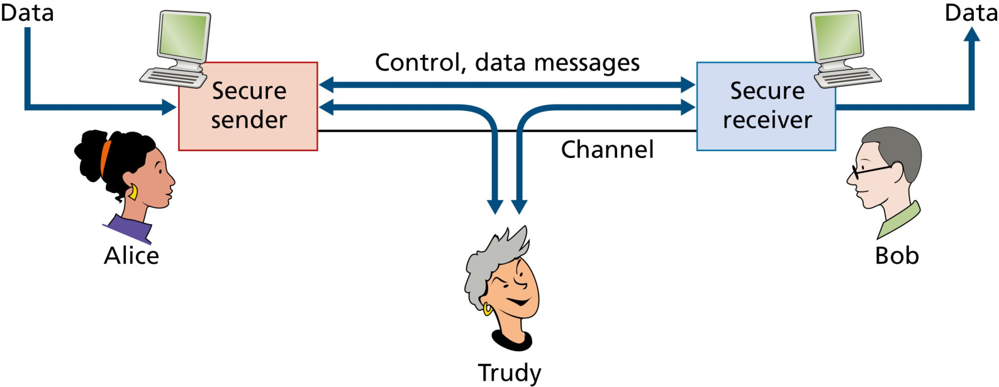

Trudy 在信道上可以实施 **窃听（eavesdropping）**：嗅探并记录信道上的控制与数据消息；还可以对消息或其内容进行 **修改、插入或删除（modification, insertion, or deletion）**。这些能力足以支撑五花八门的攻击：窥探通信（窃取密码与数据）、冒充他人、劫持进行中的会话、淹没系统资源拒绝向合法用户提供服务等。

因特网中需要安全通信的「Alice 与 Bob」无处不在：交换邮件的用户、网购时传送信用卡号的客户、交换路由信息的路由器、DNS 查询与网络管理应用——**能主动干扰 DNS 查询、路由计算或网管功能的入侵者，足以在网络中制造大混乱**。可以说，密码学不仅是机密性的工具，也是端点认证与消息完整性的基石。

---

## 8.2 密码学原理

密码学的历史至少可以追溯到凯撒大帝时代，现代密码技术（包括因特网上使用的大量算法）建立在近 30 年的进展之上。密码学技术让发送方伪装数据，使入侵者无法从截获的数据中获得任何信息；接收方必须能从伪装数据中恢复原始数据。图 8.2 展示了基本术语。

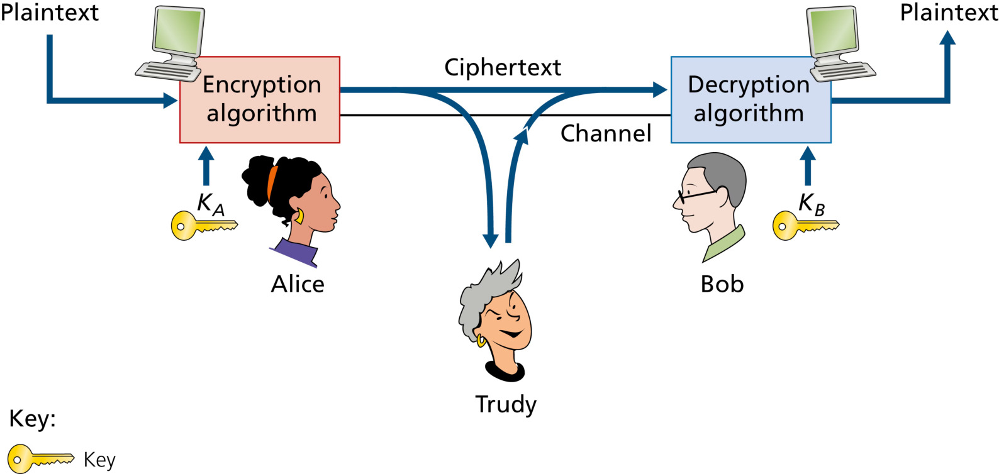

假设 Alice 要向 Bob 发送消息。Alice 的消息在原始形态（如 "Bob, I love you. Alice"）下称为 **明文（plaintext）** 或 **cleartext**。Alice 用 **加密算法（encryption algorithm）** 加密明文，得到看起来不可理解的 **密文（ciphertext）**。有趣的是，现代密码系统中加密算法本身往往公开，甚至入侵者也知道。既然人人都知道编码方法，就必须存在某种 **密钥（key）**——一串数字或字符——来阻止入侵者解密。

如图 8.2 所示：Alice 把密钥 K_A 作为输入交给加密算法，加密算法以密钥与明文消息 m 为输入、输出密文；Bob 用密钥 K_B 与解密算法由密文恢复明文。由此引出两大密码体系：

- **对称密钥系统（symmetric key systems）**：Alice 与 Bob 的密钥 **完全相同且保密**。
- **公钥系统（public key systems）**：使用一对密钥，其中一个密钥对全世界公开，另一个只归 Alice 或 Bob 中的一方所有。

下面两小节分别讨论这两种体系。

### 对称密钥密码学

**核心概念①：对称密钥密码学与公钥密码学** —— 对称密钥密码用同一个共享密钥完成加解密（凯撒、DES、AES），公钥密码用「公钥加密 + 私钥解密」的非对称密钥对（RSA）。二者是全部网络安全协议的底层建材：对称算法负责高速加密大数据，公钥算法负责密钥分发、签名与认证。

所有密码算法本质上都是「用一种东西替换另一种东西」：取一段明文，计算并替换为相应的密文。先看一个古老而简单的对称密钥算法——**凯撒密码（Caesar cipher）**（cipher 即加密方法），相传由凯撒大帝使用。对英文文本，凯撒密码把明文中的每个字母替换为字母表中 **其后第 k 个字母**（允许回卷，即 z 之后回到 a）。例如 k=3 时，a 变成 d、b 变成 e，依此类推；这里 k 的值就是密钥。

**凯撒密码小例（k=3）：** 明文 "bob, i love you. alice" 加密为密文 "ere, l oryh brx. dolfh"。密文确实像天书，但若知道用的是凯撒密码，破解不费吹灰之力——密钥只有 25 种取值（k=1 到 25）。

!!! example "例题 1：凯撒密码的加密与解密"

    凯撒密码以密钥 k 表示每个明文字母向后平移 k 位（模 26 回卷）。

    （1）设 k=3，将明文 "attack at dawn" 加密，写出密文。

    （2）设 k=3，将密文 "dolfh" 解密，写出明文。

    （3）密文 "ere, l oryh brx. dolfh" 是用密钥 k=？加密 "bob, i love you. alice" 得到的？（观察第一个单词即可判断，不必穷举）

    ??? answer "查看答案"
        **（1）** 每个明文字母 +3 位（回卷）：a→d、t→w、c→f、k→n，得密文：

        $$ \text{attack at dawn} \Rightarrow \text{dwwdfn dw gdzq} $$

        **（2）** 解密是加密的逆操作，每个密文字母 −3 位：d→a、o→l、l→i、f→c、h→e，得明文 **"alice"**。

        **（3）** 观察 "ere" 与 "bob"：b 与 e 在字母表中相差 3 位，故 **k=3**。验证其余字母：o→r、b→e、i→l、l→o、v→y、e→h…… 全部成立。由于凯撒密码只有 25 种密钥，一旦确认使用了凯撒密码，把 k=1 到 25 逐个试一遍即可破译——这就是 **暴力穷举（brute-force）** 攻击的思路。

    ??? success "评分标准"

        - （1）加密结果正确（4 分）
        - （2）解密结果正确（3 分）
        - （3）正确推断 k=3 并说明理由（3 分）

#### 单表替换与多表替换

**单表替换密码（monoalphabetic cipher）** 是凯撒密码的改进：仍然用一个字母替换另一个字母，但不再遵循「统一位移 k」的规则，而是任意字母可以替换为任意其他字母，只要每个字母有唯一的替换字母（反之亦然）。图 8.3 给出一种可能的替换规则。

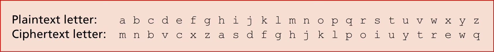

明文 "bob, i love you. alice" 在某种替换规则下变成 "nkn, s gktc wky. Mgsbc."。与凯撒密码的 25 种配对相比，单表替换有 26! 种（约 4×10²⁶）可能的配对，暴力穷举完全不现实。**但统计攻击可以轻松击破它**：英语中 e、t 是最常出现的字母（约各占 13% 与 9%），且 "in"、"it"、"the"、"ion"、"ing" 等组合频繁共现——统计密文中字母与组合的出现频率即可反推替换表。若入侵者对消息内容已有猜测（如知道 "bob" 与 "alice" 必然出现），则只需验证少数候选。

由此区分入侵者拥有的三类攻击场景：

- **唯密文攻击（ciphertext-only attack）**：入侵者只有截获的密文，对明文内容无确定信息。统计攻击即属于此类。
- **已知明文攻击（known-plaintext attack）**：入侵者知道若干（明文，密文）配对。例如 Trudy 恰好看到 Bob 手写的一份解密文本，或确信 "bob"/"alice" 出现在明文中。
- **选择明文攻击（chosen-plaintext attack）**：入侵者能够选择明文并得到对应的密文。对简单算法，若能让 Alice 发送 "The quick brown fox jumps over the lazy dog"（含全部 26 个字母的句子），即可完全破译；对现代算法则未必。

五百年前出现的 **多表替换密码（polyalphabetic cipher）** 改进了单表替换：使用 **多个** 单表替换密码，每个明文位置指定用哪一个替换表。因此同一个字母出现在不同位置可能被加密成不同字母。图 8.4 展示了用两个凯撒密码（密钥 k1 与 k2）构成的多表替换：设按模式（k1，k2，k2，k1，k2，……）循环使用两表，则明文第一个 b 用 k1 加密、第二个 b 用 k2 加密——同一个字母在不同位置密文不同，统计攻击的难度大增。

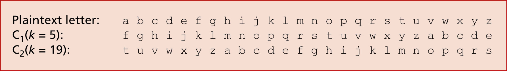

#### 块密码：DES、3DES 与 AES

下面进入现代对称加密。重点看 **块密码（block cipher）**——PGP（安全邮件）、TLS（安全 TCP 连接）、IPsec（网络层安全）都建立在其上。块密码把待加密消息按 m bit 分块处理，每块独立加密：密码使用一种 **一对一映射**，把 m bit 明文块映射为 m bit 密文块。

图 8.5 展示了一个块密码函数的例子：把 m bit 块切成小块，每小块经 4 bit 输入到 4 bit 输出的表处理，重排后进入下一轮，共 n 轮后输出密文块——多轮循环让每个输入比特影响尽量多的输出比特。

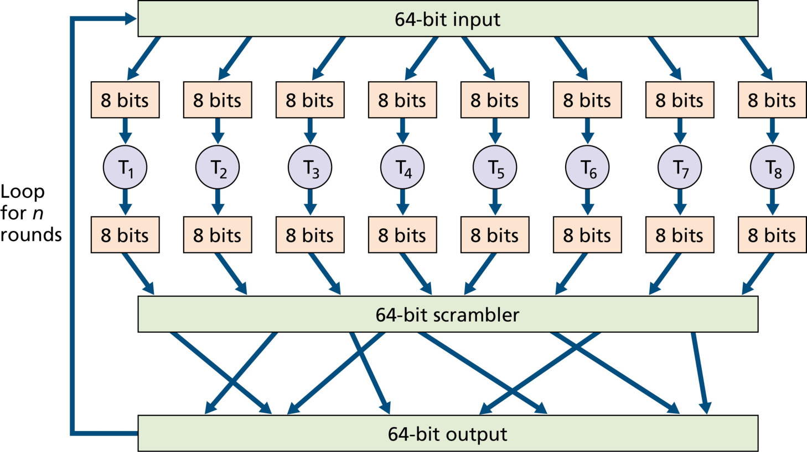

现代块密码如 **DES（数据加密标准，Data Encryption Standard）**、**3DES** 与 **AES（高级加密标准，Advanced Encryption Standard）** 都采用这类「函数 + 轮」的结构：DES 用 64 bit 块与 56 bit 密钥；AES 用 128 bit 块、密钥长度可为 128/192/256 bit。密钥长度决定安全性：56 bit 密钥有 2⁵⁶ 种可能；NIST 估计，一台 1 秒能破解 DES（穷举全部密钥）的机器，破解 128 bit 的 AES 密钥约需 **150 万亿年**。

**块密码与流密码**：块密码一次处理一整块明文（如 64/128 bit），同一块明文总是映射为同一密文块；**流密码（stream cipher）** 一次加密一个比特或字节，把密钥扩展为与明文等长的密钥流、逐位异或。流密码适合实时数据流，但密钥流不能重复使用；块密码更通用，是现代主流方案。

**CBC 密码块链接（Cipher Block Chaining）**：若直接对消息分块、每块独立加密，会出现一个微妙问题——两个相同明文块产生相同密文块，攻击者可据此猜测明文、甚至还原整个消息。解决办法是把随机性混入密文：

1. 发送前生成随机串 **初始化向量（IV，Initialization Vector）**，明文发送给接收方；
2. 第一个明文块与 IV 异或后再加密：c(1) = K(m(1) ⊕ IV)；
3. 第 i 个块：c(i) = K(m(i) ⊕ c(i−1))——**每个密文块与上一个密文块链接**。

这样，相同明文块产生（几乎必然）不同的密文块；IV 明文发送也无妨，因为入侵者没有密钥 K 就无法解密；且只增加一个 IV 块的开销。CBC 对协议设计的重要启示：**协议必须在收发双方之间提供 IV 的分发机制**（后文 TLS、IPsec 中都会见到）。

### 公钥密码学

从凯撒时代到 1970 年代的两千多年里，加密通信都要求双方共享共同秘密——对称密钥。但问题在于：**两个素未谋面、只在网络上交谈的实体，如何安全地约定共享密钥？** 1976 年 Diffie 与 Hellman 提出 **Diffie-Hellman 密钥交换**，1978 年 RSA 问世。公钥密码学的概念很简单：如图 8.6 所示，Bob（接收方）不再与 Alice 共享单一密钥，而是拥有 **一对** 密钥——**公钥 K_B⁺** 对全世界公开（Trudy 也知道），**私钥 K_B⁻** 只有 Bob 自己知道。


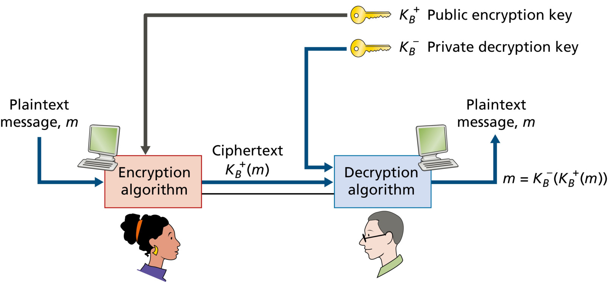

Alice 要与 Bob 通信时：先取得 Bob 的公钥 K_B⁺，用公钥加密消息：**K_B⁺(m)**；Bob 收到密文后用私钥解密：**K_B⁻(K_B⁺(m)) = m**。存在这样的算法与密钥选取方法，使「先公钥加密、再私钥解密」恰好恢复原文——**Alice 用 Bob 公开的密钥就能发送秘密消息，双方无需预先分发任何秘密密钥**。反过来（先私钥后公钥）也成立：**K_B⁺(K_B⁻(m)) = m**，这是数字签名的基础（8.3 节）。

公钥密码学立刻浮现一个顾虑：既然 Bob 的加密密钥公开，任何人都能给他发加密消息——**仅靠加密，接收方无法确认发送方是谁**（对称体系下「知道共享密钥」本身就隐式标识了发送方，公钥体系下则不然）。把发送方与消息绑定起来需要 **数字签名**（8.3 节）。

#### RSA 算法

RSA（以发明者 Ron Rivest、Adi Shamir、Leonard Adleman 命名）几乎成了公钥密码学的代名词。RSA 大量使用模运算：**a mod b 是 a 除以 b 的余数**，例如 137 mod 10 = 7。模运算中的加、乘、幂结果都要替换为除以 n 后的余数，并有性质 **a·b mod n = (a mod n)·(b mod n) mod n**，由此可得 **(aᵐ)ᵏ mod n = aᵐᵏ mod n**。

RSA 由两部分组成：① 公钥与私钥的选取；② 加密与解密算法。

**密钥生成（Bob 执行）：**

1. 选两个大素数 p 与 q（乘积 n 的量级建议达 10⁹⁰ 以上；p、q 越大越难破解，但加解密越慢）。
2. 计算 **n = p·q**，以及 **z = (p−1)(q−1)**。
3. 选一个数 e（e < z），与 z **互素**（除 1 外无公因子）；e 用于加密。
4. 找一个数 d，使 **e·d ≡ 1 (mod z)**（即 e·d 能被 z 整除）；d 用于解密。
5. **公钥 K_B⁺ = (n, e)** 公之于众；**私钥 K_B⁻ = (n, d)** 秘密保存。

**加密与解密（明文用整数 m 表示，0 ≤ m < n）：** Alice 加密 **c = mᵉ mod n** 发给 Bob；Bob 解密 **m = cᵈ mod n**。

**为什么 m 用整数表示？** 任何消息本质上是比特串，都能唯一表示为一个整数（连同长度），故「加密一条消息」即「加密代表该消息的唯一整数」。

**RSA 小例（p=5，q=7）：** n = 5×7 = 35，z = 4×6 = 24。取 e=5（与 24 互素），找 d 使 5d ≡ 1 (mod 24)：d=29（5×29=145 = 24×6+1）。公钥 (35, 5)，私钥 (35, 29)。设 Alice 要发送字母 L、O、V、E，按 a=1, b=2, …, z=26 映射为 m=12, 15, 22, 5，逐个加密：

| 明文 m | 密文 c = m⁵ mod 35 | 解密 m = c²⁹ mod 35 |
|:---|:---|:---|
| 12 (L) | 12⁵ mod 35 = 17 | 17²⁹ mod 35 = 12 |
| 15 (O) | 15⁵ mod 35 = 15 | 15²⁹ mod 35 = 15 |
| 22 (V) | 22⁵ mod 35 = 22 | 22²⁹ mod 35 = 22 |
| 5 (E) | 5⁵ mod 35 = 10 | 10²⁹ mod 35 = 5 |

（真实应用是把整条消息的 ASCII 码拼成一个大整数再加密，数字大得无法写进教材，此处逐字母演示。）

!!! example "例题 2：RSA 密钥生成与加解密（p=5，q=11）"

    Bob 选择两个素数 p=5、q=11，希望用 RSA 与 Alice 通信。

    （1）计算 n 与 φ(n) = (p−1)(q−1)。

    （2）取 e=7，验证 e 与 φ(n) 互素，并求出满足 e·d ≡ 1 (mod φ(n)) 的 d。

    （3）写出 Bob 的公钥与私钥。Alice 要向 Bob 发送明文 m=8 与 m=13，分别求密文。

    （4）Bob 收到上述密文后如何恢复明文？写出解密计算。

    ??? answer "查看答案"
        **（1）** n = p·q = 5×11 = **55**；φ(n) = (p−1)(q−1) = 4×10 = **40**。

        **（2）** 7 与 40 的最大公因子为 1（40 = 7×5+5，7 = 5+2，5 = 2×2+1），故互素。求 d 使 7d ≡ 1 (mod 40)：检验 7×1=7、7×2=14、……、7×23=161 = 40×4+1，故 **d=23**（一般用扩展欧几里得算法求解）。

        **（3）** 公钥 **K_B⁺ = (n, e) = (55, 7)**；私钥 **K_B⁻ = (n, d) = (55, 23)**。加密 c = m⁷ mod 55：

        - m=8：8² = 64 ≡ 9，8⁴ ≡ 9² = 81 ≡ 26，8⁷ = 8⁴·8²·8 ≡ 26×9×8 = 1872 ≡ **2**（1872 − 34×55 = 2）。
        - m=13：13² = 169 ≡ 4，13⁴ ≡ 16，13⁷ = 13⁴·13²·13 ≡ 16×4×13 = 832 = 55×15+7 ≡ **7**。

        **（4）** 解密 m = c²³ mod 55：

        - c=2：2⁵ = 32，2¹⁰ ≡ 32² = 1024 ≡ 1024−18×55 = 34，2²⁰ ≡ 34² = 1156 ≡ 1156−21×55 = 1，2²³ = 2²⁰·2²·2 ≡ 1×4×2 = **8** ✓
        - c=7：7² = 49，7⁴ ≡ 49² = 2401 ≡ 2401−43×55 = 36，7⁸ ≡ 36² = 1296 ≡ 1296−23×55 = 31，7¹⁶ ≡ 31² = 961 ≡ 961−17×55 = 26，7²³ = 7¹⁶·7⁴·7²·7 ≡ 26×36×49×7；计算 26×36 = 936 ≡ 936−17×55 = 1，1×49×7 = 343 ≡ 343−6×55 = **13** ✓

        两条明文均正确恢复，验证了 RSA 加解密的互逆性。

    ??? success "评分标准"

        - n 与 φ(n) 正确（2 分）
        - 互素验证与 d=23 的求解过程（4 分）
        - 公钥/私钥表示正确（2 分）
        - 两则密文计算正确（4 分）
        - 解密恢复原文（4 分）

#### RSA 为什么能工作

为什么「先加密后解密」恰好恢复原文？解密结果即 **mᵉᵈ mod n**。数论结论（费马小定理推广）：若 p、q 是素数，n = pq，且 x ≡ y (mod (p−1)(q−1))，则对任意 m 有 **mˣ ≡ mʸ (mod n)**。我们恰好选了 e·d ≡ 1 (mod (p−1)(q−1))，于是 **mᵉᵈ ≡ m¹ (mod n)**——解密恢复原文。反过来先 d 后 e（mᵈᵉ）同样成立，为数字签名奠基。

**RSA 的安全性** 依赖：目前没有已知快速算法能把公开值 n 分解为素数 p、q——若攻击者知道了 p、q，就能由 n 算出 z，进而由公开的 e 解出私钥 d。注意 RSA 的安全性并非被证明，只是「未知存在快速分解算法」；量子计算快速分解算法若实用化，RSA 将不再安全，NIST 已在征集后量子公钥算法标准。近年 **椭圆曲线密码（ECC）** 也作为 RSA 的替代方案兴起。

#### 会话密钥与 RSA vs DES 的取舍

RSA 的模幂运算相当耗时。因此实践中 **RSA 从不直接加密长数据，而是与对称密码配合**：Alice 先随机选一个 **会话密钥（session key）K_s**，用对称算法（DES/AES）加密数据本身；再用 Bob 的公钥加密会话密钥（K_B⁺(K_s)），把「加密数据 + 加密会话密钥」一并发出。Bob 用私钥解出 K_s，再用 K_s 解密数据。这样对称算法负责大批量数据的高速加密，公钥算法只处理一小段密钥。

**RSA 与 DES 对比小结：**

| 特性 | RSA（公钥） | DES/AES（对称） |
|:---|:---|:---|
| 密钥 | 一对：公钥公开、私钥保密 | 单一共享密钥，双方保密 |
| 密钥分发 | 无需共享，公钥公开即可 | 必须先安全地约定共享密钥（难题） |
| 速度 | 慢（大整数模幂运算） | 快（适合大数据量） |
| 用途 | 加密会话密钥、数字签名、证书 | 加密批量数据、MAC 计算 |
| 安全性基础 | 大整数分解困难 | 穷举密钥困难（密钥长度决定） |

**Diffie-Hellman（DH）密钥协商**：公钥密码学还能让两个从未交互过的实体 **推导出共享对称密钥**。协议用公开的大素数 p 与大数 g：Alice 选私有值 S_A，计算 T_A = g^(S_A) mod p 发给 Bob；Bob 类似发 T_B。双方各自计算 T_B^(S_A) mod p 与 T_A^(S_B) mod p——由模运算性质两者相等，即共享秘密 g^(S_A·S_B) mod p。安全性依赖「已知 g、p、T_A、T_B 求不出 S_A/S_B」（离散对数问题，难度与 RSA 分解相当）。DH 是 TLS 的核心组件（8.6 节），也是 IKE 的基础（8.7 节）。

---

## 8.3 消息完整性与数字签名

上一节的加密提供了机密性。本节转向同等重要的 **消息完整性（message integrity，又称消息认证）**，以及密切相关的 **数字签名** 与 **公钥认证**。

**核心概念②：哈希函数、MAC 与数字签名** —— 哈希函数把任意长消息压缩为固定长度「指纹」（单向、抗碰撞）；MAC 用共享密钥 + 哈希做完整性校验；数字签名用私钥签名、公钥验证，额外提供不可否认性，并由 CA 证书解决公钥归属问题。

用 Alice 与 Bob 定义问题：Bob 收到一条消息并相信它来自 Alice，要认证它，需验证：① 消息确实源自 Alice；② 消息在途中未被篡改。几乎所有安全网络协议都依赖此问题的解决——例如 OSPF 链路状态路由中，若 Trudy 散布伪造的链路状态消息，整张路由表都会被污染，故路由器 B 必须验证消息确实由 A 创建且未被篡改。

### 密码学哈希函数

如图 8.7 所示，**哈希函数（hash function）** 以输入 m 计算一个 **固定长度** 的字符串，称为 **哈希（hash）** 或 **报文摘要（message digest）**。因特网校验和与 CRC 都满足这一定义，但 **密码学哈希函数（cryptographic hash function）** 还要求一条额外性质：

> **计算上不可能找到两个不同的消息 x 与 y，使得 H(x) = H(y)。**

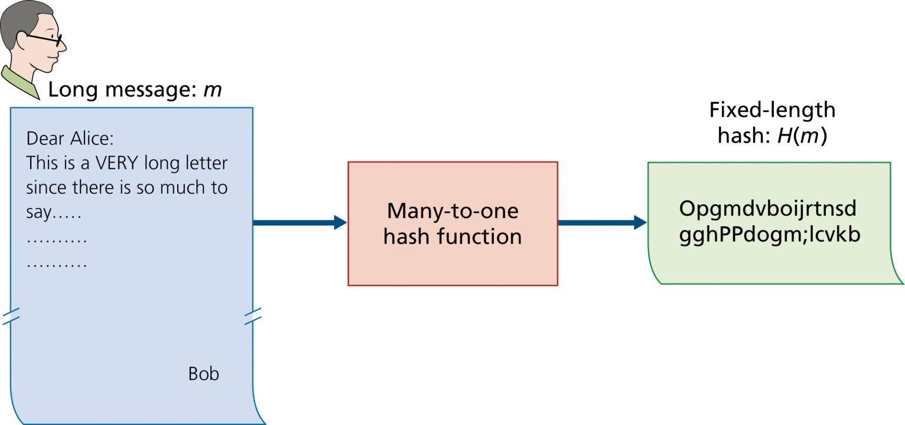

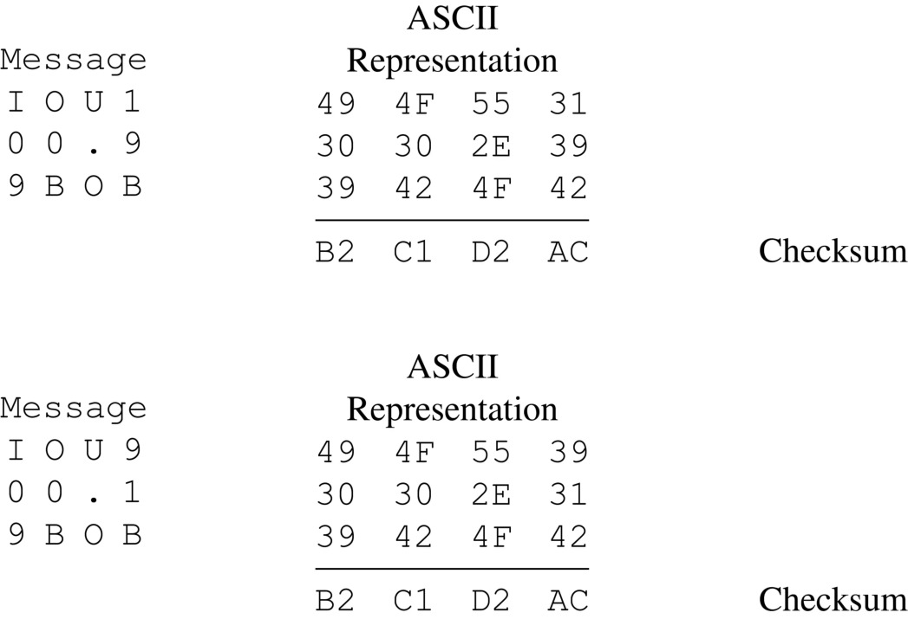

这个性质（**抗碰撞性，collision resistance**）非正式地说：入侵者无法「伪造另一条内容不同、却与原文哈希值相同」的消息。因为一旦发送方用哈希保护消息（如下文的 MAC 与签名），入侵者若能找到碰撞，就能替换消息而保持哈希不变，骗过接收方。

简单校验和为什么是不合格的哈希？看一个例子（图 8.8）：设 Bob 欠 Alice 钱，发来借条 "IOU100.99BOB"，按每字符一个字节、每 16 bit 一组求和得校验和 AC；而 "IOU900.19BOB" 的校验和 **恰好也是 AC**——两条对 Bob 而言「价格天差地别」的消息拥有相同校验和！给定原始数据，很容易构造另一份数据撞上相同校验和，因此简单校验和完全不能满足抗碰撞要求。


现代广泛使用的密码学哈希：**MD5**（128 bit 摘要，已证明可碰撞、不推荐安全用途）、**SHA（Secure Hash Algorithm）** 家族——**SHA-1** 产生 160 bit 摘要（联邦标准，也已发现攻击）、**SHA-256** 产生 256 bit 摘要。**输出越长越安全**（碰撞更难找），这是 SHA-256 取代 SHA-1/MD5 的根本原因。

!!! warning "常见错误：哈希 ≠ 加密"

    哈希与加密是两回事：**加密可逆**（有密钥就能解密还原明文），**哈希不可逆**（只能单向计算，无法从摘要还原消息）。哈希函数是「指纹」，不是「保险箱」。另一个高频混淆点是：**哈希只保证完整性，不保证机密性**——哈希（如 H(m)）本身不隐藏消息内容；要同时保密与验真，需要把哈希与加密/签名组合使用（8.5 节 PGP 就是先签名再加密）。

### 消息认证码（MAC）

有了哈希函数，能否直接用它做完整性？Alice 计算 H(m)、把 (m, H(m)) 发给 Bob，Bob 重算哈希对比——**显然有漏洞**：Trudy 可以伪造一条声称是 Alice 的消息 m'，自己算 H(m')，发给 Bob (m', H(m'))。Bob 验证通过，却被骗了。因此做消息完整性还必须引入 **共享秘密**——**认证密钥（authentication key）s**：

1. Alice 把消息 m 与密钥 s 拼接为 m+s，计算 **MAC = H(m + s)**。这个哈希值称为 **消息认证码（MAC，Message Authentication Code）**。
2. Alice 把扩展消息 (m, MAC) 发给 Bob。
3. Bob 收到后，用自己掌握的 s 重算 H(m+s)；若与收到的 MAC 相等，则消息确实来自 Alice 且未被篡改（Trudy 不知道 s，无法伪造 MAC）。

图 8.9 总结了 MAC 流程。注意：**MAC 不需要加密算法**——很多应用（如链路状态路由）只关心完整性不关心机密性，用 MAC 就能在无须集成复杂加密算法的前提下认证消息。还要注意区分两个「MAC」：此处是 message authentication code（消息认证码），不是链路层的 MAC（medium access control，介质访问控制）！

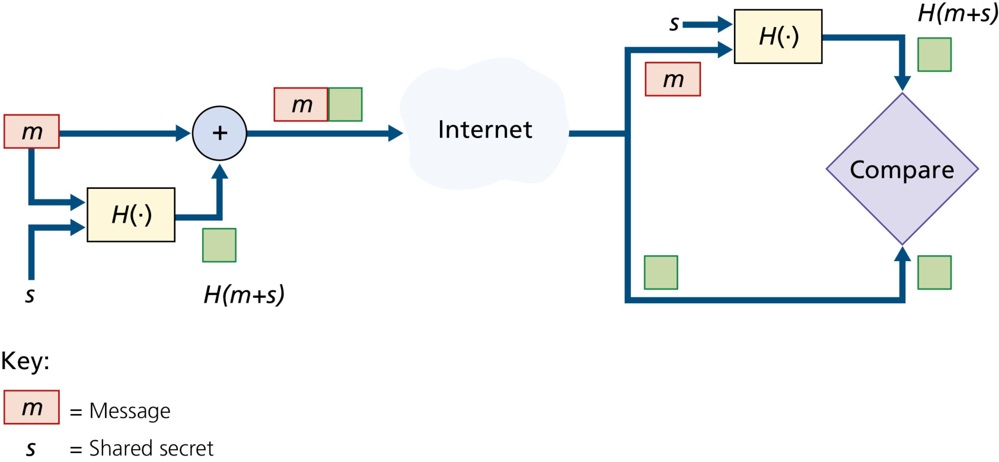

最常见的 MAC 标准是 **HMAC**（RFC 2104），可配合 MD5 或 SHA-1 使用；HMAC 把数据与认证密钥 **两次** 送入哈希函数，抗「长度扩展攻击」等旁路。使用 MAC 还需解决：**认证密钥如何分发给双方？** 对链路状态路由，管理员可逐台路由器实地配置；更省事的方式是：若每台路由器有公钥，管理员把认证密钥用该公钥加密后在网络上分发。

### 数字签名

数字世界也需要「签名」：表明文档的所有者/创建者，或表示同意文档内容。手写签名要求 **可验证**（能证明文档确由某人签署）与 **不可伪造**（只有该人才能签署）。MAC 无法胜任：它需要双方共享密钥，而签名要求「唯一性」——用于签名的密钥不能与他人共享。**公钥密码学的私钥恰好满足这个要求**：每个实体的公私钥都是唯一的。

**签名**：Bob 要对文档 m 签名，就用 **私钥** 计算 K_B⁻(m)，签名就是 K_B⁻(m)。乍看奇怪——私钥不是用来解密吗？但加解密不过是数学运算（RSA 中即模幂），Bob 的目的不是隐藏内容，而是「用只有自己有的东西标记文档」。**验证**：Alice 用 Bob 的 **公钥** 计算 K_B⁺(K_B⁻(m)) = m，与文档一致即证明签名有效。为什么可信？① 谁签的名必然用了私钥 K_B⁻；② 只有 Bob 知道 K_B⁻（公钥推不出私钥）。若文档被篡改为 m'，Bob 为 m 生成的签名验证不出 m'——**数字签名同时提供完整性与来源认证**。

**用哈希加速签名**：直接对整份文档做加密运算开销太大。更高效的做法是 **对文档的哈希签名**：Bob 计算 H(m)，对哈希用私钥加密得到 K_B⁻(H(m))，把（明文消息 m，数字签名）发给 Alice。Alice 用公钥解出 H(m)，再自己算 H(m) 对比。哈希远比原文档短，签名计算量大幅下降。


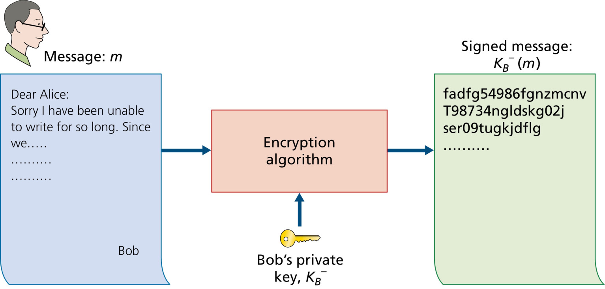


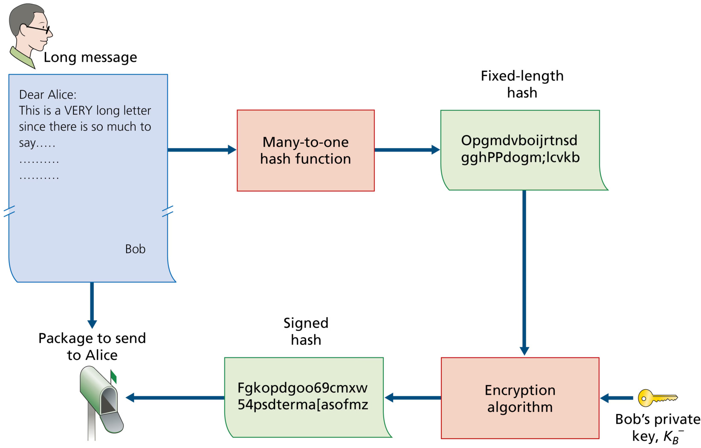


图 8.11 与图 8.12 展示了完整的发送与验证流程：发送方（原文经哈希 → 私钥加密哈希 → 与原文一起发出）；接收方（公钥解密签名得哈希₁ → 对原文自算哈希₂ → 比对）。

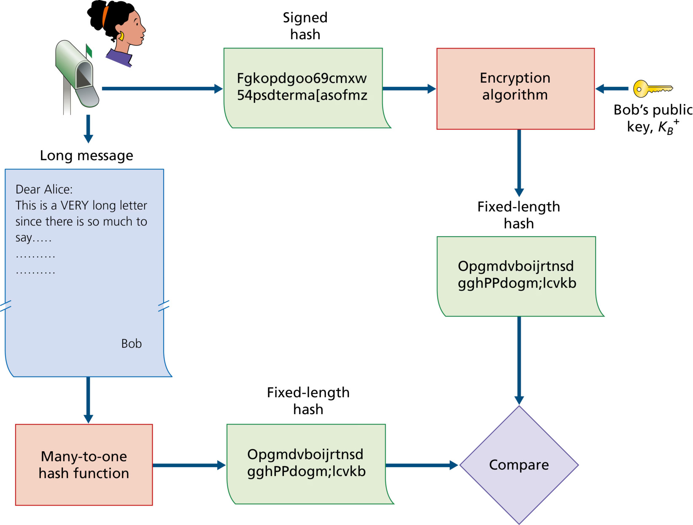

!!! example "例题 3：数字签名与 MAC 的对比"

    消息完整性既可用 MAC 实现，也可用数字签名实现。请从 **密钥结构、是否依赖加密/公钥基础设施、提供的能力（完整性/来源认证/不可否认性）、适用场景** 四个方面对比二者。

    ??? answer "查看答案"
        **共同点：** 两者都从消息出发，都使用密码学哈希函数，都能让接收方验证消息来源与完整性——都回答「这条消息是 Alice 发的、没被改过吗」。

        **区别：**

        1. **密钥结构**：MAC 双方共享同一个认证密钥 s（对称）；数字签名使用公私钥对，私钥只归签名者所有（非对称）。
        2. **是否依赖加密/PKI**：MAC 只需哈希与共享密钥，**不需要任何加密算法、不需要公钥基础设施（PKI）**；数字签名「更重」，需要公钥密码学与底层的 PKI（认证中心 CA）支撑公钥的可信性。
        3. **能力差异**：MAC 提供完整性 + 来源认证（仅对知道共享密钥的双方有意义）；数字签名额外提供 **不可否认性（non-repudiation）**——签名由私钥生成，签名者无法抵赖，第三方（如法庭）也可用公开公钥验证；而 MAC 双方共享密钥，无法向第三方证明「这 MAC 是 Alice 算的而非 Bob 算的」。
        4. **适用场景**：OSPF 路由消息用 MAC（只关心完整性与认证，且无须 PKI）；PGP 邮件用数字签名（需要向收件人及第三方证明发件人）；TLS 与 IPsec 用 MAC/HMAC 做完整性校验（会话密钥已共享）。

    ??? success "评分标准"

        - 共同点（2 分）
        - 密钥结构差异（3 分）
        - 是否依赖加密/PKI（3 分）
        - 不可否认性差异（4 分）
        - 适用场景举例（3 分）

#### 公钥认证与数字证书

数字签名一个重要的应用是 **公钥认证（public key certification）**——证明「某个公钥确实属于某个实体」。想想比萨恶作剧的因特网版（图 8.13）：Alice 经营网上比萨店，Bob 下单并附上自己的数字签名。狡猾的 Trudy 给 Alice 发消息冒充 Bob，附上 **Trudy 自己的公钥**（Alice 误以为是 Bob 的），并用 Trudy 的私钥签名。Alice 用「Bob 的公钥」（实为 Trudy 的）验证签名——一切吻合，比萨被送到 Bob 家。**教训：公钥密码学要可用，你必须能验证「声称属于对方的公钥确实属于对方」。**


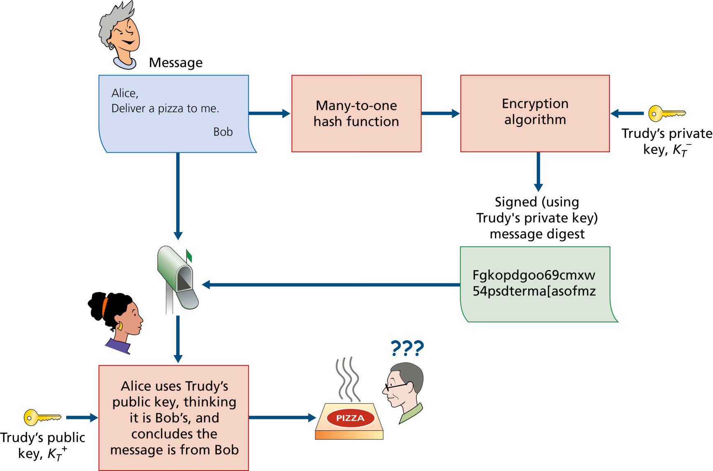

把公钥绑定到特定实体，通常由 **认证中心（CA，Certification Authority）** 完成。CA 的职责：① 验证实体的身份（验证的严格程度决定公钥的可信度——向「Fly-by-Night」这类松散 CA 声言「我是 Alice」就能拿到 Alice 身份的证书，则其签发的证书不值得信任；联邦/州级项目下的 CA 更可信）；② 身份验证通过后，CA 创建 **证书（certificate）**，把实体的公钥绑定到其身份上：证书包含该公钥、公钥所有者的全局唯一标识信息（如姓名或 IP 地址），并由 CA **数字签名**。图 8.14 展示了这一过程。

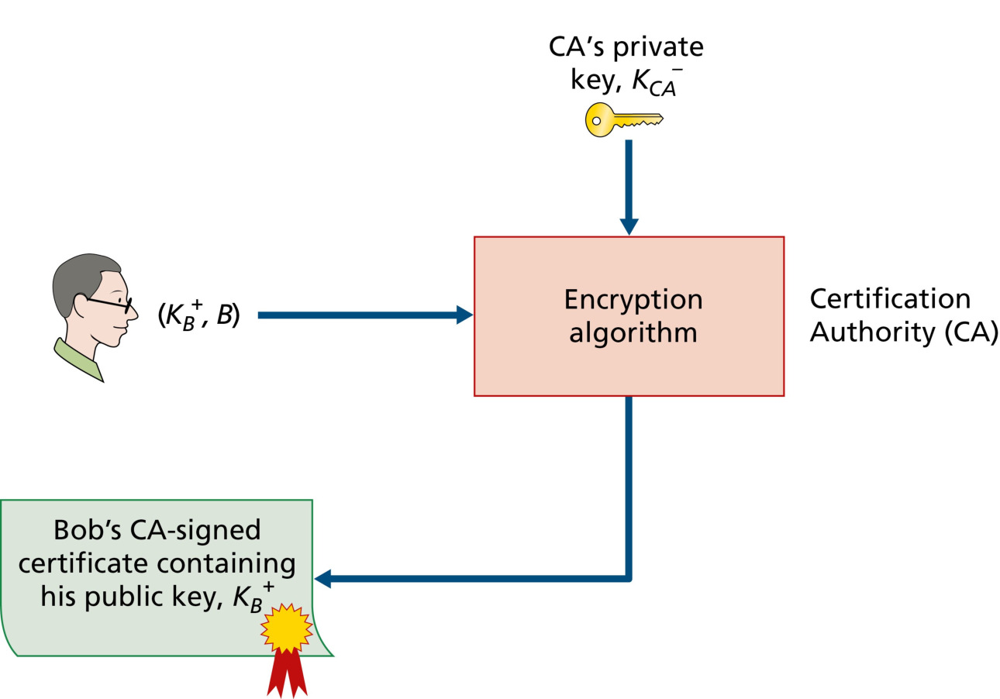

回到比萨例子：Bob 下单时附上 CA 签名的证书；Alice 用 **CA 的公钥** 验证证书有效，再从证书中取出 Bob 的真实公钥——Trudy 的骗局破产。ITU 与 IETF 都为 CA 制定了标准：**X.509**（ITU 认证服务与证书语法）与 RFC 1422（面向安全邮件的 CA 密钥管理）。X.509 证书的关键字段：

| 字段 | 说明 |
|:---|:---|
| Version | 规范版本号 |
| Serial number | CA 签发的证书唯一标识 |
| Signature | CA 签署本证书所用的算法 |
| Issuer name | 签发 CA 的身份（DN 格式） |
| Validity period | 证书有效期起止 |
| Subject name | 证书绑定实体（公钥所有者）的身份（DN 格式） |
| Subject public key | 持有者的公钥及所用公钥算法参数 |

---

## 8.4 端点认证

**端点认证（end-point authentication）** 是一方通过网络向另一方证明自己身份的过程，例如用户向邮件服务器证明「我是我自己」。

**核心概念③：端点认证** —— 一方在网络上证明自己是「活的、且确实是自称的那一方」；核心武器是 **nonce（一次性随机数）**：接收方出「新题」，声称方用共享密钥（或私钥）当场作答，同时证明「会密钥（身份）」与「能答新题（在线）」。

面对面时人脸、声音即可认证；在看不到对方的网络上，认证只能依赖 **认证协议（authentication protocol）** 交换的消息与数据。与第三章 rdt 协议一致，我们把认证协议逐步升级、逐个戳破漏洞。

**ap1.0：「我是 Alice」。** 最朴素的方案——Alice 发消息声明自己是 Alice。漏洞显而易见：Trudy 也能发同样的消息（图 8.15）。

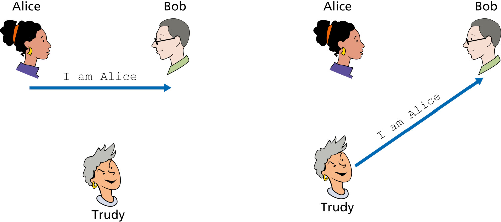


**ap2.0：检查源 IP 地址。** 若 Alice 总从某个已知 IP 地址通信，Bob 可验证认证消息所在 IP 数据报的源地址是否为 Alice 的地址。但这挡不住稍微用心的入侵者：**IP 伪装（IP spoofing）**——自己构造 IP 数据报、把源地址填成 Alice 的地址即可（图 8.16）。对策是让 Trudy 的第一跳路由器只转发源地址匹配的数据报（RFC 2827 入口过滤），但该能力并未普遍部署。

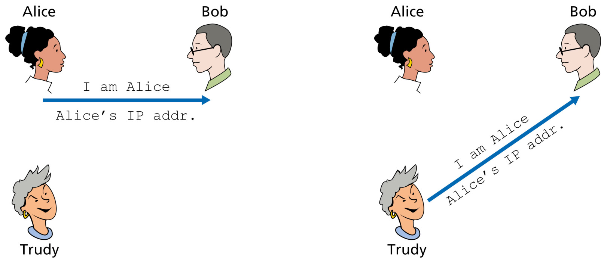


**ap3.0：发送密码。** Alice 把秘密密码发给 Bob（图 8.17）。Gmail、Facebook、telnet、FTP 都用密码认证，但它不安全：**Trudy 窃听就能学到密码**。现实中 telnet 登录密码明文传输，LAN 上任何人嗅探即可窃取。

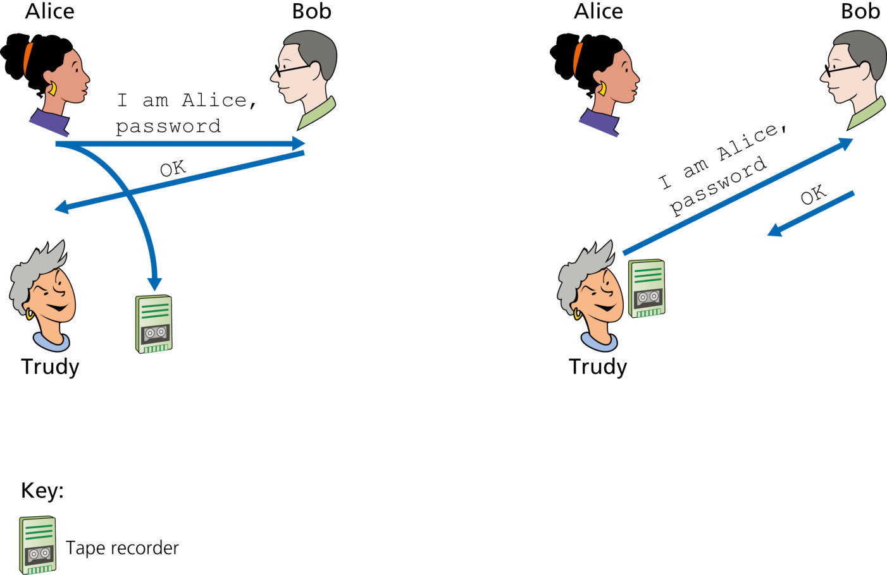

**ap3.1：加密密码。** 自然想到加密密码：Alice 与 Bob 共享对称密钥 K_AB，Alice 发送「我是 Alice」+ 用 K_AB 加密的密码。Trudy 确实学不到密码了，但 Bob 仍受 **重放攻击（playback attack）**：Trudy 只需窃听并记录加密密码，之后把记录的密文重放给 Bob，就能冒充 Alice。加密密码并没有比 ap3.0 好多少。

**ap4.0：一次性随机数 nonce。** 问题的根源：Bob 无法区分「Alice 此刻实时认证」与「之前认证记录的重放」——Bob 不知道 Alice 是不是「活的」。TCP 三次握手用类似手法解决「SYN 是否是旧副本」：服务器选一个很久未用的初始序号发给客户端，等待客户端回应携带该序号的 ACK。认证协议照搬这个思路。**nonce（一次性随机数）** 是协议一生只使用一次的数：

1. Alice 向 Bob 发送「我是 Alice」。
2. Bob 选一个 nonce R 发给 Alice。
3. Alice 用共享密钥 K_AB 加密 nonce，返回 K_AB(R)。
4. Bob 解密，若解密结果等于他发出的 R，则认证通过。

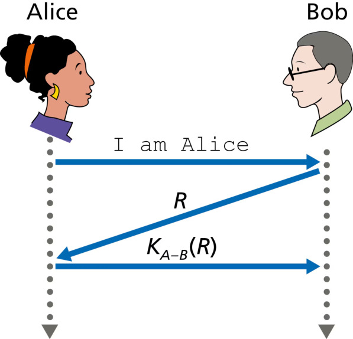

为什么有效？**nonce R 是一生只用一次的「新题」**：Alice 能回答，说明她掌握 K_AB（知道密钥）；她能当场回答 Bob 刚出的新题，说明她是「活的」（不是重放旧录音——旧录音里没有这个新 R）。**nonce + 共享密钥 = 同时证明「身份」（会密钥）与「在线」（能答新题）**。ap4.0 是端点认证的成熟形态；也可用公钥密码学替代对称密钥做 nonce 认证（用私钥对 nonce 签名），其正确性分析作为课后思考。

**五个协议演进小结：**

| 协议 | 机制 | 致命漏洞 |
|:---|:---|:---|
| ap1.0 | 声明「我是 Alice」 | 任何人可冒名 |
| ap2.0 | 检查源 IP | IP 伪装 |
| ap3.0 | 发送密码 | 窃听泄密 |
| ap3.1 | 加密密码 | 重放攻击 |
| ap4.0 | nonce + 共享密钥加密 | 无（防重放 + 证活） |

---

## 8.5 邮件安全与 PGP

前几节把安全工具备齐了：对称/公钥密码、端点认证、密钥分发、消息完整性、数字签名。现在看这些工具如何在因特网各层落地。**安全功能可以在协议栈任意一层提供**：应用层提供（某特定应用受益）、传输层提供（所有使用该传输协议的应用受益）、网络层提供（主机到主机、所有传输层报文段受益）、链路层提供（链路上所有帧受益）。为什么不在网络层一劳永逸？① 网络层安全能提供「毯式覆盖」（加密数据报中全部数据、认证源 IP），但 **无法提供用户级安全**——电商网站不能靠 IP 层安全认证购物客户；② 高层安全服务更易部署（如 PGP 只需客户端与服务端应用代码）。

**安全邮件的需求：** 用 Alice 与 Bob 的恋情开场。Alice 要给 Bob 发邮件，理想的安全邮件系统应提供：① **机密性**——Trudy 读不到；② **发送者认证**——Bob 能确认消息来自 Alice；③ **消息完整性**——途中不被修改；④ **接收者认证**——Alice 确认收件人真是 Bob。

**第一步：机密性（图 8.19）。** 直接方案是用对称密钥加密消息。但对称密钥分发困难；改用公钥加密，效率又低（尤其长消息）。于是组合出经典方案——**会话密钥**：

1. Alice 随机选一个对称会话密钥 K_s；
2. 用 K_s 加密消息 m（对称算法，快）；
3. 用 Bob 的公钥加密 K_s（RSA，只加密一小段）；
4. 拼接「加密消息 + 加密会话密钥」成包发给 Bob。

Bob 收包后：用私钥解出 K_s，再用 K_s 解出消息。**对称算法负责大数据量，公钥算法只负责密钥传输**——这正是 8.2 节会话密钥思想的落地。

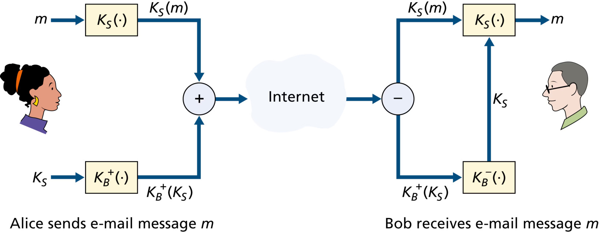


**第二步：发送者认证 + 消息完整性（图 8.20）。** 假设不再关心机密性，只关心「消息是 Alice 发的、没被改过」。用哈希 + 数字签名：

1. Alice 对消息 m 计算摘要 H(m)（如 MD5）；
2. 用 **自己的私钥** 签名摘要：K_Alice⁻(H(m))；
3. 拼接「明文消息 + 签名」成包发出。

Bob 收到后：用 Alice 的公钥解出摘要，与自己对消息算的 H(m) 对比；一致则消息来自 Alice 且未篡改。

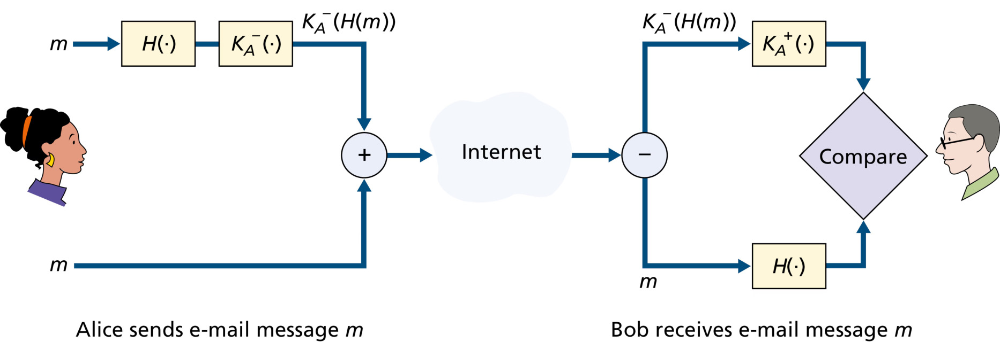


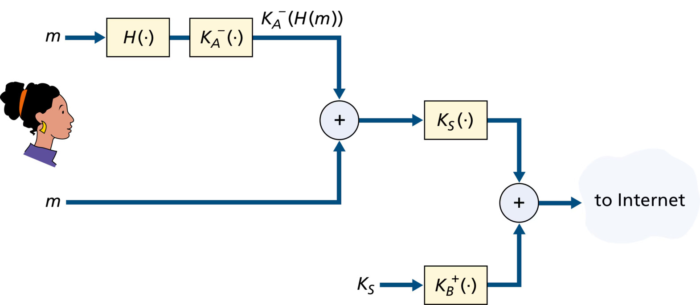

**第三步：综合（图 8.21）。** 把前两步级联即可同时获得机密性 + 发送者认证 + 消息完整性：Alice **先做图 8.20 的包**（原文 + 数字签名），把整个包当作新消息，**再做图 8.19 的流程**（会话密钥加密 + 公钥加密会话密钥）。Bob 先解图 8.19 再验图 8.20——Alice 与 Bob 各用两次公钥密码。此方案仍有遗留问题：**公钥分发**——若 Trudy 冒充 Bob 塞给 Alice 自己的公钥，机密性即告破；答案就是 8.3 节的 **CA 证书**。


**PGP（Pretty Good Privacy，优良保密协议）：** Phil Zimmermann 于 1991 年编写的邮件加密方案，本质就是图 8.21 的设计。依版本不同，PGP 用 MD5 或 SHA 算摘要、CAST/3DES/IDEA 做对称加密、RSA 做公钥加密。安装 PGP 时软件为用户生成公私钥对：公钥可发布到网站或公钥服务器，私钥用密码保护。图 8.22 是一封 PGP 签名消息（出现在 MIME 头之后，编码数据即数字签名的摘要），图 8.23 是一封 PGP 秘密消息（明文不包含在内）；当发送方既要机密性又要完整性时，PGP 把图 8.23 的秘密消息嵌套进图 8.22 的签名消息中。

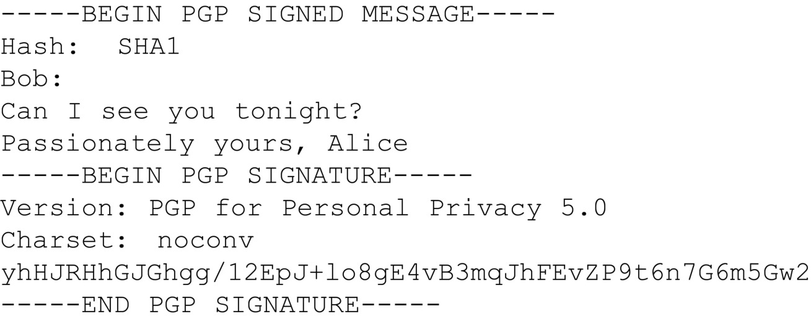


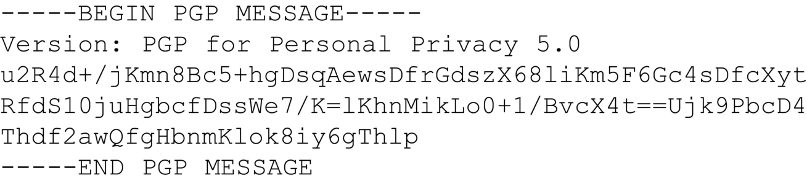


PGP 的公钥认证机制与常规 CA 不同，采用 **信任网（web of trust）**：Alice 自己可认证任何「密钥/用户名」配对，也可声明信任某用户为更多密钥担保；用户通过 **密钥签名聚会** 线下互换公钥、互签证书。信任网把「信任」分散到社交网络而非集中到 CA。OpenPGP（RFC 9580）是 Zimmermann 原作的开放后继，为邮件与数据文件提供机密性、数字签名与消息完整性。

---

## 8.6 传输层安全：TLS

**核心概念④：传输层安全（TLS）** —— 为 TCP/HTTP 之上提供机密性、数据完整性与端点认证的协议族；三阶段架构（握手、密钥派生、数据传输）与「证书验证 + 预主密钥 → 主密钥 → 会话密钥」的密钥层次，是 408 通用知识重点。

严格地说 TLS 是应用层协议（运行于客户/服务器进程之间），传统上运行在 TCP 之上，如今也随 QUIC 运行在 UDP 之上。它源于 Netscape 的 **SSL（Secure Socket Layer）**，现行版本 **TLS 1.3（RFC 8446）** 改进了握手速度（更少 RTT）并移除了过时算法。浏览器地址栏出现 "https:" 时，通信就在 TLS 之上。

**为什么需要 TLS？** 想象网上购物：Bob 在香水网站填写表单（香型、数量、地址、信用卡号）。若无安全措施：① 无机密性——入侵者截获订单拿到信用卡信息；② 无完整性——入侵者把订单改成 10 倍数量；③ 无服务器认证——显示该公司标志的网站其实是 Trudy 冒充的。TLS 正是为应用提供机密性、数据完整性、服务器认证（与可选客户端认证）的方案。

### 大图景：almost-TLS 的三阶段

先看简化版「almost-TLS」，它有三个阶段：**握手（handshake）、密钥派生（key derivation）、数据传输（data transfer）**。假设服务器 Alice 拥有公私钥对与绑定身份的证书。

**握手（图 8.24）：** Bob 需要 ① 与 Alice 建立 TCP 连接；② 验证 Alice 真是 Alice；③ 把 **主密钥（Master Secret，MS）** 送给 Alice——MS 将用于双方生成 TLS 会话所需的全部对称密钥。流程：TCP 连接建立后，Bob 发 hello 消息；Alice 回应证书（含其公钥，经 CA 认证，Bob 确信公钥属于 Alice）；Bob 生成本次会话专用的 MS，用 Alice 的公钥加密成 **加密主密钥（EMS，Encrypted Master Secret）** 发给 Alice；Alice 用私钥解密得 MS。此后双方（且仅双方）知道本次会话的 MS。


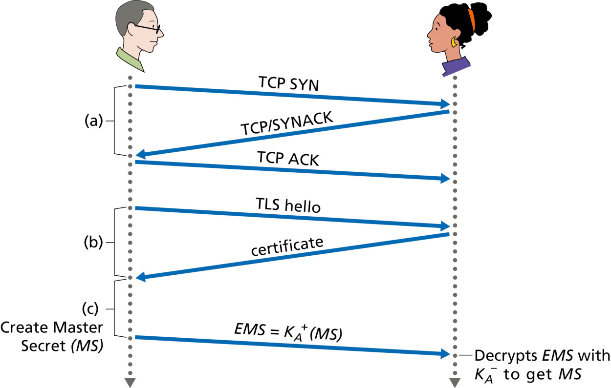

**密钥派生：** 原则上 MS 可直接充当所有加密与完整性检查的对称会话密钥，但更安全的做法是双方使用不同密钥、且加密与完整性检查用不同密钥。因此 Alice 与 Bob 各自从 MS 派生 **四个密钥**：

- K_e(B→A)：Bob 发往 Alice 数据的加密密钥；
- K_m(B→A)：Bob 发往 Alice 数据的 HMAC 密钥；
- K_e(A→B)：Alice 发往 Bob 数据的加密密钥；
- K_m(A→B)：Alice 发往 Bob 数据的 HMAC 密钥。

（现实中派生用密钥导出函数，比简单切分复杂。）派生结束，双方各持四把密钥：两把加密、两把校验完整性。

**数据传输：** TCP 是字节流协议，理想做法是边加密边传给 TCP——但 HMAC 放哪？总不能等整个会话结束再验完整性。方案：**把数据流切成记录（record），每条记录附加 HMAC 再加密**。Bob 把记录数据与 K_m(B→A) 送入哈希函数生成 HMAC，再用 K_e(B→A) 加密「记录 + HMAC」交给 TCP；接收方逐记录解密、验 HMAC。

**防重排/重放：** 仅靠逐记录 HMAC 还不够。若 Trudy 是中间人，能插入、删除、替换 TCP 报文段——例如把 Bob 发的两条记录顺序颠倒并修正 TCP 序号，Alice 的 TLS 逐条验证都通过，但应用层收到的字节流顺序错了。**解决方案是序号**：Bob 维护一个从 0 开始、每条记录递增的计数器；**序号不放进记录，但参与 HMAC 计算**（HMAC = 哈希(记录数据 + HMAC 密钥 + 当前序号)）。Alice 跟踪 Bob 的序号，验证时带入对应序号；Trudy 重排或重放记录，序号对不上，完整性检查失败。

**记录格式（图 8.25）：** almost-TLS 记录由 **类型（type）、版本（version）、长度（length）**（前三个字段不加密）、**数据（data）** 与 **HMAC** 组成。type 字段标识记录是握手消息还是应用数据（也用于关闭连接）；length 供接收方从 TCP 字节流中切出记录。

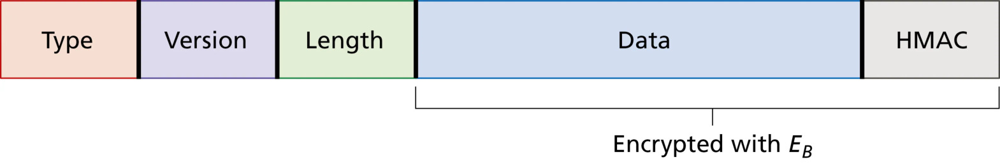

### 更完整的图景：TLS 1.3

TLS 从 1.0 演进到 1.3（RFC 8446），改进方向有二：修复旧版本安全缺陷、减少建立连接所需 RTT。目标不变——提供机密性、数据完整性与认证。

**TLS 1.3 握手（图 8.26）：** 握手的目标是让客户端与服务器安全地协商 **密码套件（cipher suite）**、完成认证、并协商出新的共享 **主密钥（临时密钥 ephemeral key）**，再由它派生会话期其他密钥。密码套件由两部分组成：① 生成主密钥所用的密钥交换技术（TLS 1.3 一律用 Diffie-Hellman 变体）与派生密钥所用的 SHA 哈希算法；② 数据传输所用的 **AEAD（带关联数据的认证加密，Authenticated Encryption with Associated Data）** 算法——用 AES 或 ChaCha20 一次同时提供机密性与完整性（不再需要独立显式 HMAC 字段）。

1. **ClientHello：** 客户端发送 TLS 版本号、密码套件选项与参数、以及一个 **nonce**（防重放），并附客户端 DH 密钥协商所需的公开值。
2. **ServerHello 与 Finished：** 服务器回应所选密码套件、**证书**、服务器 nonce，并附上自己的 DH 公开值。服务器用客户端的公开 DH 值与自己的私有 DH 值立刻生成共享主密钥——发完 hello 即可生成 MS，无需再等客户端。
3. **ClientFinished：** 客户端验证服务器证书与签名，用自己私有的 DH 值与收到的服务器公开 DH 值生成同一份 MS；Finished 携带「ClientHello + ServerHello」的签名哈希，证明握手消息完整无篡改，且其本身用从 MS 派生的密钥加密并签名。

客户端发出 Finished 后，**立刻可以发送应用消息**（如 HTTP GET）。**整个握手只需 1 个 RTT**（早期 TLS 版本需要 2 个以上）——这是 TLS 1.3 的关键性能改进。注意：TLS 跑在 TCP 上时，TCP 连接建立还要 1 个 RTT，总计 2 个 RTT 后才能发首个 HTTP 请求；而 QUIC 把 ClientHello 融入建连消息（基于 UDP），只需 1 个 RTT；若双方此前已通信并约定过参数，QUIC 甚至能做到 **0-RTT**（立即发送受 TLS 保护的数据）。

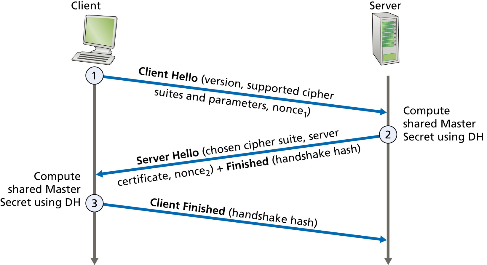

下面用时序图直观呈现 TLS 1.3 的握手过程（简化示意）：

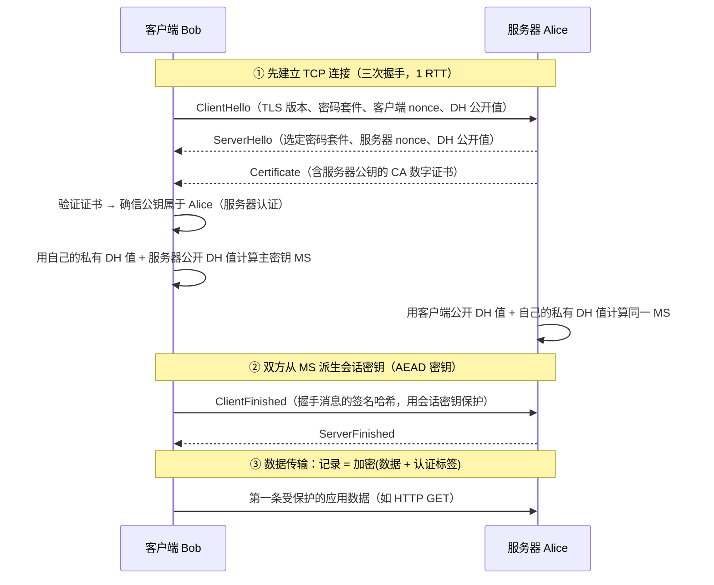
```mermaid
sequenceDiagram
    participant C as 客户端 Bob
    participant S as 服务器 Alice
    Note over C,S: ① 先建立 TCP 连接（三次握手，1 RTT）
    C->>S: ClientHello（TLS 版本、密码套件、客户端 nonce、DH 公开值）
    S-->>C: ServerHello（选定密码套件、服务器 nonce、DH 公开值）
    S-->>C: Certificate（含服务器公钥的 CA 数字证书）
    C->>C: 验证证书 → 确信公钥属于 Alice（服务器认证）
    C->>C: 用自己的私有 DH 值 + 服务器公开 DH 值计算主密钥 MS
    S->>S: 用客户端公开 DH 值 + 自己的私有 DH 值计算同一 MS
    Note over C,S: ② 双方从 MS 派生会话密钥（AEAD 密钥）
    C->>S: ClientFinished（握手消息的签名哈希，用会话密钥保护）
    S-->>C: ServerFinished
    Note over C,S: ③ 数据传输：记录 = 加密(数据 + 认证标签)
    C->>S: 第一条受保护的应用数据（如 HTTP GET）
```

**为什么 TLS 握手要用 nonce？** 序号只能防「会话内」报文重放，防不住 **连接重放攻击（connection replay attack）**：假设 Trudy 嗅探了 Alice 与 Bob 前一天的全部消息，次日冒充 Bob 把同一序列的消息原样发给 Alice。若 Alice 不用 nonce，她将原样回复前一天的消息序列，每条都能通过完整性检查——若 Alice 是电商服务器，她会以为 Bob 又下了一单。引入 nonce 后，Alice 每个 TCP 会话用不同 nonce，两天的加密密钥不同，Trudy 重放的 TLS 记录全部无法通过完整性检查。**总结：nonce 防「连接重放」，序号防「会话内单报文重放」。**

**连接关闭与截断攻击：** 若 Bob 想结束 TLS 会话而直接发 TCP FIN 关闭底层连接，就会埋下 **截断攻击（truncation attack）** 的隐患：Trudy 中途插入、提前以 FIN 结束会话，Alice 以为收到全部数据、实际只收到一部分。对策：在 **type 字段** 中标明该记录用于终止 TLS 会话；Alice 若在收到「关闭记录」前就收到 TCP FIN，即知出了问题。

!!! example "例题 4：TLS 握手流程描述"

    简述 TLS 中客户端 Bob 与服务器 Alice 完成一次安全会话建立的全部关键步骤，要求涵盖：TCP 连接、证书验证、主密钥协商、会话密钥派生、第一条受保护的应用数据何时可以发送。

    ??? answer "查看答案"
        **① 建立 TCP 连接：** Bob 与 Alice 先完成三次握手建立 TCP 连接（TLS 跑在 TCP 之上时必做；TLS 1.3 握手本身 1 个 RTT，加上 TCP 共 2 个 RTT；QUIC 场景下可降到 1 甚至 0 RTT）。

        **② ClientHello：** Bob 发送 ClientHello，包含 TLS 版本号、密码套件选项与客户端 nonce（防连接重放），以及客户端 DH 公开值。

        **③ ServerHello 与证书：** Alice 选择密码套件，回应 ServerHello（含服务器 nonce、服务器 DH 公开值）与 **数字证书**（内含 Alice 公钥，由 CA 签名）。Bob 用 CA 公钥验证证书有效性，提取出 Alice 的公钥——**服务器认证** 完成。

        **④ 主密钥协商：** 双方各自用自己的私有 DH 值与对方公开 DH 值计算出同一个共享主密钥 MS（almost-TLS 简化版是 Bob 生成 MS、用 Alice 公钥加密成 EMS 发给 Alice；真实 TLS 1.3 用 DH 协商，双方各自独立算出 MS，主密钥从不在网上传输）。

        **⑤ 会话密钥派生：** 双方从 MS 派生会话密钥——almost-TLS 派生四把密钥（每方向一把加密密钥 + 一把 HMAC 密钥）；TLS 1.3 用 AEAD，一把密钥同时提供加密与完整性。双方交换 Finished 消息，其中的握手消息签名哈希证明握手消息未被篡改。

        **⑥ 发送数据：** ClientFinished 发出后 Bob **立即** 可以发送第一条受保护的应用数据（如 HTTP GET），服务器响应同样受 TLS 保护。此后每条数据都是一个记录：明文头部（类型/版本/长度）+ 加密后的（数据 + 完整性标签）。

    ??? success "评分标准"

        - TCP 连接与 RTT 开销说明（2 分）
        - ClientHello/ServerHello 内容与 nonce 作用（3 分）
        - 证书验证与服务器认证（3 分）
        - 主密钥协商方式（DH 或 EMS）（3 分）
        - 会话密钥派生与 Finished（3 分）
        - 第一条应用数据的时机（2 分）

---

## 8.7 网络层安全：IPsec 与 VPN

**核心概念⑤：IPsec 与防火墙（运行安全）** —— 网络层安全方案 IPsec 用 ESP 协议在隧道模式下提供「毯式覆盖」的机密性 + 源认证 + 数据完整性 + 防重放，靠 SA/SPI/SAD 管理安全关联；运行安全（8.9 节）则用防火墙与 IDS 在组织边界处阻挡攻击。

**IPsec（IP Security Protocol，IP 安全协议）** 在网络层提供安全：为任意两个网络层实体（主机与路由器）之间的 IP 数据报提供安全服务。许多机构用 IPsec 在公共因特网上构建 **虚拟专用网（VPN，Virtual Private Network）**。网络层机密性的含义：发送实体加密其发给接收实体的所有数据报的载荷（可以是 TCP/UDP 报文段、ICMP 消息等）。若此类服务就位，两实体间传输的所有数据（邮件、网页、TCP 握手消息、ICMP/SNMP 管理消息）都对嗅探者隐藏——这就是网络层安全的 **「毯式覆盖」（blanket coverage）**。此外还能提供源认证、数据完整性、防重放。

### IPsec 与 VPN

机构跨多个地理区域时，往往希望拥有自己的 IP 网络，让内部主机与服务器安全机密地互传数据。机构可以部署与公共因特网完全隔离的独立物理网络——即 **专用网络（private network）**，但成本极高。于是许多机构选择在公共因特网上构建 VPN：**机构内部办公室之间的流量仍走公共因特网，但在进入因特网之前加密**。


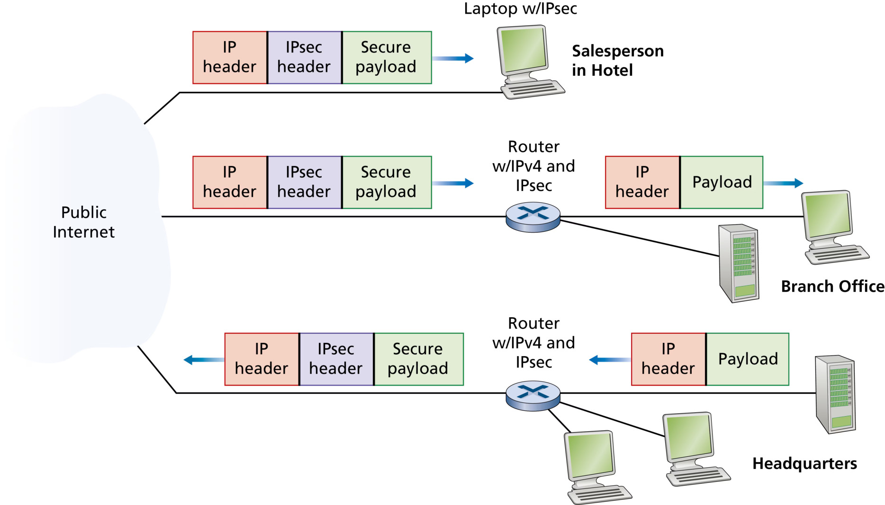

图 8.27 是一个简单 VPN 例子：机构由总部、分部与出差销售人员（酒店上网）组成。总部内部、分部内部互发时用普通（vanilla，不含 IPsec 服务）数据报；但 **任何途经公共因特网的机构流量，进入因特网前都要加密**。总部主机发数据报给酒店里的销售人员时，总部的 **网关路由器** 把普通数据报转换为 IPsec 数据报再转发进因特网——该数据报带传统 IP 首部，公共因特网的路由器把它当作普通数据报处理；但其载荷含 IPsec 首部且已加密。数据报到达销售人员笔记本后，操作系统解密载荷、验证完整性，再把未加密载荷交给上层协议（TCP 或 UDP）。

### AH 与 ESP 协议

IPsec 协议套件由两个主要协议组成：**认证头（AH，Authentication Header）** 与 **封装安全载荷（ESP，Encapsulation Security Payload）**。源 IPsec 实体向目的实体发送安全数据报时，使用两者之一：

- **AH 协议**：提供 **源认证与数据完整性，但不提供机密性**。
- **ESP 协议**：提供 **源认证、数据完整性，以及机密性**（加密）。

因为机密性对 VPN 及其他 IPsec 应用至关重要，**ESP 远比 AH 常用**。本书聚焦 ESP。

### 安全关联（SA）

IPsec 数据报在成对的网络实体之间发送（主机到主机、路由器到路由器、主机到路由器）。发送之前，源与目的实体先建立一条网络层逻辑连接——**安全关联（SA，Security Association）**。**SA 是单工（simplex）逻辑连接：单向的**；双方都要互发安全数据报时，需建立两个 SA（每方向一个）——回顾图 8.27 的 VPN：总部与分部之间两个 SA，总部与每个销售人员的笔记本之间也是两个 SA。**记住：每个方向一个 SA**。

以路由器 R1 到路由器 R2 的 SA 为例（图 8.28），R1 为这条 SA 维护的状态信息包括：

- SA 的标识符：**安全参数索引（SPI，Security Parameter Index）**；
- SA 的源接口与目的接口；
- 所用加密类型（如带 CBC 的 3DES）与 **加密密钥**；
- 所用完整性检查类型（如 HMAC 配合 SHA）与 **认证密钥**。

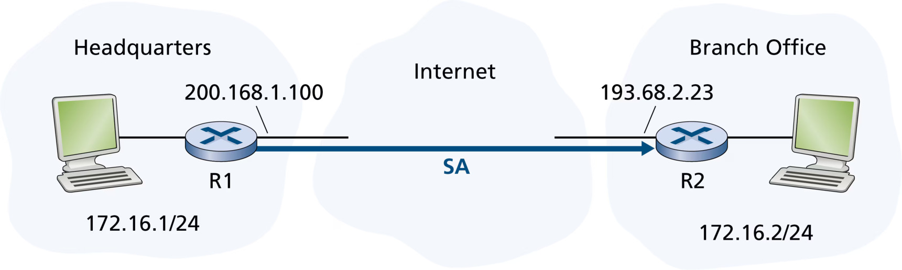

R1 构造 IPsec 数据报时查阅这些状态决定如何认证与加密；R2 维护同样状态用于认证与解密。一个 IPsec 实体常为多个 SA 维护状态（VPN 示例中总部网关路由器即是），这些状态存放在操作系统内核的 **安全关联数据库（SAD，Security Association Database）** 中。

### IPsec 数据报：隧道模式与 ESP 封装

IPsec 有两种报文形式：**隧道模式（tunnel mode）** 与 **传输模式（transport mode）**。隧道模式更适合 VPN、部署更广，本书聚焦之。

隧道模式下，R1 把来自总部主机 A、发往分部主机 B 的「原始数据报」转换为 IPsec 数据报的 **配方**（图 8.29）：

1. 在原始数据报（含原始首部字段）**尾部** 附加 **ESP 尾部（ESP trailer）**：由 **填充（padding）、填充长度（pad length）、下一首部（next header）** 组成。填充使待加密消息成为块长度的整数倍（块密码要求）；填充长度告知接收方移除多少填充；下一首部标识载荷数据类型（如 UDP）。
2. 用 SA 指定的算法与密钥 **加密**「原始数据报 + ESP 尾部」。
3. 在加密单元 **前面** 附加 **ESP 首部（ESP header）**：由 **SPI** 与 **序号** 两个字段组成（明文发送）。SPI 让接收方确定数据报属于哪个 SA（据此索引 SAD 找到认证/解密算法与密钥）；序号字段用于防御重放攻击。
4. 对整体「enchilada」（ESP 首部 + 加密单元）用 SA 指定的算法与密钥计算 **认证 MAC**，附加到尾部形成载荷。
5. 最后在最前面附加一个 **全新的 IP 首部**：源/目的地址设为隧道两端路由器接口的地址（R1 与 R2），**协议号设为 50**，表示该数据报是使用 ESP 的 IPsec 数据报。

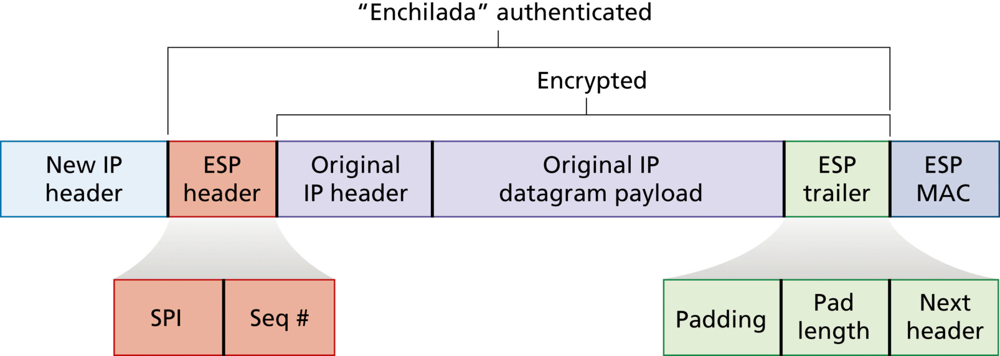

封装结果：IPsec 数据报是一个货真价实的数据报——传统 IPv4 首部 + 载荷；载荷含 ESP 首部、原始 IP 数据报、ESP 尾部与 ESP 认证字段（原始数据报与 ESP 尾部被加密）。**原始数据报的源/目的 IP 地址、协议号都被加密在载荷里**——Trudy 只能看到隧道端点 R1/R2 的地址。这正是 IPsec「毯式覆盖」比 TLS 走得更远之处。

**接收端 R2 的处理**（六步）：看到目的地址是自己且协议号为 50 → 用 SPI 确定 SA → 计算并验证 MAC（确认来自 R1 且未被篡改）→ 检查序号防重放 → 用 SA 的算法与密钥解密 → 移除填充、取出原始 IP 数据报 → 转发进分部网络（隧道模式下加密的是完整原始 IP 数据报，需再次转发）。

**SPD 与 SAD 的分工**：R1 收到目的地在总部之外的普通数据报时，如何知道该不该做 IPsec 处理、用哪个 SA？IPsec 实体除 SAD 外还维护 **安全策略数据库（SPD，Security Policy Database）**：SPD 指明哪些数据报（按源/目的 IP、协议类型）要做 IPsec 处理、用哪个 SA——**SPD 决定「做什么」，SAD 决定「怎么做」**。

**IPsec 提供的服务（Trudy 视角）**：① 机密性——看不到原始数据报，连协议号、源/目的 IP 都看不到，只知道数据报从 R1 发往 R2；② 完整性——翻转比特会在 R2 的 MAC 校验处失败；③ 源认证——冒充 R1 构造数据报同样过不了 MAC 校验；④ 防重放——序号机制让重放失败。

### IKE：IPsec 的密钥管理

小规模 VPN（如仅两台路由器）可由网络管理员 **手工配置** SA 信息（算法、密钥、SPI 录入 SAD）。但大规模 VPN（成百上千台设备）必须自动化创建 SA——由 **因特网密钥交换（IKE，Internet Key Exchange）协议**（RFC 5996）完成。

IKE 与 TLS 握手有相似之处：每个 IPsec 实体持有含公钥的证书；两实体交换证书、协商算法、安全交换密钥材料以创建 IPsec SA 的会话密钥。**与 TLS 不同，IKE 分两个阶段**：

- **阶段 1（两对消息交换）**：第一对消息用 **Diffie-Hellman** 在两路由器之间创建**双向的 IKE SA**——一条已认证且加密的通道，同时确立 IKE SA 的加密/认证密钥与一个主秘密（供阶段 2 计算 IPsec SA 密钥）；此阶段**不使用 RSA 公私钥**，双方不暴露身份。第二对消息中，双方**用自己的私钥签名消息来揭示身份**（经 IKE SA 加密通道传输，被动嗅探者看不到身份），并协商 IPsec SA 将采用的加密与认证算法。
- **阶段 2**：为两个方向各创建一个 IPsec SA，确立两个 SA 的加密/认证会话密钥，此后即可按 8.7.4 节发送安全数据报。**两阶段设计的主要动机是计算成本**：阶段 2 不涉及任何公钥密码运算，IKE 能以很低的计算开销在两实体间生成大量 SA。

---

## 8.8 无线与 5G 安全

安全在无线网络中尤其重要：攻击者只需把接收设备放在发送方传输范围内即可嗅探帧——无线局域网与蜂窝网络皆然。两者都大量使用本章学过的技术：用 nonce 做认证、用密码学哈希做完整性、推导共享对称密钥加密用户会话数据、广泛使用 AES。无线安全协议也在不断演化（研究者与黑客互相发现弱点与漏洞）。

**802.11 无线局域网的两大关键安全需求：**

- **相互认证（mutual authentication）**：移动设备入网前，网络要认证设备身份与访问权限；**反过来设备也要认证网络**——确保加入的确实是自己想加入的网络（防止「邪恶双胞胎」假 AP）。
- **加密**：无线信道可被嗅探与操纵，用户数据帧必须加密。实践中用对称加密（加解密要高速），设备与 AP 需要推导出对称加解密密钥。

### WPA3-Personal：个人场景认证（SAE）

个人场景（家庭、咖啡馆、小办公室）中，客户端直接与 AP 认证。**WPA3-Personal**（Wi-Fi 联盟安全认证项目，2018 年起 WiFi 认证设备必须支持）采用基于密码的认证：同一网络的所有设备共享同一个密码。具体认证协议称为 **SAE（同时认证对等方，Simultaneous Authentication of Equals）**，使用四步 **Dragonfly 密钥交换**（RFC 7664）：

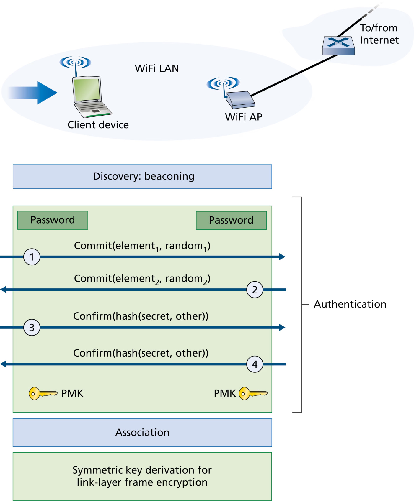

1. **Client commit（客户端提交）**：客户端用密码（SAE 术语中的「共享秘密」）生成一个元素（从元素值无法反推密码），并创建随机值作为 nonce，随其他值在 SAE commit 消息中发给 AP。
2. **AP commit（AP 提交）**：AP 收到后，因知道共享秘密，可判定创建元素的客户端确实知道共享秘密；AP 同样生成元素与 nonce，在 SAE commit 消息中发回。
3. **Client confirm（客户端确认）**：客户端据此确认 AP 知道共享秘密；为防重放，客户端发送「共享秘密 + 之前交换值（含 nonce）」的哈希给 AP（SAE confirm 消息）。
4. **AP confirm（AP 确认）**：AP 检查收到的哈希，确认客户端正确哈希了各值，再把自己的哈希发回。

四步之后，客户端与 AP 相互认证——**双方都确认对方知道共享秘密，而共享秘密本身从未在网上传输**。随后双方基于共享秘密与 SAE 期间交换的随机值生成 **成对主密钥（PMK，Pairwise Master Key）**：每个客户端每次加入网络时生成的随机值不同，故每次生成不同 PMK（故又称「动态」密钥）。WLAN 关联之后，PMK 用于第二次握手（设备与 AP 之间），生成无线信道帧链路层加密所用的密钥。

### WPA3-Enterprise：企业场景认证（802.1X 与 EAP）

企业场景中，设备与 **集中式认证服务器** 认证（该服务器通常还提供对企业资源及 LAN/WLAN 的访问），**AP 只是客户端与认证服务器之间的透传（pass-through）**。IEEE **802.1X** 标准定义了设备经企业认证服务器认证的过程；框架内用 **可扩展认证协议（EAP，Extensible Authentication Protocol）** 提供认证。WPA3-Enterprise 认证即采纳 802.1X。

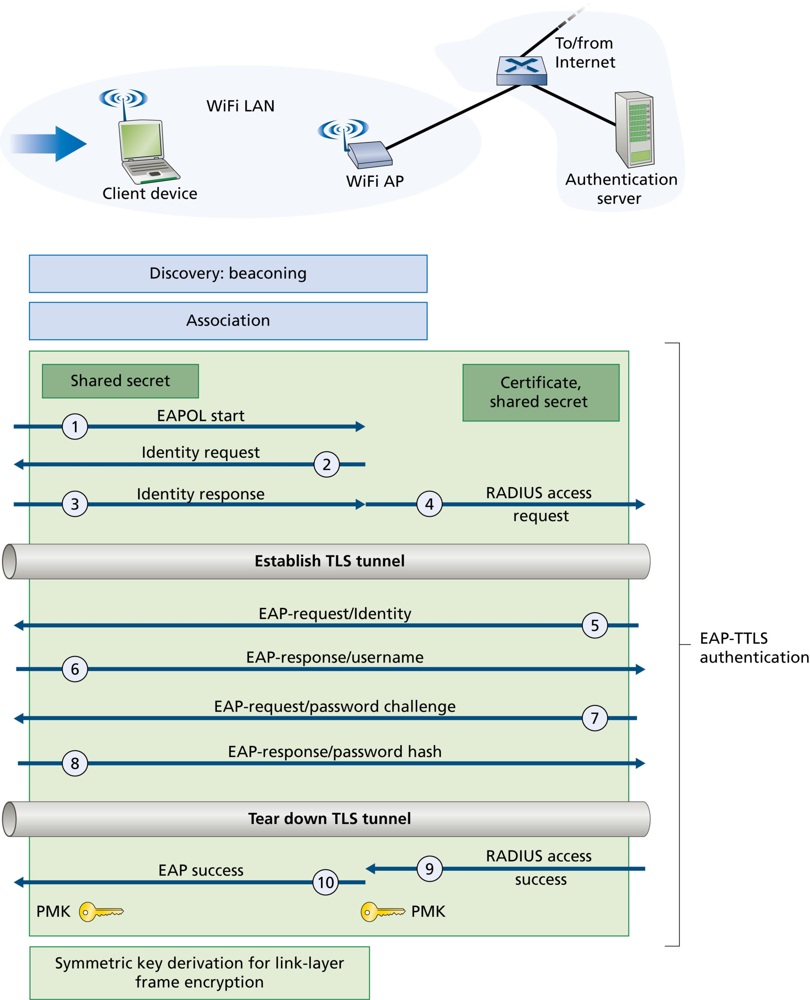


「可扩展」意味着 EAP 支持多种认证方法，802.1X 不指定用哪种；标准化方法有数十种，学术场景常见的是 **EAP-TTLS（EAP-Tunneled Transport Layer Security）**，如图 8.31 所示。大图景：信标与 WLAN 关联之后，认证发生在客户端与认证服务器之间，AP 只是透传。**EAP-TTLS 的核心是客户端与认证服务器之间建立一条 TLS 隧道**（用 8.6 节的 TLS），隧道保护最内层的 EAP-TTLS 步骤：

- 步骤 1-3：客户端告知 AP 想用 EAP 认证入网；AP 允许后请求并接收一个 **占位身份**——真实身份只在加密的 TLS 隧道内透露（保护用户隐私）。
- 步骤 4：AP 用 **RADIUS** 把客户端的入网请求中继给认证服务器。
- 步骤 5-8：TLS 隧道建立后，客户端已通过服务器证书认证了服务器、双方协商出共享秘密；但客户端尚未向服务器认证。此时认证服务器请求并接收客户端的真实身份与共享秘密（密码），验证通过后拆除 TLS 隧道，告知 AP 客户端已认证，并把 **PMK** 交给 AP——AP 与客户端（客户端也能自行推导出同一 PMK）据此建立无线信道的加密密钥。

**802.11 安全消息协议（图 8.32）：** EAP 定义移动设备与认证服务器之间请求/响应模式的端到端消息格式。EAP 消息在无线链路上用 **EAPoL（EAP over LAN）** 封装发送；AP 处解封装，再用 **RADIUS** 经 UDP/IP 发给认证服务器（RADIUS 非强制但事实上是标准组件；新标准 DIAMETER 未来有望取代）。


### 5G 蜂窝网络安全：EAP-AKA'

5G 的相互认证与密钥生成目标与 WiFi 相同：设备与基站需推导共享对称加密密钥来加密无线信道帧；网络要认证设备身份与权限，**设备也要认证网络**（有真实案例：恶意方运营流氓蜂窝基站引诱设备接入）。5G 认证（图 8.33，源图出自 3GPP TS 33.501）与 WPA3-Enterprise 有诸多相似：认证发生在设备与 **认证服务器** 之间，基站与拜访网络核心网只是透传；都用 **EAP** 承载认证消息（5G 常用 **EAP-AKA'**）；都用 **预共享秘密**（5G 中放在设备的 **SIM 卡** 与归属网络认证服务器中）；都借 TLS 安全传输认证消息。

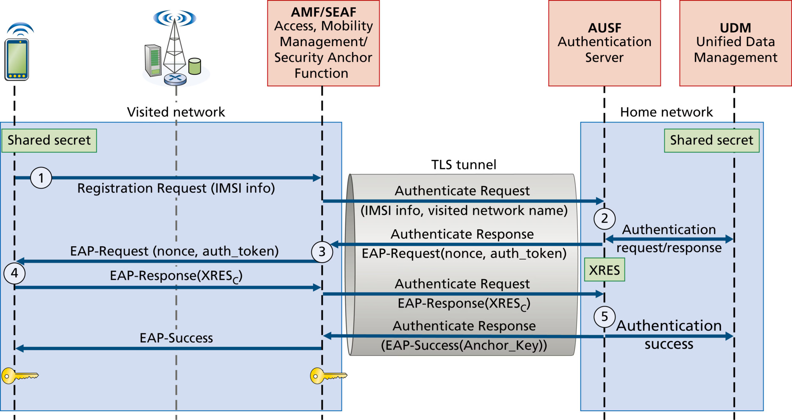

**关键区别：5G 有「归属网络（home network）」概念，WiFi 没有。** 认证决定由设备 **归属网络** 的 **认证服务器功能（AUSF，Authentication Server Function）** 做出，而非拜访网络——因为设备身份与密码信息只存放在两处：SIM 卡与归属网络。这是相对 4G（拜访网络承担更多角色）的重大变化，反映「只有归属网络才应被信任来使用、存储与管理敏感信息」的信念。5G 还引入 **SUCI（订阅隐藏标识）**：设备以加密后的 SUCI 替代明文 IMSI，防止入侵者经无线信道窃取用户身份（IMSI 捕捉攻击）。

**5G 认证步骤：**

1. 设备向拜访网络核心网的 **AMF（接入与移动性管理功能）** 发送注册请求，包含标识其归属网络的 **IMSI** 及其在归属网络中的身份。核心网的 **SEAF（安全锚功能）** 据此定位设备归属网络中的 AUSF；SEAF 先建立 TLS 隧道，保证二者之间消息被认证与加密。
2. **AUSF** 联系归属网络的 **UDM（统一数据管理功能）**，后者含用户 IMSI、加密密钥与服务授权信息。UDM 生成 **认证向量（AV）** 返回 AUSF，包含：一个随机 nonce；一个 **认证令牌**（由 UDM 计算、用设备密钥签名，供设备验证认证信息确实来自归属网络认证服务器且非重放）；以及 **XRES**（「期望响应」——认证服务器预期设备对 nonce 的计算结果，由 UDM 用 nonce 与设备共享密钥生成；设备与认证服务器是仅有的知道两者的一方，会算出相同的 XRES）。
3. 归属网络的认证服务器把 nonce 与认证令牌发给拜访网络的 SEAF，SEAF 透明转发给设备。
4. 设备收到 nonce 与认证令牌后，用 SIM 中的共享秘密验证令牌确实由归属网络认证服务器生成且非重放；再按 UDM 的同样过程自行计算响应值 XRES_C，经 EAP 消息经 SEAF 转发给认证服务器。
5. 认证服务器比对收到的 XRES_C 与先前算好的 XRES：**相等则认证设备通过**，通知拜访网络与归属网络 UDM。认证服务器还生成并向拜访网络发送**一次性使用的对称锚密钥（anchor key）**（由设备与认证服务器共享的秘密算出，设备也能自行算出）——锚密钥供设备、基站与拜访网络核心网计算会话所需的其他密钥（如加密密钥），作用类似 WiFi 认证中的 PMK。

（以上为主干步骤，实际规范还有附加参数与条件流程。）

---

## 8.9 运行安全：防火墙与 IDS

前文自底向上看完了各层的安全协议。但从网络管理员视角，世界干净地分成两派：**好家伙**（组织网络内部、应相对无约束访问内部资源的人）与 **坏家伙**（其他人，其访问必须被仔细审查）。在城堡里这是吊桥尽头的门岗，在公司大楼里这是前台安检；在计算机网络里，出入网络的流量被 **防火墙（firewall）**、**入侵检测系统（IDS）** 与 **入侵防御系统（IPS）** 这些运行设备安全检查、记录、丢弃或转发。

### 防火墙

**防火墙** 是隔离组织内部网络与外部因特网的软硬件组合，允许部分分组通过、阻挡其他分组，让管理员控制外界与受管网络资源之间的访问。防火墙有三大目标：

- **所有进出流量都必须经过防火墙**——放在网络单一接入点（图 8.34）便于管理与执行安全访问策略（大型组织可能用多层或分布式防火墙）。
- **只允许本地安全策略定义的授权流量通过。**
- **防火墙自身免疫于渗透**——它本身也是联网设备，设计或安装不当被攻破后，只会提供虚假的安全感（比没有更糟）。

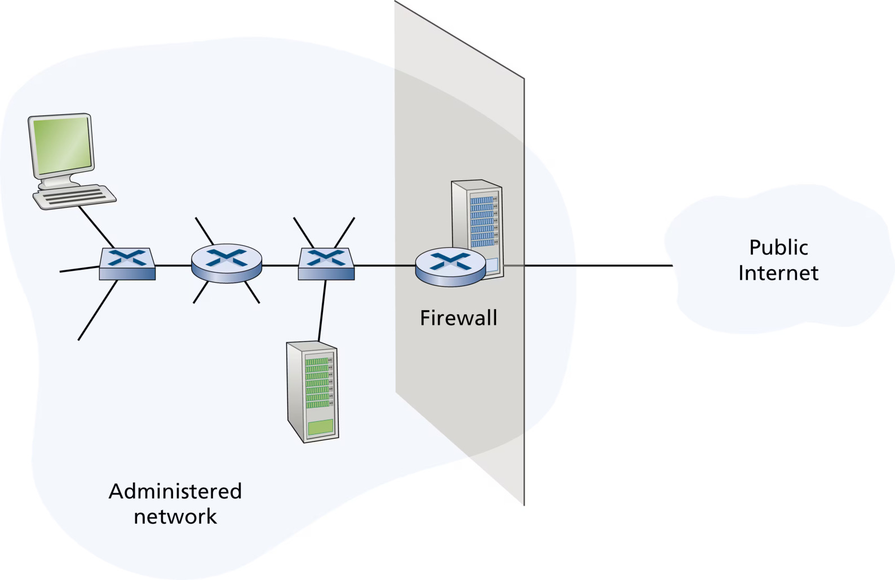


（Palo Alto Networks、Cisco 与 Check Point 是领先的防火墙厂商；如今防火墙也常实现在路由器中、用 SDN 远程控制。）防火墙分三类：**传统分组过滤（traditional packet filters）**、**状态过滤（stateful filters）** 与 **应用网关（application gateways）**。

#### 传统分组过滤

组织通常有连接内部网络与 ISP 的 **网关路由器**，进出内部网络的所有流量都经过它，分组过滤就发生在这台路由器上。**分组过滤器（packet filter）** 独立检查每个数据报，依据管理员配置的规则决定放行或丢弃。过滤决策通常基于：

- IP 源地址或目的地址；
- IP 数据报中的协议类型（TCP、UDP、ICMP、OSPF 等）；
- TCP 或 UDP 源端口与目的端口；
- TCP 标志位（SYN、ACK 等）；
- ICMP 消息类型；
- 进出网络方向的不同规则、不同路由器接口的不同规则。

管理员按组织策略配置防火墙（策略会考虑用户生产力、带宽占用与安全顾虑）。下表给出一些典型策略与对应的分组过滤设置（网络 130.207/16，Web 服务器 130.207.244.203）：

| 策略 | 防火墙设置 |
|:---|:---|
| 禁止外部 Web 访问 | 丢弃所有发往任意 IP、端口 80 的出站分组 |
| 禁止入站 TCP 连接（公共 Web 服务器除外） | 丢弃所有入站 TCP SYN 分组（目的为 130.207.244.203、端口 80 的除外） |
| 防止网络收音机吞噬带宽 | 丢弃所有入站 UDP 分组（DNS 分组除外） |
| 防止网络被用于 smurf DoS 攻击 | 丢弃所有发往广播地址的 ICMP ping 分组 |
| 防止网络被 traceroute | 丢弃所有出站 ICMP 超时（TTL expired）流量 |

过滤策略可基于地址与端口的组合：例如转发除特定 IP 地址表之外的所有 Telnet 数据报；也可基于 TCP ACK 位——想允许内部客户端连接外部服务器、却阻止外部客户端连接内部服务器时，只需过滤所有 ACK 位为 0 的入站报文段（回顾 3.5 节：TCP 连接的第一个报文段 ACK 位为 0，其余均为 1）。此策略杀死所有从外部发起的 TCP 连接，但放行内部发起的连接。

防火墙规则用 **访问控制列表（ACL，access control list）** 实现，每个路由器接口有自己的列表。下表是组织外部 ISP 接口的 ACL 示例（规则自上而下逐条应用）：前两条规则共同允许内部用户上网（放行目的端口 80 的出站 TCP + 源端口 80 且 ACK 位为 1 的入站 TCP——外部对内部建连的 TCP SYN 因 ACK 位为 0 被挡）；后两条允许 DNS 进出。总之这条相当严格的 ACL 只放行「内部发起的 Web 流量」与「DNS 流量」。

| 动作 | 源地址 | 目的地址 | 协议 | 源端口 | 目的端口 | 标志位 |
|:---|:---|:---|:---|:---|:---|:---|
| 允许 | 内部 | 外部 | TCP | 任意 | 80 | 任意 |
| 允许 | 外部 | 内部 | TCP | 80 | 任意 | ACK |
| 允许 | 内部 | 外部 | UDP | 任意 | 53 | — |
| 允许 | 外部 | 内部 | UDP | 53 | 任意 | — |

（熟悉第四章的读者会想起 4.4.3 节广义转发也用类似 ACL 构造分组过滤防火墙。）

#### 状态过滤

传统分组过滤对每个分组孤立决策。**状态过滤器（stateful filter）** 跟踪 TCP 连接，并利用该知识做过滤决策。再看上表 ACL：它仍允许任何「源端口 80 + ACK 位为 1」的外部分组通过——攻击者可用畸形分组击溃内部系统、DoS 或测绘内部网络。朴素对策是连 ACK 分组也挡，但那会阻止内部用户上网。

**状态过滤的解法**：在 **连接表（connection table）** 中跟踪所有进行中的 TCP 连接。防火墙通过观察三次握手（SYN、SYNACK、ACK）看到新连接开始、通过 FIN 看到连接结束，也可保守地假设连接超过约 60 秒无活动即结束。扩展后的 ACL 增加一列「检查连接」：对相应规则（如「允许外部 → 内部、源端口 80、ACK」）要求先查连接表再放行。于是：攻击者发送伪造源端口 80、ACK 位为 1 的入站畸形分组，查表发现不属于任何进行中连接，**拒绝**；内部用户上网时其 SYN 已被记录进连接表，Web 服务器回包（ACK 位必为 1）查表命中进行中连接，**放行**——既不干扰内部上网，又挡掉伪造 ACK 攻击。

#### 应用网关

分组级过滤只能按 IP/TCP/UDP 首部内容做粗粒度过滤。若组织想「只允许受限的内部用户组 SSH 出去」或「先认证再允许 SSH」——这些信息在应用层数据里，不在首部里。**应用网关（application gateway）** 看得更深入：它是应用专用的服务器，所有应用数据（入站与出站）都必须经它通过；多个应用网关可运行在同一台主机上，但每个是独立服务器、有独立进程。

设计一个「只允许受限内部用户 SSH 出去、禁止一切外部 SSH 进来」的防火墙（图 8.35）：路由器上的过滤器配置为 **阻止所有 SSH 连接，但源于应用网关 IP 的除外**——强制所有出站 SSH 连接都经过应用网关。内部用户想 SSH 出去：先与网关建立 Telnet 会话，网关提示输入用户 ID 与密码并检查权限（无权则终止）；有权则网关提示输入外部主机名、在网关与外部主机间建立 SSH 会话并中继双方数据——**应用网关既是 SSH 服务器又是 SSH 客户端**，还执行用户授权。注意过滤器放行第 2 步是因为连接由网关（而非内部用户）发起。


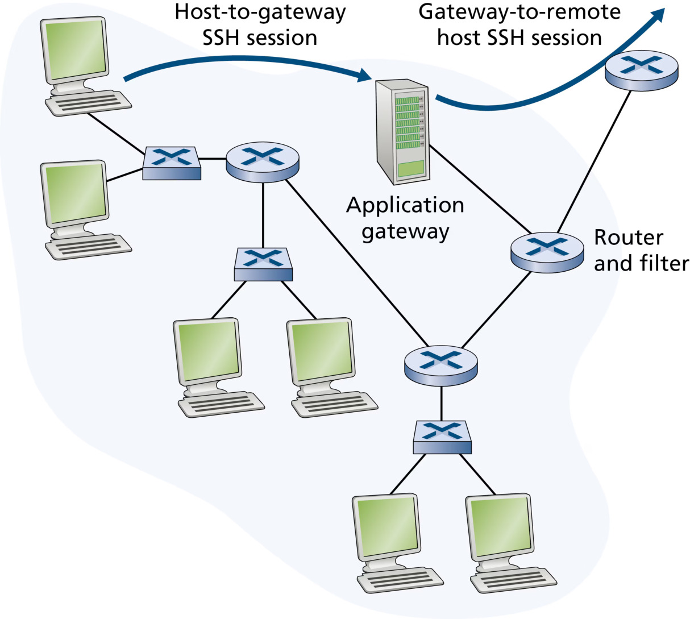

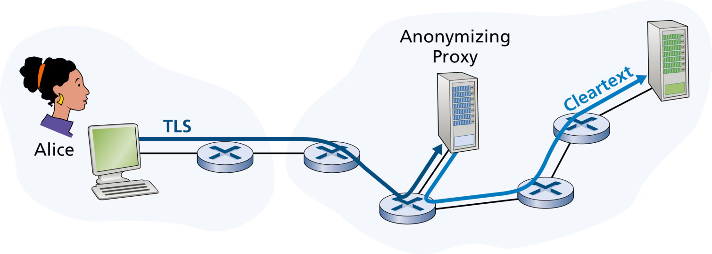

**应用网关的缺点**：每个应用需要独立网关；所有数据经网关中继，性能有代价（多用户/多应用共用时成为瓶颈）；客户端软件必须知道如何联系网关、如何告知网关要连接哪个外部服务器。

#### 案例研究：匿名性与隐私

假设你要访问一个有争议的网站，且 ① 不想让网站知道你的 IP 地址；② 不想让本地 ISP 知道你访问了该站；③ 不想让本地 ISP 看到你与该站交换的数据。直接连接（无加密）三条全不满足；即使使用 TLS，前两条也不满足——每个数据报的源 IP 都暴露给网站，本地 ISP 可嗅探每个分组的目地址。**解法：可信代理服务器 + TLS 的组合**（图 8.36）：先与可信代理建立 TLS 连接，再在 TLS 连接内发送对该站的 HTTP 请求；代理解密请求、以明文 HTTP 转发给网站；响应经 TLS 转发回给你。网站只见代理的 IP（匿名性达成）；你与代理之间全部加密（ISP 无法记录你访问的站与交换的数据）。


但此方案中 **代理知道一切**（你的 IP、你访问的站、全部明文流量），可靠性取决于代理的可信度。更稳健的方案是 **TOR**：把流量经 **一系列不串通（non-colluding）的代理服务器** 路由——TOR 从志愿者代理池中随机选 **三个代理组成链条**，客户端与服务器之间的全部流量经该链路由。假设代理互不串通，则没有人知道你的 IP 与目标网站之间发生过通信。

### 入侵检测系统（IDS）与入侵防御系统（IPS）

分组过滤器只检查 IP/TCP/UDP/ICMP 首部字段。要检测许多攻击类型，需要 **深度分组检测（deep packet inspection）**——越过首部、检查分组携带的实际应用数据。应用网关也做深度检测，但只针对特定应用。于是诞生了另一类设备：既检查所有经过它的分组首部，又做深度分组检测。当观察到可疑分组（或分组序列）时，它要么 **阻止** 这些分组进入组织网络，要么 **放行但向管理员告警**。

- **入侵检测系统（IDS，Intrusion Detection System）**：观察到潜在恶意流量时生成告警。
- **入侵防御系统（IPS，Intrusion Prevention System）**：过滤掉可疑流量。

二者最有意思的技术点相同——如何检测可疑流量（而非告警还是丢包），故合并讨论（下文统称 IDS）。IDS 能检测的攻击包括：网络测绘（如 nmap）、端口扫描、TCP 栈扫描、DoS 带宽洪水、蠕虫与病毒、操作系统漏洞攻击、应用漏洞攻击。成千上万的机构部署 IDS，既有商业产品，也有广受欢迎的公共领域系统 **Snort**。

**IDS 部署（图 8.37）：** 组织可在网络中部署一个或多个 **IDS 传感器（sensor）**，把可疑活动信息发给中央 IDS 处理器汇总并向管理员发告警。图 8.37 中组织把网络分成两个区域：**高安全区域**（受分组过滤器 + 应用网关保护，IDS 传感器监控）与 **低安全区域——非军事区（DMZ，demilitarized zone）**（只受分组过滤器保护，也由 IDS 传感器监控）；DMZ 包含需要与外界通信的组织服务器，如公共 Web 服务器与权威 DNS 服务器。为什么放多个传感器？因为 IDS 既要深度分组检测、又要与数以万计的「签名」比对，处理开销大；把传感器放得更靠下游，每个只见组织流量的一小部分，更容易跟上。


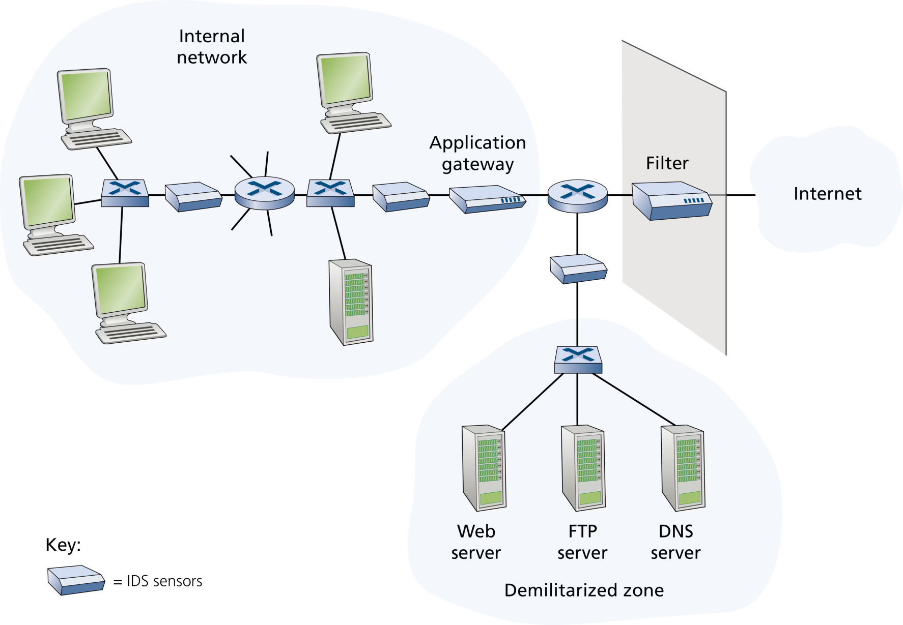

**IDS 分两大类：基于签名与基于异常。**

- **基于签名的 IDS（signature-based）**：维护大型 **攻击签名（signature）数据库**——可能是单个分组的特征列表（源/目的端口、协议类型、载荷中的特定比特串），也可能与分组序列有关。签名通常由研究已知攻击的安全工程师编写，管理员可定制或自建。运行时，IDS 嗅探每个经过的分组、与数据库中的签名比对；匹配则生成告警（邮件发管理员、发网管系统、或记录日志）。**局限**：① 需要事先知道攻击才能生成准确签名——对尚未记录的新攻击完全失明；② 签名匹配可能并非攻击所致，产生**误报**；③ 每个分组都要与海量签名比对，处理可能过载，反而漏检大量恶意分组。
- **基于异常的 IDS（anomaly-based）**：在正常运行的观察中建立 **流量画像（traffic profile）**，然后寻找统计上异常的报文流——例如异常高比例的 ICMP 分组、端口扫描与 ping 扫描的指数级增长。**优点**：不依赖对既有攻击的先验知识——可能检测到新的、未记录的攻击。**难点**：区分正常流量与统计异常流量极其困难。目前多数部署以基于签名为主，部分兼有基于异常特性。

**Snort 小例**：Snort 是公共领域开源 IDS（数十万部署，基于 Wireshark 同源的 libpcap 嗅探接口，轻松应对 100 Mbps 流量，吉比特级需多个传感器）。一条典型签名：

```text
alert icmp $EXTERNAL_NET any -> $HOME_NET any
(msg:"ICMP PING NMAP"; dsize: 0; itype: 8;)
```

该签名匹配「从外部网络进入组织网络的、类型 8（ICMP ping）、载荷为空」的任何 ICMP 分组——nmap 生成的 ping 分组恰好具有这些特征，故用于检测 nmap ping 扫描。匹配时 Snort 生成含消息 "ICMP PING NMAP" 的告警。Snort 社区签名数据库更新极快：新攻击出现后数小时内即发布签名并被数十万部署下载；管理员也可按 Snort 签名语法定制规则。

!!! warning "常见错误：防火墙、IDS 与 IPS 的辨析"

    - **防火墙**：按首部规则（地址、端口、协议、标志位）**主动阻止**分组进出（分组过滤/状态过滤/应用网关），不检测载荷内容。
    - **IDS**：做深度分组检测（检查载荷），发现可疑活动时 **只告警**，不阻止。
    - **IPS**：做深度分组检测，发现可疑流量时 **主动阻断**。
    - 一句话记忆：防火墙看「门禁」（放不放行），IDS 看「监控」（报警），IPS 看「安保」（拦截）。三者常组合部署（防火墙 + IDS 传感器 + 应用网关 + DMZ）。

---

## 8.10 小结

本章围绕秘密恋人 Alice 与 Bob 的安全通信展开。他们需要 **机密性**（只有彼此能读懂消息内容）、**端点认证**（确信在跟对方说话）、**消息完整性**（确信消息未被篡改）——而这些需求并不限于恋人：8.5-8.8 节显示，安全可以在网络体系结构的不同层提供。

本章第一部分讲述基本原则。8.2 节覆盖加解密密码技术，包括对称密钥密码学（DES 为代表）与公钥密码学（RSA 为代表）；8.3 节讨论消息完整性的两种方法——**消息认证码（MAC）** 与 **数字签名**：两者都用密码学哈希函数、都能验证消息来源与完整性；关键区别是 MAC 不依赖加密、数字签名需要公钥基础设施；数字签名还用于创建 **数字证书**。8.4 节研究端点认证，引入 **nonce** 抵御重放攻击。

8.5-8.8 节研究实际部署的安全协议：**对称密钥密码学是 PGP、TLS、IPsec 与无线安全的核心**；**公钥密码学对 PGP 与 TLS 至关重要**；PGP 用数字签名做完整性，TLS 与 IPsec 用 MAC；随后探索 WiFi 与 5G 的无线安全。8.9 节转向运行安全：**防火墙与 IDS** 检查进出组织网络的分组，保护基础设施免受坏家伙的持续冲击。

学完本章，你既有能力理解现成的安全协议，也有能力设计自己的安全网络协议——记住万变不离其宗的工具箱：**对称加密、公钥加密、哈希、MAC、数字签名、证书、nonce**。

---

## 🧪 本章习题

> 每道题均可回溯至本章正文（考点映射见章首导览）。A 组为基础题，B 组为提高题，C 组为拓展综合题，最后为原书习题讲解。本章在 408 中属于低频章节，但密码学概念、TLS 流程与防火墙规则是通用知识重点，务必把 RSA 计算练到熟练。

### A 基础题（单选/填空/判断，每题 1-2 分）

**A1.**（单选）下列不属于安全通信三大属性的是（ ）。

- A. 机密性（confidentiality）
- B. 消息完整性（message integrity）
- C. 端点认证（end-point authentication）
- D. 传输可靠性（reliable transfer）

??? answer "查看答案"
    **答案：D**

    安全通信的三大属性是 **机密性、消息完整性、端点认证**（另有运行安全 operational security）。传输可靠性（TCP 的可靠传输）是传输层功能，不属于安全通信属性——可靠性保证「数据不丢不错」，安全保证「内容保密、来源可信、未被篡改」，二者不能混淆。

**A2.**（单选）下列算法中，属于 **非对称（公钥）** 密码算法的是（ ）。

- A. DES
- B. AES
- C. RSA
- D. 凯撒密码

??? answer "查看答案"
    **答案：C**

    DES、AES 与凯撒密码都是对称密钥密码（加解密用同一密钥）；**RSA** 使用「公钥加密 + 私钥解密」的非对称密钥对，属于公钥密码学。

**A3.**（单选）密码学哈希函数必须满足的性质是（ ）。

- A. 可逆：由哈希值能还原出原消息
- B. 计算上不可能找到两个不同消息具有相同哈希值
- C. 输出长度随输入消息长度变化
- D. 必须使用密钥

??? answer "查看答案"
    **答案：B**

    密码学哈希函数把任意长输入压缩为 **固定长度** 输出，且要求 **抗碰撞**——计算上不可能找到两个不同消息 x、y 使得 H(x) = H(y)。哈希不可逆（A 错）、输出固定长度（C 错）、不一定需要密钥（D 错，普通哈希无需密钥；HMAC 才需要密钥）。

**A4.**（填空）端点认证协议 ap4.0 中，Bob 向 Alice 发送一个一生只使用一次的数，称为 **____**；Alice 用 **____**（对称密钥 / 私钥）加密后返回，Bob 据此同时验证 Alice 的 **身份** 与 **在线状态**。

??? answer "查看答案"
    **nonce（一次性随机数）**；**共享密钥 K_AB**（对称密钥体系下；若用公钥体系则是 Alice 的私钥）。

    nonce 是「一生只用一次的新题」：Alice 能答 → 会密钥（身份）；能当场答新题 → 是活的（防重放）。这正对应 TCP 三次握手中服务器选初始序号、等待客户端 ACK 回显的思路。

**A5.**（判断）在 IPsec 隧道模式下，原始 IP 数据报的源地址、目的地址与协议号都隐藏在加密的载荷中。（ ）

??? answer "查看答案"
    **正确（√）**

    IPsec 隧道模式下，原始 IP 数据报（含其首部）与 ESP 尾部一起被加密，仅 ESP 首部（SPI、序号）与新的外层 IP 首部明文。外层首部的源/目的地址是隧道两端路由器接口的地址，协议号为 50（ESP）。因此 Trudy 看不到内层主机的地址与上层协议类型——这正是 IPsec「毯式覆盖」比 TLS 机密性更强之处。

### B 提高题（简答/计算，每题 5-10 分）

**B1.**（简答，8 分）公钥密码学（如 RSA）如何解决对称密钥密码的「密钥分发」难题？RSA 在实际中为什么通常不直接加密大块数据，而是与对称密钥配合使用（会话密钥）？请结合加密流程说明。

??? answer "查看答案"
    **密钥分发问题的解决**：对称密钥要求双方预先共享一个秘密密钥，而「如何安全地约定这个密钥」本身就是难题。公钥密码中，Bob 的公钥对全世界公开，Alice 取得 Bob 公钥后即可向其发送加密消息，**无需预先共享任何秘密**——密钥分发难题消失。

    **为什么不直接加密大块数据**：RSA 的模幂运算（c = mᵉ mod n）计算量大，加密速度远慢于 DES/AES 等对称算法，直接加密长消息性能不可接受。实际做法是 **会话密钥方案**：① Alice 随机选一个对称会话密钥 K_s；② 用对称算法（DES/AES）加密大数据消息 m；③ 用 Bob 的公钥加密 K_s（只加密一小段密钥，RSA 开销可控）；④ 把「加密消息 + 加密会话密钥」发给 Bob。Bob 用私钥解出 K_s、再用 K_s 解出消息。**对称算法负责高速加密大数据，公钥算法只负责安全传输密钥**——各取所长。

??? success "评分标准"

    - 公钥解决密钥分发难题的论述（3 分）
    - 指出 RSA 慢、对称算法快的对比（2 分）
    - 会话密钥四步流程（3 分）

**B2.**（简答，8 分）端点认证协议经历了 ap1.0 → ap2.0 → ap3.0 → ap3.1 → ap4.0 的演进。请逐一说明每个版本的机制、致命漏洞，以及 ap4.0 如何同时抵御「冒充」与「重放」两类攻击。

??? answer "查看答案"
    | 协议 | 机制 | 致命漏洞 |
    |:---|:---|:---|
    | ap1.0 | 声明「我是 Alice」 | 任何人可冒名 |
    | ap2.0 | 检查源 IP 地址 | IP 伪装（构造伪造源地址的数据报） |
    | ap3.0 | 发送密码 | 窃听泄密（密码明文传输可被嗅探） |
    | ap3.1 | 加密密码 | 重放攻击（记录密文后重放即可冒充） |
    | ap4.0 | nonce + 共享密钥 | 无（同时防冒充与防重放） |

    **ap4.0 如何防冒充**：Alice 必须用共享密钥 K_AB 加密 Bob 刚发出的 nonce；Trudy 不知道 K_AB，无法正确作答，冒充失败——「会密钥」证明身份。
    **ap4.0 如何防重放**：nonce 是 Bob 本次实时生成、一生只用一次的新数；Trudy 重放旧录音，里面没有当前这个新 nonce 的正确密文——「能答新题」证明对方在线（live）。这与 TCP 三次握手用未用过的初始序号确认客户端「活」是同一思想。

??? success "评分标准"

    - 五个版本机制与漏洞逐一正确（每项 1 分，共 5 分）
    - 防冒充原理（nonce + 密钥）（2 分）
    - 防重放原理（新题 + 在线）（2 分）

**B3.**（简答，8 分）简述 TLS 1.3 握手中客户端与服务器完成安全会话建立的过程，并说明：① 服务器如何向客户端证明自己的身份；② 双方如何在不传输主密钥明文的情况下得到同一个主密钥；③ 握手完成后第一条应用数据何时可发送（考虑 TCP 与 QUIC 两种情形）。

??? answer "查看答案"
    **流程**：① 客户端发 ClientHello（TLS 版本、密码套件、nonce、DH 公开值）；② 服务器回 ServerHello（选定套件、服务器 nonce、DH 公开值）+ 数字证书；③ 客户端验证证书、计算主密钥；④ 双方交换 Finished 验证握手完整性，随后即可传输受保护数据。

    **① 服务器身份证明**：服务器把 **CA 签发的数字证书**（内含服务器公钥与身份绑定）发给客户端；客户端用 CA 的公钥验证证书签名有效，从而确信该公钥确实属于该服务器（若证书无效/域名不符则中止握手）。这依赖 8.3 节 CA 证书机制。

    **② 主密钥协商**：双方用 **Diffie-Hellman**：客户端与服务器各持私有 DH 值，交换公开 DH 值，各自用「自己的私有值 + 对方的公开值」计算同一个共享主密钥 MS——**MS 本身从未在网上传输**（almost-TLS 简化版才是 Bob 生成 MS、用服务器公钥加密成 EMS 发送）。密钥协商防窃听（Trudy 无私有值算不出 MS）但防不了中间人，故必须与证书认证配合。

    **③ 第一条应用数据时机**：ClientFinished 发出后客户端即可发送（TLS 1.3 握手 1 RTT）。跑在 TCP 上时还需先建 TCP 连接（+1 RTT），共 **2 RTT**；用 QUIC 时 ClientHello 融入 QUIC 建连消息（基于 UDP），只需 **1 RTT**；若双方此前已通信并约定参数，QUIC 可做到 **0-RTT**（立即发送受保护数据）。

??? success "评分标准"

    - 握手三消息流程（3 分）
    - 证书验证机制（2 分）
    - DH 主密钥协商「不传输 MS」的原理（2 分）
    - TCP 2 RTT / QUIC 1-0 RTT（3 分）

### C 拓展题（计算/综合，每题 10-15 分）

**C1.**（综合，15 分，真题风格）某系统使用 RSA 公钥密码。已知 p=11、q=13，加密指数 e=7。

（1）计算 n 与 φ(n)，验证 e 与 φ(n) 互素。

（2）求出满足 e·d ≡ 1 (mod φ(n)) 的私钥指数 d。

（3）写出公钥与私钥。对明文消息 m=5 加密，求密文 c。

（4）用私钥对 c 解密，验证恢复 m=5。

（5）简述 RSA 的安全性建立在什么困难问题上，以及量子计算对该安全性构成的潜在威胁。

??? answer "查看答案"
    **（1）** n = p·q = 11×13 = **143**；φ(n) = (p−1)(q−1) = 10×12 = **120**。e=7 与 120 互素（120 = 7×17+1，7 与 120 最大公因子为 1）✓

    **（2）** 求 d 使 7d ≡ 1 (mod 120)。用扩展欧几里得（或逐个试）：120 = 7×17+1，故 1 = 120 − 7×17 = 120 + 7×(−17)，即 7×(−17) ≡ 1 (mod 120)，取 d = 120 − 17 = **103**。验证：7×103 = 721 = 120×6+1，余数 1 ✓

    **（3）** 公钥 **K_B⁺ = (n, e) = (143, 7)**；私钥 **K_B⁻ = (n, d) = (143, 103)**。加密 c = m⁷ mod 143：

    - 5² = 25；5⁴ = 25² = 625 ≡ 625 − 4×143 = 53；5⁷ = 5⁴·5²·5 ≡ 53×25×5 = 6625；6625 mod 143：143×46 = 6578，6625 − 6578 = **47**。故密文 c = **47**。

    **（4）** 解密 m = c^d mod 143 = 47¹⁰³ mod 143。分步：47² = 2209 ≡ 2209 − 15×143 = 64；47⁴ ≡ 64² = 4096 ≡ 4096 − 28×143 = 92；47⁸ ≡ 92² = 8464 ≡ 8464 − 59×143 = 27；47¹⁶ ≡ 27² = 729 ≡ 729 − 5×143 = 14；47³² ≡ 14² = 196 ≡ 53；47⁶⁴ ≡ 53² = 2809 ≡ 2809 − 19×143 = 92。d=103 = 64+32+4+2+1，故 47¹⁰³ ≡ 92×53×92×64×47 mod 143：先 92×53 = 4876 ≡ 4876 − 34×143 = 14；14×92 = 1288 ≡ 1288 − 9×143 = 1；1×64 = 64；64×47 = 3008 ≡ 3008 − 21×143 = 5 ✓ 恢复 m=**5**。

    **（5）** RSA 的安全性建立在 **大整数分解困难** 上：已知公开的 n = p·q，目前没有快速算法把它分解回素数 p、q；一旦分解成功，即可由 φ(n) 与公开的 e 算出私钥 d。**量子威胁**：Shor 算法等量子计算快速分解算法若实用化，RSA 将被攻破（虽然离实际实现尚远），因此 NIST 已启动后量子密码标准征集（如格密码等替代方案）。

??? success "评分标准"

    - n 与 φ(n) 正确（2 分）
    - 互素验证与 d=103 求解（4 分）
    - 公钥/私钥正确（2 分）
    - 加密 c=47 正确（3 分）
    - 解密恢复 m=5（3 分）
    - 安全性基础与量子威胁论述（2 分）

**C2.**（综合，15 分，真题风格）某组织内部网络 10.1.0.0/16，公共 Web 服务器位于 DMZ，IP 为 10.1.1.10、端口 80。网关路由器接口连接外部 ISP，管理员配置了如下访问控制列表（ACL，自上而下应用）：

| 动作 | 源地址 | 目的地址 | 协议 | 源端口 | 目的端口 | 标志位 |
|:---|:---|:---|:---|:---|:---|:---|
| 允许 | 外部 | 10.1.1.10 | TCP | 任意 | 80 | 任意 |
| 允许 | 10.1.1.10 | 外部 | TCP | 80 | 任意 | ACK |
| 允许 | 内部 | 外部 | TCP | 任意 | 任意 | 任意 |
| 允许 | 外部 | 内部 | TCP | 任意 | 任意 | ACK |
| 允许 | 内部 | 外部 | UDP | 任意 | 53 | — |
| 允许 | 外部 | 内部 | UDP | 53 | 任意 | — |
| 拒绝 | 外部 | 内部 | 任意 | 任意 | 任意 | 任意 |

（1）该 ACL 允许哪些类型的通信？（2 分）

（2）外部攻击者能否向内部主机 10.1.2.5 发起 TCP 连接？内部用户能否访问外部 Web 服务器？分别说明依据哪条规则（或为何被挡）。（4 分）

（3）若把第 4 条规则改为「允许 外部 → 内部 TCP 任意 任意 ACK」改为无条件允许（不要求 ACK 位为 1），攻击者可利用什么漏洞？**状态过滤** 如何修复该问题？（5 分）

（4）组织想把 DMZ 中的 Web 服务器也纳入 IDS 监控。结合防火墙三大目标与 IDS 两类检测机制，简述如何部署及分别能检测什么。（4 分）

??? answer "查看答案"
    **（1）** 允许：外部对 DMZ Web 服务器（10.1.1.10:80）的入站访问及其回包（规则 1-2）；内部发起的一切 TCP 连接（规则 3-4：内部出站 + 外部带 ACK 的回应）；DNS 查询与响应（规则 5-6）；规则 7 兜底拒绝其余一切外部入站流量。

    **（2）** **外部攻击者不能** 向内部主机 10.1.2.5 发起 TCP 连接：规则 4 要求入站 TCP 必须带 ACK 位，而 TCP 连接的 **第一个报文段（SYN）ACK 位为 0**，会被拒绝；规则 7 兜底拒绝其余入站流量。**内部用户可以** 访问外部 Web 服务器：规则 3 允许内部发起的出站 TCP 连接；外部 Web 服务器响应时 ACK 位必为 1，经规则 4 放行。

    **（3）** 若入站 TCP 不检查 ACK 位，攻击者可直接向内部任意主机发送 TCP SYN 发起连接，进而探测端口、发起 DoS 或利用内部服务漏洞——ACL 形同虚设。**状态过滤** 的修复：在连接表中跟踪内部发起的进行中连接（观察三次握手的 SYN/SYNACK/ACK 与 FIN、以及约 60 秒超时）；入站「允许外部 → 内部」的规则增加「检查连接」列——只有属于连接表中进行中连接的入站分组才放行。攻击者的 SYN/伪造 ACK 分组查表无对应连接，被拒绝；内部用户上网的响应分组查表命中连接，正常放行。

    **（4）** 部署：Web 服务器放 DMZ（受分组过滤器保护，过滤器只放行 80 端口的入站流量），在 DMZ 与高安全区域各放 IDS 传感器，把流量镜像给中央 IDS 处理器。**基于签名的 IDS** 可检测已知攻击：端口扫描、畸形分组、针对 Web 服务器已知漏洞的攻击载荷、nmap ping 扫描（如 Snort 的 "ICMP PING NMAP" 签名）——局限是无法检测未知新攻击且可能误报；**基于异常的 IDS** 建立正常流量画像，检测统计异常（如突发的高比例 ICMP、端口扫描指数增长），可能发现未记录的 0-day 攻击——难点是区分正常与异常流量。二者组合（签名为主 + 异常辅助）是常见实践。

??? success "评分标准"

    - （1）ACL 允许的通信类型（2 分）
    - （2）外部 SYN 被挡（ACK 位规则）+ 内部上网放行（4 分）
    - （3）无 ACK 检查的漏洞 + 状态过滤连接表机制（5 分）
    - （4）DMZ/传感器部署 + 两类 IDS 机制与局限（4 分）

### 原书习题讲解

**原书 R1（类似）。**（概念）机密性（confidentiality）、消息完整性（message integrity）与端点认证（end-point authentication）三者的区别是什么？

??? answer "查看答案"
    **机密性**：只有发送方与预期接收方才能理解传输消息的内容——通过加密实现，防止窃听者读懂消息。回答「内容能不能被偷看」。

    **消息完整性**：确保消息在传输途中未被篡改（恶意或意外）——通过哈希/MAC/数字签名实现，防止消息被修改而不被发现。回答「内容有没有被动过」。

    **端点认证**：通信双方都能确认对方身份——通过认证协议（nonce + 密钥）实现，防止冒充。回答「对面到底是谁」。

    三者独立且互补：一条消息可以加密（机密）却被替换（完整性被破坏）；可以完整送达却来自冒名者（认证失败）。PGP 的「先签名再加密」正是同时满足三者的经典组合。

??? success "评分标准"

    - 三属性各给出含义与实现手段（每项 2 分，共 6 分）
    - 举例说明三者独立互补（4 分）

**原书 R3（类似）。**（概念）端点认证协议中 nonce 的作用是什么？为什么加密密码（ap3.1）仍无法抵御重放攻击？

??? answer "查看答案"
    **nonce 的作用**：nonce 是协议一生只使用一次的随机数，用于证明「被认证方此刻在线（live）」。Bob 实时生成 nonce R 发给 Alice，Alice 用共享密钥加密返回；只有掌握密钥且 **当场** 收到 R 的一方才能正确作答——nonce 把「认证」绑定到 **当前时刻**，杜绝旧认证记录的重放。

    **ap3.1 为何仍可被重放**：ap3.1 中 Alice 发送的是 **固定不变** 的加密密码——Trudy 窃听记录这份密文后，任何时候把同一密文重放给 Bob，Bob 解密得到的都是同一个正确密码，无法区分这是 Alice 的实时认证还是 Trudy 的重放。**问题在于认证材料（加密密码）是静态的、与时间无关**；而 nonce 方案中认证材料（加密的 R）随每次会话的 R 变化，重放的旧答案对不上新问题。这与 TCP 三次握手中服务器选「很久未用的初始序号」确认客户端存活是同一思路。

??? success "评分标准"

    - nonce 定义与「证明在线」的作用（4 分）
    - 指出加密密码是静态材料、可重放（3 分）
    - nonce 使认证材料随会话变化（3 分）

**原书 P4（类似）。**（计算）设使用凯撒密码，密钥 k=3。

（1）将明文 "meet me after the party" 加密。

（2）将密文 "wkh sduwb" 解密。

（3）若用单表替换密码，密文中出现频率最高的字母通常对应明文中哪个字母？为什么？

??? answer "查看答案"
    **（1）** 每个字母 +3：m→p、e→h、t→w、空格保留，得密文：

    $$ \text{meet me after the party} \Rightarrow \textbf{phhw ph diwhu wkh sduwb} $$

    **（2）** 每个字母 −3：w→t、k→h、h→e、s→p、d→a、u→r、w→t、b→y，得明文 **"the party"**。

    **（3）** 密文中最常出现的字母通常对应明文中的 **e**（英语中 e 出现频率最高，约 13%；t 次之，约 9%）。这是 **统计攻击（唯密文攻击）** 的基础：单表替换保持字母频率分布，统计密文字母频率并与英语字母频率表比对，即可逐步反推替换表——这正是单表替换虽有 26! 种配对却仍被轻松击破的原因。

??? success "评分标准"

    - （1）加密正确（4 分）
    - （2）解密正确（3 分）
    - （3）e 及统计攻击原理（3 分）

---

## ✅ 本章小结

本章从「Alice 与 Bob 要安全通信」出发，走完了「原理 → 协议 → 运行」的完整链路：

1. **安全通信三属性**：机密性（加密）、消息完整性（哈希/MAC/签名）、端点认证（nonce + 密钥）。
2. **对称密钥密码学**：凯撒（25 种密钥）→ 单表替换（26! 种配对，怕统计攻击）→ 多表替换 → 块密码（DES、AES）；CBC 用 IV 与链式异或让相同明文块产生不同密文块。
3. **公钥密码学**：RSA 密钥生成（n=pq、φ=(p−1)(q−1)、ed≡1 mod φ）；加密 c=mᵉ mod n、解密 m=cᵈ mod n；安全性基于大整数分解困难；会话密钥方案解决性能与分发；Diffie-Hellman 协商共享密钥。
4. **消息完整性与签名**：密码学哈希（MD5/SHA-1/SHA-256，单向、抗碰撞）；MAC = H(m+s)（共享密钥、无需加密）；数字签名 = 私钥加密哈希（可验证、不可否认、需 PKI）；CA 用证书把公钥绑定到身份（X.509）。
5. **端点认证**：ap1.0 → ap2.0 → ap3.0 → ap3.1（重放）→ ap4.0（nonce + 共享密钥，防冒充 + 证在线）。
6. **分层安全**：PGP（应用层，会话密钥 + 公钥 + 签名，先签名再加密）；TLS（传输层，握手/密钥派生/数据传输，证书认证 + DH 主密钥 + 记录协议）；IPsec（网络层，ESP 隧道模式，SA/SPI/SAD/SPD，IKE 两阶段）；WPA3/5G（链路层，SAE/802.1X/EAP-TTLS、EAP-AKA' 与 AUSF）。
7. **运行安全**：防火墙三目标；分组过滤（规则表）、状态过滤（连接表）、应用网关（应用层认证）；IDS 基于签名（Snort，需先验知识、有误报）vs 基于异常（检测未知攻击）；IPS 主动阻断；DMZ；代理/TOR 提供匿名与隐私。

### 术语对照表

| 英文术语 | 中文 | 说明 |
|:---|:---|:---|
| confidentiality / integrity / availability | 机密性 / 完整性 / 可用性 | 安全通信三属性（CIA） |
| symmetric key cryptography | 对称密钥密码学 | 加解密用同一共享密钥 |
| Caesar cipher | 凯撒密码 | 每字母平移 k 位，密钥仅 25 种 |
| monoalphabetic / polyalphabetic cipher | 单表 / 多表替换密码 | 26! 种配对怕统计攻击；多表用多表 |
| DES / 3DES / AES | 数据加密标准 / 三重 DES / 高级加密标准 | 对称块密码 |
| CBC | 密码块链接 | IV + 链式异或防相同明文块 |
| public key cryptography | 公钥密码学 | 公钥加密 + 私钥解密 |
| RSA | RSA 算法 | c=mᵉ mod n、m=cᵈ mod n |
| session key | 会话密钥 | 对称加密数据，用公钥加密传输 |
| hash function | 哈希函数 | 固定长度摘要；单向、抗碰撞 |
| SHA / MD5 | 安全哈希算法 / 消息摘要算法 | 密码学哈希，SHA-256 摘要最长 |
| MAC / HMAC | 消息认证码 / 哈希消息认证码 | H(m+s)，共享密钥做完整性 |
| digital signature | 数字签名 | 私钥签名、公钥验证；不可否认 |
| certificate / CA | 数字证书 / 认证中心 | 把公钥绑定到身份 |
| nonce | 一次性随机数 | 防重放、证明在线 |
| PGP | 优良保密协议 | 邮件加密：会话密钥 + 签名 |
| TLS / SSL | 传输层安全 / 安全套接层 | 握手/密钥派生/数据传输 |
| IPsec / AH / ESP | IP 安全协议 / 认证头 / 封装安全载荷 | 网络层安全；ESP 加密 + 认证 |
| SA / SPI | 安全关联 / 安全参数索引 | 单向逻辑连接，SPI 标识 |
| VPN | 虚拟专用网 | 经公共因特网的加密机构网络 |
| firewall | 防火墙 | 隔离内外网、按策略放行/阻止 |
| packet filter / stateful filter | 分组过滤 / 状态过滤 | 逐包决策 / 跟踪连接表 |
| application gateway | 应用网关 | 基于应用层数据的认证网关 |
| IDS / IPS | 入侵检测系统 / 入侵防御系统 | 深度检测：IDS 告警、IPS 阻断 |
| WPA3 / SAE | WiFi 保护访问 3 / 同时认证对等方 | 无线个人场景四步认证 |

---

## 🚪 下一章预告

第 8 章给「自顶向下」之旅画上了句号：从应用层的 HTTP 到链路层的 WiFi，我们看完了协议栈的每一个角落，也学会了如何让通信保密、可信、可认证。此刻你手中的，已是理解现代计算机网络所需的完整工具集——**分层视角、协议思维、时延与吞吐量的定量直觉、可靠性与拥塞控制的机制、以及网络安全的地基**。接下来的挑战不是学新协议，而是把这些知识融会贯通地用于 **408 真题的实战**：对着综合大题，迅速识别「它考的是哪一层、哪一机制、哪一公式」。祝你在考场上如 Alice 与 Bob 一样，从容、安全、胸有成竹。
