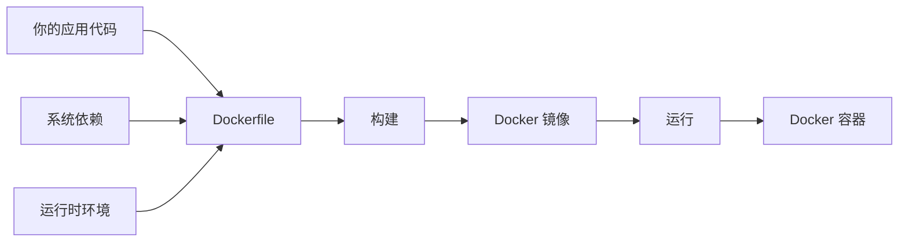

# 第 1 章：认识 Docker —— 从"在我机器上能跑"到"到处都能跑"

> **场景：** 你在本地写了一个 Web 应用，跑得好好的。交给后端同学部署，他却说跑不起来——"你用的 Python 3.11？我装的是 3.9。""你装了这个系统库？我没有。"这就是经典的"在我机器上能跑"问题。Docker 用一个巧妙的思路彻底解决了它。

---

## 1.1 传统部署的痛点

!!! example "核心比喻：传统部署就像搬家时一件件搬家具"
    你要搬家，传统方式是：把沙发、桌子、床、台灯一件件搬上卡车，到了新家再一件件搬下来组装。如果新家的门比沙发窄，你就卡住了（环境不兼容）。如果路上丢了台灯的灯泡，到了新家台灯不亮（依赖缺失）。
    
    Docker 的方式是：把所有家具预先装进一个标准尺寸的 **集装箱**。卡车、轮船、火车都能运这个集装箱，到了新家直接打开就用——里面的家具和原来一模一样。

| 传统部署 | Docker 部署 |
|:---|:---|
| 在新服务器上重装所有依赖 | 依赖已经打包在镜像里 |
| "你用的什么版本？" | 镜像里锁定了精确版本 |
| 部署一个应用可能要半天 | 一条命令，几秒钟启动 |
| 不同应用可能依赖冲突 | 每个容器独立，互不干扰 |
| 服务器环境"雪花"——每台都不一样 | 镜像统一，处处一致 |

---

## 1.2 什么是 Docker？

Docker 是一个 **容器化平台**，它把应用及其所有依赖打包成一个标准化的单元——**容器**。



三个核心概念：

| 概念 | 比喻 | 说明 |
|:---|:---|:---|
| **镜像（Image）** | 集装箱的规格书 | 一个只读模板，包含运行应用所需的一切 |
| **容器（Container）** | 实际装好货的集装箱 | 镜像的运行实例，可以启动、停止、删除 |
| **仓库（Registry）** | 集装箱码头 | 存储和分发镜像的地方（如 Docker Hub） |

---

## 1.3 容器 vs 虚拟机

!!! example "核心比喻：虚拟机就像在市中心建独栋别墅，容器就像住公寓楼"
    虚拟机：你在市中心买了一块地，建了一栋别墅——有自己的地基、水电系统、花园。独享资源，但占地大、建得慢、维护贵。
    
    容器：你住进一栋公寓楼——共享大楼的地基和水电（共享宿主机内核），但你的房间是独立的，装修风格自己定。轻量、快速、经济。

```
虚拟机架构：                      容器架构：
┌─────────────────┐              ┌─────────────────┐
│   App A  App B  │              │   App A  App B  │
├────────┬────────┤              ├────────┬────────┤
│ Guest  │ Guest  │              │Container│Container│
│  OS    │  OS    │              │  Engine (Docker) │
├────────┴────────┤              ├─────────────────┤
│   Hypervisor    │              │     Host OS      │
├─────────────────┤              ├─────────────────┤
│   Host OS       │              │   Infrastructure │
├─────────────────┤              └─────────────────┘
│ Infrastructure  │
└─────────────────┘
```

| 对比维度 | 虚拟机 | Docker 容器 |
|:---|:---|:---|
| 启动速度 | 分钟级 | 秒级（甚至毫秒级） |
| 资源占用 | 每个 VM 数 GB | 每个容器数十 MB |
| 隔离级别 | 完全隔离（Hypervisor） | 进程级隔离（共享内核） |
| 镜像大小 | 数 GB | 数十 MB ~ 数百 MB |
| 迁移便捷 | 需要迁移整个 VM | 镜像推拉即可 |

---

## 1.4 Docker 的三大核心优势

### 优势 1：环境一致性

```bash
# 开发环境
docker run -d -p 3000:3000 my-app:dev

# 测试环境（完全相同的镜像）
docker run -d -p 3000:3000 my-app:dev

# 生产环境（完全相同的镜像）
docker run -d -p 3000:3000 my-app:dev
```

同一个镜像，在任何安装了 Docker 的机器上运行结果完全一致。

### 优势 2：快速部署与回滚

```bash
# 部署新版本
docker run -d --name app-v2 my-app:v2.0

# 发现 bug，立即回滚到旧版本
docker stop app-v2
docker run -d --name app-v1 my-app:v1.0
```

### 优势 3：资源高效利用

一台 8GB 内存的服务器：
- 虚拟机：最多跑 3~4 个（每个 VM 占用 1~2GB）
- Docker 容器：可以跑 20~30 个（每个容器占用几十 MB）

---

## 1.5 Docker 的生态系统

```
┌──────────────────────────────────────────────┐
│                 Docker 生态系统                │
├───────────────┬───────────────┬───────────────┤
│  Docker Hub   │ Docker Compose│  Kubernetes   │
│  (镜像仓库)    │  (多容器编排)  │  (集群编排)    │
├───────────────┴───────────────┴───────────────┤
│              Docker Engine (核心引擎)          │
├───────────────────────────────────────────────┤
│              Linux Kernel (内核支持)           │
└───────────────────────────────────────────────┘
```

| 组件 | 作用 | 本教程覆盖 |
|:---|:---|:---|
| Docker Engine | 核心引擎，创建和管理容器 | ✅ |
| Docker Hub | 公共镜像仓库，分享和下载镜像 | ✅ |
| Docker Compose | 定义和运行多容器应用 | ✅ |
| Docker Swarm | Docker 原生集群管理 | ❌（进阶内容） |
| Kubernetes | 大规模容器编排平台 | ❌（进阶内容） |

---

## 要点总结

- [x] Docker 将应用和依赖打包成标准化的容器
- [x] 镜像 = 只读模板，容器 = 镜像的运行实例
- [x] 容器共享宿主机内核，比虚拟机轻量数十倍
- [x] 核心优势：环境一致性、快速部署、资源高效
- [x] Docker Hub 是公共镜像仓库，有数百万现成镜像

---

## 课后练习

1.  **概念梳理** ：用自己的话解释镜像、容器、仓库三个概念的区别。

2.  **场景思考** ：列举你遇到过或听说过的"在我机器上能跑"的场景，思考 Docker 如何解决。

3.  **预习** ：访问 [Docker Hub](https://hub.docker.com)，浏览一下有哪些热门镜像。

---

**下一章预告：** 理论说完了，动手才是硬道理。第 2 章将带你安装 Docker，运行你的第一个容器——亲眼见证"秒级启动"的魔力。

[继续第 2 章：环境搭建 →](02-installation.md)