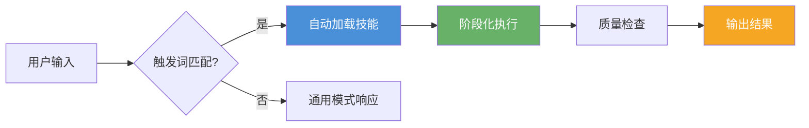

# 第 1 章：认识 AI 技能系统

> **从"通用助手"到"领域专家"** —— 了解 AI 编程助手技能系统的设计理念与核心概念。

---

## 1.1 什么是 AI 技能系统？

AI 编程助手的**技能（Skills）系统**是一种模块化的能力扩展机制。每个技能本质上是一个**结构化的系统提示词（System Prompt）**，包含了特定领域的专业知识、工作流程和最佳实践。当技能被激活时，它会告诉 AI 助手：

1. **角色定位**：在这个领域，你应该扮演什么角色
2. **工作流程**：按照什么阶段和步骤来处理任务
3. **输出标准**：最终产出应该满足什么格式和质量要求
4. **领域约束**：这个领域有哪些需要注意的特殊规则

!!! info "类比理解"

    可以把技能系统想象成 AI 助手的"专业培训课程"：
    
    - 没有技能时，AI 助手像一个**刚毕业的大学生**——什么都会一点，但不够专业
    - 加载技能后，AI 助手像一个**经过专业培训的工程师**——在特定领域有系统的方法论和高质量输出

### 为什么需要技能？

| 维度 | 不加载技能 | 加载技能后 |
|:---|:---|:---|
| **输出质量** | 不稳定，高度依赖提示词技巧 | 结构化流程保证质量标准 |
| **专业深度** | 通才，广度有余深度不足 | 注入专家级领域知识 |
| **工作流程** | 自由发挥，结果不可预测 | 阶段化流程，输出可预期 |
| **可复用性** | 每次需重新描述需求 | 一次安装/创建，多次使用 |

---

## 1.2 技能的核心设计理念

### 模块化

每个技能是独立的模块，包含完整的领域知识和工作流程。技能之间可以独立使用，也可以组合协同——就像乐高积木，每个模块负责一块能力。

### 结构化流程

技能内部采用**阶段化流程**设计，将复杂任务拆解为多个可控的阶段（Phase），每个阶段有明确的输入、处理和输出。这种设计确保即使面对复杂任务，AI 也能按部就班地产出高质量结果。

### 触发驱动

技能通过**关键词触发**或**手动调用**的方式激活。当你输入的内容匹配到某个技能的触发词时，AI 助手会自动加载对应的技能。

### 平台无关

技能的核心是结构化的文本定义，因此理论上与特定 AI 助手平台无关。同一个技能可以适配到不同的 AI 编程助手上使用。

---

## 1.3 主流 AI 技能平台

### Claude Code（Anthropic）

Claude Code 是目前技能生态最丰富的 AI 编程助手。它内置了多个技能，同时支持用户自定义技能和社区技能。

- **技能目录**：`.claude/skills/` 或通过 `npx skills` 安装
- **触发方式**：关键词自动触发 + `/skill-name` 手动调用
- **生态特点**：拥有 `skills.sh` 技能市场，社区活跃

### Cursor

Cursor 使用 **Rules** 功能来模拟技能机制。你可以创建自定义 Rule，将技能定义配置为特定文件类型或场景下的行为准则。

- **配置方式**：Settings → Rules → 新建 Rule
- **灵活度**：可按文件类型、目录、项目等条件匹配
- **特点**：与 IDE 深度集成，适合代码级任务

### Trae IDE

Trae IDE 原生支持 Skills 机制，技能放在特定目录下即可自动识别。

- **技能目录**：`~/.agents/skills/`
- **技能格式**：`SKILL.md` 文件定义
- **特点**：拖拽式安装，开箱即用

### Codex

Codex 提供了技能分发协议（cc-dispatch），可以与 Claude Code 等助手协同工作，实现跨平台的技能调度。

- **特点**：结构化任务包，适合多助手协作场景

---

## 1.4 技能的类型分类

根据功能定位，技能通常可以分为以下几类：

| 类型 | 说明 | 示例 |
|:---|:---|:---|
| **创作类** | 生成内容、设计产出 | 教程生成、前端设计、图表绘制 |
| **工具类** | 辅助操作、提升效率 | 文件处理、格式转换、部署发布 |
| **分析类** | 代码审查、安全检测 | PR review、安全审计、性能分析 |
| **协作类** | 多助手协调、任务分发 | 任务调度、消息推送、工作流编排 |
| **学习类** | 知识获取、技能发现 | 技能搜索、文档查询、教程学习 |

---

## 1.5 技能的工作原理

每个技能本质上由以下几个部分构成：

1. **元数据（Metadata）**：技能名称、描述、触发词等基本信息
2. **系统提示词（System Prompt）**：核心的领域知识和行为指引
3. **参考资料（References）**：补充的上下文知识、模板、示例
4. **工作流定义（Workflow）**：阶段化的任务处理流程

---

## 1.6 本章小结

- AI 技能系统是让助手从"通才"升级为"专家"的模块化扩展机制
- 核心理念：模块化、结构化流程、触发驱动、平台无关
- 主流平台：Claude Code、Cursor、Trae IDE、Codex 各有特色
- 技能类型：创作类、工具类、分析类、协作类、学习类
- 每个技能 = 元数据 + 系统提示词 + 参考资料 + 工作流定义

---

## 实践任务

1. 确认你使用的 AI 编程助手是否支持技能系统（查阅官方文档）
2. 浏览你所用平台的技能目录或市场，看看有哪些可用的技能
3. 思考：你日常工作中哪些重复性任务适合用技能来标准化？

---
