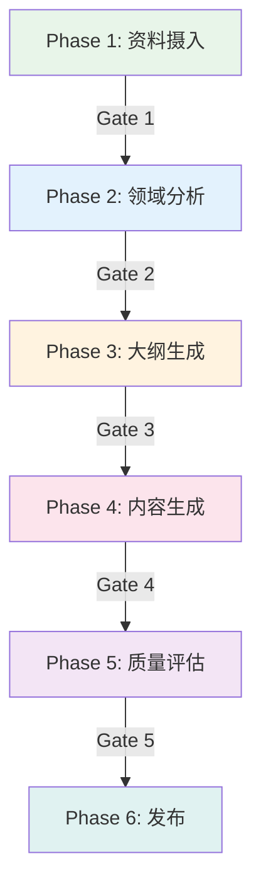

# 第 3 章：Dog-Tutor 教程生成实战

> **让 AI 帮你写教程** —— 用 Dog-Tutor 从零生成一份结构化的 MkDocs 教程。

---

## 3.1 Dog-Tutor 简介

Dog-Tutor 是 Dog-Skills 中最核心的技能之一，它能将任意主题的学习资料转化为高质量的 MkDocs Material 格式教程。它采用 **6 阶段结构化流程**，确保输出的教程质量可控。

### 6 阶段流程



| 阶段 | 名称 | 主要工作 |
|:---|:---|:---|
| Phase 1 | 资料摄入 | 收集原始资料，结构化分块 |
| Phase 2 | 领域分析 | 识别领域、受众、匹配比喻风格 |
| Phase 3 | 大纲生成 | 生成章节大纲、比喻链、知识点 |
| Phase 4 | 内容生成 | 逐章撰写，符合 MkDocs 规范 |
| Phase 5 | 质量评估 | 5 维度评分，改进建议 |
| Phase 6 | 发布 | 导出完整 MkDocs 项目 |

---

## 3.2 实战：生成一份 Python 入门教程

### 第一步：触发技能

在 AI 助手中输入以下内容来触发 Dog-Tutor：

```
请帮我生成一个 Python 新手入门教程，8~10 小时，面向零基础学习者。
```

### 第二步：Phase 1 — 资料摄入

AI 会首先确认你的需求，并询问是否有现成的学习资料。你可以：

- 提供已有的学习资料（文件、链接、文本）
- 让 AI 从零开始（基于其训练数据）

```
# 示例回复
"我没有现成资料，请你从零开始生成。"
```

### 第三步：Phase 2 — 领域分析

AI 会分析你的需求并给出分析报告：

- **领域**：technology → 编程语言 → Python
- **受众**：beginner（初学者）
- **风格**：daily_life（生活化比喻）

### 第四步：Phase 3 — 大纲生成

AI 会生成一份章节大纲。你可以审阅并提出修改意见：

```
# 典型反馈
"第 5 章和第 6 章的内容可以合并，另外请在最后加一个综合项目章节。"
```

### 第五步：Phase 4 — 内容生成

AI 会逐章生成教程内容，每章都符合 MkDocs Material 排版规范：

- 弹窗组件（Admonition）
- 代码块（带语法高亮）
- 表格、列表
- 实践任务和验证步骤

### 第六步：Phase 5 — 质量评估

AI 会从 5 个维度对教程进行评分：

| 维度 | 权重 | 检查内容 |
|:---|:---:|:---|
| 格式规范 | 15% | MkDocs 兼容性、空行、粗体空格 |
| 内容完整性 | 25% | 知识点覆盖、示例、实践任务 |
| 教学逻辑 | 25% | 难度递进、概念衔接 |
| 实用价值 | 20% | 可操作性、场景真实 |
| 比喻质量 | 15% | 贴切程度、风格一致 |

### 第七步：Phase 6 — 发布

最终输出完整的 MkDocs 项目文件，可以直接部署。

---

## 3.3 受众级别与比喻风格

Dog-Tutor 支持四级受众和四种比喻风格，你需要根据教程目标选择合适的组合。

### 四级受众

| 级别 | 适合人群 | 触发词 |
|:---|:---|:---|
| **absolute_beginner** | 完全零基础 | "零基础"、"新手"、"入门" |
| **beginner** | 有一定了解 | 默认级别 |
| **intermediate** | 进阶提升 | "进阶"、"实战"、"精通" |
| **expert** | 专家级 | "架构"、"原理"、"源码" |

### 四种比喻风格

| 风格 | 特点 | 适合场景 |
|:---|:---|:---|
| **daily_life** | 生活化类比 | 零基础、概念抽象 |
| **professional** | 行业类比 | 有行业背景、B2B |
| **humorous** | 幽默轻松 | 娱乐内容、年轻受众 |
| **rigorous** | 严谨学术 | 学术内容、考试导向 |

!!! tip "最佳实践"

    对于零基础教程，推荐使用 **daily_life** 比喻风格，用生活中的事物来解释抽象概念。
    
    例如：
    - 用"遥控器"比喻命令行操作
    - 用"租房"比喻变量赋值
    - 用"智能管家"比喻函数调用

---

## 3.4 教程分类体系

Dog-Tutor 使用三层分类体系：**领域 → 方向 → 主题**

| 领域 | 方向 | 示例 |
|:---|:---|:---|
| 基础技能 | 开发工具/文档写作/环境配置 | Git/Markdown/Linux |
| 编程语言 | 通用语言/专业语言/标记语言 | Python/R/HTML |
| 技术领域 | AI/数据工程/前端/运维 | LLM/爬虫/Web |
| 工程实践 | 软件工程/团队协作/质量保障 | 设计模式/CI/CD |

---

## 3.5 发布同步

教程生成后，Dog-Tutor 会自动同步三个文件：

1. **README.md** — 在对应分类添加教程词条
2. **docs/index.md** — 在对应分类添加教程卡片
3. **mkdocs.yml** — 在 `nav` 列表添加导航项

---

## 3.6 本章小结

- Dog-Tutor 采用 6 阶段流程生成结构化教程
- 支持四级受众和四种比喻风格
- 输出符合 MkDocs Material 排版规范
- 自动同步 README、index.md 和 mkdocs.yml

---

## 实践任务

1. 用 Dog-Tutor 生成一个你感兴趣的教程主题（如"JavaScript 基础"）
2. 审阅大纲并提出修改意见
3. 检查最终输出的教程质量

---