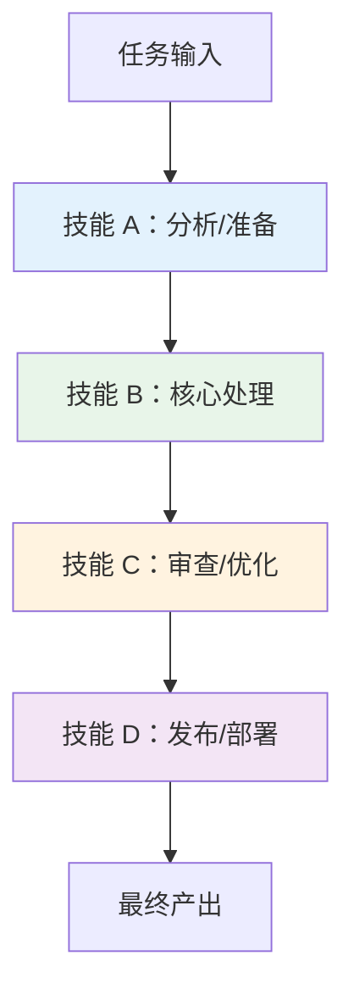

# 第 5 章：技能实战工作流

> **让多个技能为你协同作战** —— 学会组合技能构建自动化工作流，将 AI 助手升级为超级生产力引擎。

---

## 5.1 多技能协同的理念

单个技能解决单个问题，但真实世界的任务往往是 **多步骤、跨领域** 的。多技能协同的核心理念是：**将多个技能串联成一个工作流**，让 AI 助手自动完成从 A 到 Z 的全流程。

### 协同模式



---

## 5.2 典型工作流模板

### 模板 1：技术文档项目全流程

**场景**：为一个开源项目创建完整的文档站点

| 步骤 | 使用的技能 | 工作内容 |
|:---|:---|:---|
| 1 | 教程生成类技能 | 生成项目使用教程 |
| 2 | 前端设计类技能 | 设计文档站点的落地页 |
| 3 | 图表绘制类技能 | 制作架构图和流程图 |
| 4 | 部署类技能 | 将文档站点部署上线 |

```
第 1 步：用教程技能生成项目文档
  → "帮我生成一个 React 组件库的使用教程，8 小时，面向中级开发者"

第 2 步：用前端技能设计文档站点
  → "为这个教程设计一个简洁的文档站点，支持暗色模式"

第 3 步：用图表技能插入架构图
  → "生成组件库的架构图和 API 调用流程图"

第 4 步：部署上线
  → "帮我把文档站点部署到 GitHub Pages"
```

### 模板 2：代码质量保障流程

**场景**：为每一次代码提交建立质量门禁

| 步骤 | 使用的技能 | 工作内容 |
|:---|:---|:---|
| 1 | 代码审查技能 | 检查代码逻辑和风格 |
| 2 | 安全审计技能 | 扫描安全漏洞 |
| 3 | 测试生成技能 | 补充缺失的测试用例 |
| 4 | 文档更新技能 | 更新相关文档 |

```
第 1 步：审查代码
  → "请审查这个 PR 的代码质量和逻辑正确性"

第 2 步：安全检查
  → "检查这些改动是否有安全风险"

第 3 步：补充测试
  → "为新增的函数生成单元测试"

第 4 步：更新文档
  → "更新 CHANGELOG 和 API 文档"
```

### 模板 3：数据分析报告工作流

**场景**：从原始数据到发布分析报告

| 步骤 | 使用的技能 | 工作内容 |
|:---|:---|:---|
| 1 | 数据处理技能 | 清洗、转换原始数据 |
| 2 | 可视化技能 | 生成图表 |
| 3 | 报告编写技能 | 撰写分析报告 |
| 4 | 演示制作技能 | 制作汇报 PPT |

---

## 5.3 技能链的编排技巧

### 上下文传递

在多技能协作中，前一阶段的输出就是后一阶段的输入。确保：

- 每个阶段的 **输出格式清晰**，便于下一阶段消费
- 在切换到新技能时，**简要重述上下文**，帮助 AI 理解当前状态

```
# 好的做法 ✅
"基于刚才生成的教程内容（共 6 章，主题是 React 组件库），
请为这个文档站点设计一个落地页。"

# 不好的做法 ❌
"帮我设计一个落地页"
```

### 技能间的"胶水代码"

有时两个技能之间需要一些 **衔接处理**。这些"胶水"步骤通常不需要专门的技能，直接在对话中说明即可：

```
"把上一步生成的 Markdown 文件整理成以下目录结构：
docs/
├── guide/
│   ├── quickstart.md
│   └── api-reference.md
└── examples/
    └── basic-usage.md"
```

### 回退与重试

技能工作流不是线性的——如果某一步的输出不理想，**回退到上一步重新生成**，而不是从头开始：

```
"第 3 步生成的图表不够清晰，请用第 2 步的设计令牌重新生成，
这次使用更简洁的配色。"
```

---

## 5.4 工作流的固化

当你发现某个工作流经常被使用，可以将其 **固化为一个新技能**：

### 固化步骤

1. **记录流程**：把多技能协作的完整对话记录保存下来
2. **提取模式**：识别重复出现的步骤和模式
3. **编写 SKILL.md**：将流程写入一个统一的技能定义文件
4. **测试验证**：用新技能重新执行相同的任务，确认效果一致

固化的好处是：下次执行同类任务时，只需一个触发词，AI 就能自动走完整个流程。

---

## 5.5 实战案例：从需求到上线

让我们通过一个完整的案例来展示多技能协同的威力。

**场景**：你需要在一天内为一个新项目创建完整的文档和网站

```
09:00 — 需求分析
  "我的项目是一个 Python 数据分析库，需要：
   1. 一份完整的使用教程（面向中级开发者，6-8 小时）
   2. 一个项目官网落地页
   3. API 参考文档
   4. 部署到线上"

09:30 — 教程生成（教程类技能）
  "请生成使用教程，包含快速开始、核心概念、进阶用法、API 概览"

11:00 — 审阅与修改
  "第 3 章的例子太简单，请加入一个真实的数据分析场景"

13:00 — 网站设计（前端技能）
  "基于教程内容，设计官网，风格参考 Pandas 官网"

14:30 — API 文档（文档生成技能）
  "从源码注释中提取并生成 API 参考文档"

15:30 — 整合与部署（部署技能）
  "将所有内容部署到 GitHub Pages，配置自定义域名"
```

一天之内，从零到上线。

---

## 5.6 常见陷阱与对策

| 陷阱 | 表现 | 对策 |
|:---|:---|:---|
| **技能过载** | 同时加载太多技能，AI 响应混乱 | 一次只用 1-2 个技能，按顺序调用 |
| **上下文丢失** | 长对话中 AI 忘记之前的设定 | 关键节点重新强调上下文 |
| **质量衰减** | 越到后面的步骤质量越差 | 每步输出后做简要的质量检查 |
| **流程僵化** | 严格按流程走，忽视实际情况 | 允许在关卡处调整方向 |

---

## 5.7 本章小结

- 多技能协同能将 AI 助手升级为全流程自动化工具
- 掌握典型工作流模板（技术文档、代码审查、数据分析）
- 上下文传递是技能链成功的关键
- 高频使用的工作流可以固化为新技能
- 避免技能过载和上下文丢失

---

## 实践任务

1. 选择模板 1（技术文档全流程），在你的项目中实际走一遍
2. 记录每个步骤的输入和输出，分析哪里可以优化
3. 设计一个适合你自己工作场景的多技能工作流

---
