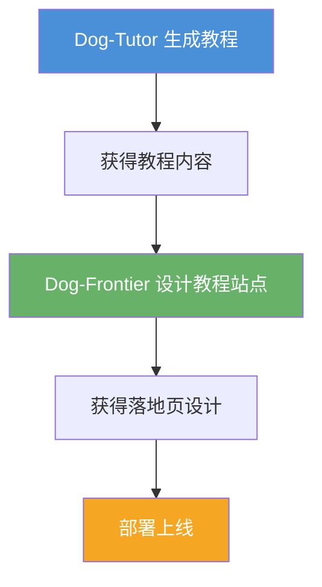

# 第 6 章：最佳实践与进阶技巧

> **从"会用"到"精通"** —— 掌握 Dog-Skills 的进阶技巧，多技能协同作战，让 AI 助手真正成为超级生产力工具。

---

## 6.1 多技能协同工作

Dog-Skills 的强大之处在于多个技能可以协同工作，形成完整的自动化工作流。

### 典型工作流：从教程到落地页



### 实战示例

**场景**：为一个开源项目创建完整的文档站点

```
第 1 步：用 Dog-Tutor 生成项目教程
  输入："帮我生成一个 React 组件库的使用教程"

第 2 步：用 Dog-Frontier 设计文档站点
  输入："请为这个教程设计一个漂亮的文档站点落地页"

第 3 步：用 Find-Skills 搜索部署相关技能
  输入："有没有能帮我部署文档站点的技能？"
```

---

## 6.2 自定义技能创建

当现有技能无法满足需求时，可以使用 Skill-Creator 创建自定义技能。

### 触发 Skill-Creator

```
用户: "我想创建一个处理 Markdown 的技能"
AI:  [加载 Skill-Creator 技能]
     好的，让我引导你创建这个技能。首先，请告诉我：
     1. 这个技能的主要功能是什么？
     2. 目标用户是谁？
     3. 需要哪些输入和输出？
```

### 技能设计原则

| 原则 | 说明 | 示例 |
|:---|:---|:---|
| **单一职责** | 一个技能只做一件事 | Dog-Tutor 只做教程生成 |
| **结构化流程** | 定义清晰的阶段和步骤 | 6 阶段流程 |
| **明确输出** | 定义标准化的输出格式 | MkDocs 格式 |
| **可复用性** | 技能在不同场景下可用 | 支持多领域 |

### 技能文件结构

```
my-skill/
├── SKILL.md          # 技能核心定义（必需）
├── ATTRIBUTIONS.md   # 归属声明
├── references/       # 参考资料
│   └── workflow.md
└── assets/           # 辅助资源
    └── examples.md
```

---

## 6.3 提示词优化技巧

### 提供清晰的上下文

```
# 差 ❌
"帮我做个教程"

# 好 ✅
"帮我生成一个 Python 新手入门教程，8~10 小时，面向零基础学习者。
希望用生活化比喻，每章都要有实践任务。"
```

### 提供必要的输入

```
# 提供资料
"请基于以下资料生成教程：[粘贴资料内容]"

# 指定风格
"请用幽默风格，比喻成做饭的过程来讲解"
```

### 迭代优化

```
# 第一轮
"帮我生成一个 Git 教程大纲"

# 审阅后修改
"第 3 章和第 4 章内容重叠，请合并。
另外需要增加一章关于 Git Hooks 的内容。"
```

---

## 6.4 质量保证清单

使用 Dog-Skills 时，建议按以下清单检查输出质量：

### 格式检查

- [ ] 代码块前后有空行
- [ ] 列表前有空行
- [ ] 粗体标记前后有空格
- [ ] Admonition 组件前后有空行

### 内容检查

- [ ] 知识点覆盖完整
- [ ] 示例代码可运行
- [ ] 实践任务有明确产出
- [ ] 比喻贴切易懂

### 受众检查

- [ ] 难度适合目标受众
- [ ] 专业术语有解释
- [ ] 步骤粒度合理

---

## 6.5 社区贡献

Dog-Skills 是开源项目，欢迎社区贡献。

### 贡献方式

| 方式 | 说明 |
|:---|:---|
| **提交 Issue** | 报告 Bug、提出功能建议 |
| **提交 PR** | 改进现有技能、添加新技能 |
| **分享经验** | 撰写使用心得、最佳实践 |
| **Star 项目** | 给项目点 Star，帮助更多人发现 |

### 贡献流程

```bash
# 1. Fork 仓库
# 2. 克隆你的 Fork
git clone https://github.com/<你的用户名>/Dog-Skills.git

# 3. 创建功能分支
git checkout -b feature/my-new-skill

# 4. 添加你的技能
# 在 skills/ 目录下创建新技能

# 5. 提交并推送
git add .
git commit -m "添加 XXX 技能"
git push origin feature/my-new-skill

# 6. 在 GitHub 上创建 Pull Request
```

---

## 6.6 常见工作流模板

### 模板 1：创建完整教程项目

```
1. Dog-Tutor：生成教程内容
2. Dog-Frontier：设计教程站点
3. Find-Skills：搜索部署工具
4. 手动部署到 GitHub Pages
```

### 模板 2：前端项目快速启动

```
1. Dog-Frontier：生成设计方案
2. 根据设计生成代码
3. 本地开发调试
4. 部署上线
```

### 模板 3：技能生态扩展

```
1. Find-Skills：搜索可用技能
2. 安装需要的技能
3. 测试技能效果
4. 反馈改进建议
```

---

## 6.7 本章小结

- 多技能协同可形成完整的自动化工作流
- Skill-Creator 支持创建自定义技能
- 优化提示词可获得更好的输出质量
- 使用质量检查清单确保输出质量
- 欢迎参与社区贡献

---

## 实践任务

1. 尝试用 Dog-Tutor + Dog-Frontier 完成一个完整项目
2. 用 Skill-Creator 设计一个自定义技能
3. 访问 [Dog-Skills 仓库](https://github.com/ZhouYinLong-lab/Dog-Skills)，给项目点个 Star

---