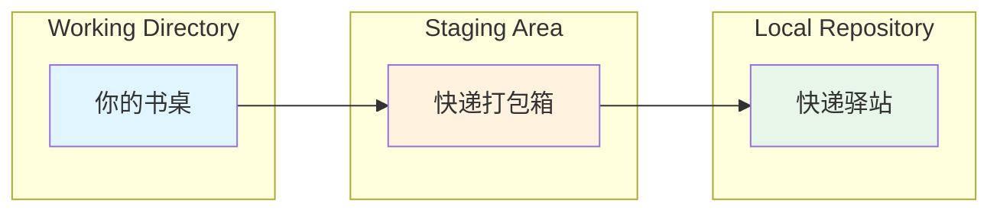

# 第 2 章：本地单机操作——如何存档？(Local Basics)
## 📦 快递、书桌、驿站——理解 Git 的三大工作区域

在这一章，你会学到 Git 最核心的概念：三大工作区域。理解了这个，你就理解了 Git 的灵魂。

---

## 你会学到

- ✅ **Git 的三大工作区域**：理解从修改代码到永久保存的完整流程
- ✅ **初始化仓库**：把一个普通文件夹变成 Git 能跟踪的项目
- ✅ **添加和提交**：像打快递一样，逐步打包、贴单、发送
- ✅ **`.gitignore` 最佳实践**：防止把密钥、虚拟环境等不该上传的文件提交到仓库
- ✅ **验证每一步**：确保你的操作成功了

---

## 2.1 Git 的三大工作区域

这是初学者最需要理解的概念。一旦掌握了这个模型，所有 Git 的操作都会变得合理。

### 生活化类比：邮寄一个包裹

想象你要寄一个包裹给队友：



**流程说明**：正在修改的文件 → 决定发送什么 → 永久记录（历史）

**第一步：你的书桌（Working Directory）**

- 📝 你正在编写代码、修改文件

- 📝 这些改动只存在于你的电脑上

- 📝 Git 还没有正式记录这些改动

- 📝 如果你不小心删了文件，可能找不回来

**第二步：快递打包箱（Staging Area）**

- 📦 你把肯定要发送的文件放进打包箱

- 📦 这是一个 "暂时的集合"，你可以确认一下内容

- 📦 如果发现有东西不该寄，还可以从箱子里拿出来

- 📦 打包箱是真的存在于硬盘上，但只有 Git 能看到

**第三步：快递驿站（Local Repository）**

- 🏢 一旦包裹被寄出，就进入了驿站永久记录

- 🏢 记录包括：什么时间、谁寄的、寄了什么、备注是什么

- 🏢 你随时可以查看历史记录，知道 "一个月前我改了什么"

- 🏢 这个记录可以永远保存和追溯

### 用 Git 术语重新说一遍

| 阶段 | Git 术语 | 什么样的文件会在这里？ |
|------|---------|----------------------|
| **书桌** | Working Directory | 你正在编辑的 `.py` 文件，还没告诉 Git 要提交 |
| **打包箱** | Staging Area（暂存区） | 你已经用 `git add` 告诉 Git 的文件，准备好了 |
| **驿站** | Local Repository（本地仓库） | 你已经用 `git commit` 提交的文件，永久记录 |

!!! info "名词解释：Commit"
    **Commit** = 一次提交。当你按下 "发送" 按钮时，Git 就创建了一个 commit。每个 commit 都有：
    
    - 一个**唯一 ID**（你以后可以用这个 ID 回到这个时间点）
    - **作者信息**（是谁做的）
    - **时间戳**（什么时候做的）
    - **改动内容**（改了什么）
    - **备注**（你写的提交说明，比如 "Fix login bug"）

---

## 2.2 初始化与提交流程

好了，现在你理解了三个区域。接下来我们实操一遍。

### 前置准备

首先，创建一个测试文件夹。假设你要为一个新的 Python 项目创建本地 Git 仓库。

创建一个名为 `my_first_project` 的文件夹：

=== "Windows"

    1. 打开 **文件管理器**
    2. 找一个合适的位置（比如桌面或文档）
    3. 右键 → **新建** → **文件夹**
    4. 命名为 `my_first_project`

=== "macOS"

    1. 打开 **Finder**
    2. 找一个合适的位置（比如文档）
    3. 右键 → **新建文件夹**
    4. 命名为 `my_first_project`

### 步骤 1：初始化 Git 仓库

现在我们要告诉 Git："这个文件夹里的所有代码改动，我都要你帮我记录。"

!!! tip "作者经验"
    每个 Python 项目都应该有自己的 Git 仓库。习惯：先创建文件夹，再初始化 Git。

**方法 A：命令行（所有系统通用）**

1. 打开命令行：
   - Windows：按 **Win + R**，输入 `cmd`，按 Enter
   - macOS：打开 **Terminal**

2. 进入 `my_first_project` 文件夹：
   ```bash
   # 假设你在桌面
   cd ~/Desktop/my_first_project
   
   # 或者如果在 Windows 的 D 盘
   cd D:\my_first_project
   ```

3. 初始化 Git：
   ```bash
   # 这个命令会在文件夹里创建一个隐藏的 .git 文件夹
   # Git 会把所有相关信息存在这里
   git init
   ```

4. 看到这样的输出说明成功了：
   ```
   Initialized empty Git repository in D:\my_first_project\.git
   ```

**方法 B：VSCode 图形界面**

1. 打开 VSCode
2. 菜单 → **File** → **Open Folder**，选择 `my_first_project`
3. 打开左侧 **Source Control** 面板（分叉树干图标）
4. 点击大按钮 **"Initialize Repository"**
5. 完成！

!!! note "说明"
    初始化后，你可能看不到任何变化。但 Git 已经在幕后创建了一个隐藏文件夹 `.git`。不要手动修改或删除这个文件夹，Git 会自动管理它。

---

### 步骤 2：创建一个 Python 文件

现在我们创建第一个代码文件，这样才有东西提交。

在 `my_first_project` 文件夹内创建一个文件 `hello.py`，内容如下：

```python
# 这是我的第一个 Python 项目
# 我正在学习 Git

print("Hello, Git!")
```

现在你已经修改了代码（处于 **书桌** 阶段）。Git 知道有文件被修改了，但还没记录。

---

### 步骤 3：把文件放入暂存区

现在决定：我确认这个文件是我想要提交的内容。

**方法 A：命令行**

```bash
# 告诉 Git："我要提交 hello.py 这个文件"
git add hello.py

# 或者如果你想一次性添加所有改动的文件
git add .
```

**方法 B：VSCode**

1. 打开 **Source Control** 面板
2. 在 **Changes** 列表中找到 `hello.py`
3. 把鼠标放在文件名上，点击那个 **"+"** 符号
4. 文件就被移到了 **Staged Changes** 区域

!!! info "名词解释：git add"
    **git add** = "告诉 Git，这个文件我要提交"。执行 `git add` 后，文件被放入暂存区（**打包箱**）。
    
    - `git add hello.py` ：只添加这一个文件
    - `git add .` ：添加当前文件夹里所有改动的文件（但会遵守 `.gitignore`，见后面的章节）

---

### 步骤 4：提交（Commit）

现在做最重要的一步：**封箱** 并把包裹寄出。

**方法 A：命令行**

```bash
# 创建一个 commit，必须带上 -m 参数和提交说明
git commit -m "feat: 创建 Hello World 项目初始文件"
```

输出应该像这样：

```
[main (root-commit) abc1234] feat: 创建 Hello World 项目初始文件
 1 file changed, 3 insertions(+)
 create mode 100644 hello.py
```

这说明提交成功了！🎉

**方法 B：VSCode**

1. 打开 **Source Control** 面板
2. 在面板顶部看到一个文本框写着 "Message"
3. 输入你的提交说明（比如 "feat: 创建 Hello World 项目初始文件"）
4. 按 Ctrl+Enter（或点击 checkmark 按钮）
5. 完成！

!!! tip "如何写好提交说明？"
    好的提交说明应该是：
    
    - ✅ 简洁但清楚：`feat: 添加登录功能` （好）
    - ✅ 说明变化的类型：`feat:` 新功能、`fix:` 修复、`refactor:` 重构
    - ❌ 太模糊：`update file` （差）
    - ❌ 太繁琐：`I added the login feature today and also fixed some bugs in the API and refactored the database connection logic` （过多）

---

### 步骤 5：验证提交成功

怎样确认你的 commit 真的被记录了？

**方法 A：查看提交日志**

```bash
# 这个命令会显示所有过去的 commit 历史
git log
```

你会看到类似这样的输出：

```
commit abc1234567890def (HEAD -> main)
Author: Alice Chen <alice@example.com>
Date:   Mon Mar 15 14:23:45 2024 +0800

    feat: 创建 Hello World 项目初始文件

```

关键信息：

- `commit abc1234...` ：这个 commit 的唯一 ID

- `Author: ...` ：是谁提交的（来自你之前设置的 user.name 和 user.email）

- `Date: ...` ：什么时候提交的

- 最后是你写的提交说明

**方法 B：VSCode 查看**

1. 打开 **Source Control** 面板
2. 点击 **"..."** 菜单
3. 选择 **"View History" / "Show Log"** 之类的选项
4. 你会看到一个时间线，显示你所有的 commit

!!! example "举个例子 / 类比理解"
    
    想象你买了一本日记本：
    
    - **初始化 Git**（`git init`）= 买了日记本
    - **修改代码**（edit file）= 写日记
    - **`git add`**（暂存）= 用铅笔写（还能改）
    - **`git commit`**（提交）= 用钢笔写（定稿了，永久保存）
    - **`git log`**（查看历史）= 翻开日记本，回顾过去
    
    一旦用钢笔写下来，就永远不能改了（除非你用特殊的方法恢复旧版本）。

---

## 2.3 Python 开发者的必修课：`.gitignore` 文件

现在有个问题：不是所有文件都应该提交到 Git。

### 什么文件不能提交？

**❌ 绝对不能提交：**

1. **包含 API Key 或密码的文件**（`.env` 文件）
   - 如果你把 `.env` 提交到 GitHub，坏人可以看到你的 API Key，盗用你的账户
   - 这是一个**安全灾难**

2. **虚拟环境文件夹**（`venv/`、`env/` 等）
   - 虚拟环境可能有几千个文件，太大了
   - 队友可以从 `requirements.txt` 自己安装依赖，不需要你的虚拟环境

3. **Python 缓存文件**（`__pycache__/`、`*.pyc`）
   - 这些是 Python 自动生成的，没必要版本控制

4. **IDE 配置文件**（`.vscode/`、`.idea/`、`.DS_Store`）
   - 你用 VSCode，队友用 PyCharm，配置完全不同
   - 不应该强制队友用你的 IDE 配置

5. **生成的文件**（`__pycache__/`、`*.egg-info`、`dist/`、`build/`）
   - 这些可以由代码自动生成，不需要存档

### 解决方案：`.gitignore` 文件

!!! info "名词解释：.gitignore"
    
    **`.gitignore`** 是一个特殊的文件，告诉 Git "这些文件你当没看见，别提交它们"。
    
    就像在快递单上写：`请勿投递到以下地址` 一样。Git 会自动跳过 `.gitignore` 里列出的文件。

---

### 创建 `.gitignore` 文件

在你的项目根目录（`my_first_project` 里）创建一个文件，命名为 `.gitignore`（注意开头的点）。

内容如下（这是一个标准的 Python `.gitignore` 模板）：

```gitignore
# 虚拟环境
venv/
env/
ENV/
.venv

# Python 缓存
__pycache__/
*.py[cod]
*$py.class
*.so
.Python

# IDE 配置
.vscode/
.idea/
*.swp
*.swo
*~
.DS_Store

# 依赖和包
*.egg-info/
dist/
build/
*.egg

# 环境变量文件（非常重要！）
.env
.env.local
.env.*.local

# 测试覆盖率
.coverage
htmlcov/

# 其他
*.log
.pytest_cache/
```

!!! danger "安全警示：API Keys"
    
    **最常见的安全错误**：明文写 API Key、数据库密码。
    
    ❌ **危险的做法**：
    ```python
    # 不要这样
    OPENAI_API_KEY = "sk-xxx...."  # 直接写在代码里
    DB_PASSWORD = "admin123"
    ```
    
    ✅ **安全的做法**：
    ```python
    import os
    from dotenv import load_dotenv
    
    # 加载 .env 文件（只在本地）
    load_dotenv()
    
    # 从环境变量读取（安全多了）
    API_KEY = os.getenv("OPENAI_API_KEY")
    DB_PASSWORD = os.getenv("DB_PASSWORD")
    ```
    
    然后在 `.env` 里写密钥**（并把 `.env` 加到 `.gitignore`）**：
    ```
    OPENAI_API_KEY=sk-xxxx....
    DB_PASSWORD=admin123
    ```

---

### 团队协作：`.env.example` 文件

如果你的队友需要知道 "有哪些环境变量需要配置"，该怎么办？

**方法**：创建一个 `.env.example` 文件，列出所有需要的变量（但 **不包含真实的值**）：

```bash
# .env.example（可以提交到 Git）
OPENAI_API_KEY=your-key-here
DATABASE_URL=your-database-url
DEBUG=False
```

然后把这个文件提交到 Git。队友下载后，可以复制并重命名为 `.env` 文件，然后填入自己的值：

```bash
cp .env.example .env
# 然后编辑 .env，填入真实的密钥
```

这样既能共享配置模板，又不会泄露密钥。完美！😎

---

### 验证 `.gitignore` 工作了

创建好 `.gitignore` 后，需要验证它是否生效。

假设你的项目里现在有：
```
my_first_project/
├── hello.py
├── .gitignore
├── __pycache__/（想被忽略）
└── .env（想被忽略）
```

**方法 A：查看未跟踪的文件**

```bash
# 这个命令显示所有 Git 知道的、但还没提交的文件
git status
```

如果 `__pycache__` 和 `.env` 没有出现在输出里，说明 `.gitignore` 工作了！

**方法 B：VSCode 查看**

打开 **Source Control** 面板，在 **Changes** 里应该看不到 `__pycache__` 和 `.env`。

---

### 提交 `.gitignore` 文件

现在把 `.gitignore` 文件本身提交到 Git：

```bash
git add .gitignore
git commit -m "chore: 添加 .gitignore 文件"
```

或者用 VSCode，同样的步骤。

!!! tip "作者经验"
    
    **何时创建 `.gitignore`？** 最好在项目第一次初始化 Git 后就立即创建，防止后面不小心提交了不该提交的文件。
    
    **能删除已经提交的文件吗？** 能，但有点复杂（涉及 `git rm` 和 rebase）。初学者最好从一开始就设置好 `.gitignore`。

---

## 2.4 完整工作流回顾

现在我们已经学了所有个阶段，用一个很小的例子完整走一遍：

```bash
# 1. 初始化项目
mkdir my_app
cd my_app
git init

# 2. 创建代码文件
echo 'print("Hello")' > app.py

# 3. 创建 .gitignore
# （用文本编辑器创建，填入上面的内容）

# 4. 添加到暂存区
git add app.py
git add .gitignore

# 5. 提交
git commit -m "feat: 初始化项目"

# 6. 查看历史
git log
```

现在你已经有了第一个 commit！🎉

---

## 2.5 常见错误排查

### 问题 1：`git init` 后看不到什么

**症状**：运行 `git init` 后，文件夹里好像没有任何变化。

**原因**：`.git` 文件夹是隐藏的。

**解决**：
- Windows：打开文件管理器 → 菜单 → **显示隐藏文件**
- macOS：按 `Cmd + Shift + .` 就能显示隐藏文件

### 问题 2：`git add` 后忘了文件名

**症状**：`git add` 了一大堆文件，但忘了有什么被添加了。

**解决**：
```bash
# 查看暂存区里有什么
git status
```

或者用 VSCode 的 **Source Control** 面板直观地看。

### 问题 3：提交说明写错了

**症状**：已经 commit 了，但提交说明里有typo。

**解决**（只能改最后一次 commit）：
```bash
git commit --amend -m "新的提交说明"
```

（更多修复技巧在第 7 章《吃后悔药》）

---

## 📚 关键要点总结

| 命令 | 作用 | 比喻 |
|------|------|------|
| `git init` | 初始化 Git 仓库 | 创建日记本 |
| `git add` | 加入暂存区 | 用铅笔写（还能改） |
| `git commit` | 提交 commit | 用钢笔写定稿 |
| `git log` | 查看历史 | 翻开日记本回顾 |
| `git status` | 查看当前状态 | 问 "我现在在哪个阶段？" |

---

## 🚀 下一步

完成本章后，你已经能够：

- ✅ 创建本地 Git 仓库

- ✅ 准确理解 Git 的三个工作区域

- ✅ 正确使用 `git add` 和 `git commit`

- ✅ 用 `.gitignore` 保护敏感文件

**下一章**：分支管理。你会学到如何在 "平行宇宙" 里工作，而不影响主线代码。
