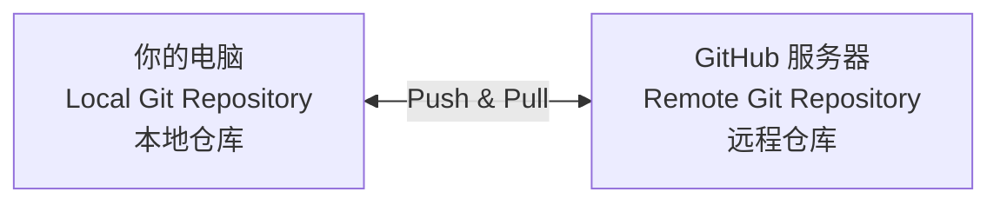
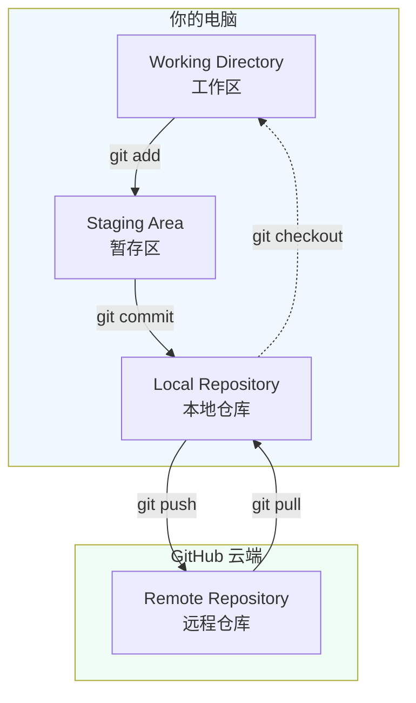

# 第 4 章：连接云端——与 GitHub 互通 (Remote)
## 🌐 从本地到云端——代码备份与团队同步

在这一章，你会学到如何把本地 Git 仓库连接到 GitHub 云端，实现代码共享和团队协作。

---

## 你会学到

- ✅ **什么是 Remote（远程仓库）**：GitHub 就是你的云端备份点
- ✅ **克隆仓库**：下载别人在 GitHub 上的项目到本地
- ✅ **Push（推送）**：把本地的代码上传到 GitHub
- ✅ **Pull（拉取）**：下载 GitHub 上的最新代码到本地
- ✅ **保持同步**：团队开发中如何让所有人的代码始终一致

---

## 4.1 什么是 Remote？

### 两层 Git 仓库

你现在知道 Git 工作分为三个区域（Working Directory、Staging Area、Local Repository）。但这还不是全部。

实际上，Git 可以有两个仓库位置：




!!! info "名词解释：Remote"
    
    **Remote（远程仓库）** = 托管在 GitHub 或其他服务器上的 Git 仓库。
    
    - **Local Repository**（本地仓库）：你的电脑上的 Git 仓库，只有你能直接访问
    - **Remote Repository**（远程仓库）：GitHub 服务器上的 Git 仓库，你和队友都可以访问

### 为什么需要 Remote？

1. **备份**：即使电脑硬盘坏了，代码还在 GitHub 服务器上 ✅
2. **团队协作**：队友可以 Pull 你的最新改动，你也可以 Pull 他们的 ✅
3. **代码审查**：在合并到主分支前，让队友看看你的改动 ✅
4. **CI/CD 自动化**：GitHub 可以自动运行测试、部署代码等 ✅

---

## 4.2 克隆仓库（Clone）

### 场景：你要使用队友在 GitHub 上的项目

假设你的队友 Alice 已经在 GitHub 上创建了一个项目 `python-api-starter`。你想把这个项目下载到本地开发。

!!! note "前置要求"
    
    本章假设你已经：
    - ✅ 有一个 GitHub 账户（如果没有，先到 github.com 免费注册）
    - ✅ 知道项目的 GitHub URL（例如 `https://github.com/alice/python-api-starter`）

### 步骤 1：从 GitHub 获取仓库链接

1. 打开浏览器，访问 GitHub 上的项目页面
2. 找到绿色的 **"Code"** 按钮
3. 复制 **HTTPS** 链接（推荐）或 SSH 链接（如果你已配置 SSH）

例如：
```
https://github.com/alice/python-api-starter.git
```

### 步骤 2：克隆到本地

**方法 A：命令行**

```bash
# 进入你想放项目的目录（比如桌面）
cd ~/Desktop

# 克隆仓库
git clone https://github.com/alice/python-api-starter.git

# 一个新文件夹 "python-api-starter" 会被创建
cd python-api-starter
```

**方法 B：VSCode**

1. 打开 VSCode
2. Ctrl+Shift+P（或 Cmd+Shift+P）打开命令面板
3. 输入 "Git: Clone"
4. 粘贴仓库链接
5. 选择保存位置
6. 完成！

### 步骤 3：验证克隆成功

```bash
# 查看所有分支（包括远程分支）
git branch -a

# 查看提交历史
git log --oneline

# 查看远程信息
git remote -v
```

你应该看到：
```
origin  https://github.com/alice/python-api-starter.git (fetch)
origin  https://github.com/alice/python-api-starter.git (push)
```

`origin` 是 Git 对原始远程仓库的默认称呼。

!!! info "名词解释：origin"
    
    **origin** = 特殊的远程别名，指向你克隆的原始 GitHub 仓库。
    
    - `git push origin main` = 推送到原始仓库
    - `git pull origin main` = 从原始仓库拉取
    - 一个项目通常只有一个 origin

---

## 4.3 推送（Push）

### 场景：你在本地开发完成，想上传到 GitHub

假设你在 `feature/new-api` 分支上开发了一个新功能，现在想把这个分支推送到 GitHub 让队友看。

### 步骤 1：确认你的改动已提交

```bash
# 查看状态，确认没有未提交的改动
git status

# 应该显示
# On branch feature/new-api
# nothing to commit, working tree clean
```

### 步骤 2：推送分支

**方法 A：命令行**

```bash
# 推送本地分支 feature/new-api 到远程仓库
git push origin feature/new-api

# 第一次推送时可能会要求身份验证（输入 GitHub 用户名和密码或 token）
```

成功的输出看起来像：
```
Enumerating objects: 5, done.
Counting objects: 100% (5/5), done.
Delta compression using up to 8 threads
Compressing objects: 100% (3/3), done.
Writing objects: 100% (3/3), 456 bytes, done.
Total 3 (delta 2), reused 0 (delta 0), pack-reused 0
To https://github.com/yourname/project.git
 * [new branch]      feature/new-api -> feature/new-api
```

**方法 B：VSCode**

1. 进入 **Source Control** 面板
2. 找到 **"..."** 菜单
3. 选择 **"Push"**
4. 完成！

### 步骤 3：验证推送成功

去 GitHub 网页看一下。你应该能看到新的 `feature/new-api` 分支出现在分支列表里。

---

## 4.4 拉取（Pull）

### 场景：GitHub 上有新改动，你要同步到本地

假设队友 Alice 在 `main` 分支上提交了代码，你想把她的改动拉取到本地。

!!! tip "最佳实践"
    
    开始开发新功能前，**总是先 Pull 最新代码**。这样能减少合并冲突。

### 步骤 1：切换到目标分支

```bash
# 切换到 main 分支
git switch main
```

### 步骤 2：拉取最新代码

**方法 A：命令行**

```bash
# 从远程拉取最新的 main 分支
git pull origin main

# 或者简写（如果你已经在 main 分支上）
git pull
```

成功的输出看起来像：
```
remote: Enumerating objects: 3, done.
remote: Counting objects: 100% (3/3), done.
remote: Compressing objects: 100% (2/2), done.
Unpacking objects: 100% (3/3), 1.23 KiB | 1.23 MiB/s, done.
From https://github.com/alice/project
   abc1234..def5678  main       -> origin/main
Updating abc1234..def5678
Fast-forward
 api.py | 10 +++++++++++
 1 file changed, 10 insertions(+)
```

**方法 B：VSCode**

1. 确保在正确的分支上
2. 打开 **Source Control** 面板
3. 找到 **"..."** 菜单
4. 选择 **"Pull"**
5. 完成！

### 步骤 3：验证同步

```bash
git log --oneline

# 应该能看到对方的最新提交
```

---

### Fetch vs Pull：有区别吗？

你可能听过 `git fetch`。它和 `git pull` 有什么区别？

| 命令 | 作用 | 何时使用 |
|------|------|---------|
| `git fetch` | 从远程下载最新信息，但不自动合并 | 想先看队友改了什么再决定 |
| `git pull` | 下载 + 自动合并 | 想直接同步最新代码 |

对初学者来说，**`git pull` 就够了**。

---

## 4.5 完整的数据流

现在总结一下本地、远程、团队成员之间的数据流动：




**常见的一天流程**：

```bash
# 早上来公司
git switch main
git pull           # 拉取队友昨天的改动

# 开发新功能
git switch -c feature/new-feature
# ... 修改代码 ...
git add .
git commit -m "feat: 新功能"

# 准备下班
git push origin feature/new-feature

# 然后在 GitHub 网页上发起 Pull Request
# 让队友审查，然后合并
```

---

## 4.6 常见问题排查

### 问题 1：Push 被拒绝（Branch protection）

**症状**：
```
remote: error: GH006: Protected branch update failed
```

**原因**：远程 `main` 分支被保护了，不能直接 push。需要通过 Pull Request。

**解决**：
1. 把代码 push 到功能分支（如 `feature/xxx`）
2. 在 GitHub 网页上发起 Pull Request
3. 让队友审查后合并

### 问题 2：Pull 时有冲突

**症状**：
```
CONFLICT (content): Merge conflict in app.py
Automatic merge failed; fix conflicts and then commit the result.
```

**解决**：（第 6 章详细讲）用 VSCode 高亮的冲突按钮解决。

### 问题 3：第一次 Push 提示错误

**症状**：
```
fatal: The current branch feature/xxx has no upstream branch.
```

**原因**：本地分支和远程分支还没链接。

**解决**：
```bash
# 按照 Git 的建议运行这个命令
git push -u origin feature/xxx
```

`-u` 表示设置上游分支，之后 push 就简单了。

---

## 📚 关键命令总结

| 命令 | 作用 |
|------|------|
| `git clone <URL>` | 克隆远程仓库到本地 |
| `git push origin <分支>` | 推送到远程 |
| `git pull origin <分支>` | 从远程拉取并合并 |
| `git fetch` | 只拉取不合并 |
| `git remote -v` | 查看远程信息 |
| `git branch -a` | 列出所有分支（包括远程） |

---

## 🚀 下一步

完成本章后，你已经能够：
- ✅ 从 GitHub 克隆项目
- ✅ 把本地改动推送到云端
- ✅ 同步队友的最新代码
- ✅ 与全球的协作者共享代码

**下一章**：真正的团队协作。你会学到 Pull Request、Code Review 和解决冲突。
