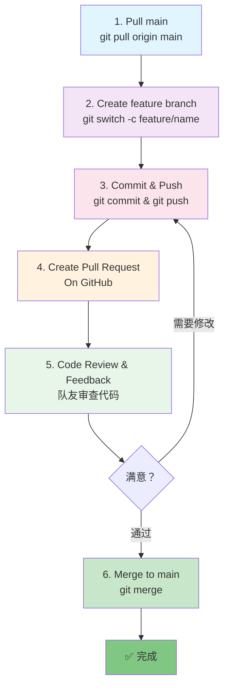

# 第 5 章：团队协作与代码审查 (Team Collab)
## 👥 从独立开发到团队协作——Pull Request 工作流

在这一章，你会学到如何在团队中使用 Git 和 GitHub，包括最重要的概念：**Pull Request**。

---

## 你会学到

- ✅ **Feature Branch Workflow**：团队开发的标准流程
- ✅ **Pull Request（PR）**：代码合并前的安全检查
- ✅ **Code Review**：如何审查队友的代码
- ✅ **Python 团队场景**：处理 `requirements.txt` 冲突等常见问题

---

## 5.1 团队开发的标准流程（Feature Branch Workflow）

### 为什么不能让所有人都在 main 分支上改代码？

想象一个场景：

```
3 个开发者都在 main 分支上改代码
  ├─ Alice: 添加登录功能
  ├─ Bob: 优化数据库查询
  └─ Charlie: 急着修复一个紧急 Bug

结果：
  ├─ 没人知道哪个改动会破坏系统
  ├─ 如果 Alice 的代码有 Bug，整个系统都挂掉
  └─ 无法回滚某个人的改动，只能全部回滚
```

**解决方案**：使用标准的 **Feature Branch Workflow**。

### 工作流的 6 个步骤



让我们详细讲解每一步：

---

### 步骤 1：开始新任务前，拉取最新的 main

```bash
# 切换到 main
git switch main

# 拉取最新代码（确保你的本地是最新的）
git pull origin main
```

**为什么重要**？如果上一次开发到现在，队友已经合并了新代码到 main，而你的本地还是旧的，后面合并会很麻烦。

---

### 步骤 2：创建功能分支

```bash
# 基于最新的 main，创建功能分支
git switch -c feature/user-dashboard

# 分支命名建议：
# feature/功能名
# bugfix/Bug描述
# refactor/重构说明
```

---

### 步骤 3：开发、测试、提交

在你的功能分支上进行开发，写代码、测试、提交：

```bash
# 修改代码文件
# ...

# 小的改动就提交一次
git add .
git commit -m "feat: 添加用户资料页面"
git commit -m "feat: 实现用户头像上传"
git commit -m "fix: 修复头像显示的边框问题"

# 这样做的好处：每个提交都是一个逻辑单元，容易追踪改动
```

!!! tip "提交消息规范"
    
    使用一致的前缀让提交历史清晰：
    
    - `feat:` 新功能
    - `fix:` 修复 Bug
    - `refactor:` 代码重构，功能不变
    - `docs:` 文档更新
    - `test:` 测试相关
    - `style:` 格式调整（缩进、换行等）

---

### 步骤 4：推送到 GitHub

开发完成后，推送你的分支到 GitHub：

```bash
git push origin feature/user-dashboard
```

这样队友就能看到你的代码了。

---

### 步骤 5：发起 Pull Request（PR）

现在最重要的一步：在 GitHub 网页上发起 PR。

1. 打开你的 GitHub 仓库页面
2. 你会看到一个黄色条幅，提示你最近 push 了新分支
3. 点击 **"Compare & pull request"**
4. 或者手动跳转到 **Pull requests** 标签页，点击 **"New pull request"**

在 PR 表单中：

- **Title**：填写 PR 标题（通常是功能简述，如 "Add user dashboard"）
- **Description**：详细说明这个 PR 做了什么，为什么这样做，有没有已知的问题
- **Reviewers**：指定哪些队友应该审查这个 PR
- **Assignees**：通常指定自己
- **Labels**：标记 PR 的类型（feature、bugfix 等）

**PR 描述模板示例**：

```markdown
## 功能说明
添加用户资料编辑页面，用户可以修改头像、昵称和个人简介。

## 改动内容
- 新增 `UserProfile` 组件
- 添加用户仓库的 `update_profile()` 方法
- 集成图片上传服务

## 测试方式
1. 登录后进入个人资料页面
2. 上传新头像
3. 修改昵称
4. 点击保存，验证数据已更新

## 相关参考信息
- 关联 Issue #42（用户反馈头像太小）
```

---

### 步骤 6：队友审查代码

现在你的队友会收到通知，说你发起了一个 PR。他们会：

1. **查看改动**：比较 `main` 分支和你的 `feature/user-dashboard` 分支有什么不同
2. **提出反馈**：如果没问题，点击 Approve；如果有问题，点击"Request changes"，并写下具体意见
3. **你进行修改**：根据反馈继续提交改动
4. **重新审查**：队友再次检查，直到满意为止
5. **合并**：所有人都同意后，某个有权限的人（通常是项目负责人）点击 **"Merge pull request"**

!!! info "Code Review 是什么？"
    
    **Code Review**（代码审查）= 在代码合并到主分支前，让其他开发者检查一遍，确保：
    
    - ✅ 代码符合团队规范
    - ✅ 没有明显的逻辑错误
    - ✅ 没有安全漏洞
    - ✅ 有适当的错误处理和日志

---

## 5.2 Python 团队特定场景：处理 `requirements.txt`

在 Python 团队中，一个常见的问题是：多个开发者同时修改 `requirements.txt`。

### 场景：两个开发者都升级了不同的库

```
main 分支的 requirements.txt:
  Flask==2.3.0
  Requests==2.31.0

你的分支 (feature/auth):
  Flask==2.3.0
  Requests==2.31.0         ← 没改这个
  PyJWT==2.8.0             ← 你加的

Alice 的分支 (feature/payment):
  Flask==2.4.0             ← Alice 升级了
  Requests==2.31.0
  Stripe==6.0.0            ← Alice 加的
```

现在你俩的 PR 都要合并回 main，怎么办？

### 解决方法

1. **你的 PR 先合并**，现在 main 有了 PyJWT
2. **Alice 的 PR 要合并前**，GitHub 会检测到冲突
3. **Alice 需要解决冲突**：

```bash
# Alice 在她的电脑上同步 main
git fetch origin main
git merge origin/main

# 这会在 requirements.txt 里产生冲突标记
# Alice 手动编辑 requirements.txt，确保保留所有必要的库

# 最终版本应该是：
Flask==2.4.0       # Alice 的升级
Requests==2.31.0
PyJWT==2.8.0       # 你的库
Stripe==6.0.0      # Alice 的库

# 解决完冲突，提交并推送
git add requirements.txt
git commit -m "resolve: merge main into feature/payment"
git push origin feature/payment
```

GitHub 会自动检测到冲突已解决，PR 就能合并了。

### 最佳实践：经常合并 main

避免冲突的最好办法是**经常从 main 拉取更新**：

```bash
# 在你的功能分支上工作一段时间后
git fetch origin main
git merge origin/main

# 这样能尽早发现冲突，而不是积累到最后
```

---

## 5.3 团队协作的纪律（Do's and Don'ts）

### ✅ 应该做的事

- ✅ 每个功能创建一个分支
- ✅ 小的、有意义的 commit
- ✅ 清晰的 PR 描述
- ✅ 及时响应 Code Review 反馈
- ✅ 合并前测试通过
- ✅ 经常 pull main 分支的最新代码

### ❌ 不应该做的事

- ❌ 直接在 main 分支提交（除非你是独立开发者）
- ❌ 大的、跨越多个功能的 commit
- ❌ 强制 push（`git push -f`）到共享分支
- ❌ 忽视 Code Review 反馈
- ❌ 把大量未测试的代码推送给队友
- ❌ 删除别人的分支

---

## 5.4 处理 PR 反馈

假设你发起了一个 PR，队友 Bob 留了一条反馈："这里的变量名不清楚，改成 `user_profile` 会更好。"

**你的操作**：

```bash
# 在本地的 feature 分支上进行修改
# 编辑文件，改变量名...

# 提交修改
git add .
git commit -m "refactor: 改变量名为 user_profile"

# 推送到同一个分支
git push origin feature/user-dashboard

# （不需要创建新的 PR，同一个分支的新提交会自动加到旧 PR 中）
```

GitHub 会自动更新 PR，队友可以再次检查你的修改。这个过程可以重复多次，直到所有人都满意。

---

## 📚 关键概念总结

| 概念 | 说明 |
|------|------|
| **Feature Branch** | 为每个功能创建的独立分支 |
| **Pull Request** | 合并前发起的审查申请 |
| **Code Review** | 队友检查代码质量和逻辑 |
| **Merge** | 代码审查通过后，合并到 main |
| **Conflict** | 多个分支修改同一处代码时产生的冲突 |

---

## 🚀 下一步

完成本章后，你已经能够：
- ✅ 理解标准的团队开发流程
- ✅ 发起和参与 Pull Request
- ✅ 处理 Python 特定的团队问题
- ✅ 进行有效的代码审查

**下一章**：处理问题。当冲突发生时如何优雅地解决。
