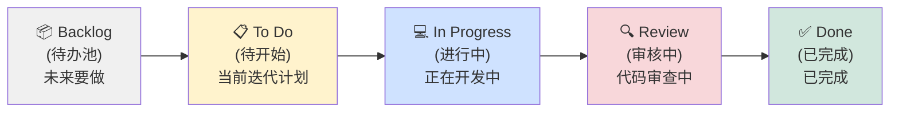
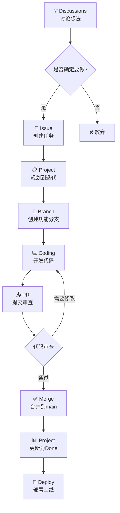
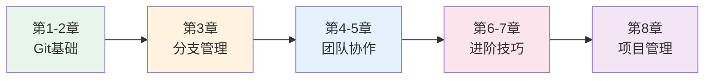

# 第 8 章：项目管理与团队协同——Projects & Discussions
## 📋 从代码协作到项目管理——GitHub 的完整工作流

在这一章，你会学到 GitHub 最强大的项目管理功能：**Projects** 和 **Discussions**。如果说 Git 和 Pull Request 解决了"如何写代码"的问题，那么 Projects 和 Discussions 解决了"如何管理团队工作"的问题。

---

## 你会学到

- ✅ **GitHub Projects 看板**：可视化管理工作项，像管理快递一样管理任务
- ✅ **Issues 与 Projects 的联动**：任务追踪的最佳实践
- ✅ **GitHub Discussions**：异步团队沟通，建立团队知识库
- ✅ **敏捷开发工作流**：迭代、里程碑、Sprint 的实战应用
- ✅ **Python 项目的最佳实践**：依赖管理、技术决策记录

---

## 8.1 为什么需要项目管理工具？

### 从"写代码"到"管理团队"

前几章我们学会了如何用 Git 管理代码，如何用 Pull Request 进行代码审查。但现实中的团队开发还有一个大问题：

> **"那么多要做的事情，怎么知道谁在做什么？进度到哪里了？"**

想象这个场景：

```
团队有 5 个开发者，同时推进 8 个功能：
  ├─ Alice：在做登录功能... 但做到哪一步了？
  ├─ Bob：修复了 3 个 Bug，但还有一个没记录
  ├─ Charlie：说要重构代码，但还没开始
  ├─ David：在等待设计稿，不知道要等多久
  └─ Eve：上周说的优化，完全忘了

问题：
  ├─ 不知道每个人在做什么
  ├─ 不知道哪些任务完成了，哪些还没开始
  ├─ 重要任务被遗漏
  └─ 无法预估项目进度
```

**解决方案**：使用项目管理工具。

---

### GitHub Projects：代码管理的自然延伸

GitHub Projects 是 GitHub 原生内置的项目管理工具，它与代码仓库深度集成。

**为什么要用 Projects？**

| 优势 | 说明 |
|------|------|
| **与代码深度集成** | Issue、PR 可以直接在项目中追踪，不需要切换工具 |
| **免费** | GitHub Free 计划就能使用大部分功能 |
| **无需学习新工具** | 如果你会用 GitHub，已经会了一半 |
| **适合开发团队** | 专为软件项目设计，不像通用工具需要大量配置 |

**Projects vs 其他工具**：

| 工具 | 优点 | 缺点 |
|------|------|------|
| **GitHub Projects** | 与代码集成、免费、学习成本低 | 复杂项目管理功能有限 |
| **Jira** | 功能强大、企业级 | 贵、复杂、需要专门配置 |
| **Trello** | 简单易用 | 与代码没有集成 |
| **Notion** | 灵活、文档+任务一体 | 不是专为开发设计 |

!!! tip "作者建议"
    对于 2-20 人的开发团队，尤其是开源项目或初创公司，GitHub Projects 完全够用。它让你在一个地方管理代码和任务，减少上下文切换。

---

### Discussions vs Issues：什么时候用哪个？

GitHub 提供了两种沟通工具，用途不同：

| 功能 | Issues | Discussions |
|------|--------|-------------|
| **用途** | 追踪具体任务、Bug、功能请求 | 开放式讨论、问答、想法分享 |
| **生命周期** | 有明确的"完成"状态 | 长期存在，可以持续讨论 |
| **示例** | "修复登录页面的 CSS 错位" | "我们应该用什么前端框架？" |
| **回答方式** | 分配给具体人解决 | 社区投票、多人参与 |

**简单判断标准**：

- ✅ 有明确的"完成标准" → 用 **Issues**
- ✅ 没有标准答案，需要讨论 → 用 **Discussions**
- ✅ Bug 报告 → 用 **Issues**
- ✅ 技术选型、架构决策 → 用 **Discussions**

---

### 敏捷开发简介

敏捷开发（Agile）是一系列软件开发方法的统称，核心思想是：

> **小步快跑、持续交付、快速响应变化**

**核心概念**：

- **迭代（Sprint）**：固定周期（通常 1-2 周）的开发冲刺
- **Backlog**：待办事项列表，包含所有要做的功能
- **每日站会**：快速同步进度（可以异步通过看板完成）
- **回顾会议**：每个迭代结束后总结经验

GitHub Projects 完美支持敏捷开发：

- 看板视图 = 可视化的任务流动
- 迭代字段 = Sprint 管理
- 里程碑 = 版本发布计划
- Insights = 燃尽图和进度追踪

---

## 8.2 GitHub Projects 入门

### 创建你的第一个 Project

GitHub Projects 可以创建于两个层级：

1. **仓库级 Project**：只属于某个仓库（如 `my-app`）
2. **组织级 Project**：属于整个组织，可以跨仓库追踪

**创建步骤**：

1. 打开你的 GitHub 仓库页面
2. 点击顶部菜单的 **Projects** 标签
3. 点击绿色按钮 **"Link a project"** 或 **"New project"**
4. 选择项目模板（推荐选择 **"Board"** 看板视图）
5. 给项目命名（如 "Q1 开发计划"）
6. 点击 **Create**

!!! info "视图类型说明"
    GitHub Projects 提供三种视图：
    
    - **Board（看板）**：最常用，卡片在列之间移动，可视化工作流程
    - **Table（表格）**：类似 Excel，适合批量编辑和数据查看
    - **Roadmap（路线图）**：按时间线展示，适合规划发布

---

### 理解工作项（Items）

Project 中的卡片可以是三种类型：

| 类型 | 说明 | 来源 |
|------|------|------|
| **Issue** | 具体的任务、Bug、功能请求 | 从仓库 Issues 添加 |
| **Pull Request** | 代码合并请求 | 自动关联 |
| **Draft Issue** | 草稿任务，暂时不需要创建正式 Issue | 直接在 Project 中创建 |

**添加工作项的方法**：

**方法 A：从现有 Issue 添加**

1. 在 Project 看板中，点击 **"+"** 按钮
2. 选择 **"Add item from repository"**
3. 搜索并选择要添加的 Issue
4. 点击添加

**方法 B：直接在 Project 创建 Draft Issue**

1. 在看板的某一列中，点击 **"+"**
2. 输入任务标题（如 "添加用户头像上传功能"）
3. 按 Enter 创建
4. 点击卡片可以添加描述、设置字段

!!! tip "Draft vs 正式 Issue"
    Draft Issue 适合"还不确定要不要做的想法"。当确定要做时，可以点击卡片上的 **"Convert to issue"** 按钮，把它转成正式的仓库 Issue。

---

### 自定义字段（Custom Fields）

字段让你可以给每个任务添加元数据。常用的字段包括：

**默认字段**：

- **Title**：任务标题
- **Assignees**：负责人（可以多人）
- **Status**：状态（Backlog、Todo、In Progress、Done 等）
- **Labels**：标签（bug、feature、urgent 等）

**推荐添加的自定义字段**：

1. **Priority（优先级）**：High / Medium / Low
2. **Size（工作量）**：XS / S / M / L / XL（类似于 T-shirt sizing）
3. **Iteration（迭代）**：Sprint 1、Sprint 2...
4. **Due Date（截止日期）**：具体日期

**添加自定义字段步骤**：

1. 在 Project 页面，点击右上角的 **"..."** 菜单
2. 选择 **"Settings"**
3. 在左侧菜单选择 **"Custom fields"**
4. 点击 **"New field"**
5. 选择字段类型（Text、Number、Date、Single select、Iteration）
6. 配置字段选项
7. 保存

---

## 8.3 看板工作流实战

### 设置看板列（Columns）

看板的核心是列（Columns），每列代表一个工作阶段。推荐的看板列设置：



**各列说明**：

| 列名 | 用途 | 任务停留时间 |
|------|------|-------------|
| **Backlog** | 未来要做的所有事情，还没排期 | 长期 |
| **To Do** | 当前迭代计划要做的任务 | 到开始开发前 |
| **In Progress** | 有人正在开发中 | 1-3 天 |
| **Review** | PR 已提交，等待代码审查 | 1-2 天 |
| **Done** | 已完成并合并到 main | 不移除，用于记录 |

**添加/修改列**：

1. 在 Board 视图，点击现有列的标题
2. 点击 **"+"** 添加新列，或点击列标题旁边的 **"..."** 重命名
3. 拖动列标题可以重新排序

---

### 工作项的流转

一个任务从创建到完成的典型流程：

```
1. 在 Backlog 创建 Draft Issue
   ↓ 确定在当前迭代做
2. 移动到 To Do 列
   ↓ 开始开发
3. 转换为正式 Issue，移动到 In Progress
   ↓ 创建 PR
4. 移动到 Review 列，关联 PR
   ↓ 代码审查通过
5. 合并 PR，移动到 Done 列
```

**实际操作**：

- **移动卡片**：拖动卡片从一列到另一列
- **快速编辑**：点击卡片，在弹窗中修改标题、描述、字段
- **批量操作**：按住 Shift 选择多个卡片，右键批量修改

---

### 自动化规则配置

GitHub Projects 支持自动化，减少手动操作。

**常用自动化**：

1. **PR 合并后自动移动卡片**
   - 当 PR 被合并，关联的 Issue 自动移到 "Done"

2. **Issue 关闭时自动移动**
   - 当 Issue 被关闭，自动移到 "Done"

3. **PR 创建时自动添加**
   - 新 PR 自动出现在 "Review" 列

**设置自动化（工作流程）**：

1. 在 Project 设置中，选择 **"Workflows"**
2. 启用预设的自动化：
   - "Auto-add to project"：新 Issue/PR 自动加入项目
   - "Auto-archive"：完成的任务自动归档
   - "Code changes"：PR 状态变化时移动卡片
3. 配置触发条件

---

### 视图切换：个人 vs 团队

Projects 支持创建多个视图，不同人看不同的角度。

**常用视图**：

| 视图名称 | 过滤器 | 用途 |
|---------|--------|------|
| **团队看板** | 无过滤 | 所有人看整体进度 |
| **我的任务** | Assignee = 我 | 只看自己的任务 |
| **本周计划** | Iteration = 本周 | 只看当前迭代 |
| **高优先级** | Priority = High | 只看紧急任务 |

**创建新视图**：

1. 在项目页面，点击视图名称旁边的 **"+"**
2. 选择视图类型（Board / Table / Roadmap）
3. 设置过滤器（Filter）
4. 保存视图

---

## 8.4 敏捷开发方法

### 什么是 Scrum 和 Kanban？

**Scrum**：

- 固定时长的迭代（Sprint，通常 1-2 周）
- 每个迭代开始时做计划，结束时做回顾
- 适合需求变化快的项目

**Kanban**：

- 没有固定迭代，持续流动
- 限制每列的卡片数量（WIP Limit），防止同时做太多事
- 适合维护性项目或持续交付

GitHub Projects 可以支持两种模式，也可以混合使用。

---

### 使用迭代（Iteration/Sprint）

迭代是 Scrum 的核心概念。

**创建迭代**：

1. 在 Project 设置中，添加一个 **Iteration** 类型的自定义字段
2. 点击 **"Manage iterations"**
3. 创建迭代：
   - 名称：如 "Sprint 1" 或 "2024-Q1-S1"
   - 开始日期
   - 结束日期（通常是 2 周后）
4. 可以一次创建多个迭代

**使用迭代**：

- 给每个任务分配迭代字段
- 创建视图过滤只看当前迭代
- 在 Roadmap 视图按迭代查看进度

---

### 使用里程碑（Milestone）管理发布

里程碑用于标记重要的发布节点。

**创建里程碑**：

1. 在仓库页面，点击 **Issues** → **Milestones**
2. 点击 **"New milestone"**
3. 设置：
   - 标题：版本号，如 "v1.0.0" 或 "Beta Release"
   - 截止日期
   - 描述：这个版本的目标

**关联 Issue 到里程碑**：

- 在 Issue 页面右侧，选择 Milestone
- 或在 Project 中批量编辑

**查看里程碑进度**：

- 在 Milestones 页面，可以看到完成百分比
- 哪些 Issue 已完成，哪些还在进行

---

### 燃尽图与进度追踪

Projects 提供 Insights 功能，查看项目健康度。

**查看 Insights**：

1. 在项目页面，点击 **"Insights"** 标签
2. 查看各种图表：
   - **燃尽图（Burndown）**：剩余工作量随时间变化
   - **累积流图（Cumulative Flow）**：各列任务数量变化
   - **工作量分布**：按负责人或标签统计

**燃尽图的解读**：

```
理想的燃尽图：
剩余工作量
    │╲
    │  ╲
    │    ╲
    │      ╲
    └────────→ 时间
    从 Sprint 开始到最后，剩余任务逐渐减少

危险的燃尽图：
剩余工作量
    │      ╱
    │    ╱
    │  ╱
    │╱
    └────────→ 时间
    任务没有减少，可能说明计划有问题
```

---

## 8.5 GitHub Discussions——团队的"内部论坛"

### 启用 Discussions

Discussions 不是默认开启的，需要手动启用。

**启用步骤**：

1. 打开仓库页面
2. 点击 **Settings** 标签
3. 在左侧菜单找到 **"General"**
4. 向下滚动到 **"Features"** 部分
5. 勾选 **"Discussions"**
6. 点击 **Save**

启用后，仓库顶部会出现 **Discussions** 标签。

---

### 创建分类（Categories）

分类帮助组织讨论话题。

**默认分类**：

| 分类 | 用途 |
|------|------|
| **Announcements** | 团队公告，只有管理员可以发帖 |
| **General** | 一般讨论 |
| **Ideas** | 功能想法和建议 |
| **Polls** | 投票 |
| **Q&A** | 问答，可以标记最佳答案 |
| **Show and tell** | 展示成果 |

**自定义分类**：

1. 在 Discussions 页面，点击右侧的 **"Categories"**
2. 点击 **"New category"**
3. 设置名称、描述、格式（Discussion / Question / Poll / Show and tell）

**推荐分类设置（Python 项目）**：

- **📢 Announcements** - 版本发布、重要通知
- **💡 Ideas** - 新功能建议
- **❓ Q&A** - 使用问题
- **🐛 Bug Reports** - 非紧急 Bug 讨论
- **🛠️ Dev Discussion** - 技术实现讨论
- **📚 Resources** - 学习资源分享

---

### 发起讨论和参与

**创建讨论**：

1. 点击 **"New discussion"**
2. 选择分类
3. 填写标题和内容（支持 Markdown）
4. 提交

**参与讨论**：

- **回复**：点击 **"Reply"** 添加评论
- **引用**：选中文字后点击 **"Quote"**
- **表情**：添加 👍 👎 🎉 等反应
- **订阅**：点击 **"Subscribe"** 接收通知

**标记答案（Q&A 分类）**：

- 提问者在收到满意答案后，点击 **"Mark as answer"**
- 这会把该回答置顶，方便其他人找到

---

### 将 Discussion 转换为 Issue

当讨论的想法确定要实施时，可以转换为 Issue。

**转换步骤**：

1. 在 Discussion 页面，点击右侧的 **"Create issue"**
2. Issue 会自动关联到该 Discussion
3. Discussion 会显示一个链接指向新创建的 Issue

**转换时机**：

- 讨论达成共识，需要具体实施
- 有人自愿负责这个任务
- 确定优先级和迭代

---

### 建立团队知识库

Discussions 可以积累成知识库。

**知识库最佳实践**：

1. **鼓励搜索**：提问前先搜索是否有类似讨论
2. **标记答案**：Q&A 分类及时标记正确答案
3. **置顶重要话题**：重要讨论可以置顶
4. **定期整理**：过时讨论关闭或归档
5. **链接到文档**：把重要讨论链接到 README 或 Wiki

**与 Wiki 的区别**：

| Discussions | Wiki |
|-------------|------|
| 动态、互动 | 静态、参考 |
| 适合讨论、问答 | 适合教程、文档 |
| 多人参与 | 少数人维护 |
| 内容可能过时 | 需要主动更新 |

!!! tip "结合使用"
    - 用 **Discussions** 讨论和决策
    - 达成共识后，把结论整理到 **Wiki** 或 **README**
    - 在 Wiki 中链接回 Discussion，保留讨论历史

---

## 8.6 完整的协同开发工作流

### 工作流全貌

一个功能从想法到上线的完整流程：



---

### 每日站会的替代：看板更新

传统敏捷有"每日站会"，但可以异步化：

**异步站会（通过 Project 看板）**：

1. 每个人每天更新自己负责的卡片：
   - 如果完成了，移动到 Done
   - 如果进行中，确保在 In Progress
   - 如果受阻，添加评论说明原因

2. 在卡片评论区简单更新：
   ```
   昨天：完成了用户登录 API
   今天：开始做前端登录页面
   阻碍：等待设计稿确认
   ```

**同步站会（快速会议）**：

- 只讨论看板中"In Progress"和"Review"列的卡片
- 重点关注"卡住"的任务
- 15 分钟内结束

---

### 代码审查与项目进度同步

**代码审查流程**：

1. 开发者在 Project 中将任务移到 "Review"
2. 创建 PR，描述中关联 Issue（`Fixes #123`）
3. 审查者在 PR 中评论
4. 批准后，合并代码
5. 关联的 Issue 自动关闭
6. Project 卡片自动移到 "Done"

**同步检查点**：

- **迭代中期检查**：看看 In Progress 列是否太多任务
- **迭代结束前 2 天**：确定哪些任务能完成，哪些要移到下个迭代
- **迭代结束**：回顾 Done 列，总结经验

---

## 8.7 Python 团队协作最佳实践

### 使用 Projects 管理依赖更新

Python 项目的依赖管理很重要，可以用 Projects 追踪。

**创建依赖更新工作流**：

1. **Dependabot** 自动创建 PR 更新依赖
2. PR 自动出现在 Project 的 "Review" 列
3. 审查者检查：
   - 变更日志（Changelog）
   - 是否破坏兼容性
   - CI 测试是否通过
4. 合并前在本地测试：
   ```bash
   pip install -r requirements.txt
   pytest
   ```

**依赖更新分类**：

| 优先级 | 类型 | 处理方式 |
|--------|------|---------|
| **High** | 安全更新 | 立即处理 |
| **Medium** | 小版本更新 | 本周内处理 |
| **Low** | 大版本更新 | 计划到下个迭代 |

---

### Discussions 中的技术决策记录（ADR）

重大技术决策应该在 Discussions 中讨论并记录。

**ADR（Architecture Decision Record）讨论模板**：

```markdown
## 决策：使用 FastAPI 还是 Flask？

### 背景
我们需要为新的 API 服务选择 Web 框架...

### 选项
1. **FastAPI**
   - 优点：高性能、自动文档、类型提示
   - 缺点：学习曲线、较新
   
2. **Flask**
   - 优点：成熟、灵活、社区大
   - 缺点：需要额外配置异步

### 决定
选择 FastAPI，因为...

### 影响
- 需要团队学习 Type Hints
- 自动生成 API 文档节省工作
```

**决策流程**：

1. 在 Discussions 发起 ADR 讨论
2. 团队成员评论、投票
3. 达成共识后，更新主帖添加"决定"
4. 把结论写入项目的 `docs/adr/` 目录
5. 关闭 Discussion，链接到 ADR 文档

---

### Issue 模板规范

规范的 Issue 模板帮助提交者提供必要信息。

**创建 Issue 模板**：

1. 在仓库创建 `.github/ISSUE_TEMPLATE/` 目录
2. 创建模板文件，如 `bug_report.md` 和 `feature_request.md`

**Bug Report 模板示例**：

```markdown
---
name: Bug report
about: 报告一个问题
title: '[Bug] '
labels: bug
assignees: ''
---

**描述 Bug**
清晰描述发生了什么

**复现步骤**
1. 打开 '...'
2. 点击 '...'
3. 看到错误

**期望行为**
应该发生什么

**环境**
- Python 版本: [如 3.9]
- 操作系统: [如 Windows 11]
- 项目版本: [如 v1.2.0]

**截图**
如果有截图请附上
```

**效果**：

- 创建 Issue 时可以选择模板
- 提交者按模板填写
- 审查者获得完整信息
- Issue 自动添加标签

---

### 开源项目的社区管理

如果你的 Python 项目是开源的，Projects 和 Discussions 对社区管理很有帮助。

**社区管理最佳实践**：

1. **标签系统**：
   - `good first issue`：适合新手的简单任务
   - `help wanted`：需要社区帮助
   - `discussion`：需要先讨论再决定

2. **Projects 公开**：
   - 公开项目的 Roadmap
   - 让贡献者知道项目在往哪个方向发展

3. **Discussions 作为论坛**：
   - Q&A 分类回答使用问题
   - Ideas 分类收集功能建议
   - Show and tell 让用户展示他们的项目

4. **自动欢迎**：
   - 配置 GitHub Actions，对新 Issue/PR 自动回复
   - 感谢贡献者，告知接下来的流程

---

## 📚 关键要点总结

| 功能 | 核心作用 | 使用场景 |
|------|---------|---------|
| **Projects 看板** | 可视化任务管理 | 追踪开发进度、分配任务 |
| **自定义字段** | 任务元数据 | 优先级、工作量、迭代规划 |
| **自动化** | 减少手动操作 | PR 合并自动更新状态 |
| **Discussions** | 开放式讨论 | 技术决策、问答、想法收集 |
| **迭代** | Sprint 管理 | 敏捷开发、定期发布 |
| **里程碑** | 版本发布 | 大版本规划、发布节点 |

**完整工作流记忆口诀**：

> **"讨论想法 → 创建任务 → 看板追踪 → 分支开发 → PR 审查 → 完成归档"**

**工具选择速查表**：

| 场景 | 使用工具 |
|------|---------|
| 具体 Bug 或功能请求 | Issues |
| 开放式讨论或问答 | Discussions |
| 追踪任务进度 | Projects |
| 代码审查 | Pull Requests |
| 发布规划 | Milestones |
| 团队知识库 | Discussions + Wiki |

---

## 🎉 恭喜完成全部学习！

**你已经完成了《Git 与 GitHub 团队协作指南》的全部 8 章学习！**

从最初不懂版本控制，到现在能够熟练使用 Git/GitHub 进行团队协作和项目管理，你已经掌握了现代软件开发的核心技能。

### 你的技能成长路径



**现在你可以**：

- 🎯 **独立开发**：使用 Git 管理代码版本，从容应对各种情况
- 🤝 **团队协作**：通过 Pull Request 进行代码审查，处理合并冲突
- 📊 **项目管理**：使用 Projects 看板追踪进度，应用敏捷方法
- 💬 **团队沟通**：使用 Discussions 进行技术决策和知识分享
- 🐍 **Python项目**：管理依赖、规范流程、开源协作

### 实践建议

知识的价值在于应用。建议你：

1. **立即行动**：找一个实际项目，应用所学的工作流
2. **带领团队**：如果你有机会，帮助团队建立这套协作流程
3. **持续改进**：没有完美的流程，根据团队情况调整优化
4. **分享知识**：教其他人使用 Git，巩固自己的理解

### 最后的话

Git 和 GitHub 不只是工具，它们代表了一种**协作开发的文化**：

- 📚 **透明**：代码历史对所有人可见
- 🔍 **审查**：通过代码审查保证质量
- 📝 **记录**：重要决策都有迹可循
- 🚀 **持续交付**：小步快跑，持续改进

这种文化让软件团队能够高效协作、快速响应变化、持续交付价值。

**祝你在软件开发的道路上越走越远，写出优雅的代码，构建出色的产品！** 🚀

---

*本教程由 南哪助手 如涉千山. 生成并修订，希望它能成为你 Git 学习路上的好伙伴。*

*如果在使用中遇到问题，欢迎回来查阅，也欢迎分享给更多需要的人。*

**Happy Coding!** 🎊
