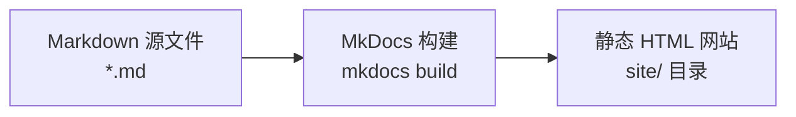

# 第 2 章：MkDocs 入门

> **从零到"Hello World"** —— 安装 MkDocs，创建第一个项目，在浏览器中看到你的文档网站。

---

## 2.1 什么是 MkDocs？

MkDocs 是一个用 Python 编写的 **静态站点生成器（Static Site Generator）**，专为构建项目文档而设计。它的工作方式很简单：



你只需要用 Markdown 写内容，MkDocs 会自动将其转换为带有导航、搜索和美观主题的完整网站。

!!! info "静态站点 vs 动态站点"

    - **静态站点**：每个页面是预先生成的 HTML 文件，访问速度快、无需服务器端处理。MkDocs 生成的就是静态站点。
    - **动态站点**：页面在用户访问时由服务器实时生成（如 WordPress）。功能灵活但需要服务器和数据库。

---

## 2.2 安装 MkDocs 和 Material 主题

在项目文件夹中打开终端，执行以下命令：

```bash
# 安装 MkDocs
pip install mkdocs

# 安装 Material for MkDocs 主题（最流行的 MkDocs 主题）
pip install mkdocs-material
```

!!! tip "使用虚拟环境（推荐）"

    虚拟环境可以隔离项目依赖，避免不同项目之间的包版本冲突：
    
    ```bash
    # 创建虚拟环境
    python -m venv venv
    
    # 激活虚拟环境
    # Windows:
    venv\Scripts\activate
    # macOS / Linux:
    source venv/bin/activate
    
    # 激活后，终端提示符前会出现 (venv) 标识
    # 然后再执行 pip install 命令
    ```

验证安装是否成功：

```bash
mkdocs --version
# 预期输出：mkdocs, version 1.6.x from ...
```

---

## 2.3 创建新项目

使用 MkDocs 内置命令快速创建项目骨架：

```bash
mkdocs new .
```

!!! note "命令中的 `.` 是什么意思？"

    `mkdocs new .` 中的 `.` 表示"在当前目录下创建项目"。如果你想把项目创建在一个子目录中，可以写成 `mkdocs new my-project`。

执行后，项目目录中会生成以下文件：

```
my-docs/
├── mkdocs.yml          # MkDocs 配置文件
├── docs/
│   └── index.md        # 站点首页（Markdown 格式）
```

**渲染效果：** `mkdocs new` 命令在当前目录生成了两个核心文件——`mkdocs.yml` 是配置文件，`docs/index.md` 是默认首页。这是 MkDocs 项目的最小结构。

---

## 2.4 本地预览

MkDocs 内置了开发服务器，支持热重载（修改文件后浏览器自动刷新）：

```bash
mkdocs serve
```

执行后，终端会显示类似以下信息：

```
INFO    -  Building documentation...
INFO    -  Cleaning site directory
INFO    -  Documentation built in 0.35 seconds
INFO    -  [16:30:12] Serving on http://127.0.0.1:8000/
```

打开浏览器，访问 **http://127.0.0.1:8000/**，你将看到你的第一个 MkDocs 文档网站！

!!! tip "热重载体验"

    保持 `mkdocs serve` 运行，然后用 VS Code 打开 `docs/index.md`，修改其中的文字并保存。切换到浏览器，你会发现页面自动刷新显示了新内容——这就是热重载。

---

## 2.5 修改站点基本信息

打开 `mkdocs.yml`，修改站点名称：

```yaml
site_name: 我的文档站点
site_description: 这是我的第一个 MkDocs 文档网站
site_author: 你的名字
```

保存后，浏览器中的网站标题会自动更新。

!!! info "YAML 语法小提示"

    - YAML 使用 **缩进**（空格，不能用 Tab）表示层级关系
    - `key: value` 格式，冒号后必须有一个空格
    - 字符串可以不用引号，但包含特殊字符时建议加引号

---

## 2.6 构建静态文件

当你对预览效果满意后，可以生成最终的静态 HTML 文件：

```bash
mkdocs build
```

执行后，项目目录中会多出一个 `site/` 文件夹，里面包含了完整的静态网站：

```
my-docs/
├── mkdocs.yml
├── docs/
│   └── index.md
└── site/                    # 构建产物（可部署到任何静态服务器）
    ├── index.html
    ├── 404.html
    ├── sitemap.xml
    ├── assets/
    │   ├── javascripts/
    │   ├── stylesheets/
    │   └── images/
    └── search/
```

!!! note "site/ 目录不需要提交到 Git"

    `site/` 是构建产物，应该添加到 `.gitignore` 中。我们将在第 6 章通过 GitHub Actions 在云端自动构建，本地不需要保留这个目录。

---

## 2.7 常用命令速查

| 命令 | 作用 |
|:---|:---|
| `mkdocs new .` | 在当前目录创建新项目 |
| `mkdocs serve` | 启动开发服务器，支持热重载 |
| `mkdocs serve -a 0.0.0.0:8080` | 指定 IP 和端口启动 |
| `mkdocs build` | 构建静态 HTML 到 `site/` 目录 |
| `mkdocs build --clean` | 构建前清空 `site/` 目录 |
| `mkdocs --help` | 查看所有可用命令 |

---

## 本章要点总结

- [ ] 理解 MkDocs 是"Markdown → 静态 HTML"的转换工具
- [ ] 成功安装 MkDocs 和 mkdocs-material 主题
- [ ] 使用 `mkdocs new .` 创建了项目骨架
- [ ] 使用 `mkdocs serve` 在本地预览了网站
- [ ] 修改了 `mkdocs.yml` 中的站点基本信息
- [ ] 了解了 `mkdocs build` 的作用

---

👉 [进入第 3 章：配置详解 →](03-configuration.md)