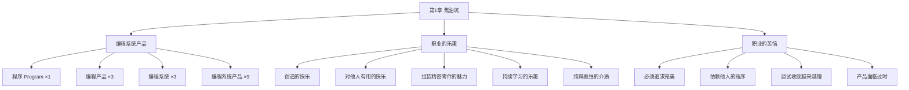

# 第1章 · 焦油坑

> *"岸上的船儿，如同海上的灯塔，无法移动。"* —— 荷兰谚语

---

## 🗺️ 知识结构导图

---

## 📘 概念先导：什么是「软件工程」？

在开始阅读这本经典之前，先搞清楚这本书到底在讲什么。

!!! info "基础概念：软件工程（Software Engineering）"

    **软件工程** 是一门研究如何 **系统化、规范化、可量化地** 开发和维护软件的学科。它和「编程」的关系就像「土木工程」和「砌砖」的关系——前者包含了后者的技能，但增加了 **规划、设计、管理、质量保证、团队协作** 等系统性维度。
    
    1968 年 NATO 会议上首次正式提出「软件工程」这个词，当时正值「软件危机」——大型软件项目严重超支、延期、质量低劣。Brooks 的《人月神话》（1975）正是对这场危机最深彻的反思之一。

!!! info "基础概念：编程系统产品"

    本章最重要的概念框架是 Brooks 的 2×2 矩阵。在进入正文之前先理解它：
    
    - **程序（Program）**：作者自己能跑通的代码——车库里的原型。×1 成本。
    - **编程产品（Programming Product）**：可以被任何人运行、测试、修复和扩展的程序。需要通用化输入、彻底测试、完备文档。×3 成本。
    - **编程系统（Programming System）**：在功能上能相互协作的程序集合，具有规范的格式和精确定义的接口。×3 成本。
    - **编程系统产品（Programming Systems Product）**：两者的交集——大多数系统开发的真正目标。**×9 成本。**
    
    这个框架解释了为什么「我周末写的原型」和「你可以交付给客户的产品」之间的差距是 **9 倍**。

---

## 💡 认知冲突：你写的程序 ≠ 你可以交付的产品

假设你花了一个周末，用 Python + Flask 写了一个小型 Web API。它能跑、能返回正确的 JSON。你觉得「搞定了」。

**但如果要让 100 个陌生人也能部署、使用、甚至修改它，还需要什么？**

先别急着回答。Brooks 在这一章的开头用了一个令人难忘的画面——读完你会重新审视每一个你声称「完成了」的程序。

---

## 1.1 焦油坑中的巨兽

Brooks 用一个震撼的比喻打开了这本书：

> *史前史中，没有别的场景比巨兽在焦油坑中垂死挣扎的场面更令人震撼。恐龙、猛犸象、剑齿虎在焦油中挣扎。它们挣扎得越是猛烈，焦油纠缠得越紧，没有任何猛兽足够强壮或具有足够的技巧，能够挣脱束缚，它们最后都沉到了坑底。*

**大型软件项目就是这个焦油坑。** 各种团队——大型和小型的，庞杂和精干的——一个接一个淹没其中。

!!! info "精准定义：焦油坑（The Tar Pit）"

    Brooks 用「焦油坑」隐喻大型系统开发的 **渐进性困境**：问题不是由一个致命错误导致的，而是大量相互关联的小问题累积纠缠，使项目越挣扎越深陷。其核心特征是：
    
    - **非线性恶化**：问题不是简单相加，而是相互放大
    - **不可逆性**：一旦陷入，难以通过简单补救恢复
    - **认知盲区**：团队在陷入时往往不自知，直到无法挽回
    
    表面上好像没有任何一个单独的问题会导致困难，每个都能被解决——但是当它们 **相互纠缠和累积在一起** 的时候，团队的行动就会变得越来越慢。

---

## 1.2 编程系统产品：从「我的程序」到「可交付的软件」

Brooks 提出了一个影响深远的分类框架，用一个 2×2 矩阵来理解软件产品的成本结构。他首先把左上角的「**程序（Program）**」定义为起点——这是可以在作者自己的系统平台上运行的完整程序，通常是「车库中产出的产品」。

**程序转变为更有用但也更昂贵的东西有两条路径：**

### 水平方向：程序 → 编程产品（×3 成本）

要成为通用的编程产品，程序必须：
- 按照 **普遍认可的风格** 来编写
- 输入范围和形式必须 **扩展** 到所有合理的基本算法
- 进行 **彻底测试**——准备、运行和记录详尽的测试用例库
- 拥有 **完备的文档**——每个人都可以加以使用、修复和扩展

### 垂直方向：程序 → 编程系统（×3 成本）

要成为系统构件，程序必须：
- 输入和输出在语法和语义上与 **精确定义的接口** 一致
- 符合 **预先定义的资源限制**（内存空间、I/O 设备、计算机时间）
- 同其他系统构件以 **任何能想象到的组合** 进行测试——测试范围非常广

### 右下角：编程系统产品（×9 成本）

这才是 **真正有用的产品**，是大多数系统开发的目标。

!!! example "生活例证：从课程项目到开源项目再到 SaaS 产品"

    你在课堂上的课程项目 = 「程序」（×1）：你能跑通，老师能看到结果，完事。
    
    你发布到 GitHub 上的开源项目 = 「编程产品」（×3）：需要写 README、处理操作系统兼容性、写测试、写文档、处理 Issue。
    
    一个真正被成千上万用户使用的 SaaS 产品 = 「编程系统产品」（×9）：需要 API 文档、向后兼容、安全审计、性能监控、多语言支持、7×24 运维……

---

## 1.3 职业的乐趣：编程为什么有趣？

Brooks 列举了五种乐趣。这些乐趣今天依然真实——甚至因为技术的进步而更加强烈：

| 乐趣 | Brooks 的描述 | 现代映射 |
|------|-------------|----------|
| ① 创造的快乐 | 如同小孩玩泥巴，成年人喜欢创建自己设计的事物 | 从零写一个 app，看到它跑起来的那一刻 |
| ② 对他人有用 | 内心深处期望别人使用我们的成果 | 开源项目收到第一个 Star / PR |
| ③ 组装精密零件 | 将啮合的零部件组装在一起，看它们精妙运行 | 微服务之间优雅地协作，数据在管道中流转 |
| ④ 持续学习 | 每个问题在某个方面总有不同 | 每次接触新技术栈的新鲜感 |
| ⑤ 纯粹思维的介质 | 程序员像诗人一样，几乎仅仅工作在思考中 | 「我只需要一个终端和大脑」 |

Brooks 特别强调了第五种乐趣的独特性：**「程序员，就像诗人一样，几乎仅仅工作在单纯的思考中。他凭空地运用自己的想象，来建造自己的'城堡'。」** 很少有这样的介质——创造的方式如此灵活，如此易于精炼和重建，如此容易实现概念上的设想。

但紧接着他就警告：**「不过我们将会看到，容易驾驭的特性也有它自己的问题。」**——这是第 2 章「乐观主义陷阱」的先声。

---

## 1.4 职业的苦恼：你必须提前知道的事

Brooks 坦诚地列出了这个职业的阴暗面。知道它们的存在，你才不会被它们击倒：

!!! warning "编程的四大苦恼"

    **① 必须追求完美。** 计算机不容忍任何微小的差错。一个字符错了，魔术就不灵了。*「实际上，我认为学习编程的最困难部分，是将做事的方式往追求完美的方向调整。」* 现实中很少的人类活动要求这种级别的完美——人类对它本来就不习惯。
    
    **② 依赖他人的程序。** 你依赖的库可能设计不合理、实现拙劣、文档糟糕。你不得不花时间去研究和修改本应可靠完整的东西——这或许是 GitHub 上最多的 Issue 类型。*「对于系统编程人员而言，对其他人的依赖是一件非常痛苦的事情。」*
    
    **③ 调试是线性收敛的，甚至更糟。** 找到最后一个 bug 比找到第一个 bug 花费更多时间。Brooks 指出：**「人们发现调试和查错往往是线性收敛的，或者更糟糕的是，具有二次方的复杂度。」** 这不是你的能力问题——这是事实。
    
    **④ 产品在完成时可能已经过时。** 当产品开发完成时，更优秀的新产品通常已经在被谈论。*「一旦设计被冻结，在概念上就已经开始陈旧了。」*

---

## 🔭 探索者之路：现代焦油坑

> 以下内容为拓展，可跳过不影响主线学习。

Brooks 在 1975 年描绘的焦油坑，在 2025 年依然存在——只是换了面貌：

- **微服务架构**：解决了单体应用的焦油坑，却可能制造分布式系统的焦油坑（网络延迟、数据一致性、服务发现、分布式调试……）
- **AI 辅助编程**：Copilot 帮你写代码更快了，但「必须追求完美」的苦恼没有消失——AI 生成的代码同样有 bug，而且 **更难被发现**（因为看起来合理）
- **SaaS 的持续交付**：产品永远不会「过时」——但这也意味着你 **永远不能「完成」**
- **前端框架的快速迭代**：React → Vue → Svelte → Solid → ……正如 Brooks 所说，*「设计一旦被冻结，在概念上就已经开始陈旧了」*

---

## 💡 像工程师一样思考

> **抽象与建模。** Brooks 用 2×2 矩阵（程序 vs 产品 vs 系统）来建模软件的成本结构——这是一种典型的工程思维。面对复杂问题，先用一个 **简单模型抓住核心**，再逐步细化。
>
> 探究步骤：
>
> 1. **提问**：我当前的软件在 Brooks 矩阵的哪个位置？
> 2. **假设**：如果要向右（产品化）或向下（系统化）移动，成本会增加多少？
> 3. **验证**：给我的项目估一个「产品化指数」——还需要做哪些事才能算「产品」？

---

## 🧠 学习加油站

!!! question "停下来想一想"

    1. 你最近写的那个程序，属于 Brooks 矩阵的哪个位置？如果目标是右下角（编程系统产品），还需要额外做什么？
    2. Brooks 说的五种职业乐趣中，哪一种最能引起你的共鸣？哪一种你还没体验过？
    3. 「依赖他人的程序」——回忆一次你被别人的代码/库坑到的经历。这和 Brooks 描述的苦恼一致吗？

---

## 📝 要点总结

- [ ] 「焦油坑」描述了大型软件开发的渐进性困境——问题相互纠缠，越挣扎越深陷
- [ ] 编程系统产品的成本约为独立程序的 **9 倍**（产品化 ×3 + 系统化 ×3）
- [ ] 编程的五种乐趣：创造、有用、组装、学习、纯粹思维
- [ ] 编程的四种苦恼：完美主义、依赖他人、调试收敛慢、过时焦虑
- [ ] 理解这些乐趣与苦恼，是你面对焦油坑的第一步

---

## 🏋️ 课后练习

**A. 识记与简单模仿**

1. 画出 Brooks 的 2×2 矩阵，标注四个格子及其成本倍数。
2. 列出编程的五种乐趣和四种苦恼，各用一句话解释。

**B. 理解与变式辨析**

3. 为什么「编程产品」的成本是独立程序的 3 倍？具体多了哪些工作？
4. Brooks 说「容易驾驭的特性也有它自己的问题」——这指的是什么？这个观点为后续哪一章埋下了伏笔？

**C. 综合应用与迁移**

5. 选一个你正在做（或做过的）项目，评估它在 Brooks 矩阵中的位置。如果目标是变成「编程系统产品」，列出你需要做的额外工作清单，并估算这些工作大致会增加多少工作量（3 倍？9 倍？）。

**D. 探究与开放挑战**

6. 🔭 Brooks 的 ×9 成本模型是在 1975 年提出的。在云原生、微服务、AI 辅助编程的时代，这个模型还成立吗？具体来说：SaaS 的规模效应是否降低了「产品化」的边际成本？Docker/Kubernetes 是否降低了「系统化」的集成成本？写一篇简短的分析。

---

## 🚪 下一章预告

在第二章，我们将直面 Brooks 最著名的论断——**「人月神话」**。为什么「投入更多人力会反而让项目更慢」？这不是鸡汤，而是有严格的数学基础：沟通成本以 n(n-1)/2 增长，以及可分解性的硬约束。

**核心概念：Brooks 法则**  
- 向一个已经延误的项目添加人力，只会让它更延误  
- 1/3 计划 + 1/6 编码 + 1/2 测试 = 黄金分配法

👉 [进入第2章：人月神话](chapter2.md)
