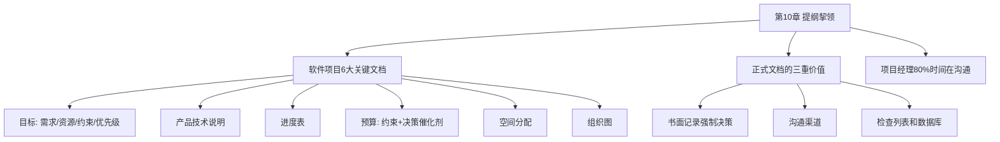

# 第10章 · 提纲挈领

> *"在一片文件的汪洋中，少数文档形成了关键的枢纽，每件项目管理的工作都围绕着它们运转。"*

---

## 🗺️ 知识结构导图

---

## 📘 概念先导：文档到底为了谁？

Brooks 指出，文档有三种读者：使用程序的用户（需要 9 项说明）、验证程序的用户（需要 3 类测试用例）、修改程序的开发者（需要 5 项内部结构概述）。本章重点不是「文档怎么写」（那是第 15 章），而是 **「项目经理需要维护哪些文档来管理项目」。**

---

## 10.1 六大关键文档

| 文档 | 为什么关键 |
|------|-----------|
| 📋 目标 | 定义成功的样子——没有它团队在黑暗中射击 |
| 📖 产品技术说明 | 第一个产生、最后一个完成的文档——所有工作的依据 |
| ⏱️ 进度表 | 时间安排和里程碑（第 14 章的核心） |
| 💰 预算 | 不仅仅是约束——**它迫使技术决策的制订** |
| 🏢 空间分配 | 影响沟通模式（第 7 章的回响） |
| 👥 组织图 | **与接口说明相互依存**——Conway 定律雏形 |

---

## 10.2 正式文档的三重价值

1. **书面记录强制决策**——书写需要上百次细小决定，使策略从模糊变清晰
2. **沟通渠道**——项目经理的主要工作是沟通（不是做决定），文档使决策辐射全团队
3. **检查列表和数据库**——周期性回顾，清楚项目所处状态

> *"只有一小部分管理人员的时间——可能只有 20%——用来从自己头脑外部获取信息。其他的工作是沟通：倾听、报告、讲授、规劝、讨论、鼓励。"*

---

## 🔭 探索者之路

- **RFC / ADR**：架构决策记录
- **OKR**：Brooks「目标文档」的现代版本
- **Amazon 6-pager**：6 页叙述文替代 PPT——书写强制思考
- **Google Design Doc**：让所有相关人在同一页面上理解决策

---

## 📝 要点总结

- [ ] 六大关键文档：目标、说明、进度、预算、空间、组织图
- [ ] 正式文档三重价值：强制决策、沟通渠道、检查列表
- [ ] 项目经理 80% 时间在沟通——关键文档使沟通高效
- [ ] 预算是最被低估的管理工具——它迫使策略决策

---

## 🏋️ 课后练习

**A. 识记**

1. 列出软件项目 6 大关键文档并简述各作用。

**B. 理解**

2. Brooks 说「书写需要上百次细小决定」——你有没有过「写着写着才发现没想清楚」的体验？

**C. 应用**

3. 为你正在做（或计划做）的项目创建一份一页纸的「目标」文档（含需求、资源、约束、优先级）。

**D. 探究**

4. 🔭 对比 Google Design Doc、Amazon 6-pager、RFC 流程和 ADR——它们各自体现 Brooks 「关键文档」思想的哪个侧面？哪个最适合你的团队？

---

## 🚪 下一章预告

第十一章——**「未雨绸缪」**，Brooks 提出了一个看似悖论的观点：**为舍弃而计划**。第一版就是用来抛弃的——不是因为你无能，而是因为「你只能做两次」。只有把第一个版本真的做出来，你才知道什么是正确的设计。

**核心概念：为舍弃而计划**  
- 「Plan to throw one away」——第一版是你学习问题的方式  
- 唯一比第一次做错更昂贵的，是不从第一次中学习

👉 [进入第11章：未雨绸缪](chapter11.md)
