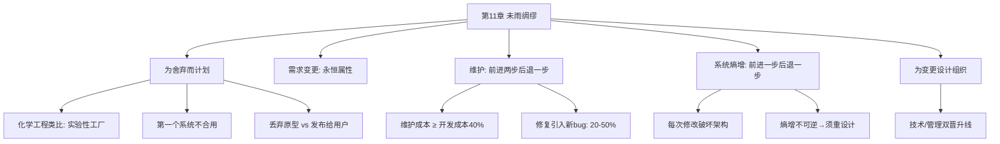

# 第11章 · 未雨绸缪

> *"不变只是愿望，变化才是永恒。"* —— Swift

---

## 🗺️ 知识结构导图



---

## 📘 概念先导：技术债务与系统熵

Brooks 用热力学做类比：系统开发是 **减少混乱度（减少熵）**，软件维护是 **提高混乱度（增加熵）**。熵增不可逆——最终系统退化到必须重新设计。这个思想在 1992 年被 Ward Cunningham 概念化为 **「技术债务」**——每次走捷径都像借高利贷，利息随时间累积，最终必须偿还。

---

## 11.1 为舍弃而计划

!!! danger "全书最令人不安的论断"

    > **对于大多数项目，第一个开发的系统并不合用。** 问题不是「是否构建试验系统然后抛弃」——你必须这样做。真正的问题是：**预先计划抛弃，还是发布给用户？**

    Brooks 的答案：**预先计划抛弃。** 将原型发布给用户是三重伤害——用户痛苦 + 分散精力 + 损害声誉。类比：化学工程师不会一步从实验室放大到工厂生产——需要一个「实验性工厂」作为中间步骤。

!!! example "生活例证：MVP 与抛弃原型"

    MVP 与 Brooks 的「抛弃原型」有共鸣也有区别：MVP 强调「发布获取反馈」，Brooks 警告「发布给用户的代价」。二者不矛盾——**MVP 应该是你计划抛弃的**，不是打算在上面修修补补最终变成产品的。

---

## 11.2 程序维护：前进两步，后退一步

| 数据 | 数值 |
|------|:---:|
| 维护总成本 vs 开发成本 | **≥ 40%** |
| 缺陷修复引入新 bug 概率 | **20–50%** |
| Campbell 的 bug 曲线 | 先下降，**然后攀升** |

软件维护 ≠ 硬件维护。硬件维护 = 替换器件 + 清洁 + 修缺陷。软件维护 = 修复缺陷 + **新增功能** + 适应环境变化。

---

## 11.3 系统熵增：不可逆的过程

Lehman 和 Belady 发现：**所有修改都倾向于破坏系统架构，增加混乱程度。** 即使最熟练的维护也只是放缓退化。Brooks 引用 C.S. Lewis：

> *「这正是历史的关键……机器正常启动，跑了几步，然后垮掉了。」*

---

## 11.4 为变更设计组织：双晋升线

```
技术线：初级 → 高级 → 首席 → 技术总监
管理线：初级 → 高级 → 部门 → 总监
```

关键设计：薪水一致、办公室相同、支持相同。技术→管理叫「调动」而非「晋升」。

---

## 🔭 探索者之路

- **Alpha/Beta/GA**：Brooks「为舍弃而计划」的系统化
- **技术债务**：与 Brooks 熵增完全一致
- **Google/Facebook IC 和 Manager 双轨制**
- **重构**：将「必须重设计」转化为持续小步改进

---

## 📝 要点总结

- [ ] **第一个系统不合用**——为舍弃而计划，一定要这样做
- [ ] 需求变更是软件固有属性——源于易掌握性和不可见性
- [ ] 维护成本 ≥ 40% 开发成本；修复引入新 bug 概率 20-50%
- [ ] 系统熵增不可逆——最终必须重新设计
- [ ] 技术/管理双晋升线是留住人才的关键组织设计

---

## 🏋️ 课后练习

**A. 识记**

1. 「为舍弃而计划」的核心论点是什么？Brooks 建议发布还是丢弃原型？为什么？

**B. 理解**

2. 为什么「缺陷修复以 20-50% 概率引入新 bug」？从系统复杂度的角度解释。

**C. 应用**

3. 评估你正在做的项目——第一个版本「合用」吗？如果今天重新开始，保留什么、抛弃什么？

**D. 探究**

4. 🔭 对比 Brooks 的「为舍弃而计划」与精益创业的「Build-Measure-Learn」循环。二者在「如何看待第一个版本」上是否存在根本分歧？写一篇对比分析。

---

## 🚪 下一章预告

第十二章——**「干将莫邪」**，讨论工具对团队效率的乘数效应。Brooks 引用了古老的铸剑传说：好的工具就像神兵利器，但更重要的是——**团队必须有统一的公共工具链**。一个工具管理员的效率是每个程序员自己折腾工具的 10 倍。

**核心概念：工具即力量**  
- 公共工具 + 个人工具 = 完整工具生态  
- 工具管理员是外科手术队伍中的关键角色

👉 [进入第12章：干将莫邪](chapter12.md)
