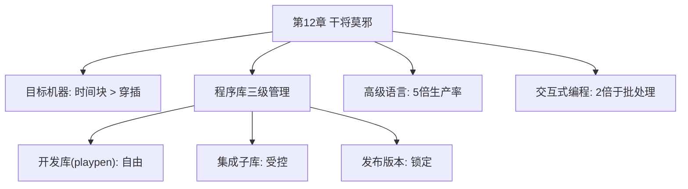

# 第12章 · 干将莫邪

> *"巧匠因为他的工具而出名。"* —— 谚语

---

## 🗺️ 知识结构导图

---

## 📘 概念先导：为什么要统一工具？

Brooks 的核心论点：项目的关键问题是**沟通**——个性化工具妨碍沟通。但仅有通用工具不够——专业工具不可吝啬。这就是外科手术队伍中「工具维护人员」存在的理由。

---

## 12.1 时间块策略：保护心流

OS/360 最初批处理调度（每天 4 次，周转 2.5 小时）→团队崩溃。改为**时间块**：15 人小组得 4-6 小时连续使用，自己决定如何用。**6 小时连续 10 次操作的生产率，比间隔 3 小时的 10 次操作高得多。** 现代研究：每次被打断后重新进入深度状态平均需要 23 分钟。

---

## 12.2 程序库三级管理：Git Flow 前身

| 级别 | 权限 | 现代映射 |
|------|------|----------|
| 开发库（playpen） | 程序员自由处置 | Feature Branch |
| 系统集成子库 | 集成经理批准 | Develop Branch |
| 当前版本子库 | 非重大缺陷不可改 | Main/Release |

---

## 12.3 高级语言 + 交互式编程

> *「我无法想象使用汇编语言能方便地开发出系统软件。」*

交互式编程生产率至少是批处理的**2 倍**——因为调试是最慢最难的部分，周转时间是祸根。

---

## 🔭 探索者之路

- **IDE**：Brooks 工具思想的极致
- **Docker/Dev Containers**：一致的辅助平台
- **CI/CD**：自动化集成→发布
- **Hot Reload**：周转从分钟降到秒

---

## 📝 要点总结

- [ ] 公共通用工具 > 个性化工具（沟通优先），专业工具不可吝啬
- [ ] 时间块优于穿插——保护心流状态
- [ ] 三级程序库 = Git Flow 前身
- [ ] 高级语言 5 倍 + 交互式 2 倍 = 革命性生产力

---

## 🏋️ 课后练习

**A. 识记**

1. 列出三级程序库管理的名称和权限。时间块为什么比穿插更高效？

**B. 理解**

2. 为什么 Brooks 说「个性化工具妨碍沟通」？你能想到一个反例吗？

**C. 应用**

3. 调查你的团队开发工具链：列出公共工具和个人工具清单。是否有需要公共化的个人工具？

**D. 探究**

4. 🔭 对比 Git Flow、GitHub Flow 和 Trunk-Based Development——各自如何体现 Brooks「三级程序库」思想？哪种最接近 OS/360 的原始模型？

---

## 🚪 下一章预告

第十三章——**「整体部分」**，讨论系统集成这个最被低估的阶段。Brooks 的核心洞见：**系统调试的时间比写代码长得多**，而且集成必须自顶向下、按阶段进行。一次加一个构件，测试通过再加下一个——这是铁律。

**核心概念：自顶向下集成**  
- 系统测试时间 >> 单元测试时间  
- 骨架先行——先让空壳跑通，再逐个填充构件

👉 [进入第13章：整体部分](chapter13.md)
