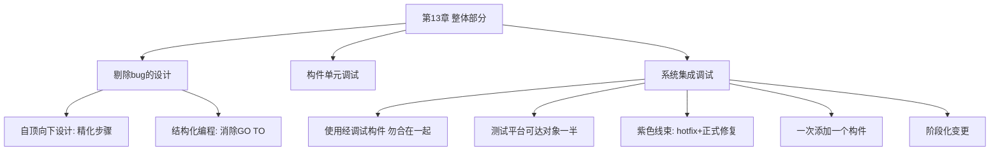

# 第13章 · 整体部分

> *"我能召唤遥远的精灵。那又怎么样，我也可以，谁都可以，问题是你真的召唤的时候，它们会来吗？"* —— 莎士比亚

---

## 🗺️ 知识结构导图

---

## 📘 概念先导：测试金字塔

现代软件工程将测试分三层，与 Brooks 完全对应：**单元测试**（构件测试）= 验证单个模块内部逻辑；**集成测试** = 验证模块间接口；**系统测试/E2E** = 验证真实环境行为。Brooks 核心论点：**系统集成调试是软件开发中最被低估、最出乎意料困难的阶段。**

---

## 13.1 剔除 bug 的设计

Wirth 的自顶向下设计：粗略方案→检查差距→精化分解。在每一步合适的级别测试。四个方面避免 bug：清晰结构便于精确描述、模块独立避免系统级 bug、细节隐藏使缺陷更易识别、每层可测试→测试尽早开始。

结构化编程（Dijkstra）：仅用 DO WHILE 和 IF...THEN...ELSE，避免 GO TO 随意跳转。Brooks 评价：**「关键是把系统结构作为控制结构来考虑，而不是独立跳转语句。」**

---

## 13.2 系统集成调试五条铁律

| 铁律 | 说明 |
|------|------|
| ✅ 使用经调试的构件 | 不要「合在一起尝试」 |
| ✅ 搭建充分测试平台 | 代码量可达测试对象的一半——**合理投资** |
| ✅ 控制变更（紫色线束） | hotfix→记录→正式修复（含测试+文档） |
| ✅ 一次添加一个构件 | 每次跑完整回归测试 |
| ✅ 阶段化变更 | 定期发布，给用户稳定周期 |

!!! danger "Gold 的关键发现"

    交互式调试中，**第一次交互取得的工作进展是后续交互的三倍。** 这意味着：没有预设计调试会话，就浪费了交互式调试的潜力。Brooks 的实践：**每两小时终端会话需要两小时桌面工作**（一小时清理+一小时计划）。

---

## 🔭 探索者之路

- **TDD**：写代码前写测试——Brooks「测试规格说明」的极致
- **CI/CD 流水线**：自动化「一次一个构件+回归测试」
- **Feature Flag**：阶段化变更的现代实现
- **Chaos Engineering**：主动注入故障验证韧性

---

## 📝 要点总结

- [ ] 自顶向下设计从四方面避免 bug
- [ ] 系统调试总比预期更长——需系统化方法
- [ ] 测试平台可达对象一半——合理投资
- [ ] 「一次添加一个构件」不可妥协
- [ ] Gold 发现：预设计调试会话是交互效率的关键

---

## 🏋️ 课后练习

**A. 识记**

1. 列出系统集成调试五条铁律。

**B. 理解**

2. Gold 发现「第一次交互进展最高」对你自己的调试习惯有什么启示？

**C. 应用**

3. 为你的项目设计系统集成测试计划：测试平台需要什么组件？按什么顺序添加构件？

**D. 探究**

4. 🔭 对比 Brooks 的系统集成方法与现代 CI/CD 流程。CI/CD 在多大程度上实现了 Brooks 的理想？又有什么 Brooks 没预见到的挑战（如 flaky tests）？

---

## 🚪 下一章预告

第十四章——**「祸起萧墙」**，揭露项目管理中最隐蔽的灾难：进度滞后不是突然发生的，而是你每天都在对自己说谎的结果。Brooks 发现，**所有项目直到最后 10% 才暴露真实进度**——因为前 90% 的时间大家都在说「基本完成了」。

**核心概念：进度谎言**  
- 「完成了 90%」= 剩余时间还需要 90%  
- 里程碑必须是 100% 可度量的——没有"基本完成"，只有"完成"和"未完成"

👉 [进入第14章：祸起萧墙](chapter14.md)
