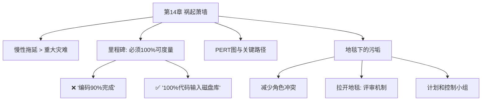

# 第14章 · 祸起萧墙

> *"项目是怎样延迟了整整一年的时间？……一次一天。"*

---

## 🗺️ 知识结构导图

---

## 📘 概念先导：里程碑 vs 关键路径

**里程碑**：项目中的 100% 可验证完成节点。Brooks 强调：模糊里程碑（「编码 90%」）比没里程碑更危险——制造虚假安全感。

**PERT / 关键路径法**：将项目分解为任务网络，识别哪些任务链决定最早完成日期。**准备工作是 PERT 中最有价值的部分**——强迫你在早期识别依赖关系。

---

## 14.1 慢性拖延：白蚁比龙卷风更致命

> *"通常灾祸来自白蚁的肆虐，而不是龙卷风的侵袭。"*

某人生病无法开会、雷击打坏变压器、磁盘延迟一周、下雪、应急任务……每件事只延迟半天一天——但累积后果比单次重大灾难更严重。**慢性进度偏离是士气杀手。**

---

## 14.2 里程碑：必须 100% 可度量

| ❌ 模糊 | ✅ 确切 |
|--------|--------|
| 「编码 90% 完成」 | 「100% 源代码编制完成并输入磁盘库」 |
| 「调试 99% 完成」 | 「测试通过了所有测试用例」 |
| 「计划完毕」 | 「结构师和实现人员签字认可的规格说明」 |

> *"如果里程碑定义得非常明确，以至于无法自欺欺人时，程序员很少会弄虚作假。"*

---

## 14.3 地毯下的污垢

一线经理发现问题 **不会马上汇报**——他想自己解决。两种解决方法：

1. **减少角色冲突**：老板区分状态检查（只听不做）和问题行动（做决策）。收到报告时不惊慌、不越俎代庖。
2. **猛地拉开地毯**：PERT 图 + 里程碑评审 + 独立的「计划和控制小组」——只询问、不指挥。

---

## 🔭 探索者之路

- **Jira/Linear**：数字化里程碑跟踪
- **Sprint Review**：Scrum 定期状态评审
- **OKR**：现代里程碑形式
- **DORA 指标**：部署频率、变更前置时间——量化进度健康度

---

## 📝 要点总结

- [ ] 慢性拖延比重大灾难更危险——一次一天
- [ ] 里程碑必须是 100% 可度量事件
- [ ] PERT 图最大价值在准备过程——暴露依赖
- [ ] 老板必须区分状态和行动信息——否则信息被隐藏
- [ ] 计划和控制小组是早期预警系统

---

## 🏋️ 课后练习

**A. 识记**

1. 什么是好的里程碑？举 3 个好例子和 3 个坏例子。

**B. 理解**

2. 为什么一线经理会隐藏进度问题？两种解决方法各自的适用场景是什么？

**C. 应用**

3. 为你当前项目制定含 5-8 个 100% 可度量里程碑的进度表。

**D. 探究**

4. 🔭 对比 PERT/CPM 与 Scrum/Kanban 在进度管理上的异同。Sprint 承诺与 Brooks 里程碑有什么区别？

---

## 🚪 下一章预告

第十五章——**「另外一面」**，Brooks 展现了他最被低估的洞察：**文档不是代码的附属品，而是代码的另一面**。更激进地说——代码本身就是文档。好的代码应该自文档化（self-documenting）：变量名、函数名、段落注释解释"为什么"而非"是什么"。

**核心概念：自文档化**  
- 好的命名 = 最好的文档  
- 注释解释 WHY，代码解释 WHAT  
- 流程图被过度神化了——它只适合描述「怎么走」，不适合描述「是什么」

👉 [进入第15章：另外一面](chapter15.md)
