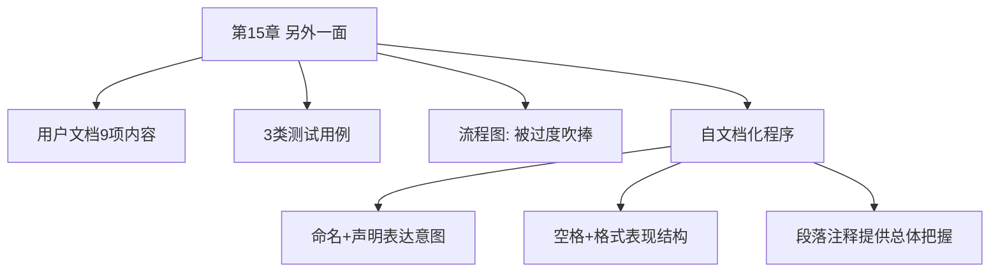

# 第15章 · 另外一面

> *"不了解，就无法真正拥有。"* —— 歌德

---

## 🗺️ 知识结构导图

---

## 📘 概念先导：程序的「两张面孔」

Brooks 开篇指出：计算机程序有两张面孔——**给机器的指令**（严格的语法和严谨的定义）和**给用户的故事**（诉说自己的行为和目的）。即使是完全开发给自己用的程序，也需要这「第二张脸」——因为记忆衰退会让你忘记自己当初的设计决策。**对软件编程产品来说，程序向用户呈现的面貌与提供给机器识别的内容同样重要。**

---

## 15.1 用户文档 9 项 + 测试用例 3 类

用户需要 9 项说明：目的、环境、范围、实现功能和算法、输入-输出格式、操作指令、选项、运行时间、精度和校验。Brooks 特别指出：**这篇文档的大部分需要在程序编制之前书写**——因为它包含了和软件相关的基本决策。

测试用例分 3 类：常规数据（验证基本正确性）、边界数据（检查最大值/最小值/特殊值）、非法数据（确保无效输入有正确诊断提示）。

---

## 15.2 流程图：被过度吹捧

!!! warning "Brooks 的激进观点"

    > *「流程图是被吹捧得最过分的一种程序文档。……逐一记录的详细流程图过时而且令人生厌。」*
    
    在高级语言时代，每个方框对应一条语句——方框是冗余的；相邻语句间的箭头也是冗余的；使用块结构消除 GO TO 后——所有箭头消失。**大家完全可以丢掉流程图。**
    
    > *「为什么让新程序员背负我们自己和我们的祖先都无法承担的重负呢？」*（《使徒行传》15:10）

Brooks 甚至说：**「我从来没有看到过一个有经验的编程人员，在开始编写程序之前，会例行公事地绘制详尽的流程图。」**

---

## 15.3 自文档化：合并文件

数据处理基本原理：把信息放在不同文件中并维持同步 = 费力不讨好。**解决方案：把文档整合到源代码**——对正确维护是直接有力的推动。

| 技巧 | 说明 |
|------|------|
| 🔤 命名和声明 | 用助记符表达意图；声明包含名称+结构+目的 |
| 📐 空格和格式 | 缩进表现从属和嵌套 |
| 📝 段落注释 | 解释「为什么」而非「是什么」——提供总体把握 |

---

## 🔭 探索者之路

- **JSDoc/JavaDoc/TSDoc**：自文档化的语言级实现
- **Literate Programming**（Knuth）：程序应像文学作品被阅读
- **README.md + 内联注释**：GitHub 标准实践
- **Storybook**：UI 组件的可交互文档
- **「Comments explain WHY, code explains WHAT」**：现代最佳实践与 Brooks 完全一致

---

## 📝 要点总结

- [ ] 程序有两张面孔：给机器的指令 + 给用户的故事
- [ ] 用户文档 9 项——大部分在编程前书写
- [ ] 流程图被过度吹捧——一页纸足矣
- [ ] 自文档化 = 命名 + 格式 + 段落注释整合到源代码
- [ ] 注释应解释「为什么」而非「是什么」

---

## 🏋️ 课后练习

**A. 识记**

1. 列出用户文档 9 项内容。自文档化三大技巧是什么？

**B. 理解**

2. Brooks 为什么认为流程图被过度吹捧？你同意吗？

**C. 应用**

3. 选一段你写的代码（50-100 行），应用自文档化三技巧重写：改进命名、统一格式、添加段落注释解释「为什么」。

**D. 探究**

4. 🔭 对比 JSDoc/JavaDoc 与 Brooks 的自文档化理念。Brooks 在 1975 年设想的东西在多大程度上被现代工具实现了？

---

## 🚪 下一章预告

第十六章进入第三幕——哲学升华，Brooks 发表了软件工程史上最著名的文章：**「没有银弹」**。没有任何单一技术或管理方法能在十年内让软件生产率产生数量级提升——因为根本困难（本质复杂性）不是工具能解决的。这个论断至今仍在科技界引发激烈争论。

**核心概念：没有银弹**  
- 根本困难（essence）vs 次要困难（accident）  
- 四大根本困难：复杂度、一致性、可变性、不可见性  
- 任何声称「银弹」的技术，都是在解决次要困难

👉 [进入第16章：没有银弹](chapter16.md)
