# 第16章 · 没有银弹

> *"没有任何技术或管理上的进展，能够独立地许诺十年内使生产率、可靠性或简洁性获得数量级上的进步。"*
> —— Frederick P. Brooks, Jr., 1986

---

## 🗺️ 知识结构导图

```mermaid
graph TD
    A["第16章 没有银弹"] --> B["根本困难 vs 次要困难"]
    A --> C["四大根本困难"]
    A --> D["银弹候选逐一评估"]
    A --> E["真正有希望的四个方向"]
    B --> B1["根本困难(Essence): 软件固有的"]
    B --> B2["次要困难(Accident): 目前生产的"]
    B --> B3["关键论断: 困难部分是设计概念结构"]
    C --> C1["🔴 复杂度 Complexity"]
    C --> C2["🟠 一致性 Conformity"]
    C --> C3["🟡 可变性 Changeability"]
    C --> C4["🟢 不可见性 Invisibility"]
    D --> D1["高级语言: ✅解决次要困难"]
    D --> D2["面向对象: ✅解决次要困难"]
    D --> D3["AI/专家系统: ⚠️ 有限价值"]
    D --> D4["图形化编程: ❌ 不成立"]
    D --> D5["程序验证: ❌ 不成立"]
    E --> E1["购买而非开发"]
    E --> E2["快速原型+迭代需求"]
    E --> E3["增量开发: 增长而非搭建"]
    E --> E4["培养卓越设计人员"]

    style B fill:#c8e6c9
    style C fill:#ffcdd2
    style E fill:#bbdefb
```

---

## 📘 概念先导：什么是「银弹」？

在进入正文之前，先理解标题本身的含义。

!!! info "基础概念：银弹（Silver Bullet）"

    **银弹** 源自欧洲民间传说——**人狼（werewolf）** 是一种可以从熟悉的面孔变成可怕怪物的妖怪。传说中，**只有银弹才能杀死人狼。**
    
    Brooks 用这个比喻来形容软件项目的困境：
    
    - **人狼** = 软件项目——看似简单明了，却可能变成一个落后进度、超出预算、存在大量缺陷的怪物
    - **银弹** = 某种能一次性、数量级地解决软件生产率问题的魔法般的技术
    
    本章的核心论断：**没有银弹。** 没有任何单项技术或管理方法，能在十年内带来数量级（10 倍）的进步。

在这个框架下，「猎人寻找银弹」=「软件行业追逐各种声称能彻底改变软件工程的新技术」。Brooks 将逐一审视这些候选「银弹」，判断它们到底是真正的银弹，还是仅仅是镀了银的普通子弹。

---

## 💡 认知冲突：AI 编程助手是银弹吗？

1986 年，Brooks 在一篇论文中预言：**十年内没有任何技术能带来数量级突破。** 十年后——1996 年——这个预言被证实了。

又过了三十年。2024 年，GitHub Copilot 拥有超过 180 万付费用户。Cursor 声称能让开发者「比以往快 10 倍地构建软件」。Devin 被宣称为「首个 AI 软件工程师」。

**它们会是 Brooks 找了四十年的银弹吗？**

本章不直接给你答案。而是给你一个 **分析框架**——Brooks 的「根本 vs 次要」二分法——让你自己做出判断。在章末的「探索者之路」，我们会回到这个问题。

---

## 16.1 根本困难 vs 次要困难：全书最强大的分析工具

!!! info "精准定义：Essence vs Accident"

    Brooks 借用了亚里士多德的哲学区分（后被经院哲学继承）：
    
    **根本困难（Essence）**：事物 **固有特性中固有的困难**——无法通过改变外在条件来消除。在软件中，指的是「打造由抽象软件实体构成的复杂概念结构」这一活动本身。
    
    **次要困难（Accident）**：并非与生俱来的困难——由于 **目前的生产方式** 造成的障碍。在软件中，指的是用笨拙的编程语言表达概念、受硬件限制、缺乏工具、周转时间长等。
    
    **关键论断**：*「软件开发中困难的部分是规格化、设计和测试这些概念上的结构，而不是对概念进行表达和对实现逼真程度进行验证。」*
    
    如果以上论断成立，那么 **天生就没有银弹**——因为银弹只能杀死「次要困难」这头狼，而「根本困难」是人狼的本性，不是外加的诅咒。

!!! example "经典例证：为什么高级语言不是银弹"

    高级语言被公认为软件生产率最有力的突破——至少带来了 5 倍提升（见第 8 章）。但 Brooks 指出，这种提升来自 **消除了一个级别的次要困难**：无需再关心寄存器、条件码、分支地址——这些是机器语言的复杂性，不是程序本身的复杂性。
    
    **但高级语言已经解决了它能够解决的所有次要困难。** 继续发展更高级的语言，每一个新版本只能带来递减的边际收益——因为根本困难（设计概念结构）依然纹丝不动。

---

## 16.2 软件的四大根本困难

### 🔴 复杂度（Complexity）

!!! danger "第一个根本困难"

    数学和物理学在过去三个世纪取得了巨大进步，科学家们通过 **简化模型** 来理解复杂现象——忽略次要因素、抽取核心特性、通过实验验证。这些方法之所以可行，是因为 **被忽略的复杂度不是现象的必要属性。**
    
    但软件不同。**软件的复杂度是必要属性，不是次要因素。** 抽掉复杂度的软件实体描述，常常也去掉了一些本质属性。
    
    具体表现：
    - 没有两个软件部分是相同的（如果有，我们会把它们合并成子函数）——在这个方面，软件与计算机、建筑或汽车大不相同，后者存在大量重复的部分
    - 软件状态的数量比计算机状态多 **若干个数量级**
    - 软件实体的扩展 **不是相同元素的重复添加**，而必须是不同元素实体的添加
    - 这些元素以 **非线性递增的方式交互**——整个软件的复杂度以更大的非线性级数增长

    复杂度不仅导致技术困难，还引发管理问题：**使全面理解变得困难 → 妨碍概念完整性 → 引起大量学习负担 → 使开发演变成灾难。**

### 🟠 一致性（Conformity）

!!! warning "第二个根本困难"

    物理学家可以相信自然界存在简化的解释——**「因为上帝不是专横武断或反复无常的。」**（爱因斯坦）
    
    **软件工程师无法从类似的信念中获得安慰。** 他必须控制的很多复杂度是 **随心所欲、毫无规则可言的**，来自若干必须遵循的人为惯例和系统：
    - 它们随接口的不同而改变
    - 它们随时间的推移而变化
    - 这些变化 **不是必需的**——仅仅因为它们是不同的人（而非上帝）设计的结果
    
    很多情况下，软件的开发目标就是兼容性——必须遵循各种已有的接口。对软件的任何再设计，**都无法简化这些因为兼容性而产生的复杂特性。**

!!! example "生活例证：为什么银行系统这么复杂"
    
    一个新银行系统不是因为算法难而复杂——是因为它必须兼容 1970 年代的 COBOL 主机、2000 年代的 SOAP 接口、2015 年的 REST API、2020 年的 Open Banking 标准。这些接口之间没有统一的哲学——它们是不同时代、不同公司、不同团队在不同约束下设计的产物。**这就是 Brooks 说的「一致性」负担。**

### 🟡 可变性（Changeability）

!!! warning "第三个根本困难"

    软件实体经常遭受持续的变更压力。建筑、汽车、计算机也会变更——但工业制造的产品在出厂后 **不会经常发生修改**，它们会被后续模型取代。
    
    软件的变更压力来自两个来源：
    1. **功能扩展**：当人们发现软件很有用时，会在原有应用范围的边界之外使用它——功能扩展的压力来自喜欢基本功能又提出新用法的用户
    2. **平台演化**：软件在某种计算机硬件平台上开发，成功软件的生命期通常 **比当初的硬件平台要长**。磁盘、显示器、打印机、操作系统都在变化——软件必须与各种新生事物保持一致
    
    **软件可以很容易地进行修改——它是纯粹思维活动的产物，可以无限扩展。** 日常生活中的建筑修改成本很高，从而打消了修改的念头。软件的修改成本看起来极低——**这正是它不断被要求修改的原因，也是它最终变得无法维护的原因。**

### 🟢 不可见性（Invisibility）

!!! warning "第四个根本困难"

    建筑有平面图——帮助建筑师和客户评估空间布局和视觉效果。机械有制图——可以直观看到零件间的配合。化学有分子模型——尽管是抽象模型，但能捕获物理存在的几何特性。
    
    **软件的客观存在不具有空间的形体特征。** 因此没有像地图、电路图那样的已有表达方式。当我们试图用图形描述软件结构时，发现它 **不是一张图，而是很多相互关联、重叠在一起的图形**：
    - 控制流程图
    - 数据流图
    - 依赖关系图
    - 时间序列图
    - 名字空间关系图
    
    这些图通常不是有较少层次的扁平结构——它们互相缠绕。**不可见性不仅限制了个人的设计过程，也严重阻碍了相互之间的交流。**

---

## 16.3 银弹候选——逐一上审判台

Brooks 对当时（1986 年）最被吹捧的技术趋势进行了逐一评估：

| 候选 | 解决什么困难？ | 是银弹吗？ | Brooks 的判断 |
|------|--------------|:---------:|--------------|
| **Ada / 高级语言** | 次要困难（表达） | ❌ | 已经解决了大部分次要困难，剩余获益递减 |
| **面向对象编程** | 次要困难（表达设计） | ❌ | 除非低层次类型说明占 90% 工作量，否则不是数量级突破 |
| **人工智能** | 取决于定义 | ❌ | AI-1 定义模糊；AI-2 专家系统有有限但真实的价值 |
| **专家系统** | 规则管理与知识传播 | ⚠️ | **最有价值的贡献**：为缺乏经验的开发者提供专家知识指导 |
| **「自动」编程** | —— | ❌ | 「总是一种热情，使用现在并不可用的更高级语言编程的热情」——Parnas |
| **图形化编程** | —— | ❌ | 软件难以可视化——「盲人摸象」。VLSI 芯片设计的类比是误导 |
| **程序验证** | —— | ❌ | 验证 ≠ 零缺陷。工作量极大。而且验证不能保证 **规格说明** 的正确性 |
| **工作站 / 环境** | 次要困难 | ❌ | 有价值但回报有限——思考活动已经是日常工作的主要活动 |

!!! tip "专家系统：一个被低估的有希望方向"

    Brooks 特别提到，专家系统最有力的贡献不是替代程序员——而是 **给缺乏经验的开发人员提供服务**，用最优秀开发者的经验和知识积累为他们提供指导。最优秀和一般的软件工程实践之间的差距非常大——「可能比其他工程领域中的差距都要大」——因此一种传播优秀实践的工具特别重要。

---

## 16.4 真正有希望的四个方向

如果银弹不存在，我们应该往哪里努力？Brooks 给出了四个方向：

### 方向一：购买而非开发

> *"构建软件最可能的彻底解决方案是不开发任何软件。"*

| 自研 | 购买 |
|------|------|
| 需要从头设计、编码、测试、文档 | 立即可用 |
| 成本 = 开发人员 × 时间 | 即使 $100,000 也只等于 1 人年 |
| 只能自己维护 | 有专业团队持续维护 |

Brooks 预言「大众市场将是软件工程领域意义最深远的开发方向」。这个预言在今天以 **SaaS、开源、npm/PyPI 生态** 的形式得到了超预期的实现。

### 方向二：快速原型 + 迭代需求

> *"客户不知道他们自己需要什么。"*

这是 Brooks 最有洞察力的观察之一：在尝试开发客户定制系统之前，想要完整、精确、正确地抽取需求——**实际上是不可能的。** 因为：
- 客户通常不知道哪些问题是必须回答的
- 连必须确定的问题细节常常根本不考虑
- 「开发一个类似于我们已有手工处理过程的新软件系统」——实际上过于简单

**因此，最有希望解决根本困难的技术是：作为迭代需求过程的一部分，快速原型化系统。**

### 方向三：增量开发——增长，而非搭建

这是 Brooks 本人最推崇的方法。他在课堂上推动这种方法后，**「效果不可思议」**：

> *"在过去几十年中，没有任何方法和技术能如此彻底地改变我自己的实践。"*

具体做法：
1. 先让系统能够运行——即使未完成任何有用功能，只能正确调用一系列伪子系统
2. 然后一点一点被充实——子系统轮流被开发，或是在更低层次调用占位符
3. **每个阶段都有可运行的系统**

效果：**「四个月内培育（grow）出的系统，比搭建（build）要复杂得多。」** 而且对士气的推动是「令人震惊的」——当一个可运行系统（即使只是一个长方形）第一次出现在屏幕上时，工作的动力会成倍增长。

### 方向四：培养卓越设计人员

> *"卓越设计来自卓越的设计人员。……伟大设计师和普通设计师之间的差距接近一个数量级。"*

这是 Brooks 最动情的呼吁：
- 软件机构必须像培养管理人员一样认真地培养设计人员——相同的薪资、相同的办公室、相同的认可
- 尽可能早地、系统地识别顶级设计人员——**最好的通常不是最有经验的人**
- 为设计人员指派职业导师，仔细规划职业生涯
- 提供与设计大师的学习机会、正式高级教育和短期课程

---

## 🔭 探索者之路：AI 编程助手是银弹吗？

> 用 Brooks 的框架，我们来审问 AI 编程助手。

| Brooks 的标准 | AI 编程助手（Copilot / Cursor / Devin）的表现 |
|--------------|---------------------------------------------|
| **解决根本困难？** | ❌ AI 不帮你决定「要做什么」。架构设计、需求理解、复杂调试推理——这些仍然是人的工作。 |
| **解决次要困难？** | ✅ 语法、样板代码、API 记忆、重复性编码——这些都是「表达」层面的次要困难。 |
| **能带来数量级（10×）突破？** | ⚠️ 假设表达占你工作的 40%（Brooks 认为可能更少），AI 让表达效率提升 50% → 总生产率提升约 **20%**。不是数量级。 |
| **有副作用吗？** | ⚠️ AI 生成代码的 bug 更隐蔽（看起来合理但逻辑错误）、更难审查。可能导致调试时间增加——抵消部分编码节省的时间。 |
| **软件的根本困难被触及了吗？** | ❌ 复杂度、一致性、可变性、不可见性——**四大根本困难毫发无损。** |

**按照 Brooks 的标准：AI 辅助编程是又一次「次要困难的突破」——非常有价值，但不符合银弹的定义。**

当然，这取决于你怎么定义「数量级」。如果 AI 让一个初级开发者的产出接近一个高级开发者（缩小了 Brooks 说的「一个数量级的差距」），那是否可以被视为某种意义上的「银弹」？这个问题的答案，留给你在课后练习中自行论证。

---

## 💡 像工程师一样思考

> **根本 vs 次要的二分法。** 这是 Brooks 留给软件工程最强大的分析工具——比任何具体结论都更有生命力。每次遇到一项声称能「彻底改变软件工程」的新技术（无论是 1986 年的 Ada、1995 年的 Java、2010 年的 NoSQL、还是 2024 年的 LLM），先用这个框架问自己两个问题：
> 1. 它解决的是根本困难还是次要困难？
> 2. 如果只解决次要困难，剩下的根本困难在总工作量中占比多少？
>
> 如果你的答案是「次要困难，且占比 < 50%」——那么这项技术不太可能是银弹。

---

## 🧠 学习加油站

!!! question "停下来想一想"

    1. 在你自己的编程经验中，有多少时间花在「表达」（打字、查 API、修语法错误）上？有多少时间花在「构思」（理解需求、设计方案、调试复杂逻辑）上？比例大约是多少？这如何影响你对「AI 是否是银弹」的判断？
    2. Brooks 说「不可见性」是根本困难。你有没有经历过因为「看不到」系统结构而导致的沟通失败？试着用不可见性来解释那次经历。
    3. 如果你只能从四个「有希望的方向」中选一个来投入你未来五年的精力，你会选哪个？为什么？

---

## 📝 要点总结

- [ ] **根本困难**（Essence）= 软件固有的：复杂度、一致性、可变性、不可见性
- [ ] **次要困难**（Accident）= 目前生产方式造成的：笨拙的语言、缺乏工具、硬件限制
- [ ] 软件开发的核心困难是 **设计概念结构**，而非表达概念——因此天生没有银弹
- [ ] 所有被吹捧的银弹候选（高级语言、OOP、AI、图形化编程、程序验证）都 **只解决了次要困难**
- [ ] 四个有希望的方向：**购买 / 快速原型迭代 / 增量开发 / 培养卓越人才**
- [ ] AI 编程助手解决次要困难——按 Brooks 的标准，不是银弹。但它可能是 **缩小普通与卓越开发者之间差距** 的最有力工具

---

## 🏋️ 课后练习

**A. 识记与简单模仿**
1. 区分「根本困难」和「次要困难」并给出各两个例子。列出四大根本困难并各用一句话解释。
2. 列出 Brooks 评估的至少 5 个银弹候选及其结论（一句话概括即可）。

**B. 理解与变式辨析**
3. Brooks 说「软件的复杂度是必要属性，不是次要因素」——这意味着什么？用数学/物理学的「简化模型」策略和软件的「不可简化性」做对比来解释。
4. 为什么「不可见性」是根本困难？如果未来有了完美的 VR/AR 软件可视化工具，不可见性能被消除吗？用 Brooks 的「多图重叠」论点来论证。

**C. 综合应用与迁移**
5. 用 Brooks 的「根本 vs 次要」框架，选择以下一项近期技术趋势进行银弹评估：WebAssembly、Rust 语言、低代码/无代码平台、Kubernetes。写出你的评估报告（500 字），必须包含：它解决了什么困难（根本还是次要）、能否带来数量级突破、你的最终判断。
6. 尝试「增量开发」：选一个小项目，先做一个只能跑通但什么都不做的框架，然后逐步添加功能。记录你在这个过程中的体验——是否感受到了 Brooks 所说的「士气的推动」？

**D. 探究与开放挑战**
7. 🔭 **辩论题**：AI 编程助手（Copilot、Cursor、Devin 等）能否在十年内给软件生产率带来数量级（10 倍）的提高？
   
   要求：
   - **正方**：AI 改变了 Brooks 的生产率公式——它不仅仅加快了「表达」，还通过代码补全、自动重构、测试生成开始触及「构思」。当 AI 能理解需求文档并生成架构方案时，「构思」也不再是人的专属。
   - **反方**：严格遵循 Brooks 的根本/次要二分法——AI 解决的是表达，不是构思。四大根本困难（复杂度、一致性、可变性、不可见性）毫发无损。而且 AI 生成代码的可维护性和安全性成为新的次要困难。
   - 引用 Brooks 的原文论点（至少 3 处）和现代研究数据（至少 2 处）。

---

## 🚪 下一章预告

第十七章——**「再论没有银弹」**，是 Brooks 在 20 年后对自己观点的回顾与修正。1995 年互联网兴起，Brooks 承认了什么、坚持了什么？他重新审视了 OOP、AI、专家系统等候选"银弹"——有些被否定，有些被部分认可。而今天 AI 编程助手的崛起，让这一章比任何时候都更值得重读。

**核心概念：二十年后的再审视**  
- 哪些「候选银弹」被时间证伪？哪些部分成立？  
- Brooks 的核心结论：根本困难仍然存在，但次要困难的解决确实带来了巨大进步

👉 [进入第17章：再论没有银弹](chapter17.md)
