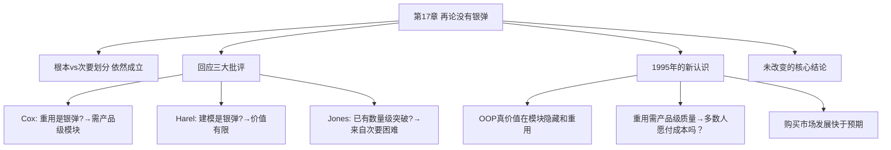

# 第17章 · 再论《没有银弹》

> *「1986年，我在IFIPS会议上发表了《没有银弹》。事实证明，它是富有煽动性的。」* —— Brooks, 1995

---

## 🗺️ 知识结构导图

---

## 📘 概念先导：争论的价值

Brooks 1986 年发表《没有银弹》后引发了比《人月神话》更多的争论。1995 年他在本章回应三个主要批评者——这不仅是对自己理论的辩护，也展示了 **科学争论的正确进行方式**：认真对待反对意见、审视证据、诚实修正。

---

## 17.1 回应三大批评

### Cox：软件重用是银弹？

Brad Cox 提出可重用的软件组件市场将是银弹。Brooks 回应：重用确实有巨大潜力——但前提是模块具有 **产品级质量**（通用、健壮、测试完备、文档化）。大多数人希望大规模重用，却不愿付出构建产品级模块所需的初始代价。**「这种期望是徒劳的。」**

### Harel：形式化建模是银弹？

David Harel 的 Statecharts 等工具被提出作为银弹。Brooks 回应：建模有助于理解和沟通——但 **解决的根本困难有限**。建模工具无法消除软件固有的复杂度。

### Jones：生产率已有数量级提高？

Capers Jones 提供了生产率大幅提高的数据。Brooks 回应：这些提高主要来自 **次要困难的突破**（更好的语言、工具、硬件）。根本困难依然存在。将次要困难的突破误认为根本困难的解决，是对问题本质的误解。

---

## 17.2 1995 年的新认识

!!! tip "OOP 的真正价值"

    从面向对象编程中期望的最大收获实际上来自第一步——**模块隐藏**。预先建成的、为重用而设计和测试的类库。继承和多态重要，但 **不是革命性的**。革命性在于：用产品级质量标准构建可重用的模块。

!!! warning "重用不会自动发生"

    *「许多人希望大规模重用，但不付出构建产品级质量模块所需要的初始代价——这种期望是徒劳的。」* 这和今天 npm/PyPI 生态的困境惊人相似——包的数量爆炸了，但「产品级质量」呢？left-pad 事件告诉我们：数量 ≠ 质量。

---

## 17.3 未改变的核心结论

- ✅ 根本/次要二分法仍然是理解软件困难的关键框架
- ✅ 「没有银弹」的预言在十年内成立，在更长时间内稳健
- ✅ 进步是逐步取得的——不是突变，而是持续不懈的规范化过程

---

## 🔭 探索者之路：2025年回望

- **开源运动**：npm (2M+ 包)、PyPI (500K+)、Cargo——Brooks 期望的「产品级质量模块」部分实现。但 left-pad、colors.js 暴露了质量保障的根本挑战
- **LLM 编程助手**：最接近「银弹」——但按 Brooks 框架，它仍解决次要困难
- **低代码/无代码**：让非程序员创建软件——但复杂度上限依然存在

---

## 📝 要点总结

- [ ] 根本/次要二分法依然是最强大分析框架
- [ ] 重用需要产品级质量模块——不能零成本获得
- [ ] 面向对象最大价值在模块隐藏，而非继承/多态
- [ ] 技术进步解决的是次要困难——根本困难与生俱来
- [ ] 开源社区部分实现 Brooks 期望，但质量保障仍是挑战

---

## 🏋️ 课后练习

**A. 识记**

1. Brooks 回应了哪三个批评？分别是什么观点和反驳？

**B. 理解**

2. 为什么 Brooks 说「重用不会自动发生」？这和 npm left-pad 事件有什么关联？

**C. 应用**

3. 分析 npm/PyPI/Cargo 生态：在多大程度上实现了 Brooks 「产品级重用模块」理想？还存在哪些结构性缺陷？

**D. 探究**

4. 🔭 如果 Brooks 今天再写一篇「三论没有银弹」，他会讨论什么？LLM 辅助编程会改变他的核心结论吗？写一篇「三论没有银弹（2025假想版）」。

---

## 🚪 下一章预告

第十八章——**「观点是或非」**，Brooks 以罕见的自我反思姿态，回顾了全书 19 个核心命题在 20 年后的真伪。哪些被时间证明正确？哪些需要修正？哪些他承认当初说错了？这一章用一个工程师最诚实的动作——自我审计——为全书收束。

**核心概念：自我审计**  
- 回顾全书的 19 个命题，逐条审计  
- 承认错误比坚持正确更可贵——这是一种工程伦理

👉 [进入第18章：观点是或非](chapter18.md)
