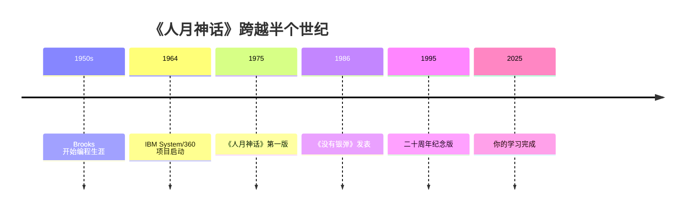

# 第19章 · 结束语

> *「令人向往、激动人心和充满乐趣的五十年」*

---

## 🗺️ 回顾与展望

---

## 19.1 Brooks 的最终反思

> *「我在软件工程中学到的最重要教训是：**人，比技术更重要。**」*

最好的工具不能弥补糟糕的团队。最好的流程不能替代卓越的设计人员。最好的方法论不能消除沟通的必要。

---

## 19.2 五大核心概念总览

| 概念 | 一句话精华 | 关键章节 |
|------|-----------|----------|
| 🔴 人月神话 | 加人不会加速——n(n-1)/2 沟通成本使进度更落后 | Ch1-2, Ch8, Ch14 |
| 🟠 概念完整性 | 系统必须反映唯一设计理念——宁可砍功能也要统一 | Ch3-6 |
| 🟡 团队沟通 | 组织架构决定沟通效率——外科手术队伍是最佳方案 | Ch3, Ch7 |
| 🟢 质量保证 | 测试占一半时间——系统集成是最被低估的阶段 | Ch13 |
| 🔵 没有银弹 | 根本困难与生俱来——复杂度/一致性/可变性/不可见性 | Ch16-17 |

---

## 19.3 如果只记住三件事

1. **Brooks 法则**——下次有人让你「加人赶进度」，你能有理有据地解释为什么更糟
2. **概念完整性**——你设计的系统应像兰斯大教堂，而非杂乱的普通大教堂
3. **没有银弹**——不要追逐每一个新技术炒作。回归根本：思考、设计、沟通、迭代

---

## 19.4 继续学习

**延伸阅读**：《人件》（DeMarco & Lister）深入「人比技术重要」的主题；《代码大全》（McConnell）实践 Brooks 原则于编码；《重构》（Fowler）对抗系统熵增；《加速》（Forsgren et al.）量化 Brooks 的生产率思想。

---

> *「编程为什么有趣？作为一种回报，它的从业者期望得到什么样的快乐？首先是一种创建事物的纯粹快乐……」* —— Frederick P. Brooks, Jr. (1931–2015)
>
> **祝你在这个焦油坑中，挣扎得比别人优雅一些。** 🥂

---

## 🏋️ 全书综合练习

**A. 全景图**

画出 19 章之间的逻辑关系图（Mermaid 或手绘）。

**B. 自我审计**

回顾你在本教材学习前的三个「迷思概念」（见首页学习画像），写一篇反思：哪些被改变了？哪些被强化了？哪些你仍然存疑？

**C. 实战项目**

选一个正在做（或计划做）的项目，运用教材中至少 5 个原则重新审视它，撰写一份「人月神话视角的项目诊断报告」——包含具体建议。

**D. 哲学探究**

🔭 Brooks 的方法在 AI 辅助编程时代仍然成立吗？选择一个最有争议的观点（如「贵族专制」「概念完整性」「没有银弹」），在 2025 年语境下正反论证。至少引用 5 条现代证据。

---

## 🎉 恭喜完成本教程！

你已经跟随 Brooks 走过了一段 50 年不褪色的软件工程之旅。从焦油坑到没有银弹，从人月神话到银弹再论，你现在能够：

- ✅ 阐释 **Brooks 法则**，判断「加人」是否合理
- ✅ 区分编程产品三层次（程序→产品→系统），评估成本
- ✅ 定义 **概念完整性**，分析开源项目架构
- ✅ 识别 **第二系统效应**，避免过度设计
- ✅ 设计 3-5 人团队分工和沟通机制
- ✅ 制定 1/3+1/6+1/2 的进度分配
- ✅ 区分 **根本困难 vs 次要困难**，评估新技术
- ✅ 制定含里程碑的 PERT 图

**记住 Brooks 留给我们的核心信念：** 软件工程没有银弹，但这不意味着绝望——恰恰相反，正因为没有魔法，我们才需要持续学习、清醒判断和扎实的工程实践。

📋 回顾你的学习旅程：[学习目标对照表](learning_map.md)  
📊 查看教材质量：[质量评估报告](quality_report.md)  
🏠 返回首页：[《人月神话》教材首页](index.md)
