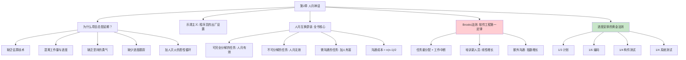

# 第2章 · 人月神话

> *"美酒的酿造需要年头，美食的烹调需要时间；片刻等待，更多美味，更多享受。"*
> —— 新奥尔良 Antoine 餐厅菜单

---

## 🗺️ 知识结构导图

---

## 📘 概念先导：什么是「人月」？

在开始本章之前，先搞清楚一个软件工程中最基本也最容易被误用的概念——**人月（Man-Month）**。

!!! info "基础概念：人月"

    **人月** = 人数 × 月数，是衡量软件项目 **工作量** 的单位。
    
    举个例子：如果一个任务估计需要「12 人月」，可以理解为：
    
    - 1 个人做 12 个月
    - 12 个人做 1 个月
    - 3 个人做 4 个月
    
    表面上看，这三种分配方式产生的 **工作量** 相同（都是 12 人月）。但 Brooks 要论证的核心命题正是：**工作量相同 ≠ 进度相同。** 人月这个单位暗示「人数和时间可以互换」——而这是全书要破除的最大谬误。

---

## 💡 认知冲突：赶不上 Deadline？再加两个人！

这是几乎所有软件项目的本能反应，也是几乎所有软件项目的 **第一错误反应**——

- 项目经理发现进度落后了 → **加人。**
- 客户的 Deadline 逼近了 → **加人。**
- 老板说「我们必须按时交付」 → **加人。**

Brooks 用了一个刺眼的比喻：**这就像用汽油灭火一样。**

本章将用严密的逻辑告诉你为什么——以及面对延期时，**真正应该做的四件事是什么。**

---

## 2.1 五大进度灾难原因

Brooks 开篇先诊断了软件项目延期的五个根本原因。注意，他说的是「缺乏合理的时间进度」是 **最主要原因**——比其他所有因素加起来影响还大。

| # | 原因 | 翻译成白话 |
|---|------|-----------|
| 1 | **缺乏有效的估算技术** | 我们根本不会估算——而且默认「一切顺利」 |
| 2 | **混淆工作量与进度（人月谬误）** | 以为人月可以互换 |
| 3 | **缺乏坚持的勇气** | 对自己估算不自信 → 被客户/老板一压就改 |
| 4 | **缺少进度跟踪** | 在其他工程领域标配的监督手段，在软件中被认为是无谓的 |
| 5 | **加人灭火循环** | 一发现落后就加人 → 更落后 → 再加人 → …… |

本章重点讨论前三个（后两个在第 14 章深入展开）。

---

## 2.2 乐观主义：程序员的出厂设置

!!! tip "「这次它肯定会运行。」"

    Brooks 一针见血：**所有编程人员都是乐观主义者。** 这种乐观主义不是性格缺陷——它来源于编程介质的本质特性。
    
    他借用了 Dorothy Sayers 的创造性活动三阶段理论来解释：

| 阶段 | 说明 | 程序员的陷阱 |
|------|------|-------------|
| 🧠 **构思** | 脑海中的模型，与时空无关，完美无瑕 | ✅ 这里一切顺利！ |
| 🛠️ **实现** | 在现实时空和介质中表达出来 | ❌ **困难在这里浮现** |
| 📡 **交流** | 他人阅读、使用、理解你的创造 | ❌ 这里也会出问题 |

    木材会裂、油漆会滴、电线会短路——这些物理介质的约束不断提醒工匠现实的困难。但程序员的「材料」是 **纯粹的思维**，可以凭空想象、任意重构。正因为介质太容易驾驭了，我们天然地低估实现过程中的困难。
    
    Brooks 的结论毫不留情：**我们的构思总是有缺陷的，因此总会有 bug。** 这不是能力问题——这是人类认知的局限。

!!! warning "概率的冷酷"
    Brooks 指出一个关键的统计事实：在单个任务中，「一切顺利」的假设还有一定概率成立。但大型编程工作包含 **很多相互关联的任务**，某些任务间还有前后次序——**一切正常的概率接近于零。**
    
    类比：扔一次硬币正面朝上的概率是 50%。扔 20 次硬币全部正面朝上的概率是 0.000095%。大型软件项目就是让你扔 20 次硬币还期望全部正面。

---

## 2.3 人月可以互换吗？——全书最核心的谬误

!!! danger "核心定义：人月谬误"

    **人月是危险和带有欺骗性的神话，因为它暗示人员数量和时间是可以相互替换的。**
    
    用 Brooks 的原话来说：*「成本的确随开发产品的人数和时间的不同，有着很大的变化，进度却不是如此。」* 因此，**用人月作为衡量一项工作规模的单位，是一个危险和带有欺骗性的神话。**

Brooks 用四种情况来分析人数和时间之间的真实关系。这个分类框架是理解整本书的基础：

### 情况一：可完全分解、无需沟通的任务

| 特征 | 例子 | 加人有效吗？ |
|------|------|:---:|
| 任务可以分给多人独立完成，不需要相互交流 | 割小麦、摘棉花 | ✅ **有效** |

如果你要收割 100 亩小麦，1 个人需要 100 天，100 个人只需要 1 天。人月在这里是有效的——因为每个工人之间不需要沟通，不需要知道别人割到哪里了。

### 情况二：不可分解的任务

| 特征 | 例子 | 加人有效吗？ |
|------|------|:---:|
| 任务有次序限制，不能分解 | 生一个孩子 | ❌ **完全无效** |

无论多少个母亲，孕育一个生命都需要九个月。很多软件任务——特别是调试和测试——具有这种次序特性。

### 情况三：可分解但需要沟通的任务（⚠️ 软件工程的常态）

| 特征 | 例子 | 加人有效吗？ |
|------|------|:---:|
| 子任务可以分解，但之间需要沟通和协调 | **系统编程** | ⚠️ **有害！** |

这是软件开发最典型的情况。每个子任务可以分给不同的人，但做完的子任务需要拼在一起——接口要对齐、假设要一致、变更要同步。**沟通的工作量可能完全抵消分解带来的收益。**

### 情况四：关系错综复杂的任务

| 特征 | 例子 | 加人有效吗？ |
|------|------|:---:|
| 不仅需要沟通，而且沟通模式是网状、非线性的 | 大型操作系统 | ❌ **严重有害** |

---

## 2.4 Brooks 法则：软件工程最著名的定律

!!! danger "Brooks 法则（Brooks's Law）"

    > **向进度落后的项目中增加人手，只会使进度更加落后。**
    >
    > *Adding manpower to a late software project makes it later.*

    这条法则之所以成立，是因为增派人手从 **三个互相叠加的方面** 增加了总体工作量：

### 第一重成本：任务重分配和工作中断

原来 3 个人分好的 3 份工作，现在要重新分成 5 份。**某些已经完成的工作必定会丢失。** 系统测试必须被延长——因为新划分的边界需要重新验证。

### 第二重成本：培训新人员

每个新人都需要老人来带——了解项目目标、技术架构、编码规范、当前进度。**这部分工作量随新人数量的增加而线性增长。** 而且培训无法分解——不能 3 个老人同时培训 1 个新人来加速这个过程。

### 第三重成本：额外沟通（最致命）

这是全书最重要的公式：

> **n 个人的沟通路径数 = n(n-1)/2**

| 团队人数 | 沟通路径数 | 增幅 |
|----------|-----------|------|
| 3 人 | 3 条 | — |
| 4 人 | 6 条 | +100% |
| 5 人 | 10 条 | +67% |
| 10 人 | 45 条 | — |
| 50 人 | 1,225 条 | — |

!!! example "生活例证：搬家加人的魔咒"

    你找了 2 个朋友帮忙搬家，刚好够用。但你觉得慢，又喊了 2 个朋友来。结果：
    
    - 新来的 2 人需要你告诉他们哪个箱子放哪个房间（**培训成本**）
    - 4 个人需要协调谁搬重物、谁走哪个门、谁先搬哪个房间（**沟通成本**）
    - 原来的 2 人因为要「带新人」反而搬得更慢了（**中断成本**）
    
    最后搬完的时间可能和 2 个人一样，甚至更久。**这就是 Brooks 法则在你生活中的样子。**

---

## 2.5 进度安排的黄金法则：反直觉的 1/3 + 1/6 + 1/2

基于以上分析，Brooks 提出了一个与大多数人的直觉完全相反的进度分配方案：

!!! success "Brooks 进度分配法则"

    | 阶段 | 占比 | 大多数人的直觉 | Brooks 的解释 |
    |------|:---:|--------------|--------------|
    | 📋 **计划** | **1/3** | 「计划不用花太多时间吧」 | 即便如此仍不足以产生详细稳定的规格说明 |
    | 💻 **编码** | **1/6** | 「编码是主要工作！」 | 编码只是冰山露出水面的那一小部分 |
    | 🔧 **构件测试** | **1/4** | 「写完差不多就能跑了」 | 每个构件需要独立验证 |
    | 🧪 **系统测试** | **1/4** | 「最后跑一遍就行」 | 所有构件合在一起后的集成调试——最不可控 |

**三个反直觉的要点：**

1. **计划占 1/3。** 这比大多数项目实际花在计划上的时间多得多。但 Brooks 认为这仍然不够——「仍不足以产生详细和稳定的计划规格说明，也不足以容纳对全新技术的研究和摸索。」
2. **编码仅占 1/6。** 大多数程序员认为编码是主体工作，实际上它只是冰山一角。测试和调试才是真正消耗时间的阶段。
3. **测试占一半。** 几乎没有项目在计划中为测试分配一半时间——但大多数项目的测试 **实际上** 花费了进度的一半。Brooks 特别指出：**「不为系统测试安排足够的时间简直就是一场灾难。」** 因为延迟发生在项目快完成的时候——坏消息没有预兆，很晚才出现在客户和项目经理面前。

---

## 2.6 当进度真的落后了——四个选择

Brooks 用一个具体的数值例子来说明。假设一个任务估计需要 **12 人月**，分给 **3 个人做 4 个月**，每月有里程碑 A、B、C、D。**两个月后，第一个里程碑没有达到。**

| 选择 | 做法 | 结果分析 |
|------|------|----------|
| 1️⃣ 假设只有第一阶段估计错了 | 加 2 人（3→5） | ❌ 预计还需 9 人月 ÷ 2 个月 = 需要 4.5 人。但新人的培训要 1 个月，任务要从 3 份重分为 5 份。第三月末仍残留 7 人月工作，只有 5 个有效人月。**还是会延期。** |
| 2️⃣ 假设整体估计偏低 | 加 6 人（3→9） | ❌ 预计还需 18 人月 ÷ 2 个月 = 需要 9 人。培训、重分配、沟通成本激增。**产品会比不加人更差。** |
| 3️⃣ **重新安排进度** | 承认现实，分配充分时间 | ✅ **Brooks 推荐。** 引用 P. Fagg 的忠告：**「避免小的偏差（Take no small slips）。」** 一次性给出充分的延期，确保工作能仔细、彻底地完成。 |
| 4️⃣ **削减任务** | 砍掉非核心功能 | ✅ **现实中常用。** 当项目延期的后续成本非常高时，这常常是唯一可行的方法。 |

---

## 🔭 探索者之路：Brooks 法则在现代

> 以下内容为拓展阅读，可跳过不影响主线学习。

### Agile/Scrum 如何应对？

Scrum 的应对方式直接体现了 Brooks 法则的精髓：
- **固定 Sprint 长度**（通常是 1-4 周）——不延长，只削减
- **固定团队规模**（5-9 人）——不加人，只调整 Scope
- **时间盒（Timebox）**——到期就停，没做完的移到下个 Sprint

这些做法的底层逻辑和 Brooks 法则完全一致：**不加人、不延期、只削减范围。**

### 《人件》的补充验证

DeMarco 和 Lister 在《人件》（*Peopleware*, 1987）中进一步验证了 Brooks 法则：
- 加人不仅增加沟通成本，还破坏团队已经形成的 **「凝胶期」**（团队默契）
- 新成员加入后，整个团队需要重新经历形成期（Forming）→风暴期（Storming）→规范期（Norming）

### 「人月」在现代的变形

今天「人月」这个词已经不像 1975 年那样被直接使用，但它的变种无处不在：
- 「这个功能需要 5 个 story points」——如果 2 个人做，是不是 2.5 天？
- 「我们再加 2 个前端就能赶上 Sprint 目标」——真的吗？

**Brooks 法则在你每一次想说「再加两个人」的时候，都是一道必须通过的安检门。**

---

## 💡 像工程师一样思考

> **分解与建模。** Brooks 用 n(n-1)/2 对沟通成本进行数学建模——这是一种典型的工程思维：面对模糊的直觉（「加人好像不太对」），用一个精确的数学模型来澄清。下次面对「要不要加人」的决策时，不要凭直觉，画出团队沟通路径图，算一下：n → n+2 时，沟通路径从多少变成了多少？

---

## 🧠 学习加油站

!!! question "停下来想一想"

    1. 你有没有经历过「加人让项目更慢」的情况？当时发生了什么？你能用 Brooks 的三重成本（重分配、培训、沟通）来分析那个情况吗？
    2. 如果你是一个 5 人团队的 Tech Lead，老板说「再加 2 个人就能赶上 Deadline」——用本章的论据，你会怎么回应？请写出你的回复草稿。
    3. 回想你最近做的一个项目，它的实际时间分配是怎样的？计划、编码、测试各占多少？与 Brooks 的 1/3 + 1/6 + 1/2 有多大差距？

---

## 📝 要点总结

- [ ] 五大进度灾难原因：估算技术缺乏 / 人月混淆 / 缺乏勇气 / 缺少跟踪 / 加人灭火
- [ ] 程序员的乐观主义来自 **编程介质太容易驾驭**——但构思总是有缺陷的，所以总会有 bug
- [ ] **人月不可互换**——仅当任务完全分解且无需沟通时才成立
- [ ] **Brooks 法则**：向落后项目加人只会更落后——三重成本（重分配 + 培训 + n(n-1)/2 沟通）
- [ ] 进度黄金分配：**1/3 计划 + 1/6 编码 + 1/2 测试**
- [ ] 进度落后时的正确做法：重新安排进度（一次给足）或 削减任务——**而不是加人**

---

## 🏋️ 课后练习

**A. 识记与简单模仿**
1. 默写 Brooks 法则，并用自己的话解释加人增加工作量的三个原因（重分配、培训、沟通）。
2. 画出 n=3, 4, 5, 6 时的沟通路径图，标出路径数。

**B. 理解与变式辨析**
3. 「人月作为衡量工作规模的单位是一个危险的神话」——这句话是什么意思？在什么条件下人月是有效的？
4. Brooks 说「不为系统测试安排足够的时间简直就是一场灾难」。为什么要特别强调 **系统测试**（而非单元测试）的时间？

**C. 综合应用与迁移**
5. 你是一个 4 人项目的项目经理。原计划 6 个月，第 4 个月发现进度落后了约 30%。运用本章的分析框架，写出一份应对方案，至少分析 3 个选项（加人 / 延期 / 削减），最后给出你的推荐和理由。
6. 回看你的上一个项目（课程作业或工作项目均可），记录它实际的时间分配（计划%、编码%、测试%），与 Brooks 的黄金分配法对比，解释差异的来源。

**D. 探究与开放挑战**
7. 🔭 Brooks 法则在开源社区是否成立？Linux 内核项目有数千贡献者——这是否推翻了 Brooks 法则？写一篇分析，必须引用 n(n-1)/2 公式和「可分解性」的讨论作为论据。

---

## 🚪 下一章预告

第三章介绍 Brooks 提出的解决方案——**「外科手术队伍」**。既然大团队沟通成本爆炸，那什么样的团队结构能既保持效率又完成大型项目？Harlan Mills 的答案是：像手术室一样分工——一个主刀医师 + 专业的支持角色。

**核心比喻：外科手术团队**  
- 主刀医师（技术决策一元化）+ 副手 + 行政 + 编辑 + 文秘 + 工具管理员 + 测试专家 + 语言律师  
- 10 人团队 ≠ 10 个程序员，而是 1 个主刀 + 9 个专业支持

👉 [进入第3章：外科手术队伍](chapter3.md)
