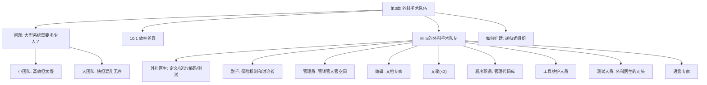

# 第3章 · 外科手术队伍

> *"这些研究表明，效率高和效率低的实施者之间具体差别非常大，经常达到了数量级的水平。"* —— Sackman, Erikson 和 Grant

---

## 🗺️ 知识结构导图

---

## 📘 概念先导：团队规模与效率的矛盾

!!! info "基础概念：软件开发中的团队规模困境"

    在进入 Brooks 的外科手术队伍模型之前，先理解他面对的核心矛盾：
    
    - **小团队**（2-5 人）：沟通路径少、决策快、概念完整——但完成大规模系统需要**太长时间**
    - **大团队**（100+ 人）：能并行大量工作——但沟通成本爆炸、概念破碎、产品无法在概念上进行集成
    
    这个矛盾在第 2 章已经埋下伏笔——n(n-1)/2 的沟通成本公式意味着，大团队的大部分精力被**内部协调**而非**外部产出**消耗。
    
    Brooks 的问题是：**如何在小团队的概念完整性和大团队的生产能力之间找到平衡？**

---

## 💡 认知冲突：200 个平庸程序员 vs 25 个精英？

> *「如果一个 200 人的项目中，有 25 个最能干和最有开发经验的项目经理，那么开除剩下的 175 名程序员，让项目经理来编程开发。」*

这是 Brooks 的一句半开玩笑的极端推论——但它指向了一个真实的困境。如果 25 个精英比 200 个普通程序员更高效，我们为什么还需要大团队？

因为：以 OS/360 为例，它花费了 5,000 人年。如果由 10 个精英来开发（假设他们比普通程序员高效 7 倍，且小团队又提高了 7 倍效率），他们需要 10 年才能完成——**「一个产品在最初设计的 10 年后才出现，还有人会对它感兴趣吗？」**

---

## 3.1 10:1 —— 程序员效率的惊人差异

!!! info "精准定义：程序员效率差异"

    Sackman、Erikson 和 Grant 在一项对经验丰富的程序员的实证研究中发现：
    
    - **生产率差异**：最好 vs 最差 = **10:1**
    - **运行速度差异**：**5:1**
    - **空间效率差异**：**5:1**
    
    Brooks 进一步观察到：**经验和实际表现之间没有明显的相关性。** 即一个工作十年的程序员不一定比工作两年的程序员效率更高。这意味着「按年资评估程序员」是一个有缺陷的方法。

!!! example "生活例证：班级小组作业里的 10:1"

    你肯定经历过：同样的小组作业，有的组一个人花一个晚上就完成了，另一个组四个人花了一周还搞得一塌糊涂。这不仅仅是能力差异——更根本的是**协作方式和角色分工**的问题。Brooks 的外科手术队伍正是要系统化地解决这个问题。

---

## 3.2 Mills 的外科手术队伍——一个突破性的方案

Harlan Mills 提出了创造性的解决方案：**大型项目的每个部分由一个团队解决，但该队伍以类似外科手术的方式组建，而非一拥而上。**

核心思想：**同每个成员截取问题某个部分的做法相反，由一个人来进行问题的分解，其他人给予他支持。**

### 10 人外科手术队伍的完整角色

| 角色 | 职责 | 现代映射 |
|------|------|----------|
| 🏥 **外科医生（首席程序员）** | 定义功能和性能技术说明、设计程序、编制源代码、测试、书写技术文档 | Tech Lead / Staff Engineer |
| 🩺 **副手** | 设计的思考者、讨论者和评估人。了解所有代码，充当外科医生的保险机制。可以代表小组与其他团队讨论接口 | Senior Engineer |
| 📋 **管理员** | 控制财务、人员、空间和机器。外科医生在人员/加薪上有决定权，但不应在这些事务上浪费任何时间 | Engineering Manager |
| ✍️ **编辑** | 根据外科医生的草稿进行分析和重新组织，提供参考和书目，维护文档的多个版本 | Technical Writer |
| 👩‍💼 **秘书（×2）** | 管理员和编辑各一个。处理非产品文件 | Admin Assistant |
| 🗄️ **程序职员** | 维护团队所有技术记录——代码、运行日志、状态记录。**将编程从「个人艺术」转变为「公共实践」** | Build Engineer / DevOps |
| 🔧 **工具维护人员** | 保证基础服务可靠性，构建和维护特殊工具。即使已有集中式服务，每个团队仍需要自己的工具人员 | Platform / DevTools Engineer |
| 🧪 **测试人员** | 设计功能测试用例和日常调试数据。作为外科医生的「对头」——站在用户角度挑刺 | QA Engineer / SDET |
| 📚 **语言专家** | 寻找简洁有效使用语言的方法。通常为 2-3 个外科医生服务 | Language / Framework Specialist |

!!! success "这个模型的核心突破"

    Mills 概念的真正关键是 **「从个人艺术到公共实践」的编程观念转换**。所有计算机的运作和产物向所有团队成员展现，所有的程序和数据是团队的所有物，而非私人财产。
    
    这解决了传统两人队伍的**两个核心问题**：
    
    1. 传统团队将工作划分，每人负责各自部分的设计和实现——而外科手术队伍中，**外科医生和副手都了解全部设计和代码**，节省了空间分配和磁盘访问的劳动量，确保了概念完整性。
    2. 传统团队平等讨论导致妥协和让步——而外科手术队伍中，**观点不一致由外科医生单方面统一**，不存在利益的差别。

---

## 3.3 如何扩建：递归式的外科手术

现在我们知道 10 人团队如何高效运作。但 5,000 人年的项目怎么办？

**答案是递归。** 让 200 人去解决问题，但只需要协调 20 个「外科医生」的思路。每个部分的概念完整性由一个人（或极少数人）决定——**决定设计的人员是原来的七分之一或更少。**

---

## 🔭 探索者之路：现代外科手术队伍

- **Spotify 的 Squad 模型**：每个 Squad（6-12 人）像微型外科手术队伍，拥有自治权和明确的使命
- **Google 的 Tech Lead / Engineering Manager 双轨制**：外科医生（TL）和管理员（EM）的分工
- **Amazon 的 Two-Pizza Team**：团队规模不应超过两个披萨能喂饱的人数——与 Brooks 思想一脉相承
- **Git 协作模型**：Linus Torvalds = 首席外科医生，维护者 = 副手，贡献者 = 扩展团队成员

---

## 💡 像工程师一样思考

> **模块化与关注点分离。** 外科手术队伍的本质是将「设计决策权」集中在少数人手中，而将「执行支持」分配给多人。这就是软件架构中的「关注点分离」原则在团队组织上的应用。

---

## 📝 要点总结

- [ ] 优秀程序员与较差程序员的生产率差异可达 **10:1**
- [ ] 经验与实际表现之间**没有必然联系**
- [ ] 小团队太慢，大团队太乱——这是大型系统的根本困境
- [ ] Mills 的外科手术队伍：**1 人思考 + 9 人支持** = 概念完整性 + 高生产率
- [ ] 扩建方式：递归——协调少数「外科医生」而非大量程序员

---

## 🏋️ 课后练习

**A. 识记**

1. 列出外科手术队伍的 10 个角色及各自的职责（一句话即可）。

**B. 理解**

2. 外科手术队伍与传统两人队伍的两个核心区别是什么？为什么前者更能保持概念完整性？

**C. 应用**

3. 假设你要组建一个 5 人团队开发一个微信小程序。运用外科手术队伍的思路，设计角色分工方案。哪些角色可以合并？哪些角色可以省略？哪些是必须保留的？

**D. 探究**

4. 🔭 研究 Spotify Squad 模型或 Amazon Two-Pizza Team，写一篇对比分析：它们与 Mills 的外科手术队伍在角色分工、决策权分配、扩建方式上有何异同？哪种更适合你的团队？

---

## 🚪 下一章预告

第四章探讨 Brooks 最具争议的观点——**「贵族专制」与概念完整性**。Brooks 主张系统设计必须由一个人（或极少数人）垄断，而不是「民主讨论」。这个看似"不民主"的原则，背后是什么逻辑？它与开源的「集市模式」是否矛盾？

**核心概念：概念完整性**  
- 好的系统 = 概念一致性 > 功能丰富度  
- 「贵族专制」= 少数人决定 what，多数人执行 how

👉 [进入第4章：贵族专制与系统设计](chapter4.md)
