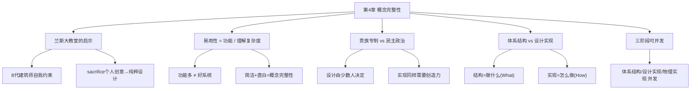

# 第4章 · 贵族专制、民主政治和系统设计

> *"大教堂是艺术史上无与伦比的成就……正是 Jean d'Orbais 构思了建筑的整体设计，这个设计得到了后继者的认同，至少在本质上如此。这也是这个建筑如此和谐统一的原因之一。"* —— 兰斯大教堂指南

---

## 🗺️ 知识结构导图

---

## 📘 概念先导：什么是「架构」？

!!! info "基础概念：软件架构（Software Architecture）"

    本章是全书的哲学核心。在深入之前，先明确两个关键概念：
    
    **体系结构（Architecture）**：Brooks 定义为「完整和详细的用户接口说明」。它回答的问题是：**系统做什么（What）**——用户看到的、使用的、依赖的一切。对于计算机来说是编程手册，对于编译器来说是语言手册，对于整个系统来说是用户完成全部工作所需参考的手册集合。
    
    **设计实现（Implementation）**：回答的问题是：**系统怎么做（How）**——模块边界、表结构、算法选择、路径优化。用户看不到这些，但它们决定了系统的性能、成本和可靠性。
    
    Brooks 认为这个区分是**获得概念完整性的最强有力方法**。

---

## 💡 认知冲突：功能越多 = 系统越好？

大多数程序员和产品经理的本能是：**加功能！** 这个很酷，那个用户可能需要，再加一个选项也不费事……

Brooks 在本章提出了一个完全相反的论断——并用一座大教堂作为论据。

---

## 4.1 兰斯大教堂：8 代建筑师的自我约束

绝大多数欧洲的大教堂中，不同时代、不同建筑师建造的各个部分之间存在着设计风格的差异。后来的建筑师总想在原有基础上「提高」——反映自己在设计风格和个人品味上的改变。所以「在雄伟的哥特式教堂上，依附着祥和的诺曼第风格十字架」。

但法国**兰斯大教堂**是个例外。8 代建筑师**自我约束**，每个人**牺牲了自己的一些创意**，以获得纯粹的设计——风格的一致性和完整性同样令人赞叹。

!!! info "精准定义：概念完整性（Conceptual Integrity）"

    **概念完整性是系统设计中最重要的考虑因素。** 它要求系统的所有部分反映相同的原理、原则和一致的折衷机制——在语法上使用相同的技巧，在语义上具有同样的相似性。
    
    测试标准不是「功能有多丰富」，而是：**功能与理解上复杂程度的比值才是系统设计的最终测试标准。** Brooks 特别强调：*「单是功能本身或者易于使用都无法成为一个好的设计评判标准。」*

---

## 4.2 「贵族专制」：为什么设计必须由少数人掌握

Brooks 的立场非常明确，而且毫不道歉：

> **「如果要得到系统概念上的完整性，那么必须控制这些概念。这实际上是一种无需任何歉意的贵族专制统治。」**

但这不等于实现人员没有创造力。Brooks 区分了两种创造：

| | 体系结构 | 设计实现 |
|---|---|---|
| 回答 | **做什么** | **怎么做** |
| 类比 | 建筑设计师 | 结构工程师 |
| 产出 | 编程手册/用户接口 | 模块设计/算法选择 |
| 创造力类型 | 概念性的、关乎用户体验 | 技术性的、关乎性能与效率 |

!!! tip "Blaauw 的经典区分"
    「体系结构陈述的是**发生了什么**，而实现描述的是**如何实现**。」——时钟的结构包括表面、指针和上发条的旋钮（小孩也能理解）；时钟的实现描述了表壳中的动力装置（需要专业知识）。

---

## 4.3 纪律不是创造力的敌人

Brooks 用了几个有力的例子：
- **巴赫**每周被要求创作形式严格的歌剧——这并没有压制他的创造性
- System/360 Model 30 的**预算限制**反而使它的体系结构更好
- Cornell 的 Conway 小组决定支持**未经改进的 PL/I 语言**，因为「关于语言的争议已经耗费了我们所有的时间和精力」

> **「外部的体系结构规定实际上是增强，而不是限制实现小组的创造性。一旦他们将注意力集中在没有人解决过的问题上，创意就开始奔涌而出。」**

---

## 4.4 在等待时，实现人员应该做什么？

Brooks 回忆了 OS/360 的一个惨痛教训：他让 150 人的实现团队参与规格说明编写，而不是让 10 人的体系结构团队独立完成。结果延迟了 3 个月，质量更差，概念完整性的缺乏导致**至少增加了一年调试时间**。

**正确答案：三阶段可以并发进行。**

| 阶段 | 何时开始 | 做什么 |
|------|----------|--------|
| 体系结构 | 项目启动 | 定义用户接口、编程手册 |
| 设计实现 | 体系结构有雏形后 | 设计模块边界、表结构、算法、工具 |
| 物理实现 | 设计实现开始后 | 库调整、系统管理、搜索排序算法 |

---

## 🔭 探索者之路

- **Mac Human Interface Guidelines**：Apple 版本的「体系结构手册」——所有 Mac 应用遵循统一的人机界面规范
- **Unix 哲学**：「Do one thing and do it well」——概念完整性的另一种表述
- **GraphQL Schema**：单一事实来源——概念完整性在 API 层面的体现
- **微服务的 Bounded Context**（DDD）：将概念完整性应用到每个微服务边界

---

## 📝 要点总结

- [ ] **概念完整性**是系统设计中最重要的考虑因素
- [ ] 衡量标准：**功能 / 理解复杂度** 的比值，而非功能数量
- [ ] 设计必须由一个人（或极少数人）掌握——这是「无需道歉的贵族专制」
- [ ] 纪律和规范**增强**而非限制创造性
- [ ] 体系结构、设计实现、物理实现三阶段可以并发

---

## 🏋️ 课后练习

**A. 识记**

1. 定义「概念完整性」。区分「体系结构」和「设计实现」。

**B. 理解**

2. 为什么 Brooks 用兰斯大教堂（而非普通大教堂）来比喻概念完整性？8 代建筑师的「自我约束」在软件团队中对应什么行为？

**C. 应用**

3. 选一个你常用的软件（IDE、App、框架均可），从概念完整性的角度分析：各部分的设计是否一致？是否存在风格冲突？如果由你来「贵族专制」，你会砍掉哪些不协调的功能？

**D. 探究**

4. 🔭 研究 Unix 哲学（Doug McIlroy：「Do one thing and do it well」），写一篇分析：Unix 哲学与 Brooks 的概念完整性原则有何异同？在微服务架构中，Unix 哲学被如何继承（或被背叛）？

---

## 🚪 下一章预告

第五章警告一个每个工程师都会犯的陷阱——**「第二系统效应」**。为什么第二个系统往往是最危险的？为什么架构师在第二个系统中会「画蛇添足」，把第一个系统中所有被压抑的修饰功能全部堆进去？

**核心概念：第二系统效应**  
- 第一个系统：谨慎、克制、「只做必要的事」  
- 第二个系统：野心膨胀、「把所有想法都塞进去」→ 功能臃肿、延误、复杂度爆炸

👉 [进入第5章：画蛇添足](chapter5.md)
