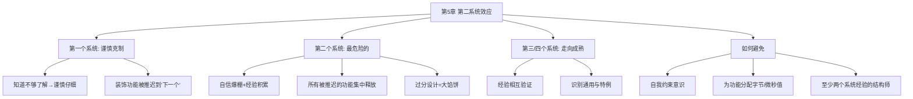

# 第5章 · 画蛇添足

> *"聚沙成塔，集腋成裘。"* —— 奥维德

---

## 🗺️ 知识结构导图

---

## 📘 概念先导：什么叫「过度设计」？

!!! info "基础概念：过度设计（Over-engineering）"

    **过度设计**是指为系统添加超出实际需要的复杂度——为了实现未来「可能」需要的功能、为了cover「万一」出现的场景、为了体现技术能力。它的反义词不是「简陋」，而是**「恰好满足需求的设计」**。
    
    Brooks 观察到：过度设计最容易发生在**第二个系统**——设计师在第一个系统中克制了自己，在第二个系统中释放了所有被压抑的欲望。

---

## 💡 认知冲突：你做的第二个项目可能比第一个更糟糕

这听起来违反直觉——有了第一次的经验，第二次不应该更好吗？

**恰恰相反。** 第一个系统中，结构师知道自己不够了解这个领域，所以**谨慎、克制、精炼**。他把所有「很酷但非必要」的功能推迟到「下一个项目」。当第二个系统来临时，他已经积累了经验、充满了自信——**所有被压抑的欲望集中释放。**

!!! info "精准定义：第二系统效应（The Second-System Effect）"

    设计师在设计第二个系统时的一种普遍倾向——**过分地进行设计**，向系统添加大量修饰功能和想法。结果往往是一个臃肿、过度复杂的系统。
    
    当设计师着手第三个或第四个系统时，先前的经验相互验证，他才能获得对通用特性的真正判断。

---

## 5.1 OS/360：第二系统效应的经典案例

Brooks 列举了 OS/360 中的多个例子：

- **26 字节的常驻日期翻转例程**——仅为处理闰年的 12 月 31 日（完全可以留给操作员手动处理）
- **链接编辑器**包含了最优秀的覆盖（overlay）功能——但它属于一个已经转向动态内核分配的系统，静态覆盖概念已经过时了。*「就像一个挺着大肚子的节食者一样，直到系统的思想已经十分优越时，才开始对原有技术进行细化和精炼。」*
- **TESTRAN 调试程序**是批调试程序的巅峰——但此时交互式调试已经开始兴起
- **调度程序**是对 1410-7010 磁盘操作系统后续的二次系统——精炼、改进、增强，但几乎完全不影响 OS/360 的远程任务项和多道程序

---

## 5.2 如何避免第二系统效应

| 策略 | 说明 |
|------|------|
| **自我约束** | 有意识地关注第二系统的特殊危险 |
| **为每个功能分配成本** | 「功能 x 不超过 m 字节内存和 n 微秒」——量化决策依据 |
| **至少两个系统以上经验的结构师** | 项目经理必须坚持这一要求 |
| **不断提出正确的问题** | 确保核心目标在详细设计中得到完整体现 |

!!! tip "结构师与实现人员的交互准则"

    1. 牢记是开发人员承担**创造性实现责任**——结构师只能建议，不能支配
    2. 时刻准备为指定的说明建议一种实现方法——同样准备接受任何其他能达到目标的方法
    3. 对建议保持**低调和平静**
    4. 准备**放弃**坚持所作的改进建议

---

## 🔭 探索者之路

- **Windows NT**：Brooks 在 1995 年批注中称其为「90 年代的 OS/360」
- **微服务过度**：第一个微服务项目谨慎克制，第二个引入 K8s+Istio+服务网格+分布式追踪+……远超实际需要
- **框架狂热**：「这个项目用 React 就够了」→「下个项目全栈 Next.js+tRPC+Prisma+Turborepo+……」

---

## 📝 要点总结

- [ ] **第二个系统是最危险的**——自信 + 被压抑的功能 = 过度设计
- [ ] 第三或第四个系统才能真正平衡通用与特例
- [ ] 避免方法：自我约束、量化功能成本、使用有经验的结构师
- [ ] 结构师的建议必须低调、可弃、尊重实现者的创造责任

---

## 🏋️ 课后练习

**A. 识记**

1. 定义「第二系统效应」。给出 2 个属于它的典型症状。

**B. 理解**

2. 为什么第一个系统的结构师倾向于简洁，而第二个倾向于过度设计？从心理和技术两个角度解释。

**C. 应用**

3. 你正在做或计划做的下一个软件项目是什么？运用第二系统效应的分析框架，找出其中可能属于「被压抑的修饰功能」的部分——把它们列出来，然后问自己：哪些是真正必要的？

**D. 探究**

4. 🔭 研究一个因「第二系统效应」而失败的知名软件项目，写出案例分析。Windows NT（Brooks 自己点名）、第二代微服务架构、或你选择的其他案例均可。

---

## 🚪 下一章预告

第六章讨论**「贯彻执行」**——好的设计只是开始，如何确保最终产品忠实于设计？Brooks 提出了形式化定义、直接集成、周例会等具体机制。这是从"设计"到"落地"的关键跨越。

**核心概念：贯彻执行**  
- 形式化定义（Formal Definition）是「最高法院」——一切分歧以它为准  
- 直接集成 + 周例会 = 让偏离无所遁形

👉 [进入第6章：贯彻执行](chapter6.md)
