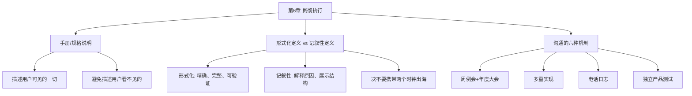

# 第6章 · 贯彻执行

> *"他只是坐在那里，嘴里说：'做这个！做那个！'当然，什么都不会发生，光说不做是没有用的。"* —— 杜鲁门，论总统权力

---

## 🗺️ 知识结构导图

---

## 📘 概念先导：规格说明是什么？

!!! info "基础概念：规格说明（Specification）"

     **规格说明** （或称手册、技术说明）是描述系统 **外部行为** 的文档——用户看到的每一个细节。它和 **设计文档** 的区别是：
    - 规格说明 = 系统 **做什么** （外部可见的行为）——结构师的产出
    - 设计文档 = 系统 **怎么做** （内部实现）——实现人员的产出
    
    本章的核心问题：结构师写出了完美的规格说明， **如何确保 1,000 个实现人员真正理解并执行？** 

---

## 6.1 手册：必须精确到「定义未规定什么」

System/360 Principles of Operation 是 Brooks 见过的最好手册——特别是它的附录，精确规定了兼容性的限制。Brooks 强调： **规格说明的作者必须「在仔细定义规定什么的同时，定义未规定什么。」** 

---

## 6.2 形式化定义 vs 记叙性定义

| | 形式化定义 | 记叙性定义 |
|---|---|---|
| 优点 | 精确、完整、差异明显、完成快 | 易理解、展示结构原则、解释原因 |
| 缺点 | 不易理解、缺少解释 | 可能模糊、不一致 |

!!! warning "决不要携带两个时钟出海——带一个或三个"
    如果同时使用两种方式，必须 **以一种为标准，另一种为辅助描述**。两种都当标准用会导致灾难。

---

## 6.3 周例会 + 年度大会

| 会议 | 频率 | 参与者 | 目的 |
|------|------|--------|------|
| 周例会 | 每周半天 | 所有结构师+实现代表+市场 | 快速决策 |
| 年度大会 | 每 6-12 月 | 全体+编程经理 | 解决堆积问题 |

周例会五条成功要素：相同小组每周交流、每人都承担义务、在界线内外同时寻求方案、书面建议强制决策、首席结构师有最终决策权。

---

## 6.4 多重实现 + 独立测试

> *"如果起初至少有两种以上的实现，那么（体系结构）定义会更加整洁，会更加规范。"*

当只有一个实现时，手册与机器不一致 → 改手册（更便宜）。有多个必须兼容的实现时 → **改机器的代价远低于让所有实现改代码**。

> *"项目经理最好的朋友就是他每天要面对的敌人——独立的产品测试机构/小组。"*

---

## 🔭 探索者之路

- **OpenAPI / GraphQL Schema**：形式化定义的现代版本
- **TypeScript 类型系统**：编译时强制接口——「直接整合」思想的实现
- **Design System**：以代码形式强制执行概念完整性
- **RFC 流程**：IETF 的「征求意见」——形式化定义+多重实现的现代版

---

## 📝 要点总结

- [ ] 手册描述用户可见的一切，不描述不可见的事物
- [ ] 形式化定义和记叙性定义互补——但必须以一个为标准
- [ ] 周例会+年度大会双层沟通机制
- [ ] 多重实现是强制兼容性的最佳手段
- [ ] 独立测试小组是执行力的最后防线

---

## 🏋️ 课后练习

**A. 识记**

1. 列出贯彻执行体系的七个组件。

**B. 理解**

2. 为什么「多重实现」能强制规格说明的一致性？这与「决不要携带两个时钟出海」有什么关联？

**C. 应用**

3. 如果你在做一个前后端分离的项目，你会用什么机制来「贯彻执行」接口定义？与 Brooks 的方法对比。

**D. 探究**

4. 🔭 研究 GraphQL Schema 或 OpenAPI Spec，分析它们如何体现 Brooks 的「形式化定义」思想。两者各自的「记叙性辅助」是什么？

---

## 🚪 下一章预告

第七章讲述软件开发中最古老的悲剧——**「巴比伦塔」的倒塌**。为什么一个项目有了清晰的「说明书」，沟通还是会失败？Brooks 指出了组织结构和沟通路径的深层矛盾，并提出「项目工作手册」作为解决方案。

**核心概念：巴比伦塔的教训**  
- 沟通失败 ≠ 缺乏意愿，而是组织结构本身就制造障碍  
- 项目工作手册 = 所有外部可见的接口约定 + 所有成员可见

👉 [进入第7章：巴比伦塔](chapter7.md)
