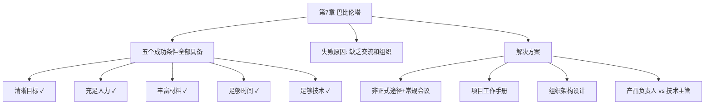

# 第7章 · 为什么巴比伦塔会失败？

> *"现在整个大地都采用一种语言……来，让我们建造一座带有高塔的城市……于是上帝说，来，让我们下去，在他们的语言里制造些混淆。"* —— 《创世纪》11:1-8

---

## 🗺️ 知识结构导图

---

## 📘 概念先导：沟通在软件工程中的角色

!!! info "基础概念：组织沟通"

    软件工程中的「沟通」不是茶水间的闲聊——它是指**所有确保团队成员对系统有一致理解的活动**：需求对齐、接口定义、变更通知、设计评审、代码审查。
    
    Brooks 的核心论断：**交流和交流的结果——组织，是成功的关键。** 巴比伦塔具备了所有物质条件但仍然失败了——因为语言被混淆，交流无法进行。这个隐喻直接对应软件项目中不同团队使用不同术语、对同一接口有不同理解的困境。

---

## 💡 认知冲突：条件全部具备，为什么还是失败了？

巴比伦塔：清晰目标 ✓、充足人力 ✓、丰富材料 ✓、足够时间 ✓、成熟技术 ✓。**但它仍然是人类历史上第一个彻底失败的工程。**

Brooks 的诊断：**缺乏交流，以及交流的结果——组织。**

---

## 7.1 大型编程项目中的交流

> *"因为左手不知道右手在做什么，从而进度灾难、功能的不合理和系统缺陷纷纷出现。"*

Brooks 举了 OS/360 的真实例子：覆盖功能的实现者发现很少应用程序使用它，于是降低了它的速度。与此同时，其他同事正在设计**依赖覆盖功能**的监控程序——速度变化成了一个未被传达的规格说明变更。

**交流的三种途径**：非正式（电话沟通）、会议（周例会技术陈述）、工作手册。

---

## 7.2 项目工作手册

!!! info "精准定义：项目工作手册"

    不是独立的一篇文档——而是**对项目必须产生的一系列文档进行组织的一种结构**。所有项目文档都是该结构的一部分。
    
    核心原则：每个团队成员应能**看到所有材料**、实时更新、注意力集中在上次阅读后的变更上。

!!! danger "Parnas vs Brooks 的经典辩论"
    Parnas 认为各部分应被封装，只需了解接口。Brooks 的回应：**「Parnas 的建议的确是灾难的处方。」** 在系统级问题上，不了解整体就无法做出正确的局部决策。

---

## 7.3 组织架构：产品负责人 + 技术主管

每个子项目需要两个领导角色：

| 角色 | 职责 | 沟通方向 |
|------|------|----------|
| 产品负责人 | 组建团队、划分工作、制订进度、争取资源 | 对外（向上和水平） |
| 技术主管 | 构思设计、提供概念完整性、控制复杂度 | 对内（团队内部） |

三种有效的组合方式：同一人担任 / 产品负责人指挥技术主管 / 技术主管指挥产品负责人。

---

## 🔭 探索者之路

- **Conway 定律**：「设计系统的组织架构受产品约束，生产出的系统是这些组织沟通结构的映射」——与 Brooks 思想相互印证
- **Slack/Discord** 作为现代「工作手册」：实时更新、可搜索
- **Notion/Confluence**：结构化文档+变更通知
- **ADR（Architecture Decision Records）**：架构决策的正式记录

---

## 📝 要点总结

- [ ] 巴比伦塔的失败是**交流失败**——所有物质条件都具备
- [ ] 项目工作手册是所有文档的组织结构——实时更新和辐射同步是核心
- [ ] 交流通过网状结构进行，管理通过树状结构
- [ ] 每个子项目需要两个领导：产品负责人 + 技术主管

---

## 🏋️ 课后练习

**A. 识记**

1. 巴比伦塔具备了哪 5 个成功条件？缺少了哪 2 个导致失败的关键要素？

**B. 理解**

2. Brooks 和 Parnas 在「信息可见性」上的分歧是什么？你倾向于哪一方？为什么？

**C. 应用**

3. 为你当前参与的项目设计一份「项目工作手册」的结构目录。它应该包含哪些类别的文档？

**D. 探究**

4. 🔭 选择一个大型开源项目（如 Kubernetes），研究其沟通机制（邮件列表、Slack、SIG 会议、RFC 流程），分析它如何解决巴比伦塔问题。

---

## 🚪 下一章预告

第八章进入第二幕——**「工具与方法」**。Brooks 说「胸有成竹」（怀揣信心）不是玄学，而是靠**精确估算**。本章将揭示编程生产率的核心规律：语句级生产率是常数，以及 1.5 次方定律——规模每扩大 3 倍，工作量增加约 5 倍。

**核心概念：估算的科学**  
- 语句级生产率是常数（~10行/人天，无论用什么语言）  
- 工作量 = 常数 × (规模)^1.5 ——这不是线性增长！

👉 [进入第8章：胸有成竹](chapter8.md)
