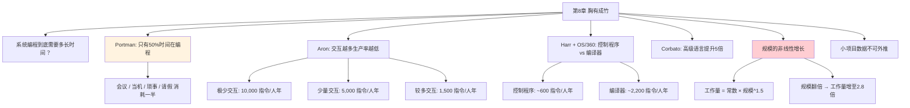

# 第8章 · 胸有成竹

> *"实践是最好的老师，但是，如果不能从中学习，再多的实践也没有用。"*
> —— 《可怜的理查年鉴》

---

## 🗺️ 知识结构导图

---

## 📘 概念先导：什么是「生产率」？

在进入数据之前，先搞清楚本章的核心概念。

!!! info "基础概念：软件生产率"

    **软件生产率** = 在单位时间内产出的合格软件数量。历史上用过多种度量单位：
    
    - **指令/人年**：每人每年产出多少条机器指令（1970年代主流，Brooks 大量使用）
    - **代码行/人年（KLOC/人年）**：每人每年产出多少千行源代码（1980-2000年代主流）
    - **功能点/人月**：每人每月产出多少功能点（与语言无关的抽象度量）
    - **Story Points/Sprint**：每人每 Sprint 产出多少故事点（敏捷时代主流）
    
    **本章的核心教训不依赖于具体单位**——无论你用什么度量，Brooks 发现的**相对关系**（交互越少生产率越高、操作系统比编译器慢3倍、规模非线性增长）都成立。

---

## 💡 认知冲突：你觉得「全天在写代码」，实际上只有一半

你坐在电脑前八个小时。你觉得自己在写代码。但如果真实记录一周的时间日志呢？

英国 ICL 公司的软件经理 Charles Portman 发现了一个惊人的事实：

> 他的编程队伍落后进度约 **1/2**——每项工作花费的时间大约是估计的两倍。

Portman 要求团队仔细记录时间日志。结果显示：

!!! info "Portman 的数据：有效编程时间占比"

    **全职程序员仅将 50% 的工作周用于实际的编程和调试。**
    
    其余 50% 的时间去哪里了？
    
    | 消耗项 | 举例 |
    |--------|------|
    | 机器当机时间 | 服务器挂了、编译环境崩溃 |
    | 高优先级琐碎工作 | 「帮我看看这个 bug」「紧急会议」 |
    | 会议 | 站会、评审、1-on-1、全员大会 |
    | 文字工作 | 写邮件、填工单、更新 Jira |
    | 公司业务 | 团建、培训、HR 流程 |
    | 个人事务 | 疾病、事假、医生预约 |

**这意味着什么？** 当你估算一个功能需要「一个程序员一周」时，你心里想的是 40 小时全神贯注的编程——但实际发生的，可能只有 20 小时。**这就是为什么几乎所有估算都从一开始就低估了一半。**

---

## 8.1 Aron：交互越多，生产率越低

Joel Aron 是 IBM 的系统技术主管。他研究了 **9 个大型项目**（程序员 > 25 人，指令 > 30,000 行），按程序员之间的**交互程度**分类：

| 交互程度 | 生产率（指令/人年） | 现实中的对应场景 |
|----------|:-----------------:|-----------------|
| 非常少的交互 | **10,000** | 你在写一个独立命令行工具，不需要和任何人协调 |
| 少量的交互 | **5,000** | 你在写一个微服务，需要和另一个服务的负责人对齐 API |
| 较多的交互 | **1,500** | 你在单体应用核心模块上工作，每次修改牵连 5 个其他模块 |

!!! important "关键发现"
    从「极少交互」到「较多交互」，生产率从 10,000 骤降到 1,500——**下降了近 7 倍。**
    
    而且 Aron 的数据**仅包括设计和编程，不包括系统测试**。如果加上测试，这些数字大约还要**除以 2**。
    
    这意味着在交互最多的场景中，有效生产率可能只有 **750 指令/人年**。

!!! example "生活例证：交互的代价用数字说话"
    
    场景对比：
    
    **独立项目**（极少交互）：你一个人维护一个 Python 脚本，每天产出 ~200 行净增代码（包括调试）。
    
    **协作项目**（较多交互）：你在一个 8 人团队的前端仓库工作。今天你的 PR 被 blocked 因为后端 API 还没好 → 去开会讨论接口格式 → API 格式改了 → 你的 PR 要 rebase → 合并冲突 → 再去确认 UI 组件库版本 → ……一天下来净增 30 行。
    
    生产率从 200 降到 30——降幅 6.7 倍。这个数字不是因为你变懒了。是因为**交互本身消耗了大量时间**。

---

## 8.2 Harr + OS/360：操作系统 vs 编译器

John Harr 是 Bell Labs 的编程经理。他提供了当时最详细和最有用的生产率数据：

| 程序类型 | 生产率（指令/人年） | 典型例子 |
|----------|:-----------------:|---------|
| 控制程序（操作系统内核等） | **~600** | 进程调度、内存管理、I/O 子系统 |
| 语言翻译（编译器、解释器） | **~2,200** | C 编译器、Fortran 编译器 |

Brooks 自己的 **OS/360 项目数据**与 Harr 的数据高度一致：

- **控制程序组**：600–800 指令/人年
- **语言翻译组**：2,000–3,000 指令/人年

!!! tip "Brooks 的复杂度经验法则"

    > 编译器的复杂度是批处理程序的 **3 倍**，操作系统的复杂度是编译器的 **3 倍**。
    
    为什么控制程序这么难？因为它需要处理：
    - **并发**：多个进程同时运行，资源竞争、死锁预防
    - **中断**：硬件随时打断正在执行的代码
    - **资源分配**：内存、CPU 时间片、I/O 通道的调度
    - **错误恢复**：任何组件出错都不能让整个系统崩溃
    
    每一个都是**指数级复杂**的问题——不是线性叠加的。

---

## 8.3 Corbato：高级语言带来 5 倍提升

MIT 的 Fernando Corbato（分时系统之父）报告了 MULTICS 项目的数据：

> 使用 **PL/I 高级语言**（而非汇编），平均生产率是 **1,200 行经调试的 PL/I 语句/人年**。

这个数字为什么令人兴奋？因为 PL/I 的每个语句大约对应于**手写汇编代码的 3-5 个指令**。

Brooks 由此推出了全书最深刻的结论之一：

!!! success "核心洞见：语句级生产率是常数"

    > **在基本语句的级别，生产率看上去是个常数。** 使用适当的高级语言，编程的生产率可以提高 **5 倍**。
    
    这个发现意味着什么？
    
    - ❌ 「换一门语言就能让生产率翻倍」——这是错的。你用 Python 每天写 200 行，换 Rust 不会自动变成 400 行。
    - ✅ 「高级语言让你**每个语句表达更多底层操作**」——这才是生产率提升的真正来源。一个 Python list comprehension 可能等于 10 行 C 代码，但打字时间是一样的。
    
    **你的瓶颈不是打字速度，而是思考速度。** 高级语言的价值在于：同一份「思考」产出更多「执行」。

---

## 8.4 规模的非线性增长：最被低估的真相

!!! danger "核心公式：工作量 = 常数 × (程序规模)^1.5"

    这个公式来自 Nanus & Farr 以及 Weinwurm 的研究。指数 ≈ 1.5。实际 Boehm 在后续研究中将其精化为 1.05–1.20 之间，但**大于 1 的结论不变**。
    
    | 程序规模 | 工作量倍数（按 1.5 次方） | 如果按线性推算 |
    |----------|:------------------------:|:--------------:|
    | 1,000 行 | **1×** | 1× |
    | 2,000 行 | **2.8×** | 2× |
    | 5,000 行 | **11.2×** | 5× |
    | 10,000 行 | **31.6×** | 10× |
    | 100,000 行 | **1,000×** | 100× |

**为什么是 1.5 次方？** 因为软件不是相同元素的重复——每个新增元素会与**已有所有元素**产生新的交互。这和第 2 章的沟通路径公式 n(n-1)/2 是同一个数学逻辑：交互路径不是线性增长，而是**组合爆炸式**增长。

!!! example "生活例证：大项目为什么总是延期"

    一个 1,000 行的 Python 脚本：你一个周末搞定。
    
    一个 10,000 行的 Web 应用：你以为需要 10 个周末。但实际可能需要 **30 个周末**。而且越到后面越慢——因为：
    - 每次改一个函数，可能要改 5 个测试
    - 每次改数据库 Schema，可能要改 10 个 API
    - 每次「小优化」，可能在另一个角落引入 bug
    
    这就是 1.5 次方定律在你项目中的真实面目。

---

## 8.5 小项目数据不可外推

!!! warning "关键警告"

    Sackman 等人报告：对平均 3,200 指令的程序，单人编码+调试约 178 小时，外推得年产 35,800 语句。规模减半的程序仅需四分之一时间，外推得年产 80,000 语句。
    
    Brooks 的回应非常直接：这些数字**没有包括计划、文档、测试、系统集成**。而且，**构建独立小型程序的数据不适用于编程系统产品。**
    
    > **「就像把 100 码短跑记录外推，得出人类可以在 3 分钟之内跑完 1 英里的结论一样荒谬。」**

---

## 🔭 探索者之路：50 年后的数据

> 以下为拓展内容。

**2024 年数据与 1975 年数据的惊人呼应：**

| Brooks 的发现（1975） | 现代数据 | 来源 |
|----------------------|---------|------|
| Portman: 50% 时间不在编程 | 全栈开发者每周实际编码 ~15-20 小时（40 小时工作周 ≈ 50%） | 2024 Stack Overflow 调查 |
| 控制程序更难 | 分布式系统工程师的「净增代码」约为前端工程师的 1/3 | GitClear 2023 报告 |
| 高级语言提升 5 倍 | TypeScript/Rust 相对 C 的生产率提升约 3-5 倍 | 多项元分析 |
| 工作量 ≈ 规模^1.5 | COCOMO II 指数 1.05-1.20（更乐观但 >1 不变） | Boehm et al., 2000 |

**AI 辅助编程的影响：**
- GitHub Copilot 研究显示编码速度提升 ~55%
- 但需求分析、架构设计、代码审查的时间**没有减少**
- 按 Brooks 的框架：AI 解决了「表达」（次要困难），但没解决「构思」（根本困难）

---

## 💡 像工程师一样思考

> **数据驱动而非直觉驱动。** Portman 的方法——记录时间日志 → 对比直觉 → 校准估算——是一种核心工程素养。你不知道你的真实生产率，直到你测量它。类比：你不知道你的车每百公里耗油多少，直到你实际记录了加油量和里程。

---

## 🧠 学习加油站

!!! question "停下来想一想"

    1. Portman 发现程序员只有 50% 的时间在编程。如果记录一周，你的实际编程时间占比是多少？你觉得差距主要来自哪些消耗项？
    2. Aron 的「交互越多生产率越低」与第 2 章的 Brooks 法则有什么内在联系？能否用 n(n-1)/2 来解释？
    3. 「语句级生产率是常数」——这意味着什么？如果有一天 AI 能帮你写所有代码，你的「语句级生产率」是不是就能无限提升了？瓶颈会转移到哪里？

---

## 📝 要点总结

- [ ] Portman：程序员约 **50%** 时间在实际编程和调试——所有估算必须考虑非编程活动
- [ ] Aron：生产率随交互程度急剧下降——**10K → 5K → 1.5K** 指令/人年
- [ ] Harr + OS/360：控制程序 ~**600** 指令/人年，编译器 ~**2,200**——约为 3.7 倍差距
- [ ] Corbato：高级语言带来约 **5 倍** 生产率提升——**语句级生产率是常数**
- [ ] **工作量 = 常数 × 规模^1.5**——规模翻 3 倍，工作量增至约 5.2 倍（不是 3 倍）
- [ ] 小项目数据不可外推——就像 100 码短跑记录不能外推到 1 英里

---

## 🏋️ 课后练习

**A. 识记与简单模仿**
1. 默写 Portman、Aron、Harr、Corbato 各自的发现（一句话概括即可）。
2. 写出规模-工作量公式。计算程序规模从 1,000 行增长到 5,000 行时，工作量增加多少倍（按指数 1.5 计算）。

**B. 理解与变式辨析**
3. 为什么控制程序的生产率远低于编译器？用 Aron 的「交互程度」框架和 Brooks 的「3 倍复杂度」法则联合解释。
4. 「语句级生产率是常数」这一发现，对「换编程语言能否提升我的产出」这个问题意味着什么？

**C. 综合应用与迁移**
5. 记录你一周的时间日志（使用 Toggl Track、RescueTime 或手动记录均可），统计你的「有效编程时间占比」。对比 Portman 的 50%，分析差距来源，写一份 500 字的反思。
6. 估算你最近完成的一个项目的「规模」（代码行数或其他合理度量），用 1.5 次方定律反推：如果项目规模扩大 3 倍，工作量会增加多少？这个数字是否符合你的直觉？

**D. 探究与开放挑战**
7. 🔭 AI 编程助手（Copilot、Cursor 等）声称能将编码速度提升 55% 以上。用 Brooks 的「语句级生产率是常数」和 Aron 的「交互程度」框架，写一篇分析：AI 在多大程度上改变了 Brooks 的生产率公式？如果「思考要做什么」的时间远多于「怎么写」的时间，AI 的边际收益在哪里递减？请引用具体的现代研究数据。

---

## 🚪 下一章预告

第九章——**「削足适履」**，讨论程序规模控制这个永恒话题。Brooks 警告：程序的规模必须像预算一样严格控制，否则它会自动膨胀到超出系统的承受能力。这个 50 年前的警告在 Electron App 和现代 Web 前端中比任何时候都更刺耳。

**核心概念：规模预算**  
- 规模必须像金钱一样有预算——没有预算 = 必然超支  
- 「空间换时间」是权衡，不是免费午餐

👉 [进入第9章：削足适履](chapter9.md)
