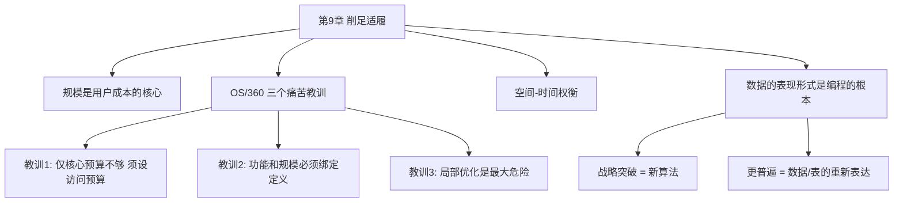

# 第9章 · 削足适履

> *"他应该瞪大眼睛盯着诺亚，好好学习，看他们是怎样把那么多东西装到一个小小的方舟上的。"*

---

## 🗺️ 知识结构导图

---

## 📘 概念先导：为什么规模至今仍然重要？

Brooks 在 1975 年关注的是内存和磁盘空间。今天这些便宜了——但问题换了个面貌：你的 Node.js 容器跑在 2GB 上（512MB 就够了），React 首页加载 5MB JS（每多 100KB 转化率降 0.5%），数据库查询返回了所有列（实际只用 3 列）。 **不必要的规模是不可取的** ——这句在云原生时代同样锋利。

---

## 9.1 OS/360 的三个痛苦教训

### 教训 1：仅对核心程序设定规模目标是不够的

OS/360 团队为每个单元设立了核心规模——但没有设磁盘访问预算。程序员把代码拆成链接库→整体规模增加+速度降低——没有人发现直到仿真器第一次运行，Fortran H 每分钟只能编译 5 条语句。

> **教训：和规模预算一样，制订后台存储访问的预算。**

### 教训 2：功能和规模必须绑定定义

在分配功能 **之前** 就编制了空间预算。结果：规模超标的程序员把代码 **扔给别人的模块** ——控制了核心大小但摧毁了系统稳定。

> **教训：在指明模块有多大的同时，确切定义模块的功能。**

### 教训 3：局部优化是最大危险

每个程序员都把自己当成「争取小红花的学生」，没人停下来考虑整体影响。

> **最重要的管理职能：培养开发人员从系统整体出发、面向用户的态度。**

---

## 9.2 数据的表现形式是编程的根本

!!! tip "全书最精辟的洞见之一"

    > *"如果提供了程序流程图而没有表数据，我仍然会很迷惑。而给我看表数据，往往就不再需要流程图了。"*

    战略突破有两种：新算法（如 O(n²)→O(n log n)）和 **数据/表的重新表达** （更普遍，更重要）。例子：一个年轻人编写了「解释器的解释器」——通过重新表达数据使程序缩小到不可思议的程度。解码损失了一些时间，但避免了 I/O，得到十倍补偿。

!!! example "生活例证：HashMap 的威力"

    频繁查找用户信息：遍历数组 O(n)，HashMap O(1)。你没有改变算法逻辑——只是 **重新表达了数据** 。性能差异可能是数百倍。

---

## 🔭 探索者之路

-  **Performance Budget** （JS < 200KB，首屏 < 2s）
-  **Lighthouse CI** ：自动化性能预算检测
-  **Tree Shaking / Code Splitting** ：编译时去无用代码
-  **Bounded Context（DDD）** ：防止「把代码甩给别人」

---

## 📝 要点总结

- [ ] 规模是用户成本的核心——不必要的规模不可取
- [ ] 三个教训：全面预算 / 功能规模绑定 / 全局视角防局部优化
- [ ] 空间-时间可权衡——空间越多通常速度越快
- [ ]  **数据的表现形式是编程的根本** ——突破来自数据重组

---

## 🏋️ 课后练习

**A. 识记**

1. OS/360 规模控制的三个教训，各用一句话解释。

**B. 理解**

2. 「数据的表现形式是编程的根本」——用一个你实际写过的代码来解释这句话。

**C. 应用**

3. 为你的项目设定一个规模预算（代码行数、内存、API 响应时间或前端 Bundle 大小），持续跟踪一周并记录偏差。

**D. 探究**

4. 🔭 研究「代码膨胀」（software bloat）现象——以 Electron 或现代 Web App 为例。当前软件行业是否在违背 Brooks 的警告？如果有，原因是什么？

---

## 🚪 下一章预告

第十章—— **「提纲挈领」** ，Brooks 告诉你文档不是负担，而是「提纲」。不写文档最受伤的不是别人，而是未来的你自己。本章将介绍一套"最小可行文档集"：目标、规格、进度、预算、组织结构……以及每个文档只写一页纸的极致简约原则。

**核心概念：文档即提纲**  
- 文档不是写给别人的报告，而是你自己的「指挥棒」  
- 一页纸原则：如果写不明白一页纸，就是没想明白

👉 [进入第10章：提纲挈领](chapter10.md)
