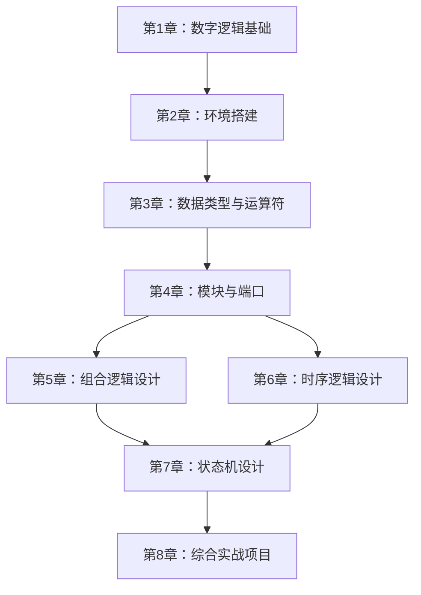

# Verilog 零基础入门指南

> **从"软件思维"到"硬件思维"——用乐高积木的视角理解数字电路设计**

---

## 教程概述

本教程面向 **零基础** 学习者，从数字逻辑基础出发，循序渐进地引导你掌握 Verilog 硬件描述语言的核心语法、常用设计模式和典型电路实现。无需任何硬件设计经验，只需具备基本的计算机操作能力。

| 项目 | 说明 |
|:---|:---|
| **适用人群** | 电子/计算机专业学生、FPGA 初学者、嵌入式工程师转行 |
| **前置要求** | 基本计算机操作能力（无需编程基础） |
| **预计学习时长** | 20~25 小时（含实践练习） |
| **核心比喻** | 乐高积木搭建（模块化、连接、层次化） |
| **实践工具** | Icarus Verilog（免费开源仿真器）+ VS Code |

---

## 教程特色

- **零基础友好** ：从"什么是硬件描述语言"开始，每个概念都配有生活化比喻
- **动手实践** ：每章提供完整可运行的代码示例，配有逐行注释
- **FAQ 模块** ：针对初学者常见困惑设置专门的"常见问题解答"
- **循序渐进** ：从组合逻辑到时序逻辑，再到状态机，难度平滑递进
- **最佳实践** ：涵盖代码风格规范、可综合性设计原则及常见陷阱规避

---

## 章节导航

| 章节 | 标题 | 核心内容 | 预计时长 |
|:---:|:---|:---|:---:|
| 1 | 数字逻辑基础与 Verilog 概述 | 硬件描述语言概念、数字电路基础、设计流程 | 2h |
| 2 | 开发环境搭建与第一个程序 | Icarus Verilog 安装、GTKWave 波形查看、Hello World | 1.5h |
| 3 | 数据类型与运算符 | wire/reg、向量、数组、运算符优先级 | 2.5h |
| 4 | 模块与端口 | 模块定义、端口声明、实例化、层次化设计 | 2.5h |
| 5 | 组合逻辑设计 | assign 语句、always 块、多路选择器、译码器 | 3h |
| 6 | 时序逻辑设计 | 时钟与复位、D 触发器、计数器、寄存器 | 3h |
| 7 | 状态机设计 | Moore/Mealy 状态机、状态编码、交通灯控制器 | 3h |
| 8 | 综合实战项目 | 数字钟设计——整合计数器、显示译码、按键消抖 | 3h |

---

## 学习路线图

---

## 核心比喻链

本教程使用 **乐高积木** 作为贯穿始终的核心比喻：

| Verilog 概念 | 乐高比喻 | 说明 |
|:---|:---|:---|
| **模块（module）** | 乐高积木块 | 每个模块是一个独立的功能单元 |
| **端口（port）** | 积木的凸起和凹槽 | 输入端口接收信号，输出端口发送信号 |
| **实例化** | 用积木搭建更大的结构 | 将小模块组合成大模块 |
| **连线（wire）** | 积木之间的连接线 | 传递信号，本身不存储值 |
| **寄存器（reg）** | 带锁的储物盒 | 可以存储值，在时钟触发时更新 |
| **时钟（clock）** | 节拍器 | 同步所有动作的节奏 |
| **组合逻辑** | 自动售货机 | 输入决定输出，无记忆 |
| **时序逻辑** | 存钱罐 | 有记忆，状态随时间变化 |

---

## 开始学习

准备好了吗？让我们从 [第 1 章：数字逻辑基础与 Verilog 概述](./01-digital-logic-basics.md) 开始吧！

!!! tip "学习建议"
    - 每章学习后务必完成实践练习，动手写代码是最好的学习方式
    - 遇到不理解的概念，回顾本章的"乐高比喻"部分
    - 善用每章末尾的 FAQ 模块，常见困惑都有解答
    - 不要跳过第 2 章的环境搭建，后续所有实践都依赖仿真工具

---

**下一章预告：** 准备好了吗？第 1 章将带你认识数字逻辑基础——从"什么是硬件描述语言"开始，理解逻辑门、布尔代数和 Verilog 设计流程。

[开始第 1 章：数字逻辑基础与 Verilog 概述 →](01-digital-logic-basics.md)